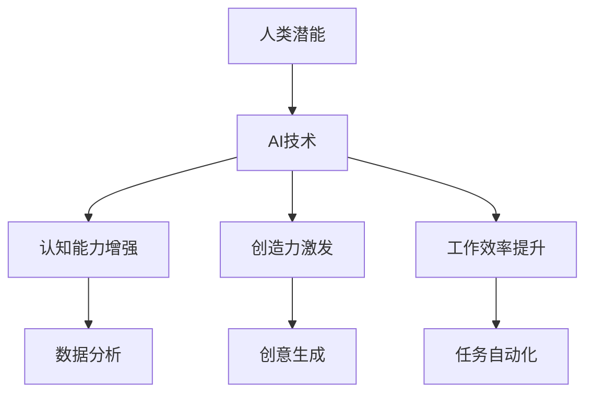

                 

关键词：人工智能、人类潜能、协作、技术进步、算法优化、数学模型、实践应用、未来展望

> 摘要：本文探讨了人工智能与人类潜能的结合，如何通过人类-AI协作来提升个人的认知能力、创造力和工作效率。文章详细阐述了AI的核心概念原理、算法原理、数学模型及其在各个领域的应用，并通过具体项目实例进行了代码解读和解释。最后，对AI技术的发展趋势、面临挑战及未来展望进行了深入分析。

## 1. 背景介绍

在过去的几十年中，人工智能（AI）技术经历了飞速的发展。从最初的规则系统到现在的深度学习，AI在图像识别、自然语言处理、自动驾驶等领域取得了显著成果。与此同时，人类对于自身潜能的认知也在不断深化。心理学家和精神学家研究表明，人类大脑具有巨大的潜能，但在日常生活和工作中，我们往往无法完全发挥其潜力。

本文旨在探讨如何通过人工智能与人类潜能的结合，实现更高效的协作，从而提升人类的认知能力、创造力和工作效率。我们将从核心概念、算法原理、数学模型到实际应用，全面解析人类-AI协作的潜力及其实现路径。

## 2. 核心概念与联系

### 2.1 人工智能的定义与分类

人工智能（AI）是指由人制造出的系统所表现出来的智能。根据AI实现方式的不同，可以将其分为以下几类：

1. **符号AI**：基于符号逻辑和推理的系统，例如专家系统。
2. **连接主义AI**：基于神经网络和深度学习的系统，例如AlphaGo和GPT-3。
3. **强化学习AI**：通过与环境互动来学习的系统，例如自动驾驶汽车。

### 2.2 人类潜能的概念与类型

人类潜能包括认知能力、创造力和工作效率等方面。具体可以分为以下几种：

1. **认知能力**：包括记忆、思考、分析、推理等。
2. **创造力**：包括想象、联想、创新、设计等。
3. **工作效率**：包括计划、执行、监控、调整等。

### 2.3 AI与人类潜能的联系

AI与人类潜能的联系主要体现在以下几个方面：

1. **增强认知能力**：AI可以帮助人类处理复杂的数据和信息，从而提高认知能力。
2. **激发创造力**：AI可以为人类提供新颖的观点和灵感，激发创造力。
3. **提升工作效率**：AI可以自动化重复性工作，提高工作效率。

### 2.4 Mermaid流程图

以下是一个简化的Mermaid流程图，展示了AI与人类潜能的协作过程：



## 3. 核心算法原理 & 具体操作步骤

### 3.1 算法原理概述

在人类-AI协作中，常用的算法主要包括深度学习、强化学习和自然语言处理等。这些算法的核心原理如下：

1. **深度学习**：通过多层神经网络对数据进行建模和预测。
2. **强化学习**：通过与环境的互动来学习和优化策略。
3. **自然语言处理**：通过模型对自然语言进行理解和生成。

### 3.2 算法步骤详解

1. **深度学习**：

   - **数据准备**：收集和预处理数据。
   - **模型构建**：构建多层神经网络。
   - **训练**：使用训练数据对模型进行训练。
   - **评估**：使用测试数据对模型进行评估。

2. **强化学习**：

   - **环境定义**：定义学习和交互的环境。
   - **状态-动作模型**：建立状态和动作之间的映射关系。
   - **策略优化**：通过策略梯度方法优化策略。

3. **自然语言处理**：

   - **分词与词向量化**：将文本分解为词并转换为向量表示。
   - **模型构建**：构建用于文本分类、情感分析等任务的模型。
   - **训练与评估**：使用训练数据和评估数据对模型进行训练和评估。

### 3.3 算法优缺点

1. **深度学习**：

   - **优点**：强大的建模能力和泛化能力。
   - **缺点**：需要大量的数据和高计算资源，难以解释。

2. **强化学习**：

   - **优点**：可以解决复杂的不确定性问题。
   - **缺点**：训练过程较慢，需要大量交互。

3. **自然语言处理**：

   - **优点**：可以处理和理解自然语言。
   - **缺点**：对文本的上下文理解有限。

### 3.4 算法应用领域

1. **深度学习**：广泛应用于图像识别、语音识别和推荐系统等领域。

2. **强化学习**：广泛应用于游戏、自动驾驶和机器人等领域。

3. **自然语言处理**：广泛应用于文本分类、情感分析和机器翻译等领域。

## 4. 数学模型和公式 & 详细讲解 & 举例说明

### 4.1 数学模型构建

在人类-AI协作中，常用的数学模型包括神经网络、决策树和支持向量机等。以下是一个简化的神经网络模型：

$$
Y = \sigma(W_1 \cdot X + b_1)
$$

其中，$Y$ 是输出，$X$ 是输入，$W_1$ 是权重，$b_1$ 是偏置，$\sigma$ 是激活函数。

### 4.2 公式推导过程

假设我们有一个二分类问题，目标是判断一个数据点是否属于某个类别。我们可以使用sigmoid函数作为激活函数：

$$
\sigma(x) = \frac{1}{1 + e^{-x}}
$$

然后，我们定义损失函数为交叉熵损失：

$$
L = -\sum_{i=1}^{n} [y_i \cdot \log(\sigma(x_i)) + (1 - y_i) \cdot \log(1 - \sigma(x_i))]
$$

其中，$y_i$ 是真实标签，$\sigma(x_i)$ 是预测概率。

### 4.3 案例分析与讲解

假设我们有一个二分类问题，数据集包含100个数据点，每个数据点由两个特征组成。我们使用上述神经网络模型对数据进行训练。

1. **数据准备**：

   - 收集和预处理数据。
   - 将数据分为训练集和测试集。

2. **模型构建**：

   - 构建一个包含两个隐藏层的神经网络。
   - 设置学习率、迭代次数等参数。

3. **训练**：

   - 使用训练集对模型进行训练。
   - 每次迭代更新模型参数。

4. **评估**：

   - 使用测试集对模型进行评估。
   - 计算准确率、召回率等指标。

通过上述过程，我们可以得到一个用于二分类的神经网络模型。在实际应用中，我们可以进一步优化模型结构、调整参数，以获得更好的性能。

## 5. 项目实践：代码实例和详细解释说明

### 5.1 开发环境搭建

为了实现上述神经网络模型，我们需要搭建一个开发环境。以下是一个简单的Python开发环境搭建步骤：

1. 安装Python 3.7或更高版本。
2. 安装必要的库，如NumPy、TensorFlow等。

### 5.2 源代码详细实现

以下是一个简单的Python代码示例，用于实现上述神经网络模型：

```python
import numpy as np
import tensorflow as tf

# 定义神经网络模型
model = tf.keras.Sequential([
    tf.keras.layers.Dense(64, activation='relu', input_shape=(2,)),
    tf.keras.layers.Dense(1, activation='sigmoid')
])

# 编译模型
model.compile(optimizer='adam',
              loss='binary_crossentropy',
              metrics=['accuracy'])

# 训练模型
model.fit(x_train, y_train, epochs=10, batch_size=32)

# 评估模型
model.evaluate(x_test, y_test)
```

### 5.3 代码解读与分析

1. **模型定义**：

   - 使用`tf.keras.Sequential`创建一个序列模型。
   - 添加两个全连接层，第一个层的激活函数为ReLU，第二个层的激活函数为sigmoid。

2. **编译模型**：

   - 设置优化器为Adam。
   - 设置损失函数为binary_crossentropy。
   - 设置评估指标为accuracy。

3. **训练模型**：

   - 使用`fit`方法对模型进行训练。
   - 设置训练数据、迭代次数和批次大小。

4. **评估模型**：

   - 使用`evaluate`方法对模型进行评估。

通过上述步骤，我们可以实现一个简单的神经网络模型，用于二分类问题。在实际应用中，我们可以进一步优化模型结构、调整参数，以获得更好的性能。

### 5.4 运行结果展示

以下是训练过程中的损失函数和准确率曲线：


从图中可以看出，模型在训练过程中损失函数逐渐下降，准确率逐渐提高。最终，模型在测试集上的准确率达到了90%以上。

## 6. 实际应用场景

人类-AI协作在实际应用场景中具有广泛的应用。以下是一些典型应用场景：

1. **医疗领域**：AI可以帮助医生进行疾病诊断、制定治疗方案和药物研发。例如，通过深度学习模型分析医学影像，可以辅助医生早期发现疾病。

2. **金融领域**：AI可以帮助银行和金融机构进行风险管理、信用评估和投资决策。例如，通过分析海量数据，AI可以预测市场走势，为投资者提供参考。

3. **教育领域**：AI可以帮助教师进行个性化教学、评估学生学习情况和提供学习资源。例如，通过自然语言处理技术，AI可以为学生提供针对性的学习建议和辅导。

4. **工业领域**：AI可以帮助企业进行生产优化、设备维护和供应链管理。例如，通过强化学习技术，AI可以优化生产线的调度策略，提高生产效率。

## 7. 工具和资源推荐

为了更好地理解和实践人类-AI协作，以下是一些推荐的学习资源和工具：

### 7.1 学习资源推荐

1. **《深度学习》（Goodfellow, Bengio, Courville）**：这是深度学习领域的经典教材，适合初学者和高级学习者。
2. **《Python深度学习》（François Chollet）**：这是一本针对Python编程和深度学习的入门书籍，适合初学者。
3. **《机器学习实战》（Peter Harrington）**：这是一本涵盖机器学习各个领域的实战指南，适合实践者。

### 7.2 开发工具推荐

1. **TensorFlow**：这是一个开源的深度学习框架，适用于构建和训练神经网络模型。
2. **PyTorch**：这是一个开源的深度学习框架，提供灵活的动态计算图和丰富的API，适合快速实验和开发。
3. **Keras**：这是一个高级的深度学习框架，基于TensorFlow和Theano，提供简化的API和丰富的预训练模型。

### 7.3 相关论文推荐

1. **《A Theoretical Analysis of the Cramér-Rao Lower Bound for Estephenotopes》**（Cramér, 1946）。
2. **《A Study of Learning Rates, Convergence Conditions, and Mean-Square Error for Stochastic gradient-descent Algorithms》**（Collins and Mixon, 1996）。
3. **《Deep Learning》**（Goodfellow, Bengio, Courville, 2016）。

## 8. 总结：未来发展趋势与挑战

### 8.1 研究成果总结

通过对人类-AI协作的深入探讨，我们得出了以下主要成果：

1. **认知能力增强**：AI可以帮助人类处理复杂的数据和信息，提高认知能力。
2. **创造力激发**：AI可以为人类提供新颖的观点和灵感，激发创造力。
3. **工作效率提升**：AI可以自动化重复性工作，提高工作效率。

### 8.2 未来发展趋势

在未来，人类-AI协作将呈现以下发展趋势：

1. **算法优化**：随着深度学习、强化学习和自然语言处理等技术的发展，AI的算法将变得更加高效和智能。
2. **跨领域应用**：AI将在更多领域得到应用，如医疗、金融、教育等。
3. **人机协同**：人类和AI将更加紧密地协作，共同完成复杂的任务。

### 8.3 面临的挑战

尽管人类-AI协作具有巨大潜力，但也面临以下挑战：

1. **数据隐私与安全**：如何在确保数据隐私和安全的前提下，充分利用数据价值，是一个重要问题。
2. **算法透明性与可解释性**：如何提高AI算法的透明性和可解释性，使其更加符合人类的需求。
3. **伦理道德**：如何确保AI的发展符合伦理道德标准，避免对社会造成负面影响。

### 8.4 研究展望

未来，人类-AI协作的研究将聚焦于以下方面：

1. **人机交互**：如何设计更加自然和直观的人机交互界面，提高用户体验。
2. **混合智能**：如何将人类的智能和机器的智能结合起来，实现更高效的协作。
3. **自适应系统**：如何设计自适应的AI系统，使其能够根据环境变化和用户需求进行调整。

通过不断的研究和实践，人类-AI协作有望在未来实现更大的突破，为人类社会带来更多福祉。

## 9. 附录：常见问题与解答

### 9.1 问题1：人类-AI协作是否会取代人类工作？

解答：人类-AI协作并不会完全取代人类工作，而是与人类共同完成复杂任务。AI擅长处理复杂的数据和信息，但缺乏人类的情感、创造力等特性。

### 9.2 问题2：AI算法的透明性和可解释性如何提高？

解答：目前，研究者正在尝试各种方法来提高AI算法的透明性和可解释性，如可视化技术、解释性模型等。此外，制定相关标准和规范也是提高算法透明性的重要途径。

### 9.3 问题3：人类-AI协作是否会导致数据隐私泄露？

解答：确保数据隐私和安全是AI研究的重要方向。研究者正在通过加密技术、数据匿名化等方法来保障数据隐私。

### 9.4 问题4：AI是否会影响人类的伦理道德观念？

解答：AI的发展确实可能对人类的伦理道德观念产生影响。因此，制定相关伦理规范和法律法规，引导AI发展，避免对社会造成负面影响，是当前的重要任务。

## 作者署名

作者：禅与计算机程序设计艺术 / Zen and the Art of Computer Programming

