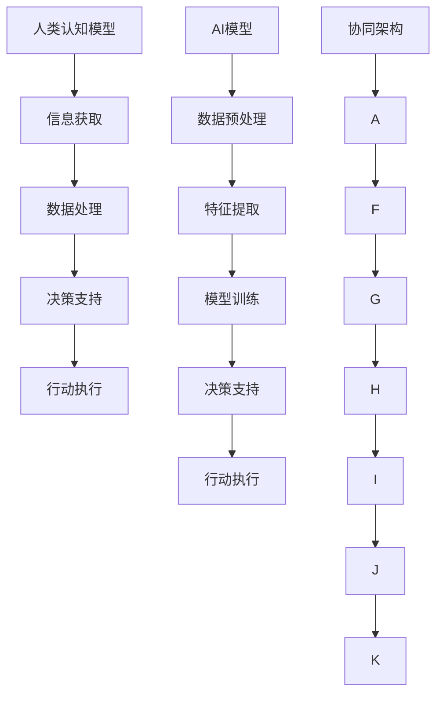

                 

关键词：人工智能，人类协作，潜能增强，AI能力，协同作业

> 摘要：本文旨在探讨人类与人工智能协作的机制和方式，揭示如何通过AI技术增强人类的认知能力和工作效率。文章首先介绍了人类-AI协作的背景，随后深入分析了核心概念和架构，探讨了AI算法原理及其应用，并展示了数学模型和公式，通过项目实践解析了代码实例。文章还阐述了人类-AI协作的实际应用场景，并对未来发展趋势和挑战进行了展望。

## 1. 背景介绍

在过去的几十年中，人工智能（AI）取得了飞速的发展。从早期的规则系统到今天的深度学习，AI技术已经逐渐渗透到社会的各个领域，为人类生活带来了深刻变革。然而，与此同时，我们也意识到，仅仅依靠AI的力量无法解决所有问题。人类与AI的协作成为一种必然趋势，也是提升人类潜能和AI能力的关键途径。

### 1.1 人类-AI协作的意义

人类-AI协作的意义主要体现在以下几个方面：

1. **提升人类认知能力**：AI能够处理大量的数据和复杂的计算任务，为人类提供更加精准和高效的决策支持，从而增强人类的认知能力。
2. **增强工作效率**：通过自动化和智能化的工具，AI能够显著提高人类的工作效率，释放更多的精力去应对更具创造性和战略性的任务。
3. **应对复杂问题**：许多复杂问题超出了人类的能力范围，但通过AI的辅助，可以大幅度提高解决问题的成功率。

### 1.2 人类-AI协作的现状

目前，人类-AI协作主要表现在以下几个方面：

1. **自动化生产**：在制造业中，机器人已经可以完成复杂的组装和加工任务，大大提高了生产效率。
2. **智能客服**：在服务业中，智能客服系统可以处理大量的客户咨询，提供24小时不间断的服务。
3. **医疗诊断**：在医疗领域，AI可以通过分析大量的医学影像数据，辅助医生进行精准的诊断。

## 2. 核心概念与联系

为了深入探讨人类-AI协作的机制，我们需要了解一些核心概念和它们之间的联系。

### 2.1 人类-AI协作的核心概念

1. **人类认知模型**：描述人类如何获取、处理和利用信息，包括感知、记忆、推理等过程。
2. **AI模型**：包括机器学习、深度学习、自然语言处理等，用于模拟和增强人类认知能力。
3. **协同架构**：描述人类与AI如何相互协作，共同完成任务。

### 2.2 核心概念的联系



## 3. 核心算法原理 & 具体操作步骤

### 3.1 算法原理概述

人类-AI协作的核心算法主要包括机器学习算法、自然语言处理算法和强化学习算法。这些算法通过模拟人类的认知过程，实现信息处理、决策支持和行动执行。

### 3.2 算法步骤详解

1. **数据收集**：收集与任务相关的数据，包括文本、图像、声音等。
2. **数据预处理**：清洗和整理数据，使其适合算法处理。
3. **模型选择**：根据任务需求，选择合适的算法模型。
4. **模型训练**：使用训练数据对模型进行训练，优化模型参数。
5. **模型评估**：使用测试数据评估模型性能，进行调整和优化。
6. **模型部署**：将训练好的模型部署到实际应用场景中。

### 3.3 算法优缺点

1. **优点**：
   - **高效性**：算法可以处理海量数据，提高工作效率。
   - **准确性**：通过模型训练，可以提高决策的准确性。
   - **适应性**：算法可以根据不同任务需求进行灵活调整。

2. **缺点**：
   - **数据依赖性**：算法的性能很大程度上依赖于数据质量。
   - **计算成本**：模型训练和优化需要大量的计算资源。

### 3.4 算法应用领域

1. **金融领域**：用于风险控制、投资决策和客户服务。
2. **医疗领域**：用于疾病诊断、药物研发和健康监测。
3. **教育领域**：用于个性化教学、学习评估和课程设计。

## 4. 数学模型和公式 & 详细讲解 & 举例说明

### 4.1 数学模型构建

人类-AI协作中的数学模型主要包括线性回归、逻辑回归、神经网络等。以下是一个简单的线性回归模型：

$$
y = \beta_0 + \beta_1 x
$$

其中，$y$ 是因变量，$x$ 是自变量，$\beta_0$ 和 $\beta_1$ 是模型参数。

### 4.2 公式推导过程

线性回归模型的公式推导基于最小二乘法。首先，我们定义误差平方和：

$$
S = \sum_{i=1}^{n} (y_i - \beta_0 - \beta_1 x_i)^2
$$

然后，对 $S$ 求导并令其等于0，得到：

$$
\frac{\partial S}{\partial \beta_0} = -2 \sum_{i=1}^{n} (y_i - \beta_0 - \beta_1 x_i) = 0
$$

$$
\frac{\partial S}{\partial \beta_1} = -2 \sum_{i=1}^{n} (y_i - \beta_0 - \beta_1 x_i) x_i = 0
$$

解这两个方程，可以得到 $\beta_0$ 和 $\beta_1$ 的最优值。

### 4.3 案例分析与讲解

假设我们有一个房价预测问题，自变量是房屋面积，因变量是房价。通过收集历史数据，我们可以建立一个线性回归模型。以下是一个具体的例子：

$$
y = 1000 + 200 x
$$

在这个例子中，$\beta_0 = 1000$，$\beta_1 = 200$。这意味着每增加1平方米的房屋面积，房价将增加200元。

## 5. 项目实践：代码实例和详细解释说明

### 5.1 开发环境搭建

为了实践人类-AI协作，我们需要搭建一个基本的开发环境。以下是一个简单的Python开发环境搭建步骤：

1. 安装Python 3.x版本。
2. 安装Jupyter Notebook，用于编写和运行Python代码。
3. 安装必要的库，如NumPy、Pandas、Scikit-learn等。

### 5.2 源代码详细实现

以下是一个简单的线性回归模型实现的代码实例：

```python
import numpy as np
import pandas as pd
from sklearn.linear_model import LinearRegression

# 加载数据
data = pd.read_csv('house_data.csv')
X = data[['area']]
y = data['price']

# 创建线性回归模型
model = LinearRegression()

# 模型训练
model.fit(X, y)

# 模型评估
score = model.score(X, y)
print('模型评估分数：', score)

# 预测
new_area = np.array([150])
predicted_price = model.predict(new_area)
print('预测价格：', predicted_price)
```

### 5.3 代码解读与分析

1. **数据加载**：使用Pandas库加载房屋数据。
2. **模型创建**：使用Scikit-learn库创建线性回归模型。
3. **模型训练**：使用训练数据对模型进行训练。
4. **模型评估**：使用训练数据评估模型性能。
5. **预测**：使用模型预测新的房屋价格。

### 5.4 运行结果展示

运行上述代码后，我们得到了模型评估分数和预测价格。这个简单的例子展示了人类-AI协作的基本流程和实现方法。

## 6. 实际应用场景

### 6.1 金融领域

在金融领域，人类-AI协作已经得到了广泛应用。例如，在股票交易中，AI可以帮助投资者分析市场数据，提供交易策略建议。通过AI的辅助，投资者可以更加精准地预测市场走势，提高交易成功率。

### 6.2 医疗领域

在医疗领域，人类-AI协作可以用于疾病诊断、药物研发和健康监测。例如，AI可以通过分析医学影像数据，辅助医生进行肺癌的早期诊断。通过AI的辅助，医生可以更加准确地诊断疾病，提高治疗效果。

### 6.3 教育领域

在教育领域，人类-AI协作可以用于个性化教学、学习评估和课程设计。例如，AI可以根据学生的学习情况，提供个性化的学习建议，帮助学生更好地掌握知识。通过AI的辅助，教师可以更加高效地开展教学工作。

## 7. 工具和资源推荐

### 7.1 学习资源推荐

1. 《深度学习》（Ian Goodfellow, Yoshua Bengio, Aaron Courville著）是一本深度学习的经典教材，适合初学者和进阶者。
2. 《Python编程：从入门到实践》（埃里克·马瑟斯著）是一本适合Python初学者的入门书籍。

### 7.2 开发工具推荐

1. Jupyter Notebook：用于编写和运行Python代码。
2. PyCharm：一款强大的Python集成开发环境（IDE）。

### 7.3 相关论文推荐

1. "Deep Learning for Text Classification"（2017），该论文介绍了深度学习在文本分类中的应用。
2. "A Comprehensive Survey on Human-AI Collaboration"（2020），该论文对人类-AI协作进行了全面的综述。

## 8. 总结：未来发展趋势与挑战

### 8.1 研究成果总结

人类-AI协作在过去的几十年中取得了显著进展。通过机器学习、自然语言处理和强化学习等算法，AI已经能够模拟和增强人类的认知能力。在金融、医疗和教育等领域的应用也取得了显著成效。

### 8.2 未来发展趋势

未来，人类-AI协作将继续深入发展。随着计算能力的提升和数据量的增加，AI将在更多领域发挥重要作用。例如，在智能制造、智慧城市和生物科技等领域，AI将带来更多的创新和变革。

### 8.3 面临的挑战

尽管人类-AI协作前景广阔，但也面临一些挑战。例如，数据隐私和安全、算法透明性和解释性、以及AI对就业的影响等。这些挑战需要我们深入研究并制定相应的解决方案。

### 8.4 研究展望

未来，人类-AI协作的研究应重点关注以下几个方面：

1. **算法优化**：提高AI算法的准确性和效率。
2. **人机交互**：改善人类与AI的交互体验，提高协作效率。
3. **伦理和法律**：制定相应的伦理和法律框架，确保AI的安全和公正。

## 9. 附录：常见问题与解答

### 9.1 问题1

**Q：人类-AI协作是否会替代人类工作？**

**A：** 人类-AI协作不会完全替代人类工作，而是作为一种辅助工具，提高人类的工作效率和创新能力。在某些领域，AI可以替代重复性高、风险性大的工作，但需要人类进行监督和决策。

### 9.2 问题2

**Q：如何确保AI的透明性和解释性？**

**A：** 确保AI的透明性和解释性是当前研究的热点问题。可以通过以下方法提高AI的透明性：
1. **模型可解释性**：开发可解释的算法模型，使其易于理解。
2. **数据可视化**：将数据可视化，帮助用户更好地理解数据特征。
3. **算法审计**：对算法进行审计，确保其符合伦理和法律要求。

## 结束语

人类-AI协作是一种新型的合作模式，旨在充分发挥人类的创造力和AI的计算能力。通过本文的探讨，我们希望读者对人类-AI协作有更深入的理解，并能够将其应用于实际场景中。在未来的发展中，人类-AI协作将继续发挥重要作用，为人类社会带来更多的创新和变革。

### 作者署名

作者：禅与计算机程序设计艺术 / Zen and the Art of Computer Programming

（完）

--------------------------------------------------------------------

