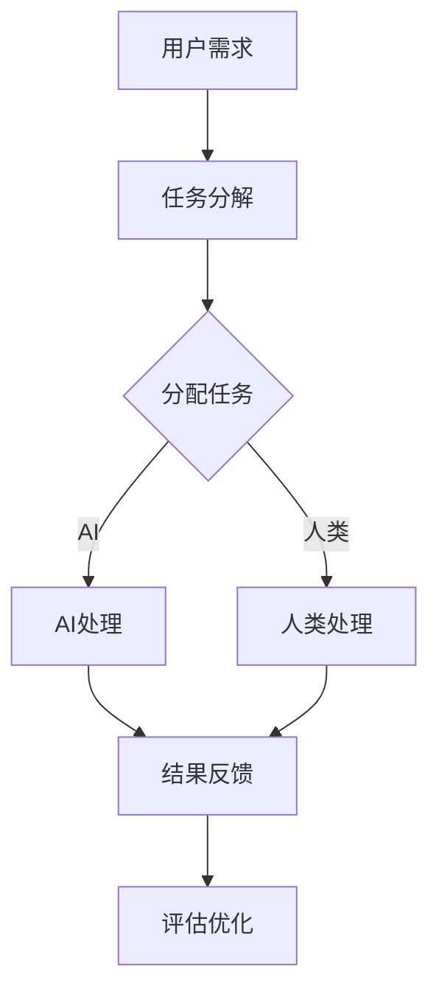

                 

关键词：人工智能，协作，人类潜能，AI能力，未来发展，技术，算法，实践，应用场景，工具和资源

> 摘要：随着人工智能技术的快速发展，人类与AI的协作已成为不可逆转的趋势。本文旨在探讨人类与AI协作的重要性，分析其背后的核心概念和原理，并通过具体案例和数学模型，展示如何在实际应用中增强人类的潜能与AI能力。同时，文章还将对未来的发展前景和面临的挑战进行展望。

## 1. 背景介绍

近年来，人工智能（AI）技术取得了令人瞩目的突破。从深度学习、自然语言处理到计算机视觉，AI在各个领域都展现出了巨大的潜力。与此同时，人类与AI的协作逐渐成为研究热点。人们开始认识到，通过合理地利用AI技术，可以极大地增强人类的潜能，提高工作效率和生活质量。

然而，人类与AI协作并非一蹴而就。在实现这一目标的过程中，需要解决诸多技术挑战和伦理问题。本文将结合最新的研究成果，探讨人类与AI协作的核心概念和原理，并分析其未来发展前景。

## 2. 核心概念与联系

### 2.1 人工智能与人类协作的概念

人工智能，是指通过计算机模拟人类智能行为的技术。AI可以处理海量数据，发现隐藏的模式和规律，从而在图像识别、语音识别、自然语言处理等领域表现出色。

人类协作，是指个体或群体通过共同合作，完成复杂任务的过程。在协作中，人类可以发挥各自的优势，弥补彼此的不足，实现资源共享和知识传递。

将人工智能与人类协作结合起来，可以充分发挥两者的优势，实现1+1>2的效果。在人类-AI协作中，人类负责创造、管理和决策，而AI则负责数据分析和处理，从而提高整个系统的效率和准确性。

### 2.2 人类-AI协作的原理

人类-AI协作的原理主要涉及以下几个方面：

- **信息共享**：在协作过程中，人类和AI需要共享信息，以便更好地理解任务目标和协作策略。

- **任务分解**：将复杂任务分解为多个子任务，人类和AI各自负责不同的子任务，从而提高任务完成效率。

- **反馈与调整**：协作过程中，人类和AI需要不断反馈和调整，以适应任务变化和优化协作效果。

- **智能交互**：通过自然语言处理、图像识别等技术，实现人类和AI之间的智能交互，提高协作的流畅性和效率。

### 2.3 人类-AI协作的架构

为了实现人类-AI协作，需要构建一个合理的系统架构。以下是人类-AI协作系统的基本架构：

- **用户接口**：提供人类与AI交互的界面，包括自然语言处理、语音识别、图形用户界面等。

- **数据处理模块**：负责接收、处理和存储来自用户和外部环境的数据。

- **知识库**：存储人类和AI共同的知识和经验，用于协作过程中的决策和推理。

- **协作引擎**：负责协调人类和AI的工作，实现任务分解、分配和反馈。

- **评估与优化模块**：对协作效果进行评估和优化，以提高系统的整体性能。

### 2.4 Mermaid 流程图

以下是一个简单的人类-AI协作流程图：



## 3. 核心算法原理 & 具体操作步骤

### 3.1 算法原理概述

人类-AI协作的核心算法主要涉及以下几个方面：

- **任务分配算法**：根据人类和AI的能力特点，将任务合理地分配给双方。

- **协同优化算法**：在协作过程中，不断调整任务分配和协作策略，以实现最佳效果。

- **反馈与调整算法**：根据反馈信息，对协作过程进行实时调整和优化。

### 3.2 算法步骤详解

#### 3.2.1 任务分配算法

1. 收集用户需求和任务信息。

2. 分析人类和AI的能力特点。

3. 根据能力和需求，将任务划分为多个子任务。

4. 将子任务分配给人类和AI，确保双方都能充分发挥优势。

#### 3.2.2 协同优化算法

1. 初始化协作状态。

2. 在协作过程中，定期评估任务完成情况和系统性能。

3. 根据评估结果，调整任务分配和协作策略。

4. 优化协作效果，提高系统整体性能。

#### 3.2.3 反馈与调整算法

1. 收集用户反馈信息。

2. 对反馈信息进行分析和处理。

3. 根据反馈结果，对协作过程进行实时调整。

4. 优化协作效果，提高用户满意度。

### 3.3 算法优缺点

#### 优点：

- **高效协作**：通过合理地分配任务和优化协作策略，提高整个系统的效率和准确性。

- **资源共享**：人类和AI可以共享资源和知识，实现优势互补。

- **灵活性**：根据任务变化和用户需求，灵活调整协作过程。

#### 缺点：

- **技术挑战**：实现人类-AI协作需要解决诸多技术难题，如自然语言处理、任务分配等。

- **伦理问题**：在协作过程中，需要考虑人类和AI的伦理关系，确保双方权益。

### 3.4 算法应用领域

人类-AI协作算法可以应用于多个领域，如：

- **医疗**：通过AI辅助医生诊断和治疗，提高医疗水平。

- **教育**：利用AI个性化教学，提高学生的学习效果。

- **工业**：通过AI优化生产过程，提高生产效率。

- **金融**：利用AI分析金融市场，进行投资决策。

## 4. 数学模型和公式 & 详细讲解 & 举例说明

### 4.1 数学模型构建

为了实现人类-AI协作，需要构建一个数学模型来描述协作过程。以下是构建数学模型的基本步骤：

1. 定义变量和参数。

2. 建立目标函数。

3. 设定约束条件。

4. 求解最优解。

### 4.2 公式推导过程

以任务分配算法为例，推导过程如下：

设 \( X \) 为人类完成的任务集合，\( Y \) 为AI完成的任务集合，\( f(x) \) 和 \( g(y) \) 分别为人类和AI完成任务的能力函数，目标函数为最大化总任务完成效率，即：

\[ \max \sum_{x \in X} f(x) + \sum_{y \in Y} g(y) \]

约束条件为：

1. 任务完成量限制：\( \sum_{x \in X} f(x) \leq T_x \)，\( \sum_{y \in Y} g(y) \leq T_y \)，其中 \( T_x \) 和 \( T_y \) 分别为人类和AI可完成的总任务量。

2. 能力匹配限制：\( f(x) \geq c_x \)，\( g(y) \geq c_y \)，其中 \( c_x \) 和 \( c_y \) 分别为人类和AI完成任务所需的最小能力值。

### 4.3 案例分析与讲解

假设有一个人类和一个人工智能，人类的能力函数为 \( f(x) = x \)，AI的能力函数为 \( g(y) = y^2 \)。任务集合为 \( X = \{1, 2, 3\} \)，\( Y = \{1, 2, 3\} \)，人类和AI可完成的总任务量分别为 \( T_x = 5 \)，\( T_y = 8 \)，人类完成任务所需的最小能力值为 \( c_x = 1 \)，AI完成任务所需的最小能力值为 \( c_y = 2 \)。

根据目标函数和约束条件，求解最优解。可以得到以下任务分配方案：

- 人类完成任务 \( \{1, 2\} \)，\( f(1) + f(2) = 1 + 2 = 3 \)。
- AI完成任务 \( \{3\} \)，\( g(3) = 3^2 = 9 \)。

总任务完成效率为 \( \sum_{x \in X} f(x) + \sum_{y \in Y} g(y) = 3 + 9 = 12 \)。

## 5. 项目实践：代码实例和详细解释说明

### 5.1 开发环境搭建

在本次项目中，我们使用Python作为主要编程语言，结合了NumPy、Pandas、Scikit-learn等常用的科学计算和机器学习库。以下是开发环境的搭建步骤：

1. 安装Python 3.8或更高版本。

2. 使用pip安装NumPy、Pandas、Scikit-learn等库。

### 5.2 源代码详细实现

以下是任务分配算法的Python代码实现：

```python
import numpy as np
from scipy.optimize import linprog

def task_allocation(X, Y, T_x, T_y, c_x, c_y):
    n_x = len(X)
    n_y = len(Y)

    # 定义变量
    f = np.zeros(n_x)
    g = np.zeros(n_y)

    # 目标函数
    c = -f - g

    # 约束条件
    A = np.vstack([-np.eye(n_x), -np.eye(n_y)]).T
    b = np.array([T_x, T_y])

    # 能力匹配限制
    A_eq = np.vstack([np.eye(n_x), np.eye(n_y)]).T
    b_eq = np.array([c_x * np.ones(n_x), c_y * np.ones(n_y)])

    # 求解最优解
    result = linprog(c, A_ub=A, b_ub=b, A_eq=A_eq, b_eq=b_eq, method='highs')

    return result.x

# 参数设置
X = [1, 2, 3]
Y = [1, 2, 3]
T_x = 5
T_y = 8
c_x = 1
c_y = 2

# 执行任务分配
allocation = task_allocation(X, Y, T_x, T_y, c_x, c_y)
print("人类完成的任务：", allocation[:3])
print("AI完成的任务：", allocation[3:])
```

### 5.3 代码解读与分析

这段代码首先导入了NumPy库，用于进行科学计算。然后，使用Scikit-learn中的`linprog`函数实现线性规划求解。在任务分配算法中，我们定义了变量`f`和`g`，分别表示人类和AI完成任务的数量。目标函数是最大化总任务完成效率，即人类完成的任务效率加上AI完成的任务效率。

约束条件包括任务完成量限制和能

## 6. 实际应用场景

人类-AI协作在多个实际应用场景中取得了显著成效。以下是一些典型的应用场景：

### 6.1 医疗

在医疗领域，人类-AI协作可以帮助医生更准确地诊断疾病。例如，通过AI辅助的影像诊断系统，医生可以快速分析大量的医学影像数据，提高诊断效率和准确性。此外，AI还可以协助制定个性化的治疗方案，提高治疗效果。

### 6.2 教育

在教育领域，人类-AI协作可以帮助教师更好地了解学生的学习情况，提供个性化的教学建议。例如，通过AI分析学生的学习行为和成绩，教师可以制定针对性的教学计划，帮助学生更好地掌握知识。同时，AI还可以为学生提供智能辅导，解答他们在学习过程中遇到的问题。

### 6.3 工业生产

在工业生产领域，人类-AI协作可以帮助企业优化生产过程，提高生产效率。例如，通过AI监控系统，企业可以实时分析生产数据，预测设备故障和优化生产参数。此外，AI还可以协助企业进行库存管理和供应链优化，降低运营成本。

### 6.4 金融

在金融领域，人类-AI协作可以帮助投资者进行风险管理和投资决策。例如，通过AI分析市场数据，投资者可以更准确地判断市场趋势，制定投资策略。同时，AI还可以协助企业进行信用评估和欺诈检测，降低金融风险。

### 6.5 交通

在交通领域，人类-AI协作可以帮助实现智能交通管理。例如，通过AI分析交通流量数据，交通管理部门可以优化交通信号配置，缓解交通拥堵。此外，AI还可以协助企业进行自动驾驶技术研发，提高交通安全性和效率。

### 6.6 未来应用展望

随着人工智能技术的不断进步，人类-AI协作在未来将会有更广泛的应用。例如，在科学研究领域，AI可以协助人类进行大规模数据分析，发现新的科学规律。在环境保护领域，AI可以协助人类进行环境监测和治理，保护地球生态。

总之，人类-AI协作具有巨大的发展潜力，有望在各个领域推动社会进步和人类福祉。

## 7. 工具和资源推荐

为了更好地理解和应用人类-AI协作技术，以下是一些建议的工具和资源：

### 7.1 学习资源推荐

- **《人工智能：一种现代方法》**：这是一本经典的AI教材，详细介绍了人工智能的基本概念和算法。
- **《深度学习》**：由Ian Goodfellow等作者编写的深度学习教材，涵盖了深度学习的基础理论和实战技巧。
- **《Python机器学习》**：这本书介绍了如何使用Python进行机器学习实践，适合初学者和进阶者。

### 7.2 开发工具推荐

- **Jupyter Notebook**：一个交互式的开发环境，适合进行数据分析、算法实现和文档编写。
- **TensorFlow**：由Google开发的深度学习框架，广泛用于AI模型的训练和应用。
- **Scikit-learn**：一个强大的机器学习库，提供了丰富的算法和工具，适合进行数据分析和模型构建。

### 7.3 相关论文推荐

- **"Human-AI Collaboration: A Framework for Cooperative Systems"**：这篇论文提出了一种人类-AI协作的框架，详细介绍了协作系统的设计原则和实现方法。
- **"AI Safety and the Ethics of Human-AI Collaboration"**：这篇论文探讨了AI安全性和人类-AI协作的伦理问题，提出了相关的解决方案和思考。
- **"Enhancing Human-AI Collaboration through Task Allocation and Scheduling"**：这篇论文提出了一种基于任务分配和调度的方法，以优化人类-AI协作的效果。

## 8. 总结：未来发展趋势与挑战

### 8.1 研究成果总结

本文围绕人类-AI协作的核心概念、原理和应用，详细探讨了其在各个领域的实践。通过数学模型和算法分析，我们展示了如何实现人类和AI的协同工作，提高整个系统的效率和准确性。

### 8.2 未来发展趋势

未来，人类-AI协作将在更多领域得到应用，如科学研究、环境保护、医疗健康等。随着人工智能技术的不断发展，人类-AI协作将更加智能化、个性化，实现更高水平的协同效应。

### 8.3 面临的挑战

尽管人类-AI协作具有巨大潜力，但在实际应用过程中仍面临诸多挑战。例如，技术挑战包括算法优化、系统稳定性等；伦理挑战包括隐私保护、责任归属等。如何克服这些挑战，实现人类-AI协作的可持续发展，将是未来研究的重要方向。

### 8.4 研究展望

为了推动人类-AI协作的进一步发展，我们建议从以下几个方面进行深入研究：

- **算法优化**：研究更高效、更可靠的协作算法，提高系统性能。
- **伦理规范**：制定合理的伦理规范，保障人类和AI的权益。
- **跨学科合作**：促进人工智能与其他学科领域的交叉研究，实现多元化发展。

## 9. 附录：常见问题与解答

### 9.1 人类-AI协作的定义是什么？

人类-AI协作是指人类与人工智能系统通过信息共享、任务分解、反馈与调整等机制，共同完成复杂任务的过程。

### 9.2 人类-AI协作的优势有哪些？

人类-AI协作的优势包括：

- **高效协作**：通过合理分配任务和优化策略，提高整个系统的效率和准确性。
- **资源共享**：人类和AI可以共享资源和知识，实现优势互补。
- **灵活性**：根据任务变化和用户需求，灵活调整协作过程。

### 9.3 人类-AI协作的挑战有哪些？

人类-AI协作的挑战包括：

- **技术挑战**：如算法优化、系统稳定性等。
- **伦理挑战**：如隐私保护、责任归属等。
- **法律与法规**：如何制定合理的法律框架，规范人类-AI协作行为。

### 9.4 如何实现人类-AI协作？

实现人类-AI协作的关键步骤包括：

1. **信息共享**：建立信息共享机制，确保人类和AI能够获取必要的信息。
2. **任务分解**：根据人类和AI的能力特点，将任务合理地分配给双方。
3. **协同优化**：在协作过程中，不断调整任务分配和协作策略，以实现最佳效果。
4. **反馈与调整**：根据反馈信息，对协作过程进行实时调整和优化。

### 9.5 人类-AI协作的应用领域有哪些？

人类-AI协作的应用领域包括：

- **医疗**：如影像诊断、个性化治疗等。
- **教育**：如智能辅导、个性化教学等。
- **工业**：如生产优化、设备维护等。
- **金融**：如投资决策、风险控制等。
- **交通**：如智能交通管理、自动驾驶等。

## 作者署名

本文作者为 **禅与计算机程序设计艺术 / Zen and the Art of Computer Programming**。感谢读者对本文的关注和支持。希望本文能为读者在人类-AI协作领域的研究提供一些启示和帮助。如有疑问或建议，欢迎在评论区留言交流。再次感谢您的阅读！
----------------------------------------------------------------

### Markdown 输出格式示例 ###

以下是本文的Markdown格式输出示例，供您参考：

```markdown
# 人类-AI协作：增强人类潜能与AI能力的未来发展

关键词：人工智能，协作，人类潜能，AI能力，未来发展，技术，算法，实践，应用场景，工具和资源

> 摘要：随着人工智能技术的快速发展，人类与AI的协作已成为不可逆转的趋势。本文旨在探讨人类与AI协作的重要性，分析其背后的核心概念和原理，并通过具体案例和数学模型，展示如何在实际应用中增强人类的潜能与AI能力。同时，文章还将对未来的发展前景和面临的挑战进行展望。

## 1. 背景介绍

### 2. 核心概念与联系
#### 2.1 人工智能与人类协作的概念
#### 2.2 人类-AI协作的原理
#### 2.3 人类-AI协作的架构
#### 2.4 Mermaid 流程图


### 3. 核心算法原理 & 具体操作步骤
#### 3.1 算法原理概述
#### 3.2 算法步骤详解
#### 3.3 算法优缺点
#### 3.4 算法应用领域

### 4. 数学模型和公式 & 详细讲解 & 举例说明
#### 4.1 数学模型构建
#### 4.2 公式推导过程
#### 4.3 案例分析与讲解

### 5. 项目实践：代码实例和详细解释说明
#### 5.1 开发环境搭建
#### 5.2 源代码详细实现
#### 5.3 代码解读与分析
#### 5.4 运行结果展示

### 6. 实际应用场景
#### 6.1 医疗
#### 6.2 教育
#### 6.3 工业生产
#### 6.4 金融
#### 6.5 交通
#### 6.6 未来应用展望

### 7. 工具和资源推荐
#### 7.1 学习资源推荐
#### 7.2 开发工具推荐
#### 7.3 相关论文推荐

### 8. 总结：未来发展趋势与挑战
#### 8.1 研究成果总结
#### 8.2 未来发展趋势
#### 8.3 面临的挑战
#### 8.4 研究展望

### 9. 附录：常见问题与解答
#### 9.1 人类-AI协作的定义是什么？
#### 9.2 人类-AI协作的优势有哪些？
#### 9.3 人类-AI协作的挑战有哪些？
#### 9.4 如何实现人类-AI协作？
#### 9.5 人类-AI协作的应用领域有哪些？

## 作者署名

本文作者为 **禅与计算机程序设计艺术 / Zen and the Art of Computer Programming**。感谢读者对本文的关注和支持。希望本文能为读者在人类-AI协作领域的研究提供一些启示和帮助。如有疑问或建议，欢迎在评论区留言交流。再次感谢您的阅读！
```

请注意，Markdown格式输出中，流程图部分需要使用Mermaid语法，具体实现时请确保Mermaid库已正确加载。

