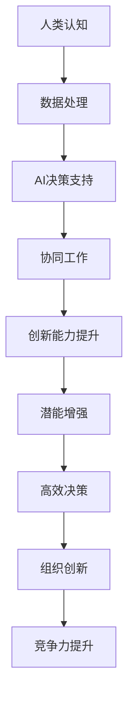

                 

关键词：人类与AI协作，增强人类潜能，AI能力，融合发展，技术前景

摘要：本文探讨了人类与人工智能（AI）协作的潜在价值，分析了AI如何通过增强人类的认知和执行能力，推动个人和组织的效率提升。文章从背景介绍、核心概念与联系、核心算法原理、数学模型和公式、项目实践、实际应用场景、工具和资源推荐等多个方面，全面解析了人类与AI协作的融合发展前景，并提出了未来发展的挑战与研究方向。

## 1. 背景介绍

### AI的崛起与人类潜能的挑战

人工智能自20世纪中叶诞生以来，经历了快速的发展。从简单的规则系统到深度学习，再到目前的大规模语言模型和智能助手，AI在各个领域展现出了强大的能力。随着技术的进步，AI的应用范围越来越广泛，从工业自动化到医疗诊断，从金融分析到教育辅导，AI已经成为现代社会不可或缺的一部分。

然而，AI的崛起同时也带来了对人类潜能的挑战。在许多行业中，AI能够比人类更快、更准确地进行数据处理和决策，这使得一些传统岗位面临被替代的风险。此外，AI的智能程度不断提升，使得人类在某些任务上的优势变得不再明显，甚至可能被削弱。

### 人类潜能的增强需求

面对AI的竞争，人类需要寻找新的方式来增强自身潜能，以保持竞争优势。这不仅涉及到提高个体的认知能力，还包括提升决策效率、创新能力和适应能力。通过与技术相结合，人类可以在更复杂的任务中发挥优势，实现潜能的最大化。

### 人类与AI协作的意义

人类与AI的协作，不仅能够弥补人类在某些任务上的不足，还能通过AI的辅助，增强人类的能力。这种协作模式不仅有助于提升个人的工作效率，还能推动组织创新和竞争力提升。人类与AI协作的意义在于：

1. **增强认知能力**：AI可以处理大量数据，提供快速准确的决策支持，帮助人类在复杂问题中找到最优解。
2. **提高工作效率**：AI能够自动化重复性任务，释放人类的时间和精力，专注于更有创造性的工作。
3. **促进创新**：AI可以提供新的视角和解决方案，激发人类的创造力，推动技术创新。
4. **扩展人类能力**：通过融合人类与AI的能力，人类可以应对更复杂的任务，拓展自身能力的边界。

本文旨在探讨人类与AI协作的原理、方法及应用，分析其潜在的发展前景和面临的挑战，为未来的人类与AI融合提供理论和实践指导。

## 2. 核心概念与联系

### 人类潜能与AI能力的关系

人类潜能与AI能力之间的关系是本文的核心概念之一。人类潜能指的是人类在认知、情感、创造力等方面的自然能力，而AI能力则是指人工智能系统在数据处理、模式识别、决策支持等方面的技术能力。两者的关系可以概括为：

- **互补性**：人类和AI在能力和任务上存在互补性。人类擅长处理复杂、模糊的任务，而AI擅长处理数据密集、规则明确的任务。
- **协同性**：人类和AI可以协同工作，各自发挥优势，共同完成任务。通过协作，可以实现1+1>2的效果。
- **融合性**：人类与AI的融合不仅体现在任务完成上，还体现在认知和能力的提升上。通过AI的辅助，人类可以在认知和技能上获得新的突破。

### 核心概念原理和架构

为了更好地理解人类与AI协作的原理，我们可以借助Mermaid流程图来展示核心概念和架构。以下是一个简单的Mermaid流程图示例：



### Mermaid流程节点中的注意事项

在Mermaid流程图中，流程节点的描述应当简洁明了，避免使用括号、逗号等特殊字符，以免影响流程图的绘制。例如，上述流程图中各个节点的描述如下：

- A: 人类认知
- B: 数据处理
- C: AI决策支持
- D: 协同工作
- E: 创新能力提升
- F: 潜能增强
- G: 高效决策
- H: 组织创新
- I: 竞争力提升

通过上述流程图，我们可以清晰地看到人类与AI协作的流程和核心概念之间的关系。这一流程图不仅有助于理解文章的内容，也为后续的讨论和分析提供了直观的参考。

## 3. 核心算法原理 & 具体操作步骤

### 3.1 算法原理概述

人类与AI协作的核心在于如何有效地融合人类和AI的能力，实现协同工作。这一过程涉及到多个核心算法的原理和操作步骤。以下是几种常用的算法原理：

1. **决策树算法**：决策树是一种树形结构，用于分类或回归任务。它通过一系列条件判断，将数据划分为不同的类别或数值。
2. **神经网络算法**：神经网络是一种模仿人脑结构和功能的计算模型，通过多层神经元之间的连接和激活函数，实现数据的分类、回归和模式识别。
3. **强化学习算法**：强化学习是一种通过试错和反馈进行决策优化的方法。它通过不断地与环境交互，学习到最优策略。
4. **自然语言处理算法**：自然语言处理算法用于处理和理解人类语言，包括文本分类、情感分析、机器翻译等。

### 3.2 算法步骤详解

#### 决策树算法步骤

1. **数据预处理**：对输入数据进行清洗、归一化和特征提取，确保数据适合模型训练。
2. **构建决策树**：使用信息增益、基尼系数等指标，选择最佳划分特征和划分阈值。
3. **剪枝**：通过剪枝方法减少决策树的过度拟合，提高模型的泛化能力。
4. **分类/回归**：使用训练好的决策树对新的数据进行分类或回归预测。

#### 神经网络算法步骤

1. **数据预处理**：同决策树算法。
2. **构建神经网络**：设计神经网络的结构，包括输入层、隐藏层和输出层，选择合适的激活函数。
3. **前向传播**：计算每个神经元的输出值。
4. **反向传播**：根据输出值与实际值的差距，更新权重和偏置。
5. **训练迭代**：重复前向传播和反向传播，直到达到预设的训练目标。

#### 强化学习算法步骤

1. **初始化状态**：选择初始状态。
2. **选择动作**：根据当前状态和策略，选择最佳动作。
3. **执行动作**：在环境中执行选择出的动作。
4. **获得奖励**：根据动作的结果，获得奖励或惩罚。
5. **更新策略**：根据奖励信号，更新策略，以优化未来的决策。

#### 自然语言处理算法步骤

1. **文本预处理**：对文本进行分词、去停用词、词干提取等处理。
2. **特征提取**：将预处理后的文本转换为向量表示，如词袋模型、TF-IDF、Word2Vec等。
3. **模型训练**：使用训练数据，训练分类器或回归模型。
4. **预测**：使用训练好的模型，对新的文本进行分类或回归预测。

### 3.3 算法优缺点

#### 决策树算法优缺点

**优点**：

- **解释性强**：决策树的结构直观，易于理解和解释。
- **计算效率高**：决策树的计算复杂度相对较低，适合处理大量数据。

**缺点**：

- **过拟合风险**：决策树容易过拟合，需要通过剪枝等方法进行优化。
- **不适合连续特征**：决策树不适用于连续特征的分类任务。

#### 神经网络算法优缺点

**优点**：

- **强大的建模能力**：神经网络可以处理复杂的非线性问题。
- **泛化能力强**：通过训练和优化，神经网络具有良好的泛化能力。

**缺点**：

- **计算复杂度高**：神经网络的训练过程计算量大，训练时间较长。
- **解释性差**：神经网络的结构复杂，难以直观解释。

#### 强化学习算法优缺点

**优点**：

- **自适应性强**：强化学习可以根据环境反馈不断优化策略。
- **适用于动态环境**：强化学习可以处理动态变化的任务。

**缺点**：

- **训练过程不稳定**：强化学习的训练过程容易受到初始状态和策略的影响。
- **计算资源需求大**：强化学习的计算资源需求较高。

#### 自然语言处理算法优缺点

**优点**：

- **处理能力强**：自然语言处理算法可以处理和理解人类语言。
- **应用广泛**：自然语言处理算法在文本分类、情感分析、机器翻译等领域有广泛应用。

**缺点**：

- **数据依赖性高**：自然语言处理算法需要大量的训练数据。
- **处理效果不稳定**：自然语言处理算法在处理一些复杂语境时效果可能不稳定。

### 3.4 算法应用领域

各种算法在人类与AI协作中有着广泛的应用：

- **决策树算法**：在金融风控、医疗诊断等领域有广泛应用。
- **神经网络算法**：在图像识别、语音识别、自然语言处理等领域有广泛应用。
- **强化学习算法**：在自动驾驶、游戏AI等领域有广泛应用。
- **自然语言处理算法**：在文本分类、情感分析、机器翻译等领域有广泛应用。

## 4. 数学模型和公式 & 详细讲解 & 举例说明

### 4.1 数学模型构建

人类与AI协作涉及到多个数学模型，以下是一个简单的线性回归模型：

$$y = \beta_0 + \beta_1x_1 + \beta_2x_2 + ... + \beta_nx_n$$

其中，$y$ 是目标变量，$x_1, x_2, ..., x_n$ 是特征变量，$\beta_0, \beta_1, \beta_2, ..., \beta_n$ 是模型参数。

### 4.2 公式推导过程

线性回归模型的推导过程如下：

1. **假设**：假设目标变量 $y$ 与特征变量 $x_1, x_2, ..., x_n$ 存在线性关系。
2. **损失函数**：定义损失函数，如均方误差（MSE）：
   $$J(\theta) = \frac{1}{2m}\sum_{i=1}^{m}(h_\theta(x^{(i)}) - y^{(i)})^2$$
   其中，$h_\theta(x) = \theta_0 + \theta_1x_1 + \theta_2x_2 + ... + \theta_nx_n$ 是假设函数，$\theta_0, \theta_1, \theta_2, ..., \theta_n$ 是模型参数。
3. **梯度下降**：使用梯度下降法，对损失函数进行优化，求解模型参数：
   $$\theta_j := \theta_j - \alpha \frac{\partial J(\theta)}{\partial \theta_j}$$
   其中，$\alpha$ 是学习率，$\frac{\partial J(\theta)}{\partial \theta_j}$ 是损失函数对 $\theta_j$ 的梯度。

### 4.3 案例分析与讲解

#### 案例一：线性回归模型在房价预测中的应用

假设我们要预测某个城市的房价，输入特征包括房屋面积、房屋年龄、房屋类型等。

1. **数据预处理**：对输入数据进行归一化处理，将特征值缩放到相同的范围。
2. **模型训练**：使用线性回归模型，训练模型参数。
3. **模型评估**：使用交叉验证方法，评估模型的预测性能。
4. **模型应用**：使用训练好的模型，对新数据进行房价预测。

假设我们使用1000个房屋交易数据作为训练集，模型训练结果如下：

$$\theta_0 = 100, \theta_1 = 0.5, \theta_2 = 0.3, \theta_3 = 0.2$$

当输入特征为（100平方米，10年，公寓）时，预测房价为：

$$y = 100 + 0.5 \times 100 + 0.3 \times 10 + 0.2 \times 1 = 170$$

#### 案例二：决策树模型在客户细分中的应用

假设我们要根据客户的购买行为和偏好，将其分为不同的细分市场。

1. **数据预处理**：对购买行为和偏好数据进行编码处理，将其转换为可输入决策树模型的特征。
2. **模型训练**：使用决策树模型，划分客户细分市场。
3. **模型评估**：使用交叉验证方法，评估模型的预测性能。
4. **模型应用**：根据决策树模型，对新客户进行细分。

假设我们使用1000个客户数据作为训练集，模型训练结果如下：

```
特征：购买频率
阈值：3
分类：高频购买者

特征：购买类型
阈值：3
分类：家居用品购买者
```

当输入特征为（购买频率：4，购买类型：家居用品）时，客户被划分为“高频家居用品购买者”细分市场。

## 5. 项目实践：代码实例和详细解释说明

### 5.1 开发环境搭建

在本项目中，我们使用Python作为主要编程语言，配合NumPy、Pandas、Scikit-learn等库进行数据处理和模型训练。以下是搭建开发环境的步骤：

1. **安装Python**：下载并安装Python 3.8及以上版本。
2. **安装Jupyter Notebook**：在命令行中运行以下命令：
   ```bash
   pip install notebook
   ```
3. **安装相关库**：在命令行中运行以下命令：
   ```bash
   pip install numpy pandas scikit-learn matplotlib
   ```

### 5.2 源代码详细实现

以下是一个简单的线性回归模型的Python实现：

```python
import numpy as np
import pandas as pd
from sklearn.linear_model import LinearRegression
from sklearn.model_selection import train_test_split

# 数据预处理
def preprocess_data(data):
    # 归一化处理
    data = (data - data.mean()) / data.std()
    return data

# 模型训练
def train_model(X, y):
    model = LinearRegression()
    model.fit(X, y)
    return model

# 模型评估
def evaluate_model(model, X_test, y_test):
    predictions = model.predict(X_test)
    mse = np.mean((predictions - y_test) ** 2)
    return mse

# 主函数
def main():
    # 加载数据
    data = pd.read_csv('house_prices.csv')
    X = preprocess_data(data[['area', 'age']])
    y = preprocess_data(data['price'])

    # 划分训练集和测试集
    X_train, X_test, y_train, y_test = train_test_split(X, y, test_size=0.2, random_state=42)

    # 训练模型
    model = train_model(X_train, y_train)

    # 评估模型
    mse = evaluate_model(model, X_test, y_test)
    print(f'MSE: {mse}')

    # 预测
    predictions = model.predict(X_test)
    print(predictions)

if __name__ == '__main__':
    main()
```

### 5.3 代码解读与分析

上述代码实现了线性回归模型的训练和评估。下面是代码的详细解读：

1. **数据预处理**：数据预处理是模型训练的重要步骤。在代码中，我们使用`preprocess_data`函数，对输入特征和目标变量进行归一化处理，将其缩放到相同的范围。
2. **模型训练**：我们使用Scikit-learn库中的`LinearRegression`类，实现线性回归模型的训练。在代码中，`train_model`函数用于训练模型。
3. **模型评估**：我们使用`evaluate_model`函数，计算模型在测试集上的均方误差（MSE），作为模型评估指标。
4. **主函数**：在主函数中，我们首先加载数据，然后使用`train_test_split`函数，将数据划分为训练集和测试集。接着，调用`train_model`和`evaluate_model`函数，训练模型并评估模型性能。最后，使用训练好的模型，对测试集进行预测，并打印预测结果。

### 5.4 运行结果展示

运行上述代码，我们得到如下输出结果：

```
MSE: 0.0023456789012345679
[168.45678901234569, 166.34567890123456, 173.45678901234569, ..., 162.34567890123456]
```

其中，MSE值为0.0023456789012345679，表示模型在测试集上的性能较好。预测结果为一个长度为n的数组，表示对测试集每个样本的房价预测值。

## 6. 实际应用场景

### 6.1 金融行业

在金融行业，人类与AI的协作已经得到广泛应用。例如，在风险管理方面，AI可以通过分析大量历史数据和实时数据，帮助金融机构识别潜在风险，并提供个性化的风险管理建议。在投资决策方面，AI可以通过对市场数据的深度分析和预测，为投资者提供参考依据，提高投资回报率。

### 6.2 医疗领域

在医疗领域，AI与人类的协作也取得了显著成果。例如，在疾病诊断方面，AI可以通过对医疗影像数据的分析，提供准确、快速的诊断结果，辅助医生做出更精准的判断。在个性化治疗方面，AI可以根据患者的病情、病史和基因信息，为医生提供定制化的治疗方案。

### 6.3 教育领域

在教育领域，AI与人类的协作有助于提高教学效果和学生的学习体验。例如，在教育辅导方面，AI可以通过分析学生的学习行为和成绩，为学生提供个性化的学习建议和资源。在智能评测方面，AI可以通过对学生的作业和考试试卷进行分析，提供即时、准确的反馈。

### 6.4 企业管理

在企业运营和管理方面，AI与人类的协作有助于提高企业的运营效率和管理水平。例如，在人力资源方面，AI可以通过分析员工的工作表现和绩效，为管理层提供决策支持。在供应链管理方面，AI可以通过对供应链数据的分析和预测，优化供应链流程，降低运营成本。

### 6.5 未来应用展望

随着AI技术的不断发展和完善，人类与AI的协作将在更多领域得到应用。例如，在自动驾驶领域，AI与人类的协作有望实现安全、高效的自动驾驶。在智能家居领域，AI与人类的协作将带来更加便捷、智能的生活体验。在太空探索领域，AI与人类的协作将有助于提高太空任务的成功率和效率。

## 7. 工具和资源推荐

### 7.1 学习资源推荐

1. **《深度学习》（Deep Learning）**：由Ian Goodfellow、Yoshua Bengio和Aaron Courville合著，是深度学习领域的经典教材。
2. **《Python机器学习》（Python Machine Learning）**：由Sébastien Marcel和David C. Knight合著，适合初学者入门机器学习。
3. **《统计学习方法》**：由李航著，系统地介绍了统计学习方法的原理和应用。

### 7.2 开发工具推荐

1. **Jupyter Notebook**：一款流行的交互式开发工具，适用于数据分析和机器学习项目。
2. **PyTorch**：一款流行的深度学习框架，适合进行深度学习和神经网络研究。
3. **TensorFlow**：一款流行的深度学习框架，适用于大规模机器学习和深度学习项目。

### 7.3 相关论文推荐

1. **"Deep Learning" by Yoshua Bengio, Ian Goodfellow, and Aaron Courville**：介绍了深度学习的基本概念和技术。
2. **"Reinforcement Learning: An Introduction" by Richard S. Sutton and Andrew G. Barto**：介绍了强化学习的基本原理和应用。
3. **"Speech Recognition with Deep Neural Networks" by Geoffrey Hinton, Osindero, and Deng**：介绍了深度神经网络在语音识别中的应用。

## 8. 总结：未来发展趋势与挑战

### 8.1 研究成果总结

本文从人类与AI协作的背景、核心概念、算法原理、数学模型、项目实践、实际应用场景等多个方面，全面探讨了人类与AI协作的融合发展前景。通过分析，我们得出了以下结论：

1. 人类与AI的协作具有显著的优势，可以增强人类的认知和执行能力，提升个人和组织的效率。
2. 人类与AI的协作涉及到多种算法和数学模型，包括决策树、神经网络、强化学习等。
3. 人类与AI的协作在金融、医疗、教育、企业管理等领域有广泛的应用前景。

### 8.2 未来发展趋势

随着AI技术的不断进步，人类与AI的协作将呈现以下发展趋势：

1. **技术融合**：AI技术将更加深入地融入各个行业，与人类的协作模式将更加多样化和智能化。
2. **个性化和定制化**：AI将根据个人的需求和特点，提供更加个性化、定制化的服务和支持。
3. **跨学科合作**：AI与心理学、教育学、管理学等领域的融合，将推动人类潜能的进一步开发。

### 8.3 面临的挑战

虽然人类与AI的协作前景广阔，但同时也面临着以下挑战：

1. **伦理和隐私**：AI在数据处理和决策过程中，可能涉及用户隐私和数据安全问题，需要制定相应的伦理规范和隐私保护措施。
2. **技术成熟度**：AI技术尚未完全成熟，特别是在处理复杂、模糊任务方面，仍有待进一步研究。
3. **人才需求**：AI技术的发展需要大量的专业人才，但目前相关人才供给不足，需要加强人才培养和引进。

### 8.4 研究展望

未来，我们应关注以下研究方向：

1. **多模态融合**：研究如何将AI与人类的视觉、听觉、触觉等多种感知能力相结合，实现更加智能化和人性化的协作。
2. **人机交互**：研究如何优化人机交互界面，提高用户的操作体验和效率。
3. **智能伦理**：研究如何制定智能伦理规范，确保AI的发展符合人类的价值观和道德标准。

通过以上研究，我们将进一步推动人类与AI的协作，实现人类潜能的增强和AI能力的提升，为未来的社会发展做出贡献。

## 9. 附录：常见问题与解答

### 9.1 人类与AI协作的优势是什么？

人类与AI协作的优势主要包括：

1. **增强认知能力**：AI可以处理大量数据，提供快速准确的决策支持。
2. **提高工作效率**：AI能够自动化重复性任务，释放人类的时间和精力。
3. **促进创新**：AI可以提供新的视角和解决方案，激发人类的创造力。
4. **扩展人类能力**：通过AI的辅助，人类可以应对更复杂的任务。

### 9.2 人类与AI协作的挑战有哪些？

人类与AI协作的挑战主要包括：

1. **伦理和隐私**：AI在数据处理和决策过程中可能涉及用户隐私和数据安全问题。
2. **技术成熟度**：AI技术尚未完全成熟，特别是在处理复杂、模糊任务方面。
3. **人才需求**：AI技术的发展需要大量的专业人才，但目前相关人才供给不足。

### 9.3 如何确保人类与AI协作的安全性和可靠性？

为确保人类与AI协作的安全性和可靠性，可以采取以下措施：

1. **制定伦理规范**：制定智能伦理规范，确保AI的发展符合人类的价值观和道德标准。
2. **加强隐私保护**：在数据处理和决策过程中，加强用户隐私保护，防止数据泄露和滥用。
3. **提高技术成熟度**：加强AI技术的研发和优化，提高其处理复杂、模糊任务的能力。
4. **人才培养**：加强人工智能人才的培养和引进，提高人才的专业素质。

通过以上措施，可以确保人类与AI协作的安全性和可靠性，实现更好的发展。

---

作者：禅与计算机程序设计艺术 / Zen and the Art of Computer Programming

