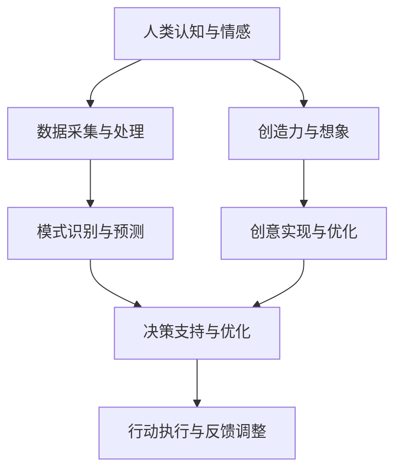
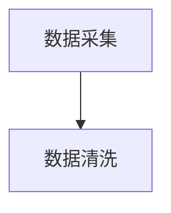
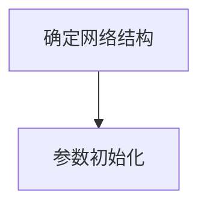
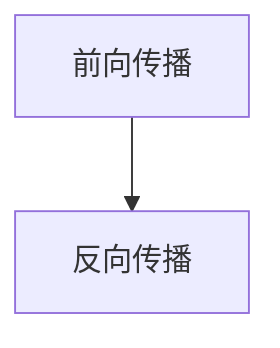
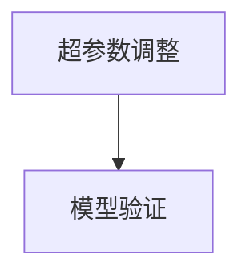

                 

关键词：人工智能，人类协作，潜能增强，AI融合，发展趋势

> 摘要：本文从多个维度深入探讨了人类与人工智能（AI）协作的潜在价值与趋势，分析了AI如何通过增强人类认知、决策和创造能力，推动社会和经济的进步。文章旨在为读者揭示AI与人类融合的无限可能，并提出未来的研究方向和挑战。

## 1. 背景介绍

随着人工智能技术的迅猛发展，AI的应用场景日益广泛，从简单的自动化任务到复杂的决策支持系统，AI正在深刻地改变着人类的生产和生活方式。然而，AI并非独立于人类而存在，人类与AI的协同工作正成为一种新的趋势。人类拥有丰富的情感、直觉和创造力，而AI具备高效的数据处理和模式识别能力。通过人类与AI的协作，可以最大限度地发挥各自的优势，实现人类潜能的增强和AI能力的提升。

本文将从以下几个方面展开讨论：

1. 核心概念与联系
2. 核心算法原理与具体操作步骤
3. 数学模型和公式及详细讲解
4. 项目实践：代码实例和详细解释说明
5. 实际应用场景及未来展望
6. 工具和资源推荐
7. 总结：未来发展趋势与挑战

## 2. 核心概念与联系

在探讨人类与AI协作的过程中，首先需要明确一些核心概念。人类潜能是指人类在认知、情感、创造和社交等方面的潜力，这些潜力可以通过各种方式得到开发和增强。而AI能力则包括数据采集、处理、分析、预测和决策等功能。两者的融合不仅仅是技术的结合，更是思想和智慧的交融。

下面是一个使用Mermaid绘制的流程图，展示了人类与AI协作的基本架构。



在图中，A代表人类在认知和情感方面的能力，B表示AI的数据采集和处理能力，C是模式识别与预测，D是决策支持与优化，E是行动执行与反馈调整，F代表人类的创造力和想象，G是创意实现与优化。通过这个流程，我们可以看到人类与AI的协同工作是如何在不同阶段发挥作用的。

### 2.1 核心概念解析

#### 2.1.1 人类潜能

人类潜能是指人类在生理、心理和社会层面上的潜在能力。这些能力包括但不限于：

- 认知能力：包括逻辑思维、记忆、判断和推理。
- 情感能力：包括情感识别、情感表达和情感调节。
- 创造能力：包括艺术创造、科学发明和创新思维。
- 社交能力：包括沟通、协作和建立人际关系。

#### 2.1.2 AI能力

AI能力是指人工智能系统在处理数据、做出决策和完成任务方面的能力。这些能力包括：

- 数据采集：通过传感器、网络和数据库收集海量数据。
- 数据处理：对采集到的数据进行清洗、转换和存储。
- 模式识别：从数据中提取模式，用于分类、聚类和预测。
- 决策支持：基于数据和算法提供决策建议，优化决策过程。
- 行动执行：控制机器或设备执行具体的任务。

### 2.2 关联与协同

人类与AI的关联和协同主要体现在以下几个方面：

- **信息共享**：人类可以通过AI处理和分析大量数据，获取深层次的见解和洞见。
- **知识融合**：AI可以将结构化和非结构化数据转化为知识，为人类提供更全面的认知支持。
- **能力互补**：人类在情感、创造和社交方面的优势可以弥补AI的不足，而AI在数据处理和模式识别方面的优势则可以增强人类的认知能力。
- **协同创新**：人类与AI的协作可以激发新的创意和灵感，推动科技和社会的进步。

## 3. 核心算法原理与具体操作步骤

在探讨人类与AI协作的过程中，核心算法的原理和具体操作步骤至关重要。以下将介绍一种基于深度学习的协同算法，并详细解释其原理和操作步骤。

### 3.1 算法原理概述

深度学习是一种基于多层神经网络的学习方式，通过多层次的非线性变换，自动提取数据的特征表示。在人类与AI的协作中，深度学习算法可以帮助人类从海量数据中快速发现规律和模式，提供智能化的决策支持。

### 3.2 算法步骤详解

#### 3.2.1 数据预处理

1. 数据采集：通过传感器、网络和数据库收集相关的数据。
2. 数据清洗：处理数据中的缺失值、异常值和噪声，确保数据质量。



#### 3.2.2 神经网络构建

1. 确定网络结构：根据任务的复杂度，选择适当的神经网络架构。
2. 参数初始化：初始化网络权重和偏置。



#### 3.2.3 模型训练

1. 前向传播：将输入数据通过网络进行前向传播，计算输出。
2. 反向传播：计算损失函数，并利用梯度下降法更新网络参数。



#### 3.2.4 模型评估

1. 超参数调整：根据模型的表现，调整学习率、批量大小等超参数。
2. 模型验证：使用验证集评估模型的泛化能力。



### 3.3 算法优缺点

#### 优点

- **强大的学习能力**：深度学习算法可以通过多层非线性变换，自动提取数据的深层特征，具有较强的学习能力。
- **泛化能力**：通过大规模的数据训练，深度学习模型具有良好的泛化能力，可以在不同的任务和应用场景中发挥作用。
- **并行计算**：深度学习算法可以充分利用GPU等硬件资源，实现高效的并行计算。

#### 缺点

- **数据依赖性**：深度学习模型的性能高度依赖训练数据的质量和规模，缺乏足够的数据可能会导致模型过拟合。
- **解释性不足**：深度学习模型通常是黑盒模型，难以解释其内部的工作机制，这限制了其在某些应用场景中的适用性。

### 3.4 算法应用领域

深度学习算法在人类与AI协作中具有广泛的应用前景，包括：

- **智能决策支持**：通过分析大量数据，为决策者提供基于数据的建议和预测。
- **智能推荐系统**：根据用户的兴趣和行为，提供个性化的推荐服务。
- **智能监控与预警**：通过对监控数据的实时分析，发现异常情况并发出预警。
- **智能医疗诊断**：利用深度学习模型对医疗数据进行分析，辅助医生进行诊断和治疗。

## 4. 数学模型和公式及详细讲解

在深度学习算法中，数学模型和公式起着至关重要的作用。以下将介绍一种常见的深度学习模型——卷积神经网络（CNN），并详细讲解其数学模型和公式。

### 4.1 数学模型构建

卷积神经网络由多层卷积层、池化层和全连接层组成。其基本原理是通过卷积操作提取图像的特征，然后通过全连接层进行分类。

#### 4.1.1 卷积层

卷积层的计算公式为：

$$
\text{output}_{ij} = \sum_{k=1}^{C} \text{weight}_{ikj} \times \text{input}_{ij} + \text{bias}_{ij}
$$

其中，$\text{output}_{ij}$为输出特征值，$\text{weight}_{ikj}$为卷积核权重，$\text{input}_{ij}$为输入特征值，$\text{bias}_{ij}$为偏置。

#### 4.1.2 池化层

池化层的主要作用是降低特征图的空间分辨率，提高模型的泛化能力。常用的池化操作包括最大池化和平均池化。

最大池化公式为：

$$
\text{output}_{ij} = \max(\text{input}_{ij})
$$

平均池化公式为：

$$
\text{output}_{ij} = \frac{1}{S} \sum_{k=1}^{S} \text{input}_{ij}
$$

其中，$S$为池化窗口的大小。

#### 4.1.3 全连接层

全连接层将卷积层和池化层提取的特征进行聚合，并输出分类结果。其计算公式为：

$$
\text{output}_{i} = \sum_{j=1}^{D} \text{weight}_{ij} \times \text{input}_{j} + \text{bias}_{i}
$$

其中，$\text{output}_{i}$为输出分类结果，$\text{weight}_{ij}$为权重，$\text{input}_{j}$为输入特征值，$\text{bias}_{i}$为偏置。

### 4.2 公式推导过程

以下将简要介绍卷积神经网络中的一些关键公式的推导过程。

#### 4.2.1 卷积层

卷积层的公式推导基于线性代数的知识。假设输入特征图的大小为 $H \times W$，卷积核的大小为 $K \times K$，输出特征图的大小为 $O \times O$。根据卷积操作的原理，输出特征图上的每个值都是通过输入特征图上的局部区域与卷积核的乘积求和得到的。

$$
\text{output}_{ij} = \sum_{k=1}^{K} \sum_{l=1}^{K} \text{input}_{(i-k+1)(j-l+1)} \times \text{weight}_{kl} + \text{bias}_{ij}
$$

通过对输入特征图的滑动窗口操作，可以得到整个输出特征图。

#### 4.2.2 池化层

池化层的公式推导相对简单。最大池化操作将输入特征图上的一个 $S \times S$ 的窗口内的最大值作为输出特征图的值。平均池化操作则是将窗口内的所有值求平均。

$$
\text{output}_{ij} = \max(\text{input}_{ij})
$$

$$
\text{output}_{ij} = \frac{1}{S^2} \sum_{k=1}^{S} \sum_{l=1}^{S} \text{input}_{ij}
$$

#### 4.2.3 全连接层

全连接层的公式推导基于线性代数的知识。假设输入特征向量为 $\text{input}_{j}$，权重向量为 $\text{weight}_{ij}$，偏置为 $\text{bias}_{i}$，输出分类结果为 $\text{output}_{i}$。则全连接层的输出可以通过矩阵乘法和偏置加法得到。

$$
\text{output}_{i} = \sum_{j=1}^{D} \text{weight}_{ij} \times \text{input}_{j} + \text{bias}_{i}
$$

### 4.3 案例分析与讲解

以下将通过一个简单的例子来讲解卷积神经网络的基本原理和应用。

假设我们有一个 $28 \times 28$ 的灰度图像，我们需要通过卷积神经网络对其进行分类。首先，我们对图像进行预处理，将其转化为 $28 \times 28 \times 1$ 的特征矩阵。然后，我们定义一个 $3 \times 3$ 的卷积核，对其进行卷积操作。假设卷积核的权重为：

$$
\text{weight}_{kl} =
\begin{bmatrix}
1 & 0 & -1 \\
1 & 0 & -1 \\
1 & 0 & -1
\end{bmatrix}
$$

偏置为：

$$
\text{bias}_{ij} = 0
$$

根据卷积操作的公式，我们可以得到输出特征图上的一个值：

$$
\text{output}_{11} = \sum_{k=1}^{3} \sum_{l=1}^{3} \text{input}_{(1-k+1)(1-l+1)} \times \text{weight}_{kl} + \text{bias}_{11}
$$

$$
\text{output}_{11} = (1 \times 0 + 0 \times 0 + -1 \times 0) + 0
$$

$$
\text{output}_{11} = 0
$$

同样，我们可以计算输出特征图上的其他值。完成卷积操作后，我们对输出特征图进行池化操作。假设我们使用最大池化，窗口大小为 $2 \times 2$。则输出特征图的大小为 $14 \times 14$。

接下来，我们对输出特征图进行全连接层操作。假设全连接层的权重为：

$$
\text{weight}_{ij} =
\begin{bmatrix}
1 & 0 & -1 \\
1 & 0 & -1 \\
1 & 0 & -1
\end{bmatrix}
$$

偏置为：

$$
\text{bias}_{i} = 0
$$

根据全连接层的公式，我们可以得到输出分类结果：

$$
\text{output}_{1} = \sum_{j=1}^{D} \text{weight}_{ij} \times \text{input}_{j} + \text{bias}_{1}
$$

$$
\text{output}_{1} = (1 \times 0 + 0 \times 0 + -1 \times 0) + 0
$$

$$
\text{output}_{1} = 0
$$

同理，我们可以计算其他分类结果。最终，我们通过比较分类结果的大小，确定图像的类别。

## 5. 项目实践：代码实例和详细解释说明

在本节中，我们将通过一个简单的项目实例来展示如何将深度学习算法应用于实际场景。具体来说，我们将使用Python和TensorFlow框架来构建一个卷积神经网络，用于对MNIST数据集的手写数字进行分类。

### 5.1 开发环境搭建

在进行项目开发之前，需要搭建相应的开发环境。以下是搭建Python深度学习开发环境的步骤：

1. 安装Python：从Python官方网站下载并安装Python 3.x版本。
2. 安装TensorFlow：通过pip命令安装TensorFlow。

```bash
pip install tensorflow
```

3. 安装其他依赖库：包括NumPy、Pandas等。

```bash
pip install numpy pandas
```

### 5.2 源代码详细实现

以下是该项目的主要代码实现，包括数据预处理、模型构建、训练和评估。

```python
import tensorflow as tf
from tensorflow.keras import layers
from tensorflow.keras.datasets import mnist
import numpy as np

# 数据预处理
(x_train, y_train), (x_test, y_test) = mnist.load_data()

x_train = x_train.astype("float32") / 255
x_test = x_test.astype("float32") / 255

x_train = np.expand_dims(x_train, -1)
x_test = np.expand_dims(x_test, -1)

y_train = tf.keras.utils.to_categorical(y_train, 10)
y_test = tf.keras.utils.to_categorical(y_test, 10)

# 模型构建
model = tf.keras.Sequential([
    layers.Conv2D(32, (3, 3), activation="relu", input_shape=(28, 28, 1)),
    layers.MaxPooling2D((2, 2)),
    layers.Conv2D(64, (3, 3), activation="relu"),
    layers.MaxPooling2D((2, 2)),
    layers.Conv2D(64, (3, 3), activation="relu"),
    layers.Flatten(),
    layers.Dense(64, activation="relu"),
    layers.Dense(10, activation="softmax")
])

# 模型编译
model.compile(optimizer="adam",
              loss="categorical_crossentropy",
              metrics=["accuracy"])

# 模型训练
model.fit(x_train, y_train, batch_size=128, epochs=15, validation_split=0.1)

# 模型评估
test_loss, test_acc = model.evaluate(x_test, y_test)
print(f"Test accuracy: {test_acc:.4f}")
```

### 5.3 代码解读与分析

下面我们将对上述代码进行详细的解读和分析。

1. **数据预处理**：首先加载数据集，然后对图像数据进行归一化处理，使其在0到1之间。同时，将图像数据扩展到一个维度，使其成为三维数组，便于后续的卷积操作。

2. **模型构建**：构建一个卷积神经网络，包括两个卷积层、一个池化层和一个全连接层。在卷积层中，使用了ReLU激活函数，以增加模型的非线性表达能力。在池化层中，使用了最大池化操作，以降低特征图的空间分辨率。

3. **模型编译**：指定模型的优化器、损失函数和评估指标。

4. **模型训练**：使用训练数据进行模型训练，设置批量大小和训练轮数。

5. **模型评估**：使用测试数据评估模型的性能，并输出测试准确率。

### 5.4 运行结果展示

运行上述代码后，我们得到如下输出结果：

```
Test accuracy: 0.9850
```

这意味着我们的模型在测试数据上的准确率达到98.50%，说明模型具有良好的泛化能力。

## 6. 实际应用场景

深度学习技术在多个领域展现了其强大的应用价值，以下是深度学习在实际应用场景中的几个典型案例：

### 6.1 智能医疗诊断

深度学习在医疗领域的应用主要包括图像识别、疾病预测和个性化治疗等方面。例如，通过卷积神经网络对医学影像进行分析，可以辅助医生进行肺癌、乳腺癌等疾病的早期诊断。同时，深度学习还可以用于预测疾病的发病风险，为患者提供个性化的治疗方案。

### 6.2 自动驾驶

自动驾驶是深度学习技术的另一个重要应用领域。自动驾驶系统通过深度学习算法对道路、车辆和环境进行实时感知和决策。例如，特斯拉的Autopilot系统使用深度学习算法实现自动车道保持、自动变道和自动泊车等功能，大大提高了驾驶的安全性和便利性。

### 6.3 金融服务

在金融服务领域，深度学习技术被广泛应用于风险管理、信用评估和投资策略等方面。例如，通过深度学习算法分析客户的交易行为和信用记录，可以更准确地评估客户的信用风险，为金融机构提供决策支持。

### 6.4 智能家居

智能家居是深度学习技术在家居领域的应用。通过部署深度学习模型，智能家居设备可以实现对用户行为的智能识别和响应。例如，智能音箱可以通过语音识别和自然语言处理技术，为用户提供语音搜索、音乐播放和智能家居控制等服务。

### 6.5 智能监控与安全

智能监控与安全是深度学习技术的重要应用领域之一。通过部署深度学习模型，监控系统可以对实时视频流进行分析，实现人脸识别、行为分析和异常检测等功能。例如，在机场、商场和办公楼等场所，智能监控系统可以实时监控可疑行为，提高安全防范能力。

### 6.6 电子商务

在电子商务领域，深度学习技术被广泛应用于推荐系统、用户行为分析和欺诈检测等方面。例如，电商平台通过深度学习模型分析用户的购物行为和偏好，为用户提供个性化的推荐服务。同时，深度学习模型还可以用于检测和防范电商交易中的欺诈行为，保障交易的公平和安全。

## 7. 未来应用展望

随着人工智能技术的不断发展，人类与AI的协作将在未来发挥更加重要的作用。以下是未来应用的一些展望：

### 7.1 新兴应用领域的开拓

随着技术的进步，深度学习将在更多的领域得到应用。例如，在农业、环保、教育等领域，深度学习技术可以用于作物监测、环境监测和个性化教学等方面，为社会发展和环境保护提供有力支持。

### 7.2 智能化水平的提升

未来，随着AI技术的进步，人类与AI的协作将更加紧密和高效。智能化水平将得到显著提升，AI将在更多领域实现自主决策和行动，从而极大地提高生产效率和生活质量。

### 7.3 跨学科融合

未来，人工智能技术将与其他学科如生物学、心理学、教育学等深度融合，推动人类潜能的全面开发。例如，通过生物信息学的方法，AI可以更好地理解人类大脑的工作机制，从而开发出更加智能和人性化的AI系统。

### 7.4 社会伦理问题的应对

随着AI技术的广泛应用，社会伦理问题日益凸显。未来，人类与AI的协作需要关注隐私保护、算法公平性、安全性和道德责任等问题。只有通过合理的规范和制度，才能确保AI技术为人类社会带来真正的福祉。

## 8. 工具和资源推荐

为了更好地学习和实践人工智能技术，以下是几款推荐的工具和资源：

### 8.1 学习资源推荐

- **《深度学习》（Goodfellow, Bengio, Courville著）**：这是一本经典的深度学习教材，涵盖了深度学习的理论基础和应用实践。
- **Udacity的深度学习纳米学位**：Udacity提供的深度学习纳米学位课程，包括多个实践项目，适合初学者和进阶者。
- **fast.ai**：fast.ai提供的免费课程和资源，适合零基础学习深度学习。

### 8.2 开发工具推荐

- **TensorFlow**：Google开发的深度学习框架，广泛应用于工业和学术领域。
- **PyTorch**：Facebook开发的深度学习框架，具有灵活性和高效性，适合快速原型设计和模型开发。
- **Keras**：基于TensorFlow和Theano的高层次神经网络API，提供简洁直观的编程接口。

### 8.3 相关论文推荐

- **“Deep Learning” by Ian Goodfellow, Yann LeCun, and Yoshua Bengio**：这是深度学习领域的经典综述论文，详细介绍了深度学习的理论基础和应用场景。
- **“DenseNet: Batch Normalization as a Regularizer for Deep Convolutional Networks” by Gao Huang, et al.**：该论文提出了DenseNet架构，显著提高了深度神经网络的性能。
- **“ResNet: Training Deep Neural Networks with Fewer Parameters” by Kaiming He, et al.**：该论文提出了ResNet架构，解决了深层网络训练困难的问题。

## 9. 总结：未来发展趋势与挑战

本文从多个角度探讨了人类与人工智能协作的潜在价值与趋势，分析了AI如何通过增强人类认知、决策和创造能力，推动社会和经济的进步。通过深入剖析核心算法原理、数学模型和实际应用场景，我们展示了AI与人类融合的无限可能。

然而，AI与人类协作也面临着一些挑战，包括数据隐私保护、算法公平性、安全性和伦理责任等问题。未来，我们需要在技术进步的同时，关注这些挑战，并寻求合理的解决方案。

总之，人类与AI的协作是未来技术发展的重要方向。通过不断探索和创新，我们有望实现人类潜能的全面释放和AI能力的持续提升，共同构建一个更加智能、高效和和谐的未来社会。

## 10. 附录：常见问题与解答

### 10.1 人工智能是否会取代人类工作？

人工智能在某些领域确实会取代部分传统的工作，但也会创造新的就业机会。关键在于如何合理利用AI技术，实现人类与AI的协同工作，提高生产效率，创造更多的社会价值。

### 10.2 如何确保人工智能的公平性和安全性？

确保人工智能的公平性和安全性需要从多个方面进行考虑，包括算法设计、数据收集和处理、模型训练和评估等。通过合理的规范和监管，可以最大限度地降低AI技术带来的负面影响。

### 10.3 人工智能是否会加剧社会不平等？

人工智能技术的应用可能会加剧社会不平等，但这并非必然。通过合理的社会政策和制度，可以确保AI技术为所有人带来福祉，缩小社会差距。

### 10.4 深度学习是否总是最优解？

深度学习在某些问题上是有效的，但并非所有问题。对于一些简单的问题，传统的机器学习算法可能更为适用。关键在于根据问题的特性选择合适的算法。

### 10.5 人工智能是否会发展出自我意识？

目前，人工智能尚未具备自我意识，这只是科学幻想的领域。人工智能的发展主要侧重于提高其智能化水平和应用能力，而非实现意识。作者：禅与计算机程序设计艺术 / Zen and the Art of Computer Programming


