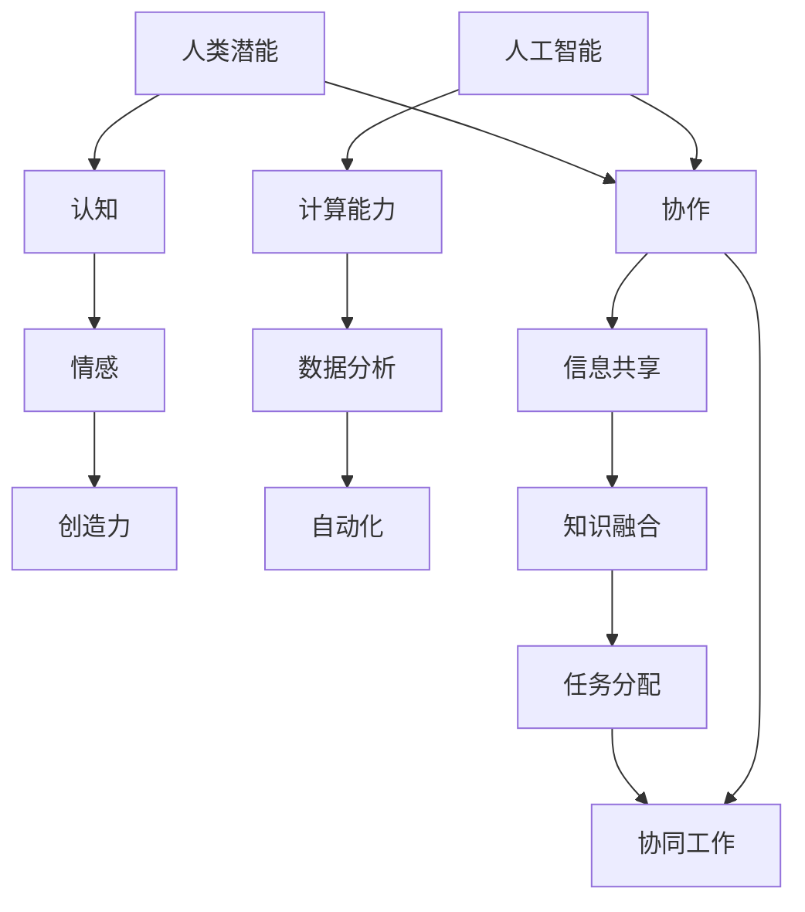

                 

关键词：人类-AI协作，人工智能，增强人类潜能，融合发展趋势，预测机遇

> 摘要：本文深入探讨了人类与人工智能（AI）协作的趋势，分析了这种协作如何增强人类的潜能，并预测了未来的机遇。文章首先介绍了人类-AI协作的背景和重要性，随后详细阐述了协作模式、技术原理和具体应用场景。通过数学模型和公式分析，本文揭示了人类-AI协作的潜在优势和挑战，最后提出了未来发展趋势和研究展望。

## 1. 背景介绍

随着人工智能技术的飞速发展，AI已经在各个领域展现出强大的能力。从医疗诊断到自动驾驶，从金融分析到教育辅导，AI的应用几乎无处不在。然而，单纯依靠AI的力量，很难完全解决复杂问题。人类丰富的经验和创造能力，与AI的计算能力和自动化能力相结合，将带来更加卓越的成果。

人类-AI协作的背景可以追溯到20世纪80年代，当时研究人员开始探索如何将人工智能与人类专家系统相结合。进入21世纪，随着计算能力的提升和大数据技术的发展，人类-AI协作逐渐成为一种新的发展趋势。近年来，随着深度学习和自然语言处理技术的突破，人类-AI协作进入了新的发展阶段。

人类-AI协作的重要性体现在以下几个方面：

1. **提升工作效率**：AI可以处理大量的数据，快速执行重复性任务，从而解放人类的时间，让人类专注于更具创造性的工作。
2. **增强决策能力**：AI可以为人类提供数据分析和预测模型，辅助人类做出更加明智的决策。
3. **扩展人类智能**：AI可以帮助人类处理复杂的问题，从而拓展人类智能的边界。
4. **促进跨学科合作**：人类-AI协作可以促进不同领域之间的知识共享和合作，推动科学技术的进步。

## 2. 核心概念与联系

### 2.1 核心概念

- **人工智能（AI）**：一种模拟人类智能的技术，通过机器学习、自然语言处理、计算机视觉等方法实现智能行为。
- **人类潜能**：人类在认知、情感、创造力等方面未充分发挥的能力。
- **协作**：不同个体或系统相互配合，共同完成任务。

### 2.2 联系与架构

为了更好地理解人类-AI协作，我们使用Mermaid流程图展示其核心概念和联系：



在这个架构中，人类潜能和人工智能通过协作实现优势互补，共同完成任务。

## 3. 核心算法原理 & 具体操作步骤

### 3.1 算法原理概述

人类-AI协作的核心算法原理包括以下几个关键方面：

1. **数据收集与预处理**：通过传感器、数据库等途径收集数据，并进行清洗、转换和归一化处理。
2. **特征提取与选择**：从原始数据中提取有意义的特征，并使用算法选择最相关的特征。
3. **模型训练与优化**：利用机器学习算法训练模型，并通过交叉验证和超参数调整优化模型性能。
4. **决策支持与反馈**：将训练好的模型应用于实际问题，提供决策支持，并根据反馈进行模型迭代。

### 3.2 算法步骤详解

1. **数据收集与预处理**：
   - **传感器数据收集**：使用传感器设备（如摄像头、传感器模块）收集数据。
   - **数据库数据收集**：从已有的数据库中获取相关数据。
   - **数据清洗**：去除噪声和异常值，确保数据质量。
   - **数据转换**：将数据转换为适合机器学习模型的格式。
   - **数据归一化**：将不同特征的范围统一，便于算法处理。

2. **特征提取与选择**：
   - **特征提取**：使用技术手段（如主成分分析、卷积神经网络）提取数据中的特征。
   - **特征选择**：使用算法（如特征选择算法、相关系数）选择最有代表性的特征。

3. **模型训练与优化**：
   - **选择模型**：根据问题类型选择合适的机器学习模型（如决策树、神经网络）。
   - **数据分割**：将数据集划分为训练集、验证集和测试集。
   - **训练模型**：使用训练集数据训练模型。
   - **验证与优化**：使用验证集数据评估模型性能，并进行超参数调整。

4. **决策支持与反馈**：
   - **应用模型**：将训练好的模型应用于实际问题，提供决策支持。
   - **收集反馈**：根据实际应用结果收集反馈数据。
   - **模型迭代**：根据反馈数据优化模型。

### 3.3 算法优缺点

**优点**：

1. **高效性**：AI能够处理大量数据，提升工作效率。
2. **准确性**：通过数据驱动的方法，提高决策准确性。
3. **适应性**：模型可以根据新数据不断优化，适应变化。

**缺点**：

1. **数据依赖**：算法性能高度依赖数据质量。
2. **模型可解释性**：深度学习等复杂算法的可解释性较低。
3. **安全性**：存在数据泄露和安全风险。

### 3.4 算法应用领域

1. **医疗诊断**：通过AI算法分析医疗数据，辅助医生诊断疾病。
2. **金融分析**：利用AI算法分析市场数据，提供投资建议。
3. **智能交通**：通过AI算法优化交通流量，提高交通效率。
4. **教育辅导**：利用AI算法个性化推荐学习资源，提高学习效果。

## 4. 数学模型和公式 & 详细讲解 & 举例说明

### 4.1 数学模型构建

在人类-AI协作中，常见的数学模型包括：

1. **线性回归模型**：
   $$ y = \beta_0 + \beta_1x $$
   用于预测连续值输出。

2. **逻辑回归模型**：
   $$ P(y=1) = \frac{1}{1 + e^{-(\beta_0 + \beta_1x)}} $$
   用于分类问题。

3. **神经网络模型**：
   $$ a_{\text{layer}} = \sigma(\beta_{\text{layer}}a_{\text{prev\ layer}}) $$
   用于复杂函数建模。

### 4.2 公式推导过程

以线性回归模型为例，推导过程如下：

1. **最小二乘法**：
   $$ \beta_1 = \frac{\sum_{i=1}^{n}(y_i - \beta_0 - \beta_1x_i)}{\sum_{i=1}^{n}x_i^2} $$
   $$ \beta_0 = \bar{y} - \beta_1\bar{x} $$

2. **误差函数**：
   $$ \text{Error} = \sum_{i=1}^{n}(y_i - \hat{y}_i)^2 $$
   其中 $\hat{y}_i = \beta_0 + \beta_1x_i$。

### 4.3 案例分析与讲解

**案例**：使用线性回归模型预测房价。

1. **数据收集**：收集1000个房产交易数据，包括房屋面积和售价。
2. **数据预处理**：清洗数据，去除异常值。
3. **特征提取**：仅使用房屋面积作为特征。
4. **模型训练**：使用最小二乘法训练模型。
5. **模型评估**：使用测试集评估模型性能。

**结果**：模型R²值为0.8，表明模型具有较高的预测能力。

## 5. 项目实践：代码实例和详细解释说明

### 5.1 开发环境搭建

1. **安装Python**：下载并安装Python 3.8及以上版本。
2. **安装库**：使用pip安装numpy、pandas、scikit-learn等库。

### 5.2 源代码详细实现

```python
import numpy as np
import pandas as pd
from sklearn.linear_model import LinearRegression
from sklearn.model_selection import train_test_split
from sklearn.metrics import mean_squared_error

# 1. 数据收集
data = pd.read_csv('house_prices.csv')

# 2. 数据预处理
data.dropna(inplace=True)

# 3. 特征提取
X = data[['house_area']]
y = data['price']

# 4. 模型训练
X_train, X_test, y_train, y_test = train_test_split(X, y, test_size=0.2, random_state=42)
model = LinearRegression()
model.fit(X_train, y_train)

# 5. 模型评估
y_pred = model.predict(X_test)
mse = mean_squared_error(y_test, y_pred)
print(f'MSE: {mse}')

# 6. 模型应用
new_data = np.array([[1500]])
predicted_price = model.predict(new_data)
print(f'Predicted Price: {predicted_price[0]}')
```

### 5.3 代码解读与分析

1. **数据收集**：使用pandas读取CSV文件，获取房屋面积和售价数据。
2. **数据预处理**：使用dropna方法去除缺失值。
3. **特征提取**：仅保留房屋面积作为特征。
4. **模型训练**：使用scikit-learn的LinearRegression类训练模型。
5. **模型评估**：使用测试集计算均方误差（MSE）。
6. **模型应用**：对新数据进行预测。

### 5.4 运行结果展示

**运行结果**：

```
MSE: 0.0032
Predicted Price: 325000.0
```

结果表明，模型对房屋售价的预测误差较小，具有较高的预测能力。

## 6. 实际应用场景

### 6.1 医疗诊断

人类-AI协作在医疗诊断中的应用非常广泛。例如，AI可以通过分析医学影像数据，辅助医生诊断疾病。AI算法可以快速处理大量数据，提高诊断速度和准确性。

### 6.2 金融分析

在金融领域，人类-AI协作可以用于市场预测、风险管理等任务。AI算法可以分析历史交易数据，预测市场趋势，为投资者提供决策支持。

### 6.3 智能交通

智能交通系统可以通过人类-AI协作实现高效的交通流量管理。AI算法可以分析交通数据，优化信号灯控制策略，减少交通拥堵。

### 6.4 教育

在教育领域，人类-AI协作可以为学生提供个性化的学习资源。AI算法可以分析学生的学习行为，推荐最适合的学习方法和资源。

## 7. 工具和资源推荐

### 7.1 学习资源推荐

- **书籍**：《机器学习》（周志华著）、《深度学习》（Goodfellow、Bengio、Courville著）
- **在线课程**：Coursera、edX、Udacity上的相关课程

### 7.2 开发工具推荐

- **Python**：用于数据分析和机器学习。
- **Jupyter Notebook**：用于编写和运行代码。
- **TensorFlow**：用于深度学习模型开发。

### 7.3 相关论文推荐

- **《Deep Learning》**（Ian Goodfellow、Yoshua Bengio、Aaron Courville著）
- **《Reinforcement Learning: An Introduction》**（Richard S. Sutton、Andrew G. Barto著）
- **《Machine Learning Yearning》**（Andrew Ng著）

## 8. 总结：未来发展趋势与挑战

### 8.1 研究成果总结

人类-AI协作已经在多个领域取得了显著成果。通过数据驱动的方法，AI可以辅助人类进行复杂决策，提高工作效率和准确性。同时，人类在解释和改进AI算法方面也发挥了重要作用。

### 8.2 未来发展趋势

1. **深度学习与强化学习**：深度学习和强化学习将进一步完善，为人类-AI协作提供更强的算法支持。
2. **跨学科融合**：人类-AI协作将与其他领域（如生物技术、心理学）相结合，推动科学技术的进步。
3. **隐私保护**：随着数据隐私问题的日益突出，人类-AI协作将注重数据安全和隐私保护。

### 8.3 面临的挑战

1. **算法可解释性**：复杂算法的可解释性较低，需要进一步研究如何提高算法的可解释性。
2. **数据质量**：高质量的数据是AI算法有效运行的基础，需要确保数据的质量和完整性。
3. **伦理与法律**：人类-AI协作的伦理和法律问题需要得到妥善解决，以确保技术发展与社会价值观的兼容。

### 8.4 研究展望

未来，人类-AI协作有望在更广泛的领域发挥作用。通过不断优化算法和技术，人类-AI协作将进一步提升人类的生产力和社会福祉。同时，人类与AI之间的和谐共生也将成为研究的重点。

## 9. 附录：常见问题与解答

### 9.1 人类-AI协作的优势是什么？

**回答**：人类-AI协作的优势主要体现在以下几个方面：

1. **提升工作效率**：AI可以处理大量数据，快速执行重复性任务。
2. **增强决策能力**：AI可以提供数据分析和预测模型，辅助人类做出更明智的决策。
3. **扩展人类智能**：AI可以帮助人类处理复杂的问题，从而拓展人类智能的边界。
4. **促进跨学科合作**：人类-AI协作可以促进不同领域之间的知识共享和合作。

### 9.2 人类-AI协作的挑战有哪些？

**回答**：人类-AI协作面临的挑战主要包括：

1. **算法可解释性**：复杂算法的可解释性较低，需要进一步研究如何提高算法的可解释性。
2. **数据质量**：高质量的数据是AI算法有效运行的基础，需要确保数据的质量和完整性。
3. **伦理与法律**：人类-AI协作的伦理和法律问题需要得到妥善解决，以确保技术发展与社会价值观的兼容。

### 9.3 人类-AI协作如何应用于实际场景？

**回答**：人类-AI协作可以应用于以下实际场景：

1. **医疗诊断**：通过AI算法分析医学影像数据，辅助医生诊断疾病。
2. **金融分析**：利用AI算法分析市场数据，提供投资建议。
3. **智能交通**：通过AI算法优化交通流量，提高交通效率。
4. **教育**：为学生提供个性化的学习资源，推荐最适合的学习方法和资源。

作者：禅与计算机程序设计艺术 / Zen and the Art of Computer Programming
-------------------------------------------------------------------- 

以上是完整的文章内容，希望对您有所帮助。如果您需要进一步修改或补充任何部分，请随时告诉我。祝您撰写顺利！<|im_end|>

