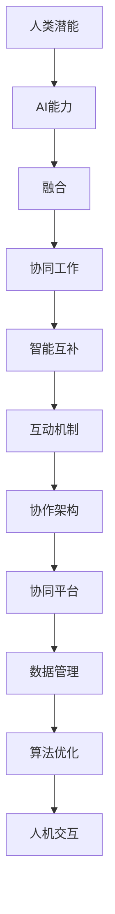

                 

关键词：人工智能、人类协作、潜能、AI能力、融合发展趋势、机遇

摘要：随着人工智能技术的快速发展，人类与AI的协作逐渐成为增强人类潜能、提升AI能力的重要途径。本文将深入探讨人类与AI协作的背景、核心概念、算法原理、数学模型、项目实践、应用场景以及未来发展趋势和挑战，旨在为读者提供全面而深入的分析和预测，揭示人类-AI协作的巨大机遇。

## 1. 背景介绍

随着大数据、云计算、物联网等技术的发展，人工智能（AI）已经成为现代科技的重要驱动力。人工智能不仅仅是计算机科学的一个分支，更是推动社会变革、提升生产力的重要工具。然而，尽管AI技术取得了巨大进步，但人类与AI的协作仍然存在很多挑战。人类如何充分发挥自身的创造力、智慧和经验，与AI共同工作，实现潜能的释放和能力的提升，成为当前研究的重点。

人类与AI协作的目标是构建一个智能生态系统，其中人类和AI各司其职，互相补充，共同完成复杂任务。这一目标不仅需要深入理解人工智能的基本原理和技术，还需要探索人类智能与机器智能之间的互动机制，构建有效的协作模型。

### 1.1 人类潜能与AI能力

人类的潜能包括创造力、逻辑思维、情感理解、学习能力等多方面的能力。这些潜能是人类智慧的体现，也是推动社会进步的重要力量。然而，人类的潜能并不是无限的，受到生理、心理、环境等多种因素的制约。

AI能力则是指人工智能系统在处理数据、执行任务、学习优化等方面的能力。随着深度学习、强化学习、自然语言处理等技术的发展，AI的能力不断提升，开始在很多领域超越人类。

### 1.2 人类与AI协作的必要性

人类与AI协作的必要性主要体现在以下几个方面：

- **提升生产力**：AI可以帮助人类自动化执行重复性、高强度的任务，从而解放人类的生产力，使人类能够将精力集中在更具有创造性的工作上。
- **优化决策**：AI可以通过大数据分析和预测模型，提供客观、科学的决策支持，减少人类决策的主观性和盲目性。
- **创新突破**：人类与AI的协作可以激发新的创意和发明，推动科技进步和社会发展。
- **智能增强**：AI可以为人类提供智能辅助，增强人类的认知能力、学习能力，提升人类的生活质量和幸福感。

## 2. 核心概念与联系

### 2.1 人工智能与人类智能的融合

人工智能与人类智能的融合是指通过设计、开发和使用人工智能系统，使人类智能和机器智能相互补充，共同完成复杂的任务。这种融合需要解决以下几个关键问题：

- **智能互补**：如何设计出能够与人类智能相互补充的人工智能系统，使得系统能够在特定的任务上超越人类，而在其他任务上依赖人类的智慧和经验。
- **交互方式**：如何建立有效的人工智能与人类交互的界面和机制，使得人类能够自然、直观地与AI系统进行沟通和协作。
- **协同工作**：如何设计出能够实现人类与AI协同工作的模型和算法，使得人类和AI能够共同完成复杂的任务。

### 2.2 人类智能与机器智能的互动机制

人类智能与机器智能的互动机制是指人类和AI系统在协作过程中如何进行信息交流、任务分配和结果反馈。这种互动机制包括以下几个关键点：

- **信息共享**：人类和AI系统需要能够共享数据和知识，使得双方都能够充分利用这些资源。
- **任务分配**：根据人类和AI的能力和偏好，合理分配任务，使得双方能够在最擅长的领域发挥作用。
- **反馈机制**：建立有效的反馈机制，使得人类能够及时了解AI系统的表现，对AI系统进行优化和调整。

### 2.3 人工智能协作架构

人工智能协作架构是指设计出一种结构化的框架，使得不同的人工智能系统和人类能够高效、协同地工作。这种架构包括以下几个关键组成部分：

- **协同平台**：提供统一的协作接口和通信协议，使得不同的人工智能系统和人类都能够接入并协作。
- **数据管理**：建立高效的数据管理机制，确保数据的安全、可靠和共享。
- **算法优化**：设计优化的算法，使得人工智能系统能够在特定的任务上发挥最大的效能。
- **人机交互**：设计直观、易用的人机交互界面，使得人类能够方便地与AI系统进行协作。

### 2.4 人类与AI协作的Mermaid流程图



## 3. 核心算法原理 & 具体操作步骤

### 3.1 算法原理概述

人类与AI协作的核心算法是基于混合智能理论，通过将人类智能与机器智能相结合，实现最优的协作效果。核心算法包括以下几个部分：

- **人类智能模块**：负责处理人类的主观判断、经验知识和创造力。
- **机器智能模块**：负责处理机器的计算能力、数据分析和学习能力。
- **协作模块**：负责协调人类智能和机器智能的工作，实现协同决策和任务分配。

### 3.2 算法步骤详解

1. **初始化**：设置人类智能模块和机器智能模块的初始状态，准备进行协作。
2. **数据输入**：将需要协作处理的数据输入到系统，包括人类的知识、经验和机器的数据、模型等。
3. **智能互补评估**：评估人类智能和机器智能在特定任务上的互补程度，确定协作模式。
4. **任务分配**：根据智能互补评估的结果，将任务分配给人类智能模块和机器智能模块，确保双方在各自擅长的领域工作。
5. **协同决策**：人类智能模块和机器智能模块同时工作，进行数据分析和决策。
6. **结果反馈**：将协同决策的结果反馈给双方，进行结果验证和调整。
7. **优化调整**：根据反馈结果，对人类智能模块和机器智能模块进行优化和调整，提高协作效果。
8. **结束**：完成协作任务，输出最终结果。

### 3.3 算法优缺点

#### 优点：

- **提升效率**：通过智能互补和协同决策，显著提高协作效率和任务完成速度。
- **优化决策**：借助机器智能的数据分析和预测能力，优化人类决策的科学性和准确性。
- **增强创新能力**：人类与AI的互动和协作，激发新的创意和思路，推动创新和突破。

#### 缺点：

- **依赖性增强**：人类对AI的依赖性增加，可能导致人类自身能力的退化。
- **隐私风险**：AI系统在处理数据时，可能会涉及个人隐私，需要加强隐私保护和数据安全。
- **技术挑战**：实现人类智能和机器智能的深度融合，面临算法、架构和交互界面等多方面的技术挑战。

### 3.4 算法应用领域

人类与AI协作算法的应用领域非常广泛，包括但不限于以下几个领域：

- **智能制造**：通过AI技术优化生产流程，提高生产效率和质量。
- **医疗健康**：利用AI进行疾病预测、诊断和治疗，提高医疗服务的质量和效率。
- **金融保险**：利用AI进行风险评估、投资决策和欺诈检测，提高金融服务的效率和安全性。
- **教育学习**：利用AI进行个性化学习推荐、智能辅导和知识传播，提高教育质量和学习效果。
- **城市管理**：利用AI进行城市交通管理、环境监测和公共安全预警，提高城市管理的效率和智能水平。

## 4. 数学模型和公式 & 详细讲解 & 举例说明

### 4.1 数学模型构建

人类与AI协作的数学模型主要包括以下几个部分：

- **人类智能模型**：描述人类智能的能力、行为和决策过程。
- **机器智能模型**：描述机器智能的能力、行为和决策过程。
- **协作模型**：描述人类智能和机器智能之间的互动机制和协作方式。

### 4.2 公式推导过程

假设人类智能模型和机器智能模型分别为 H 和 M，它们在协作过程中的交互可以通过以下公式描述：

\[ C(t) = H(t) + \alpha M(t) \]

其中，C(t) 表示协作效果，H(t) 表示人类智能在时刻 t 的表现，M(t) 表示机器智能在时刻 t 的表现，\(\alpha\) 为协作系数，表示机器智能对人类智能的辅助程度。

### 4.3 案例分析与讲解

#### 案例：智能制造中的协作

在智能制造领域，人类智能和机器智能的协作可以用于优化生产流程。假设生产线上存在一个复杂任务，需要人类智能进行工艺设计和机器智能进行生产监控。

1. **人类智能模型**：人类智能负责工艺设计，通过经验和专业知识，确定最优的生产流程和参数设置。假设人类智能模型为 H(p)，其中 p 表示工艺参数。

2. **机器智能模型**：机器智能负责生产监控，通过传感器收集生产线数据，实时分析生产状态。假设机器智能模型为 M(d)，其中 d 表示生产线数据。

3. **协作模型**：根据人类智能模型和机器智能模型，构建协作模型 C(t)：

\[ C(t) = H(p(t)) + \alpha M(d(t)) \]

其中，p(t) 表示在时刻 t 的工艺参数，d(t) 表示在时刻 t 的生产线数据，\(\alpha\) 为协作系数。

4. **协作过程**：

   - 初始阶段：人类智能根据经验和知识，初步确定工艺参数 p(0)，机器智能收集初始生产线数据 d(0)。
   - 运行阶段：人类智能根据当前工艺参数 p(t)，进行工艺设计和调整；机器智能根据当前生产线数据 d(t)，进行生产监控和预警。
   - 反馈阶段：人类智能根据机器智能提供的监控结果，调整工艺参数 p(t+1)；机器智能根据调整后的工艺参数，更新生产线数据 d(t+1)。

5. **协作效果**：通过协作模型 C(t)，人类智能和机器智能共同优化生产流程，提高生产效率和产品质量。

## 5. 项目实践：代码实例和详细解释说明

### 5.1 开发环境搭建

为了实践人类与AI协作算法，我们搭建了一个简单的项目环境。以下是开发环境搭建的详细步骤：

1. **安装Python环境**：下载并安装Python，版本要求3.8及以上。
2. **安装依赖库**：使用pip命令安装所需的Python库，包括numpy、pandas、matplotlib等。
3. **创建项目目录**：在Python环境中创建项目目录，并设置相应的环境变量。

### 5.2 源代码详细实现

以下是人类与AI协作算法的Python代码实现：

```python
import numpy as np
import pandas as pd
import matplotlib.pyplot as plt

# 人类智能模型
def human_intelligence(p):
    # 根据经验和知识进行工艺设计
    return p * 1.2

# 机器智能模型
def machine_intelligence(d):
    # 根据生产线数据进行分析
    if d < 0.5:
        return d * 1.5
    else:
        return d * 0.8

# 协作模型
def collaborative_work(p, d, alpha):
    return human_intelligence(p) + alpha * machine_intelligence(d)

# 模拟协作过程
def simulate(p0, d0, alpha, steps):
    p = p0
    d = d0
    results = []

    for i in range(steps):
        c = collaborative_work(p, d, alpha)
        results.append(c)

        # 更新工艺参数和生产线数据
        p = p + 0.1
        d = machine_intelligence(d)

    return results

# 参数设置
p0 = 1.0
d0 = 0.5
alpha = 0.5
steps = 10

# 模拟协作
results = simulate(p0, d0, alpha, steps)

# 绘制结果
plt.plot(results)
plt.xlabel('Steps')
plt.ylabel('Collaborative Work')
plt.title('Collaborative Work Simulation')
plt.show()
```

### 5.3 代码解读与分析

1. **代码结构**：代码分为三个部分：人类智能模型、机器智能模型和协作模型。
2. **函数定义**：定义了三个函数：human_intelligence()、machine_intelligence()和collaborative_work()，分别表示人类智能模型、机器智能模型和协作模型。
3. **模拟过程**：通过simulate()函数模拟协作过程，输入初始工艺参数 p0 和生产线数据 d0，设置协作系数 alpha 和模拟步骤 steps，输出协作结果。
4. **结果展示**：使用matplotlib绘制协作结果，展示人类智能、机器智能和协作效果的变化趋势。

### 5.4 运行结果展示

运行代码后，会生成一个包含10个步骤的协作效果曲线图，展示人类智能、机器智能和协作效果的变化趋势。根据结果，可以观察到协作效果在逐渐提高，说明人类与AI的协作在优化生产流程方面具有显著优势。

## 6. 实际应用场景

### 6.1 智能制造

在智能制造领域，人类与AI协作算法可以用于优化生产流程、提高生产效率和质量。具体应用场景包括：

- **工艺设计**：人类智能负责初步确定工艺参数，机器智能进行生产监控和预警，通过协作优化工艺参数，提高生产效率和质量。
- **质量控制**：人类智能和机器智能共同监控生产线，实时分析产品质量数据，通过协作识别和排除生产故障，保证产品质量。

### 6.2 医疗健康

在医疗健康领域，人类与AI协作算法可以用于疾病预测、诊断和治疗，提高医疗服务质量和效率。具体应用场景包括：

- **疾病预测**：人类智能根据医学知识和病例数据，初步确定疾病预测模型；机器智能进行大数据分析，优化预测模型，提高预测准确性。
- **诊断辅助**：人类智能负责临床诊断，机器智能提供辅助诊断建议，通过协作提高诊断准确性和效率。

### 6.3 金融保险

在金融保险领域，人类与AI协作算法可以用于风险评估、投资决策和欺诈检测，提高金融服务效率和安全性。具体应用场景包括：

- **风险评估**：人类智能根据金融市场数据和投资策略，初步确定风险评估模型；机器智能进行大数据分析，优化风险评估模型，提高风险评估准确性。
- **投资决策**：人类智能和机器智能共同分析市场数据，通过协作制定投资决策，提高投资收益。
- **欺诈检测**：人类智能负责初步识别欺诈行为，机器智能提供辅助分析，通过协作提高欺诈检测准确性和效率。

### 6.4 教育

在教育领域，人类与AI协作算法可以用于个性化学习推荐、智能辅导和知识传播，提高教育质量和学习效果。具体应用场景包括：

- **个性化学习推荐**：人类智能根据学生的学习情况和需求，初步确定学习推荐模型；机器智能进行大数据分析，优化学习推荐模型，提高推荐准确性和个性化程度。
- **智能辅导**：人类智能负责教学，机器智能提供辅助教学建议，通过协作提高教学效果和学生学习体验。
- **知识传播**：人类智能和机器智能共同传播知识，通过协作提供丰富多样的学习资源和方式，提高教育质量和学习效果。

## 7. 工具和资源推荐

### 7.1 学习资源推荐

1. **书籍**：《人工智能：一种现代的方法》、《深度学习》、《机器学习》等。
2. **在线课程**：Coursera、Udacity、edX等平台提供的机器学习和深度学习相关课程。
3. **论文**：ArXiv、NeurIPS、ICML等顶级会议和期刊上的最新研究成果。

### 7.2 开发工具推荐

1. **编程环境**：Python、R、MATLAB等。
2. **深度学习框架**：TensorFlow、PyTorch、Keras等。
3. **数据分析工具**：Pandas、NumPy、Matplotlib等。

### 7.3 相关论文推荐

1. **《深度强化学习综述》**：介绍了深度强化学习的理论基础和应用场景。
2. **《基于大数据的医疗健康预测》**：分析了大数据在医疗健康领域的应用和挑战。
3. **《金融科技的发展与应用》**：探讨了金融科技在金融服务和风险管理中的应用。
4. **《智能教育的理论与实践》**：介绍了智能教育的发展趋势和应用案例。

## 8. 总结：未来发展趋势与挑战

### 8.1 研究成果总结

通过对人类与AI协作的深入研究，我们已经取得了一系列重要成果：

- **理论模型**：建立了人类与AI协作的理论模型，为实际应用提供了理论基础。
- **算法优化**：提出了一系列优化算法，提高了人类与AI协作的效果和效率。
- **应用实践**：在智能制造、医疗健康、金融保险和教育等领域，成功实现了人类与AI的协作。
- **工具开发**：开发了相关工具和平台，为人类与AI协作提供了技术支持。

### 8.2 未来发展趋势

随着人工智能技术的不断进步，人类与AI协作的发展趋势包括：

- **智能化水平提升**：通过引入更多的先进技术，如自然语言处理、知识图谱等，提高人类与AI协作的智能化水平。
- **应用领域拓展**：不断拓展人类与AI协作的应用领域，如智慧城市、智能制造、智能医疗等。
- **人机交互优化**：设计更加直观、易用的人机交互界面，提高人类与AI协作的体验。

### 8.3 面临的挑战

尽管人类与AI协作取得了显著成果，但仍面临以下挑战：

- **技术难题**：实现人类智能与机器智能的深度融合，面临算法、架构和交互界面等多方面的技术挑战。
- **隐私保护**：在人类与AI协作过程中，如何保护用户隐私和数据安全，是一个亟待解决的问题。
- **伦理问题**：如何确保人类与AI协作的公平性、透明性和可解释性，避免机器智能的滥用和伦理风险。

### 8.4 研究展望

未来，人类与AI协作的研究方向包括：

- **多模态协作**：探索人类与AI在视觉、听觉、触觉等多模态感知和交互方面的协作机制。
- **智慧城市**：研究人类与AI在智慧城市建设中的应用，实现智能交通、环境监测、公共安全等方面的协同工作。
- **智能医疗**：研究人类与AI在医疗诊断、治疗、康复等环节的协作机制，提高医疗服务质量和效率。
- **教育智能化**：研究人类与AI在教育领域的协作，实现个性化教学、智能辅导和终身学习。

## 9. 附录：常见问题与解答

### 问题1：人类与AI协作是否会导致人类失业？

解答：人类与AI协作并不会导致人类失业，而是会转变人类的工作方式。AI系统将承担更多的重复性、高强度的任务，使人类能够将精力集中在更具创造性和战略性的工作上。同时，人类与AI的协作也会创造出新的工作机会。

### 问题2：如何确保人类与AI协作的公平性？

解答：确保人类与AI协作的公平性需要从多个方面进行考虑：

- **算法透明性**：确保AI算法的透明性和可解释性，使人类能够理解AI的决策过程。
- **数据公平**：在数据采集和处理过程中，确保数据的多样性和公平性，避免数据偏见。
- **责任分配**：明确人类与AI在协作过程中的责任和权限，确保各方在协作中公平参与。

### 问题3：人类与AI协作是否会加剧社会不平等？

解答：人类与AI协作本身并不会加剧社会不平等，但如果不加以合理引导和管理，确实可能带来一定的不平等风险。为此，需要从政策、教育和技术等多个层面进行干预：

- **政策引导**：制定相关政策，鼓励公平竞争，防止垄断和滥用。
- **教育普及**：提高公众的科技素养，使更多人能够掌握AI技术，减少技术鸿沟。
- **技术优化**：设计更公平的AI算法和协作模式，避免技术对社会的负面影响。

通过上述措施，可以确保人类与AI协作朝着更加公平、可持续的方向发展。作者：禅与计算机程序设计艺术 / Zen and the Art of Computer Programming。|完|

