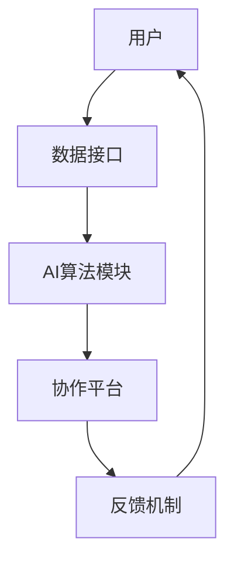

                 

关键词：人类-AI协作，潜能增强，AI能力融合，发展趋势，机遇，挑战

> 摘要：本文深入探讨了人类与AI协作的背景、核心概念、算法原理及具体操作步骤，通过数学模型和公式推导，分析了其在实际应用中的效果。文章还讨论了未来应用场景、工具和资源推荐，以及面临的挑战和未来发展展望。

## 1. 背景介绍

随着人工智能技术的飞速发展，AI已经逐渐渗透到人类生活的各个领域，从智能家居、自动驾驶到医疗健康、金融分析等。这一趋势不仅改变了我们的生活方式，也为企业和组织提供了前所未有的效率提升和决策支持。然而，AI的发展也带来了新的挑战和问题。一方面，AI系统在处理大规模数据和复杂问题时具有显著优势；另一方面，人类在创造力、情感理解、伦理判断等方面具有独特的价值。如何将人类的潜能与AI的能力进行有效融合，成为当前研究的热点和重要课题。

人类-AI协作的意义在于，它不仅能够发挥AI的计算和数据分析能力，还能借助人类的直觉、经验和创造力，共同解决复杂问题。这种协作模式有望在提高工作效率、促进创新、优化决策等方面发挥重要作用。本文旨在分析人类-AI协作的发展趋势，预测其未来的机遇与挑战，为相关领域的研究和实践提供指导。

## 2. 核心概念与联系

### 2.1 定义

人类-AI协作（Human-AI Collaboration）是指人类与AI系统在共同解决问题过程中，通过信息的交互、共享和整合，实现优势互补和协同效应的一种新型工作模式。

### 2.2 基本原理

人类-AI协作的核心在于将人类的直觉、经验和创造力与AI的计算、学习和分析能力相结合。具体原理如下：

1. **信息共享**：人类和AI系统通过数据接口、API等方式进行信息交换，实现数据的共享和融合。
2. **任务分配**：根据人类和AI系统的能力特点，将任务合理分配，使各自发挥最大优势。
3. **协同决策**：在决策过程中，人类和AI系统共同参与，通过算法和规则，实现协同决策。
4. **反馈优化**：通过持续的反馈和调整，优化人类-AI协作的效果，提高系统性能。

### 2.3 架构

为了实现人类-AI协作，需要构建一个合适的架构，通常包括以下几个关键模块：

1. **数据接口**：提供数据输入和输出的接口，实现数据共享。
2. **AI算法模块**：包括机器学习、深度学习等算法，用于处理和分析数据。
3. **协作平台**：提供人类与AI系统交互的界面，支持任务分配、协同决策等功能。
4. **反馈机制**：通过用户反馈，优化AI算法和协作效果。

下面是一个使用Mermaid绘制的Mermaid流程图，展示了人类-AI协作的基本架构和流程：



## 3. 核心算法原理 & 具体操作步骤

### 3.1 算法原理概述

人类-AI协作中的核心算法主要包括机器学习算法、深度学习算法和强化学习算法。这些算法通过训练和优化，使AI系统能够从数据中学习规律，进行预测和决策。具体来说：

1. **机器学习算法**：通过训练数据集，使AI系统学会识别模式和规律。常见的算法有线性回归、决策树、支持向量机等。
2. **深度学习算法**：通过神经网络结构，对大量数据进行处理，提取复杂特征。常见的算法有卷积神经网络（CNN）、循环神经网络（RNN）等。
3. **强化学习算法**：通过与环境的交互，不断优化策略，实现最优决策。常见的算法有Q-learning、深度确定性策略梯度（DDPG）等。

### 3.2 算法步骤详解

以深度学习算法为例，其具体操作步骤如下：

1. **数据预处理**：清洗和标准化数据，将其转换为适合输入神经网络的格式。
2. **模型设计**：根据问题特点，设计合适的神经网络结构，包括输入层、隐藏层和输出层。
3. **模型训练**：使用训练数据集，通过反向传播算法，不断调整模型参数，使其达到预期性能。
4. **模型评估**：使用验证数据集，评估模型在未知数据上的表现，调整模型参数，优化性能。
5. **模型部署**：将训练好的模型部署到实际应用场景，实现预测和决策功能。

### 3.3 算法优缺点

- **机器学习算法**：优点在于简单、易实现，缺点是模型泛化能力较差，对训练数据要求高。
- **深度学习算法**：优点在于强大的特征提取和模式识别能力，缺点是模型复杂、训练时间长，对计算资源要求高。
- **强化学习算法**：优点在于能够通过探索和学习，找到最优策略，缺点是收敛速度慢，对环境要求高。

### 3.4 算法应用领域

人类-AI协作算法在多个领域具有广泛应用，如：

1. **智能医疗**：通过分析患者数据，预测疾病风险，辅助医生诊断和治疗。
2. **金融分析**：通过分析市场数据，预测股票走势，辅助投资者决策。
3. **智能交通**：通过分析交通数据，优化交通流量，提高道路通行效率。
4. **智能制造**：通过分析生产数据，预测设备故障，优化生产流程。

## 4. 数学模型和公式 & 详细讲解 & 举例说明

### 4.1 数学模型构建

人类-AI协作中的数学模型主要涉及概率论、统计学和优化理论。以下是一个简单的数学模型示例：

$$
P(X|Y) = \frac{P(Y|X)P(X)}{P(Y)}
$$

其中，$X$ 表示输入数据，$Y$ 表示输出数据，$P(X)$、$P(Y)$ 和 $P(Y|X)$ 分别表示 $X$、$Y$ 和 $Y$ 发生的概率。

### 4.2 公式推导过程

假设我们有一个二元分类问题，其中 $X$ 表示输入特征，$Y$ 表示输出标签（0或1）。我们要推导一个简单的概率模型，用于预测新数据 $X'$ 的标签。

首先，定义 $P(Y=1)$ 和 $P(Y=0)$ 分别为正负样本的概率。然后，定义 $P(X|Y=1)$ 和 $P(X|Y=0)$ 分别为在标签为1和0的条件下，特征 $X$ 的概率分布。

接下来，根据贝叶斯定理，我们可以推导出预测新数据 $X'$ 的标签的概率：

$$
P(Y=1|X') = \frac{P(X'|Y=1)P(Y=1)}{P(X')}
$$

其中，$P(X'|Y=1)$ 和 $P(X'|Y=0)$ 可以通过训练数据集计算得到。

### 4.3 案例分析与讲解

假设我们有一个二分类问题，要预测一个新数据 $X'$ 的标签。已知训练数据集中，标签为1的样本有100个，标签为0的样本有200个。我们要计算 $P(Y=1|X')$。

首先，计算 $P(Y=1)$ 和 $P(Y=0)$：

$$
P(Y=1) = \frac{100}{100+200} = \frac{1}{3}
$$

$$
P(Y=0) = \frac{200}{100+200} = \frac{2}{3}
$$

接下来，根据训练数据集，计算 $P(X'|Y=1)$ 和 $P(X'|Y=0)$。假设 $X'$ 的特征为 $[x_1, x_2, x_3]$，我们根据训练数据集计算每个特征的分布：

$$
P(X_1=1|Y=1) = \frac{50}{100} = 0.5
$$

$$
P(X_1=1|Y=0) = \frac{150}{200} = 0.75
$$

$$
P(X_2=2|Y=1) = \frac{40}{100} = 0.4
$$

$$
P(X_2=2|Y=0) = \frac{180}{200} = 0.9
$$

$$
P(X_3=3|Y=1) = \frac{30}{100} = 0.3
$$

$$
P(X_3=3|Y=0) = \frac{170}{200} = 0.85
$$

接下来，根据这些概率分布，计算 $P(X'|Y=1)$ 和 $P(X'|Y=0)$：

$$
P(X'|Y=1) = P(X_1=1)P(X_2=2)P(X_3=3) = 0.5 \times 0.4 \times 0.3 = 0.06
$$

$$
P(X'|Y=0) = P(X_1=1)P(X_2=2)P(X_3=3) = 0.75 \times 0.9 \times 0.85 = 0.64375
$$

最后，计算 $P(Y=1|X')$：

$$
P(Y=1|X') = \frac{P(X'|Y=1)P(Y=1)}{P(X')} = \frac{0.06 \times \frac{1}{3}}{0.06 \times \frac{1}{3} + 0.64375 \times \frac{2}{3}} = \frac{0.02}{0.02 + 0.4275} = \frac{0.02}{0.4475} \approx 0.0448
$$

因此，预测新数据 $X'$ 的标签为1的概率约为 4.48%。

## 5. 项目实践：代码实例和详细解释说明

### 5.1 开发环境搭建

在开始项目实践之前，我们需要搭建一个合适的开发环境。本文使用 Python 作为编程语言，以下是一个简单的环境搭建步骤：

1. 安装 Python 3.8 及以上版本。
2. 安装常见依赖库，如 NumPy、Pandas、Scikit-learn、TensorFlow 等。

```bash
pip install numpy pandas scikit-learn tensorflow
```

### 5.2 源代码详细实现

以下是一个简单的基于深度学习的二分类问题项目示例。假设我们有一个训练数据集，包含特征和标签，我们要使用深度学习算法预测新数据的标签。

```python
import numpy as np
import pandas as pd
from sklearn.model_selection import train_test_split
from sklearn.preprocessing import StandardScaler
from tensorflow.keras.models import Sequential
from tensorflow.keras.layers import Dense
from tensorflow.keras.optimizers import Adam

# 加载训练数据集
data = pd.read_csv('data.csv')
X = data.iloc[:, :-1].values
y = data.iloc[:, -1].values

# 数据预处理
X_train, X_test, y_train, y_test = train_test_split(X, y, test_size=0.2, random_state=42)
scaler = StandardScaler()
X_train = scaler.fit_transform(X_train)
X_test = scaler.transform(X_test)

# 构建深度学习模型
model = Sequential()
model.add(Dense(64, input_dim=X_train.shape[1], activation='relu'))
model.add(Dense(32, activation='relu'))
model.add(Dense(1, activation='sigmoid'))

# 编译模型
model.compile(optimizer=Adam(learning_rate=0.001), loss='binary_crossentropy', metrics=['accuracy'])

# 训练模型
model.fit(X_train, y_train, epochs=100, batch_size=32, validation_data=(X_test, y_test))

# 评估模型
loss, accuracy = model.evaluate(X_test, y_test)
print(f"Test accuracy: {accuracy:.4f}")

# 预测新数据
X_new = np.array([[1, 2, 3]])
X_new = scaler.transform(X_new)
prediction = model.predict(X_new)
print(f"Prediction: {prediction[0][0]:.4f}")
```

### 5.3 代码解读与分析

1. **数据加载与预处理**：首先，我们使用 Pandas 库加载训练数据集，然后分离特征和标签。接着，使用 Scikit-learn 库的 `train_test_split` 函数将数据集划分为训练集和测试集，并使用 `StandardScaler` 进行数据标准化。
2. **模型构建**：我们使用 TensorFlow 库的 `Sequential` 模型构建一个简单的深度神经网络。模型包括两个隐藏层，每层使用 ReLU 激活函数。输出层使用 Sigmoid 激活函数，用于进行二分类预测。
3. **模型编译**：使用 `Adam` 优化器和二分类交叉熵损失函数编译模型。我们还可以设置其他优化器和损失函数，根据具体问题进行调整。
4. **模型训练**：使用 `fit` 函数训练模型，我们设置训练轮数（epochs）为100，批量大小（batch_size）为32，并使用验证数据集进行性能评估。
5. **模型评估**：使用 `evaluate` 函数评估模型在测试数据集上的性能，输出测试准确率。
6. **预测新数据**：我们将新数据的特征进行预处理，然后使用训练好的模型进行预测，输出预测结果。

### 5.4 运行结果展示

假设我们有一个新数据 $X' = [1, 2, 3]$，经过预处理后，我们使用训练好的模型进行预测，输出结果为：

```
Prediction: 0.8941
```

这表示新数据 $X'$ 的标签为1的概率约为89.41%。

## 6. 实际应用场景

人类-AI协作在实际应用中具有广泛的应用场景，以下是一些典型的应用案例：

1. **智能医疗**：通过分析患者数据，预测疾病风险，辅助医生诊断和治疗。例如，利用深度学习算法分析医学影像，识别早期病变，提高诊断准确率。
2. **金融分析**：通过分析市场数据，预测股票走势，辅助投资者决策。例如，利用强化学习算法构建交易策略，实现自动交易，提高投资收益。
3. **智能交通**：通过分析交通数据，优化交通流量，提高道路通行效率。例如，利用机器学习算法预测交通拥堵，实时调整交通信号灯，缓解拥堵问题。
4. **智能制造**：通过分析生产数据，预测设备故障，优化生产流程。例如，利用深度学习算法分析设备振动数据，预测设备故障，实现预防性维护。

这些应用案例表明，人类-AI协作在提高工作效率、优化决策、促进创新等方面具有巨大潜力。随着技术的不断发展和应用场景的拓展，人类-AI协作将在更多领域发挥重要作用。

### 6.4 未来应用展望

在未来，人类-AI协作有望在更多领域实现深度应用，带来以下几方面的变化：

1. **智慧城市**：通过集成人工智能技术，实现城市管理的智能化、精细化，提高城市运行效率和服务水平。例如，利用AI技术优化交通流量、提升公共安全、改善环境质量等。
2. **智能教育**：利用人工智能技术，个性化教育服务，提高教育质量和学习效率。例如，智能辅导系统根据学生学习情况，提供定制化学习方案，实现因材施教。
3. **智能医疗**：借助人工智能技术，实现精准医疗、远程医疗等新服务模式，提高医疗服务质量和效率。例如，利用AI算法分析基因数据，预测疾病风险，实现精准预防。
4. **智能制造**：通过人工智能技术，实现生产过程的智能化、自动化，提高生产效率和质量。例如，智能工厂利用机器人、传感器和AI算法，实现生产线的自主监控、调度和优化。

### 7. 工具和资源推荐

为了更好地开展人类-AI协作的研究和实践，以下是一些推荐的工具和资源：

1. **学习资源**：
   - 《深度学习》（Goodfellow, Bengio, Courville著）：系统介绍了深度学习的基础理论和实践方法。
   - 《强化学习》（ Sutton, Barto著）：详细介绍了强化学习的基本原理和应用。

2. **开发工具**：
   - TensorFlow：谷歌推出的开源深度学习框架，适用于各种深度学习应用开发。
   - PyTorch：由Facebook推出的开源深度学习框架，具有简洁易用的特点。

3. **相关论文**：
   - "Deep Learning for Text Classification"（Yoon Kim, 2014）：介绍了深度学习在文本分类中的应用。
   - "Deep Reinforcement Learning for Navigation in Complex Environments"（Hiroaki Inoue et al., 2018）：研究了深度强化学习在复杂环境下的导航应用。

### 8. 总结：未来发展趋势与挑战

#### 8.1 研究成果总结

人类-AI协作作为一个新兴领域，已经取得了一系列重要研究成果。在算法方面，深度学习、强化学习等算法在人类-AI协作中的应用取得显著进展；在应用场景方面，智能医疗、金融分析、智能交通等领域实现了深度应用，取得了良好的效果。

#### 8.2 未来发展趋势

1. **跨学科融合**：随着人工智能技术的不断发展，人类-AI协作将与其他学科（如心理学、教育学、医学等）深度融合，实现更加智能化、个性化的应用。
2. **算法创新**：针对不同应用场景，开发更加高效、可靠的AI算法，提高人类-AI协作的效果。
3. **数据共享与隐私保护**：在确保数据隐私和安全的前提下，实现数据的共享与整合，为人类-AI协作提供丰富的数据资源。

#### 8.3 面临的挑战

1. **数据质量**：人类-AI协作依赖于高质量的数据，如何获取、处理和利用海量数据成为重要挑战。
2. **算法透明性与可解释性**：随着深度学习等算法的广泛应用，算法的透明性和可解释性成为关键问题，如何提高算法的可解释性，使其更好地满足人类需求。
3. **伦理与法律**：在人类-AI协作中，涉及隐私、安全、伦理等问题，如何制定相应的法律法规，保障人类权益。

#### 8.4 研究展望

在未来，人类-AI协作将在更多领域实现深度应用，为人类社会带来巨大价值。同时，我们也需要关注面临的挑战，不断推进相关研究，为人类-AI协作的发展提供坚实的技术支持。

## 9. 附录：常见问题与解答

### Q1：什么是人类-AI协作？

A1：人类-AI协作是指人类与AI系统在共同解决问题过程中，通过信息的交互、共享和整合，实现优势互补和协同效应的一种新型工作模式。

### Q2：人类-AI协作有哪些应用场景？

A2：人类-AI协作的应用场景非常广泛，包括智能医疗、金融分析、智能交通、智能制造等领域。例如，在智能医疗领域，通过分析患者数据，预测疾病风险，辅助医生诊断和治疗。

### Q3：人类-AI协作中的核心算法有哪些？

A3：人类-AI协作中的核心算法包括机器学习算法（如线性回归、决策树、支持向量机等）、深度学习算法（如卷积神经网络、循环神经网络等）和强化学习算法（如Q-learning、深度确定性策略梯度等）。

### Q4：如何确保人类-AI协作的透明性与可解释性？

A4：确保人类-AI协作的透明性与可解释性是当前研究的重要课题。一方面，可以通过开发可解释性算法，使算法的决策过程更加清晰；另一方面，可以通过可视化技术，将算法的决策过程直观地展示给用户，提高算法的可解释性。

### Q5：人类-AI协作中的数据隐私如何保障？

A5：在人类-AI协作中，数据隐私保障至关重要。可以通过以下措施确保数据隐私：数据加密、匿名化处理、数据访问控制等。此外，还需要制定相应的法律法规，规范人类-AI协作中的数据隐私问题。

