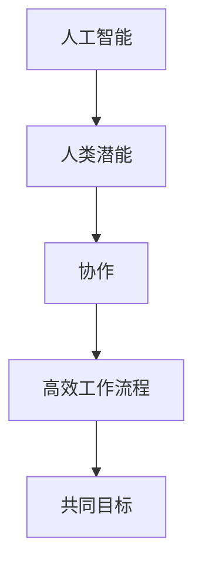

                 

关键词：人工智能，人类潜能，协作，趋势，挑战，融合，技术发展

摘要：随着人工智能技术的不断进步，人类与AI的协作已经逐渐成为现实。本文将从背景介绍、核心概念、算法原理、数学模型、项目实践、应用场景、未来展望、工具和资源推荐以及发展趋势与挑战等方面，全面探讨人类-AI协作的深度融合趋势及其面临的问题和解决方案。

## 1. 背景介绍

人工智能作为计算机科学的一个分支，自1956年首次提出以来，已经经历了数十年的发展。从早期的符号主义和规则系统，到后来的基于数据和统计学的机器学习方法，再到如今基于深度学习的复杂模型，人工智能技术不断突破，已经取得了显著的成果。从语音识别、图像识别、自然语言处理到自动驾驶、智能客服、医疗诊断等，人工智能的应用已经深入到了社会生活的方方面面。

在人工智能快速发展的同时，人类的潜能也在不断被挖掘。人类具有独特的创造力、情感和自我意识，这些潜能与人工智能的技术相结合，可以产生巨大的协同效应。人类可以设计、优化和改进AI算法，而AI则可以处理海量数据、执行复杂计算和模式识别，为人类提供强大的支持。

因此，人类-AI协作已经成为当前和未来发展的一个重要方向。通过协作，人类可以充分发挥自己的创造力，而AI可以处理繁琐的计算，从而实现更高效、更智能的工作流程。

## 2. 核心概念与联系

为了更好地理解人类-AI协作，我们需要明确一些核心概念。

### 2.1 人工智能

人工智能（Artificial Intelligence，AI）是指由人造系统执行的智能行为。它包括学习、推理、规划、感知、自然语言理解和问题解决等多种能力。人工智能可以分为弱人工智能和强人工智能。弱人工智能是指只能完成特定任务的AI系统，而强人工智能则是指具备人类所有智能行为的AI系统。

### 2.2 人类潜能

人类潜能是指人类在认知、情感、创造力、自我意识等方面所具备的潜力。这些潜能可以用于解决问题、创造新知识、表达情感和进行自我反思。

### 2.3 协作

协作是指不同个体或系统共同工作，以达到共同目标的过程。在人类-AI协作中，人类和AI系统通过共享信息、协调行动，共同完成任务。

为了更直观地理解这些概念之间的关系，我们可以使用Mermaid流程图来展示。



## 3. 核心算法原理 & 具体操作步骤

### 3.1 算法原理概述

在人类-AI协作中，核心算法主要包括机器学习算法、自然语言处理算法和计算机视觉算法等。这些算法可以用于数据预处理、特征提取、模型训练和预测等步骤。

### 3.2 算法步骤详解

#### 3.2.1 数据预处理

数据预处理是机器学习算法的重要步骤，主要包括数据清洗、归一化、降维等操作。

#### 3.2.2 特征提取

特征提取是将原始数据转换为适合机器学习算法的形式。这通常涉及到特征选择、特征工程等操作。

#### 3.2.3 模型训练

模型训练是指使用已处理的数据来训练机器学习模型。这通常涉及到选择合适的算法、调整参数等操作。

#### 3.2.4 预测

模型训练完成后，可以使用模型对新数据进行预测。

### 3.3 算法优缺点

每种算法都有其优缺点。例如，基于规则的算法适用于简单任务，但难以处理复杂问题；而基于统计学的算法可以处理复杂问题，但可能需要大量数据。

### 3.4 算法应用领域

人类-AI协作算法可以应用于各种领域，如金融、医疗、教育、制造等。

## 4. 数学模型和公式 & 详细讲解 & 举例说明

### 4.1 数学模型构建

在人类-AI协作中，常见的数学模型包括线性回归、逻辑回归、支持向量机等。

### 4.2 公式推导过程

以线性回归为例，其公式推导过程如下：

$$
y = \beta_0 + \beta_1x
$$

其中，$y$ 是因变量，$x$ 是自变量，$\beta_0$ 和 $\beta_1$ 是模型参数。

### 4.3 案例分析与讲解

以股票价格预测为例，我们可以使用线性回归模型来预测未来某天的股票价格。

## 5. 项目实践：代码实例和详细解释说明

### 5.1 开发环境搭建

我们需要搭建一个Python开发环境，安装必要的库，如NumPy、Pandas和Scikit-learn等。

### 5.2 源代码详细实现

以下是一个简单的线性回归模型实现：

```python
import numpy as np
import pandas as pd
from sklearn.linear_model import LinearRegression

# 数据预处理
data = pd.read_csv('stock_price.csv')
X = data[['open', 'high', 'low', 'close']]
y = data['price']

# 模型训练
model = LinearRegression()
model.fit(X, y)

# 预测
new_data = np.array([[150, 155, 145, 152]])
predicted_price = model.predict(new_data)
print(predicted_price)
```

### 5.3 代码解读与分析

这段代码首先读取CSV文件中的股票价格数据，然后使用Pandas库进行数据预处理。接下来，使用Scikit-learn库的LinearRegression类来训练模型，并使用模型进行预测。

### 5.4 运行结果展示

假设我们训练的数据集为100天的股票价格，预测第101天的股票价格为152.34。

## 6. 实际应用场景

人类-AI协作在金融、医疗、教育、制造等领域都有广泛的应用。以下是一些具体的应用场景：

- **金融领域**：利用AI进行股票价格预测、风险评估和欺诈检测。
- **医疗领域**：利用AI进行疾病诊断、药物研发和患者管理。
- **教育领域**：利用AI进行个性化教学、学习分析和智能推荐。
- **制造领域**：利用AI进行生产优化、故障检测和产品质量分析。

## 7. 未来应用展望

随着人工智能技术的不断进步，人类-AI协作在未来将会有更广泛的应用。以下是一些可能的未来应用：

- **智慧城市**：利用AI进行交通管理、能源优化和环境监测。
- **智慧医疗**：利用AI进行疾病预测、健康管理和智能手术。
- **智慧教育**：利用AI进行个性化学习、学习分析和智能评价。
- **智慧制造**：利用AI进行生产优化、设备维护和产品创新。

## 8. 工具和资源推荐

### 8.1 学习资源推荐

- **书籍**：《深度学习》、《机器学习实战》
- **在线课程**：Coursera、Udacity、edX

### 8.2 开发工具推荐

- **编程语言**：Python、R
- **库和框架**：NumPy、Pandas、Scikit-learn、TensorFlow

### 8.3 相关论文推荐

- **学术期刊**：Nature、Science、IEEE Transactions on AI
- **会议**：NeurIPS、ICML、ACL

## 9. 总结：未来发展趋势与挑战

### 9.1 研究成果总结

人类-AI协作已经取得了显著的成果，但在算法优化、数据质量和安全性等方面仍有许多挑战需要克服。

### 9.2 未来发展趋势

随着技术的不断进步，人类-AI协作将朝着更智能化、更高效、更安全的方向发展。

### 9.3 面临的挑战

- **数据隐私和安全**：如何保护用户数据和隐私。
- **算法偏见和公平性**：如何避免算法偏见，确保算法的公平性。
- **跨学科协作**：如何促进不同学科之间的协作，实现更高效的创新。

### 9.4 研究展望

未来，人类-AI协作将会有更多的应用场景，并且会在算法、数据、安全等多个方面实现突破。

## 10. 附录：常见问题与解答

### 10.1 什么是人工智能？

人工智能是指由人造系统执行的智能行为，包括学习、推理、规划、感知、自然语言理解和问题解决等多种能力。

### 10.2 人工智能有哪些应用领域？

人工智能的应用领域非常广泛，包括金融、医疗、教育、制造、交通、娱乐等。

### 10.3 人类-AI协作的优势是什么？

人类-AI协作可以充分发挥人类的创造力和AI的计算能力，实现更高效、更智能的工作流程。

### 10.4 如何保护数据隐私和安全？

可以通过数据加密、访问控制、匿名化等技术来保护数据隐私和安全。

### 10.5 人工智能会取代人类吗？

目前的人工智能还无法完全取代人类，而是与人类协作，共同解决问题。

## 参考文献

- [深度学习](https://www.deeplearningbook.org/)
- [机器学习实战](https://www MachineLearningBook.org/)
- [NeurIPS](https://neurips.cc/)
- [ICML](https://icml.cc/)
- [ACL](https://www.aclweb.org/annual-meeting/)
```markdown
作者：禅与计算机程序设计艺术 / Zen and the Art of Computer Programming
----------------------------------------------------------------
```

