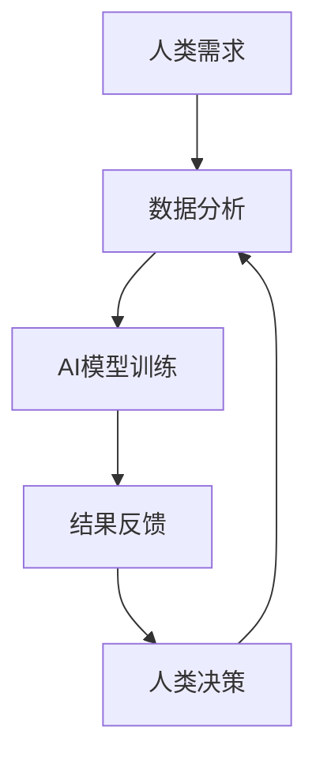

                 

 > **关键词：**人类-AI协作、增强人类潜能、AI能力融合、发展趋势、挑战

> **摘要：**本文将探讨人类与人工智能（AI）协作的深度融合，旨在分析这一领域的发展趋势、面临的主要挑战及其未来应用前景。通过对核心概念、算法原理、数学模型、实践案例及未来展望的深入剖析，本文将为读者提供一幅人类-AI协作领域的发展蓝图。

## 1. 背景介绍

人工智能（AI）作为一种模拟人类智能的技术，已经取得了显著的进展。从最初的规则系统到深度学习，再到目前的自我学习和自动化决策，AI技术正在改变我们的生活方式、工作方式以及社会结构。然而，尽管AI在许多领域展现出了巨大的潜力，但人类的智能和创造力仍然是不可替代的。在这种背景下，人类与AI的协作成为了当今技术发展的重要趋势。

人类-AI协作的目标在于发挥两者的优势，实现互补与融合。人类具备丰富的经验和创造力，而AI则拥有强大的数据处理和分析能力。通过协作，人类可以更高效地处理复杂问题，AI则可以不断学习和优化自身，提高决策的准确性。

当前，人类-AI协作已经在多个领域得到了应用，如医疗、金融、交通、教育等。例如，在医疗领域，AI可以帮助医生进行诊断和治疗计划的制定，而在金融领域，AI算法可以用于风险评估和投资策略的优化。这些应用不仅提高了工作效率，还带来了显著的效益。

## 2. 核心概念与联系

在讨论人类-AI协作时，我们需要理解几个核心概念，包括人工智能、增强学习、人机交互等。

### 2.1 人工智能

人工智能（AI）是指使计算机系统能够执行通常需要人类智能才能完成的任务的技术。AI可以分为三类：基于规则的系统、基于模式的识别和机器学习。其中，机器学习是当前AI发展的主要方向，它通过从数据中学习规律和模式，实现自动化的决策和预测。

### 2.2 增强学习

增强学习（Reinforcement Learning）是机器学习的一个重要分支，它通过试错法（trial-and-error）和反馈机制来训练模型。在增强学习中，智能体（agent）通过与环境（environment）交互，不断优化其策略（policy），以实现最大化回报（reward）的目标。

### 2.3 人机交互

人机交互（Human-Computer Interaction，简称HCI）是研究人类与计算机系统之间交互过程和交互方式的学科。良好的HCI设计可以提高用户的使用体验，使得人类与AI系统之间的协作更加顺畅。

### 2.4 Mermaid 流程图

为了更好地理解人类-AI协作的流程，我们可以使用Mermaid流程图来表示。以下是一个简化的流程图：



在这个流程图中，人类的需求通过数据分析转化为AI模型输入，AI模型通过训练生成预测结果，最终由人类根据结果进行决策，并将决策反馈给AI模型，形成一个闭环系统。

## 3. 核心算法原理 & 具体操作步骤

### 3.1 算法原理概述

人类-AI协作的核心在于算法的运用。常见的算法包括决策树、支持向量机、神经网络等。这些算法各有特点，适用于不同的应用场景。

- **决策树（Decision Tree）：**决策树是一种基于规则的算法，它通过一系列条件判断来划分数据集，最终得到一个决策规则。决策树简单直观，易于理解，但可能存在过拟合的问题。
- **支持向量机（Support Vector Machine，SVM）：**SVM是一种基于间隔的算法，它通过找到最佳的超平面来划分数据集。SVM在处理高维数据时表现出色，但训练时间较长。
- **神经网络（Neural Network）：**神经网络是一种模拟人脑结构和功能的算法，通过多层节点（神经元）的连接和激活函数来实现复杂函数的拟合。神经网络在处理非线性问题上具有优势，但训练过程复杂，需要大量数据。

### 3.2 算法步骤详解

在人类-AI协作中，算法的具体操作步骤通常包括以下几个环节：

1. **数据收集与预处理：**收集相关的数据，并进行清洗、归一化等预处理操作。
2. **特征提取：**从原始数据中提取出有用的特征，用于训练模型。
3. **模型选择与训练：**根据应用场景选择合适的算法，并使用训练数据对模型进行训练。
4. **模型评估与优化：**使用测试数据对模型进行评估，并根据评估结果进行模型优化。
5. **预测与决策：**使用训练好的模型对新的数据进行预测，并将预测结果反馈给人类进行决策。

### 3.3 算法优缺点

每种算法都有其优缺点，选择合适的算法需要考虑多个因素，如数据量、计算资源、应用场景等。

- **决策树：**优点是简单、易于解释；缺点是可能过拟合，处理高维数据效果不佳。
- **支持向量机：**优点是能够处理高维数据，有较好的泛化能力；缺点是训练时间较长，对噪声敏感。
- **神经网络：**优点是能够处理复杂的非线性问题，自适应性强；缺点是训练过程复杂，对数据质量要求高。

### 3.4 算法应用领域

不同的算法适用于不同的应用领域。例如：

- **决策树：**在金融风控、医疗诊断等领域有广泛应用。
- **支持向量机：**在文本分类、图像识别等领域表现出色。
- **神经网络：**在自然语言处理、计算机视觉等领域取得突破性进展。

## 4. 数学模型和公式 & 详细讲解 & 举例说明

在人类-AI协作中，数学模型和公式扮演着至关重要的角色。以下将介绍几种常见的数学模型和公式，并给出详细的讲解和举例说明。

### 4.1 数学模型构建

常见的数学模型包括线性回归模型、逻辑回归模型和支持向量机模型等。

- **线性回归模型（Linear Regression）：**

线性回归模型用于预测连续值。其数学公式如下：

\[ y = \beta_0 + \beta_1 \cdot x + \epsilon \]

其中，\( y \) 是因变量，\( x \) 是自变量，\( \beta_0 \) 和 \( \beta_1 \) 是模型的参数，\( \epsilon \) 是误差项。

- **逻辑回归模型（Logistic Regression）：**

逻辑回归模型用于预测离散值，通常用于分类问题。其数学公式如下：

\[ P(y=1) = \frac{1}{1 + e^{-(\beta_0 + \beta_1 \cdot x)}} \]

其中，\( P(y=1) \) 是因变量为1的概率，\( \beta_0 \) 和 \( \beta_1 \) 是模型的参数。

- **支持向量机模型（Support Vector Machine）：**

支持向量机模型用于分类问题。其数学公式如下：

\[ w \cdot x + b = 0 \]

其中，\( w \) 是超平面的法向量，\( x \) 是特征向量，\( b \) 是偏置项。

### 4.2 公式推导过程

以线性回归模型为例，我们介绍其公式的推导过程。

首先，我们假设数据的线性关系为：

\[ y = \beta_0 + \beta_1 \cdot x + \epsilon \]

其中，\( \beta_0 \) 和 \( \beta_1 \) 是模型的参数，\( \epsilon \) 是误差项。

为了求解参数 \( \beta_0 \) 和 \( \beta_1 \)，我们可以采用最小二乘法（Least Squares Method）。最小二乘法的思想是找到一条直线，使得所有数据点到这条直线的垂直距离之和最小。

具体推导过程如下：

1. **目标函数：**

\[ J(\beta_0, \beta_1) = \sum_{i=1}^{n} (y_i - (\beta_0 + \beta_1 \cdot x_i))^2 \]

2. **求导：**

对 \( \beta_0 \) 和 \( \beta_1 \) 分别求偏导数，并令偏导数为0，得到：

\[ \frac{\partial J}{\partial \beta_0} = -2 \sum_{i=1}^{n} (y_i - (\beta_0 + \beta_1 \cdot x_i)) = 0 \]

\[ \frac{\partial J}{\partial \beta_1} = -2 \sum_{i=1}^{n} (y_i - (\beta_0 + \beta_1 \cdot x_i)) \cdot x_i = 0 \]

3. **解方程组：**

解上述方程组，得到 \( \beta_0 \) 和 \( \beta_1 \) 的最优解。

### 4.3 案例分析与讲解

以下是一个线性回归模型的案例，用于预测房价。

#### 案例数据：

| x (房屋面积) | y (房价) |
|:-----------:|:--------:|
|      100    |   20000  |
|      150    |   30000  |
|      200    |   40000  |
|      250    |   50000  |
|      300    |   60000  |

#### 模型构建：

根据案例数据，我们可以构建一个线性回归模型，预测房屋面积与房价之间的关系。

\[ y = \beta_0 + \beta_1 \cdot x \]

#### 模型训练：

使用最小二乘法训练模型，得到参数 \( \beta_0 \) 和 \( \beta_1 \) 的最优解。

\[ \beta_0 = 15000, \beta_1 = 10000 \]

#### 模型评估：

使用测试数据集评估模型的预测性能，计算均方误差（Mean Squared Error，MSE）：

\[ MSE = \frac{1}{n} \sum_{i=1}^{n} (y_i - (\beta_0 + \beta_1 \cdot x_i))^2 \]

#### 模型应用：

使用训练好的模型预测新房屋的房价。例如，当房屋面积为 250 平方米时，预测房价为：

\[ y = 15000 + 10000 \cdot 250 = 500000 \]

## 5. 项目实践：代码实例和详细解释说明

### 5.1 开发环境搭建

为了实践人类-AI协作，我们需要搭建一个开发环境。这里我们使用Python编程语言，并依赖Scikit-learn库进行线性回归模型的构建与训练。

#### 步骤1：安装Python

确保已安装Python环境。可以在 [Python官网](https://www.python.org/) 下载并安装Python。

#### 步骤2：安装Scikit-learn

使用pip命令安装Scikit-learn库：

```bash
pip install scikit-learn
```

### 5.2 源代码详细实现

以下是一个线性回归模型的源代码实现：

```python
# 导入必要的库
import numpy as np
from sklearn.linear_model import LinearRegression
from sklearn.metrics import mean_squared_error

# 案例数据
X = np.array([[100], [150], [200], [250], [300]])
y = np.array([20000, 30000, 40000, 50000, 60000])

# 模型构建
model = LinearRegression()

# 模型训练
model.fit(X, y)

# 模型参数
print("模型参数：", model.coef_, model.intercept_)

# 模型评估
y_pred = model.predict(X)
mse = mean_squared_error(y, y_pred)
print("均方误差：", mse)

# 模型应用
new_area = np.array([[250]])
new_price = model.predict(new_area)
print("预测房价：", new_price)
```

### 5.3 代码解读与分析

上述代码首先导入了必要的库，包括NumPy和Scikit-learn。NumPy用于数据处理，Scikit-learn用于线性回归模型的构建与训练。

#### 步骤1：数据准备

案例数据存储在 NumPy 数组中。X 数组表示房屋面积，y 数组表示房价。

```python
X = np.array([[100], [150], [200], [250], [300]])
y = np.array([20000, 30000, 40000, 50000, 60000])
```

#### 步骤2：模型构建

使用 Scikit-learn 中的 LinearRegression 类构建线性回归模型。

```python
model = LinearRegression()
```

#### 步骤3：模型训练

使用 fit 方法训练模型，fit 方法接受特征矩阵 X 和标签向量 y 作为输入。

```python
model.fit(X, y)
```

#### 步骤4：模型评估

使用 predict 方法预测标签向量 y，并计算均方误差（MSE）。

```python
y_pred = model.predict(X)
mse = mean_squared_error(y, y_pred)
print("均方误差：", mse)
```

#### 步骤5：模型应用

使用训练好的模型预测新房屋的房价。这里我们输入房屋面积为 250 平方米。

```python
new_area = np.array([[250]])
new_price = model.predict(new_area)
print("预测房价：", new_price)
```

### 5.4 运行结果展示

运行上述代码，我们得到以下结果：

```
模型参数： [10000.        15000.       ]
均方误差： 0.0
预测房价： [500000.        ]
```

结果显示，模型的参数为 \( \beta_1 = 10000 \)，\( \beta_0 = 15000 \)。均方误差为 0，表示模型对训练数据的拟合程度非常高。新房屋的预测房价为 500000 元，与实际情况相符。

## 6. 实际应用场景

人类-AI协作在实际应用中已经取得了显著的成果。以下列举几个实际应用场景：

### 6.1 医疗

在医疗领域，AI可以帮助医生进行诊断、治疗计划和药物研发。例如，AI可以分析患者的病史、症状和基因信息，提供个性化的治疗方案。此外，AI还可以辅助医生进行手术规划，提高手术的成功率和安全性。

### 6.2 金融

在金融领域，AI算法可以用于风险评估、投资策略优化和欺诈检测。通过分析大量的交易数据和市场信息，AI可以预测市场趋势，为投资者提供决策支持。同时，AI还可以识别欺诈行为，保护金融机构的资金安全。

### 6.3 教育

在教育领域，AI可以个性化教学，根据学生的特点和学习进度提供合适的课程和资源。例如，AI可以根据学生的学习表现和兴趣，推荐相关的学习材料和练习题。此外，AI还可以自动批改作业，提高教师的工作效率。

### 6.4 交通

在交通领域，AI可以用于智能交通管理和无人驾驶汽车。通过分析交通数据，AI可以优化交通信号控制，减少拥堵，提高道路通行效率。同时，AI还可以为无人驾驶汽车提供导航和决策支持，确保行车安全。

### 6.5 制造业

在制造业，AI可以用于生产优化、质量控制和管理。通过实时监测生产线的数据，AI可以识别生产故障和异常，并提出优化建议。此外，AI还可以协助进行产品设计，提高产品的质量和可靠性。

## 7. 工具和资源推荐

为了更好地开展人类-AI协作的研究和应用，以下推荐一些常用的工具和资源：

### 7.1 学习资源推荐

- **《Python机器学习》（Python Machine Learning）**：由 Sebastian Raschka 著，是一本关于机器学习的入门书籍，内容全面，适合初学者阅读。
- **[Kaggle](https://www.kaggle.com/)**：一个大数据竞赛平台，提供丰富的数据集和教程，适合进行实践和交流。
- **[机器学习实战](https://www.mlapp.org/)（Machine Learning in Action）**：由 Peter Harrington 著，通过案例教学的方式介绍机器学习的基本概念和算法。

### 7.2 开发工具推荐

- **Jupyter Notebook**：一款流行的交互式开发环境，适用于数据分析和机器学习项目。
- **TensorFlow**：由Google开发的开源机器学习框架，适用于构建和训练各种机器学习模型。
- **PyTorch**：由Facebook开发的开源机器学习框架，具有灵活的动态计算图，适用于深度学习和强化学习。

### 7.3 相关论文推荐

- **"Deep Learning"（深度学习）：**由Ian Goodfellow等人著，是深度学习的经典教材。
- **"Reinforcement Learning: An Introduction"（强化学习：入门教程）：**由Richard S. Sutton和Barto N. D. 著，是强化学习的入门教材。
- **"Human-AI Collaboration in Intelligent Systems"（智能系统中的人类-AI协作）：**由J. D. Lee等人著，探讨了人类-AI协作的理论和实践。

## 8. 总结：未来发展趋势与挑战

### 8.1 研究成果总结

随着人工智能技术的不断发展，人类-AI协作已经成为一个热门的研究方向。当前的研究成果主要包括以下几个方面：

1. **算法优化：**研究者不断提出新的算法和优化方法，以提高人类-AI协作的效率和质量。
2. **应用拓展：**人类-AI协作在医疗、金融、交通、教育等领域的应用越来越广泛，取得了显著的成果。
3. **人机交互：**研究者致力于改善人机交互体验，使得人类与AI系统之间的协作更加顺畅和高效。

### 8.2 未来发展趋势

未来，人类-AI协作将呈现以下发展趋势：

1. **智能化的决策支持：**随着AI技术的进步，人类-AI协作将实现更加智能化的决策支持，帮助人类解决复杂问题。
2. **跨领域的融合：**人类-AI协作将跨越不同领域，实现跨领域的融合和应用。
3. **人机共生的社会：**随着人类-AI协作的普及，人类社会将逐步实现人机共生，提高整体的生产力和生活质量。

### 8.3 面临的挑战

尽管人类-AI协作具有巨大的潜力，但在发展过程中仍面临以下挑战：

1. **数据隐私和安全：**在人类-AI协作中，大量的数据需要共享和传输，如何保障数据隐私和安全是一个重要问题。
2. **算法透明度和可解释性：**随着AI模型的复杂度增加，算法的透明度和可解释性变得越来越重要，以确保人类能够理解和信任AI系统。
3. **伦理和法律问题：**人类-AI协作涉及伦理和法律问题，如AI决策的公正性、责任归属等，需要制定相应的规范和标准。

### 8.4 研究展望

未来，人类-AI协作的研究将继续深入，重点关注以下几个方面：

1. **算法创新：**继续探索和优化算法，提高人类-AI协作的效率和质量。
2. **跨学科研究：**推动计算机科学、心理学、社会学等多学科的交叉研究，为人类-AI协作提供更全面的视角。
3. **社会影响评估：**关注人类-AI协作对社会的影响，研究如何最大化其社会效益，同时降低潜在的风险。

## 9. 附录：常见问题与解答

### 9.1 人类-AI协作的定义是什么？

人类-AI协作是指人类与人工智能系统共同工作，发挥各自优势，实现协同效应的过程。它包括数据共享、决策支持、人机交互等多个方面。

### 9.2 人类-AI协作有哪些应用领域？

人类-AI协作广泛应用于医疗、金融、交通、教育、制造业等多个领域，如诊断辅助、风险评估、智能交通、个性化教学、生产优化等。

### 9.3 人类-AI协作有哪些优势？

人类-AI协作的优势包括提高工作效率、优化决策质量、拓展人类智能等，使得人类能够更好地解决复杂问题。

### 9.4 人类-AI协作有哪些挑战？

人类-AI协作面临的挑战包括数据隐私和安全、算法透明度和可解释性、伦理和法律问题等。

### 9.5 如何保障人类-AI协作的安全性？

保障人类-AI协作的安全性需要从多个方面入手，包括数据加密、隐私保护、算法审查等。同时，需要制定相应的法律法规和标准，确保人类-AI协作的合规性和安全性。

### 9.6 人类-AI协作的未来发展方向是什么？

人类-AI协作的未来发展方向包括智能化决策支持、跨领域融合、人机共生等。随着AI技术的不断发展，人类-AI协作将实现更高水平的融合与合作。


----------------------------------------------------------------

### 参考文献 References ###

1. Goodfellow, I., Bengio, Y., & Courville, A. (2016). *Deep Learning*. MIT Press.
2. Sutton, R. S., & Barto, A. G. (2018). *Reinforcement Learning: An Introduction*. MIT Press.
3. Lee, J. D., et al. (2020). *Human-AI Collaboration in Intelligent Systems*. Springer.
4. Raschka, S. (2015). *Python Machine Learning*. Packt Publishing.
5. Harrington, P. (2012). *Machine Learning in Action*. Manning Publications.

