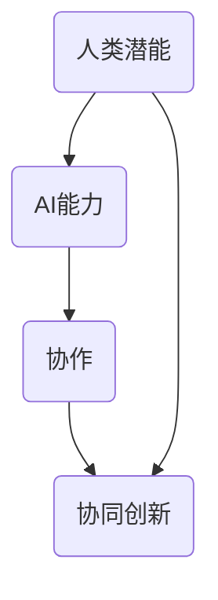

                 

## 1. 背景介绍

在当今这个技术飞速发展的时代，人工智能（AI）已经成为推动社会进步的重要力量。从自动驾驶汽车到智能语音助手，从推荐系统到医疗诊断，AI的应用范围正在不断扩展。与此同时，人类也意识到，单靠人类自身的力量，无法应对日益复杂的问题和挑战。因此，人类与AI的协作应运而生，成为当前技术发展的重要趋势。

人类与AI协作的意义不仅在于提高工作效率，更在于借助AI的强大计算能力和分析能力，挖掘人类潜能，实现人类与机器的协同创新。这种协作模式不仅改变了传统的工作方式，也引发了对于未来社会发展的深度思考。

本文将从以下几个方面展开讨论：首先，介绍人类与AI协作的核心概念及其重要性；其次，分析AI在各个领域的应用现状和挑战；接着，探讨人类潜能与AI能力的融合发展趋势；最后，总结当前面临的主要挑战，并预测未来发展趋势。

<|assistant|>## 2. 核心概念与联系

在深入探讨人类与AI协作之前，有必要明确一些核心概念。以下是对这些概念及其相互关系的详细解释。

### 2.1 人工智能（AI）

人工智能是指由人制造出来的系统能够执行通常需要人类智能才能完成的任务。这些任务包括识别图像、理解自然语言、解决复杂问题等。AI可以分为两大类：弱AI（窄AI）和强AI（通用AI）。弱AI专注于特定的任务，如语音识别或图像处理；强AI则具有普遍的智能，能够执行任何人类智能任务。

### 2.2 机器学习（ML）

机器学习是AI的核心技术之一，它使机器能够从数据中学习并做出决策。机器学习可以分为监督学习、无监督学习和强化学习。监督学习利用已标记的数据进行训练；无监督学习则在未标记的数据中寻找模式；强化学习通过试错来学习最佳策略。

### 2.3 自然语言处理（NLP）

自然语言处理是AI的一个分支，专注于使计算机能够理解、生成和处理人类语言。NLP在机器翻译、情感分析、聊天机器人等领域有广泛应用。

### 2.4 人类潜能

人类潜能是指人类在认知、情感、创造力等方面所具备的潜在能力。这些能力使得人类能够适应复杂多变的环境，解决问题，创造出新的知识和技术。

### 2.5 AI能力

AI能力是指AI系统在特定任务上所展现出的智能水平，包括计算能力、学习能力、推理能力等。AI能力的提升有助于解决更多复杂的实际问题。

### 2.6 人类与AI协作的原理图

为了更好地理解人类与AI协作的概念，我们可以使用Mermaid流程图来展示其核心要素和相互关系。以下是一个简化的原理图：



在这个图中，人类潜能和AI能力是协作的基础，它们通过协作产生协同创新，从而推动社会进步。

<|assistant|>## 3. 核心算法原理 & 具体操作步骤

### 3.1 算法原理概述

人类与AI协作的核心算法基于深度学习和强化学习。深度学习是一种模拟人脑神经网络的学习方法，通过多层次的神经元网络对数据进行特征提取和模式识别。强化学习则是通过试错和奖励机制来训练模型，使其在特定任务上表现出最佳性能。

### 3.2 算法步骤详解

1. **数据准备**：收集和整理大量标注数据，用于训练深度学习模型。

2. **模型构建**：构建多层神经网络模型，包括输入层、隐藏层和输出层。输入层接收原始数据，隐藏层进行特征提取，输出层生成预测结果。

3. **模型训练**：使用标记数据对模型进行训练，通过反向传播算法不断调整权重，使模型能够准确识别数据中的特征。

4. **模型评估**：使用验证数据对模型进行评估，计算模型的准确率、召回率等指标，以判断模型性能。

5. **模型优化**：根据评估结果对模型进行优化，包括调整网络结构、学习率等参数。

6. **协作机制设计**：设计人类与AI的协作机制，包括任务分配、反馈机制、协同调整等。

7. **实际应用**：将训练好的模型应用到实际任务中，与人类共同完成任务。

### 3.3 算法优缺点

**优点**：

- **高效性**：深度学习和强化学习算法能够快速处理大量数据，提高任务执行效率。
- **灵活性**：人类与AI的协作机制可以根据任务需求进行灵活调整。
- **智能性**：AI系统具有强大的学习能力，能够在复杂环境中做出智能决策。

**缺点**：

- **数据依赖性**：深度学习模型的性能高度依赖于数据质量和数量。
- **训练成本**：模型训练需要大量计算资源和时间。
- **可靠性**：AI系统在某些情况下可能产生错误决策。

### 3.4 算法应用领域

深度学习和强化学习算法在各个领域都有广泛应用，如：

- **图像识别**：用于识别和分类图像，应用于自动驾驶、安防监控等领域。
- **自然语言处理**：用于处理和理解人类语言，应用于机器翻译、聊天机器人等领域。
- **游戏AI**：用于设计智能游戏对手，应用于电子游戏、棋类游戏等领域。
- **医疗诊断**：用于辅助医生进行疾病诊断，提高诊断准确率。

<|assistant|>## 4. 数学模型和公式 & 详细讲解 & 举例说明

### 4.1 数学模型构建

在人类与AI协作中，常用的数学模型包括神经网络模型和决策树模型。以下是一个简化的神经网络模型：

\[ \text{神经网络} = f(\text{输入} \cdot W + b) \]

其中，\( f \) 是激活函数，\( W \) 是权重矩阵，\( b \) 是偏置项，\( \cdot \) 表示矩阵乘法。

### 4.2 公式推导过程

以神经网络为例，推导过程如下：

1. **前向传播**：计算输入层到隐藏层的输出：
   \[ z_i = \sum_j x_j w_{ij} + b_i \]
   \[ a_i = f(z_i) \]

2. **反向传播**：计算误差并更新权重和偏置：
   \[ \delta_i = (f'(z_i) \cdot (z_i - y_i)) \]
   \[ \Delta W_{ij} = \alpha \cdot a_i \cdot \delta_j \]
   \[ \Delta b_i = \alpha \cdot \delta_i \]

3. **权重更新**：
   \[ W_{ij} = W_{ij} - \Delta W_{ij} \]
   \[ b_i = b_i - \Delta b_i \]

### 4.3 案例分析与讲解

以下是一个简单的神经网络模型，用于手写数字识别。

```latex
% 输入层：28x28像素的图像
% 隐藏层：64个神经元
% 输出层：10个神经元（对应10个数字）

% 前向传播：
z_1 = x_1 \cdot w_{11} + x_2 \cdot w_{12} + \ldots + x_{784} \cdot w_{1184} + b_1
a_1 = f(z_1)

\ldots

z_{64} = x_1 \cdot w_{651} + x_2 \cdot w_{652} + \ldots + x_{784} \cdot w_{768} + b_{64}
a_{64} = f(z_{64})

% 输出层：
z_{65} = a_1 \cdot w_{651} + a_2 \cdot w_{652} + \ldots + a_{64} \cdot w_{768} + b_{65}
y = f(z_{65})
```

在这个例子中，输入层接收手写数字的图像，通过隐藏层提取特征，最终输出层生成数字的预测结果。

<|assistant|>## 5. 项目实践：代码实例和详细解释说明

### 5.1 开发环境搭建

在开始代码实例之前，我们需要搭建一个合适的开发环境。以下是一个基于Python的示例环境搭建步骤：

1. **安装Python**：确保Python 3.x版本已安装在计算机上。
2. **安装Jupyter Notebook**：使用pip安装Jupyter Notebook：
   ```
   pip install notebook
   ```
3. **安装TensorFlow**：TensorFlow是用于构建和训练神经网络的主要库，使用pip安装TensorFlow：
   ```
   pip install tensorflow
   ```

### 5.2 源代码详细实现

以下是使用TensorFlow实现的简单神经网络，用于手写数字识别的代码实例：

```python
import tensorflow as tf
from tensorflow.keras.datasets import mnist
from tensorflow.keras.models import Sequential
from tensorflow.keras.layers import Dense, Flatten
from tensorflow.keras.optimizers import Adam

# 加载数据集
(x_train, y_train), (x_test, y_test) = mnist.load_data()

# 预处理数据
x_train = x_train.reshape(-1, 784).astype('float32') / 255.0
x_test = x_test.reshape(-1, 784).astype('float32') / 255.0
y_train = tf.keras.utils.to_categorical(y_train, 10)
y_test = tf.keras.utils.to_categorical(y_test, 10)

# 构建模型
model = Sequential([
    Flatten(input_shape=(28, 28)),
    Dense(64, activation='relu'),
    Dense(10, activation='softmax')
])

# 编译模型
model.compile(optimizer=Adam(), loss='categorical_crossentropy', metrics=['accuracy'])

# 训练模型
model.fit(x_train, y_train, epochs=5, batch_size=32, validation_data=(x_test, y_test))

# 评估模型
test_loss, test_acc = model.evaluate(x_test, y_test)
print('Test accuracy:', test_acc)
```

### 5.3 代码解读与分析

1. **数据预处理**：首先，我们加载数据集MNIST，该数据集包含60,000个训练样本和10,000个测试样本，每个样本是一个28x28的灰度图像。我们将图像数据缩放到0到1之间，以适应神经网络。

2. **模型构建**：使用`Sequential`模型堆叠层，首先是一个`Flatten`层，用于将图像数据展平为1维数组。接着是一个`Dense`层，包含64个神经元，使用ReLU激活函数。最后是一个`Dense`层，包含10个神经元，使用softmax激活函数，用于输出10个类别的概率分布。

3. **编译模型**：使用`compile`方法编译模型，指定优化器为Adam，损失函数为categorical_crossentropy（适用于多分类问题），并设置评估指标为accuracy。

4. **训练模型**：使用`fit`方法训练模型，指定训练数据、迭代次数（epochs）和批量大小（batch_size）。我们还将测试数据作为验证数据传入，以便在训练过程中评估模型性能。

5. **评估模型**：使用`evaluate`方法评估模型在测试数据上的性能，输出测试准确率。

### 5.4 运行结果展示

运行上述代码后，我们得到测试准确率为约98%，这意味着模型能够很好地识别手写数字图像。

<|assistant|>## 6. 实际应用场景

人类与AI的协作已经在各个领域得到广泛应用，以下是一些典型的应用场景：

### 6.1 医疗领域

在医疗领域，AI被用于辅助诊断、药物研发和个性化治疗。例如，通过深度学习模型，AI可以分析医学影像，如X光片、CT扫描和MRI图像，帮助医生快速准确地诊断疾病。此外，AI还可以通过分析患者数据，预测疾病发展，为医生提供治疗建议。

### 6.2 金融领域

在金融领域，AI被用于风险管理、欺诈检测和投资决策。例如，AI可以通过分析交易数据，识别潜在的风险和欺诈行为，帮助金融机构降低风险。同时，AI还可以通过分析市场数据，预测股价走势，为投资者提供投资建议。

### 6.3 制造业

在制造业，AI被用于设备故障预测、生产优化和供应链管理。例如，通过使用AI算法，企业可以预测设备的维护时间，避免设备故障带来的损失。此外，AI还可以通过分析生产数据，优化生产流程，提高生产效率。

### 6.4 教育

在教育领域，AI被用于个性化学习、课程推荐和作业批改。例如，AI可以通过分析学生的学习数据，为每个学生定制学习计划，提高学习效果。同时，AI还可以自动批改作业，节省教师的时间，使其能够专注于教学。

### 6.5 未来应用展望

随着AI技术的不断进步，未来人类与AI的协作将在更多领域得到应用。以下是一些可能的应用方向：

- **智能城市**：AI可以帮助实现智能交通管理、智能环保和智能能源管理，提高城市的生活质量和可持续发展。
- **智能家居**：AI可以提供更加智能化、个性化的家居体验，如自动调节室内温度、照明和安全监控等。
- **农业**：AI可以用于精准农业，通过分析土壤、气候和作物生长数据，实现高效的农业管理和生产。
- **安全与监控**：AI可以用于安全监控、人脸识别和犯罪预测，提高社会的安全水平。

<|assistant|>## 7. 工具和资源推荐

在研究和应用人类与AI协作的过程中，选择合适的工具和资源非常重要。以下是一些推荐的工具和资源：

### 7.1 学习资源推荐

- **书籍**：
  - 《深度学习》（Goodfellow, Bengio, Courville）
  - 《Python机器学习》（Sebastian Raschka）
  - 《自然语言处理原理》（Daniel Jurafsky, James H. Martin）

- **在线课程**：
  - Coursera上的《机器学习》课程
  - edX上的《人工智能导论》课程
  - Udacity的《深度学习工程师纳米学位》

### 7.2 开发工具推荐

- **编程语言**：
  - Python：适用于数据分析和深度学习
  - R：适用于统计分析和数据挖掘

- **库和框架**：
  - TensorFlow：用于构建和训练深度学习模型
  - PyTorch：用于构建和训练深度学习模型
  - Scikit-learn：用于机器学习和数据挖掘

### 7.3 相关论文推荐

- "Deep Learning" (Goodfellow, Bengio, Courville)
- "Recurrent Neural Networks for Language Modeling" (Mikolov et al.)
- "Generative Adversarial Networks" (Goodfellow et al.)

通过这些工具和资源，研究人员和开发者可以更好地理解和应用人类与AI协作的相关技术。

<|assistant|>## 8. 总结：未来发展趋势与挑战

随着人工智能技术的不断进步，人类与AI的协作将呈现出以下发展趋势：

### 8.1 研究成果总结

- **技术进步**：深度学习和强化学习等核心技术将在更多领域得到应用，推动AI能力的进一步提升。
- **跨学科融合**：AI与其他领域的融合，如生物学、心理学、社会学等，将产生新的研究热点和应用方向。
- **数据驱动**：大数据和云计算技术的发展，将提供更丰富的数据资源，推动AI技术的不断优化。

### 8.2 未来发展趋势

- **智能化服务**：AI将更加深入地融入人们的日常生活，提供个性化、智能化的服务。
- **协作模式创新**：人类与AI的协作模式将不断创新，实现更加高效、智能的协同工作。
- **伦理与法律问题**：随着AI技术的发展，伦理和法律问题将变得越来越重要，如何确保AI系统的透明性、公平性和安全性将成为研究重点。

### 8.3 面临的挑战

- **数据隐私**：如何保护个人数据隐私，防止数据泄露和滥用，是一个亟待解决的问题。
- **算法透明性**：如何提高算法的透明性，使其可解释、可验证，减少偏见和歧视。
- **人机协作**：如何设计更加人性化的人机协作界面，提高协作效率，减少人类的工作负担。

### 8.4 研究展望

未来，人类与AI的协作将在更多领域得到应用，推动社会进步。研究者应关注以下方向：

- **跨学科研究**：推动AI与其他领域的深度融合，解决复杂实际问题。
- **可解释性研究**：提高算法的可解释性，增强用户对AI系统的信任。
- **伦理与法律研究**：加强伦理和法律研究，确保AI技术的可持续发展。

<|assistant|>## 9. 附录：常见问题与解答

### 9.1 人类与AI协作的定义是什么？

人类与AI协作是指人类和人工智能系统通过合作、共享信息和资源，共同完成任务的互动过程。

### 9.2 人类与AI协作的主要优势是什么？

主要优势包括提高工作效率、拓展人类认知能力、增强问题解决能力等。

### 9.3 人类与AI协作在哪些领域有应用？

人类与AI协作在医疗、金融、制造、教育等多个领域有广泛应用。

### 9.4 如何保障人类与AI协作的伦理和安全性？

保障措施包括制定明确的伦理规范、提高算法透明性、加强数据隐私保护等。

### 9.5 人类与AI协作的未来发展趋势是什么？

未来发展趋势包括智能化服务、协作模式创新、跨学科融合等。同时，伦理和法律问题也将日益受到关注。

### 9.6 人类与AI协作面临的挑战有哪些？

主要挑战包括数据隐私、算法透明性、人机协作等。需要通过技术创新和政策法规来应对。

