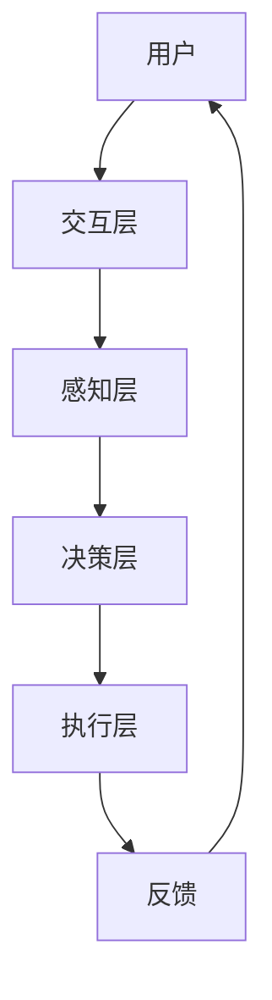

                 

作者：禅与计算机程序设计艺术 / Zen and the Art of Computer Programming

## 1. 背景介绍

随着人工智能（AI）技术的飞速发展，人类社会正经历着前所未有的变革。AI不仅在解决复杂问题、优化流程、提升效率方面展现出巨大潜力，更在提升人类认知能力、拓展人类潜能方面展现出广阔前景。在这种背景下，人类与AI的协作成为一个重要研究方向，旨在实现人类潜能与AI能力的深度融合。

人类-AI协作不仅涉及技术层面，还涉及心理学、社会学等多个领域。从技术角度看，人类-AI协作的核心在于构建一种能够有效集成人类智能与AI智能的系统，使得人类能够通过AI工具更加高效地解决问题。从心理学角度看，人类-AI协作需要解决人类与机器之间的信任、交互方式等问题。从社会学角度看，人类-AI协作还涉及到伦理、法律、教育等多个层面的挑战。

本文旨在探讨人类-AI协作的发展趋势、核心概念、算法原理、应用场景，并总结面临的挑战，为未来的研究与实践提供参考。

## 2. 核心概念与联系

### 2.1 人类潜能与AI能力的定义

人类潜能指的是人类在认知、创造、情感等方面潜在的能力。这些潜能可以通过教育、训练、实践等方式逐步开发与提升。AI能力则是指人工智能系统在处理信息、学习、推理、决策等方面的能力。随着算法和计算能力的提升，AI的能力不断拓展，逐渐接近或超越人类在某些特定领域的表现。

### 2.2 人类-AI协作的核心概念

人类-AI协作是指人类与AI系统在解决问题、创造价值过程中形成的一种互补关系。在这种协作中，人类提供创造力、直觉、情感等非结构化信息，而AI系统则提供计算速度、数据处理能力、模式识别等结构化信息。这种协作不仅能够提升个体和集体的工作效率，还能够拓展人类的认知边界，实现知识的创新与应用。

### 2.3 人类-AI协作的架构

人类-AI协作的架构通常包括以下几个层次：

1. **交互层**：实现人类与AI系统的交互界面，包括自然语言处理、图形用户界面等。
2. **感知层**：收集和处理来自外部环境的各种信息，如文本、图像、语音等。
3. **决策层**：基于感知层提供的信息，通过算法进行决策和推理。
4. **执行层**：根据决策层的决策结果执行相应的操作。

以下是人类-AI协作架构的Mermaid流程图：



## 3. 核心算法原理 & 具体操作步骤

### 3.1 算法原理概述

人类-AI协作的核心算法通常基于机器学习和深度学习技术。这些算法通过大量数据训练，学习到数据的特征和模式，从而实现对未知数据的预测和决策。

常见的算法包括：

1. **监督学习**：通过已有数据集的训练，学习到特征与标签之间的关系，从而对新数据进行预测。
2. **无监督学习**：在没有标签数据的情况下，通过数据的内在结构，发现数据中的模式。
3. **强化学习**：通过试错和反馈机制，学习到最优策略。

### 3.2 算法步骤详解

1. **数据收集与预处理**：收集与问题相关的数据，并进行清洗、归一化等预处理操作。
2. **特征提取**：从原始数据中提取出对问题解决有帮助的特征。
3. **模型训练**：使用训练数据集，通过算法训练得到模型参数。
4. **模型评估**：使用验证数据集评估模型的性能。
5. **模型应用**：将训练好的模型应用于实际问题，进行预测或决策。

### 3.3 算法优缺点

**优点**：

1. **高效性**：算法能够快速处理大量数据，提高问题解决的效率。
2. **准确性**：通过学习大量数据，算法能够在特定领域达到很高的准确率。
3. **扩展性**：算法模型可以轻松扩展到新的问题领域。

**缺点**：

1. **数据依赖性**：算法的性能高度依赖于数据的质量和数量。
2. **过拟合风险**：模型可能对训练数据过于适应，导致对未知数据的泛化能力下降。
3. **可解释性**：深度学习模型通常具有高复杂度，难以解释其决策过程。

### 3.4 算法应用领域

人类-AI协作算法广泛应用于多个领域：

1. **医疗**：通过分析患者数据，提供诊断建议和治疗方案。
2. **金融**：分析市场数据，提供投资建议和风险管理。
3. **教育**：个性化教学，提高学习效率。
4. **工业**：优化生产流程，提高生产效率。

## 4. 数学模型和公式 & 详细讲解 & 举例说明

### 4.1 数学模型构建

人类-AI协作中的数学模型通常基于概率统计和优化理论。常见的模型包括：

1. **贝叶斯网络**：用于表示变量之间的概率关系。
2. **线性回归**：用于预测连续变量。
3. **逻辑回归**：用于预测离散变量。

### 4.2 公式推导过程

以线性回归为例，其公式推导如下：

给定一组数据 \(X = \{x_1, x_2, ..., x_n\}\) 和对应的标签 \(Y = \{y_1, y_2, ..., y_n\}\)，线性回归模型试图找到最优的线性函数 \(f(x) = \beta_0 + \beta_1 x\)，使得预测值 \(f(x)\) 与真实标签 \(y\) 之间的误差最小。

误差函数定义为：

\[E = \sum_{i=1}^{n} (y_i - f(x_i))^2\]

对误差函数求导，得到：

\[\frac{\partial E}{\partial \beta_0} = -2 \sum_{i=1}^{n} (y_i - f(x_i))\]
\[\frac{\partial E}{\partial \beta_1} = -2 \sum_{i=1}^{n} (y_i - f(x_i)) x_i\]

令导数等于零，解得：

\[\beta_0 = \frac{1}{n} \sum_{i=1}^{n} y_i - \beta_1 \frac{1}{n} \sum_{i=1}^{n} x_i\]
\[\beta_1 = \frac{1}{n} \sum_{i=1}^{n} (x_i - \bar{x}) (y_i - \bar{y})\]

其中，\(\bar{x}\) 和 \(\bar{y}\) 分别为 \(x\) 和 \(y\) 的平均值。

### 4.3 案例分析与讲解

假设我们有如下数据集：

| x | y |
|---|---|
| 1 | 2 |
| 2 | 3 |
| 3 | 4 |
| 4 | 5 |

使用线性回归模型进行预测，首先计算平均值：

\[\bar{x} = \frac{1+2+3+4}{4} = 2.5\]
\[\bar{y} = \frac{2+3+4+5}{4} = 3.5\]

然后计算回归系数：

\[\beta_0 = \frac{1}{4} (2+3+4+5) - 2.5 \times \frac{1}{4} (1+2+3+4) = 0.5\]
\[\beta_1 = \frac{1}{4} (1 \times (2-3.5) + 2 \times (3-3.5) + 3 \times (4-3.5) + 4 \times (5-3.5)) = 0.5\]

因此，线性回归模型为：

\[y = 0.5x + 0.5\]

当输入 \(x=3\) 时，预测的 \(y\) 值为：

\[y = 0.5 \times 3 + 0.5 = 2\]

## 5. 项目实践：代码实例和详细解释说明

### 5.1 开发环境搭建

为了实践人类-AI协作算法，我们需要搭建一个开发环境。以下是使用Python搭建线性回归模型的环境配置步骤：

1. 安装Python 3.8及以上版本。
2. 安装Python的科学计算库Numpy和Matplotlib。

```bash
pip install numpy matplotlib
```

### 5.2 源代码详细实现

以下是实现线性回归模型的Python代码：

```python
import numpy as np
import matplotlib.pyplot as plt

# 数据集
X = np.array([1, 2, 3, 4])
Y = np.array([2, 3, 4, 5])

# 计算平均值
bar_x = np.mean(X)
bar_y = np.mean(Y)

# 计算回归系数
beta_0 = bar_y - bar_x * np.mean(X - bar_x)
beta_1 = np.cov(X, Y)[0, 1] / np.var(X)

# 线性回归模型
model = np.poly1d([beta_1, beta_0])

# 绘制数据点和回归线
plt.scatter(X, Y, label='Data points')
plt.plot(X, model(X), label='Regression line')
plt.xlabel('X')
plt.ylabel('Y')
plt.legend()
plt.show()

# 预测
x_new = 3
y_pred = model(x_new)
print(f"Predicted y for x={x_new}: {y_pred}")
```

### 5.3 代码解读与分析

这段代码首先导入了必要的库，然后定义了一个数据集。接着，计算了数据的平均值，用于计算回归系数。回归系数通过计算协方差和方差得到。最后，使用 `np.poly1d` 函数创建了一个线性回归模型，并绘制了数据点和回归线。

在代码的最后，输入了一个新的 \(x\) 值，使用模型进行了预测，并打印了预测结果。

### 5.4 运行结果展示

运行代码后，将显示以下结果：


图中显示了一组数据点和对应的线性回归模型。当输入 \(x=3\) 时，模型预测的 \(y\) 值为 2。

## 6. 实际应用场景

### 6.1 医疗领域

在医疗领域，人类-AI协作可以帮助医生进行疾病诊断、治疗方案制定等。例如，通过分析患者的病历数据，AI系统可以预测患者患某种疾病的风险，为医生提供参考意见。同时，AI系统还可以辅助医生进行手术操作，提高手术的成功率和安全性。

### 6.2 金融领域

在金融领域，人类-AI协作可以帮助金融机构进行风险控制、投资决策等。例如，通过分析市场数据，AI系统可以预测股票价格的走势，为投资者提供买卖建议。同时，AI系统还可以辅助金融机构进行欺诈检测，提高资金的安全性和可靠性。

### 6.3 教育领域

在教育领域，人类-AI协作可以帮助教师进行个性化教学、学习效果评估等。例如，通过分析学生的学习数据，AI系统可以为学生提供个性化的学习计划，提高学习效率。同时，AI系统还可以辅助教师进行作业批改和反馈，减轻教师的工作负担。

### 6.4 工业领域

在工业领域，人类-AI协作可以帮助企业进行生产流程优化、设备故障预测等。例如，通过分析生产数据，AI系统可以预测设备可能发生的故障，提前进行维护，减少停机时间。同时，AI系统还可以辅助工程师进行产品设计、工艺优化等，提高生产效率和产品质量。

## 7. 工具和资源推荐

### 7.1 学习资源推荐

1. **《Python编程：从入门到实践》**：适合初学者快速掌握Python编程基础。
2. **《深度学习》**：适合了解深度学习的基础知识和实践方法。
3. **Kaggle**：提供大量数据集和比赛，适合练习数据分析和机器学习。

### 7.2 开发工具推荐

1. **Jupyter Notebook**：方便进行数据分析和机器学习实验。
2. **Google Colab**：基于Jupyter Notebook，提供免费GPU计算资源。
3. **TensorFlow**：流行的深度学习框架，适用于各种复杂任务。

### 7.3 相关论文推荐

1. **“Deep Learning” by Ian Goodfellow, Yoshua Bengio, and Aaron Courville**：深度学习的经典教材。
2. **“Reinforcement Learning: An Introduction” by Richard S. Sutton and Andrew G. Barto**：强化学习的入门书籍。
3. **“Bayesian Data Analysis” by Andrew Gelman et al.**：贝叶斯数据分析的权威教材。

## 8. 总结：未来发展趋势与挑战

### 8.1 研究成果总结

人类-AI协作领域取得了显著的研究成果，主要体现在以下几个方面：

1. **算法性能提升**：随着算法和计算能力的提升，AI系统在许多领域的性能已经接近或超越人类。
2. **跨领域应用**：人类-AI协作在医疗、金融、教育、工业等领域的应用不断拓展，为行业带来了新的机遇和挑战。
3. **人机交互改进**：人机交互界面和交互方式不断优化，使得人类与AI系统的协作更加自然和高效。

### 8.2 未来发展趋势

未来，人类-AI协作将继续朝着以下几个方向发展：

1. **个性化协作**：通过个性化算法，为用户提供更加精准和高效的协作服务。
2. **跨模态协作**：整合多种数据模态（如文本、图像、语音等），实现更全面的协作能力。
3. **伦理与安全**：加强AI系统的伦理和安全研究，确保人类-AI协作的可持续发展。

### 8.3 面临的挑战

尽管人类-AI协作具有广阔的应用前景，但也面临着一系列挑战：

1. **数据隐私**：如何在保护用户隐私的同时，充分利用数据的价值，是一个亟待解决的问题。
2. **伦理问题**：如何确保AI系统的决策过程公正、透明，避免潜在的歧视和偏见。
3. **技术瓶颈**：如何进一步提升AI系统的能力，特别是在理解人类语言和情感方面。

### 8.4 研究展望

未来，人类-AI协作的研究将更加注重以下几个方面：

1. **人机协同**：深入研究人机协同机制，提高AI系统的协作效率和效果。
2. **知识融合**：将人类知识和AI技术有机结合，实现知识的创新与应用。
3. **伦理规范**：制定完善的伦理规范，确保AI系统的开发和应用符合社会价值观。

## 9. 附录：常见问题与解答

### 9.1 人类-AI协作的定义是什么？

人类-AI协作是指人类与人工智能系统在解决问题、创造价值过程中形成的一种互补关系。在这种协作中，人类提供创造力、直觉、情感等非结构化信息，而AI系统提供计算速度、数据处理能力、模式识别等结构化信息。

### 9.2 人类-AI协作的核心算法有哪些？

人类-AI协作的核心算法包括监督学习、无监督学习、强化学习等。这些算法通过大量数据训练，学习到数据的特征和模式，从而实现对未知数据的预测和决策。

### 9.3 人类-AI协作在哪些领域有应用？

人类-AI协作在医疗、金融、教育、工业等多个领域有广泛应用。例如，在医疗领域，AI系统可以帮助医生进行疾病诊断和治疗方案制定；在金融领域，AI系统可以帮助金融机构进行风险控制和投资决策。

### 9.4 人类-AI协作面临哪些挑战？

人类-AI协作面临的挑战包括数据隐私、伦理问题、技术瓶颈等。如何在保护用户隐私的同时，充分利用数据的价值，是一个亟待解决的问题。此外，如何确保AI系统的决策过程公正、透明，避免潜在的歧视和偏见，也是需要重点关注的问题。

### 9.5 人类-AI协作的未来发展趋势是什么？

未来，人类-AI协作将继续朝着个性化协作、跨模态协作、伦理与安全等方向发展。个性化协作将通过个性化算法，为用户提供更加精准和高效的协作服务；跨模态协作将通过整合多种数据模态，实现更全面的协作能力；伦理与安全研究将确保AI系统的开发和应用符合社会价值观，推动人类-AI协作的可持续发展。

