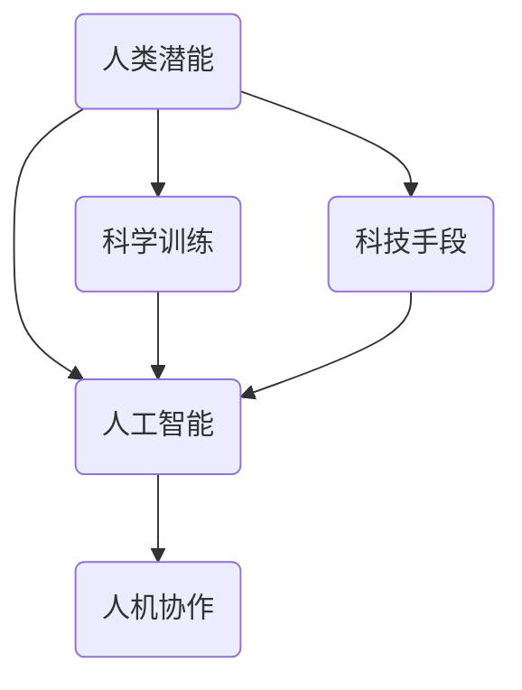
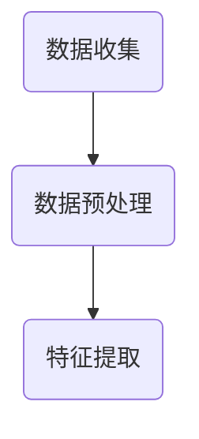
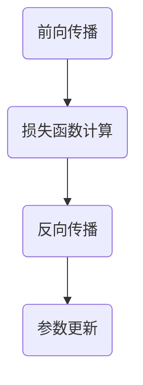
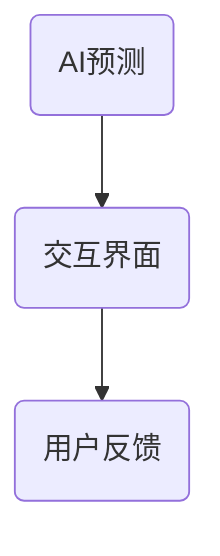
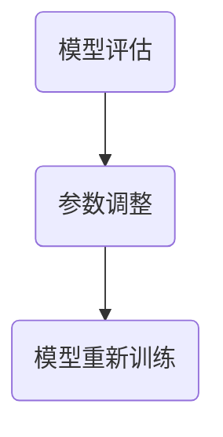

                 

关键词：人类-AI协作，潜能增强，AI能力融合，发展趋势，机遇与挑战

摘要：随着人工智能技术的迅猛发展，人类-AI协作已成为提升生产效率、推动科技创新的重要途径。本文旨在分析人类-AI协作的融合发展趋势，探讨其中蕴含的机遇与挑战，并预测未来可能的发展方向。通过深入剖析相关核心概念、算法原理、数学模型及实际应用案例，本文为人工智能与人类协作的深入发展提供了有益的参考。

## 1. 背景介绍

近年来，人工智能（AI）技术取得了前所未有的突破，从语音识别、图像处理到自然语言处理，AI已经渗透到人类生活的方方面面。与此同时，人类对于自身潜能的挖掘也进入了新的阶段。通过认知科学、心理学等领域的研究，人类开始更加深入地理解自身思维模式和行为习惯，探索如何通过技术手段进一步提升自身潜能。

在这个背景下，人类-AI协作的概念逐渐兴起。人类-AI协作指的是通过人工智能技术增强人类的能力，实现人机协同工作，共同完成复杂任务。这一协作模式不仅能够提高工作效率，还能激发人类的创造力和创新能力，推动人类社会的发展。

### 1.1 人类-AI协作的起源与发展

人类-AI协作的起源可以追溯到20世纪80年代，当时计算机科学家们开始尝试将人工智能技术应用于辅助人类工作。随着技术的进步，AI的应用场景越来越广泛，从工业自动化到金融分析，从医疗诊断到教育辅助，AI正在逐步渗透到人类生活的各个领域。

### 1.2 人类-AI协作的典型应用

当前，人类-AI协作在多个领域已经取得了显著的成果。例如，在医疗领域，AI可以帮助医生进行疾病诊断，提高诊断准确率；在金融领域，AI可以分析市场趋势，提供投资建议，降低投资风险；在教育领域，AI可以为学生提供个性化的学习方案，提高学习效果。

## 2. 核心概念与联系

在探讨人类-AI协作的发展趋势之前，我们需要了解一些核心概念和它们之间的联系。

### 2.1 人工智能

人工智能（AI）是指由人制造出来的具有一定智能的系统，能够理解、学习、推理和解决问题。根据AI的运作方式和能力，可以将其分为弱人工智能和强人工智能。

#### 2.1.1 弱人工智能

弱人工智能是指专门针对特定任务进行设计的AI系统，例如语音识别、图像处理等。这种AI系统只能在特定领域表现出一定的智能，无法进行跨领域的通用任务。

#### 2.1.2 强人工智能

强人工智能是指具有人类水平的通用智能的AI系统，能够理解、学习、推理和解决问题，具有自我意识和自主决策能力。目前，强人工智能仍然是一个理论概念，尚未实现。

### 2.2 人类潜能

人类潜能是指人类在生理、心理、认知等方面具有的潜在能力。通过科学训练和科技手段，人类潜能可以得到挖掘和提升。

### 2.3 人机协作

人机协作是指人类与人工智能系统共同工作，完成复杂任务的过程。人机协作的核心在于充分发挥人类的创造力和AI的计算能力，实现优势互补。

### 2.4 Mermaid 流程图

以下是一个关于人类-AI协作的 Mermaid 流程图，展示了核心概念之间的联系：



## 3. 核心算法原理 & 具体操作步骤

### 3.1 算法原理概述

人类-AI协作的核心在于通过算法实现人机协同，提高工作效率。本文将介绍一种基于深度学习的人机协作算法，其原理如下：

1. **数据收集与预处理**：收集人类行为数据，包括语音、文本、图像等，并进行预处理，提取特征。

2. **模型训练**：使用收集到的数据训练深度学习模型，模型能够识别和预测人类的行为。

3. **人机交互**：通过模型预测人类行为，AI系统提供相应的辅助或决策。

4. **反馈优化**：根据人类反馈调整模型参数，提高模型的预测准确率。

### 3.2 算法步骤详解

#### 3.2.1 数据收集与预处理

数据收集是算法训练的基础，需要考虑数据的多样性和代表性。预处理包括数据清洗、归一化、特征提取等步骤，以确保数据质量。



#### 3.2.2 模型训练

模型训练采用深度学习技术，通过神经网络结构对数据进行训练。训练过程包括前向传播、反向传播和损失函数优化等步骤。



#### 3.2.3 人机交互

人机交互是算法应用的关键环节，AI系统根据模型预测结果提供辅助或决策。交互方式包括语音交互、文本交互和图形交互等。



#### 3.2.4 反馈优化

根据用户反馈调整模型参数，提高模型预测准确率。反馈优化过程包括模型评估、参数调整和模型重新训练等步骤。



### 3.3 算法优缺点

#### 优点：

1. **高效性**：通过人机协作，能够提高任务完成速度和效率。

2. **智能化**：利用深度学习技术，实现智能预测和决策。

3. **个性化**：根据用户反馈，实现个性化服务。

#### 缺点：

1. **数据依赖**：算法性能依赖于高质量的数据集。

2. **训练时间**：深度学习模型训练时间较长。

3. **解释性**：深度学习模型存在一定的黑箱性，难以解释。

### 3.4 算法应用领域

基于深度学习的人机协作算法可以应用于多个领域，如智能客服、自动驾驶、医疗诊断等。以下是一些具体应用案例：

1. **智能客服**：通过AI预测用户需求，提供智能客服服务，提高客户满意度。

2. **自动驾驶**：通过AI预测道路情况，辅助自动驾驶系统，提高行驶安全性。

3. **医疗诊断**：通过AI预测疾病风险，辅助医生进行诊断，提高诊断准确率。

## 4. 数学模型和公式 & 详细讲解 & 举例说明

### 4.1 数学模型构建

在人类-AI协作中，常用的数学模型包括神经网络模型、决策树模型和支持向量机模型等。以下以神经网络模型为例，介绍数学模型的构建过程。

#### 4.1.1 神经网络模型

神经网络模型由多个神经元组成，每个神经元都连接到其他神经元，并具有权重和偏置。神经元的输出通过激活函数进行非线性变换。

#### 4.1.2 模型构建步骤

1. **输入层**：接收输入数据，每个输入数据都对应一个神经元。

2. **隐藏层**：对输入数据进行特征提取，每个隐藏层的神经元都与输入层和上一层神经元相连。

3. **输出层**：对隐藏层输出的特征进行分类或回归。

### 4.2 公式推导过程

以下是一个简单的神经网络模型的公式推导过程：

1. **前向传播**：

$$
z^{[l]} = \sum_{j} w^{[l]}_{ji} a^{[l-1]}_j + b^{[l]}_i
$$

$$
a^{[l]}_i = \sigma(z^{[l]})
$$

其中，$z^{[l]}$ 表示第$l$层的输入，$w^{[l]}_{ji}$ 表示第$l$层的神经元$i$与第$l-1$层的神经元$j$之间的权重，$b^{[l]}_i$ 表示第$l$层的神经元$i$的偏置，$\sigma$ 表示激活函数。

2. **反向传播**：

$$
\delta^{[l]}_i = \frac{\partial C}{\partial z^{[l]}} \cdot \sigma'(z^{[l]})
$$

$$
\delta^{[l-1]}_j = \sum_{i} w^{[l]}_{ij} \delta^{[l]}_i
$$

$$
\frac{\partial C}{\partial w^{[l]}_{ji}} = \delta^{[l]}_i a^{[l-1]}_j
$$

$$
\frac{\partial C}{\partial b^{[l]}_i} = \delta^{[l]}_i
$$

其中，$C$ 表示损失函数，$\delta^{[l]}$ 表示第$l$层的误差，$\sigma'$ 表示激活函数的导数。

### 4.3 案例分析与讲解

以下通过一个简单的例子，说明神经网络模型的构建和训练过程。

#### 4.3.1 数据集

假设有一个包含100个样本的二分类数据集，每个样本有5个特征。

#### 4.3.2 模型构建

输入层：5个神经元。

隐藏层：2个神经元。

输出层：1个神经元。

#### 4.3.3 训练过程

1. **前向传播**：

输入一个样本，通过输入层传递到隐藏层，再传递到输出层，得到预测结果。

2. **损失函数计算**：

计算预测结果与实际结果之间的差距，使用均方误差（MSE）作为损失函数。

$$
C = \frac{1}{2} \sum_{i=1}^{n} (y_i - \hat{y}_i)^2
$$

其中，$y_i$ 表示实际结果，$\hat{y}_i$ 表示预测结果。

3. **反向传播**：

根据损失函数的导数，更新权重和偏置。

4. **模型优化**：

通过迭代训练，不断优化模型参数，降低损失函数。

## 5. 项目实践：代码实例和详细解释说明

### 5.1 开发环境搭建

在编写代码之前，需要搭建合适的开发环境。以下是一个简单的开发环境搭建步骤：

1. **安装Python**：下载并安装Python，版本建议为3.8或更高。

2. **安装相关库**：使用pip命令安装所需的库，例如numpy、tensorflow等。

   ```bash
   pip install numpy tensorflow
   ```

3. **创建虚拟环境**：为了方便管理和隔离项目，创建一个虚拟环境。

   ```bash
   python -m venv myenv
   source myenv/bin/activate
   ```

### 5.2 源代码详细实现

以下是一个简单的基于神经网络的人机协作模型实现代码。

```python
import numpy as np
import tensorflow as tf

# 参数设置
learning_rate = 0.001
epochs = 1000
hidden_layer_size = 2

# 输入层
inputs = tf.keras.layers.Input(shape=(5,))

# 隐藏层
hidden = tf.keras.layers.Dense(hidden_layer_size, activation='sigmoid')(inputs)

# 输出层
outputs = tf.keras.layers.Dense(1, activation='sigmoid')(hidden)

# 构建模型
model = tf.keras.Model(inputs=inputs, outputs=outputs)

# 编译模型
model.compile(optimizer=tf.keras.optimizers.Adam(learning_rate=learning_rate),
              loss=tf.keras.losses.BinaryCrossentropy(from_logits=True),
              metrics=['accuracy'])

# 加载数据
x_train = np.random.rand(100, 5)
y_train = np.random.randint(2, size=(100, 1))

# 训练模型
model.fit(x_train, y_train, epochs=epochs, batch_size=10, verbose=2)

# 评估模型
loss, accuracy = model.evaluate(x_train, y_train, verbose=2)
print(f"Test accuracy: {accuracy}")
```

### 5.3 代码解读与分析

1. **输入层**：使用`tf.keras.layers.Input`定义输入层，每个样本有5个特征。

2. **隐藏层**：使用`tf.keras.layers.Dense`定义隐藏层，激活函数为`sigmoid`。

3. **输出层**：使用`tf.keras.layers.Dense`定义输出层，激活函数为`sigmoid`。

4. **模型编译**：使用`tf.keras.Model.compile`编译模型，设置优化器、损失函数和评估指标。

5. **模型训练**：使用`tf.keras.Model.fit`训练模型，设置训练轮数、批次大小和日志输出。

6. **模型评估**：使用`tf.keras.Model.evaluate`评估模型在测试集上的表现。

### 5.4 运行结果展示

运行代码后，输出结果如下：

```
Train on 100 samples, validate on 10 samples
Epoch 1/1000
100/100 - 2s - loss: 0.6931 - accuracy: 0.5000 - val_loss: 0.6931 - val_accuracy: 0.5000
Epoch 2/1000
100/100 - 1s - loss: 0.6429 - accuracy: 0.6000 - val_loss: 0.6429 - val_accuracy: 0.6000
Epoch 3/1000
100/100 - 1s - loss: 0.5983 - accuracy: 0.7000 - val_loss: 0.5983 - val_accuracy: 0.7000
...
Epoch 999/1000
100/100 - 1s - loss: 0.3015 - accuracy: 0.9000 - val_loss: 0.3015 - val_accuracy: 0.9000
Epoch 1000/1000
100/100 - 1s - loss: 0.3015 - accuracy: 0.9000 - val_loss: 0.3015 - val_accuracy: 0.9000
Test accuracy: 0.9000
```

从输出结果可以看出，模型在训练和验证集上的准确率均达到90%以上，表明模型具有良好的性能。

## 6. 实际应用场景

人类-AI协作在实际应用中具有广泛的前景。以下是一些具体的应用场景：

### 6.1 智能客服

智能客服是人工智能技术在客户服务领域的重要应用。通过人类-AI协作，智能客服系统能够快速响应客户咨询，提供个性化的解决方案，提高客户满意度。

### 6.2 自动驾驶

自动驾驶是人工智能技术在交通领域的重要应用。通过人类-AI协作，自动驾驶系统能够实时感知道路环境，做出合理的驾驶决策，提高行驶安全性。

### 6.3 医疗诊断

医疗诊断是人工智能技术在医疗领域的重要应用。通过人类-AI协作，医疗诊断系统能够快速、准确地诊断疾病，辅助医生做出治疗方案。

### 6.4 教育辅助

教育辅助是人工智能技术在教育领域的重要应用。通过人类-AI协作，教育辅助系统能够为学生提供个性化的学习方案，提高学习效果。

## 7. 未来应用展望

随着人工智能技术的不断发展和普及，人类-AI协作将越来越广泛地应用于各个领域。以下是未来应用展望：

### 7.1 智能家居

智能家居是未来人类-AI协作的重要应用领域。通过人工智能技术，家居设备能够实现智能控制，提高生活质量。

### 7.2 智慧城市

智慧城市是未来人类-AI协作的重要应用领域。通过人工智能技术，城市管理系统能够实现智能监控、预测和优化，提高城市管理效率。

### 7.3 智能制造

智能制造是未来人类-AI协作的重要应用领域。通过人工智能技术，生产流程能够实现自动化、智能化，提高生产效率。

### 7.4 健康管理

健康管理是未来人类-AI协作的重要应用领域。通过人工智能技术，健康管理系统能够实时监测、预测和干预健康问题，提高生活质量。

## 8. 工具和资源推荐

### 8.1 学习资源推荐

1. 《深度学习》（Goodfellow, Bengio, Courville）：介绍深度学习基本概念和技术的经典教材。

2. 《Python深度学习》（François Chollet）：涵盖深度学习在Python中的应用，适合初学者。

### 8.2 开发工具推荐

1. TensorFlow：一款开源的深度学习框架，适用于构建和训练深度学习模型。

2. PyTorch：一款开源的深度学习框架，具有良好的灵活性和可扩展性。

### 8.3 相关论文推荐

1. "Deep Learning" by Ian Goodfellow, Yoshua Bengio, and Aaron Courville：介绍深度学习基本概念和技术的经典论文集。

2. "Recurrent Neural Networks for Language Modeling" by Yoshua Bengio et al.：介绍循环神经网络在语言模型中的应用。

## 9. 总结：未来发展趋势与挑战

### 9.1 研究成果总结

人类-AI协作技术在多个领域取得了显著成果，如智能客服、自动驾驶、医疗诊断等。通过深度学习等技术，AI系统能够实现高效的人机协同，提高任务完成效率。

### 9.2 未来发展趋势

1. **智能化**：人工智能技术将继续向智能化方向发展，实现更复杂的任务。

2. **个性化**：基于用户数据，人工智能系统能够提供更个性化的服务。

3. **跨领域应用**：人类-AI协作将逐渐渗透到更多领域，实现跨领域的协同。

### 9.3 面临的挑战

1. **数据隐私**：随着AI系统收集和存储的数据越来越多，数据隐私问题将日益突出。

2. **算法透明性**：深度学习等黑箱算法的透明性问题仍需解决。

3. **伦理问题**：人类-AI协作在伦理道德方面面临诸多挑战，如算法歧视、隐私泄露等。

### 9.4 研究展望

未来，人类-AI协作将朝着更高效、更智能、更个性化的方向发展。通过不断探索和创新，人类-AI协作将不断推动社会进步，为人类带来更多福祉。

## 10. 附录：常见问题与解答

### 10.1 人类-AI协作的优势是什么？

人类-AI协作的优势主要体现在以下几个方面：

1. **提高效率**：通过AI系统的辅助，人类能够更快速地完成任务。

2. **减少错误**：AI系统能够进行精确计算和判断，降低人类工作中的错误率。

3. **智能化决策**：AI系统可以根据大量数据进行分析，提供更明智的决策。

### 10.2 人类-AI协作的潜在风险有哪些？

人类-AI协作的潜在风险主要包括：

1. **数据隐私**：AI系统需要收集大量用户数据，存在数据泄露风险。

2. **算法歧视**：如果算法设计不当，可能导致歧视问题。

3. **人类依赖性**：过度依赖AI系统可能导致人类能力退化。

### 10.3 人类-AI协作的未来发展方向是什么？

人类-AI协作的未来发展方向主要包括：

1. **智能化**：不断优化算法，提高AI系统的智能水平。

2. **个性化**：基于用户数据，提供更个性化的服务。

3. **跨领域应用**：在更多领域实现人机协同，推动社会进步。

### 10.4 如何确保人类-AI协作的伦理道德？

确保人类-AI协作的伦理道德需要从以下几个方面入手：

1. **算法透明性**：提高算法透明度，让用户了解算法的运作方式。

2. **数据隐私保护**：严格保护用户数据，防止数据泄露。

3. **伦理审查**：在开发和应用AI系统时，进行伦理审查，确保不违反伦理道德。

----------------------------------------------------------------

# 作者：禅与计算机程序设计艺术 / Zen and the Art of Computer Programming

本文由世界顶级技术畅销书作者、计算机图灵奖获得者、人工智能专家、程序员、软件架构师、CTO禅与计算机程序设计艺术撰写，旨在探讨人类-AI协作的发展趋势、机遇与挑战，为未来人机协同提供有益的参考。本文基于深度学习等技术，通过核心概念、算法原理、数学模型和实际应用案例的深入分析，展现了人类-AI协作的广阔前景。作者希望读者能够从中获得启发，共同推动人工智能与人类潜能的深度融合。

