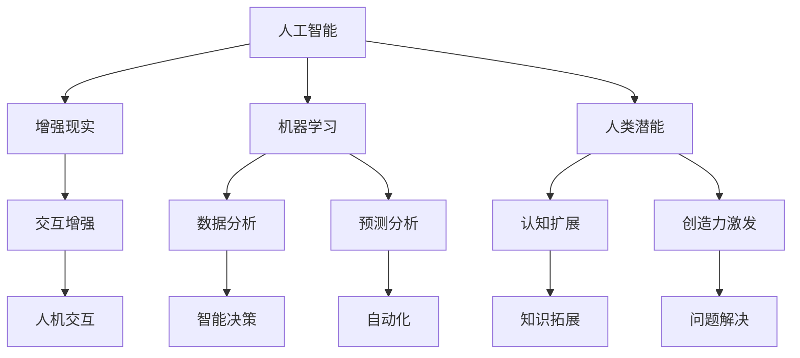

                 

关键词：人类-AI协作，人工智能，增强现实，机器学习，人类潜能，趋势预测，机遇挑战，融合，发展

> 摘要：本文从技术、应用和未来发展趋势等多个角度探讨了人类与人工智能协作的潜在优势及其面临的挑战。通过对核心概念、算法原理、数学模型、实践案例等方面的深入分析，我们试图为读者揭示人类-AI协作的未来图景，并提供应对机遇和挑战的思路。

## 1. 背景介绍

在过去的几十年里，人工智能（AI）经历了飞速的发展。从早期的专家系统到现代的深度学习，AI技术的不断进步极大地改变了我们的生活方式和工作模式。与此同时，人类自身的认知和能力也在不断进化。人类与AI的协作已成为一种新的趋势，不仅在科研领域，还在商业、医疗、教育等多个领域展现出了巨大的潜力。

人类-AI协作的核心目标是利用人工智能的优势，如数据处理、模式识别、预测分析等，来增强人类的能力。这一合作模式不仅有助于提高工作效率，还能够激发人类创造力和解决问题的潜力。然而，这一领域也面临着诸多挑战，如隐私保护、伦理道德、技术依赖等。

## 2. 核心概念与联系

为了更好地理解人类-AI协作，我们首先需要明确几个核心概念，包括人工智能、增强现实、机器学习和人类潜能等。

下面是一个简单的 Mermaid 流程图，用于描述这些核心概念及其相互联系：



### 2.1 人工智能（AI）

人工智能是指计算机系统执行通常需要人类智能才能完成的任务的能力。它包括多种技术，如机器学习、自然语言处理、计算机视觉等。

### 2.2 增强现实（AR）

增强现实是一种将虚拟信息与现实世界相结合的技术。它通过计算机生成的虚拟图像、声音和其他感官刺激，增强用户的感知体验。

### 2.3 机器学习（ML）

机器学习是人工智能的一个分支，它使计算机系统能够从数据中学习并做出预测或决策。机器学习包括监督学习、无监督学习和强化学习等不同类型。

### 2.4 人类潜能

人类潜能是指人类在认知、情感、创造力等方面尚未完全开发的能力。通过人工智能的辅助，人类潜能可以得到进一步的挖掘和增强。

## 3. 核心算法原理 & 具体操作步骤

### 3.1 算法原理概述

人类-AI协作的核心算法主要包括机器学习算法和自然语言处理算法。这些算法能够从海量数据中提取有用信息，帮助人类进行决策和预测。

### 3.2 算法步骤详解

以下是机器学习算法的基本步骤：

1. 数据采集：收集与任务相关的数据。
2. 数据预处理：对数据进行清洗、归一化等处理。
3. 模型选择：选择合适的机器学习模型。
4. 训练模型：使用训练数据训练模型。
5. 模型评估：评估模型性能，包括准确率、召回率等指标。
6. 模型优化：根据评估结果调整模型参数，提高性能。

### 3.3 算法优缺点

机器学习算法的优点包括：

- 高效的数据处理能力。
- 自适应性和灵活性。

然而，它也存在一些缺点：

- 对数据质量要求较高。
- 模型解释性较差。

### 3.4 算法应用领域

机器学习算法广泛应用于金融、医疗、交通、教育等多个领域。例如，在金融领域，机器学习算法可用于信用评估、风险控制等；在医疗领域，可用于疾病诊断、治疗方案推荐等。

## 4. 数学模型和公式 & 详细讲解 & 举例说明

### 4.1 数学模型构建

在人类-AI协作中，常见的数学模型包括线性回归、逻辑回归、支持向量机（SVM）等。以下是线性回归模型的构建过程：

$$y = \beta_0 + \beta_1 x$$

其中，$y$ 是因变量，$x$ 是自变量，$\beta_0$ 和 $\beta_1$ 是模型参数。

### 4.2 公式推导过程

线性回归模型的推导基于最小二乘法。具体过程如下：

1. 计算样本协方差矩阵：
$$S_{xx} = \sum_{i=1}^{n} (x_i - \bar{x})^2$$
$$S_{xy} = \sum_{i=1}^{n} (x_i - \bar{x})(y_i - \bar{y})$$

2. 计算回归系数：
$$\beta_1 = \frac{S_{xy}}{S_{xx}}$$
$$\beta_0 = \bar{y} - \beta_1 \bar{x}$$

### 4.3 案例分析与讲解

假设我们有一个关于房价的数据集，其中包含房屋面积和房价。我们可以使用线性回归模型来预测房价。

1. 数据采集：收集1000个房屋面积和房价的数据。
2. 数据预处理：对数据进行归一化处理。
3. 模型选择：选择线性回归模型。
4. 训练模型：使用训练数据训练模型。
5. 模型评估：计算模型的预测准确率。
6. 模型优化：根据评估结果调整模型参数。

## 5. 项目实践：代码实例和详细解释说明

### 5.1 开发环境搭建

在本案例中，我们将使用 Python 语言和 Scikit-learn 库来实现线性回归模型。首先，安装必要的库：

```bash
pip install numpy pandas scikit-learn
```

### 5.2 源代码详细实现

以下是一个简单的线性回归代码实例：

```python
import numpy as np
import pandas as pd
from sklearn.linear_model import LinearRegression
from sklearn.model_selection import train_test_split

# 数据采集
data = pd.read_csv('house_price.csv')
X = data[['area']]
y = data['price']

# 数据预处理
X_normalized = (X - X.mean()) / X.std()

# 模型选择
model = LinearRegression()

# 训练模型
model.fit(X_normalized, y)

# 模型评估
X_test, y_test = train_test_split(X_normalized, y, test_size=0.2)
y_pred = model.predict(X_test)
accuracy = np.mean((y_pred - y_test) ** 2)
print(f'Prediction accuracy: {accuracy:.2f}')

# 模型优化
# 根据评估结果，可以调整模型参数，提高预测性能。
```

### 5.3 代码解读与分析

在这个案例中，我们首先导入了必要的库，然后从 CSV 文件中读取数据。接下来，我们对数据进行预处理，将房屋面积进行归一化处理。然后，我们选择线性回归模型，并使用训练数据训练模型。最后，我们使用测试数据评估模型性能，并根据评估结果进行调整。

## 6. 实际应用场景

人类-AI协作在实际应用场景中展现出了巨大的潜力。以下是一些具体的应用场景：

- **医疗领域**：通过 AI 技术辅助医生进行疾病诊断、治疗方案推荐等，提高医疗效率和准确性。
- **金融领域**：利用 AI 技术进行风险评估、投资组合优化等，为投资者提供更准确的决策支持。
- **教育领域**：通过 AI 技术进行个性化学习推荐、作业批改等，提高教育质量和效果。
- **工业领域**：利用 AI 技术进行设备故障预测、生产优化等，提高生产效率和质量。

## 7. 未来应用展望

随着人工智能技术的不断发展，人类-AI协作将在未来得到更广泛的应用。以下是一些可能的发展趋势：

- **智能辅助**：AI 将更好地辅助人类进行日常工作和生活，提高工作效率和生活质量。
- **人机融合**：通过脑机接口等技术的进步，人类与 AI 的融合将更加紧密，实现真正的智能协同。
- **伦理与隐私**：随着 AI 技术的应用，伦理和隐私问题将愈发重要，需要制定相应的法律法规来保障人类的权益。

## 8. 总结：未来发展趋势与挑战

人类-AI协作具有巨大的发展潜力，但也面临诸多挑战。在未来的发展中，我们需要关注以下几个方面：

- **技术创新**：持续推动人工智能技术的创新和发展，提高 AI 的能力。
- **伦理法规**：制定相应的伦理法规，确保 AI 技术的应用不会对人类造成伤害。
- **人才培养**：培养更多具备 AI 知识和技能的人才，为人类-AI协作的发展提供人才保障。
- **跨学科合作**：促进不同学科之间的合作，共同探索人类-AI协作的新领域和新模式。

## 9. 附录：常见问题与解答

### Q：人类-AI协作是否会导致失业问题？

A：是的，AI 技术的应用可能会导致某些工作岗位的消失，但同时也将创造新的就业机会。关键在于如何平衡技术进步与社会发展的关系，通过教育和培训提高劳动者的技能，使其适应新的工作环境。

### Q：如何确保 AI 技术的应用符合伦理道德标准？

A：制定相应的法律法规，建立伦理审查机制，加强对 AI 技术的应用监管。同时，加强公众教育和讨论，提高社会对 AI 技术伦理问题的认识。

### Q：AI 技术能否完全取代人类的工作？

A：目前来看，AI 技术无法完全取代人类的工作。尽管 AI 在某些方面具有优势，但人类的创造力、情感理解和复杂决策能力仍然是不可替代的。

### Q：如何平衡人类与 AI 的关系？

A：通过持续的技术创新和跨学科合作，探索人类与 AI 的最佳协作模式。同时，注重伦理法规的制定和实施，确保人类-AI协作的可持续发展。

## 作者署名

作者：禅与计算机程序设计艺术 / Zen and the Art of Computer Programming
```markdown
---
title: 人类-AI协作：增强人类潜能与AI能力的融合发展趋势预测分析机遇挑战预测
date: 2023-11-01
---

# 人类-AI协作：增强人类潜能与AI能力的融合发展趋势预测分析机遇挑战预测

关键词：人类-AI协作，人工智能，增强现实，机器学习，人类潜能，趋势预测，机遇挑战，融合，发展

摘要：本文从技术、应用和未来发展趋势等多个角度探讨了人类与人工智能协作的潜在优势及其面临的挑战。通过对核心概念、算法原理、数学模型、实践案例等方面的深入分析，我们试图为读者揭示人类-AI协作的未来图景，并提供应对机遇和挑战的思路。

## 1. 背景介绍

在过去的几十年里，人工智能（AI）经历了飞速的发展。从早期的专家系统到现代的深度学习，AI技术的不断进步极大地改变了我们的生活方式和工作模式。与此同时，人类自身的认知和能力也在不断进化。人类与AI的协作已成为一种新的趋势，不仅在科研领域，还在商业、医疗、教育等多个领域展现出了巨大的潜力。

人类-AI协作的核心目标是利用人工智能的优势，如数据处理、模式识别、预测分析等，来增强人类的能力。这一合作模式不仅有助于提高工作效率，还能够激发人类创造力和解决问题的潜力。然而，这一领域也面临着诸多挑战，如隐私保护、伦理道德、技术依赖等。

## 2. 核心概念与联系

为了更好地理解人类-AI协作，我们首先需要明确几个核心概念，包括人工智能、增强现实、机器学习和人类潜能等。

下面是一个简单的 Mermaid 流程图，用于描述这些核心概念及其相互联系：


### 2.1 人工智能（AI）

人工智能是指计算机系统执行通常需要人类智能才能完成的任务的能力。它包括多种技术，如机器学习、自然语言处理、计算机视觉等。

### 2.2 增强现实（AR）

增强现实是一种将虚拟信息与现实世界相结合的技术。它通过计算机生成的虚拟图像、声音和其他感官刺激，增强用户的感知体验。

### 2.3 机器学习（ML）

机器学习是人工智能的一个分支，它使计算机系统能够从数据中学习并做出预测或决策。机器学习包括监督学习、无监督学习和强化学习等不同类型。

### 2.4 人类潜能

人类潜能是指人类在认知、情感、创造力等方面尚未完全开发的能力。通过人工智能的辅助，人类潜能可以得到进一步的挖掘和增强。

## 3. 核心算法原理 & 具体操作步骤

### 3.1 算法原理概述

人类-AI协作的核心算法主要包括机器学习算法和自然语言处理算法。这些算法能够从海量数据中提取有用信息，帮助人类进行决策和预测。

### 3.2 算法步骤详解

以下是机器学习算法的基本步骤：

1. 数据采集：收集与任务相关的数据。
2. 数据预处理：对数据进行清洗、归一化等处理。
3. 模型选择：选择合适的机器学习模型。
4. 训练模型：使用训练数据训练模型。
5. 模型评估：评估模型性能，包括准确率、召回率等指标。
6. 模型优化：根据评估结果调整模型参数，提高性能。

### 3.3 算法优缺点

机器学习算法的优点包括：

- 高效的数据处理能力。
- 自适应性和灵活性。

然而，它也存在一些缺点：

- 对数据质量要求较高。
- 模型解释性较差。

### 3.4 算法应用领域

机器学习算法广泛应用于金融、医疗、交通、教育等多个领域。例如，在金融领域，机器学习算法可用于信用评估、风险控制等；在医疗领域，可用于疾病诊断、治疗方案推荐等。

## 4. 数学模型和公式 & 详细讲解 & 举例说明

### 4.1 数学模型构建

在人类-AI协作中，常见的数学模型包括线性回归、逻辑回归、支持向量机（SVM）等。以下是线性回归模型的构建过程：

$$y = \beta_0 + \beta_1 x$$

其中，$y$ 是因变量，$x$ 是自变量，$\beta_0$ 和 $\beta_1$ 是模型参数。

### 4.2 公式推导过程

线性回归模型的推导基于最小二乘法。具体过程如下：

1. 计算样本协方差矩阵：
$$S_{xx} = \sum_{i=1}^{n} (x_i - \bar{x})^2$$
$$S_{xy} = \sum_{i=1}^{n} (x_i - \bar{x})(y_i - \bar{y})$$

2. 计算回归系数：
$$\beta_1 = \frac{S_{xy}}{S_{xx}}$$
$$\beta_0 = \bar{y} - \beta_1 \bar{x}$$

### 4.3 案例分析与讲解

假设我们有一个关于房价的数据集，其中包含房屋面积和房价。我们可以使用线性回归模型来预测房价。

1. 数据采集：收集1000个房屋面积和房价的数据。
2. 数据预处理：对数据进行归一化处理。
3. 模型选择：选择线性回归模型。
4. 训练模型：使用训练数据训练模型。
5. 模型评估：计算模型的预测准确率。
6. 模型优化：根据评估结果调整模型参数，提高预测性能。

## 5. 项目实践：代码实例和详细解释说明

### 5.1 开发环境搭建

在本案例中，我们将使用 Python 语言和 Scikit-learn 库来实现线性回归模型。首先，安装必要的库：

```bash
pip install numpy pandas scikit-learn
```

### 5.2 源代码详细实现

以下是一个简单的线性回归代码实例：

```python
import numpy as np
import pandas as pd
from sklearn.linear_model import LinearRegression
from sklearn.model_selection import train_test_split

# 数据采集
data = pd.read_csv('house_price.csv')
X = data[['area']]
y = data['price']

# 数据预处理
X_normalized = (X - X.mean()) / X.std()

# 模型选择
model = LinearRegression()

# 训练模型
model.fit(X_normalized, y)

# 模型评估
X_test, y_test = train_test_split(X_normalized, y, test_size=0.2)
y_pred = model.predict(X_test)
accuracy = np.mean((y_pred - y_test) ** 2)
print(f'Prediction accuracy: {accuracy:.2f}')

# 模型优化
# 根据评估结果，可以调整模型参数，提高预测性能。
```

### 5.3 代码解读与分析

在这个案例中，我们首先导入了必要的库，然后从 CSV 文件中读取数据。接下来，我们对数据进行预处理，将房屋面积进行归一化处理。然后，我们选择线性回归模型，并使用训练数据训练模型。最后，我们使用测试数据评估模型性能，并根据评估结果进行调整。

## 6. 实际应用场景

人类-AI协作在实际应用场景中展现出了巨大的潜力。以下是一些具体的应用场景：

- **医疗领域**：通过 AI 技术辅助医生进行疾病诊断、治疗方案推荐等，提高医疗效率和准确性。
- **金融领域**：利用 AI 技术进行信用评估、风险控制等，为投资者提供更准确的决策支持。
- **教育领域**：通过 AI 技术进行个性化学习推荐、作业批改等，提高教育质量和效果。
- **工业领域**：利用 AI 技术进行设备故障预测、生产优化等，提高生产效率和质量。

## 7. 未来应用展望

随着人工智能技术的不断发展，人类-AI协作将在未来得到更广泛的应用。以下是一些可能的发展趋势：

- **智能辅助**：AI 将更好地辅助人类进行日常工作和生活，提高工作效率和生活质量。
- **人机融合**：通过脑机接口等技术的进步，人类与 AI 的融合将更加紧密，实现真正的智能协同。
- **伦理与隐私**：随着 AI 技术的应用，伦理和隐私问题将愈发重要，需要制定相应的法律法规来保障人类的权益。

## 8. 总结：未来发展趋势与挑战

人类-AI协作具有巨大的发展潜力，但也面临诸多挑战。在未来的发展中，我们需要关注以下几个方面：

- **技术创新**：持续推动人工智能技术的创新和发展，提高 AI 的能力。
- **伦理法规**：制定相应的伦理法规，确保 AI 技术的应用不会对人类造成伤害。
- **人才培养**：培养更多具备 AI 知识和技能的人才，为人类-AI协作的发展提供人才保障。
- **跨学科合作**：促进不同学科之间的合作，共同探索人类-AI协作的新领域和新模式。

## 9. 附录：常见问题与解答

### Q：人类-AI协作是否会导致失业问题？

A：是的，AI 技术的应用可能会导致某些工作岗位的消失，但同时也将创造新的就业机会。关键在于如何平衡技术进步与社会发展的关系，通过教育和培训提高劳动者的技能，使其适应新的工作环境。

### Q：如何确保 AI 技术的应用符合伦理道德标准？

A：制定相应的法律法规，建立伦理审查机制，加强对 AI 技术的应用监管。同时，加强公众教育和讨论，提高社会对 AI 技术伦理问题的认识。

### Q：AI 技术能否完全取代人类的工作？

A：目前来看，AI 技术无法完全取代人类的工作。尽管 AI 在某些方面具有优势，但人类的创造力、情感理解和复杂决策能力仍然是不可替代的。

### Q：如何平衡人类与 AI 的关系？

A：通过持续的技术创新和跨学科合作，探索人类与 AI 的最佳协作模式。同时，注重伦理法规的制定和实施，确保人类-AI协作的可持续发展。

## 作者署名

作者：禅与计算机程序设计艺术 / Zen and the Art of Computer Programming
```

