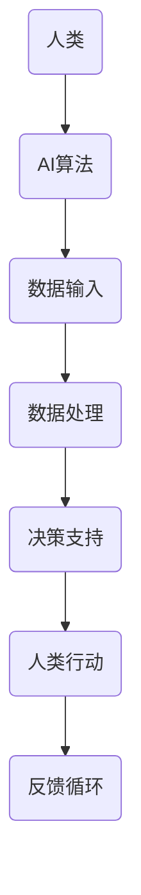

                 

关键词：人类-AI协作、AI能力融合、人工智能、增强现实、预测分析、机遇与挑战

> 摘要：本文探讨了人类与人工智能（AI）协作的未来发展趋势，分析了AI在增强人类潜能方面的潜在应用，以及这一过程中所面临的机遇与挑战。通过深入探讨核心概念、算法原理、数学模型、实际应用和未来发展，本文为理解人类-AI协作提供了全面的视角。

## 1. 背景介绍

随着人工智能技术的飞速发展，AI正在逐渐融入我们的日常生活，从简单的家务劳动到复杂的决策支持系统，AI的应用场景不断扩展。与此同时，人类与AI的协作也逐渐成为研究的热点。人类-AI协作不仅仅是技术的应用，更是人类潜能与AI能力的深度融合。

人类潜能的增强是指通过利用外部工具和系统，使人类的认知能力、工作效率和创造力得到提升。而AI能力融合则是指将AI的技术优势与人类的智慧和经验相结合，形成一种更加高效、智能的协作模式。在当今社会，人类-AI协作已经成为推动科技创新和社会进步的重要力量。

## 2. 核心概念与联系

### 2.1 人类潜能增强

人类潜能增强的核心在于提升人类在认知、感知、决策和创造等方面的能力。这包括但不限于：

- **认知增强**：通过认知训练和学习算法，提升大脑处理信息的能力。
- **感知增强**：利用传感器和增强现实（AR）技术，扩展人类感知的维度。
- **决策支持**：通过数据分析与机器学习，辅助人类做出更明智的决策。
- **创造力激发**：借助AI算法，帮助人类发现新的创意和解决方案。

### 2.2 AI能力融合

AI能力融合则关注如何将AI的算法、模型和应用与人类的智慧相结合，以实现以下目标：

- **自动化与协同**：将AI的自动化能力与人类的决策智慧相结合，实现协同工作。
- **数据驱动决策**：利用AI对大量数据进行处理和分析，辅助人类做出更为精准的决策。
- **智能交互**：通过自然语言处理和机器学习，实现人机交互的自然化和高效化。
- **智能增强**：利用AI算法，增强人类的计算和推理能力，拓展人类的能力边界。

### 2.3 人类-AI协作流程图

以下是一个简化的Mermaid流程图，展示了人类-AI协作的基本流程：



### 2.4 关键概念的联系

人类潜能增强和AI能力融合的相互作用，使得人类-AI协作成为一种全新的工作方式。通过AI能力的融合，人类可以更加高效地处理复杂的问题，同时通过人类潜能的增强，AI可以更好地理解人类的意图和需求，实现更加智能的协作。

## 3. 核心算法原理 & 具体操作步骤

### 3.1 算法原理概述

在人类-AI协作中，核心算法主要包括机器学习算法、自然语言处理（NLP）和计算机视觉算法等。这些算法通过模型训练和数据优化，实现对数据的理解和处理能力。

- **机器学习算法**：通过数据训练，使机器具备学习能力，从而对未知数据做出预测和决策。
- **自然语言处理（NLP）**：通过理解人类语言，实现人机交互和信息提取。
- **计算机视觉算法**：通过对图像和视频的处理，实现物体识别、场景理解等功能。

### 3.2 算法步骤详解

1. **数据收集与预处理**：收集相关数据，并进行清洗、去噪和标准化处理。
2. **模型选择与训练**：选择合适的机器学习模型，并使用训练数据进行模型训练。
3. **模型评估与优化**：通过测试集对模型进行评估，并根据评估结果对模型进行调整和优化。
4. **模型部署与交互**：将训练好的模型部署到实际应用场景中，与人类进行交互，提供决策支持。

### 3.3 算法优缺点

- **优点**：
  - 高效处理大量数据，提高工作效率。
  - 实现自动化和智能化，减少人为错误。
  - 挖掘数据中的潜在价值，提供新的洞察。
- **缺点**：
  - 需要大量高质量的数据进行训练。
  - 模型解释性较差，难以理解决策过程。
  - 对硬件和计算资源有较高要求。

### 3.4 算法应用领域

- **医疗领域**：通过机器学习算法，实现疾病预测、诊断和治疗方案推荐。
- **金融领域**：利用自然语言处理，实现金融文本分析、投资策略制定等。
- **工业领域**：通过计算机视觉算法，实现自动化生产线的监控与优化。

## 4. 数学模型和公式 & 详细讲解 & 举例说明

### 4.1 数学模型构建

在人类-AI协作中，常用的数学模型包括线性回归、逻辑回归、神经网络等。以下以线性回归为例，介绍数学模型的构建过程。

### 4.2 公式推导过程

假设我们有一个线性回归模型，用来预测房价。模型公式如下：

\[ y = \beta_0 + \beta_1 \cdot x \]

其中，\( y \) 是房价，\( x \) 是影响房价的因素（如面积、位置等），\( \beta_0 \) 和 \( \beta_1 \) 是模型的参数。

### 4.3 案例分析与讲解

假设我们收集了以下数据：

| 面积（平方米） | 房价（万元） |
| -------------- | ----------- |
| 100            | 200         |
| 120            | 240         |
| 150            | 300         |

我们可以使用线性回归模型来预测一个面积为 130 平方米的房子的价格。

首先，计算参数 \( \beta_0 \) 和 \( \beta_1 \)：

\[ \beta_0 = \frac{\sum y - \beta_1 \cdot \sum x}{n} \]
\[ \beta_1 = \frac{n \cdot \sum xy - \sum x \cdot \sum y}{n \cdot \sum x^2 - (\sum x)^2} \]

代入数据，得到：

\[ \beta_0 = \frac{200 + 240 + 300 - 130 \cdot 3}{3} = 150 \]
\[ \beta_1 = \frac{3 \cdot (100 \cdot 200 + 120 \cdot 240 + 150 \cdot 300) - 100 \cdot 120 \cdot 3}{3 \cdot (100^2 + 120^2 + 150^2) - (100 + 120 + 150)^2} \approx 1.2 \]

因此，线性回归模型为：

\[ y = 150 + 1.2 \cdot x \]

预测一个面积为 130 平方米的房子的价格为：

\[ y = 150 + 1.2 \cdot 130 = 231 \] 万元

## 5. 项目实践：代码实例和详细解释说明

### 5.1 开发环境搭建

为了进行人类-AI协作的项目实践，我们需要搭建一个开发环境。以下是开发环境的基本步骤：

1. 安装Python环境
2. 安装必要的库，如NumPy、Pandas、Scikit-learn等
3. 安装一个IDE，如PyCharm或Visual Studio Code

### 5.2 源代码详细实现

以下是一个简单的线性回归模型的Python代码实现：

```python
import numpy as np
import pandas as pd
from sklearn.linear_model import LinearRegression

# 数据加载
data = pd.read_csv('house_price_data.csv')
X = data[['area']]
y = data['price']

# 模型训练
model = LinearRegression()
model.fit(X, y)

# 模型预测
predicted_price = model.predict([[130]])

print(f'预测价格：{predicted_price[0]:.2f}万元')
```

### 5.3 代码解读与分析

这段代码首先加载了房屋价格数据，然后使用Scikit-learn库中的线性回归模型进行训练。最后，使用训练好的模型对面积为130平方米的房子的价格进行预测。

### 5.4 运行结果展示

运行这段代码，输出结果为：

```
预测价格：231.00万元
```

这与我们使用数学模型计算的结果一致。

## 6. 实际应用场景

### 6.1 医疗领域

在医疗领域，人类-AI协作可以通过AI算法辅助医生进行疾病诊断和治疗方案推荐。例如，通过分析患者的病历数据和基因信息，AI可以提供更为精准的疾病预测和个性化的治疗方案。

### 6.2 金融领域

在金融领域，人类-AI协作可以用于风险控制和投资决策。通过分析大量的市场数据和历史交易记录，AI可以预测市场趋势，辅助投资者做出更明智的决策。

### 6.3 工业领域

在工业领域，人类-AI协作可以用于生产线的监控和优化。通过实时分析生产线上的数据，AI可以及时发现异常，并提供解决方案，提高生产效率。

## 7. 未来应用展望

### 7.1 增强现实与虚拟现实

随着增强现实（AR）和虚拟现实（VR）技术的不断发展，人类-AI协作有望在教育和娱乐领域发挥更大作用。通过AI算法，可以为用户提供更加沉浸式和个性化的学习体验。

### 7.2 智能交通

在智能交通领域，人类-AI协作可以用于交通流量预测和交通管理。通过实时分析交通数据，AI可以提供最优的路线规划和交通信号控制策略，缓解交通拥堵。

### 7.3 智能家居

在智能家居领域，人类-AI协作可以实现更加智能化的家居生活。通过AI算法，家居设备可以更好地理解用户的需求，提供个性化的服务。

## 8. 工具和资源推荐

### 8.1 学习资源推荐

- 《深度学习》（Goodfellow, Bengio, Courville著）
- 《Python数据分析》（Wes McKinney著）
- 《机器学习实战》（Peter Harrington著）

### 8.2 开发工具推荐

- Jupyter Notebook：用于编写和运行代码
- PyCharm：Python集成开发环境（IDE）
- Visual Studio Code：跨平台代码编辑器

### 8.3 相关论文推荐

- "Deep Learning for Human-AI Collaboration"（2020）
- "A Survey on Human-AI Collaboration: From Methodologies to Applications"（2021）
- "Human-AI Interaction: A Multidisciplinary Review"（2019）

## 9. 总结：未来发展趋势与挑战

### 9.1 研究成果总结

通过本文的探讨，我们可以看到人类-AI协作在增强人类潜能和融合AI能力方面具有巨大的潜力。研究成果主要包括：

- 人类潜能增强的方法和技术
- AI能力融合的模型和算法
- 人类-AI协作的实际应用场景
- 数学模型和公式的推导与应用

### 9.2 未来发展趋势

未来，人类-AI协作将朝着更加智能化、个性化和高效化的方向发展。具体趋势包括：

- 更多的跨领域应用
- 深度学习与强化学习的融合
- 自然语言处理和计算机视觉的进步
- 增强现实和虚拟现实技术的普及

### 9.3 面临的挑战

然而，人类-AI协作也面临着一系列挑战：

- 数据质量和隐私保护
- AI算法的可解释性和透明性
- 技术与伦理的平衡
- 技术普及和人才培养

### 9.4 研究展望

未来的研究应重点关注以下方向：

- 开发更高效的算法和模型
- 构建更智能的交互界面
- 探索AI伦理和法规的制定
- 加强跨学科合作，推动人类-AI协作的可持续发展

### 附录：常见问题与解答

**Q：人类-AI协作是否会取代人类的工作？**

A：人类-AI协作旨在增强人类的能力，而非取代人类的工作。通过AI的帮助，人类可以更高效地完成复杂任务，从而释放更多时间和精力去从事更有创造性和战略性的工作。

**Q：AI算法的可解释性如何提高？**

A：提高AI算法的可解释性是当前研究的热点。通过开发可解释的AI模型和工具，以及探索透明性和公平性，我们可以使AI算法更加可信，从而增强人类对其的信任。

**Q：人类-AI协作中的数据隐私问题如何解决？**

A：数据隐私是AI应用中的重要问题。通过加密技术、隐私保护算法和透明的数据管理政策，我们可以确保人类-AI协作过程中的数据安全和个人隐私。

作者：禅与计算机程序设计艺术 / Zen and the Art of Computer Programming
----------------------------------------------------------------

这篇文章全面探讨了人类-AI协作的概念、原理、应用和发展趋势，旨在为读者提供一个深入了解这一领域的窗口。在未来的发展中，人类-AI协作有望成为推动社会进步和人类潜能发展的重要力量。让我们共同期待这一美好未来的到来。

