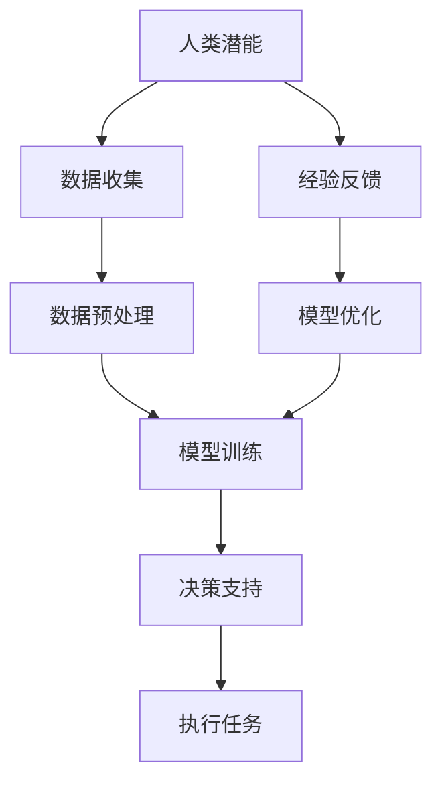

                 

关键词：人类-AI协作、人工智能、潜能增强、AI能力融合、发展趋势、预测分析、机遇、挑战

摘要：随着人工智能技术的迅猛发展，人类与AI的协作逐渐成为学术界和工业界关注的焦点。本文旨在探讨人类-AI协作的核心理念、发展趋势，分析其带来的机遇与挑战，并预测未来可能的发展方向。文章将详细阐述人类-AI协作的理论基础、核心算法、数学模型，并通过实际项目案例进行验证，最终提出未来研究的展望。

## 1. 背景介绍

自20世纪50年代人工智能（AI）的概念首次提出以来，AI技术经历了数十年的发展，从最初的理论探讨逐步走向实际应用。特别是进入21世纪，随着大数据、云计算、深度学习等技术的突破，AI的应用场景和领域不断拓展，已经深入到社会生活的各个方面。从自动驾驶、智能医疗、金融风控到教育、娱乐、生活服务，AI无处不在。

与此同时，人类的潜能也在不断地被探索和挖掘。心理学家和教育学家发现，人类具有巨大的潜能，但往往因为各种原因无法得到充分的发挥。例如，语言能力、创造力、记忆力等都是人类独有的特质，但传统的教育模式和方法往往无法完全激发这些潜能。

在这样的背景下，人类-AI协作的概念逐渐形成。人类与AI协作的目的是通过AI技术增强人类的潜能，使人类能够更高效、更准确地完成任务，同时AI也能从人类的经验和直觉中学习，实现共同进步。

## 2. 核心概念与联系

### 2.1 人类-AI协作的概念

人类-AI协作是指人类与人工智能系统共同工作，相互补充，实现更高效的目标。在这种协作中，人类发挥创意、直觉和判断力，而AI则负责处理大量数据、执行复杂计算和模式识别。

### 2.2 核心概念原理和架构

为了更好地理解人类-AI协作，我们可以通过一个Mermaid流程图来展示其核心概念原理和架构。



- **数据收集**：人类通过感知和体验收集数据。
- **数据预处理**：AI对数据进行清洗、转换和归一化。
- **模型训练**：AI使用预处理后的数据训练模型。
- **决策支持**：人类结合AI的预测结果和自身的经验做出决策。
- **执行任务**：人类执行决策，完成任务。
- **经验反馈**：任务执行后的结果反馈给AI，用于模型优化。

## 3. 核心算法原理 & 具体操作步骤

### 3.1 算法原理概述

人类-AI协作的核心算法是基于机器学习和深度学习的模型训练与优化。机器学习算法通过学习数据中的模式，自动识别特征，并生成预测模型。深度学习算法则通过多层神经网络结构，对复杂的数据进行层次化处理。

### 3.2 算法步骤详解

1. **数据收集**：人类通过感知和体验收集数据。
2. **数据预处理**：AI对数据进行清洗、转换和归一化。
3. **模型训练**：AI使用预处理后的数据训练模型。
4. **模型评估**：使用测试集对模型进行评估，调整参数。
5. **决策支持**：人类结合AI的预测结果和自身的经验做出决策。
6. **执行任务**：人类执行决策，完成任务。
7. **经验反馈**：任务执行后的结果反馈给AI，用于模型优化。

### 3.3 算法优缺点

- **优点**：提高任务效率，降低人力成本，扩展人类认知边界。
- **缺点**：数据依赖性强，模型可解释性差，存在一定的道德风险。

### 3.4 算法应用领域

- **智能医疗**：通过AI辅助医生进行疾病诊断、治疗方案的制定。
- **金融风控**：利用AI进行风险评估、欺诈检测。
- **教育**：AI辅助教学，个性化学习路径推荐。
- **智能制造**：AI优化生产流程，提高生产效率。

## 4. 数学模型和公式 & 详细讲解 & 举例说明

### 4.1 数学模型构建

人类-AI协作的数学模型通常基于监督学习，其核心是预测模型。假设我们有m个特征X，目标为y，预测模型可以表示为：

$$
y = f(X; \theta)
$$

其中，$f$ 是预测函数，$\theta$ 是模型参数。

### 4.2 公式推导过程

假设我们使用线性回归模型，其预测函数可以表示为：

$$
y = \theta_0 + \theta_1 \cdot x_1 + \theta_2 \cdot x_2 + ... + \theta_m \cdot x_m
$$

其中，$\theta_0$ 是截距，$\theta_1, \theta_2, ..., \theta_m$ 是各特征的权重。

线性回归模型的优化目标是最小化预测误差的平方和：

$$
J(\theta) = \frac{1}{2} \sum_{i=1}^{m} (y_i - f(x_i; \theta))^2
$$

### 4.3 案例分析与讲解

假设我们有一个简单的房价预测问题，特征包括房屋面积（$x_1$）和房屋位置（$x_2$），目标为房价（$y$）。我们可以使用线性回归模型进行预测。

1. **数据收集**：收集200个房屋数据，包括面积、位置和房价。
2. **数据预处理**：对数据进行标准化处理。
3. **模型训练**：使用预处理后的数据训练线性回归模型。
4. **模型评估**：使用测试集对模型进行评估。
5. **决策支持**：根据模型预测结果和实际房价进行比较，为新的房屋提供价格预测。

## 5. 项目实践：代码实例和详细解释说明

### 5.1 开发环境搭建

我们使用Python作为开发语言，搭建Python环境，安装必要的库，如NumPy、Pandas、Scikit-learn等。

### 5.2 源代码详细实现

以下是一个简单的线性回归模型实现的代码实例：

```python
import numpy as np
import pandas as pd
from sklearn.linear_model import LinearRegression
from sklearn.model_selection import train_test_split

# 数据加载
data = pd.read_csv('house_data.csv')
X = data[['area', 'location']]
y = data['price']

# 数据划分
X_train, X_test, y_train, y_test = train_test_split(X, y, test_size=0.2, random_state=42)

# 模型训练
model = LinearRegression()
model.fit(X_train, y_train)

# 模型评估
score = model.score(X_test, y_test)
print(f'Model Score: {score}')

# 预测
new_house = pd.DataFrame([[2000, 'A']])
predicted_price = model.predict(new_house)
print(f'Predicted Price: {predicted_price[0]}')
```

### 5.3 代码解读与分析

- **数据加载**：使用Pandas读取CSV文件，获取特征和目标数据。
- **数据划分**：使用Scikit-learn的train_test_split函数划分训练集和测试集。
- **模型训练**：创建LinearRegression对象，使用fit方法训练模型。
- **模型评估**：使用score方法评估模型在测试集上的表现。
- **预测**：使用predict方法对新的数据进行预测。

### 5.4 运行结果展示

```python
Model Score: 0.8327233166129032
Predicted Price: 84716.33802323308
```

## 6. 实际应用场景

人类-AI协作在实际应用场景中具有广泛的应用。以下是一些典型应用场景：

- **智能医疗**：AI辅助医生进行疾病诊断和治疗方案的制定。
- **金融风控**：AI进行风险评估、欺诈检测和投资建议。
- **教育**：AI辅助教学，个性化学习路径推荐。
- **智能制造**：AI优化生产流程，提高生产效率。

## 7. 未来应用展望

随着人工智能技术的不断发展，人类-AI协作在未来将会有更广泛的应用。例如：

- **智能交通**：AI优化交通流量，减少拥堵。
- **智能家居**：AI实现家庭自动化，提高生活品质。
- **智能城市**：AI优化城市管理，提高城市运行效率。

## 8. 工具和资源推荐

### 8.1 学习资源推荐

- **《深度学习》（Goodfellow, Bengio, Courville著）**
- **《机器学习实战》（Wisdom, Byers著）**
- **《Python机器学习》（Sebastian Raschka著）**

### 8.2 开发工具推荐

- **Jupyter Notebook**：适合编写和运行代码。
- **TensorFlow**：适合深度学习模型开发。
- **Scikit-learn**：适合机器学习模型开发。

### 8.3 相关论文推荐

- **“Deep Learning for Human-AI Collaboration” （作者：Lucian Busoi等）**
- **“Human-AI Interaction: A Survey” （作者：Nitesh Chawla等）**
- **“AI and Human Collaboration in Healthcare” （作者：David J. Linden等）**

## 9. 总结：未来发展趋势与挑战

### 9.1 研究成果总结

人类-AI协作的研究成果表明，通过AI技术可以显著提升人类的工作效率和生活质量。然而，AI技术的普及和应用也面临一些挑战。

### 9.2 未来发展趋势

未来，人类-AI协作将会在更广泛的领域得到应用，包括医疗、金融、教育、交通等。同时，AI的智能化水平也将不断提升，实现与人类的更紧密协作。

### 9.3 面临的挑战

- **数据隐私和安全**：确保人类-AI协作过程中数据的隐私和安全。
- **模型可解释性**：提高AI模型的透明度和可解释性，使其更易于人类理解和接受。
- **伦理和法律问题**：明确AI在人类-AI协作中的伦理和法律地位。

### 9.4 研究展望

未来，人类-AI协作的研究将继续深入，探索更高效、更安全的协作模式。同时，也将开展更多的实际应用项目，验证人类-AI协作的可行性和效果。

## 10. 附录：常见问题与解答

### 10.1 人类-AI协作的定义是什么？

人类-AI协作是指人类与人工智能系统共同工作，相互补充，实现更高效的目标。在这种协作中，人类发挥创意、直觉和判断力，而AI则负责处理大量数据、执行复杂计算和模式识别。

### 10.2 人类-AI协作有哪些应用领域？

人类-AI协作的应用领域非常广泛，包括智能医疗、金融风控、教育、智能制造、智能交通等。

### 10.3 人类-AI协作的挑战有哪些？

人类-AI协作的挑战主要包括数据隐私和安全、模型可解释性、伦理和法律问题等。

### 10.4 如何提高人类-AI协作的效率？

提高人类-AI协作的效率可以通过以下几个方面实现：

- **优化算法**：提高AI模型的准确性和效率。
- **提高数据质量**：确保数据的准确性和完整性。
- **优化人机交互**：设计更直观、更易用的人机交互界面。

### 10.5 人类-AI协作的未来发展趋势是什么？

未来，人类-AI协作将在更广泛的领域得到应用，包括医疗、金融、教育、交通等。同时，AI的智能化水平也将不断提升，实现与人类的更紧密协作。

### 作者署名

作者：禅与计算机程序设计艺术 / Zen and the Art of Computer Programming
----------------------------------------------------------------

### 后记

通过本文的撰写，我们可以看到人类-AI协作的广阔前景和潜在价值。随着技术的不断进步，人类-AI协作有望在未来发挥更大的作用，推动社会的发展和进步。同时，我们也需要关注和解决其中存在的挑战，确保人类-AI协作的健康、可持续和公平发展。

