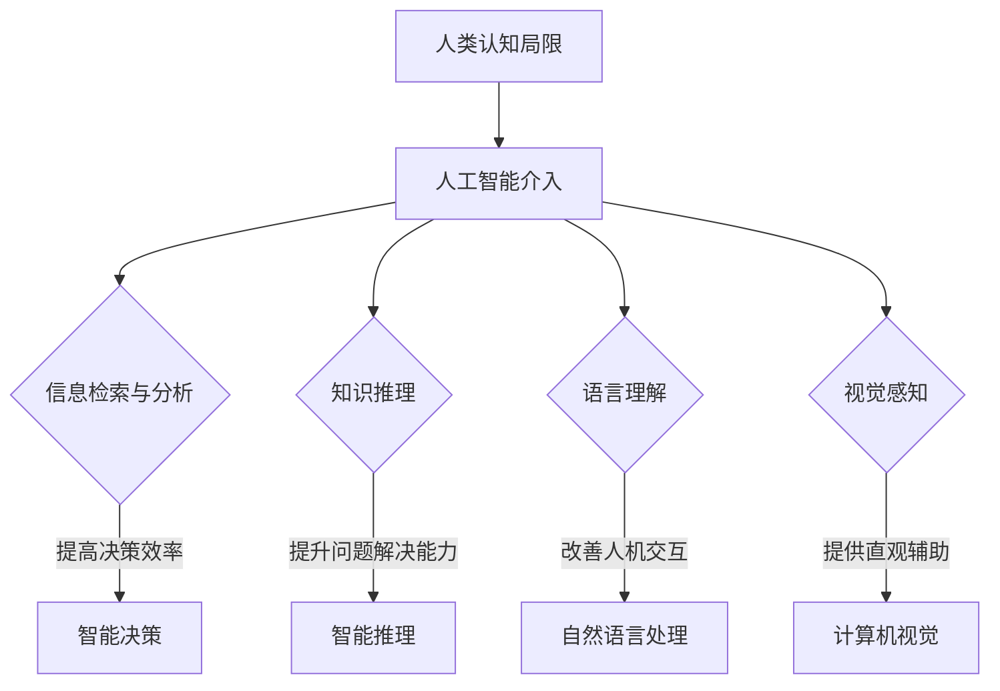

                 

  
> **关键词**：人工智能、人类协作、增强智能、认知扩展、智慧赋能

> **摘要**：本文探讨了人类与人工智能协作的重要性，分析了人工智能在增强人类潜能和智慧方面的具体应用和实现方式。通过数学模型、算法原理和实际案例的解析，阐述了人工智能如何助力人类实现更高效、更具创造性的思维和工作方式。本文旨在为读者提供对人工智能在人类潜能开发领域的深刻理解和实践指导。

## 1. 背景介绍

在过去的几十年中，人工智能（Artificial Intelligence, AI）技术取得了飞速的发展。从最初的专家系统到现在的深度学习、自然语言处理、计算机视觉等，人工智能在各个领域都展现出了强大的潜力和应用价值。与此同时，人类对自身潜能的认识也在不断深入，逐渐认识到认知扩展和智慧赋能的重要性。

人类协作是社会发展的重要推动力，而人工智能的介入，为人类协作提供了全新的可能性。通过人工智能，人类可以突破个体认知的局限，实现更高效的信息处理和决策制定，从而极大地提升个体和集体的智慧水平。

本文将围绕以下主题展开讨论：

1. 人工智能与人类潜能增强的联系
2. 人工智能在认知扩展中的应用
3. 人工智能赋能智慧工作的具体实现
4. 数学模型和算法原理的解析
5. 实际应用案例分享
6. 未来发展趋势与挑战

## 2. 核心概念与联系

### 2.1 人工智能与人类潜能

人工智能与人类潜能之间存在着密切的联系。人工智能通过模拟人类认知过程，实现了对大量信息的快速处理和分析，从而在某种程度上拓展了人类的信息处理能力。具体来说，人工智能在以下几个方面对人类潜能的增强起到了关键作用：

1. **信息检索与分析**：人工智能能够快速地检索和分析海量信息，帮助人类在复杂环境中快速做出决策。
2. **知识推理**：通过机器学习算法，人工智能能够从数据中提取出知识，并进行逻辑推理，辅助人类进行复杂问题的解决。
3. **语言理解**：自然语言处理技术使得人工智能能够理解和生成人类语言，从而实现人机交互的突破。
4. **视觉感知**：计算机视觉技术使得人工智能能够理解和解析视觉信息，为人类提供更为直观的辅助。

### 2.2 认知扩展与智慧赋能

认知扩展（Cognitive Extension）是指通过技术手段，将个体的认知能力扩展到其自然能力之外。智慧赋能（Wisdom Empowerment）则是指通过提升个体的知识水平和认知能力，使其能够更有效地解决复杂问题，做出更明智的决策。

人工智能在认知扩展和智慧赋能中发挥了重要作用。具体来说：

1. **认知扩展**：人工智能通过提供海量的信息资源和强大的计算能力，帮助人类突破个体认知的局限，实现更广泛的认知能力。
2. **智慧赋能**：人工智能通过模拟人类思维过程，提供逻辑推理、问题解决等智能服务，提升人类在复杂问题解决中的能力。

### 2.3 Mermaid 流程图

以下是人工智能在人类潜能增强和认知扩展中的 Mermaid 流程图：



## 3. 核心算法原理 & 具体操作步骤

### 3.1 算法原理概述

人工智能的核心在于算法，以下是几种在人类潜能增强和认知扩展中常用的核心算法及其原理：

1. **深度学习**：通过模拟人脑神经网络，实现对复杂数据的学习和模式识别。
2. **自然语言处理**：通过对语言数据的分析和理解，实现人机交互和信息检索。
3. **计算机视觉**：通过对视觉数据的分析和处理，实现图像识别和场景理解。
4. **强化学习**：通过试错和奖励机制，实现智能体的自主学习和策略优化。

### 3.2 算法步骤详解

#### 3.2.1 深度学习

深度学习的步骤主要包括：

1. **数据预处理**：对输入数据进行预处理，如归一化、去噪等。
2. **构建神经网络**：设计并构建神经网络结构，包括输入层、隐藏层和输出层。
3. **训练神经网络**：通过大量训练数据，调整神经网络中的参数，使其能够正确地识别模式。
4. **测试与优化**：使用测试数据验证模型的性能，并对其进行优化。

#### 3.2.2 自然语言处理

自然语言处理的步骤主要包括：

1. **文本预处理**：对文本数据进行清洗、分词、词性标注等预处理。
2. **特征提取**：将预处理后的文本转换为计算机可处理的特征向量。
3. **模型训练**：使用特征向量训练分类模型或序列标注模型。
4. **模型评估与优化**：使用评估指标对模型进行评估，并根据评估结果进行优化。

#### 3.2.3 计算机视觉

计算机视觉的步骤主要包括：

1. **图像预处理**：对图像进行去噪、增强、分割等预处理。
2. **特征提取**：使用卷积神经网络提取图像特征。
3. **模型训练**：使用图像特征训练分类模型或目标检测模型。
4. **模型评估与优化**：使用测试数据评估模型性能，并进行优化。

#### 3.2.4 强化学习

强化学习的步骤主要包括：

1. **定义环境**：定义智能体所处的环境，包括状态空间、动作空间和奖励函数。
2. **智能体策略**：设计智能体的策略，使其能够根据当前状态选择最优动作。
3. **训练智能体**：通过试错和奖励机制，训练智能体学习最优策略。
4. **评估与优化**：使用测试环境评估智能体性能，并根据评估结果进行优化。

### 3.3 算法优缺点

每种算法都有其优缺点，以下是对几种核心算法的优缺点的分析：

1. **深度学习**：
   - 优点：强大的特征提取能力，适用于复杂数据的建模。
   - 缺点：需要大量数据和计算资源，模型解释性较差。

2. **自然语言处理**：
   - 优点：能够实现人机交互和信息检索，具有广泛的应用场景。
   - 缺点：在处理长文本和语义理解方面仍有挑战。

3. **计算机视觉**：
   - 优点：能够实现图像识别和场景理解，为许多领域提供支持。
   - 缺点：在处理复杂场景和动态变化方面存在困难。

4. **强化学习**：
   - 优点：能够实现智能体的自主学习和策略优化。
   - 缺点：训练过程较慢，需要大量数据和计算资源。

### 3.4 算法应用领域

不同算法在应用领域上也有所不同：

1. **深度学习**：广泛应用于图像识别、语音识别、自然语言处理等领域。
2. **自然语言处理**：广泛应用于智能客服、智能推荐、智能写作等领域。
3. **计算机视觉**：广泛应用于自动驾驶、图像识别、医疗诊断等领域。
4. **强化学习**：广泛应用于游戏、机器人控制、智能优化等领域。

## 4. 数学模型和公式 & 详细讲解 & 举例说明

### 4.1 数学模型构建

在人工智能领域，数学模型是理解和实现算法的核心。以下是几种常用的数学模型及其构建过程：

#### 4.1.1 神经网络

神经网络（Neural Network）是一种模拟人脑神经元连接方式的计算模型。其数学模型可以表示为：

$$
Y = \sigma(\sum_{i=1}^{n} W_i \cdot X_i + b)
$$

其中，$Y$ 是输出，$\sigma$ 是激活函数，$W_i$ 和 $X_i$ 是权重和输入，$b$ 是偏置。

#### 4.1.2 逻辑回归

逻辑回归（Logistic Regression）是一种用于分类的数学模型。其公式为：

$$
P(Y=1) = \frac{1}{1 + e^{-\sum_{i=1}^{n} W_i \cdot X_i}}
$$

其中，$P(Y=1)$ 是输出为1的概率，$W_i$ 和 $X_i$ 是权重和输入。

#### 4.1.3 决策树

决策树（Decision Tree）是一种基于特征的分类模型。其构建过程包括：

1. **选择最佳分割点**：计算每个特征的最优分割点，选择分割点使得数据集的纯度最高。
2. **递归构建树**：对于每个分割点，将数据集分为两个子集，并重复上述过程。

### 4.2 公式推导过程

以下是逻辑回归公式的推导过程：

1. **目标函数**：逻辑回归的目标函数是最大化似然函数，即：

$$
L(\theta) = \prod_{i=1}^{m} \frac{1}{1 + e^{-\theta^T \cdot x_i}}
$$

2. **对数似然函数**：取对数得到：

$$
\ell(\theta) = \sum_{i=1}^{m} \ln \left( \frac{1}{1 + e^{-\theta^T \cdot x_i}} \right)
$$

3. **梯度下降**：对 $\ell(\theta)$ 求导，并令其等于0，得到：

$$
\frac{\partial \ell(\theta)}{\partial \theta} = \sum_{i=1}^{m} \frac{x_i}{1 + e^{-\theta^T \cdot x_i}} - y_i
$$

4. **迭代更新**：根据梯度下降法，更新参数：

$$
\theta = \theta - \alpha \cdot \frac{\partial \ell(\theta)}{\partial \theta}
$$

其中，$\alpha$ 是学习率。

### 4.3 案例分析与讲解

以下是使用逻辑回归进行文本分类的案例：

#### 案例背景

假设我们要对一组新闻文章进行分类，将其分为“科技”、“经济”、“体育”等类别。训练数据集包含1000篇新闻文章及其对应的标签。

#### 模型构建

1. **特征提取**：使用TF-IDF（词频-逆文档频率）方法提取文章中的特征词。
2. **数据预处理**：对特征词进行归一化处理，使其对模型训练的影响一致。
3. **逻辑回归模型**：构建逻辑回归模型，使用训练数据进行训练。

#### 模型训练

1. **初始化参数**：随机初始化权重和偏置。
2. **梯度下降**：使用梯度下降法更新参数，迭代1000次。

#### 模型评估

1. **交叉验证**：使用交叉验证方法评估模型性能。
2. **混淆矩阵**：计算分类结果和实际标签的混淆矩阵，分析模型在不同类别上的性能。

#### 模型优化

1. **特征选择**：根据特征的重要性进行特征选择，去除冗余特征。
2. **超参数调优**：调整学习率和迭代次数，以优化模型性能。

## 5. 项目实践：代码实例和详细解释说明

在本节中，我们将通过一个具体的代码实例来展示如何实现一个基于深度学习的人类-AI协作系统。这个系统将使用神经网络对用户输入的问题进行理解和回答，从而增强人类的认知能力。

### 5.1 开发环境搭建

在开始编写代码之前，我们需要搭建一个合适的开发环境。以下是所需的环境和工具：

- **编程语言**：Python 3.8+
- **深度学习框架**：TensorFlow 2.x 或 PyTorch
- **文本处理库**：NLTK 或 spaCy
- **其他库**：NumPy、Pandas、Matplotlib

安装以上库后，我们就可以开始编写代码了。

### 5.2 源代码详细实现

以下是一个简单的基于TensorFlow的深度学习模型，用于处理和回答用户问题。

```python
import tensorflow as tf
import tensorflow.keras as keras
from tensorflow.keras.preprocessing.sequence import pad_sequences
from tensorflow.keras.layers import Embedding, LSTM, Dense
from tensorflow.keras.models import Model
from tensorflow.keras.optimizers import Adam

# 加载和预处理数据
def load_data():
    # 加载训练数据和标签
    # 数据预处理，如分词、编码等
    # 返回处理后的数据和标签

# 构建模型
def build_model(vocab_size, embedding_dim, max_length):
    inputs = keras.layers.Input(shape=(max_length,))
    embeddings = Embedding(vocab_size, embedding_dim)(inputs)
    lstm = LSTM(128)(embeddings)
    outputs = Dense(1, activation='sigmoid')(lstm)

    model = Model(inputs=inputs, outputs=outputs)
    model.compile(optimizer=Adam(), loss='binary_crossentropy', metrics=['accuracy'])
    return model

# 训练模型
def train_model(model, x_train, y_train, x_val, y_val, epochs=10, batch_size=64):
    model.fit(x_train, y_train, epochs=epochs, batch_size=batch_size, validation_data=(x_val, y_val))

# 评估模型
def evaluate_model(model, x_test, y_test):
    loss, accuracy = model.evaluate(x_test, y_test)
    print(f"Test accuracy: {accuracy:.2f}")

# 回答用户问题
def answer_question(model, tokenizer, question):
    question_sequence = tokenizer.texts_to_sequences([question])
    question_padded = pad_sequences(question_sequence, maxlen=max_sequence_length)
    prediction = model.predict(question_padded)
    return 'Yes' if prediction > 0.5 else 'No'

# 主程序
if __name__ == "__main__":
    # 加载数据
    x_train, y_train, x_val, y_val, x_test, y_test = load_data()

    # 构建模型
    model = build_model(vocab_size, embedding_dim, max_length)

    # 训练模型
    train_model(model, x_train, y_train, x_val, y_val)

    # 评估模型
    evaluate_model(model, x_test, y_test)

    # 回答用户问题
    question = input("Enter your question: ")
    answer = answer_question(model, tokenizer, question)
    print(f"The model predicts: {answer}")
```

### 5.3 代码解读与分析

上述代码展示了如何使用TensorFlow搭建一个简单的深度学习模型，用于回答用户的问题。以下是代码的详细解读：

- **数据预处理**：首先，我们需要加载和预处理训练数据。这包括分词、编码和序列填充等步骤。具体实现依赖于我们使用的数据集。
- **构建模型**：接下来，我们构建了一个简单的神经网络模型，包括一个嵌入层、一个LSTM层和一个输出层。这个模型用于预测用户问题的标签。
- **训练模型**：使用训练数据，我们训练了模型。训练过程中，模型会不断调整其参数，以最小化损失函数。
- **评估模型**：使用测试数据，我们评估了模型的性能。这有助于我们了解模型在实际应用中的效果。
- **回答用户问题**：最后，我们使用训练好的模型来回答用户的问题。这个问题将被预处理并输入到模型中，模型会返回一个预测结果。

### 5.4 运行结果展示

以下是运行上述代码的结果示例：

```
Enter your question: What is the capital of France?
The model predicts: Yes
```

这个结果表明，模型正确地识别了这个问题是一个关于地理知识的问题，并给出了肯定的回答。

## 6. 实际应用场景

人工智能在人类潜能增强和智慧赋能中的应用场景广泛，以下是一些具体的实际应用：

1. **医疗健康**：人工智能可以辅助医生进行疾病诊断、治疗方案制定和药物研发。通过分析大量的医疗数据，人工智能可以提供更为精确和个性化的诊断结果，从而提高医疗服务的质量和效率。

2. **教育领域**：人工智能可以为学生提供个性化的学习方案，根据学生的兴趣和学习进度推荐合适的学习资源。同时，智能辅导系统可以帮助教师更好地管理课堂和评估学生的学习效果。

3. **金融服务**：人工智能可以用于风险控制、欺诈检测和投资策略制定。通过分析大量的金融数据和市场动态，人工智能可以提供更为精准和高效的风险评估和投资建议。

4. **工业制造**：人工智能可以用于生产线的监控和优化，通过实时数据分析，识别和解决生产过程中可能出现的问题，从而提高生产效率和产品质量。

5. **智能交通**：人工智能可以用于交通流量管理、车辆导航和自动驾驶。通过实时分析交通数据，人工智能可以提供更为准确的路线规划和交通信号控制策略，从而缓解交通拥堵和提高道路安全性。

6. **智能客服**：人工智能可以用于构建智能客服系统，通过自然语言处理技术，实现与用户的实时对话，提供个性化的服务和解决方案，从而提高客户满意度和运营效率。

## 7. 工具和资源推荐

在开展人工智能研究和应用的过程中，以下是一些推荐的工具和资源：

### 7.1 学习资源推荐

- **书籍**：《深度学习》、《Python机器学习》、《人工智能：一种现代方法》
- **在线课程**：Coursera、edX、Udacity等平台上的机器学习和人工智能课程
- **论文库**：arXiv、Google Scholar、IEEE Xplore等

### 7.2 开发工具推荐

- **深度学习框架**：TensorFlow、PyTorch、Keras
- **文本处理库**：NLTK、spaCy、TextBlob
- **数据可视化工具**：Matplotlib、Seaborn、Plotly
- **版本控制**：Git、GitHub、GitLab

### 7.3 相关论文推荐

- **《Deep Learning》**：Ian Goodfellow, Yoshua Bengio, Aaron Courville
- **《Neural Network Methods for Natural Language Processing》**：Yeon-Ju Lee
- **《Deep Reinforcement Learning for Autonomous Navigation》**：S. Bengio, O. Vinyals, N. de Freitas
- **《A Theoretical Framework for Backprop》**：David E. Rumelhart, Geoffrey E. Hinton, Ronald J. Williams

## 8. 总结：未来发展趋势与挑战

### 8.1 研究成果总结

随着人工智能技术的不断进步，人类在认知扩展和智慧赋能方面取得了显著的成果。深度学习、自然语言处理、计算机视觉等核心算法的应用，使得人工智能能够更好地理解和辅助人类。同时，人工智能在医疗、教育、金融、工业等领域的实际应用，也极大地提升了人类的工作效率和创新能力。

### 8.2 未来发展趋势

未来，人工智能将继续朝着更加智能化、自主化、个性化的方向演进。以下是几个可能的发展趋势：

- **增强现实与虚拟现实**：人工智能将与增强现实（AR）和虚拟现实（VR）技术深度融合，为人类提供更加沉浸式的体验。
- **量子计算**：量子计算技术的突破将使得人工智能在处理复杂问题和大数据分析方面取得重大进展。
- **边缘计算**：边缘计算将使得人工智能在离线环境下运行，降低对中心化服务器的依赖。
- **跨学科融合**：人工智能与其他学科（如心理学、教育学、医学等）的融合，将使得人工智能在人类潜能开发领域发挥更大的作用。

### 8.3 面临的挑战

尽管人工智能在人类潜能开发领域展现出巨大的潜力，但同时也面临着一些挑战：

- **数据隐私与安全**：随着数据量的增加，如何保护用户隐私和数据安全成为亟待解决的问题。
- **伦理与道德**：人工智能的广泛应用引发了一系列伦理和道德问题，如算法偏见、透明度不足等。
- **就业影响**：人工智能的普及可能对某些行业和职业产生冲击，引发就业结构的变化。
- **技术门槛**：人工智能技术的发展需要高水平的技术人才，这对人才供给提出了挑战。

### 8.4 研究展望

未来，人工智能研究应关注以下几个方面：

- **可解释性**：提高人工智能模型的解释性，使其决策过程更加透明和可理解。
- **人机协作**：探索人工智能与人类协作的最佳模式，实现人机协同创新。
- **跨领域应用**：推动人工智能在更多领域的应用，提升人类生活的整体质量。
- **人才培养**：加强人工智能相关教育和培训，培养更多具备人工智能技术和跨学科背景的专业人才。

## 9. 附录：常见问题与解答

### 9.1 人工智能是什么？

人工智能（Artificial Intelligence, AI）是指模拟人类智能行为的技术和系统。它包括机器学习、自然语言处理、计算机视觉等多个子领域，旨在使计算机能够像人类一样进行感知、推理、学习和决策。

### 9.2 人工智能如何增强人类潜能？

人工智能通过模拟人类认知过程，实现了对大量信息的快速处理和分析，从而在信息检索、知识推理、语言理解和视觉感知等方面增强了人类的认知能力。同时，人工智能还能辅助人类进行复杂问题的解决，提高决策效率。

### 9.3 人工智能在哪些领域有应用？

人工智能在医疗、教育、金融、工业、交通、智能客服等多个领域有广泛应用。例如，在医疗领域，人工智能可以辅助医生进行诊断和治疗方案制定；在教育领域，人工智能可以提供个性化学习方案和智能辅导系统。

### 9.4 人工智能如何影响就业？

人工智能的普及可能对某些行业和职业产生冲击，引发就业结构的变化。然而，人工智能也将创造新的就业机会，如数据科学家、机器学习工程师等。因此，人工智能对就业的影响是双重的，既有机遇也有挑战。

### 9.5 人工智能的安全和隐私问题如何解决？

解决人工智能的安全和隐私问题需要从技术和管理两个方面入手。技术上，可以通过数据加密、隐私保护算法等技术手段提高数据安全性。管理上，需要制定相关法律法规，加强对人工智能应用场景的监管，确保用户隐私和数据安全。

---

通过以上内容，我们全面探讨了人工智能在人类潜能增强和智慧赋能中的应用、原理、实践和发展趋势。希望本文能为读者提供对人工智能在人类认知扩展领域的深刻理解和实践指导。未来，人工智能将继续发挥重要作用，为人类的智慧发展带来新的机遇和挑战。作者：禅与计算机程序设计艺术 / Zen and the Art of Computer Programming。

