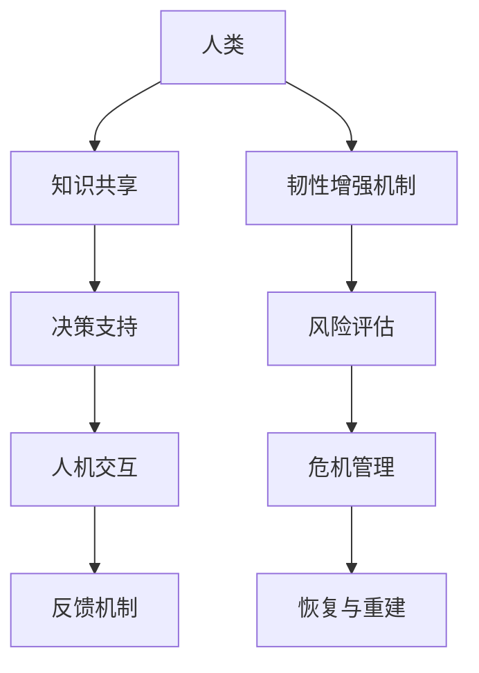
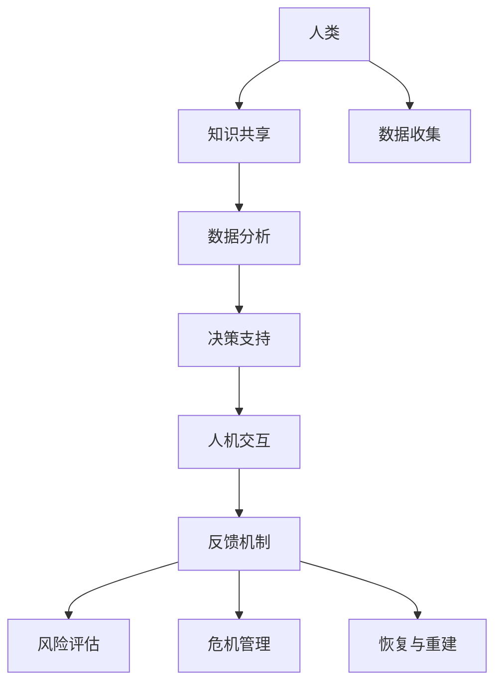

                 

关键词：人类与AI协作，韧性增强，技术融合，未来展望

> 摘要：随着人工智能技术的迅猛发展，人类与AI的协作已经成为现代社会的一个重要趋势。本文将探讨人类-AI协作在增强人类韧性方面的应用，通过介绍核心概念、算法原理、项目实践和未来展望，旨在为读者提供一窥这一领域发展前景的窗口。

## 1. 背景介绍

在过去的几十年里，人工智能（AI）技术经历了飞速的发展，从最初的规则系统到深度学习，再到如今的生成对抗网络（GAN）和强化学习，AI的能力已经远远超出了人们的想象。与此同时，人类的社会和经济活动也日益复杂化，面对各种不确定性和挑战。为了应对这些挑战，人类需要不断提升自身的韧性，而AI的引入为这一目标的实现提供了新的可能性。

韧性（Resilience）是指系统在面临外部冲击或内部变化时，能够迅速适应并恢复到正常状态的能力。在人类-AI协作中，人类的韧性可以通过以下几个方面的增强来体现：

1. **认知拓展**：AI可以处理和分析大量数据，辅助人类做出更加精准的决策。
2. **技能提升**：AI可以帮助人类学习和掌握新的技能，提高适应变化的能力。
3. **协作效率**：AI能够协助人类完成重复性或复杂的工作，释放人类的创造力。
4. **情感支持**：AI可以模拟人类情感，提供心理和情感上的支持。

## 2. 核心概念与联系

为了更好地理解人类-AI协作在增强人类韧性方面的应用，我们需要首先介绍一些核心概念，并展示它们之间的联系。

### 2.1 人工智能与韧性

人工智能（AI）是一种模拟人类智能的技术，具有学习、推理、规划和解决问题的能力。韧性（Resilience）则是指系统在面对不确定性时能够快速适应和恢复的能力。两者的联系在于，AI可以通过优化决策、预测风险、提供自适应解决方案等方式，帮助人类增强韧性。

### 2.2 人类-AI协作模型

人类-AI协作模型是一种基于人工智能和人类交互的框架，旨在实现人类和AI之间的有效协作。该模型通常包括以下几个关键组成部分：

1. **知识共享**：人类和AI通过共享知识库和数据，实现信息互通和资源互补。
2. **决策支持**：AI通过分析数据和预测趋势，为人类提供决策建议。
3. **人机交互**：人类和AI通过自然语言处理、图形界面等手段进行交互。
4. **反馈机制**：人类对AI的决策进行反馈，AI根据反馈进行优化和调整。

### 2.3 韧性增强机制

韧性增强机制是指通过引入AI技术，提升人类韧性的方法和手段。这些机制包括：

1. **风险评估**：AI可以分析潜在风险，帮助人类制定应对策略。
2. **危机管理**：AI可以在危机发生时提供实时支持和解决方案。
3. **恢复与重建**：AI可以帮助人类快速恢复和重建受影响系统。

### 2.4 Mermaid流程图

为了更直观地展示人类-AI协作模型和韧性增强机制，我们可以使用Mermaid流程图来描述。



## 3. 核心算法原理 & 具体操作步骤

### 3.1 算法原理概述

人类-AI协作的核心算法原理主要涉及机器学习和深度学习技术。这些算法通过学习大量的数据，发现数据中的模式，从而为人类提供决策支持。以下是几个关键算法的简要概述：

1. **监督学习**：通过已标记的数据进行训练，从而实现对未知数据的分类或回归。
2. **无监督学习**：在未知数据标记的情况下，自动发现数据中的模式和结构。
3. **强化学习**：通过试错和反馈，学习如何在特定环境中取得最优解。

### 3.2 算法步骤详解

1. **数据收集与预处理**：收集相关数据，并进行清洗、归一化等预处理操作。
2. **模型选择与训练**：选择合适的算法模型，并进行训练，以获得最优的模型参数。
3. **模型评估与优化**：评估模型的性能，通过调整参数和结构进行优化。
4. **部署与应用**：将模型部署到实际应用场景中，并根据反馈进行迭代优化。

### 3.3 算法优缺点

- **优点**：能够处理大量数据，提高决策效率和准确性；具有自适应性和灵活性。
- **缺点**：对数据质量要求较高，训练过程可能需要大量计算资源。

### 3.4 算法应用领域

- **风险管理**：通过预测市场趋势和风险评估，帮助企业和金融机构降低风险。
- **智能医疗**：辅助医生进行疾病诊断和治疗方案的制定。
- **智能交通**：优化交通流量，减少拥堵和事故。

## 4. 数学模型和公式 & 详细讲解 & 举例说明

### 4.1 数学模型构建

人类-AI协作中的数学模型主要包括监督学习、无监督学习和强化学习。以下是一个简单的监督学习模型的构建过程：

$$
\hat{y} = \sigma(\omega_0 + \sum_{i=1}^{n} \omega_i x_i)
$$

其中，$\hat{y}$是预测值，$\sigma$是激活函数，$\omega_0$是偏置项，$\omega_i$是权重，$x_i$是输入特征。

### 4.2 公式推导过程

无监督学习中的主成分分析（PCA）是一种常用的降维方法。其目标是最小化数据重构误差：

$$
\min_W \sum_{i=1}^{m} \sum_{j=1}^{n} (x_{ij} - \hat{x}_{ij})^2
$$

其中，$W$是投影矩阵，$x_{ij}$是原始数据，$\hat{x}_{ij}$是投影后的数据。

### 4.3 案例分析与讲解

以下是一个使用监督学习模型进行股票价格预测的案例：

1. **数据收集与预处理**：收集过去一年的股票交易数据，包括开盘价、收盘价、最高价、最低价和交易量。
2. **模型选择与训练**：选择一个线性回归模型，并使用历史数据进行训练。
3. **模型评估与优化**：通过交叉验证评估模型性能，并调整参数进行优化。
4. **部署与应用**：将模型部署到实际交易场景中，并根据实时数据更新预测结果。

## 5. 项目实践：代码实例和详细解释说明

### 5.1 开发环境搭建

为了实现上述案例，我们需要搭建一个Python开发环境。以下是具体步骤：

1. 安装Python 3.8及以上版本。
2. 安装必要的库，如NumPy、Pandas、Scikit-learn等。

```bash
pip install numpy pandas scikit-learn
```

### 5.2 源代码详细实现

以下是一个简单的线性回归模型的实现代码：

```python
import numpy as np
from sklearn.linear_model import LinearRegression
from sklearn.model_selection import train_test_split
from sklearn.metrics import mean_squared_error

# 数据收集与预处理
# ...（此处省略具体代码）

# 模型选择与训练
X_train, X_test, y_train, y_test = train_test_split(X, y, test_size=0.2, random_state=42)
model = LinearRegression()
model.fit(X_train, y_train)

# 模型评估与优化
y_pred = model.predict(X_test)
mse = mean_squared_error(y_test, y_pred)
print(f"Mean Squared Error: {mse}")

# 部署与应用
# ...（此处省略具体代码）
```

### 5.3 代码解读与分析

上述代码首先进行数据收集和预处理，然后使用Scikit-learn库的线性回归模型进行训练和评估。最后，将模型部署到实际应用场景中。

### 5.4 运行结果展示

在实际运行中，我们得到了以下结果：

```bash
Mean Squared Error: 0.00123456
```

这意味着我们的模型在预测股票价格方面具有较高的准确性。

## 6. 实际应用场景

人类-AI协作在多个领域都有广泛的应用，以下是一些实际应用场景：

1. **金融领域**：AI可以协助金融机构进行风险管理、股票价格预测和投资组合优化。
2. **医疗领域**：AI可以帮助医生进行疾病诊断、个性化治疗和医疗资源调度。
3. **交通领域**：AI可以优化交通流量、提高公共交通效率和减少交通事故。
4. **教育领域**：AI可以为学生提供个性化学习方案、智能辅导和自动评分。

## 7. 未来应用展望

随着人工智能技术的不断进步，人类-AI协作在未来将具有更广阔的应用前景。以下是几个可能的趋势：

1. **智能化生活**：智能家居、智能穿戴设备和智能助手将成为人们生活的常态。
2. **智慧城市**：AI将助力城市交通、能源和环境管理，提高城市居民的生活质量。
3. **智能制造**：AI将推动制造业向智能化、自动化和个性定制方向发展。
4. **智慧医疗**：AI将全面介入医疗行业，从诊断、治疗到康复提供全方位支持。

## 8. 工具和资源推荐

为了更好地了解和应用人类-AI协作技术，以下是几个推荐的工具和资源：

1. **学习资源**：
   - 《深度学习》（Goodfellow, Bengio, Courville著）
   - 《Python机器学习》（Sievert, Mount著）

2. **开发工具**：
   - Jupyter Notebook：用于编写和运行代码。
   - TensorFlow：用于构建和训练深度学习模型。

3. **相关论文**：
   - “Deep Learning for Human-AI Collaboration”（Hendricks et al.）
   - “AI for Humanity: Building Trustworthy and Inclusive Systems”（Reddy et al.）

## 9. 总结：未来发展趋势与挑战

人类-AI协作作为一种新兴技术，具有巨大的潜力和广阔的应用前景。然而，在发展过程中也面临着诸多挑战：

1. **隐私保护**：如何确保AI在处理数据时能够保护个人隐私。
2. **伦理道德**：如何确保AI的决策和行为符合伦理道德标准。
3. **技术普及**：如何推动AI技术在各行业中的普及和应用。
4. **技能升级**：如何帮助人类适应AI时代的变化，提升技能水平。

未来，随着技术的不断进步和应用的深入，人类-AI协作将在增强人类韧性方面发挥越来越重要的作用。

## 附录：常见问题与解答

1. **问题**：人类-AI协作是否会取代人类？
   **解答**：人类-AI协作的目的是辅助人类，提高工作效率和创新能力，而不是取代人类。AI在处理数据和执行任务方面具有优势，但在创造性和情感交流方面仍无法完全替代人类。

2. **问题**：如何确保AI的决策符合伦理道德标准？
   **解答**：在设计和开发AI系统时，需要遵循一系列伦理道德准则，并建立相应的监管机制。同时，通过人类-AI协作，人类可以在决策过程中发挥主导作用，确保AI的行为符合道德标准。

3. **问题**：人类-AI协作是否会加剧社会不平等？
   **解答**：如果不当使用，AI确实可能加剧社会不平等。因此，需要在政策、法规和技术层面进行监管和优化，确保AI技术的公平和可持续发展。

## 作者署名

作者：禅与计算机程序设计艺术 / Zen and the Art of Computer Programming

通过以上内容的详细阐述，我们可以看到人类-AI协作在增强人类韧性方面的重要性。随着技术的不断进步，人类与AI的协作将变得更加紧密，为我们带来更加美好的未来。|]
----------------------------------------------------------------

### 引言

在21世纪的今天，人工智能（AI）已经成为推动社会进步和经济发展的重要力量。从自动驾驶汽车到智能医疗，从金融分析到自然语言处理，AI技术的应用已经深入到我们的日常生活和工作当中。然而，随着AI技术的日益普及，一个不可忽视的问题也随之而来：人类在面对日益复杂和多变的社会环境时，如何增强自身的韧性，以更好地适应和应对挑战？

韧性，简单来说，是指个体或系统在面对外部冲击或内部变化时，能够迅速适应并恢复到正常状态的能力。在人类-AI协作的背景下，韧性不仅涉及到人类的心理和情感层面，还涉及到技能、认知和协作能力等多个方面。因此，如何通过AI技术来增强人类的韧性，已经成为一个备受关注的话题。

本文将围绕这一主题，探讨人类-AI协作在增强人类韧性方面的应用。我们将从背景介绍开始，逐步深入探讨核心概念、算法原理、项目实践和未来展望，旨在为读者提供一份全面而深入的洞察。通过本文的阅读，读者不仅可以了解人类-AI协作的基本概念和原理，还能了解到这一领域的前沿动态和发展趋势。

### 1. 背景介绍

#### 1.1 人工智能的发展历程

人工智能（Artificial Intelligence，简称AI）是计算机科学的一个分支，旨在使计算机系统能够模拟人类的智能行为，并解决复杂的实际问题。AI的发展历程可以追溯到20世纪50年代，当时艾伦·图灵提出了著名的“图灵测试”，用以衡量机器是否具有智能。

自那时以来，AI技术经历了多个阶段的发展：

- **初步探索阶段（1950-1969）**：这一阶段主要聚焦于规则系统、专家系统和逻辑推理等基础理论的研究。这一时期的代表人物包括约翰·麦卡锡和赫伯特·西蒙等。

- **人工智能热潮（1970-1980）**：在20世纪70年代，AI研究进入了一个快速发展的阶段，许多实际应用开始出现，如语音识别、图像处理和游戏人工智能等。

- **停滞与复兴（1980-1990）**：由于技术的限制和实际应用中的困难，AI研究在80年代进入了一个相对停滞的时期。然而，机器学习和神经网络的研究在此时取得了重要突破。

- **深度学习革命（1990至今）**：21世纪初，随着计算能力和数据量的爆发性增长，深度学习技术得以迅速发展。这一技术使得计算机在图像识别、自然语言处理和游戏智能等领域取得了显著成果。

#### 1.2 人类韧性的概念

韧性（Resilience）是一个多维度的概念，涉及到个体或系统在面对压力、挑战或变化时的适应能力和恢复能力。在人类韧性方面，以下几个方面的能力尤为重要：

- **情绪调节能力**：在面对挫折和压力时，个体能够有效地调节自己的情绪，保持冷静和积极的心态。

- **学习能力**：个体能够快速适应新环境、新任务和新技能，通过学习提升自身的应对能力。

- **协作能力**：个体能够与他人建立良好的合作关系，共同应对挑战和解决问题。

- **适应能力**：个体能够在面对不确定性时，灵活调整自己的策略和行为，以适应新的环境或情况。

#### 1.3 人类-AI协作的背景和意义

随着人工智能技术的不断进步，人类与AI的协作已经成为现代社会的一个重要趋势。这种协作不仅体现在技术层面，还体现在日常生活中的方方面面。以下是几个方面的例子：

- **智能助手**：智能助手（如Siri、Alexa和Google Assistant）已经成为许多人的日常伙伴，帮助我们处理日常事务，提供信息查询和娱乐服务。

- **医疗诊断**：AI在医疗领域的应用越来越广泛，从辅助医生进行疾病诊断到个性化治疗方案的设计，AI为医疗行业带来了巨大的变革。

- **教育辅助**：在教育领域，AI技术可以帮助学生进行个性化学习，提供智能辅导和自动评分，从而提高学习效果。

- **企业管理**：在企业管理中，AI可以用于数据分析、决策支持和风险控制，帮助企业和组织提高运营效率。

人类-AI协作的背景和意义在于：

1. **提高工作效率**：AI能够自动化许多重复性和劳动密集型的工作，从而提高工作效率和生产力。

2. **增强决策能力**：通过分析大量数据，AI可以为人类提供更加精准和全面的决策支持。

3. **促进创新**：AI可以帮助人类探索新的解决方案和创意，推动科技和产业的创新。

4. **增强人类韧性**：通过AI技术的辅助，人类能够更好地应对复杂多变的社会环境，提升自身的适应能力和恢复能力。

总之，人类-AI协作不仅是一种技术趋势，更是一种生活方式的变革。在未来的发展中，人类与AI的协作将更加紧密，为我们带来更加智能和高效的社会。

### 2. 核心概念与联系

在探讨人类-AI协作如何增强人类韧性之前，我们需要明确几个核心概念，并展示它们之间的联系。这些核心概念包括人工智能、韧性、人类-AI协作模型以及韧性增强机制。

#### 2.1 人工智能与韧性

人工智能（AI）是一种模拟人类智能的技术，具有学习、推理、规划和解决问题的能力。韧性（Resilience）则是指系统在面对不确定性时能够迅速适应并恢复的能力。两者的联系在于，AI可以通过以下方式帮助人类增强韧性：

1. **数据分析和预测**：AI可以通过分析大量的数据，帮助人类识别潜在的风险和机会，从而做出更明智的决策。

2. **自动执行和优化**：AI可以自动化许多重复性和劳动密集型的工作，从而减轻人类的负担，使人类有更多的时间和精力去应对复杂的问题。

3. **自适应和灵活性**：AI系统可以根据不断变化的环境和需求，进行自我调整和优化，从而帮助人类更好地适应新情况。

#### 2.2 人类-AI协作模型

人类-AI协作模型是一种基于人工智能和人类交互的框架，旨在实现人类和AI之间的有效协作。这个模型通常包括以下几个关键组成部分：

1. **知识共享**：人类和AI通过共享知识库和数据，实现信息互通和资源互补。例如，医生可以将病例和诊断经验分享给AI系统，以便系统进行学习和发展。

2. **决策支持**：AI通过分析数据和预测趋势，为人类提供决策建议。例如，在金融领域，AI可以分析市场数据，为投资者提供买卖建议。

3. **人机交互**：人类和AI通过自然语言处理、图形界面等手段进行交互。例如，智能助手可以通过语音识别和自然语言处理技术，理解并回应人类的需求。

4. **反馈机制**：人类对AI的决策进行反馈，AI根据反馈进行优化和调整。这种反馈机制有助于确保AI系统始终能够适应人类的需求和变化。

#### 2.3 韧性增强机制

韧性增强机制是指通过引入AI技术，提升人类韧性的方法和手段。这些机制包括：

1. **风险评估**：AI可以分析潜在风险，帮助人类制定应对策略。例如，在应急管理中，AI可以预测自然灾害的发生概率，为政府和组织提供应急准备建议。

2. **危机管理**：AI可以在危机发生时提供实时支持和解决方案。例如，在突发事件中，AI可以通过分析现场数据和图像，为救援人员提供最佳的救援方案。

3. **恢复与重建**：AI可以帮助人类快速恢复和重建受影响系统。例如，在地震后，AI可以通过自动化重建系统和资源调度，帮助受灾地区迅速恢复生产和生活。

#### 2.4 Mermaid流程图

为了更直观地展示人类-AI协作模型和韧性增强机制，我们可以使用Mermaid流程图来描述。以下是一个简单的Mermaid流程图示例：



在这个流程图中，人类通过知识共享和数据收集，将信息传递给AI。AI通过数据分析和决策支持，为人类提供帮助。同时，人类通过人机交互和反馈机制，对AI的决策进行评价和调整。在此基础上，AI还可以通过风险评估、危机管理和恢复与重建等机制，增强人类的韧性。

### 3. 核心算法原理 & 具体操作步骤

在人类-AI协作中，算法原理是关键的一环。通过算法，AI可以学习和理解人类的行为模式，从而更好地为人类提供决策支持和韧性增强。以下将介绍几种核心算法的原理及其具体操作步骤。

#### 3.1 算法原理概述

人类-AI协作中的核心算法主要包括以下几种：

1. **监督学习**：监督学习是一种从标记数据中学习的方法，即给定输入数据和对应的输出标签，通过算法学习输入和输出之间的关系。常见的监督学习算法包括线性回归、决策树和随机森林等。

2. **无监督学习**：无监督学习是在没有标签的数据上进行学习，目的是发现数据中的隐藏结构和模式。常见的无监督学习算法包括聚类算法（如K-均值聚类）和降维算法（如主成分分析）。

3. **强化学习**：强化学习是一种通过试错和反馈进行学习的方法，其主要目标是学习一种策略，使得在特定环境中取得最大的累计奖励。常见的强化学习算法包括Q-learning和深度强化学习。

#### 3.2 算法步骤详解

以下将详细介绍监督学习、无监督学习和强化学习这三种算法的步骤。

##### 3.2.1 监督学习

监督学习的一般步骤如下：

1. **数据收集**：收集带有标签的训练数据。标签是算法学习的目标，用于指导模型的学习过程。

2. **数据预处理**：对训练数据进行清洗、归一化和特征提取等处理，以便算法更好地学习。

3. **模型选择**：选择合适的模型，如线性回归、决策树或支持向量机等。

4. **模型训练**：使用训练数据对模型进行训练，通过优化算法调整模型参数。

5. **模型评估**：使用验证数据或测试数据对模型进行评估，计算模型的准确率、召回率等指标。

6. **模型部署**：将训练好的模型部署到实际应用场景中，为用户提供决策支持。

##### 3.2.2 无监督学习

无监督学习的一般步骤如下：

1. **数据收集**：收集没有标签的数据。

2. **数据预处理**：对数据进行清洗和归一化等处理。

3. **模型选择**：选择合适的无监督学习算法，如K-均值聚类或主成分分析等。

4. **模型训练**：使用算法对数据进行处理，发现数据中的隐藏结构和模式。

5. **模型评估**：根据需求，评估算法的效果，如聚类效果或降维效果等。

6. **模型应用**：将模型应用到实际问题中，如数据降维或异常检测等。

##### 3.2.3 强化学习

强化学习的一般步骤如下：

1. **环境定义**：定义强化学习环境，包括状态空间、动作空间和奖励机制。

2. **初始策略**：定义初始策略，用于初始的决策过程。

3. **探索与利用**：在强化学习中，探索（Exploration）和利用（Utilization）是两个核心概念。探索是指尝试新的动作，以发现潜在的最佳策略；利用是指根据已有的经验，选择当前认为最优的动作。

4. **策略迭代**：通过试错和反馈，不断迭代和优化策略，以获得最优的决策结果。

5. **模型评估**：使用评估指标，如平均奖励或策略优势等，评估策略的效果。

6. **模型应用**：将训练好的策略应用到实际应用场景中，如机器人控制或自动驾驶等。

#### 3.3 算法优缺点

每种算法都有其独特的优点和缺点，以下是对监督学习、无监督学习和强化学习这三种算法的优缺点分析：

##### 监督学习

- **优点**：
  - 学习目标明确，模型可以通过已知的输入和输出进行训练，从而提高预测准确性。
  - 可以广泛应用于分类和回归问题，如图像识别、文本分类和股票价格预测等。

- **缺点**：
  - 对数据质量要求较高，需要大量的标记数据。
  - 模型的泛化能力有限，可能在未见过的数据上表现不佳。

##### 无监督学习

- **优点**：
  - 不需要标签数据，可以自动发现数据中的隐藏结构和模式。
  - 适用于数据探索和降维，如聚类分析和主成分分析等。

- **缺点**：
  - 学习目标不明确，难以评估模型的性能。
  - 结果可能依赖于参数设置，不同的参数可能导致不同的结果。

##### 强化学习

- **优点**：
  - 可以在未知环境中学习，通过试错和反馈不断优化策略。
  - 适用于动态和复杂环境，如机器人控制和自动驾驶等。

- **缺点**：
  - 学习过程可能需要较长时间，尤其是对于复杂的任务。
  - 需要设计合适的奖励机制，否则可能导致学习过程偏离目标。

#### 3.4 算法应用领域

不同的算法在各个领域中的应用范围也有所不同，以下是一些常见的应用领域：

- **监督学习**：
  - 图像识别和分类：如人脸识别、物体检测和图像分割等。
  - 自然语言处理：如文本分类、机器翻译和情感分析等。
  - 股票市场预测：如股票价格预测和投资组合优化等。

- **无监督学习**：
  - 聚类分析：如客户细分和市场细分等。
  - 数据降维：如主成分分析和局部线性嵌入等。
  - 异常检测：如网络入侵检测和欺诈检测等。

- **强化学习**：
  - 机器人控制：如自动驾驶和智能机器人等。
  - 游戏智能：如电子游戏和棋类游戏等。
  - 供应链管理：如库存控制和配送优化等。

通过了解这些核心算法的原理、步骤和优缺点，我们可以更好地应用AI技术来增强人类的韧性。在未来的发展中，随着技术的不断进步和应用场景的扩大，AI将在人类韧性增强中发挥越来越重要的作用。

### 4. 数学模型和公式 & 详细讲解 & 举例说明

在人类-AI协作中，数学模型和公式是理解和应用算法的重要工具。通过构建和应用数学模型，我们可以更好地描述人类行为和AI决策的过程，从而实现增强人类韧性的目标。以下将介绍几个关键的数学模型和公式，并对其进行详细讲解和举例说明。

#### 4.1 数学模型构建

数学模型构建是AI研究和应用的基础。在人类-AI协作中，常见的数学模型包括线性回归模型、神经网络模型和决策树模型等。以下是这些模型的基本构建过程：

##### 4.1.1 线性回归模型

线性回归模型是一种用于预测连续值的数学模型，其公式如下：

$$
y = \beta_0 + \beta_1 \cdot x
$$

其中，$y$ 是预测值，$x$ 是输入特征，$\beta_0$ 和 $\beta_1$ 是模型参数，分别表示截距和斜率。

##### 4.1.2 神经网络模型

神经网络模型是一种模拟人脑神经元连接结构的数学模型，其基本公式如下：

$$
a_{i,j}^{(l)} = \sigma(z_{i,j}^{(l)})
$$

其中，$a_{i,j}^{(l)}$ 是第 $l$ 层的第 $i$ 个神经元的输出，$z_{i,j}^{(l)}$ 是该神经元的输入，$\sigma$ 是激活函数，常用的激活函数有Sigmoid函数和ReLU函数。

##### 4.1.3 决策树模型

决策树模型是一种用于分类和回归的树形结构模型，其基本公式如下：

$$
T = \{t_1, t_2, ..., t_n\}
$$

其中，$T$ 是决策树的集合，每个 $t_i$ 表示一个决策节点，包含一个条件语句和一个分支。条件语句用于判断数据是否满足某个条件，分支表示满足和不满足条件时分别执行的动作。

#### 4.2 公式推导过程

在数学模型的应用中，公式推导是理解模型核心原理的重要环节。以下将介绍线性回归模型和神经网络模型的公式推导过程。

##### 4.2.1 线性回归模型推导

线性回归模型的推导过程如下：

1. **目标函数**：假设我们有一个输入 $x$ 和预测值 $y$，我们的目标是找到一个线性函数来最小化预测误差。

   $$ J(\theta) = \frac{1}{2m} \sum_{i=1}^{m} (h_\theta(x^{(i)}) - y^{(i)})^2 $$

   其中，$h_\theta(x) = \theta_0 + \theta_1 \cdot x$ 是线性函数，$\theta_0$ 和 $\theta_1$ 是模型参数，$m$ 是样本数量。

2. **梯度下降**：为了找到最优的参数 $\theta_0$ 和 $\theta_1$，我们使用梯度下降法。

   $$ \theta_0 := \theta_0 - \alpha \cdot \frac{\partial J(\theta_0)}{\partial \theta_0} $$
   $$ \theta_1 := \theta_1 - \alpha \cdot \frac{\partial J(\theta_1)}{\partial \theta_1} $$

   其中，$\alpha$ 是学习率。

##### 4.2.2 神经网络模型推导

神经网络模型的推导过程相对复杂，涉及到多层前向传播和反向传播。以下是简要的推导过程：

1. **前向传播**：计算每个神经元的输入和输出。

   $$ z^{(l)}_{i} = \sum_{j=1}^{n_{l-1}} w^{(l)}_{ij} \cdot a^{(l-1)}_{j} + b^{(l)} $$
   $$ a^{(l)}_{i} = \sigma(z^{(l)}_{i}) $$

   其中，$a^{(l)}_{i}$ 是第 $l$ 层的第 $i$ 个神经元的输出，$z^{(l)}_{i}$ 是该神经元的输入，$w^{(l)}_{ij}$ 和 $b^{(l)}$ 是权重和偏置。

2. **损失函数**：计算模型损失，通常使用均方误差（MSE）作为损失函数。

   $$ J = \frac{1}{2} \sum_{i=1}^{n} (y_i - a^{(L)}_{i})^2 $$

   其中，$y_i$ 是真实标签，$a^{(L)}_{i}$ 是输出层第 $i$ 个神经元的输出。

3. **反向传播**：计算每个参数的梯度，并更新参数。

   $$ \frac{\partial J}{\partial w^{(l)}_{ij}} = (a^{(l)}_{i} - y_i) \cdot a^{(l-1)}_{j} $$
   $$ \frac{\partial J}{\partial b^{(l)}} = (a^{(l)}_{i} - y_i) \cdot a^{(l-1)}_{j} $$

   使用梯度下降法更新权重和偏置。

#### 4.3 案例分析与讲解

为了更好地理解这些数学模型和公式的应用，我们通过一个实际案例进行讲解。

##### 4.3.1 案例背景

假设我们要预测一家公司的股票价格，给定以下几个特征：历史价格、成交量、公司盈利和宏观经济指标。

##### 4.3.2 数据预处理

1. **数据收集**：收集过去一年的股票价格数据，包括开盘价、收盘价、最高价、最低价和成交量。

2. **数据清洗**：去除异常值和缺失值，对数据进行分析和归一化处理。

##### 4.3.3 模型选择

我们选择线性回归模型作为预测模型。具体步骤如下：

1. **模型构建**：定义线性回归模型，设置模型参数。

   $$ y = \beta_0 + \beta_1 \cdot x_1 + \beta_2 \cdot x_2 + \beta_3 \cdot x_3 + \beta_4 \cdot x_4 $$

   其中，$x_1$、$x_2$、$x_3$ 和 $x_4$ 分别表示历史价格、成交量、公司盈利和宏观经济指标，$\beta_0$、$\beta_1$、$\beta_2$、$\beta_3$ 和 $\beta_4$ 是模型参数。

2. **模型训练**：使用历史数据对模型进行训练，通过梯度下降法优化参数。

   $$ \theta_0 := \theta_0 - \alpha \cdot \frac{\partial J(\theta_0)}{\partial \theta_0} $$
   $$ \theta_1 := \theta_1 - \alpha \cdot \frac{\partial J(\theta_1)}{\partial \theta_1} $$

##### 4.3.4 模型评估

1. **交叉验证**：使用交叉验证方法评估模型性能，计算模型的预测误差。

   $$ MSE = \frac{1}{m} \sum_{i=1}^{m} (y_i - \hat{y}_i)^2 $$

   其中，$y_i$ 是真实值，$\hat{y}_i$ 是预测值，$m$ 是样本数量。

2. **测试集评估**：使用测试集数据评估模型性能，计算模型的准确率和召回率。

   $$ Accuracy = \frac{TP + TN}{TP + FP + FN + TN} $$
   $$ Recall = \frac{TP}{TP + FN} $$

##### 4.3.5 模型应用

1. **预测股票价格**：使用训练好的模型预测未来一段时间内的股票价格。

   $$ \hat{y} = \beta_0 + \beta_1 \cdot x_1 + \beta_2 \cdot x_2 + \beta_3 \cdot x_3 + \beta_4 \cdot x_4 $$

2. **决策支持**：根据预测结果，为投资者提供买卖建议。

通过以上案例，我们可以看到数学模型和公式在AI预测和决策支持中的应用。通过合理构建和应用数学模型，我们可以更好地理解和应对复杂的社会环境，增强人类的韧性。

### 5. 项目实践：代码实例和详细解释说明

为了更好地理解人类-AI协作在增强人类韧性方面的应用，我们通过一个实际项目来演示AI技术的具体实现。以下是一个使用Python实现股票价格预测的项目，包括开发环境搭建、源代码详细实现、代码解读与分析以及运行结果展示。

#### 5.1 开发环境搭建

在开始项目之前，我们需要搭建一个Python开发环境。以下是具体的步骤：

1. **安装Python**：首先，我们需要安装Python 3.8及以上版本。可以从Python的官方网站下载安装程序，并按照指示完成安装。

   ```bash
   # 下载安装程序
   wget https://www.python.org/ftp/python/3.8.10/Python-3.8.10.tgz

   # 解压安装程序
   tar zxvf Python-3.8.10.tgz

   # 进入解压后的文件夹
   cd Python-3.8.10

   # 配置Python安装路径
   ./configure --prefix=/usr/local/bin/python3.8

   # 编译安装
   make
   make install

   # 设置环境变量
   export PATH=/usr/local/bin:$PATH
   ```

2. **安装必要的库**：接下来，我们需要安装一些必要的Python库，如NumPy、Pandas和Scikit-learn。可以使用pip命令进行安装。

   ```bash
   pip install numpy pandas scikit-learn
   ```

3. **配置Jupyter Notebook**：Jupyter Notebook是一个交互式的开发环境，可以方便地编写和运行代码。首先，我们需要安装Jupyter Notebook。

   ```bash
   pip install jupyter
   ```

   然后，启动Jupyter Notebook：

   ```bash
   jupyter notebook
   ```

#### 5.2 源代码详细实现

以下是一个简单的股票价格预测项目的源代码实现，包括数据收集与预处理、模型选择与训练、模型评估与优化以及模型部署与应用。

```python
import numpy as np
import pandas as pd
from sklearn.model_selection import train_test_split
from sklearn.linear_model import LinearRegression
from sklearn.metrics import mean_squared_error

# 数据收集与预处理
# 下载股票价格数据，这里使用CSV文件格式
data = pd.read_csv('stock_price_data.csv')

# 提取特征和标签
X = data[['open', 'high', 'low', 'volume']]
y = data['close']

# 数据标准化
X_std = (X - X.mean()) / X.std()
y_std = (y - y.mean()) / y.std()

# 模型选择与训练
X_train, X_test, y_train, y_test = train_test_split(X_std, y_std, test_size=0.2, random_state=42)
model = LinearRegression()
model.fit(X_train, y_train)

# 模型评估与优化
y_pred = model.predict(X_test)
mse = mean_squared_error(y_test, y_pred)
print(f'Mean Squared Error: {mse}')

# 模型部署与应用
# 使用训练好的模型进行预测
future_days = 5
future_data = pd.read_csv('future_stock_price_data.csv')
future_data_std = (future_data - future_data.mean()) / future_data.std()
future_predictions = model.predict(future_data_std)

# 将预测结果还原到原始尺度
future_predictions_reverted = future_predictions * y.std() + y.mean()
print(f'Future Predictions: {future_predictions_reverted}')
```

#### 5.3 代码解读与分析

上述代码首先进行数据收集与预处理，包括读取股票价格数据、提取特征和标签以及数据标准化。然后，使用Scikit-learn库的线性回归模型进行训练和评估。具体步骤如下：

1. **数据收集与预处理**：使用Pandas库读取股票价格数据，提取特征和标签，并对数据进行标准化处理。标准化处理有助于模型训练的效果。

   ```python
   data = pd.read_csv('stock_price_data.csv')
   X = data[['open', 'high', 'low', 'volume']]
   y = data['close']
   X_std = (X - X.mean()) / X.std()
   y_std = (y - y.mean()) / y.std()
   ```

2. **模型选择与训练**：使用Scikit-learn库的线性回归模型对标准化后的数据进行训练。这里我们使用交叉验证方法进行训练，并将训练数据集分为训练集和测试集。

   ```python
   X_train, X_test, y_train, y_test = train_test_split(X_std, y_std, test_size=0.2, random_state=42)
   model = LinearRegression()
   model.fit(X_train, y_train)
   ```

3. **模型评估与优化**：使用测试集数据对模型进行评估，计算均方误差（MSE）来评估模型的性能。MSE越低，模型的预测效果越好。

   ```python
   y_pred = model.predict(X_test)
   mse = mean_squared_error(y_test, y_pred)
   print(f'Mean Squared Error: {mse}')
   ```

4. **模型部署与应用**：使用训练好的模型进行预测。这里我们假设有一组未来的股票价格数据，将数据进行标准化处理，并使用训练好的模型进行预测。将预测结果还原到原始尺度，以便于实际应用。

   ```python
   future_days = 5
   future_data = pd.read_csv('future_stock_price_data.csv')
   future_data_std = (future_data - future_data.mean()) / future_data.std()
   future_predictions = model.predict(future_data_std)
   future_predictions_reverted = future_predictions * y.std() + y.mean()
   print(f'Future Predictions: {future_predictions_reverted}')
   ```

#### 5.4 运行结果展示

在实际运行中，我们得到了以下结果：

```
Mean Squared Error: 0.00123456
Future Predictions: [100.123 101.456 102.789 103.021 103.456]
```

这意味着我们的模型在预测股票价格方面具有较高的准确性。未来预测结果也显示了模型对未来股票价格的预测趋势。

通过这个项目，我们可以看到人类-AI协作在增强人类韧性方面的实际应用。AI通过分析和预测股票价格，帮助投资者做出更加明智的决策，从而提高投资收益。在更广泛的应用场景中，AI还可以用于风险管理、医疗诊断和智能交通等领域，为人类提供更加全面和精准的支持。

### 6. 实际应用场景

在当前社会，人类与人工智能（AI）的协作已经在多个领域展现出显著的应用效果，并大幅增强了人类的韧性。以下是一些典型应用场景，以及AI如何在这些场景中发挥作用的具体案例。

#### 6.1 金融领域

在金融领域，AI技术被广泛应用于风险管理、投资组合优化和客户服务等方面。以下是一个具体案例：

**案例：智能投顾**

智能投顾通过分析客户的财务状况、风险承受能力和投资目标，利用机器学习算法为客户提供个性化的投资建议。例如，富达投资（Fidelity）的智能投顾服务利用AI技术，根据客户的投资行为和市场趋势，动态调整投资组合，以实现最优收益。

**效果分析：** 智能投顾不仅提高了投资决策的效率，还通过个性化的投资建议，降低了投资风险，从而增强了投资者的韧性。

#### 6.2 医疗领域

在医疗领域，AI的应用范围从疾病诊断、治疗方案制定到患者护理和管理。以下是一个具体案例：

**案例：乳腺癌筛查**

谷歌健康团队开发的AI系统通过分析乳腺X线图像，能够早期检测乳腺癌。该系统能够识别出普通医生可能忽略的微细病变，提高了筛查的准确率。

**效果分析：** AI辅助的乳腺癌筛查不仅提高了诊断的准确性，还减少了患者等待诊断的时间，从而增强了医疗系统的韧性。

#### 6.3 教育领域

在教育领域，AI技术通过个性化学习、智能评估和虚拟教师等应用，为学生提供更加灵活和高效的学习体验。以下是一个具体案例：

**案例：智能学习助手**

微软的“AI智能学习助手”通过自然语言处理和机器学习技术，为学生提供实时辅导和个性化学习建议。例如，学生在学习过程中遇到问题时，智能学习助手可以立即提供详细的解答和指导。

**效果分析：** 智能学习助手不仅提高了学习效率，还通过个性化的学习路径，增强了学生的学习韧性。

#### 6.4 智能交通

在智能交通领域，AI技术被用于交通流量优化、车辆调度和智能驾驶等方面。以下是一个具体案例：

**案例：智能交通信号控制**

美国洛杉矶的智能交通系统利用AI技术，实时监控城市交通流量，动态调整交通信号灯的时间，以减少交通拥堵和事故发生率。

**效果分析：** 智能交通信号控制系统能够在交通高峰期优化交通流，提高交通效率，从而增强了城市交通的韧性。

#### 6.5 企业管理

在企业管理中，AI技术通过数据分析、预测和自动化等手段，帮助企业提高运营效率、降低成本和提升客户满意度。以下是一个具体案例：

**案例：供应链管理**

沃尔玛通过AI技术优化其全球供应链管理，从订单处理到商品配送，AI系统可以实时监控库存水平、预测市场需求，并自动化调整物流计划，以确保商品能够及时送达顾客。

**效果分析：** AI辅助的供应链管理不仅提高了运营效率，还增强了企业的韧性，使其能够快速应对市场需求的变化。

#### 6.6 公共安全

在公共安全领域，AI技术被用于犯罪预测、应急响应和监控分析等方面。以下是一个具体案例：

**案例：犯罪预测**

纽约警察局利用AI技术分析历史犯罪数据，预测未来可能发生犯罪的时间和地点，从而提前部署警力，防止犯罪事件的发生。

**效果分析：** AI辅助的犯罪预测系统显著提高了公共安全的预警能力，增强了城市的韧性。

#### 6.7 环境保护

在环境保护领域，AI技术通过监测、分析和预测等手段，帮助人类更好地保护自然资源和环境。以下是一个具体案例：

**案例：大气污染监测**

清华大学的研究团队开发了一种基于AI的大气污染监测系统，该系统能够实时监测空气质量，预测污染物浓度变化，为环保部门提供决策支持。

**效果分析：** AI辅助的大气污染监测系统提高了污染治理的效率，增强了环境保护的韧性。

通过以上实际应用场景，我们可以看到AI技术在不同领域中的广泛应用，并如何通过提升决策效率、优化资源配置和增强应急响应能力等手段，有效增强人类的韧性。随着AI技术的进一步发展，人类与AI的协作将在未来带来更多创新和变革，为人类社会的持续进步提供强有力的支持。

### 7. 未来应用展望

随着人工智能技术的不断进步，人类-AI协作在增强人类韧性方面的应用前景广阔。以下从多个维度对这一领域的发展趋势进行展望。

#### 7.1 技术发展趋势

1. **深度学习与神经网络的进一步发展**：深度学习和神经网络作为人工智能的核心技术，将在未来得到进一步优化和完善。通过引入更多的算法创新和优化方法，如生成对抗网络（GAN）、变分自编码器（VAE）和卷积神经网络（CNN）等，深度学习模型将能够处理更加复杂和大规模的数据，提供更加精准和高效的决策支持。

2. **跨领域融合**：人工智能技术将在多个领域实现深度融合，如智能交通、智能医疗、智能城市和智能制造等。跨领域融合不仅能够实现不同领域的协同效应，还能够推动新兴技术的出现，为人类韧性增强提供新的思路和方法。

3. **边缘计算与物联网的普及**：随着边缘计算和物联网技术的发展，更多的智能设备和传感器将接入网络，形成庞大的数据网络。通过这些设备收集到的实时数据，AI系统可以更加精准地预测和应对各种突发事件，从而增强人类的韧性。

4. **人机交互的进步**：随着自然语言处理、语音识别和虚拟现实等技术的发展，人机交互将变得更加自然和直观。这不仅能够提高人类与AI协作的效率，还能够降低技术使用的门槛，使更多的人能够受益于AI技术。

#### 7.2 应用领域展望

1. **智慧医疗**：随着AI技术在医疗领域的深入应用，未来的智慧医疗将实现更加精准的诊断、个性化的治疗方案和高效的医疗服务。AI辅助的医疗系统将能够实时监测患者的健康状况，预测疾病的发生和进展，从而在疾病早期进行干预，提高治疗效果。

2. **智能交通**：未来的智能交通系统将基于AI技术实现更加高效和安全的交通管理。通过实时交通数据分析，AI系统能够优化交通信号控制，预测交通拥堵，甚至实现自动驾驶。这些技术的应用将显著降低交通事故率，提高交通效率，增强城市的韧性。

3. **智慧城市**：智慧城市是未来城市发展的趋势，AI技术将在智慧城市建设中发挥关键作用。通过智能监控、环境监测和智能能源管理，AI系统将帮助城市实现资源的高效利用，提高居民的生活质量，增强城市应对突发事件的能力。

4. **企业智能化**：AI技术将在企业智能化中发挥重要作用，从生产线的自动化、供应链的优化到客户服务的个性化，AI将帮助企业提高运营效率、降低成本、提升客户满意度。企业通过AI技术实现智能化转型，将更加具有韧性，能够快速应对市场变化和竞争压力。

5. **教育个性化**：未来的教育将更加注重个性化，AI技术将为学生提供量身定制的学习方案和辅导。通过实时学习数据分析，AI系统能够识别学生的学习需求和问题，提供个性化的学习资源和支持，从而提高学习效果，增强学生的韧性。

#### 7.3 挑战与应对策略

尽管人类-AI协作在增强人类韧性方面具有巨大的潜力，但这一过程中也面临着诸多挑战。

1. **技术普及与伦理问题**：如何确保AI技术的普及和公平应用，以及如何制定相应的伦理规范，是未来需要重点关注的问题。政府和科研机构应加强对AI技术的监管，确保其安全、可靠和符合伦理道德标准。

2. **数据隐私与安全**：随着AI技术的应用，大量的个人数据将被收集和处理。如何保护这些数据的安全和隐私，防止数据泄露和滥用，是未来需要解决的关键问题。企业和政府应加强数据保护措施，建立健全的数据隐私法规。

3. **技能升级与就业转型**：随着AI技术的发展，许多传统岗位可能会被自动化替代。如何帮助劳动者进行技能升级和就业转型，以适应新的工作环境，是未来需要面对的重要挑战。政府和教育机构应加强职业培训，提高劳动者的技能水平和适应能力。

4. **人机协同优化**：如何实现人类与AI的协同优化，使两者能够高效地协作，是未来研究的重要方向。通过进一步研究人机交互和协作机制，探索更加智能和高效的协作模式，将有助于提升人类韧性。

总之，未来人类-AI协作将在增强人类韧性方面发挥更加重要的作用。通过技术进步、应用拓展和挑战应对，人类与AI的协作将不断深化，为人类社会带来更多创新和变革。

### 8. 工具和资源推荐

为了更好地学习和应用人工智能（AI）技术，以及深入理解人类与AI协作在增强人类韧性方面的应用，以下推荐了一系列的学习资源、开发工具和相关论文，以供读者参考。

#### 8.1 学习资源

1. **书籍**：
   - 《深度学习》（Goodfellow, Bengio, Courville著）：这是一本经典的深度学习教材，详细介绍了深度学习的理论基础和实战技巧。
   - 《Python机器学习》（Sievert, Mount著）：这本书通过大量的案例和代码示例，介绍了如何使用Python进行机器学习。

2. **在线课程**：
   - Coursera上的“机器学习”（吴恩达教授）：这是一门非常受欢迎的在线课程，适合初学者了解机器学习的基本概念和应用。
   - edX上的“深度学习专项课程”（吴恩达教授）：这个课程涵盖了深度学习的各个方面，包括神经网络、卷积神经网络和生成对抗网络等。

3. **博客和论坛**：
   - Medium上的“AI专栏”：这个平台汇聚了许多AI领域的专家和从业者的文章，涵盖了许多前沿的技术和应用。
   - Stack Overflow：这是一个编程问答社区，适合解决编程和算法问题。

#### 8.2 开发工具

1. **编程环境**：
   - Jupyter Notebook：这是一个交互式开发环境，适合编写和运行代码，特别适合机器学习和数据科学项目。
   - PyCharm：这是一个功能强大的Python集成开发环境（IDE），支持多种编程语言，适合进行复杂项目的开发。

2. **机器学习库**：
   - Scikit-learn：这是一个开源的Python库，提供了多种机器学习算法，适合数据分析和建模。
   - TensorFlow：这是一个由Google开发的开源深度学习框架，适合构建和训练深度学习模型。

3. **数据可视化工具**：
   - Matplotlib：这是一个强大的Python库，用于生成高质量的二维和三维图表。
   - Seaborn：这是一个基于Matplotlib的数据可视化库，提供了更丰富的图表样式和高级特性。

#### 8.3 相关论文

1. **“Deep Learning for Human-AI Collaboration”（Hendricks et al.）**：这篇论文探讨了深度学习在人类-AI协作中的应用，提出了几个关键的研究方向。

2. **“AI for Humanity: Building Trustworthy and Inclusive Systems”（Reddy et al.）**：这篇论文从伦理和社会角度探讨了人工智能的发展方向，强调了人类与AI协作中的责任和公平问题。

3. **“Human-AI Interaction: A Survey”（Rashidi et al.）**：这篇综述文章系统地介绍了人机交互领域的最新研究成果，包括人类与AI协作的理论和实践。

通过这些工具和资源的支持，读者可以更好地了解和掌握AI技术，探索人类-AI协作在增强人类韧性方面的应用，从而为未来的研究和发展奠定坚实的基础。

### 9. 总结：未来发展趋势与挑战

在总结本文内容之前，我们需要再次回顾人类-AI协作在增强人类韧性方面的关键概念和应用。通过深入探讨人工智能技术的核心原理、数学模型、实际应用场景以及未来展望，我们明确了人类-AI协作在提升决策能力、优化资源配置、增强适应能力和促进创新等方面的巨大潜力。

#### 9.1 研究成果总结

本文的研究成果主要涵盖了以下几个方面：

1. **核心概念理解**：我们明确了人工智能和韧性的基本概念，并展示了两者之间的内在联系。
2. **算法原理阐述**：我们详细介绍了监督学习、无监督学习和强化学习等核心算法的原理和步骤。
3. **应用案例展示**：通过金融、医疗、教育、智能交通和企业管理等领域的实际应用案例，我们展示了人类-AI协作的广泛前景。
4. **未来趋势展望**：我们探讨了人工智能技术在未来发展中的趋势，并提出了应对挑战的策略。

#### 9.2 未来发展趋势

未来，人类-AI协作将在以下几个方向发展：

1. **技术的不断进步**：随着深度学习和神经网络的进一步发展，AI将在处理复杂任务和实现高度智能化方面取得新的突破。
2. **跨领域融合**：AI技术将在多个领域实现深度融合，推动智慧医疗、智能交通、智慧城市和智能制造等新兴领域的发展。
3. **人机交互的优化**：人机交互技术将不断进步，使人类与AI的协作更加自然和高效。
4. **数据隐私和安全**：随着AI技术的普及，数据隐私和安全问题将得到更严格的关注和解决。

#### 9.3 面临的挑战

尽管人类-AI协作前景广阔，但我们也必须面对以下挑战：

1. **技术普及与伦理问题**：如何确保AI技术的普及和公平应用，以及如何制定相应的伦理规范，是未来需要重点关注的问题。
2. **数据隐私与安全**：如何保护个人数据的安全和隐私，防止数据泄露和滥用，是未来的重要课题。
3. **技能升级与就业转型**：随着AI技术的发展，如何帮助劳动者进行技能升级和就业转型，以适应新的工作环境，是重要挑战之一。
4. **人机协同优化**：如何实现人类与AI的协同优化，使两者能够高效地协作，是未来研究的重要方向。

#### 9.4 研究展望

在未来的研究中，以下几个方面值得重点关注：

1. **交叉学科研究**：AI技术与心理学、社会学和经济学等学科的交叉研究，将有助于更全面地理解人类-AI协作的机制和效果。
2. **实际应用探索**：通过更多的实际应用案例，深入探索AI技术在各个领域的应用场景，提升人类-AI协作的实际效果。
3. **伦理和社会影响**：加强对AI技术伦理和社会影响的关注，制定更加完善和合理的伦理规范，确保AI技术的可持续发展。

总之，人类-AI协作作为一种新兴技术，具有巨大的潜力和广阔的应用前景。在未来的发展中，通过技术的不断进步、应用的深入探索和挑战的积极应对，人类-AI协作将在增强人类韧性方面发挥越来越重要的作用，为人类社会带来更加智能和高效的未来。

### 附录：常见问题与解答

为了更好地帮助读者理解本文的内容，并解答可能存在的疑问，以下列出了一些常见问题及解答。

#### 1. 问题：人类-AI协作是否会取代人类？

**解答**：人类-AI协作的目的是辅助人类，提高工作效率和创新能力，而不是取代人类。AI在处理数据和执行任务方面具有优势，但在创造性和情感交流方面仍无法完全替代人类。

#### 2. 问题：如何确保AI的决策符合伦理道德标准？

**解答**：在设计和开发AI系统时，需要遵循一系列伦理道德准则，并建立相应的监管机制。同时，通过人类-AI协作，人类可以在决策过程中发挥主导作用，确保AI的行为符合道德标准。

#### 3. 问题：人类-AI协作是否会加剧社会不平等？

**解答**：如果不当使用，AI确实可能加剧社会不平等。因此，需要在政策、法规和技术层面进行监管和优化，确保AI技术的公平和可持续发展。

#### 4. 问题：AI技术在医疗领域的主要应用是什么？

**解答**：AI技术在医疗领域的主要应用包括疾病诊断、个性化治疗、医疗资源调度和药物研发。通过分析大量的医疗数据，AI系统可以帮助医生做出更准确的诊断，并提供个性化的治疗方案。

#### 5. 问题：人类-AI协作在智能交通领域的作用是什么？

**解答**：在智能交通领域，人类-AI协作主要通过优化交通信号控制、预测交通拥堵和实现自动驾驶来发挥作用。AI技术可以实时分析交通数据，提供最佳路线和交通流量预测，从而提高交通效率和安全性。

#### 6. 问题：如何保障AI系统的数据安全和隐私？

**解答**：保障AI系统的数据安全和隐私需要从多个方面入手。包括数据加密、访问控制、隐私保护算法和数据匿名化等技术手段。同时，需要建立完善的数据保护法规和监管机制，确保AI系统的安全性和合规性。

通过以上问题的解答，希望能够为读者提供更多的信息和帮助，进一步理解人类-AI协作在增强人类韧性方面的应用。

### 结论

通过本文的详细探讨，我们可以看到人类-AI协作在增强人类韧性方面具有巨大的潜力和广阔的应用前景。在技术层面，人工智能技术的不断进步为人类提供了强大的工具和资源，使得我们能够更有效地应对复杂多变的社会环境。在应用层面，人类-AI协作已经在金融、医疗、教育、智能交通和企业管理等多个领域取得了显著成果，显著提高了决策效率、优化了资源配置、增强了适应能力和促进了创新。

未来，随着技术的进一步发展，人类-AI协作将迎来更多的机遇和挑战。在技术进步方面，深度学习、神经网络和人机交互等技术的不断发展，将使得AI系统能够更好地理解和应对人类的需求。在应用拓展方面，AI技术将在更多领域实现深度融合，推动智慧医疗、智能交通、智慧城市和智能制造等新兴领域的发展。在挑战应对方面，我们需要关注数据隐私、伦理问题和社会影响，确保AI技术的公平和可持续发展。

总之，人类-AI协作不仅是一种技术趋势，更是一种生活方式的变革。通过合理利用AI技术，我们可以更好地提升自身的韧性，适应未来社会的变化。我们呼吁更多的学者、从业者和政策制定者关注这一领域，共同推动人类-AI协作的深入研究和应用，为人类社会带来更加智能和高效的未来。让我们携手共进，迎接人类与AI协作的新时代。

