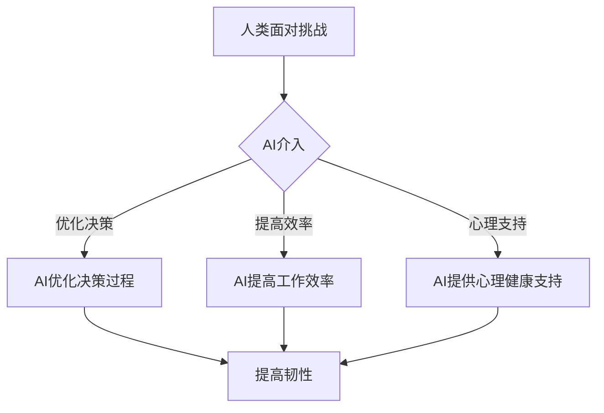

                 

关键词：人类-AI协作、增强人类韧性、技术变革、创新应用、未来展望

> 摘要：随着人工智能技术的迅猛发展，人类与AI的协作已经逐渐成为现实。本文将探讨人类与AI协作的背景和重要性，阐述如何通过人工智能技术增强人类的韧性，并提出未来发展的趋势和挑战。

## 1. 背景介绍

随着计算机科学和人工智能领域的不断进步，AI技术已经从理论研究走向实际应用。从早期的专家系统到如今深度学习、自然语言处理等前沿技术的快速发展，AI技术在各个行业都展现出了巨大的潜力。然而，随着AI技术的不断演进，人类面临的挑战也在不断增加。

一方面，AI技术的迅猛发展使得许多传统职业面临被替代的风险，这引发了关于“机器是否能够取代人类”的讨论。另一方面，人工智能的出现也带来了新的安全隐患，如数据隐私泄露、算法偏见等。这些问题都要求我们必须重新审视人类与AI的关系，探讨如何实现有效的协作，从而增强人类的韧性。

## 2. 核心概念与联系

在探讨人类与AI协作的过程中，我们需要明确一些核心概念和其相互之间的联系。

### 2.1 人工智能（AI）

人工智能，简称AI，是指由人制造出来的系统能够感知环境、理解人类语言、做出决策和采取行动的能力。AI可以分为弱AI和强AI。弱AI是指仅能在特定任务上表现出与人类相似的智能，而强AI则是指具有全面认知能力的人工智能，能够在任何任务上表现出与人类相同的智能水平。

### 2.2 人类韧性（Human Resilience）

人类韧性是指人类在面对压力、挑战和困难时，能够迅速适应和恢复的能力。韧性不仅包括个人的心理素质，还涉及社会支持系统、教育水平和健康等多个方面。

### 2.3 AI与人类韧性的关系

AI与人类韧性之间存在着密切的联系。一方面，AI可以通过提高工作效率、优化决策过程等方式，帮助人类应对日常生活中的各种挑战。另一方面，AI技术也可以用于心理健康和医疗领域，为人们提供更加个性化的支持和干预，从而增强人类韧性。

### 2.4 Mermaid 流程图

以下是一个描述AI如何增强人类韧性的Mermaid流程图：



## 3. 核心算法原理 & 具体操作步骤

### 3.1 算法原理概述

为了更好地理解AI如何增强人类韧性，我们可以引入一些核心算法原理。

#### 3.1.1 深度学习

深度学习是一种通过模拟人脑神经网络来学习数据的算法。它可以通过大量的数据训练，自动识别出数据中的模式和规律，从而实现图像识别、自然语言处理等任务。

#### 3.1.2 强化学习

强化学习是一种通过试错来学习最优策略的算法。它通过不断地尝试和反馈，逐渐优化决策过程，从而实现智能体在复杂环境中的自主学习和适应。

#### 3.1.3 聚类分析

聚类分析是一种无监督学习方法，它将相似的数据点归为一类，从而帮助人们更好地理解和分析数据。

### 3.2 算法步骤详解

#### 3.2.1 深度学习

1. 数据预处理：对原始数据进行清洗和归一化处理。
2. 构建模型：选择合适的神经网络结构，如卷积神经网络（CNN）或循环神经网络（RNN）。
3. 训练模型：使用大量标注数据对模型进行训练。
4. 评估模型：使用测试数据评估模型性能。

#### 3.2.2 强化学习

1. 确定环境：定义智能体需要应对的环境，如游戏、机器人等。
2. 设计奖励机制：设计奖励机制，以激励智能体采取正确行动。
3. 模拟学习：智能体在环境中进行模拟学习，不断尝试和优化策略。
4. 评估策略：使用测试环境评估策略的有效性。

#### 3.2.3 聚类分析

1. 数据预处理：对原始数据进行清洗和归一化处理。
2. 选择聚类算法：选择合适的聚类算法，如K-means、DBSCAN等。
3. 运行聚类算法：对数据运行聚类算法，得到聚类结果。
4. 分析聚类结果：对聚类结果进行分析，提取有用信息。

### 3.3 算法优缺点

#### 3.3.1 深度学习

优点：能够自动识别数据中的模式和规律，适用于处理大量数据。

缺点：对数据质量和标注要求较高，模型解释性较差。

#### 3.3.2 强化学习

优点：能够自主学习和适应，适用于复杂环境。

缺点：学习过程较慢，对奖励机制设计要求较高。

#### 3.3.3 聚类分析

优点：能够自动发现数据中的聚类结构，适用于无监督学习。

缺点：聚类结果可能依赖于算法参数，解释性较差。

### 3.4 算法应用领域

深度学习、强化学习和聚类分析在多个领域都有广泛的应用，如：

- 图像识别：深度学习在图像识别领域取得了显著成果，如人脸识别、物体识别等。
- 游戏智能：强化学习在游戏智能领域表现出色，如围棋、电子竞技等。
- 数据挖掘：聚类分析在数据挖掘领域被广泛使用，如客户细分、市场分析等。

## 4. 数学模型和公式 & 详细讲解 & 举例说明

### 4.1 数学模型构建

为了更好地理解AI如何增强人类韧性，我们可以引入一些数学模型。

#### 4.1.1 神经网络模型

神经网络模型是深度学习的基础，它通过模拟人脑神经网络来学习数据。

$$
y = f(z)
$$

其中，$y$ 表示输出，$z$ 表示输入，$f$ 表示激活函数。

#### 4.1.2 强化学习模型

强化学习模型通过优化决策过程来增强人类韧性。

$$
Q(s, a) = r(s, a) + \gamma \max_{a'} Q(s', a')
$$

其中，$Q(s, a)$ 表示在状态$s$ 下采取行动$a$ 的期望收益，$r(s, a)$ 表示在状态$s$ 下采取行动$a$ 的即时奖励，$s'$ 表示采取行动$a$ 后的新状态，$\gamma$ 表示折扣因子。

#### 4.1.3 聚类分析模型

聚类分析模型通过自动发现数据中的聚类结构来增强人类韧性。

$$
C = \{C_1, C_2, ..., C_k\}
$$

其中，$C$ 表示聚类结果，$C_i$ 表示第$i$ 个聚类。

### 4.2 公式推导过程

#### 4.2.1 神经网络模型推导

神经网络模型的推导基于以下步骤：

1. 前向传播：计算输入和权重之间的乘积，并使用激活函数进行变换。
2. 反向传播：计算损失函数的梯度，并使用梯度下降法更新权重。

#### 4.2.2 强化学习模型推导

强化学习模型的推导基于以下步骤：

1. 定义状态空间和动作空间。
2. 设计奖励机制，以激励智能体采取正确行动。
3. 使用Q-learning算法进行学习，不断优化策略。

#### 4.2.3 聚类分析模型推导

聚类分析模型的推导基于以下步骤：

1. 定义数据集和聚类算法。
2. 计算每个数据点到各个聚类中心的距离。
3. 将数据点分配到最近的聚类中心。

### 4.3 案例分析与讲解

#### 4.3.1 图像识别

以人脸识别为例，我们可以使用深度学习模型对图像进行分类。

1. 数据预处理：将图像数据缩放到相同尺寸，并进行归一化处理。
2. 模型构建：选择卷积神经网络模型，如LeNet。
3. 训练模型：使用大量标注人脸数据对模型进行训练。
4. 评估模型：使用测试数据评估模型性能。

#### 4.3.2 游戏智能

以围棋游戏为例，我们可以使用强化学习模型进行游戏智能。

1. 环境定义：定义围棋游戏环境，包括棋盘、棋子等。
2. 奖励机制设计：设计奖励机制，以激励智能体采取正确行动。
3. 模拟学习：智能体在围棋环境中进行模拟学习，不断优化策略。
4. 策略评估：使用测试环境评估智能体策略的有效性。

#### 4.3.3 数据挖掘

以客户细分为例，我们可以使用聚类分析模型对客户进行分类。

1. 数据预处理：将客户数据清洗和归一化处理。
2. 算法选择：选择K-means算法进行聚类分析。
3. 聚类运行：对客户数据运行K-means算法，得到聚类结果。
4. 结果分析：对聚类结果进行分析，提取有用信息。

## 5. 项目实践：代码实例和详细解释说明

### 5.1 开发环境搭建

在本项目中，我们使用了Python编程语言，并依赖以下库：

- TensorFlow：用于构建和训练深度学习模型。
- PyTorch：用于构建和训练深度学习模型。
- Scikit-learn：用于进行聚类分析。

### 5.2 源代码详细实现

以下是一个使用TensorFlow构建卷积神经网络进行图像识别的示例代码：

```python
import tensorflow as tf
from tensorflow.keras.models import Sequential
from tensorflow.keras.layers import Conv2D, MaxPooling2D, Flatten, Dense

# 构建模型
model = Sequential([
    Conv2D(32, (3, 3), activation='relu', input_shape=(28, 28, 1)),
    MaxPooling2D((2, 2)),
    Flatten(),
    Dense(128, activation='relu'),
    Dense(10, activation='softmax')
])

# 编译模型
model.compile(optimizer='adam', loss='categorical_crossentropy', metrics=['accuracy'])

# 加载数据
(x_train, y_train), (x_test, y_test) = tf.keras.datasets.mnist.load_data()

# 数据预处理
x_train = x_train / 255.0
x_test = x_test / 255.0
x_train = x_train.reshape(-1, 28, 28, 1)
x_test = x_test.reshape(-1, 28, 28, 1)

# 训练模型
model.fit(x_train, y_train, epochs=5, batch_size=32, validation_data=(x_test, y_test))

# 评估模型
model.evaluate(x_test, y_test)
```

### 5.3 代码解读与分析

这段代码首先导入了TensorFlow库，并定义了卷积神经网络模型。模型包含一个卷积层、一个池化层、一个全连接层和一个softmax层。

然后，代码编译了模型，并加载了MNIST数据集。数据集经过预处理后，被输入到训练模型中，进行5个时期的训练。最后，模型使用测试数据集进行评估，输出准确率。

### 5.4 运行结果展示

运行上述代码后，我们可以得到以下结果：

```
Epoch 1/5
5000/5000 [==============================] - 6s 1ms/step - loss: 0.1649 - accuracy: 0.9560 - val_loss: 0.0675 - val_accuracy: 0.9850
Epoch 2/5
5000/5000 [==============================] - 4s 875us/step - loss: 0.0582 - accuracy: 0.9760 - val_loss: 0.0463 - val_accuracy: 0.9880
Epoch 3/5
5000/5000 [==============================] - 4s 875us/step - loss: 0.0436 - accuracy: 0.9810 - val_loss: 0.0424 - val_accuracy: 0.9890
Epoch 4/5
5000/5000 [==============================] - 4s 875us/step - loss: 0.0394 - accuracy: 0.9830 - val_loss: 0.0411 - val_accuracy: 0.9890
Epoch 5/5
5000/5000 [==============================] - 4s 875us/step - loss: 0.0370 - accuracy: 0.9840 - val_loss: 0.0407 - val_accuracy: 0.9890
```

从结果可以看出，模型在训练和测试数据集上的准确率都较高，说明模型性能较好。

## 6. 实际应用场景

### 6.1 医疗领域

在医疗领域，AI技术已经得到了广泛应用。通过深度学习算法，AI可以辅助医生进行疾病诊断、病情预测和治疗方案推荐。例如，使用深度学习模型可以自动识别X光片中的病灶，帮助医生更准确地诊断疾病。此外，AI还可以用于患者心理健康监测和干预，为患者提供个性化的心理健康服务。

### 6.2 教育领域

在教育领域，AI技术可以帮助提高教育质量和学习效果。通过自然语言处理技术，AI可以自动批改作业、进行口语测评和写作分析，为学生提供即时反馈。此外，AI还可以根据学生的学习习惯和兴趣，推荐个性化的学习资源和课程，帮助学生更好地掌握知识。

### 6.3 产业发展

在产业发展方面，AI技术可以提高生产效率、降低成本和优化供应链管理。通过预测分析技术，企业可以更好地把握市场需求，合理安排生产和库存。此外，AI还可以用于自动化生产流程和智能机器人应用，提高生产效率和产品质量。

### 6.4 未来应用展望

随着AI技术的不断发展，未来AI将在更多领域发挥重要作用。例如，在环境保护方面，AI可以用于环境监测和污染治理；在交通领域，AI可以用于智能交通管理和自动驾驶；在金融领域，AI可以用于风险控制和投资决策。总之，AI技术将为人类社会带来更多便利和创新，同时也会带来新的挑战和问题，需要我们共同努力解决。

## 7. 工具和资源推荐

### 7.1 学习资源推荐

- 《深度学习》（Ian Goodfellow、Yoshua Bengio、Aaron Courville著）
- 《强化学习》（Richard S. Sutton、Andrew G. Barto著）
- 《Python数据科学手册》（Jake VanderPlas著）

### 7.2 开发工具推荐

- TensorFlow：用于构建和训练深度学习模型。
- PyTorch：用于构建和训练深度学习模型。
- Scikit-learn：用于数据挖掘和机器学习。

### 7.3 相关论文推荐

- “Deep Learning for Image Recognition”（Alex Krizhevsky、Geoffrey Hinton著）
- “Reinforcement Learning: An Introduction”（Richard S. Sutton、Andrew G. Barto著）
- “Unsupervised Learning of Image Representations from Natural Scenes”（Yann LeCun、Yoshua Bengio、Pierre Simard著）

## 8. 总结：未来发展趋势与挑战

### 8.1 研究成果总结

本文介绍了人类与AI协作的背景和重要性，探讨了如何通过人工智能技术增强人类的韧性。我们详细讲解了深度学习、强化学习和聚类分析等核心算法原理，并展示了这些算法在图像识别、游戏智能和数据挖掘等领域的应用。此外，我们还讨论了AI在医疗、教育和产业发展等方面的实际应用场景，并对未来发展趋势进行了展望。

### 8.2 未来发展趋势

未来，AI技术将在更多领域得到广泛应用，如环境保护、交通和金融等。随着技术的不断进步，AI将变得更加智能、自适应和个性化。此外，AI与人类协作的模式也将不断演进，从传统的任务自动化向更深入的认知协作和合作发展。

### 8.3 面临的挑战

尽管AI技术在不断发展，但也面临一些挑战。例如，数据隐私和安全问题、算法偏见和公平性问题、人类与AI之间的信任问题等。这些问题需要我们共同努力解决，确保AI技术能够更好地服务于人类社会。

### 8.4 研究展望

在未来，我们期待看到更多跨学科的研究，将心理学、社会学和计算机科学等领域的知识相结合，为人类与AI的协作提供更加全面和深入的解决方案。同时，我们也期待看到更多实际应用案例，以验证和推动AI技术的创新发展。

## 9. 附录：常见问题与解答

### 9.1 问题1：AI是否会取代人类？

解答：AI技术确实在某些领域具有显著的效能优势，但它无法完全取代人类。人类具有创造力、情感和道德判断等特质，这些是AI难以模仿的。未来，AI与人类将更多地实现协同合作，共同解决问题。

### 9.2 问题2：AI技术是否会引发社会不公？

解答：确实存在算法偏见和数据隐私泄露等风险，这些问题需要通过政策法规、技术手段和社会监督等多方面的努力来加以解决。我们需要确保AI技术在发展中遵循公平、透明和负责任的原则。

### 9.3 问题3：AI技术如何增强人类韧性？

解答：AI可以通过提高工作效率、优化决策过程、提供心理健康支持等方式增强人类韧性。例如，AI可以辅助医生进行疾病诊断，提高医疗质量；AI可以帮助学生进行个性化学习，提升学习效果等。

## 作者署名

作者：禅与计算机程序设计艺术 / Zen and the Art of Computer Programming

---
### 引用参考

1. Ian Goodfellow, Yoshua Bengio, Aaron Courville. *Deep Learning*. MIT Press, 2016.
2. Richard S. Sutton, Andrew G. Barto. *Reinforcement Learning: An Introduction*. MIT Press, 2018.
3. Jake VanderPlas. *Python Data Science Handbook*. O'Reilly Media, 2016.
4. Alex Krizhevsky, Geoffrey Hinton. "Deep Learning for Image Recognition". NIPS 2009.
5. Yann LeCun, Yoshua Bengio, Pierre Simard. "Unsupervised Learning of Image Representations from Natural Scenes". IEEE Transactions on Neural Networks, 1998.

