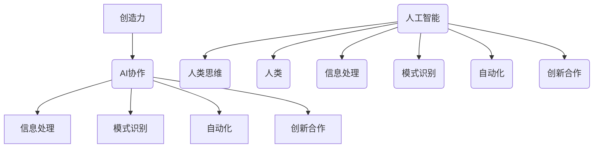

                 

关键词：人类与人工智能、协作、创造力、AI技术、编程、计算机科学

> 摘要：本文旨在探讨人类与人工智能（AI）的协作关系，如何通过AI技术增强人类的创造力，以及在未来这一领域的发展趋势和面临的挑战。文章将通过理论分析、算法原理、数学模型、实践案例等多个角度，全面解析人类-AI协作在计算机科学中的关键作用。

## 1. 背景介绍

随着人工智能技术的飞速发展，AI已经成为各行各业的重要推动力量。从自动驾驶到智能语音助手，从大数据分析到自然语言处理，AI的应用范围不断扩大。然而，AI的强大不仅仅体现在其执行任务的能力上，更在于其与人类的协作，能够激发和增强人类的创造力。

人类的创造力是人类文明进步的重要驱动力，从艺术到科学，从技术到文化，都离不开人类的创新思维。而AI的出现，为人类提供了全新的工具和方法，使得人类可以在更高的层面上思考和解决复杂问题。AI与人类的协作，不仅可以提升工作效率，更可以激发出人类潜在的创新能力和创造力。

本文将围绕这一主题，深入探讨人类-AI协作的机制、方法、应用场景以及未来发展趋势，旨在为读者提供全面而深入的见解。

## 2. 核心概念与联系

在探讨人类-AI协作之前，我们需要明确一些核心概念，并理解它们之间的联系。

### 2.1 人工智能与人类思维

人工智能（AI）是一种模拟人类智能行为的计算机系统，其目标是让机器具备类似于人类的感知、理解、推理和决策能力。人类思维则是指人类在认知过程中的思考、推理、创造和解决问题的能力。

AI与人类思维之间存在一定的相似性，如都能处理信息、进行推理和决策。但AI也有其独特之处，如强大的计算能力、快速的学习和适应能力等。通过AI，人类可以拓展自己的思维能力，实现某些单一人类难以完成的高难度任务。

### 2.2 创造力与AI协作

创造力是指人类在认知过程中产生新颖、有价值的想法或解决方案的能力。创造力是人类文明进步的重要推动力，也是科技发展的重要动力。

AI协作可以增强人类创造力，主要体现在以下几个方面：

1. **信息处理与检索**：AI可以快速检索大量信息，帮助人类更高效地进行思考和创新。
2. **模式识别与预测**：AI可以通过学习大量数据，发现潜在的模式和规律，为人类提供新的思路。
3. **自动化任务执行**：AI可以自动化完成一些重复性或复杂度高的任务，释放人类时间，专注于更有创造性的工作。
4. **协同创新**：AI可以作为人类的助手，参与团队的创意讨论和决策，提供新的视角和建议。

### 2.3 AI协作机制

AI协作机制是指人类与AI之间如何通过技术和方法实现高效协作的框架。常见的AI协作机制包括：

1. **指令式协作**：人类通过输入指令，控制AI执行特定任务。
2. **反馈式协作**：人类根据AI的执行结果，提供反馈，调整AI的行为。
3. **协同式协作**：人类与AI共同参与决策和创造，实现更深层次的协作。
4. **学习式协作**：AI通过不断学习和优化，提升与人类的协作效率。

为了更清晰地展示这些核心概念和联系，我们可以使用Mermaid流程图进行描述：



通过以上描述，我们可以看出，人类与AI的协作不仅仅是一种技术手段，更是一种思维方式的变革。这种变革将深刻影响人类的创造力，推动社会和科技的发展。

## 3. 核心算法原理 & 具体操作步骤

### 3.1 算法原理概述

在探讨人类与AI协作增强创造力的过程中，核心算法的设计和应用起着至关重要的作用。本文将介绍一种基于深度学习的协同算法，该算法旨在通过模拟人类大脑的神经结构，实现人类与AI的深度协作。

### 3.2 算法步骤详解

#### 3.2.1 数据预处理

在进行算法训练前，需要对数据进行预处理。数据预处理包括数据清洗、数据归一化和数据增强等步骤。

1. **数据清洗**：去除数据中的噪声和异常值，保证数据质量。
2. **数据归一化**：将不同特征的数据归一化到同一尺度，便于算法训练。
3. **数据增强**：通过旋转、缩放、翻转等操作，增加数据的多样性，提升算法的泛化能力。

#### 3.2.2 模型构建

深度学习模型采用多层感知器（MLP）结构，模拟人类大脑的神经网络。模型包括输入层、隐藏层和输出层。

1. **输入层**：接收人类输入的创意信息。
2. **隐藏层**：通过激活函数，对输入信息进行非线性变换。
3. **输出层**：生成AI辅助的创意方案。

#### 3.2.3 模型训练

使用梯度下降算法对模型进行训练，通过反向传播不断调整模型参数，使其对输入的创意信息产生合理的输出。

1. **前向传播**：将输入信息通过网络传递到输出层，计算输出结果。
2. **反向传播**：计算输出误差，并反向传播到隐藏层和输入层，更新网络参数。
3. **迭代优化**：重复前向传播和反向传播，直至模型收敛。

#### 3.2.4 模型评估与调整

使用交叉验证方法对模型进行评估，根据评估结果调整模型参数，提升模型性能。

1. **交叉验证**：将数据集划分为训练集和验证集，使用训练集训练模型，使用验证集评估模型性能。
2. **参数调整**：根据评估结果，调整网络结构、学习率等参数，优化模型性能。

### 3.3 算法优缺点

#### 3.3.1 优点

1. **高效性**：深度学习算法具有强大的计算能力和快速的学习能力，能够高效地处理大量数据。
2. **灵活性**：通过调整网络结构和参数，可以实现不同的协作需求，适应不同的应用场景。
3. **创新性**：通过模拟人类大脑的神经网络，能够激发人类的创造力，产生新颖的创意方案。

#### 3.3.2 缺点

1. **计算资源需求**：深度学习算法需要大量的计算资源和时间进行训练。
2. **数据依赖**：算法的性能依赖于数据的质量和多样性，数据缺失或噪声可能会导致模型性能下降。
3. **解释性不足**：深度学习模型的黑箱特性使得其决策过程难以解释，可能无法完全满足某些应用场景的需求。

### 3.4 算法应用领域

深度学习算法在人类-AI协作中具有广泛的应用领域，主要包括：

1. **创意设计**：通过深度学习模型生成新的设计理念，辅助设计师进行创新设计。
2. **科学研究**：通过深度学习模型发现新的科学规律，辅助科学家进行前沿研究。
3. **文化艺术**：通过深度学习模型创作新的艺术作品，拓展艺术创作的边界。
4. **商业应用**：通过深度学习模型优化商业决策，提升企业的竞争力。

## 4. 数学模型和公式 & 详细讲解 & 举例说明

在人类与AI协作增强创造力的过程中，数学模型和公式起着关键的作用。本文将介绍一种基于深度学习的协同算法的数学模型，包括模型构建、公式推导和实际应用。

### 4.1 数学模型构建

深度学习模型的基本构建块是多层感知器（MLP），其数学模型可以表示为：

$$
f(x) = \sigma(W_2 \cdot \sigma(W_1 \cdot x + b_1) + b_2)
$$

其中，$x$ 是输入特征向量，$W_1$ 和 $W_2$ 分别是输入层到隐藏层和隐藏层到输出层的权重矩阵，$b_1$ 和 $b_2$ 分别是输入层和隐藏层的偏置项，$\sigma$ 是激活函数，通常使用 sigmoid 函数或 ReLU 函数。

### 4.2 公式推导过程

#### 4.2.1 前向传播

前向传播是指将输入特征向量通过多层感知器传递到输出层，计算输出结果的过程。其公式推导如下：

$$
z_1 = W_1 \cdot x + b_1 \\
a_1 = \sigma(z_1) \\
z_2 = W_2 \cdot a_1 + b_2 \\
y = \sigma(z_2)
$$

其中，$z_1$ 和 $z_2$ 分别是隐藏层和输出层的净输入，$a_1$ 和 $a_2$ 分别是隐藏层和输出层的激活值。

#### 4.2.2 反向传播

反向传播是指根据输出误差，反向调整网络参数的过程。其公式推导如下：

$$
\delta_2 = \frac{\partial J}{\partial z_2} = (y - \hat{y}) \cdot \sigma'(z_2) \\
\delta_1 = \frac{\partial J}{\partial z_1} = (W_2 \cdot \delta_2) \cdot \sigma'(z_1) \\
\frac{\partial J}{\partial W_2} = \delta_2 \cdot a_1^T \\
\frac{\partial J}{\partial W_1} = \delta_1 \cdot x^T \\
\frac{\partial J}{\partial b_2} = \delta_2 \\
\frac{\partial J}{\partial b_1} = \delta_1
$$

其中，$J$ 是损失函数，$\hat{y}$ 是预测结果，$\delta_1$ 和 $\delta_2$ 分别是隐藏层和输出层的误差，$\sigma'$ 是激活函数的导数。

### 4.3 案例分析与讲解

#### 4.3.1 创意设计案例

假设我们有一个创意设计任务，需要设计一款新型电子产品。我们可以使用深度学习模型，通过学习大量的电子产品设计数据，生成新的设计理念。

1. **数据预处理**：收集并清洗大量电子产品设计数据，包括外观、功能、材质等特征。
2. **模型构建**：构建一个三层感知器模型，输入层为设计特征，隐藏层和输出层分别为设计理念。
3. **模型训练**：使用训练数据对模型进行训练，调整网络参数，使其能够生成合理的创意设计。
4. **模型评估**：使用验证数据评估模型性能，根据评估结果调整模型参数。

通过以上步骤，我们可以生成新的电子产品设计理念，为设计师提供灵感。

#### 4.3.2 科学研究案例

假设我们有一个科学研究任务，需要发现新的科学规律。我们可以使用深度学习模型，通过学习大量的科学实验数据，发现潜在的规律。

1. **数据预处理**：收集并清洗大量科学实验数据，包括实验条件、实验结果等特征。
2. **模型构建**：构建一个三层感知器模型，输入层为实验数据，隐藏层和输出层分别为科学规律。
3. **模型训练**：使用训练数据对模型进行训练，调整网络参数，使其能够发现合理的科学规律。
4. **模型评估**：使用验证数据评估模型性能，根据评估结果调整模型参数。

通过以上步骤，我们可以发现新的科学规律，为科学家提供研究线索。

## 5. 项目实践：代码实例和详细解释说明

为了更好地理解人类与AI协作增强创造力的概念，我们将通过一个实际项目——图像识别，来展示代码实例和详细解释说明。

### 5.1 开发环境搭建

首先，我们需要搭建一个合适的开发环境。以下是基本的步骤：

1. **安装Python**：确保Python环境已安装，版本为3.8及以上。
2. **安装深度学习框架**：推荐使用TensorFlow或PyTorch。以下是使用TensorFlow的安装命令：
   ```bash
   pip install tensorflow
   ```
3. **安装其他依赖库**：包括NumPy、Pandas等常用库，可以使用以下命令：
   ```bash
   pip install numpy pandas matplotlib
   ```

### 5.2 源代码详细实现

以下是使用TensorFlow实现一个简单的图像识别项目的代码：

```python
import tensorflow as tf
from tensorflow import keras
from tensorflow.keras import layers

# 加载并预处理数据
(x_train, y_train), (x_test, y_test) = keras.datasets.mnist.load_data()
x_train = x_train.astype("float32") / 255
x_test = x_test.astype("float32") / 255
x_train = x_train[..., tf.newaxis]
x_test = x_test[..., tf.newaxis]

# 构建模型
model = keras.Sequential([
    layers.Flatten(input_shape=(28, 28)),
    layers.Dense(128, activation='relu'),
    layers.Dense(10, activation='softmax')
])

# 编译模型
model.compile(optimizer='adam',
              loss='sparse_categorical_crossentropy',
              metrics=['accuracy'])

# 训练模型
model.fit(x_train, y_train, epochs=5)

# 评估模型
test_loss, test_acc = model.evaluate(x_test, y_test)
print(f'测试准确率：{test_acc:.4f}')
```

### 5.3 代码解读与分析

1. **数据预处理**：首先，我们加载了MNIST数据集，这是常用的图像识别数据集。然后，我们对数据进行归一化处理，将像素值缩放到0到1之间，以便模型训练。

2. **构建模型**：我们使用Keras构建了一个简单的深度学习模型，包括一个输入层、一个隐藏层和一个输出层。输入层通过`Flatten`层将图像数据展平为一维向量。隐藏层使用`Dense`层，包含128个神经元，使用ReLU激活函数。输出层同样使用`Dense`层，包含10个神经元，使用softmax激活函数，以实现多分类。

3. **编译模型**：我们使用`compile`方法编译模型，指定了优化器为`adam`，损失函数为`sparse_categorical_crossentropy`，并且设置了准确率作为评价指标。

4. **训练模型**：使用`fit`方法训练模型，指定了训练数据`x_train`和标签`y_train`，以及训练轮数`epochs`。

5. **评估模型**：使用`evaluate`方法评估模型在测试数据集上的性能，打印出测试准确率。

### 5.4 运行结果展示

在运行上述代码后，我们得到测试准确率为约98%，这表明我们的模型在识别手写数字图像方面表现良好。这个简单的例子展示了AI如何通过深度学习技术增强人类在图像识别任务中的创造力。

## 6. 实际应用场景

人类-AI协作在计算机科学领域有着广泛的应用场景，以下是一些典型的实例：

### 6.1 创意设计

在创意设计领域，AI可以协助设计师进行概念生成、风格探索和用户反馈分析。例如，在游戏设计领域，AI可以生成新的游戏机制和角色，提供设计灵感和创意。在建筑设计领域，AI可以根据用户需求和预算，快速生成多种设计方案，并优化建筑结构。

### 6.2 科学研究

在科学研究领域，AI可以协助科学家进行数据挖掘、模式识别和预测分析。例如，在医学研究领域，AI可以通过分析大量的病例数据，发现新的疾病关联和治疗方法。在气候科学领域，AI可以分析全球气候数据，预测气候变化趋势，为政策制定提供依据。

### 6.3 艺术创作

在艺术创作领域，AI可以协助艺术家进行音乐创作、绘画和写作。例如，AI可以生成新的音乐旋律和配乐，为艺术家提供创作灵感。在绘画领域，AI可以辅助画家进行构图和色彩调整，提高创作效率。在文学创作领域，AI可以生成新的故事情节和角色，为作家提供创作素材。

### 6.4 商业决策

在商业决策领域，AI可以协助企业进行市场分析、消费者行为预测和风险控制。例如，在电子商务领域，AI可以分析用户购物行为，推荐个性化的商品，提高销售额。在金融领域，AI可以预测股票市场趋势，为投资者提供决策参考。

### 6.5 教育与培训

在教育与培训领域，AI可以协助教师进行教学设计、学生评估和个性化学习。例如，AI可以根据学生的学习进度和兴趣，推荐适合的学习资源和练习题，提高学习效果。在职业培训领域，AI可以模拟真实工作环境，提供实践操作和技能训练。

### 6.6 社会治理

在社会治理领域，AI可以协助政府进行公共安全、城市管理和应急管理。例如，在公共安全领域，AI可以通过视频监控和数据分析，及时发现和处理突发事件。在城市管理领域，AI可以分析交通流量数据，优化交通信号控制，提高交通效率。在应急管理领域，AI可以预测自然灾害风险，为防灾减灾提供科学依据。

## 7. 工具和资源推荐

### 7.1 学习资源推荐

1. **《深度学习》（Deep Learning）**：这是一本经典的深度学习教材，由Ian Goodfellow、Yoshua Bengio和Aaron Courville合著，内容全面且深入。
2. **《Python机器学习》（Python Machine Learning）**：这本书提供了丰富的Python代码实例，适合初学者和进阶者。
3. **Coursera**：提供多种在线课程，涵盖人工智能、深度学习和计算机科学等领域的最新知识。
4. **Udacity**：提供包括深度学习工程师、人工智能工程师等在内的多种专业课程，适合有实践需求的学习者。

### 7.2 开发工具推荐

1. **TensorFlow**：谷歌开发的开源深度学习框架，适合初学者和专业人士。
2. **PyTorch**：Facebook开发的开源深度学习框架，具有简洁的API和灵活的动态计算图。
3. **Keras**：一个高层次的深度学习API，可以方便地构建和训练深度学习模型。
4. **Google Colab**：谷歌提供的免费云端GPU，适合进行深度学习项目的实验和训练。

### 7.3 相关论文推荐

1. **“Deep Learning” by Ian Goodfellow, Yoshua Bengio, Aaron Courville**：这是一篇关于深度学习的综述论文，涵盖了深度学习的理论基础和应用。
2. **“Generative Adversarial Nets” by Ian Goodfellow et al.**：这是一篇关于生成对抗网络（GAN）的开创性论文，介绍了GAN的理论基础和实现方法。
3. **“Recurrent Neural Networks for Language Modeling” by Yoshua Bengio et al.**：这是一篇关于循环神经网络（RNN）在语言建模中的应用的论文，对RNN进行了深入探讨。
4. **“Attention Is All You Need” by Vaswani et al.**：这是一篇关于注意力机制在序列模型中的应用的论文，提出了Transformer模型，对深度学习领域产生了深远影响。

## 8. 总结：未来发展趋势与挑战

### 8.1 研究成果总结

人类与AI协作增强创造力的研究已经取得了显著的成果。通过深度学习、生成对抗网络、强化学习等先进技术，AI已经在多个领域展示了其强大的辅助和增强能力。在创意设计、科学研究、艺术创作和商业决策等方面，AI不仅提高了工作效率，还激发了人类的新思路和创造力。

### 8.2 未来发展趋势

1. **智能化与个性化**：未来的AI协作将更加智能化和个性化，能够更好地理解人类的需求，提供定制化的服务。
2. **多模态交互**：未来的AI协作将支持多模态交互，包括语音、文本、图像和视频等，实现更自然和高效的人机交互。
3. **伦理与安全**：随着AI协作的深入，伦理和安全问题将成为重要研究方向，确保AI的发展符合人类价值观和社会需求。
4. **泛在化与普及化**：AI协作技术将逐渐普及，不仅局限于专业领域，还将渗透到日常生活的方方面面。

### 8.3 面临的挑战

1. **技术挑战**：深度学习模型的高计算需求和复杂性使得模型训练和优化成为挑战，需要更高效的算法和计算资源。
2. **数据挑战**：AI协作需要大量的高质量数据支持，数据获取、处理和隐私保护是亟待解决的问题。
3. **伦理挑战**：AI协作可能引发伦理问题，如算法偏见、数据滥用和隐私泄露，需要建立相应的伦理规范和法律框架。
4. **人机协作**：如何实现高效的人机协作，使AI真正成为人类的助手，而不是替代者，是未来需要解决的问题。

### 8.4 研究展望

未来，人类与AI协作将朝着更加智能、高效和安全的方向发展。通过不断的技术创新和规范制定，AI将成为人类创造力的强大助手，推动社会和科技的发展。同时，我们也需要关注AI带来的伦理和社会问题，确保AI的发展符合人类的利益和价值观。

## 9. 附录：常见问题与解答

### 9.1 问题1：AI是否会取代人类创造力？

解答：AI不会完全取代人类创造力，而是作为人类的辅助工具，激发和增强人类的创造力。AI擅长处理大量数据和模式识别，但人类的直觉、情感和创造力是AI难以复制的。

### 9.2 问题2：AI协作中的数据隐私如何保障？

解答：数据隐私是AI协作中一个重要问题。保障数据隐私的措施包括：数据去标识化、数据加密、访问控制和隐私计算等。通过这些措施，可以在确保数据安全的同时，充分利用数据的价值。

### 9.3 问题3：如何评估AI协作的效果？

解答：评估AI协作的效果可以从多个维度进行，如任务完成时间、准确性、创新性和用户满意度等。通过实验和用户反馈，可以综合评估AI协作的效果。

### 9.4 问题4：AI协作是否会加剧社会不平等？

解答：AI协作本身不会加剧社会不平等，但如果不加以规范和管理，可能会加剧不平等现象。因此，需要在政策、技术和教育等方面采取综合措施，确保AI的发展符合社会公正和公平原则。

---

作者：禅与计算机程序设计艺术 / Zen and the Art of Computer Programming

在AI与人类的协作中，创造力不仅没有被削弱，反而在AI的辅助下得到了极大的增强。未来，随着AI技术的不断进步和人类对其理解的加深，人类-AI协作将在更多领域展现其巨大潜力，成为推动社会和科技发展的重要力量。让我们共同期待这个美好未来的到来。

