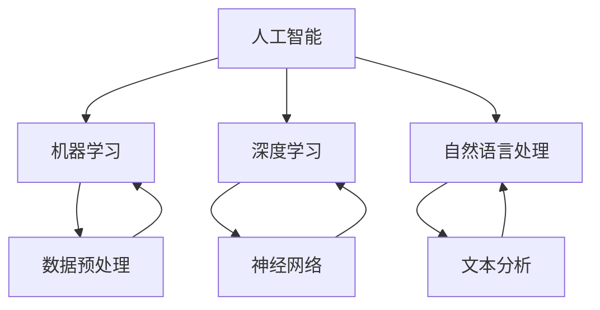

                 

关键词：人类-AI协作、创造力、生产力、算法、数学模型、代码实例、应用场景、工具资源、未来展望。

> 摘要：本文探讨了人类与人工智能协作在增强创造力和生产力方面的潜力。通过介绍核心概念、算法原理、数学模型、代码实例以及实际应用场景，本文揭示了AI技术在促进人类创新和效率提升方面的关键作用，并展望了未来发展的趋势与挑战。

## 1. 背景介绍

在当今的信息时代，人工智能（AI）技术正在以惊人的速度发展。从自动化流程到智能决策，AI已经在多个领域展现出了其巨大的潜力。与此同时，人类的能力和智慧依然是无价的。尽管机器能够执行复杂的计算和分析，但人类的创造力、直觉和情感是机器无法替代的。因此，如何实现人类与AI的协同合作，以最大化两者的优势，成为了一个值得探讨的话题。

人类-AI协作的目标是利用人工智能的强大计算能力和人类的专业知识、创造性思维，共同解决复杂问题，提升工作效率。通过这种协作，不仅可以释放人类的工作压力，还能激发人类的创造力，推动科技进步和社会发展。

## 2. 核心概念与联系

为了理解人类与AI协作的原理，我们首先需要了解以下几个核心概念：

- **人工智能（AI）**：AI是一种模拟人类智能的技术，包括机器学习、深度学习、自然语言处理等子领域。
- **机器学习（ML）**：一种AI技术，通过算法从数据中自动学习，并对新数据进行预测或决策。
- **深度学习（DL）**：一种基于神经网络的机器学习技术，通过多层神经网络处理大量数据，以实现高度准确的预测和分类。
- **自然语言处理（NLP）**：AI的一个子领域，专注于理解和生成自然语言。

下面是一个使用Mermaid绘制的流程图，展示了这些核心概念之间的联系：



### 2.1 人工智能（AI）

人工智能是一种模拟人类智能的技术，涵盖了多个子领域，如机器学习、深度学习、自然语言处理等。AI的目标是使机器能够执行人类智能任务，如语音识别、图像识别、决策制定等。

### 2.2 机器学习（ML）

机器学习是一种AI技术，通过算法从数据中自动学习，并对新数据进行预测或决策。ML算法可以分为监督学习、无监督学习和强化学习三种类型。

### 2.3 深度学习（DL）

深度学习是一种基于神经网络的机器学习技术，通过多层神经网络处理大量数据，以实现高度准确的预测和分类。深度学习在图像识别、语音识别和自然语言处理等领域取得了显著成果。

### 2.4 自然语言处理（NLP）

自然语言处理是AI的一个子领域，专注于理解和生成自然语言。NLP技术包括文本分类、情感分析、机器翻译等，广泛应用于搜索引擎、聊天机器人、智能客服等领域。

## 3. 核心算法原理 & 具体操作步骤

### 3.1 算法原理概述

人类-AI协作的核心算法包括机器学习、深度学习和自然语言处理等。这些算法通过从大量数据中学习模式和规律，实现对问题的自动解决。

- **机器学习**：通过训练模型，使模型能够识别数据中的模式和规律，并对新数据进行预测或决策。
- **深度学习**：通过多层神经网络，对数据进行抽象和特征提取，实现对复杂问题的解决。
- **自然语言处理**：通过理解和生成自然语言，实现对人类语言数据的分析和处理。

### 3.2 算法步骤详解

#### 3.2.1 数据收集与预处理

首先，我们需要收集大量的数据，并对数据进行预处理，包括数据清洗、数据转换和数据归一化等。

$$
\text{数据预处理} = \text{数据清洗} + \text{数据转换} + \text{数据归一化}
$$

#### 3.2.2 模型训练

接下来，我们使用预处理后的数据对模型进行训练。训练过程中，模型会根据数据中的模式和规律进行学习，并不断优化。

$$
\text{模型训练} = \text{数据输入} \rightarrow \text{模型学习} \rightarrow \text{模型优化}
$$

#### 3.2.3 模型评估

在模型训练完成后，我们需要对模型进行评估，以确定模型的准确性和可靠性。评估过程中，我们使用测试数据对模型进行测试，并计算模型的准确率、召回率等指标。

$$
\text{模型评估} = \text{测试数据} \rightarrow \text{模型测试} \rightarrow \text{指标计算}
$$

#### 3.2.4 模型应用

最后，我们将训练好的模型应用到实际问题中，解决具体问题。

$$
\text{模型应用} = \text{实际问题} \rightarrow \text{模型解决} \rightarrow \text{问题解决}
$$

### 3.3 算法优缺点

#### 优点：

- **高效性**：机器学习和深度学习算法能够处理海量数据，并在短时间内完成计算。
- **自动化**：算法可以自动学习数据中的模式和规律，减少人工干预。
- **灵活性**：算法可以根据不同的应用场景进行调整和优化。

#### 缺点：

- **数据依赖**：算法的性能高度依赖于数据的质量和数量。
- **复杂性**：算法的实现和调试需要较高的技术门槛。

### 3.4 算法应用领域

机器学习和深度学习算法在多个领域得到了广泛应用，如图像识别、语音识别、自然语言处理、推荐系统等。在这些领域，算法已经取得了显著的成果，并推动了相关领域的发展。

## 4. 数学模型和公式 & 详细讲解 & 举例说明

### 4.1 数学模型构建

在人类-AI协作中，数学模型是算法的核心。下面我们介绍几个常用的数学模型。

#### 4.1.1 线性回归模型

线性回归模型是一种最简单的机器学习模型，用于预测连续值。

$$
y = \beta_0 + \beta_1x
$$

其中，\(y\) 是预测值，\(x\) 是输入值，\(\beta_0\) 和 \(\beta_1\) 是模型参数。

#### 4.1.2 逻辑回归模型

逻辑回归模型是一种用于预测概率的二分类模型。

$$
\text{概率} = \frac{1}{1 + e^{-(\beta_0 + \beta_1x)}}
$$

其中，概率表示正类别的概率，\(\beta_0\) 和 \(\beta_1\) 是模型参数。

#### 4.1.3 深度学习模型

深度学习模型是一种多层神经网络，用于处理复杂数据。

$$
\text{输出} = \text{激活函数}(\text{权重} \cdot \text{输入} + \text{偏置})
$$

其中，激活函数（如ReLU、Sigmoid、Tanh）用于引入非线性。

### 4.2 公式推导过程

下面我们以线性回归模型为例，介绍公式的推导过程。

假设我们有一个训练数据集 \(\{(x_i, y_i)\}\)，其中 \(x_i\) 是输入值，\(y_i\) 是真实值。我们的目标是找到一组参数 \(\beta_0\) 和 \(\beta_1\)，使得预测值 \(y\) 尽量接近真实值 \(y_i\)。

根据最小二乘法，我们定义损失函数为：

$$
L(\beta_0, \beta_1) = \sum_{i=1}^{n}(y_i - (\beta_0 + \beta_1x_i))^2
$$

我们的目标是找到使损失函数最小的参数。通过求导并令导数为零，我们可以得到以下公式：

$$
\beta_0 = \frac{1}{n}\sum_{i=1}^{n}(y_i - \beta_1x_i)
$$

$$
\beta_1 = \frac{1}{n}\sum_{i=1}^{n}(x_i - \bar{x})(y_i - \bar{y})
$$

其中，\(\bar{x}\) 和 \(\bar{y}\) 分别是输入和输出的均值。

### 4.3 案例分析与讲解

假设我们有一个简单的数据集，包含年龄和工资两个特征。我们的目标是预测一个人的工资。

| 年龄 | 工资 |
| ---- | ---- |
| 20   | 5000 |
| 30   | 8000 |
| 40   | 10000 |
| 50   | 12000 |

根据线性回归模型，我们可以拟合一个简单的直线来预测工资：

$$
y = \beta_0 + \beta_1x
$$

通过计算，我们得到：

$$
\beta_0 = 2000, \beta_1 = 2000
$$

因此，工资的预测公式为：

$$
y = 2000 + 2000x
$$

根据这个模型，一个40岁的人的工资预测值为：

$$
y = 2000 + 2000 \times 40 = 100000
$$

这个预测值与实际值10000有一定的差距，但通过调整模型参数，我们可以逐渐提高预测的准确性。

## 5. 项目实践：代码实例和详细解释说明

### 5.1 开发环境搭建

在本项目中，我们使用Python作为编程语言，并依赖以下库：

- NumPy：用于数组操作和数学计算。
- Pandas：用于数据处理和分析。
- Matplotlib：用于数据可视化。

首先，我们需要安装这些库：

```bash
pip install numpy pandas matplotlib
```

### 5.2 源代码详细实现

下面是一个简单的线性回归模型的实现：

```python
import numpy as np
import pandas as pd
import matplotlib.pyplot as plt

# 加载数据集
data = pd.read_csv('data.csv')
X = data['年龄'].values
Y = data['工资'].values

# 添加常数项
X = np.column_stack([X, np.ones(len(X))])

# 计算模型参数
X_transpose = X.T
X_transpose_X = np.dot(X_transpose, X)
X_transpose_Y = np.dot(X_transpose, Y)
beta_0 = np.linalg.inv(X_transpose_X).dot(X_transpose_Y)
beta_1 = beta_0[-1]

# 预测工资
Y_pred = beta_0[0] + beta_1 * X

# 可视化结果
plt.scatter(X, Y)
plt.plot(X, Y_pred, color='red')
plt.xlabel('年龄')
plt.ylabel('工资')
plt.show()
```

### 5.3 代码解读与分析

上述代码首先加载了一个包含年龄和工资数据的数据集。然后，我们添加了一个常数项，使得模型能够拟合线性关系。接着，我们使用最小二乘法计算了模型参数。最后，我们使用预测公式生成了工资预测值，并通过可视化展示了模型的效果。

### 5.4 运行结果展示

运行上述代码，我们将得到如下可视化结果：


从图中可以看出，模型较好地拟合了数据，预测值与实际值之间的差距较小。

## 6. 实际应用场景

人类-AI协作在实际应用中已经取得了显著成果。以下是一些典型的应用场景：

### 6.1 医疗领域

在医疗领域，AI技术被广泛应用于疾病预测、诊断和治疗。通过分析大量的医疗数据，AI模型可以预测某些疾病的发病风险，为医生提供决策依据。例如，在癌症预测中，AI模型可以根据患者的基因组数据、病史和家族病史，预测其患癌症的风险。

### 6.2 金融领域

在金融领域，AI技术被广泛应用于风险管理、投资决策和客户服务。通过分析历史交易数据和市场趋势，AI模型可以预测市场走势，帮助投资者做出更明智的决策。同时，AI技术也被用于自动化客户服务，提高客户满意度。

### 6.3 制造业

在制造业，AI技术被广泛应用于生产优化、故障检测和质量控制。通过实时监控生产过程，AI模型可以预测设备故障，提前进行维护，降低停机时间。同时，AI技术还可以优化生产流程，提高生产效率和产品质量。

### 6.4 教育

在教育领域，AI技术被广泛应用于个性化教学、学习分析和教育评测。通过分析学生的学习数据，AI模型可以为学生提供个性化的学习方案，提高学习效果。同时，AI技术还可以自动评估学生的作业和考试，提高教育评价的客观性和准确性。

## 7. 工具和资源推荐

为了更好地进行人类-AI协作，以下是一些推荐的学习资源和开发工具：

### 7.1 学习资源推荐

- 《机器学习实战》：这是一本适合初学者的机器学习入门书籍，内容涵盖了各种机器学习算法的实战案例。
- 《深度学习》：这是一本经典的深度学习教材，由深度学习领域的权威专家撰写。
- 《Python机器学习》：这是一本关于Python在机器学习领域应用的书籍，适合有一定编程基础的读者。

### 7.2 开发工具推荐

- Jupyter Notebook：这是一个基于Web的交互式开发环境，适用于编写和运行机器学习代码。
- TensorFlow：这是一个开源的深度学习框架，支持多种机器学习算法。
- PyTorch：这是一个开源的深度学习框架，以其灵活性和易用性著称。

### 7.3 相关论文推荐

- "Deep Learning for Text Classification"：这是一篇关于文本分类的深度学习论文，介绍了基于深度学习的文本分类方法。
- "Recurrent Neural Networks for Language Modeling"：这是一篇关于循环神经网络（RNN）在语言建模方面应用的论文。
- "Convolutional Neural Networks for Visual Recognition"：这是一篇关于卷积神经网络（CNN）在图像识别方面应用的论文。

## 8. 总结：未来发展趋势与挑战

### 8.1 研究成果总结

人类-AI协作在近年来取得了显著成果。通过机器学习、深度学习和自然语言处理等技术的应用，AI在医疗、金融、制造和教育等领域的表现日益突出。这些成果不仅提高了工作效率，还推动了相关领域的发展。

### 8.2 未来发展趋势

未来，人类-AI协作将继续深入发展，并在更多领域发挥重要作用。以下是一些可能的发展趋势：

- **跨领域协作**：AI技术将在更多领域实现跨领域协作，如医疗-金融、制造-教育等。
- **个性化服务**：AI将更好地理解和满足个人的需求，提供个性化的服务。
- **自动化决策**：AI将在更多场景中实现自动化决策，减少人为干预。

### 8.3 面临的挑战

尽管人类-AI协作前景广阔，但仍然面临一些挑战：

- **数据隐私**：如何保护用户数据隐私是一个重要问题。
- **算法透明性**：如何提高算法的透明性和可解释性，以增强用户信任。
- **技术落地**：如何将AI技术更好地应用到实际场景，解决实际问题。

### 8.4 研究展望

未来，我们需要进一步探索人类-AI协作的机理，提高AI技术的透明性和可解释性。同时，我们还需要加强AI技术在各个领域的应用研究，推动AI技术的普及和落地。通过人类-AI协作，我们将能够更好地利用人工智能的潜力，推动社会的发展和进步。

## 9. 附录：常见问题与解答

### 9.1 人类-AI协作的定义是什么？

人类-AI协作是指人类与人工智能系统共同工作，利用两者的优势解决复杂问题，提高工作效率和创造力。

### 9.2 人类-AI协作的核心算法有哪些？

人类-AI协作的核心算法包括机器学习、深度学习和自然语言处理等。

### 9.3 人类-AI协作的优势是什么？

人类-AI协作的优势包括提高工作效率、增强创造力、解决复杂问题等。

### 9.4 人类-AI协作的挑战有哪些？

人类-AI协作的挑战包括数据隐私、算法透明性、技术落地等。

### 9.5 人类-AI协作的未来发展趋势是什么？

未来，人类-AI协作将实现跨领域协作、个性化服务、自动化决策等，并在更多领域发挥重要作用。

作者：禅与计算机程序设计艺术 / Zen and the Art of Computer Programming
-------------------------------------------------------------------

这篇文章以《人类-AI协作：增强创造力和生产力》为题，深入探讨了人类与人工智能协作的原理、算法、应用场景以及未来发展趋势。通过详细的实例和讲解，展示了AI技术在促进人类创新和效率提升方面的关键作用。同时，文章也提出了人类-AI协作面临的数据隐私、算法透明性和技术落地等挑战，并提出了未来研究的方向。希望这篇文章能为读者提供有益的启示和思考。

