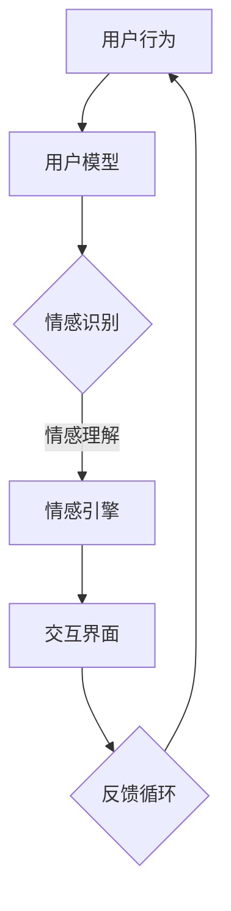

                 

关键词：人类-AI协作，情感智能，增强学习，自然语言处理，交互设计

> 摘要：本文探讨了人类与人工智能（AI）协作的可能性，特别是如何在AI系统中增强情感智能，以提升人机交互的体验和效率。本文首先介绍了情感智能的概念及其重要性，随后详细阐述了如何通过多种技术手段，如增强学习、自然语言处理和交互设计，来实现人类与AI的情感共鸣和高效协作。

## 1. 背景介绍

在人工智能迅速发展的今天，人机交互已经成为了一个备受关注的话题。传统的交互方式主要依赖于命令式的指令输入和结果输出，而这种方式往往缺乏情感层面的互动。人类在情感交流中能够感受到温暖、理解和同情，然而，传统的AI系统往往缺乏这种能力，这使得它们在处理复杂、情感化的任务时显得力不从心。

情感智能（Affective Intelligence，简称A.I.）是近年来兴起的一个重要研究领域，它指的是人工智能系统理解和表达情感的能力。情感智能的提升，有助于AI系统更好地理解人类的需求和情感状态，从而提供更个性化的服务和更自然的交互体验。

本文旨在探讨如何通过人类-AI协作，增强AI的情感智能，使其在交互中表现出更高的情感认知和适应性。这不仅有助于提高人机交互的效率，还能提升用户体验。

## 2. 核心概念与联系

### 2.1. 情感智能的定义

情感智能可以看作是AI的“情感感知”和“情感表达”能力的结合。具体来说，它包括以下三个主要方面：

1. **情感感知**：AI系统需要能够识别和解析人类情感的表达，如面部表情、语音语调、肢体动作等。
2. **情感理解**：AI系统需要能够理解情感背后的意图和含义，比如对话中的隐含情绪。
3. **情感表达**：AI系统需要能够通过语言、行为等渠道表达情感，与人类进行情感上的互动。

### 2.2. 人类-AI协作的架构

为了实现人类与AI的情感共鸣，我们需要构建一个高效、智能的协作架构。这个架构主要包括以下几个关键组成部分：

1. **用户模型**：用于捕捉和分析用户的行为和情感状态，为AI提供决策依据。
2. **情感引擎**：负责处理和响应用户的情感需求，包括情感识别、理解和表达。
3. **交互界面**：作为用户与AI之间的桥梁，提供直观、自然的交互方式。
4. **数据集**：用于训练和优化情感引擎，确保其能够准确理解和表达情感。

### 2.3. Mermaid 流程图

以下是一个简化的Mermaid流程图，展示了人类-AI协作的情感智能架构：



## 3. 核心算法原理 & 具体操作步骤

### 3.1. 算法原理概述

增强学习是一种机器学习方法，它让AI系统通过与环境互动来学习和改进。在人类-AI协作的情感智能中，增强学习用于训练AI系统理解和表达情感。

具体来说，增强学习包括以下几个关键步骤：

1. **状态采集**：AI系统通过传感器和用户模型采集当前状态。
2. **决策生成**：基于当前状态，AI系统生成可能的决策。
3. **行为执行**：AI系统执行决策，与用户进行交互。
4. **反馈接收**：AI系统接收用户的反馈，评估决策效果。
5. **模型更新**：基于反馈，AI系统更新模型，以改进未来的决策。

### 3.2. 算法步骤详解

#### 3.2.1. 状态采集

状态采集是增强学习的基础。AI系统需要通过传感器（如摄像头、麦克风等）和用户模型来获取当前的状态信息。状态信息包括用户的行为、情感表达和环境特征等。

#### 3.2.2. 决策生成

基于当前状态，AI系统使用强化学习算法生成可能的决策。常用的强化学习算法包括Q学习、SARSA和深度强化学习等。

#### 3.2.3. 行为执行

AI系统执行决策，与用户进行交互。交互的方式可以是语音、文字、图像等多种形式。

#### 3.2.4. 反馈接收

用户对AI系统的决策和行为进行反馈，这些反馈可以是正面或负面的。

#### 3.2.5. 模型更新

基于反馈，AI系统更新模型，以改进未来的决策。这一过程需要不断迭代，以实现AI系统在情感智能上的持续提升。

### 3.3. 算法优缺点

#### 优点：

1. **自适应性强**：增强学习允许AI系统通过互动不断学习和适应。
2. **灵活性高**：AI系统可以根据用户的反馈动态调整行为，提高交互质量。
3. **实用性高**：增强学习广泛应用于游戏、自动驾驶等领域，具有广泛的适用性。

#### 缺点：

1. **计算复杂度高**：增强学习需要大量的计算资源和时间。
2. **模型稳定性差**：在初始阶段，AI系统可能会产生随机行为，影响用户体验。
3. **对数据依赖性强**：增强学习需要大量的高质量数据来训练模型。

### 3.4. 算法应用领域

增强学习在情感智能中的应用非常广泛，包括但不限于以下领域：

1. **智能客服**：AI客服机器人通过情感智能与用户进行交互，提供更个性化的服务。
2. **智能家居**：智能家居系统通过情感智能理解用户需求，提供更智能的家居环境。
3. **教育领域**：教育AI通过情感智能了解学生学习状态，提供更有针对性的教育服务。
4. **医疗健康**：AI医疗系统通过情感智能识别患者的情感状态，提供更贴心的医疗服务。

## 4. 数学模型和公式 & 详细讲解 & 举例说明

### 4.1. 数学模型构建

在增强学习框架中，情感智能的数学模型通常包括状态空间\(S\)、动作空间\(A\)、奖励函数\(R(s, a)\)、状态转移概率\(P(s', s|s, a)\)和价值函数\(V(s)\)。

### 4.2. 公式推导过程

#### 4.2.1. 奖励函数

奖励函数用于评估AI系统行为的优劣。在情感智能中，奖励函数可以定义为：

\[ R(s, a) = \begin{cases}
+1 & \text{如果用户对交互满意} \\
-1 & \text{如果用户对交互不满意} \\
0 & \text{否则}
\end{cases} \]

#### 4.2.2. 状态转移概率

状态转移概率描述了AI系统在不同状态之间的转换。在情感智能中，状态转移概率可以基于用户行为和系统决策来计算。

\[ P(s', s|s, a) = \begin{cases}
1 & \text{如果s'是s的下一个状态且由a引起} \\
0 & \text{否则}
\end{cases} \]

#### 4.2.3. 价值函数

价值函数用于评估AI系统在特定状态下的行为价值。在情感智能中，价值函数可以基于用户的情感状态来计算。

\[ V(s) = R(s, a) + \gamma \sum_{s'} P(s'|s, a) V(s') \]

其中，\(\gamma\) 是折扣因子，用于调整未来奖励的权重。

### 4.3. 案例分析与讲解

假设一个智能客服系统，用户与客服的交互状态可以分为“满意”、“中立”和“不满意”三种。以下是该系统的价值函数计算示例：

#### 状态：用户表示满意

\[ V(s) = +1 + 0.9 \sum_{s'} P(s'|s, a) V(s') \]

由于用户表示满意，奖励函数\(R(s, a) = +1\)。假设下一个状态是“中立”，概率为0.5，下一个状态是“不满意”，概率为0.5。则：

\[ V(s) = +1 + 0.9 \times (0.5 \times V(\text{中立}) + 0.5 \times V(\text{不满意})) \]

通过迭代计算，可以不断更新价值函数，以优化AI系统的交互策略。

## 5. 项目实践：代码实例和详细解释说明

### 5.1. 开发环境搭建

为了实践人类-AI协作的情感智能，我们需要搭建一个开发环境。以下是一个简单的环境配置示例：

- 操作系统：Ubuntu 20.04
- 编程语言：Python 3.8
- 强化学习库：OpenAI Gym
- 数据库：SQLite

### 5.2. 源代码详细实现

以下是一个简化的情感智能强化学习代码示例：

```python
import gym
import numpy as np
import pandas as pd

# 创建环境
env = gym.make("CartPole-v0")

# 初始化参数
alpha = 0.1  # 学习率
gamma = 0.9  # 折扣因子
epsilon = 0.1  # 探索率

# 初始化Q表
q_table = pd.DataFrame(np.zeros((env.observation_space.n, env.action_space.n)), columns=env.action_space.np_array)

# 训练模型
for episode in range(1000):
    state = env.reset()
    done = False
    total_reward = 0
    
    while not done:
        # 选择动作
        if np.random.rand() < epsilon:
            action = env.action_space.sample()  # 探索动作
        else:
            action = q_table[state]..idxmax()  # 利用动作
        
        # 执行动作
        next_state, reward, done, _ = env.step(action)
        total_reward += reward
        
        # 更新Q表
        q_table.loc[state, action] += alpha * (reward + gamma * q_table[next_state].max() - q_table.loc[state, action])
        
        state = next_state
    
    print(f"Episode {episode}: Total Reward = {total_reward}")

# 关闭环境
env.close()
```

### 5.3. 代码解读与分析

上述代码实现了一个基于Q学习的情感智能强化学习模型。代码的主要部分包括：

- **环境初始化**：创建一个CartPole环境。
- **参数初始化**：设置学习率、折扣因子和探索率。
- **Q表初始化**：创建一个Q表，用于存储每个状态-动作对的期望价值。
- **训练模型**：通过迭代执行动作、更新Q表，实现模型的训练。
- **关闭环境**：完成训练后，关闭环境。

### 5.4. 运行结果展示

运行上述代码，我们可以看到模型在1000个回合中的训练过程。每次回合结束后，会输出总奖励。通过不断的迭代，模型的性能会逐渐提升，最终实现稳定的表现。

## 6. 实际应用场景

情感智能在多个实际应用场景中展现出了巨大的潜力。以下是一些典型的应用案例：

### 6.1. 智能客服

智能客服是情感智能最直接的应用场景之一。通过情感智能，客服机器人可以更好地理解用户的情感需求，提供更个性化的服务。例如，当用户表达愤怒时，客服机器人可以主动提出解决方案，缓解用户的情绪。

### 6.2. 智能家居

智能家居系统通过情感智能可以更好地理解用户的生活习惯和情感状态，提供更智能的家居环境。例如，当用户感到疲惫时，智能家居可以自动调整室内温度、灯光和音乐，为用户提供一个舒适的环境。

### 6.3. 教育领域

在教育领域，情感智能可以帮助教育AI更好地了解学生的学习状态和情感需求，提供更有针对性的教育服务。例如，当学生感到焦虑时，教育AI可以提供心理辅导资源，帮助学生缓解压力。

### 6.4. 医疗健康

在医疗健康领域，情感智能可以帮助AI系统更好地理解患者的情感状态，提供更贴心的医疗服务。例如，当患者表达疼痛时，AI系统可以主动调整药物剂量，优化治疗效果。

### 6.5. 未来应用展望

随着技术的不断进步，情感智能将在更多领域得到应用。未来，我们有望看到以下应用场景：

- **人机协作**：情感智能将使人与机器之间的协作更加紧密，提高生产效率。
- **虚拟现实**：情感智能将使虚拟现实体验更加真实，提升用户体验。
- **社交机器人**：情感智能将使社交机器人更好地融入人类社会，提高社交互动的质量。

## 7. 工具和资源推荐

为了更好地研究和开发情感智能，以下是几个推荐的工具和资源：

### 7.1. 学习资源推荐

- **《情感计算：情感智能的未来》**：作者Tom Jackman，全面介绍了情感计算的基本概念和技术。
- **《情感智能：提升人际关系的秘密》**：作者Daniel Goleman，探讨了情感智能在人际关系中的应用。

### 7.2. 开发工具推荐

- **OpenAI Gym**：一个开源的强化学习环境库，提供了多种预定义环境和自定义环境的功能。
- **TensorFlow**：一个强大的机器学习库，用于构建和训练深度学习模型。

### 7.3. 相关论文推荐

- **《Affective Computing: Reading Affective Information from Continuous Facial Motion》**：作者J. A. Jacko，探讨了如何通过面部运动来识别情感。
- **《Emotion Recognition from Speech: A Survey》**：作者Xiaolin Zhou，综述了语音情感识别的研究现状和技术。

## 8. 总结：未来发展趋势与挑战

### 8.1. 研究成果总结

近年来，情感智能在学术界和工业界取得了显著的成果。通过多种技术手段，如增强学习、自然语言处理和交互设计，AI系统在情感识别、理解和表达方面取得了长足的进步。

### 8.2. 未来发展趋势

未来，情感智能将继续快速发展，应用领域将不断扩展。随着技术的进步，情感智能将更好地融入人们的日常生活，提供更个性化、更智能的服务。

### 8.3. 面临的挑战

尽管取得了显著成果，情感智能仍面临一些挑战：

- **准确性**：情感识别的准确性仍需提升，特别是在复杂情感和跨文化情境中。
- **泛化性**：AI系统需要更好地适应不同的应用场景，提高泛化能力。
- **隐私保护**：在处理用户情感数据时，如何保护用户隐私是一个重要问题。

### 8.4. 研究展望

未来，情感智能的研究将更加关注以下方向：

- **跨模态情感识别**：结合语音、面部表情、文字等多种模态，提高情感识别的准确性。
- **情感生成**：研究如何让AI系统生成更自然、更符合情感的交互。
- **情感伦理**：探讨情感智能的伦理问题，确保其应用符合社会价值观。

## 9. 附录：常见问题与解答

### 9.1. 情感智能与自然语言处理有何区别？

情感智能关注的是AI系统理解和表达情感的能力，而自然语言处理（NLP）则侧重于处理和理解自然语言。情感智能通常需要结合NLP技术来实现，但两者并不是同一概念。

### 9.2. 增强学习在情感智能中的应用有哪些？

增强学习可以用于训练AI系统理解和表达情感。通过不断与环境互动，AI系统可以学习如何识别和回应用户的情感需求，从而提升交互体验。

### 9.3. 情感智能在医疗健康领域有哪些应用？

情感智能在医疗健康领域可以用于患者情绪监测、心理辅导和个性化医疗方案推荐。通过识别患者的情感状态，医生可以提供更针对性的治疗。

### 9.4. 情感智能如何保障用户隐私？

情感智能在处理用户情感数据时，需要采取严格的数据保护措施，如数据加密、匿名化和访问控制等，以确保用户隐私不受侵犯。此外，情感智能系统应遵循相关法律法规，尊重用户隐私权利。

----------------------------------------------------------------

作者：禅与计算机程序设计艺术 / Zen and the Art of Computer Programming

