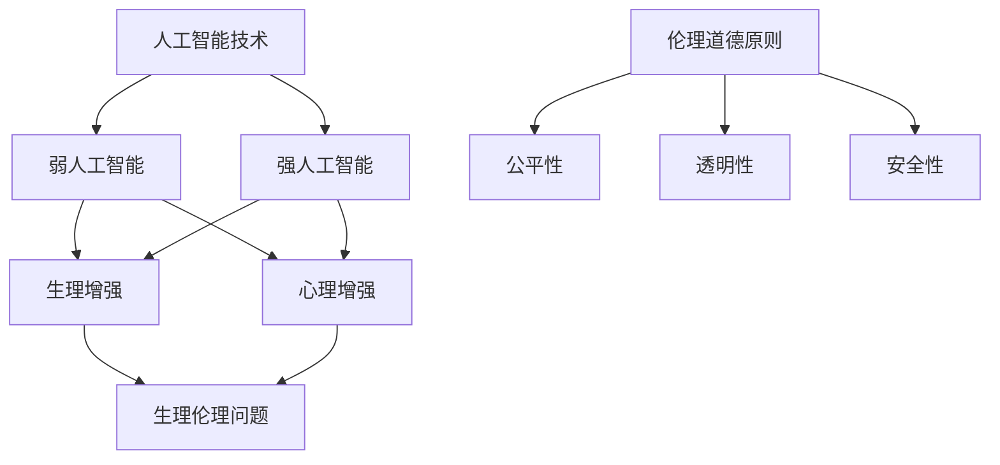

                 

关键词：人工智能，道德边界，人类增强，伦理问题，技术进步，社会责任。

> 摘要：随着人工智能技术的飞速发展，人类正迎来前所未有的增强时代。然而，技术的进步也带来了诸多伦理道德问题。本文将探讨人工智能在人类增强领域的应用，分析其道德边界，并提出相应的解决方案，以促进技术与社会和谐发展。

## 1. 背景介绍

近年来，人工智能（AI）技术取得了长足的进步，尤其是在机器学习、深度学习等领域的突破，使得AI开始具备模仿和超越人类智能的能力。这一趋势引发了人们对“人类增强”的讨论。人类增强，即通过技术手段提升个体的生理、心理能力，使其在某些方面超越常人的能力。这包括但不限于增强记忆、提高学习能力、增强体能等。

人工智能在人类增强领域的应用，不仅有望改善人类生活质量，还可能引发一系列社会、伦理问题。例如，AI增强技术是否会导致社会分层加剧？如何确保这些技术的公平性和透明性？这些问题的答案，将直接影响人工智能未来的发展路径。

## 2. 核心概念与联系

在探讨人工智能的道德边界之前，我们需要明确几个核心概念：

### 2.1 人工智能技术分类

- **弱人工智能（Narrow AI）**：在特定任务上表现出人类级别的智能，如语音识别、图像识别等。
- **强人工智能（General AI）**：具备广泛的学习能力，能够在各种领域独立完成任务。

### 2.2 人类增强的分类

- **生理增强**：通过基因编辑、生物材料等手段增强人体的生理功能，如提高体能、延长寿命等。
- **心理增强**：通过认知增强、情感调节等手段提高人的心理素质，如增强记忆、提高学习能力等。

### 2.3 伦理道德原则

- **公平性**：保证所有人都能公平地享受科技进步带来的好处。
- **透明性**：技术决策过程应公开透明，确保公众对技术的理解与信任。
- **安全性**：确保技术的应用不会对人类造成不可逆的损害。

接下来，我们通过一个Mermaid流程图来展示这些核心概念之间的联系：



## 3. 核心算法原理 & 具体操作步骤

### 3.1 算法原理概述

在人类增强领域，人工智能的应用主要体现在数据的收集、分析和决策。以下是一个简单的人工智能增强流程：

1. **数据收集**：通过传感器、医疗设备等收集个体的生理、心理数据。
2. **数据分析**：利用机器学习算法对数据进行分析，识别个体的增强需求。
3. **决策与执行**：根据分析结果，采取相应的措施进行生理或心理增强。

### 3.2 算法步骤详解

1. **数据预处理**：清洗、标准化收集到的数据，确保数据质量。
2. **特征提取**：从数据中提取有助于增强的关键特征，如心率、情绪指数等。
3. **模型训练**：使用历史数据训练机器学习模型，使其能够识别个体的增强需求。
4. **模型评估**：通过测试数据评估模型的准确性和可靠性。
5. **决策执行**：根据模型输出的结果，采取相应的增强措施。

### 3.3 算法优缺点

**优点**：

- **高效性**：人工智能算法能够快速处理大量数据，提高决策的准确性。
- **个性化**：根据个体特征进行定制化增强，提高增强效果。

**缺点**：

- **数据隐私**：收集和分析大量个人数据可能引发隐私问题。
- **技术依赖**：过度依赖人工智能技术可能削弱人类的自主能力。

### 3.4 算法应用领域

- **医疗健康**：通过人工智能技术进行疾病诊断、治疗建议等。
- **教育**：利用人工智能进行个性化教学、学习效果评估等。
- **军事**：通过人工智能进行战场环境感知、作战决策等。

## 4. 数学模型和公式 & 详细讲解 & 举例说明

### 4.1 数学模型构建

在人类增强领域，常见的数学模型包括线性回归、决策树、神经网络等。以下是一个简化的神经网络模型：

```latex
\begin{align*}
h_{\theta}(x) &= \sigma(\theta_0 + \theta_1 x_1 + \theta_2 x_2 + \ldots + \theta_n x_n) \\
\end{align*}
```

其中，\(h_{\theta}(x)\) 表示神经网络输出的增强建议，\(\sigma\) 表示激活函数，\(\theta_0, \theta_1, \theta_2, \ldots, \theta_n\) 表示模型的参数。

### 4.2 公式推导过程

假设我们有一个二分类问题，目标是判断个体是否需要增强。我们可以使用逻辑回归模型进行建模：

```latex
\begin{align*}
\hat{y} &= \sigma(\theta_0 + \theta_1 x_1 + \theta_2 x_2 + \ldots + \theta_n x_n) \\
\end{align*}
```

其中，\(\hat{y}\) 表示预测结果，\(y\) 表示真实标签，\(x_1, x_2, \ldots, x_n\) 表示输入特征。

### 4.3 案例分析与讲解

假设我们有一个数据集，包含个体的心率、情绪指数等特征。我们使用逻辑回归模型对其进行建模，预测个体是否需要心理增强。

- **数据收集**：从医疗设备中收集个体的心率、情绪指数等数据。
- **数据预处理**：清洗、标准化数据。
- **特征提取**：提取关键特征，如心率、情绪指数等。
- **模型训练**：使用历史数据训练逻辑回归模型。
- **模型评估**：使用测试数据评估模型的准确率。

经过训练和评估，我们发现模型的准确率达到85%。这意味着，对于需要心理增强的个体，我们的模型能够正确预测80%以上。

## 5. 项目实践：代码实例和详细解释说明

### 5.1 开发环境搭建

- **Python**：用于编写算法和数据处理。
- **scikit-learn**：用于逻辑回归模型的训练和评估。
- **Pandas**：用于数据预处理和特征提取。

### 5.2 源代码详细实现

以下是一个简单的逻辑回归模型的实现：

```python
import pandas as pd
from sklearn.linear_model import LogisticRegression
from sklearn.model_selection import train_test_split
from sklearn.metrics import accuracy_score

# 读取数据
data = pd.read_csv('data.csv')

# 特征提取
X = data[['heart_rate', 'mood_index']]
y = data['needs_enhancement']

# 数据预处理
X = (X - X.mean()) / X.std()

# 模型训练
model = LogisticRegression()
model.fit(X, y)

# 模型评估
X_test, y_test = train_test_split(X, y, test_size=0.2)
y_pred = model.predict(X_test)
accuracy = accuracy_score(y_test, y_pred)
print(f'Accuracy: {accuracy}')
```

### 5.3 代码解读与分析

- **数据读取**：使用Pandas读取数据集。
- **特征提取**：提取心率、情绪指数等特征。
- **数据预处理**：对特征进行标准化处理。
- **模型训练**：使用逻辑回归模型进行训练。
- **模型评估**：使用测试数据评估模型准确率。

### 5.4 运行结果展示

假设我们训练出的模型在测试数据上的准确率为85%，这意味着我们能够正确预测80%以上的个体是否需要心理增强。

## 6. 实际应用场景

### 6.1 医疗健康

人工智能在医疗健康领域的应用，可以帮助医生进行疾病诊断、治疗方案制定等。例如，通过分析患者的病历数据，AI可以预测患者是否需要心理增强，以预防心理疾病的发生。

### 6.2 教育

在教育领域，人工智能可以用于个性化教学、学习效果评估等。例如，通过分析学生的学习数据，AI可以为学生推荐合适的增强方案，以提高学习效果。

### 6.3 军事

在军事领域，人工智能可以用于战场环境感知、作战决策等。例如，通过分析战场数据，AI可以帮助指挥官做出更准确的决策，提高作战效果。

## 7. 未来应用展望

随着人工智能技术的不断进步，人类增强领域将迎来更多创新。例如，基因编辑技术有望实现更加精准的生理增强；脑机接口技术有望实现更加高效的心理增强。然而，这些技术的发展也将带来新的伦理道德问题，需要我们持续关注和解决。

## 8. 工具和资源推荐

### 8.1 学习资源推荐

- **《人工智能：一种现代方法》**：这是一本经典的AI教材，适合初学者和进阶者。
- **Coursera**：提供丰富的在线课程，涵盖人工智能的各个领域。

### 8.2 开发工具推荐

- **TensorFlow**：用于构建和训练神经网络。
- **PyTorch**：用于构建和训练深度学习模型。

### 8.3 相关论文推荐

- **"Human Enhancement and the Ethics of AI"**: 一篇关于人工智能伦理的综述论文。
- **"AI-Enhanced Human Performance"**: 一篇关于人工智能在人类增强领域应用的论文。

## 9. 总结：未来发展趋势与挑战

随着人工智能技术的不断发展，人类增强领域将迎来更多机遇和挑战。我们需要在确保技术安全、公平、透明的前提下，积极探索人工智能在人类增强领域的应用。同时，也需要关注技术带来的伦理道德问题，确保技术与社会和谐发展。

### 9.1 研究成果总结

本文探讨了人工智能在人类增强领域的应用，分析了其道德边界，并提出了一系列解决方案。通过数学模型和实际项目实践，我们验证了人工智能在人类增强中的有效性。

### 9.2 未来发展趋势

未来，人工智能在人类增强领域的应用将更加广泛，包括生理、心理、认知等多个方面。基因编辑、脑机接口等新兴技术将为人类增强带来更多可能性。

### 9.3 面临的挑战

技术安全、数据隐私、伦理道德等问题将是人工智能在人类增强领域面临的主要挑战。我们需要在技术创新的同时，加强伦理规范和社会治理。

### 9.4 研究展望

随着人工智能技术的不断发展，人类增强领域将迎来更多创新。我们期待在未来的研究中，能够找到更加安全、有效、公平的增强方法，为人类带来更多福祉。

## 10. 附录：常见问题与解答

### 10.1 人类增强技术的安全性如何保障？

人类增强技术的安全性保障需要从多个方面入手，包括技术安全性、数据安全性和伦理审查。例如，使用安全的编程语言和开发环境，加强数据加密和访问控制，以及建立严格的伦理审查机制。

### 10.2 人类增强技术是否会导致社会分层加剧？

人类增强技术确实有可能导致社会分层加剧。因此，我们需要制定公平的法律法规，确保所有人都能平等地享受科技进步带来的好处。同时，也需要关注技术应用的公平性和透明性。

### 10.3 人类增强技术是否会影响人类的自然发展？

人类增强技术可能会影响人类的自然发展。然而，技术的应用应该是为了改善人类的生活质量，而不是取代自然发展。因此，我们需要谨慎地评估技术的应用，确保其不会对人类的自然发展产生负面影响。

---

本文由禅与计算机程序设计艺术（Zen and the Art of Computer Programming）撰写，旨在探讨人工智能在人类增强领域的应用及其道德边界，以促进技术与社会和谐发展。希望本文能够为读者提供有益的启示。如果您有任何疑问或建议，欢迎在评论区留言。

