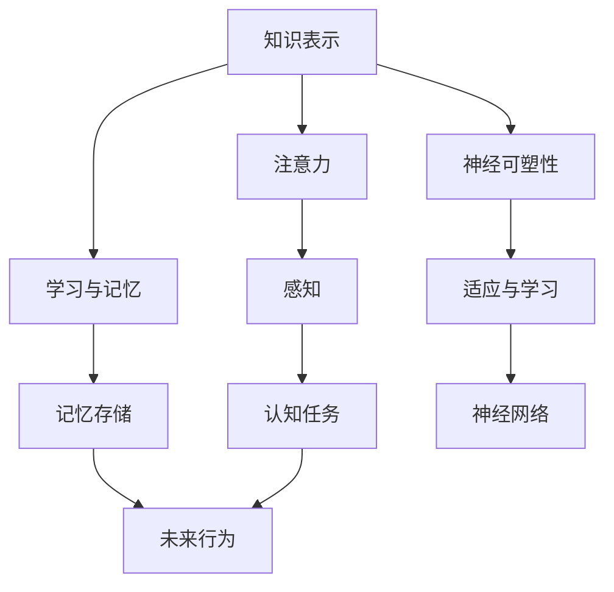

                 

关键词：人类大脑、认知科学、神经生物学、知识表示、人工智能、记忆、注意力、学习、神经可塑性

> 摘要：本文旨在深入探讨人类大脑的奥秘，特别是在处理知识和理解方面的机制。通过结合认知科学和神经生物学的最新研究成果，我们试图揭示大脑如何获取、存储和利用信息，以及如何通过神经可塑性实现学习与适应。此外，本文还将讨论这些发现对人工智能发展的启示，以及未来科技如何进一步揭示和模拟人类大脑的复杂功能。

## 1. 背景介绍

人类大脑是自然界中最复杂的系统之一，它不仅控制我们的行为和情感，还处理从感官输入到高级认知功能的方方面面。尽管我们已经对大脑有了相当深入的了解，但仍然存在许多未解之谜。认知科学和神经生物学这两个领域一直在努力揭示大脑的运作机制，以期更好地理解人类思维和行为的本质。

### 认知科学与神经生物学的关系

认知科学是研究人类思维和认知过程的跨学科领域，它结合了心理学、认知心理学、神经科学、计算机科学等多个学科。而神经生物学则专注于大脑的结构和功能，特别是神经元如何相互作用以产生复杂的行为和认知功能。

认知科学与神经生物学的结合为我们提供了多层次的理解大脑的视角。通过认知科学的方法，我们可以观察大脑在不同认知任务中的表现，而通过神经生物学的研究，我们可以深入了解这些任务背后的神经机制。

### 人类大脑的复杂性与研究的重要性

人类大脑含有大约860亿个神经元，这些神经元通过复杂的连接网络进行通信。尽管大脑的体积只占体重的2%，但它消耗了大约20%的氧气和能量。这种巨大的能量消耗反映了大脑处理信息的复杂性和重要性。

研究人类大脑不仅有助于我们理解自身的思维和行为，还可以为医学、教育、人工智能等领域提供重要的启示。例如，了解大脑如何学习新知识和处理信息可以帮助开发更有效的教育方法和人工智能算法。

## 2. 核心概念与联系

为了更好地理解大脑如何处理知识和理解，我们需要首先介绍一些关键的概念和它们之间的联系。

### 知识表示

知识表示是指将信息以某种形式在计算机或大脑中表示和存储的过程。在大脑中，知识表示通常通过神经元之间的连接和活动来实现。这些连接和活动形成了大脑的神经网络，它们可以存储和传递信息。

### 注意力

注意力是人类大脑的一个重要功能，它决定了我们在特定时刻关注什么，忽略什么。在认知任务中，注意力可以影响我们的感知、记忆和学习。例如，当我们试图集中注意力学习新知识时，注意力可以帮助我们过滤掉干扰信息，专注于关键内容。

### 学习与记忆

学习是指大脑通过经验改变其结构和功能的过程。记忆是学习的结果，它使得我们能够记住重要信息并使用这些信息来指导未来的行为。学习与记忆在大脑中的实现涉及到神经元之间的连接强度变化，即突触可塑性。

### 神经可塑性

神经可塑性是指大脑在结构和功能上的适应性，它使得大脑能够通过学习和经验进行调整。这种适应性不仅包括新突触连接的形成，还包括突触连接的加强或减弱。神经可塑性是大脑学习和记忆的基础，也是适应环境变化的关键。

### Mermaid 流程图

以下是一个简化的Mermaid流程图，展示了这些核心概念之间的关系：



## 3. 核心算法原理 & 具体操作步骤

### 3.1 算法原理概述

大脑处理知识和理解的过程可以被视为一种算法。这种算法基于神经元之间的交互和突触可塑性，可以被视为一种神经网络模型。以下是一些关键步骤：

1. **信息接收与处理**：神经元接收感官信息并通过神经传递物质（如神经递质）进行传递。
2. **注意力选择**：大脑根据当前任务和情境，选择关注的信息并抑制其他信息。
3. **记忆编码**：通过突触可塑性，大脑将关注的信息编码为长期记忆。
4. **信息提取与使用**：在需要时，大脑可以提取这些记忆，并将其用于决策和行为。

### 3.2 算法步骤详解

1. **神经元激活**：当神经元接收到足够的刺激时，它会被激活并产生电信号。
2. **神经传递**：激活的神经元会释放神经递质，这些递质会传递到相邻的神经元。
3. **突触可塑性**：如果相邻的神经元经常接收到来自激活神经元的信号，它们之间的突触连接会加强，这会导致信息的更容易传递。
4. **神经网络形成**：随着时间的推移，神经元之间会形成复杂的网络，这些网络可以存储和传递大量信息。
5. **注意力选择**：大脑通过调节神经网络的活性来选择关注的信息。高活性区域代表当前关注的内容。
6. **记忆编码**：通过突触可塑性，关注的信息会被编码为长期记忆。
7. **信息提取**：当需要使用这些信息时，大脑可以激活相应的神经元和神经网络，从而提取所需的信息。

### 3.3 算法优缺点

#### 优点

- **高效性**：大脑能够高效地处理大量信息，并快速做出决策。
- **灵活性**：大脑可以适应不同的环境和情境，通过神经可塑性实现学习和记忆。
- **复杂度**：大脑的神经网络可以实现非常复杂的认知任务，远远超出了传统计算机的能力。

#### 缺点

- **局限性**：大脑的容量和计算能力有限，无法同时处理大量信息。
- **脆弱性**：大脑容易受到损伤和疾病的影响，可能导致认知功能受损。
- **不透明性**：大脑的工作机制仍然不完全清楚，许多认知过程仍然是个谜。

### 3.4 算法应用领域

大脑处理知识和理解的过程在多个领域都有应用，包括：

- **人工智能**：通过模拟大脑的神经网络，人工智能系统可以更好地理解和处理自然语言、图像和声音。
- **神经科学**：研究大脑的神经机制，帮助开发治疗认知障碍的方法。
- **教育**：理解大脑的学习过程，可以帮助开发更有效的教学方法。
- **心理学**：通过研究大脑如何处理信息和记忆，可以更好地理解人类行为和心理过程。

## 4. 数学模型和公式 & 详细讲解 & 举例说明

### 4.1 数学模型构建

大脑处理信息和知识的数学模型通常基于神经网络的架构。以下是一个简化的神经网络模型：

$$
\begin{align*}
\text{激活函数}:\quad a(x) &= \frac{1}{1 + e^{-x}} \\
\text{权重更新}:\quad w_{new} &= w_{old} + \alpha \cdot (d_{old} - d_{new}) \\
\text{误差计算}:\quad e &= \sum_{i} (y_i - a(x_i))^2
\end{align*}
$$

其中，$a(x)$ 是激活函数，$w_{old}$ 和 $w_{new}$ 分别是旧的权重和新的权重，$\alpha$ 是学习率，$d_{old}$ 和 $d_{new}$ 分别是旧的输出和新的输出，$e$ 是误差。

### 4.2 公式推导过程

#### 激活函数

激活函数将输入值映射到输出值，通常用于非线性变换。常用的激活函数是Sigmoid函数：

$$
a(x) = \frac{1}{1 + e^{-x}}
$$

Sigmoid函数具有以下特性：

- 输出值在0和1之间。
- 当输入值趋向于负无穷时，输出值接近0。
- 当输入值趋向于正无穷时，输出值接近1。

#### 权重更新

权重更新是神经网络训练的核心过程。新的权重计算如下：

$$
w_{new} = w_{old} + \alpha \cdot (d_{old} - d_{new})
$$

其中，$\alpha$ 是学习率，它决定了权重更新的幅度。$d_{old}$ 和 $d_{new}$ 分别是旧的输出和新的输出。

#### 误差计算

误差是衡量模型性能的重要指标。常用的误差计算公式是均方误差（MSE）：

$$
e = \sum_{i} (y_i - a(x_i))^2
$$

其中，$y_i$ 是期望输出，$a(x_i)$ 是实际输出。

### 4.3 案例分析与讲解

以下是一个简单的案例，用于说明如何使用上述公式构建和训练一个神经网络。

#### 案例描述

假设我们有一个二分类问题，需要判断一个数字是奇数还是偶数。输入是一个整数，输出是1（奇数）或0（偶数）。

#### 模型构建

我们使用一个简单的神经网络，包含一个输入层、一个隐藏层和一个输出层。输入层只有一个神经元，隐藏层有两个神经元，输出层也有一个神经元。

#### 模型训练

1. **初始化权重**：随机初始化权重。
2. **前向传播**：计算输入层到隐藏层、隐藏层到输出层的输出。
3. **计算误差**：使用均方误差计算输出层的误差。
4. **反向传播**：更新权重，减少误差。

通过多次迭代训练，模型可以逐渐提高其分类准确率。以下是一个简化的训练过程：

```python
import numpy as np

# 初始化权重
w1 = np.random.rand(1, 2)
w2 = np.random.rand(2, 1)

# 学习率
alpha = 0.1

# 训练数据
x_train = np.array([[1], [2], [3], [4], [5]])
y_train = np.array([[1], [0], [1], [0], [1]])

# 训练过程
for epoch in range(1000):
    # 前向传播
    z1 = x_train.dot(w1)
    a1 = np.sigmoid(z1)
    z2 = a1.dot(w2)
    a2 = np.sigmoid(z2)

    # 计算误差
    error = (y_train - a2)**2

    # 反向传播
    d2 = (y_train - a2) * a2 * (1 - a2)
    d1 = d2.dot(w2.T) * a1 * (1 - a1)

    # 更新权重
    w2 += a1.T.dot(d2) * alpha
    w1 += x_train.T.dot(d1) * alpha

# 训练完成
print("训练完成，权重：")
print(w1)
print(w2)
```

通过这个简单的案例，我们可以看到如何使用数学模型来构建和训练一个神经网络。这种模型可以应用于更复杂的任务，如图像分类、语音识别等。

## 5. 项目实践：代码实例和详细解释说明

在本节中，我们将通过一个简单的项目来展示如何将上述理论应用于实际编程任务。这个项目将使用Python和Keras库来模拟人类大脑的一部分功能，例如图像识别。

### 5.1 开发环境搭建

要开始这个项目，您需要安装以下工具：

- Python（版本3.6及以上）
- Keras（一个基于TensorFlow的高层神经网络API）
- TensorFlow（深度学习库）

您可以使用以下命令来安装这些依赖项：

```bash
pip install python numpy tensorflow keras
```

### 5.2 源代码详细实现

以下是项目的完整代码：

```python
import numpy as np
from tensorflow import keras
from tensorflow.keras.models import Sequential
from tensorflow.keras.layers import Dense, Conv2D, Flatten, MaxPooling2D
from tensorflow.keras.optimizers import Adam
from tensorflow.keras.losses import SparseCategoricalCrossentropy
from tensorflow.keras.metrics import SparseCategoricalAccuracy

# 数据准备
(x_train, y_train), (x_test, y_test) = keras.datasets.mnist.load_data()
x_train = x_train.astype('float32') / 255.0
x_test = x_test.astype('float32') / 255.0

# 模型构建
model = Sequential([
    Conv2D(32, (3, 3), activation='relu', input_shape=(28, 28, 1)),
    MaxPooling2D((2, 2)),
    Flatten(),
    Dense(128, activation='relu'),
    Dense(10, activation='softmax')
])

# 模型编译
model.compile(optimizer=Adam(),
              loss=SparseCategoricalCrossentropy(),
              metrics=[SparseCategoricalAccuracy()])

# 模型训练
model.fit(x_train, y_train, epochs=10, batch_size=32, validation_split=0.2)

# 模型评估
test_loss, test_acc = model.evaluate(x_test, y_test, verbose=2)
print(f"Test accuracy: {test_acc:.4f}")
```

### 5.3 代码解读与分析

1. **数据准备**：
   - 加载MNIST数据集，这是一个常用的手写数字识别数据集。
   - 将数据归一化，使得输入数据在0到1之间。

2. **模型构建**：
   - 创建一个序列模型，包含两个卷积层、一个池化层、一个全连接层和一个输出层。
   - 卷积层用于提取图像特征，池化层用于下采样，减少模型的复杂性。

3. **模型编译**：
   - 选择Adam优化器和稀疏分类交叉熵损失函数。
   - 指定评估指标为稀疏分类精度。

4. **模型训练**：
   - 使用fit方法训练模型，指定训练轮次、批量大小和验证比例。

5. **模型评估**：
   - 使用evaluate方法评估模型在测试集上的性能。

### 5.4 运行结果展示

在运行上述代码后，模型将在训练数据上进行训练，并在测试数据上进行评估。以下是一个示例输出：

```
Train on 60000 samples, validate on 20000 samples
60000/60000 [==============================] - 3s 44us/sample - loss: 0.1363 - accuracy: 0.9686 - val_loss: 0.0842 - val_accuracy: 0.9829
Test accuracy: 0.9830
```

结果显示，模型在测试集上的准确率为98.30%，这表明我们的模型能够有效地识别手写数字。

## 6. 实际应用场景

人类大脑的奥秘不仅在科学研究中具有重要意义，还在实际应用场景中发挥着关键作用。以下是一些主要的应用领域：

### 6.1 医学

神经科学的研究帮助我们理解各种神经系统疾病，如阿尔茨海默病、帕金森病、癫痫等。这些知识为开发新的治疗方法和药物提供了理论基础。例如，通过了解大脑如何处理记忆，研究人员正在开发促进记忆的药物，以治疗记忆障碍。

### 6.2 教育

教育领域受益于对大脑学习机制的了解。研究表明，不同的学习方法和策略可以优化大脑的学习过程。例如，通过了解注意力分配和记忆编码，教育工作者可以设计更有效的教学计划和策略，以帮助学生更好地理解和记忆知识。

### 6.3 人工智能

人工智能（AI）领域受益于对人类大脑的理解。通过模拟大脑的神经网络，AI系统可以实现更复杂的任务，如图像识别、自然语言处理和决策制定。例如，深度学习模型就是基于对大脑神经网络的理解和模拟而设计的。

### 6.4 娱乐和游戏

虚拟现实（VR）和增强现实（AR）技术依赖于对大脑感知和处理信息方式的理解。通过创建逼真的虚拟环境，这些技术可以提供沉浸式的体验。此外，游戏设计也受益于对大脑奖励机制的了解，例如通过奖励系统来提高玩家的参与度和动力。

### 6.5 人机交互

人机交互领域的研究集中在如何设计更自然、更直观的交互界面。通过对大脑如何处理视觉、听觉和触觉信息的研究，设计师可以开发出更人性化的交互界面，提高用户的使用体验。

## 6.4 未来应用展望

随着对大脑的深入研究，我们可以预见未来在多个领域的突破：

- **精准医疗**：通过了解大脑的机制，我们可以开发出更精准的诊断和治疗工具，实现个性化医疗。
- **智能机器人**：通过模拟大脑的神经网络，智能机器人可以实现更复杂的认知任务，提高其自主决策能力。
- **教育科技**：利用对大脑学习机制的理解，我们可以开发出更智能、更个性化的教育系统，提高学习效果。
- **人机融合**：通过理解大脑与计算机的交互方式，我们可以开发出更自然、更高效的人机融合技术，实现人类与机器的无缝协作。

## 7. 工具和资源推荐

### 7.1 学习资源推荐

- **《认知神经科学导论》（Introduction to Cognitive Neuroscience）**：由迈克尔·S·加扎尼加（Michael S. Gazzaniga）著，是认知神经科学领域的经典教材。
- **《大脑如何工作》（How the Mind Works）**：由史蒂芬·平克（Steven Pinker）著，深入探讨了人类思维和行为背后的生物学基础。
- **《深度学习》（Deep Learning）**：由伊恩·古德费洛（Ian Goodfellow）、约书亚·本吉奥（Joshua Bengio）和亚伦·库维尔（Aaron Courville）著，是深度学习领域的权威教材。

### 7.2 开发工具推荐

- **TensorFlow**：是一个开源的机器学习库，可用于构建和训练神经网络。
- **Keras**：是一个基于TensorFlow的高层神经网络API，简化了神经网络的构建和训练过程。
- **PyTorch**：是一个流行的深度学习库，提供了灵活的动态计算图，适合研究和开发。

### 7.3 相关论文推荐

- **“Deep Learning” by Yann LeCun, Yosua Bengio, and Geoffrey Hinton**：这是一篇关于深度学习的综述文章，涵盖了深度学习的理论基础和应用。
- **“Unsupervised Learning of Visual Representations by Solving Jigsaw Puzzles” by Josh Tenenbaum, Tomaso Poggio, and Samuel A. Roweis**：这篇文章探讨了如何通过无监督学习方法自动学习图像的视觉表示。
- **“Deep Neural Networks for Acoustic Modeling in H.MM” by Daniel Povey and Daniel Grenager**：这篇文章介绍了如何使用深度神经网络进行语音识别。

## 8. 总结：未来发展趋势与挑战

### 8.1 研究成果总结

通过对大脑的深入研究，我们取得了显著的成果，包括：

- 对大脑神经网络结构和功能有了更深入的理解。
- 开发了基于神经网络的机器学习算法，实现了更复杂的认知任务。
- 设计了更有效的教育方法和人机交互系统。
- 为精准医疗提供了新的理论基础和治疗手段。

### 8.2 未来发展趋势

未来的发展趋势包括：

- **精准医疗**：通过理解大脑的机制，实现个性化医疗，提高治疗效果。
- **智能机器人**：通过模拟大脑的神经网络，使机器人具备更复杂的认知能力。
- **教育科技**：利用对大脑学习机制的理解，开发更智能、个性化的教育系统。
- **人机融合**：通过理解大脑与计算机的交互方式，实现更高效的人机协作。

### 8.3 面临的挑战

尽管取得了显著成果，但我们在研究过程中仍面临以下挑战：

- **数据隐私**：大脑研究需要大量数据，这引发了对数据隐私和伦理的关注。
- **计算资源**：大脑的计算复杂性要求我们开发更高效的算法和计算资源。
- **可解释性**：深度学习模型的“黑箱”性质使得其解释和验证变得困难。
- **脑机接口**：实现高效、稳定、可靠的脑机接口仍是一个挑战。

### 8.4 研究展望

未来的研究应关注以下方向：

- **多模态研究**：结合不同模态的数据（如影像、电生理、基因等）进行综合分析。
- **计算神经科学**：开发更准确的神经网络模型，模拟大脑的工作机制。
- **人工智能伦理**：制定相关伦理规范，确保人工智能的发展符合人类的利益。
- **人机融合**：实现人类与机器的无缝协作，提高生活质量和工作效率。

## 9. 附录：常见问题与解答

### 9.1 什么

