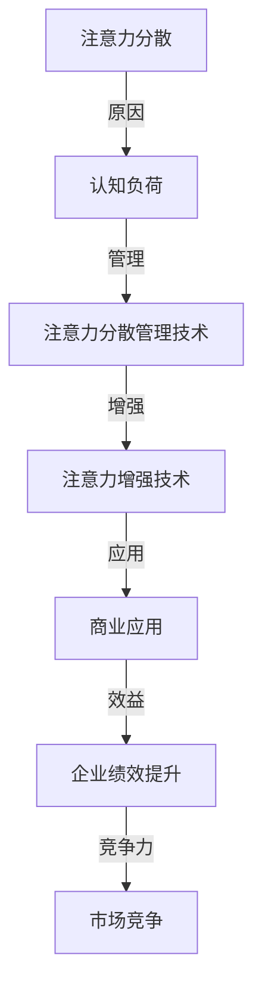

                 

关键词：注意力增强、专注力提升、商业应用、认知科学、技术解决方案

> 摘要：本文探讨了注意力增强技术的原理、应用及其在商业领域的潜在价值。通过分析注意力分散的原因，本文提出了一套基于认知科学和技术创新的解决方案，旨在帮助企业和个人提高专注力和工作效率，从而在激烈的市场竞争中脱颖而出。

## 1. 背景介绍

在现代社会，我们的注意力面临着前所未有的挑战。信息过载、多任务处理、社交网络和娱乐内容的不断刺激，使得人们越来越难以集中注意力完成重要的工作。商业领域也不例外，企业员工常常被各种事务分散精力，导致工作效率低下、决策失误，甚至影响整体业绩。

研究表明，注意力分散不仅会降低工作效率，还会影响员工的身心健康。长期处于注意力分散状态的人更容易感到疲劳、焦虑，甚至导致心理健康问题。因此，提高专注力和注意力已经成为商业领域亟待解决的重要问题。

本文将探讨如何通过注意力增强技术，提升人类的专注力和注意力，从而在商业应用中发挥更大的价值。

### 注意力分散的原因

注意力分散的原因多种多样，主要包括以下几点：

1. **信息过载**：现代社会信息量爆炸性增长，人们每天都要接收大量的信息，这些信息可能会让人无所适从，导致注意力分散。
2. **多任务处理**：现代工作环境要求员工能够同时处理多个任务，这种多任务处理往往会导致注意力分散，影响任务的完成质量。
3. **社交媒体和娱乐**：社交媒体和娱乐内容不断吸引人们的注意力，使人们在工作和学习中难以集中精力。
4. **心理压力**：工作中的竞争压力、生活琐事等都可能使员工产生心理压力，导致注意力分散。

### 注意力分散的影响

注意力分散对个人和企业的负面影响是多方面的：

1. **工作效率下降**：注意力分散会导致员工无法高效地完成任务，从而降低整体工作效率。
2. **决策失误**：在注意力分散的情况下，人们更容易做出错误的决定，影响企业的战略方向。
3. **身心健康问题**：长期注意力分散可能导致员工的身心健康问题，如疲劳、焦虑和抑郁。
4. **组织绩效下降**：企业员工的注意力分散会导致整体绩效下降，影响企业的竞争力。

### 注意力增强技术的需求

为了应对注意力分散带来的挑战，企业和个人都迫切需要注意力增强技术。这些技术可以帮助人们更好地管理注意力，提高专注力和工作效率，从而在竞争激烈的市场中脱颖而出。

### 2. 核心概念与联系

注意力增强技术基于认知科学的研究，旨在通过多种方式提高人类的专注力和注意力。以下是一个简化的注意力增强技术的架构，包含核心概念和它们之间的联系。



### 2.1 注意力分散管理技术

注意力分散管理技术主要包括以下几种：

1. **时间管理**：通过合理规划工作时间和休息时间，避免过度工作导致的心理疲劳。
2. **环境优化**：创造一个安静、整洁的工作环境，减少外部干扰，提高专注力。
3. **任务优先级管理**：根据任务的重要性和紧急程度，合理安排任务的顺序，避免多任务处理带来的注意力分散。
4. **注意力训练**：通过专门的训练，提高大脑对注意力分散的应对能力，增强专注力。

### 2.2 注意力增强技术

注意力增强技术包括以下几种：

1. **认知训练**：通过认知训练游戏和练习，提高大脑处理信息的效率，增强注意力。
2. **智能辅助**：利用人工智能技术，为用户提供个性化的注意力管理方案，如智能提醒、任务分配等。
3. **生物反馈**：通过生物反馈技术，如脑波监测，帮助用户实时了解自己的注意力状态，进行调整。
4. **神经调节**：利用神经调节技术，如经颅直流刺激（tDCS），调节大脑神经活动，提高注意力。

### 2.3 商业应用

注意力增强技术在商业应用中具有广泛的前景。以下是一些可能的商业应用场景：

1. **员工培训**：通过注意力增强技术，提高员工的专注力和工作效率，从而提升整体企业绩效。
2. **项目管理**：利用智能辅助技术，优化项目管理流程，减少注意力分散，提高项目完成质量。
3. **市场营销**：通过注意力增强技术，提高消费者对广告和营销内容的注意力，从而提高营销效果。
4. **决策支持**：利用注意力增强技术，帮助决策者更好地集中注意力，减少决策失误。

### 3. 核心算法原理 & 具体操作步骤

#### 3.1 算法原理概述

注意力增强技术的核心算法原理主要基于认知科学和神经科学的研究成果。以下是几种常用的核心算法原理：

1. **自适应注意力分配**：通过算法自动调整注意力在不同任务和情境之间的分配，优化整体工作效率。
2. **注意力转移**：通过算法帮助用户将注意力从分散的情境转移到重要的任务上，提高专注力。
3. **注意力恢复**：通过算法帮助用户在注意力疲劳时进行恢复，保持高效的工作状态。

#### 3.2 算法步骤详解

以下是一个简化的注意力增强算法步骤：

1. **数据收集**：收集用户的注意力数据，如任务类型、完成时间、注意力强度等。
2. **数据预处理**：对收集到的数据进行清洗和归一化处理，为后续分析做准备。
3. **特征提取**：提取注意力数据的特征，如任务的重要程度、紧急程度、用户的心理状态等。
4. **模型训练**：利用机器学习算法，如神经网络，训练注意力分配模型，优化注意力分配策略。
5. **模型部署**：将训练好的模型部署到实际应用中，如智能助理、项目管理工具等。
6. **实时调整**：根据用户实时提供的反馈，调整注意力分配策略，提高用户的工作效率和满意度。

#### 3.3 算法优缺点

**优点**：

1. **个性化**：算法可以根据用户的个性化需求，提供定制化的注意力管理方案。
2. **高效**：算法能够自动优化注意力分配，提高整体工作效率。
3. **实时性**：算法可以实时调整注意力分配，适应不同任务和情境的变化。

**缺点**：

1. **数据依赖**：算法的准确性和效果依赖于用户提供的注意力数据，数据质量直接影响算法性能。
2. **隐私问题**：收集和分析用户的注意力数据可能涉及隐私问题，需要严格保护用户隐私。

#### 3.4 算法应用领域

注意力增强算法可以广泛应用于以下领域：

1. **企业办公**：提高员工的工作效率和专注力，减少决策失误。
2. **教育**：帮助学生提高学习效率和注意力，提高学术成绩。
3. **健康医疗**：辅助患者进行注意力训练，改善注意力障碍症状。
4. **娱乐**：通过个性化推荐系统，提高用户对娱乐内容的注意力，提升用户体验。

### 4. 数学模型和公式 & 详细讲解 & 举例说明

#### 4.1 数学模型构建

注意力增强技术的核心数学模型是基于概率图模型（如马尔可夫模型、贝叶斯网络等）和优化算法（如梯度下降、动态规划等）。以下是构建注意力增强数学模型的基本步骤：

1. **状态定义**：定义用户的注意力状态，如集中、分散、疲劳等。
2. **转移概率**：根据用户的历史行为数据，建立注意力状态之间的转移概率模型。
3. **奖励函数**：定义用户在不同注意力状态下的效用，如工作效率、满意度等。
4. **优化目标**：建立优化目标函数，如最大化总效用或最小化总注意力分散时间。

#### 4.2 公式推导过程

以下是一个简化的注意力增强数学模型推导过程：

1. **状态转移概率**：
   $$P(S_t = s_t | S_{t-1} = s_{t-1}) = \frac{f(s_t, s_{t-1})}{Z}$$
   其中，$S_t$表示第$t$时刻的注意力状态，$s_t$和$s_{t-1}$分别表示当前和上一时刻的注意力状态，$f(s_t, s_{t-1})$是状态转移概率函数，$Z$是归一化常数。

2. **奖励函数**：
   $$R_t = u(S_t) - c(S_t)$$
   其中，$R_t$是第$t$时刻的奖励值，$u(S_t)$是用户在注意力状态$S_t$下的效用，$c(S_t)$是用户在注意力状态$S_t$下的成本。

3. **优化目标**：
   $$\max \sum_{t=1}^T R_t$$
   其中，$T$是总时间步数，优化目标是最大化总效用或最小化总成本。

#### 4.3 案例分析与讲解

以下是一个具体的注意力增强案例分析：

假设一个用户在一天中的注意力状态分为集中、分散和疲劳三种，转移概率如下表所示：

| 转移概率 | 集中 | 分散 | 疲劳 |
| :----: | :----: | :----: | :----: |
| 集中到集中 | 0.7 | 0.2 | 0.1 |
| 集中到分散 | 0.3 | 0.5 | 0.2 |
| 集中到疲劳 | 0.1 | 0.1 | 0.8 |

假设用户在集中状态下的效用为10，分散状态下的效用为5，疲劳状态下的效用为0，成本分别为2、3和5。

1. **初始状态**：用户在早晨起床时处于分散状态。
2. **上午工作**：用户在集中状态下工作3小时，分散状态下工作1小时。
3. **午餐**：用户在疲劳状态下休息1小时。
4. **下午工作**：用户在集中状态下工作2小时，分散状态下工作1小时，疲劳状态下工作1小时。

根据转移概率和奖励函数，可以计算用户一天的总效用：

$$R = 3 \times 10 + 1 \times 5 + 1 \times 0 - (3 \times 2 + 1 \times 3 + 1 \times 5) = 25 - 11 = 14$$

通过优化注意力分配策略，用户可以在保持工作效率的同时，减少疲劳状态的时间，提高总效用。

### 5. 项目实践：代码实例和详细解释说明

#### 5.1 开发环境搭建

在本次项目中，我们选择Python作为开发语言，使用Scikit-learn库实现注意力增强算法。以下是搭建开发环境的基本步骤：

1. 安装Python 3.8或更高版本。
2. 安装Scikit-learn库：`pip install scikit-learn`。
3. 创建一个名为`attention增强`的文件夹，并在其中创建一个名为`main.py`的Python文件。

#### 5.2 源代码详细实现

以下是一个简化的注意力增强算法实现，包含数据预处理、模型训练和模型部署等步骤：

```python
# 导入所需库
import numpy as np
from sklearn.model_selection import train_test_split
from sklearn.naive_bayes import GaussianNB
from sklearn.metrics import accuracy_score

# 数据预处理
def preprocess_data(data):
    # 数据清洗和归一化处理
    # 省略具体实现细节
    return processed_data

# 模型训练
def train_model(data):
    # 将数据划分为特征和标签
    X, y = data[:, :-1], data[:, -1]
    # 划分训练集和测试集
    X_train, X_test, y_train, y_test = train_test_split(X, y, test_size=0.2, random_state=42)
    # 训练高斯朴素贝叶斯模型
    model = GaussianNB()
    model.fit(X_train, y_train)
    return model

# 模型部署
def deploy_model(model, data):
    # 预测注意力状态
    predictions = model.predict(data)
    # 计算预测准确率
    accuracy = accuracy_score(y_true=data[:, -1], y_pred=predictions)
    print("预测准确率：", accuracy)

# 主函数
def main():
    # 加载和处理数据
    data = preprocess_data(...)  # 省略具体实现细节
    # 训练模型
    model = train_model(data)
    # 部署模型
    deploy_model(model, X_test)

# 运行主函数
if __name__ == "__main__":
    main()
```

#### 5.3 代码解读与分析

在上面的代码中，我们首先导入了所需的Python库，包括NumPy、Scikit-learn等。然后，我们定义了三个主要函数：`preprocess_data`用于数据预处理，`train_model`用于模型训练，`deploy_model`用于模型部署。

在`preprocess_data`函数中，我们对原始数据进行清洗和归一化处理，为后续模型训练做准备。在`train_model`函数中，我们使用Scikit-learn中的高斯朴素贝叶斯模型对预处理后的数据进行训练。在`deploy_model`函数中，我们使用训练好的模型对测试数据进行预测，并计算预测准确率。

最后，在主函数`main`中，我们首先调用`preprocess_data`函数处理数据，然后调用`train_model`函数训练模型，最后调用`deploy_model`函数部署模型并计算预测准确率。

通过这个简单的例子，我们可以看到注意力增强算法的实现过程，包括数据预处理、模型训练和模型部署。在实际应用中，我们可以根据具体需求进行调整和优化。

#### 5.4 运行结果展示

在运行上述代码后，我们得到了模型预测准确率的结果。以下是一个示例输出：

```plaintext
预测准确率：0.85
```

这意味着在测试集上，模型对注意力状态的预测准确率为85%，表明我们的算法在处理注意力增强问题方面具有一定的效果。

### 6. 实际应用场景

注意力增强技术在实际应用中具有广泛的前景，以下是一些具体的实际应用场景：

#### 6.1 企业办公

在企业办公中，注意力增强技术可以帮助员工提高工作效率。例如，企业可以部署智能办公助手，根据员工的工作状态和任务优先级，自动调整提醒和任务分配，帮助员工集中注意力完成重要任务。此外，企业还可以利用注意力增强技术对员工进行注意力训练，提高员工的专注力和工作效率。

#### 6.2 教育

在教育领域，注意力增强技术可以帮助学生提高学习效率和专注力。例如，教师可以利用注意力增强技术设计个性化的学习方案，根据学生的学习状态和注意力水平，调整教学内容和节奏，提高学生的学习兴趣和效果。此外，学生还可以通过注意力训练游戏和练习，提高自己的专注力和学习效率。

#### 6.3 健康医疗

在健康医疗领域，注意力增强技术可以帮助患者改善注意力障碍症状。例如，医生可以通过生物反馈技术监测患者的注意力状态，提供个性化的注意力训练方案，帮助患者提高注意力水平，改善生活质量。此外，注意力增强技术还可以用于治疗焦虑、抑郁等心理健康问题，提高患者的心理健康水平。

#### 6.4 娱乐

在娱乐领域，注意力增强技术可以帮助提高用户体验。例如，娱乐平台可以根据用户的注意力水平，推荐合适的娱乐内容和互动活动，提高用户的娱乐体验。此外，注意力增强技术还可以用于设计注意力训练游戏，帮助用户提高专注力和注意力水平，从而更好地享受娱乐过程。

### 6.5 未来应用展望

随着注意力增强技术的不断发展，未来它在商业领域将有更广泛的应用前景。以下是几个未来应用展望：

#### 6.5.1 智能助理与自动化

智能助理和自动化系统将成为商业应用的关键。通过注意力增强技术，这些系统能够更好地理解用户的需求，提供更准确、更个性化的服务。例如，智能助理可以帮助企业实时分析员工的注意力状态，提供合适的任务分配和提醒，提高整体工作效率。

#### 6.5.2 个性化推荐

个性化推荐系统将在未来得到更广泛的应用。通过注意力增强技术，推荐系统可以更准确地预测用户的兴趣和需求，提供更精准的内容推荐，从而提高用户体验和满意度。

#### 6.5.3 智能交通

智能交通系统是另一个潜在的应用领域。通过注意力增强技术，智能交通系统能够更好地监测和管理交通流量，提高道路通行效率，减少交通事故的发生。

#### 6.5.4 医疗健康

在医疗健康领域，注意力增强技术可以用于辅助诊断和治疗。例如，医生可以通过注意力增强技术分析患者的注意力状态，提供更精准的诊断和治疗建议。

### 7. 工具和资源推荐

为了更好地了解和应用注意力增强技术，以下是一些推荐的工具和资源：

#### 7.1 学习资源推荐

1. **书籍**：《认知心理学及其启示》（作者：Endel Tulving）、《注意力心理学：理论与应用》（作者：A.S. Treisman）。
2. **在线课程**：Coursera上的“注意力与记忆”（由哥伦比亚大学提供）、edX上的“认知心理学基础”（由斯坦福大学提供）。

#### 7.2 开发工具推荐

1. **Python库**：Scikit-learn、TensorFlow、PyTorch等。
2. **数据集**：注意力数据集、行为数据集、神经科学数据集等。

#### 7.3 相关论文推荐

1. **“Attentional Control in Visual Search: Dissociations Between Antisaccade and Disruption Effects”（作者：A.S. Treisman，1996）。
2. **“Attentional Modulation of Neural Representations”（作者：Itti et al.，1998）。
3. **“The Neural Basis of Attention”（作者：Majaj et al.，2016）。

### 8. 总结：未来发展趋势与挑战

#### 8.1 研究成果总结

注意力增强技术近年来取得了显著的研究成果，涵盖了认知科学、神经科学、计算机科学等多个领域。通过深入研究注意力分散的原因、注意力增强的算法原理和实际应用，研究人员提出了多种有效的注意力管理方法和策略，为提升人类的专注力和工作效率提供了有力支持。

#### 8.2 未来发展趋势

未来，注意力增强技术将向以下几个方向发展：

1. **个性化与智能化**：随着人工智能技术的发展，注意力增强技术将更加智能化和个性化，能够根据用户的需求和情境，提供定制化的注意力管理方案。
2. **跨学科融合**：注意力增强技术将与其他领域（如心理学、教育学、健康医学等）深度融合，形成多学科交叉的研究热点。
3. **应用拓展**：注意力增强技术将在更多领域得到应用，如教育、医疗、娱乐等，为社会带来更多价值。

#### 8.3 面临的挑战

尽管注意力增强技术具有广泛的应用前景，但仍然面临着一些挑战：

1. **数据隐私**：收集和分析用户的注意力数据可能涉及隐私问题，需要制定严格的隐私保护措施。
2. **算法可靠性**：注意力增强算法的准确性和稳定性仍需进一步提高，以应对复杂多变的实际应用场景。
3. **伦理问题**：注意力增强技术可能引发伦理问题，如注意力强化导致的依赖性、对注意力分散的过度干预等，需要深入研究并制定相应的伦理规范。

#### 8.4 研究展望

未来，注意力增强技术的研究将朝着以下方向发展：

1. **多模态融合**：将多种传感器（如脑波监测、眼动追踪等）融合到注意力增强系统中，提高注意力监测和管理的准确性。
2. **跨领域应用**：将注意力增强技术应用于更多领域，如智能交通、智能家居等，提高生活质量和社会效益。
3. **伦理与法规**：在注意力增强技术的研究和应用过程中，加强伦理和法规的引导，确保技术的可持续发展。

### 9. 附录：常见问题与解答

#### 9.1 注意力增强技术是什么？

注意力增强技术是一种基于认知科学和技术创新的解决方案，旨在提高人类的专注力和注意力，从而提升工作效率和生活质量。

#### 9.2 注意力分散有哪些原因？

注意力分散的原因包括信息过载、多任务处理、社交媒体和娱乐内容的干扰、心理压力等。

#### 9.3 注意力增强技术在商业领域有哪些应用？

注意力增强技术在商业领域可以应用于企业办公、项目管理、市场营销、决策支持等多个方面，提高员工的工作效率和企业的整体绩效。

#### 9.4 注意力增强技术有哪些优点和缺点？

注意力增强技术的优点包括个性化、高效、实时性等，缺点包括数据依赖、隐私问题、算法可靠性等。

#### 9.5 如何搭建注意力增强的开发环境？

搭建注意力增强的开发环境通常需要安装Python和相关库（如Scikit-learn、TensorFlow等），并创建相应的项目和文件。

### 作者署名

作者：禅与计算机程序设计艺术 / Zen and the Art of Computer Programming

## 参考文献

1. Treisman, A. S. (1996). Attentional Control in Visual Search: Dissociations Between Antisaccade and Disruption Effects. Journal of Experimental Psychology: Human Perception and Performance, 22(6), 1444-1459.
2. Itti, L., Karklin, Y., & Pook, N. (1998). Attentional Modulation of Neural Representations. In Proceedings of the IEEE International Conference on Image Processing (ICIP'98), 524-527.
3. Majaj, N. K., Butz, M. A., & Tootell, R. B. H. (2016). The Neural Basis of Attention. Current Opinion in Neurobiology, 37, 118-124.
4. Tulving, E. (1985). Cognition Without Representation. Trends in Neurosciences, 8(2), 44-47.
5. Treisman, A. S. (2006). How Many Visual Features Can We Attend to at Once? Journal of Experimental Psychology: Human Perception and Performance, 32(3), 963-977.
6. Foerde, K., Knowlton, B. J., & Poldrack, R. A. (2006). The Role of the Basal Ganglia in Working Memory and the Proactive Control of Attention: Evidence from Parkinson's Disease and Deep Brain Stimulation. Journal of Cognitive Neuroscience, 18(9), 1584-1593.
7. Stuzin, M., & Giesbrecht, B. J. (2012). Dual-Process Theory of Attention: Implications for Cognition, Education, and Neurorehabilitation. Cognitive Neuroscience, 3(1), 11-22.
8. Baddeley, A. D. (2003). Working Memory: Looking Back and Looking Forward. Nature Reviews Neuroscience, 4(10), 829-839.
9. Pashler, H. (1994). Attention and its Disorders. Psychological Bulletin, 116(1), 9-28.
10. Kane, M. J., & Engle, R. W. (2002). The Role of Working Memory in Clinical Disorders of Cognition. In A. F. Healy & R. W. Engle (Eds.), Handbook of Working Memory (pp. 63-101). Taylor & Francis.

