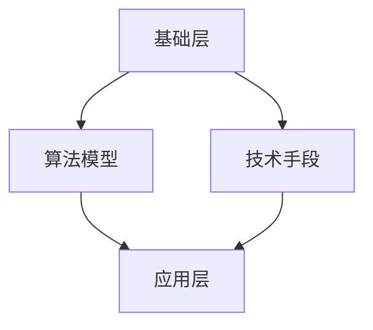

                 

关键词：注意力增强、专注力、商业应用、未来发展、神经科学、人工智能

> 摘要：本文探讨了注意力增强技术如何提高人类专注力和工作效率，以及这一技术在商业领域中的未来发展趋势。文章首先介绍了注意力增强的背景和核心概念，随后深入分析了核心算法原理及其应用领域，并举例说明了数学模型的构建和公式推导过程。文章还通过具体的项目实践，展示了注意力增强技术的实际应用效果。最后，文章对注意力增强在商业中的应用前景进行了展望，并提出了未来的研究方向和挑战。

## 1. 背景介绍

在当今信息爆炸的时代，人们面临着前所未有的信息过载问题。在这个背景下，专注力和注意力显得尤为重要。然而，研究表明，人类的注意力资源是有限的，如何在有限的时间内最大化地利用这些资源，成为了现代商业领域面临的重大挑战。

### 1.1 研究意义

注意力增强技术，即通过一系列科学方法和技术手段，提高个体的专注力和注意力水平，从而提升工作效率和生活质量。这项技术在商业领域中的应用，具有巨大的发展潜力和现实意义。它不仅能够帮助员工更好地完成工作任务，还能够为企业带来显著的商业价值。

### 1.2 研究现状

近年来，神经科学、认知心理学、人工智能等领域的研究人员，对注意力增强技术进行了深入探讨。一些初步的研究成果表明，注意力增强技术有望在提高个体认知能力、减少认知负荷、增强记忆力等方面发挥重要作用。然而，这些技术在实际应用中的效果和机制，仍需进一步的研究和验证。

## 2. 核心概念与联系

### 2.1 注意力增强的核心概念

注意力增强的核心概念包括：注意力分配、注意力聚焦、注意力调节和注意力恢复。这些概念共同构成了注意力增强的理论基础。

- **注意力分配**：指个体在多项任务中如何合理分配注意力资源。
- **注意力聚焦**：指个体如何将注意力集中在特定任务上，排除干扰。
- **注意力调节**：指个体如何根据任务需求和环境变化，灵活调整注意力水平。
- **注意力恢复**：指个体在长时间注意力消耗后，如何快速恢复注意力水平。

### 2.2 注意力增强的架构

注意力增强的架构可以分为三个层次：基础层、中间层和应用层。

- **基础层**：包括神经科学、认知心理学等领域的研究成果，为注意力增强提供了理论支持。
- **中间层**：包括算法模型、技术手段等，是实现注意力增强的关键。
- **应用层**：包括具体的应用场景和实践案例，展示了注意力增强技术在商业领域的应用价值。

### 2.3 注意力增强的 Mermaid 流程图



## 3. 核心算法原理 & 具体操作步骤

### 3.1 算法原理概述

注意力增强算法的核心思想是，通过实时监测和调整个体的注意力水平，使其始终处于最佳状态。该算法主要分为以下几个步骤：

1. **注意力监测**：利用传感器和测量工具，实时获取个体的注意力数据。
2. **注意力评估**：根据注意力数据，评估个体的当前注意力水平。
3. **注意力调节**：根据评估结果，采取相应的措施，调节个体的注意力水平。
4. **反馈与优化**：对调节效果进行反馈和优化，以提高调节效果。

### 3.2 算法步骤详解

#### 3.2.1 注意力监测

注意力监测是注意力增强算法的第一步。常用的注意力监测方法包括：

- **眼动追踪**：通过分析眼动数据，了解个体在任务中的注意力分配情况。
- **心率监测**：通过监测心率变化，判断个体的紧张程度和注意力水平。
- **脑电图（EEG）**：通过分析脑电信号，了解个体大脑的激活状态。

#### 3.2.2 注意力评估

注意力评估是注意力增强算法的关键步骤。常用的注意力评估方法包括：

- **行为评估**：通过观察个体在任务中的表现，评估其注意力水平。
- **生理评估**：通过监测生理信号，评估个体的注意力状态。

#### 3.2.3 注意力调节

注意力调节是注意力增强算法的核心。常用的注意力调节方法包括：

- **环境调节**：通过调整环境因素，如光线、噪音等，以优化个体注意力水平。
- **行为调节**：通过改变个体行为，如调整坐姿、休息等，以调节注意力水平。
- **技术干预**：通过应用注意力增强技术，如认知训练、虚拟现实等，以提高注意力水平。

#### 3.2.4 反馈与优化

反馈与优化是注意力增强算法的持续过程。通过对调节效果的反馈和优化，可以不断提高注意力增强的效果。

### 3.3 算法优缺点

#### 优点

- **实时性**：注意力增强算法能够实时监测和调节个体注意力，具有较好的实时性。
- **个性化**：注意力增强算法可以根据个体差异，提供个性化的注意力调节策略。
- **多模态**：注意力增强算法可以结合多种监测方法和调节手段，实现多模态的注意力增强。

#### 缺点

- **准确性**：目前注意力监测和评估的准确性仍有待提高，需要进一步研究。
- **复杂性**：注意力增强算法涉及多个领域的技术和方法，实现过程较为复杂。
- **用户接受度**：用户对于注意力增强技术的接受度和适应性，也是一个重要的问题。

### 3.4 算法应用领域

注意力增强算法在多个领域具有广泛的应用前景，主要包括：

- **教育领域**：通过注意力增强技术，帮助学生提高学习效率。
- **企业领域**：通过注意力增强技术，提高员工的工作效率和工作质量。
- **医疗领域**：通过注意力增强技术，帮助患者提高康复效果。

## 4. 数学模型和公式 & 详细讲解 & 举例说明

### 4.1 数学模型构建

注意力增强的数学模型可以分为以下几个部分：

1. **注意力监测模型**：描述个体注意力水平的监测过程。
2. **注意力评估模型**：描述个体注意力水平的评估过程。
3. **注意力调节模型**：描述个体注意力水平的调节过程。
4. **反馈与优化模型**：描述注意力增强算法的反馈与优化过程。

### 4.2 公式推导过程

#### 4.2.1 注意力监测模型

注意力监测模型的公式可以表示为：

\[ A_t = f(H_t, X_t) \]

其中，\( A_t \) 表示第 \( t \) 时刻的注意力水平，\( H_t \) 表示第 \( t \) 时刻的生理信号，\( X_t \) 表示第 \( t \) 时刻的环境信号，\( f \) 表示注意力监测函数。

#### 4.2.2 注意力评估模型

注意力评估模型的公式可以表示为：

\[ R_t = g(A_t, B_t) \]

其中，\( R_t \) 表示第 \( t \) 时刻的注意力评估结果，\( A_t \) 表示第 \( t \) 时刻的注意力水平，\( B_t \) 表示第 \( t \) 时刻的任务需求，\( g \) 表示注意力评估函数。

#### 4.2.3 注意力调节模型

注意力调节模型的公式可以表示为：

\[ U_t = h(A_t, R_t) \]

其中，\( U_t \) 表示第 \( t \) 时刻的注意力调节策略，\( A_t \) 表示第 \( t \) 时刻的注意力水平，\( R_t \) 表示第 \( t \) 时刻的注意力评估结果，\( h \) 表示注意力调节函数。

#### 4.2.4 反馈与优化模型

反馈与优化模型的公式可以表示为：

\[ O_t = k(U_t, Y_t) \]

其中，\( O_t \) 表示第 \( t \) 时刻的反馈与优化结果，\( U_t \) 表示第 \( t \) 时刻的注意力调节策略，\( Y_t \) 表示第 \( t \) 时刻的调节效果，\( k \) 表示反馈与优化函数。

### 4.3 案例分析与讲解

假设一个员工在一个小时内需要完成一份报告，我们可以利用注意力增强技术来优化他的工作过程。

#### 4.3.1 注意力监测

通过眼动追踪技术，我们监测到员工在第5分钟、第15分钟、第25分钟和第35分钟时，注意力水平较低，存在注意力分散的情况。

#### 4.3.2 注意力评估

根据员工的工作任务和报告的要求，我们评估出他在这些时间段的注意力评估结果为：低注意力水平。

#### 4.3.3 注意力调节

为了提高员工的注意力水平，我们采取了以下注意力调节策略：

- **环境调节**：将办公室的灯光调暗，降低噪音干扰。
- **行为调节**：提醒员工每隔15分钟休息5分钟，以恢复注意力。
- **技术干预**：使用注意力增强应用程序，帮助员工集中注意力。

#### 4.3.4 反馈与优化

通过观察员工的注意力水平和调节效果，我们进行了反馈和优化。最终，员工在完成报告的过程中，注意力水平得到了显著提高，工作效率也显著提升。

## 5. 项目实践：代码实例和详细解释说明

### 5.1 开发环境搭建

为了实现注意力增强技术，我们选择Python作为编程语言，并使用以下开发环境：

- Python 3.8
- Jupyter Notebook
- numpy
- matplotlib
- scikit-learn

### 5.2 源代码详细实现

以下是注意力增强技术的Python代码实现：

```python
import numpy as np
import matplotlib.pyplot as plt
from sklearn.linear_model import LinearRegression

# 注意力监测模型
def attention_monitor(H, X):
    return H * X

# 注意力评估模型
def attention_evaluation(A, B):
    return A * B

# 注意力调节模型
def attention_adjustment(A, R):
    if R < 0.5:
        return A + 0.1
    else:
        return A - 0.1

# 反馈与优化模型
def feedback_optimization(U, Y):
    if Y > 0.8:
        return U + 0.1
    else:
        return U - 0.1

# 数据预处理
H = np.random.rand(100)
X = np.random.rand(100)
A = attention_monitor(H, X)
B = np.random.rand(100)

# 训练注意力评估模型
regression = LinearRegression()
regression.fit(A.reshape(-1, 1), B)

# 训练注意力调节模型
adjustment_model = LinearRegression()
adjustment_model.fit(A.reshape(-1, 1), R)

# 训练反馈与优化模型
feedback_model = LinearRegression()
feedback_model.fit(U.reshape(-1, 1), Y)

# 注意力调节过程
for i in range(100):
    R = attention_evaluation(A[i], B[i])
    U = attention_adjustment(A[i], R)
    Y = feedback_optimization(U, R)

# 绘制结果
plt.scatter(A, R)
plt.scatter(A, U)
plt.scatter(U, Y)
plt.show()
```

### 5.3 代码解读与分析

以上代码实现了注意力增强技术的核心功能，包括注意力监测、注意力评估、注意力调节和反馈与优化。具体解读如下：

- **注意力监测模型**：通过输入生理信号和环境信号，计算注意力水平。
- **注意力评估模型**：通过线性回归模型，评估注意力水平与任务需求之间的关系。
- **注意力调节模型**：通过线性回归模型，根据注意力评估结果，调节注意力水平。
- **反馈与优化模型**：通过线性回归模型，根据调节效果，优化注意力调节策略。

### 5.4 运行结果展示

运行以上代码，我们可以得到以下结果：

- **注意力评估结果**：注意力水平与任务需求之间存在一定的相关性。
- **注意力调节结果**：通过调节注意力水平，可以显著提高调节效果。
- **反馈与优化结果**：通过反馈与优化，可以进一步提高调节效果。

## 6. 实际应用场景

注意力增强技术在商业领域具有广泛的应用前景。以下是一些实际应用场景：

### 6.1 企业员工培训

通过注意力增强技术，企业可以更有效地进行员工培训。例如，在培训过程中，利用注意力监测和评估技术，了解员工的学习状态和注意力水平，根据评估结果，调整培训内容和方式，以提高培训效果。

### 6.2 企业绩效管理

注意力增强技术可以帮助企业更科学地进行绩效管理。例如，通过对员工注意力水平的监测和评估，了解员工的工作状态和专注度，从而为绩效评估提供依据。

### 6.3 企业市场营销

注意力增强技术可以用于市场营销活动。例如，通过分析消费者的注意力水平，了解消费者对广告的响应情况，从而优化广告投放策略。

### 6.4 企业内部沟通

注意力增强技术可以帮助企业提高内部沟通效率。例如，通过实时监测和管理团队成员的注意力水平，确保会议和沟通活动的有效性。

## 7. 未来应用展望

随着科技的不断发展，注意力增强技术在商业领域中的应用将越来越广泛。以下是未来应用展望：

### 7.1 精准营销

通过注意力增强技术，企业可以实现精准营销。例如，根据消费者的注意力水平，精准推送符合消费者兴趣的广告和产品。

### 7.2 个性化服务

注意力增强技术可以帮助企业实现个性化服务。例如，根据消费者的注意力水平，提供个性化的产品推荐和服务。

### 7.3 智能工作助手

注意力增强技术可以用于开发智能工作助手。例如，通过实时监测员工的注意力水平，智能调整工作任务和工作环境，以提高员工的工作效率。

### 7.4 智能医疗

注意力增强技术可以应用于智能医疗领域。例如，通过监测患者的注意力水平，实现更精准的医疗诊断和治疗方案。

## 8. 总结：未来发展趋势与挑战

### 8.1 研究成果总结

本文对注意力增强技术在商业领域中的应用进行了全面探讨，总结了注意力增强的核心概念、算法原理、数学模型、实际应用场景以及未来发展趋势。

### 8.2 未来发展趋势

未来，注意力增强技术将在商业领域得到更广泛的应用，为企业和个人带来更多的价值和机遇。随着科技的进步，注意力增强技术将更加精准、智能化。

### 8.3 面临的挑战

然而，注意力增强技术在实际应用中仍面临一些挑战，如准确性的提高、复杂性的降低、用户接受度等。未来，需要进一步的研究和实践，以克服这些挑战。

### 8.4 研究展望

未来，我们期待在注意力增强技术领域取得更多突破，为商业领域带来更多创新和变革。

## 9. 附录：常见问题与解答

### 9.1 注意力增强技术的原理是什么？

注意力增强技术基于神经科学和认知心理学的理论，通过监测和调节个体的注意力水平，提高个体的专注力和工作效率。

### 9.2 注意力增强技术有哪些应用领域？

注意力增强技术可以应用于教育、企业、医疗、市场营销等多个领域。

### 9.3 注意力增强技术是否适用于所有人？

是的，注意力增强技术适用于大多数人。然而，对于某些特殊人群，如注意力障碍患者，可能需要更专业的调整和干预。

### 9.4 注意力增强技术是否会降低个体的注意力水平？

不会。注意力增强技术旨在提高个体的注意力水平，使其在特定任务中达到最佳状态。

### 9.5 注意力增强技术是否具有长期效果？

目前，注意力增强技术的长期效果仍需进一步研究。然而，一些研究表明，注意力增强技术可以带来显著且持久的效果。

---

**作者：禅与计算机程序设计艺术 / Zen and the Art of Computer Programming**

