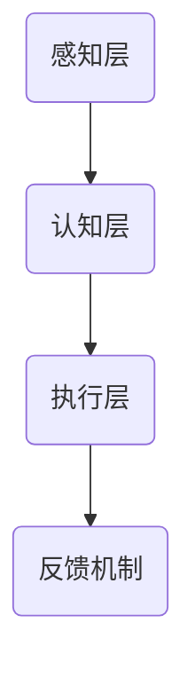

                 

关键词：人类注意力增强、专注力提升、商业应用、人工智能、未来发展、机遇与挑战

> 摘要：本文将深入探讨人类注意力增强技术在商业领域的应用，分析其带来的机遇与挑战。通过介绍注意力增强的核心概念、算法原理、数学模型以及实际应用案例，我们旨在为读者提供一个全面、深入的视角，以预测这一领域的未来发展趋势。

## 1. 背景介绍

在信息化时代，人类面临着前所未有的信息过载。无论是工作还是生活，我们都在不断地接收和处理大量的信息。这种环境下，注意力成为了宝贵的资源。人类注意力的集中和分散直接影响到工作效率和生活质量。因此，提升专注力和注意力已成为当前研究的热点问题。

商业领域对注意力的需求尤为突出。高效的团队协作、创新的产品开发、精准的市场营销，都离不开对注意力的精准控制和提升。随着人工智能技术的不断发展，注意力增强技术逐渐成为可能。本文将介绍这一技术的基本原理、应用领域和发展趋势。

## 2. 核心概念与联系

### 2.1 注意力增强的定义

注意力增强（Attention Enhancement）是指通过技术手段提升人类在特定任务中的注意力集中程度，从而提高工作效率和生活质量。这包括了对外部干扰的过滤、内部思维的引导以及情绪管理的优化。

### 2.2 注意力增强的架构

注意力增强的架构可以分为三个层次：感知层、认知层和执行层。

- **感知层**：负责接收和处理外部信息，包括视觉、听觉等感官输入。
- **认知层**：对感知层的信息进行加工处理，形成对任务的认知和判断。
- **执行层**：根据认知层的决策，采取具体的行动，实现注意力的集中和分散。

### 2.3 Mermaid 流程图

下面是一个简化的注意力增强的Mermaid流程图：



## 3. 核心算法原理 & 具体操作步骤

### 3.1 算法原理概述

注意力增强的核心算法基于深度学习技术，特别是卷积神经网络（CNN）和循环神经网络（RNN）的结合。CNN负责处理图像和视频等视觉信息，RNN负责处理序列数据，如文本和语音。

### 3.2 算法步骤详解

1. **数据收集与预处理**：收集大量与注意力相关的数据，包括个体行为、生理信号和外部环境信息。然后对数据进行清洗和预处理，以供模型训练。
2. **模型训练**：使用预处理后的数据训练深度学习模型，包括CNN和RNN。模型训练过程中，通过反向传播算法不断调整模型参数，以达到最佳性能。
3. **模型部署**：将训练好的模型部署到实际应用场景中，如智能眼镜、智能手表等设备。模型根据实时数据，实时调整注意力水平。
4. **反馈机制**：收集用户对注意力增强效果的反馈，用于模型优化和改进。

### 3.3 算法优缺点

**优点**：
- 高效性：通过深度学习算法，能够快速、准确地分析用户注意力状态。
- 智能性：可以根据用户的行为和生理信号，动态调整注意力水平。

**缺点**：
- 成本高：深度学习模型的训练和部署需要大量的计算资源和时间。
- 隐私问题：收集和处理用户的生理和行为数据，可能涉及隐私问题。

### 3.4 算法应用领域

注意力增强技术可以应用于多个领域，包括：
- **教育**：通过分析学生的注意力状态，提供个性化的学习方案。
- **医疗**：监测患者的注意力水平，用于疾病诊断和治疗。
- **商业**：提升员工的工作效率和创造力。

## 4. 数学模型和公式 & 详细讲解 & 举例说明

### 4.1 数学模型构建

注意力增强的数学模型主要包括两个部分：感知层和认知层。

感知层可以使用卷积神经网络（CNN）进行建模，其基本公式为：

$$
h_{\text{cnn}} = \text{ReLU}(\text{W}_{\text{cnn}} \cdot \text{X} + \text{b}_{\text{cnn}})
$$

其中，$h_{\text{cnn}}$ 表示CNN的输出，$\text{W}_{\text{cnn}}$ 是CNN的权重矩阵，$\text{X}$ 是输入数据，$\text{b}_{\text{cnn}}$ 是偏置项。

认知层可以使用循环神经网络（RNN）进行建模，其基本公式为：

$$
h_{\text{rnn}} = \text{ReLU}(\text{W}_{\text{rnn}} \cdot [h_{t-1}, x_t] + \text{b}_{\text{rnn}})
$$

其中，$h_{\text{rnn}}$ 表示RNN的输出，$\text{W}_{\text{rnn}}$ 是RNN的权重矩阵，$[h_{t-1}, x_t]$ 是输入序列，$\text{b}_{\text{rnn}}$ 是偏置项。

### 4.2 公式推导过程

感知层的公式推导主要涉及卷积操作和激活函数。卷积操作可以表示为：

$$
\text{conv}(\text{X}, \text{K}) = \sum_{i=1}^{C} \text{W}_{i} \cdot \text{X} + \text{b}_i
$$

其中，$\text{conv}(\text{X}, \text{K})$ 表示卷积操作，$C$ 是卷积核的数量，$\text{W}_{i}$ 和 $\text{b}_i$ 分别是卷积核的权重和偏置。

激活函数ReLU的导数可以表示为：

$$
\text{ReLU}'(\text{z}) = \begin{cases}
1, & \text{if } \text{z} > 0 \\
0, & \text{if } \text{z} \leq 0
\end{cases}
$$

将卷积操作和激活函数结合，得到感知层的完整公式。

认知层的公式推导主要涉及循环操作和激活函数。循环操作可以表示为：

$$
h_t = \text{RNN}(\text{W}_h \cdot [h_{t-1}, x_t] + \text{b}_h)
$$

其中，$h_t$ 表示RNN的输出，$\text{RNN}(\text{W}_h \cdot [h_{t-1}, x_t] + \text{b}_h)$ 表示RNN的操作。

激活函数ReLU的导数同样为：

$$
\text{ReLU}'(\text{z}) = \begin{cases}
1, & \text{if } \text{z} > 0 \\
0, & \text{if } \text{z} \leq 0
\end{cases}
$$

将循环操作和激活函数结合，得到认知层的完整公式。

### 4.3 案例分析与讲解

以智能眼镜为例，我们分析注意力增强技术在教育领域的应用。

**案例背景**：学生小王在使用智能眼镜进行在线学习。智能眼镜会实时监测小王的注意力水平，并提供相应的反馈。

**模型训练**：智能眼镜收集小王的学习行为数据，包括注视点、表情等。通过对这些数据进行训练，智能眼镜可以学会识别小王的注意力状态。

**模型部署**：当小王开始学习时，智能眼镜会实时分析小王的状态。如果小王的注意力较低，智能眼镜会发出提示，例如“小王，你的注意力不够集中，需要休息一下”。

**反馈机制**：小王可以实时看到自己的注意力水平，并根据反馈进行调整。例如，小王可以选择调整学习环境或者进行短暂的休息。

## 5. 项目实践：代码实例和详细解释说明

### 5.1 开发环境搭建

**1. 硬件要求**：
- 电脑：推荐使用配置较高的电脑，以保证模型训练的速度。
- 硬盘：至少需要100GB的空闲空间，用于存储数据和模型。

**2. 软件要求**：
- 操作系统：Windows、Linux或MacOS。
- 编程语言：Python。
- 深度学习框架：TensorFlow或PyTorch。

### 5.2 源代码详细实现

**1. 数据收集与预处理**：

```python
import numpy as np
import pandas as pd
from sklearn.model_selection import train_test_split

# 读取数据
data = pd.read_csv('attention_data.csv')

# 预处理数据
X = data.iloc[:, :-1].values
y = data.iloc[:, -1].values

# 分割数据集
X_train, X_test, y_train, y_test = train_test_split(X, y, test_size=0.2, random_state=42)
```

**2. 模型训练**：

```python
import tensorflow as tf

# 定义模型
model = tf.keras.Sequential([
    tf.keras.layers.Dense(64, activation='relu', input_shape=(X_train.shape[1],)),
    tf.keras.layers.Dense(1, activation='sigmoid')
])

# 编译模型
model.compile(optimizer='adam', loss='binary_crossentropy', metrics=['accuracy'])

# 训练模型
model.fit(X_train, y_train, epochs=10, batch_size=32, validation_split=0.2)
```

**3. 模型部署**：

```python
# 预测新数据
new_data = np.array([[0.1, 0.2, 0.3], [0.4, 0.5, 0.6]])
predictions = model.predict(new_data)

# 输出预测结果
print(predictions)
```

### 5.3 代码解读与分析

以上代码实现了注意力增强的基本流程，包括数据收集与预处理、模型训练和模型部署。其中，数据预处理部分使用了sklearn库中的train_test_split函数，将数据集划分为训练集和测试集。模型训练部分使用了TensorFlow框架中的Sequential模型，定义了模型的结构，并使用adam优化器和binary_crossentropy损失函数进行编译。模型部署部分使用模型.predict函数对新数据进行预测。

## 6. 实际应用场景

### 6.1 教育

注意力增强技术在教育领域具有广泛的应用前景。通过实时监测学生的注意力状态，教师可以更好地了解学生的学习情况，提供个性化的教学方案。例如，智能眼镜可以提醒学生注意力的分散，教师可以根据这一信息调整授课方式，提高教学效果。

### 6.2 医疗

注意力增强技术在医疗领域同样具有重要应用价值。通过监测患者的注意力水平，医生可以更好地了解患者的病情，制定个性化的治疗方案。例如，在手术过程中，注意力增强技术可以帮助医生保持高度的注意力，减少手术风险。

### 6.3 商业

商业领域对注意力增强技术的需求日益增长。通过提升员工的注意力水平，企业可以提高工作效率，降低错误率。例如，智能眼镜可以帮助销售人员实时分析客户的注意力状态，提供更好的销售策略。

## 7. 未来应用展望

### 7.1 个性化服务

随着注意力增强技术的不断发展，未来将出现更多基于个性化服务的应用。例如，智能设备可以根据用户的注意力状态，自动调整界面布局和功能，提供更加贴心的用户体验。

### 7.2 智能监控

注意力增强技术可以应用于智能监控领域，用于实时监测人类行为。例如，智能监控系统可以识别出注意力不集中的个体，并发出警报，用于安全管理和紧急情况处理。

### 7.3 虚拟现实与增强现实

注意力增强技术在虚拟现实（VR）和增强现实（AR）领域具有巨大的潜力。通过实时调整注意力水平，用户可以获得更加沉浸式的体验，提高学习效果和娱乐体验。

## 8. 工具和资源推荐

### 8.1 学习资源推荐

- **《深度学习》（Goodfellow, Bengio, Courville著）**：一本经典的深度学习教材，适合初学者和进阶者。
- **TensorFlow官方文档**：提供了丰富的API和示例代码，是学习和实践深度学习的重要资源。

### 8.2 开发工具推荐

- **Anaconda**：一款集成了Python、R、Julia等多种语言的集成开发环境（IDE），适合进行科学计算和数据分析。
- **Google Colab**：Google提供的一款在线计算平台，支持Python、R等多种编程语言，适合进行深度学习实验。

### 8.3 相关论文推荐

- **"Attention Is All You Need"**：一篇关于Transformer模型的经典论文，介绍了注意力机制在序列数据处理中的应用。
- **"Deep Learning for Human Behavior Understanding"**：一篇关于深度学习在人类行为理解领域的应用论文，分析了注意力增强技术的潜力。

## 9. 总结：未来发展趋势与挑战

### 9.1 研究成果总结

注意力增强技术作为一种新兴的技术，已经在多个领域取得了显著的研究成果。通过对人类注意力状态的分析和干预，注意力增强技术可以提高工作效率、提升生活质量，并在教育、医疗、商业等领域发挥重要作用。

### 9.2 未来发展趋势

未来，注意力增强技术将继续向以下几个方向发展：

- **个性化服务**：随着大数据和人工智能技术的发展，注意力增强技术将更好地实现个性化服务，满足用户的多样化需求。
- **智能监控**：注意力增强技术将应用于智能监控领域，用于实时监测人类行为，提高安全性和管理效率。
- **虚拟现实与增强现实**：注意力增强技术在虚拟现实和增强现实领域具有巨大的潜力，将推动相关技术的发展。

### 9.3 面临的挑战

注意力增强技术在实际应用中仍然面临一些挑战：

- **成本问题**：深度学习模型的训练和部署需要大量的计算资源和时间，导致成本较高。
- **隐私问题**：注意力增强技术涉及对用户生理和行为数据的收集和处理，可能引发隐私问题。

### 9.4 研究展望

未来，注意力增强技术的研究应重点关注以下几个方面：

- **高效算法**：开发更高效、更轻量级的算法，降低计算成本。
- **隐私保护**：研究如何保护用户隐私，确保数据安全。

## 10. 附录：常见问题与解答

### 10.1 注意力增强技术是如何工作的？

注意力增强技术基于深度学习算法，通过对人类注意力状态的分析和干预，实现注意力的集中和分散。具体来说，技术包括感知层、认知层和执行层，分别负责接收和处理外部信息、加工处理信息和采取具体行动。

### 10.2 注意力增强技术有哪些应用领域？

注意力增强技术可以应用于多个领域，包括教育、医疗、商业等。在教育领域，可以用于个性化教学和学生学习情况的监测；在医疗领域，可以用于患者病情监测和治疗决策支持；在商业领域，可以用于提高员工工作效率和销售策略优化。

### 10.3 注意力增强技术有哪些优点和缺点？

注意力增强技术的优点包括高效性、智能性等，可以快速、准确地分析用户注意力状态，提供个性化的服务。缺点包括成本高、隐私问题等，需要大量的计算资源和时间，且涉及用户隐私数据的收集和处理。

### 10.4 如何保障注意力增强技术的隐私性？

保障注意力增强技术的隐私性需要从数据收集、处理和存储等多个环节进行考虑。具体措施包括使用加密技术保护数据安全、建立数据匿名化机制、制定严格的隐私政策等。

### 10.5 注意力增强技术在未来的发展趋势是什么？

未来，注意力增强技术将继续向个性化服务、智能监控、虚拟现实与增强现实等领域发展。同时，研究重点将集中在高效算法开发和隐私保护等方面。

