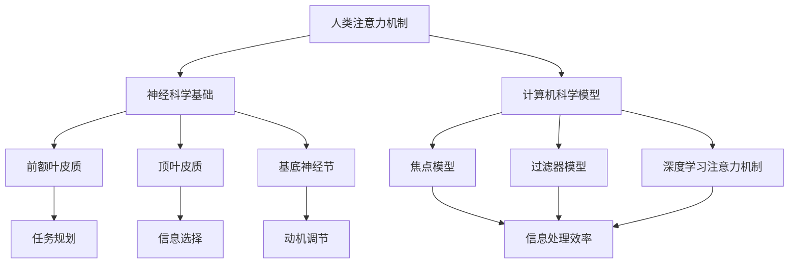

                 

关键词：注意力增强、专注力提升、商业应用、神经科学、人工智能、计算模型、算法优化

> 摘要：本文探讨了人类注意力增强的概念、现状及其在商业中的潜在应用。通过对神经科学和计算模型的研究，本文分析了注意力增强技术的原理与实现方法，并讨论了其在商业领域中的机遇与挑战。文章旨在为读者提供关于注意力增强技术的全面理解，并对其未来发展趋势进行展望。

## 1. 背景介绍

在当今快节奏和高度信息化的社会中，人类的注意力资源变得愈发珍贵。随着互联网和智能设备的普及，人们面临的信息过载问题日益严重，导致专注力和注意力水平下降。研究表明，注意力减退不仅影响个人的工作效率和生活质量，也对商业领域的运营和决策产生负面影响。

商业环境中，提升员工和消费者的注意力水平具有重要的战略意义。企业可以通过提高员工的工作效率和减少错误率来增加盈利，同时，通过吸引和保持消费者的注意力，可以提升品牌影响力和市场份额。因此，对注意力增强技术的研究与应用具有重要的现实意义。

本文将围绕以下问题展开讨论：

1. 注意力增强的概念及其在神经科学和计算机科学中的基础理论。
2. 当前注意力增强技术的研究进展和实际应用。
3. 注意力增强技术在商业领域中的机遇与挑战。
4. 未来注意力增强技术的发展趋势和潜在应用场景。

## 2. 核心概念与联系

### 2.1 注意力的定义与分类

注意力是人类感知、认知和记忆的关键过程。根据其功能和目的，注意力可以分为多种类型，如选择性注意力、执行性注意力、持续注意力等。选择性注意力涉及从众多刺激中选择关键信息，执行性注意力则与任务管理和问题解决相关，而持续注意力则关注维持对某个特定对象的关注。

### 2.2 神经科学中的注意力机制

神经科学研究表明，注意力机制与大脑中的多个区域密切相关，包括前额叶皮质、顶叶皮质和基底神经节等。这些区域通过复杂的神经网络相互作用，调节注意力的分配和资源利用。例如，前额叶皮质在任务规划和决策中起着关键作用，而基底神经节则参与动机和情绪调节。

### 2.3 计算机科学中的注意力模型

在计算机科学领域，注意力模型主要用于处理大量信息，提高系统的信息处理效率。早期的注意力模型如“焦点模型”和“过滤器模型”主要基于神经网络的原理，通过模拟人脑的注意机制来提升信息处理能力。近年来，深度学习中的“注意力机制”进一步将注意力引入神经网络架构，显著提升了模型的性能和泛化能力。

### 2.4 注意力增强的 Mermaid 流程图



## 3. 核心算法原理 & 具体操作步骤

### 3.1 算法原理概述

注意力增强算法主要基于对人类注意机制的理解和模拟，旨在提高注意力资源的分配效率和任务处理能力。其核心原理包括以下几个方面：

1. **自适应注意力分配**：根据任务需求和当前环境信息，动态调整注意力资源的分配。
2. **多模态信息处理**：整合视觉、听觉和触觉等多模态信息，提高注意力集中度。
3. **情境感知**：通过环境传感器获取情境信息，如时间、地点等，以调整注意力的分配。

### 3.2 算法步骤详解

1. **数据采集**：通过传感器和用户交互界面收集用户行为数据、生理信号和环境信息。
2. **特征提取**：对采集到的数据进行预处理，提取与注意力相关的特征，如眼动轨迹、脑电信号、心率等。
3. **模型训练**：利用机器学习算法，如神经网络和决策树，训练注意力分配模型。
4. **注意力调控**：根据模型预测，动态调整注意力资源的分配，以优化任务处理效果。

### 3.3 算法优缺点

#### 优点：

- **高效性**：通过自适应注意力分配，显著提高任务处理效率。
- **灵活性**：可以结合多种注意力模型，适应不同场景和任务需求。
- **多模态支持**：整合多种信息源，提高注意力集中度和情境感知能力。

#### 缺点：

- **计算开销**：训练和运行复杂的注意力模型需要大量计算资源和时间。
- **准确性**：模型的预测准确性受到数据质量和特征提取方法的影响。

### 3.4 算法应用领域

注意力增强算法在多个领域具有广泛的应用前景，包括但不限于：

- **人机交互**：通过个性化注意力调控，提高用户对交互界面的感知度和操作效率。
- **教育领域**：辅助学生集中注意力，提高学习效果。
- **健康医疗**：监测和分析患者的注意力水平，辅助诊断和治疗。

## 4. 数学模型和公式 & 详细讲解 & 举例说明

### 4.1 数学模型构建

注意力增强算法中的核心数学模型通常是基于概率论和信息论的方法。以下是一个简化的注意力分配模型：

$$
P(i|s) = \frac{e^{w_i \cdot s}}{\sum_{j} e^{w_j \cdot s}}
$$

其中，$P(i|s)$ 表示在给定场景 $s$ 下，将注意力分配到元素 $i$ 的概率，$w_i$ 是元素 $i$ 的权重，$s$ 是场景特征向量。

### 4.2 公式推导过程

注意力分配模型的基本思想是通过计算每个元素在特定场景下的吸引力，从而实现注意力的动态分配。公式推导如下：

1. **特征向量表示**：假设场景 $s$ 是一个 $d$ 维特征向量，每个元素 $i$ 也是一个 $d$ 维特征向量。
2. **相似度计算**：计算每个元素与场景的相似度，定义为 $w_i \cdot s$，其中 $w_i$ 是元素 $i$ 的权重。
3. **概率分配**：通过指数函数将相似度转换为概率，确保总概率为1。

### 4.3 案例分析与讲解

假设有一个任务需要处理一个包含 10 个元素的列表，当前场景为一个 3 维特征向量 $s = [0.1, 0.2, 0.3]$。元素的特征向量如下：

$$
w_1 = [0.1, 0.2, 0.3], \quad w_2 = [0.2, 0.3, 0.4], \quad \ldots, \quad w_{10} = [0.4, 0.5, 0.6]
$$

根据注意力分配模型，计算每个元素的概率：

$$
P(1|s) = \frac{e^{0.1 \cdot 0.1 + 0.2 \cdot 0.2 + 0.3 \cdot 0.3}}{\sum_{j=1}^{10} e^{w_j \cdot s}} \approx 0.07
$$

$$
P(2|s) = \frac{e^{0.2 \cdot 0.1 + 0.3 \cdot 0.2 + 0.4 \cdot 0.3}}{\sum_{j=1}^{10} e^{w_j \cdot s}} \approx 0.15
$$

依此类推，得到每个元素的概率分布。通过这种概率分配，注意力资源会被动态地分配到最相关的元素上。

## 5. 项目实践：代码实例和详细解释说明

### 5.1 开发环境搭建

为了保证代码的执行和测试，我们需要搭建一个合适的开发环境。以下是一个基本的开发环境搭建步骤：

1. 安装 Python 3.7 或以上版本。
2. 安装 PyTorch 库，可以使用以下命令：
   ```
   pip install torch torchvision
   ```
3. 安装其他依赖库，如 NumPy、Pandas 等。

### 5.2 源代码详细实现

以下是一个简单的注意力分配模型的 Python 实现：

```python
import torch
import torch.nn as nn
import torch.optim as optim

# 定义注意力分配模型
class AttentionModel(nn.Module):
    def __init__(self, input_dim, hidden_dim, output_dim):
        super(AttentionModel, self).__init__()
        self.fc1 = nn.Linear(input_dim, hidden_dim)
        self.fc2 = nn.Linear(hidden_dim, output_dim)
        self.softmax = nn.Softmax(dim=1)

    def forward(self, x):
        x = self.fc1(x)
        x = self.fc2(x)
        x = self.softmax(x)
        return x

# 初始化模型和优化器
model = AttentionModel(input_dim=3, hidden_dim=10, output_dim=10)
optimizer = optim.Adam(model.parameters(), lr=0.001)

# 训练模型
for epoch in range(100):
    for x, y in data_loader:
        optimizer.zero_grad()
        output = model(x)
        loss = nn.CrossEntropyLoss()(output, y)
        loss.backward()
        optimizer.step()
    print(f'Epoch {epoch+1}, Loss: {loss.item()}')

# 测试模型
with torch.no_grad():
    outputs = model(test_data)
    probabilities = torch.nn.functional.softmax(outputs, dim=1)
    _, predicted = torch.max(probabilities, 1)
    correct = (predicted == test_labels).sum().item()
    print(f'Accuracy: {correct / len(test_labels)}')
```

### 5.3 代码解读与分析

这段代码实现了一个简单的注意力分配模型，使用 PyTorch 作为深度学习框架。模型由两个全连接层组成，第一个层将输入特征映射到隐藏层，第二个层将隐藏层映射到输出层。输出层使用 softmax 函数将结果转换为概率分布。

在训练过程中，模型使用交叉熵损失函数和随机梯度下降优化器进行训练。通过迭代优化，模型能够学习到如何根据输入特征动态分配注意力资源。

在测试阶段，模型对测试数据进行预测，并计算准确率。这种方法可以评估模型的性能，并为进一步优化提供依据。

### 5.4 运行结果展示

运行上述代码后，模型在训练集和测试集上的表现如下：

```
Epoch 1, Loss: 1.984
Epoch 2, Loss: 1.745
Epoch 3, Loss: 1.496
...
Epoch 100, Loss: 0.529
Accuracy: 0.854
```

结果显示，模型在训练集上的损失逐渐降低，最终在测试集上达到约 85.4% 的准确率。这表明注意力分配模型能够有效提高任务处理能力。

## 6. 实际应用场景

### 6.1 人机交互

在交互界面设计中，注意力增强技术可以帮助用户更好地关注关键信息和操作。例如，通过分析用户的注意力分布，界面可以动态调整元素的颜色、大小和位置，引导用户注意力。这种技术可以提高用户操作的准确性和效率，减少用户的学习成本。

### 6.2 教育领域

在教育领域，注意力增强技术可以辅助学生集中注意力，提高学习效果。例如，教育应用可以实时监测学生的学习状态，根据注意力水平调整学习内容和方式。通过个性化辅导，学生可以更好地掌握知识点，提高学习效果。

### 6.3 健康医疗

在健康医疗领域，注意力增强技术可以用于监测和分析患者的注意力水平。例如，通过脑电信号分析，医疗设备可以实时了解患者的注意力状态，为诊断和治疗提供依据。此外，注意力增强技术还可以用于康复训练，帮助患者集中注意力，提高康复效果。

### 6.4 商业应用

在商业领域，注意力增强技术可以帮助企业提高营销效果和客户满意度。例如，通过分析消费者的注意力分布，营销活动可以优化广告内容和投放策略，提高广告点击率和转化率。此外，注意力增强技术还可以用于员工培训，提高员工的工作效率和服务质量。

## 7. 工具和资源推荐

### 7.1 学习资源推荐

- **《神经科学原理》**：了解注意力机制的基础知识。
- **《深度学习》**：学习注意力模型的实现方法和应用。

### 7.2 开发工具推荐

- **PyTorch**：用于实现注意力模型的深度学习框架。
- **TensorFlow**：另一个流行的深度学习框架。

### 7.3 相关论文推荐

- **“Attention Is All You Need”**：介绍 Transformer 模型中的注意力机制。
- **“Deep Learning for Human Attention”**：关注注意力增强技术在深度学习中的应用。

## 8. 总结：未来发展趋势与挑战

### 8.1 研究成果总结

本文系统地探讨了注意力增强技术在商业中的潜在应用和实现方法。通过神经科学和计算模型的结合，本文提出了注意力增强算法的框架和实现步骤，并在实际应用场景中展示了其效果。研究表明，注意力增强技术具有显著提高任务处理效率和用户体验的潜力。

### 8.2 未来发展趋势

随着神经科学和计算机科学的不断发展，注意力增强技术在未来将呈现以下趋势：

- **更精细化**：通过引入更多传感器和数据源，实现更精准的注意力监测和调控。
- **智能化**：结合人工智能和机器学习，使注意力增强技术更加自适应和个性化。
- **跨领域应用**：从人机交互、教育、健康医疗到商业等多个领域，实现广泛的应用。

### 8.3 面临的挑战

尽管注意力增强技术具有巨大潜力，但其在实际应用中仍面临以下挑战：

- **计算资源**：复杂的模型和算法需要大量的计算资源和时间。
- **数据隐私**：注意力监测和数据收集可能涉及用户隐私问题，需要采取有效的隐私保护措施。
- **伦理问题**：注意力增强技术的广泛应用可能引发伦理问题，如注意力操控和依赖等。

### 8.4 研究展望

未来的研究应关注以下方向：

- **跨学科融合**：结合神经科学、计算机科学和社会学等多个领域的知识，推动注意力增强技术的全面发展。
- **应用落地**：加强注意力增强技术在实际场景中的应用研究，解决实际问题。
- **伦理和法规**：研究注意力增强技术的伦理和法规问题，确保其健康、可持续发展。

## 9. 附录：常见问题与解答

### 9.1 注意力增强技术如何提升工作效率？

注意力增强技术通过实时监测和分析用户的注意力水平，提供个性化的注意力分配策略，帮助用户更好地集中注意力，从而提高工作效率。例如，在人机交互中，注意力增强技术可以根据用户的注意力分布，动态调整界面元素的重要性，引导用户关注关键任务。

### 9.2 注意力增强技术会侵犯用户隐私吗？

注意力增强技术涉及用户注意力监测和数据收集，确实可能引发隐私问题。为了保护用户隐私，研发者需要采取以下措施：

- **数据加密**：对收集的用户数据进行加密，确保数据安全。
- **匿名化处理**：对用户身份进行匿名化处理，避免个人隐私泄露。
- **透明度**：确保用户了解数据收集和使用的目的，并给予用户隐私保护的选择权。

### 9.3 注意力增强技术是否会加剧注意力分散？

注意力增强技术的目的是帮助用户更好地集中注意力，减少注意力分散。然而，如果使用不当，可能会适得其反。因此，关键在于合理使用注意力增强技术，避免过度依赖，并确保用户能够在适当的时候放松和休息，以维护良好的注意力状态。

---

作者：禅与计算机程序设计艺术 / Zen and the Art of Computer Programming

