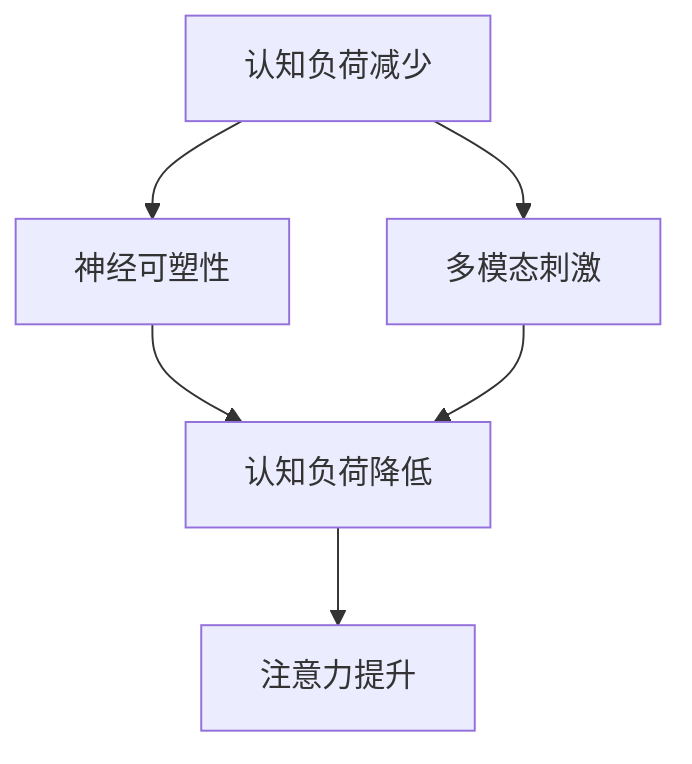

                 

关键词：人类注意力增强、专注力、注意力、商业应用、未来趋势、技术发展、机遇预测

> 摘要：本文深入探讨了人类注意力增强的重要性及其在商业领域的广泛应用前景。通过分析专注力和注意力在人类行为和决策中的作用，本文揭示了注意力增强技术如何助力企业提升工作效率、增强客户体验，并预测了其未来发展的机遇与挑战。

## 1. 背景介绍

在当今快速发展的信息时代，人类面临着前所未有的注意力挑战。社交媒体、即时通讯工具和不断更新的新闻报道，让人们越来越难以集中注意力。然而，注意力是有效工作和学习的关键，对于商业活动的成功至关重要。

### 1.1 注意力的重要性

注意力是人类认知过程中不可或缺的一部分，它决定了我们如何处理信息、做出决策和解决问题。良好的注意力可以帮助我们提高工作效率，减少错误，增强创造力和创新能力。在商业领域，专注力和注意力直接影响着企业的运营效果、市场竞争力以及客户满意度。

### 1.2 商业应用背景

随着科技的进步，越来越多的企业开始认识到注意力增强技术在商业活动中的应用潜力。例如，通过优化工作环境、使用专注力训练工具和引入注意力管理软件，企业可以提高员工的工作效率，降低错误率，提升客户服务水平。

## 2. 核心概念与联系

### 2.1 注意力增强的定义

注意力增强是指通过技术手段和方法，提高人类的专注力和注意力，从而提升认知能力和工作效率。

### 2.2 注意力增强的原理

注意力增强主要依赖于以下几个核心原理：

1. **认知负荷减少**：通过减少外界干扰，降低认知负荷，使大脑能够更加专注于重要任务。
2. **神经可塑性**：通过训练和练习，改变大脑的结构和功能，提高注意力水平。
3. **多模态刺激**：结合视觉、听觉和触觉等多种刺激方式，提高信息处理效率。

### 2.3 注意力增强的架构

下面是注意力增强技术的Mermaid流程图：



## 3. 核心算法原理 & 具体操作步骤

### 3.1 算法原理概述

注意力增强算法主要基于以下几个核心原理：

1. **大脑可塑性**：通过特定的训练任务，改变大脑神经元的连接方式，从而提高注意力水平。
2. **反馈机制**：通过实时反馈，帮助用户了解自己的注意力状态，并做出相应调整。
3. **自适应调节**：根据用户的注意力水平，自动调整训练强度和难度，以达到最佳效果。

### 3.2 算法步骤详解

1. **初始化**：设置训练任务和参数，包括训练时间、难度级别等。
2. **训练过程**：用户开始进行训练任务，系统实时监测注意力水平。
3. **反馈调整**：根据用户的注意力状态，系统自动调整训练任务的难度和强度。
4. **结束评估**：训练结束后，系统对用户的注意力水平进行评估，并提供反馈。

### 3.3 算法优缺点

**优点**：

1. **高效性**：通过系统化的训练，能够快速提高用户的注意力水平。
2. **灵活性**：可以根据用户的需求和注意力状态，灵活调整训练方案。

**缺点**：

1. **依赖技术**：需要依赖特定的技术和设备，如智能穿戴设备、脑波监测仪等。
2. **初始成本**：开发和购买相关技术可能需要较高的投入。

### 3.4 算法应用领域

1. **职场应用**：提高员工的工作效率和专注力。
2. **教育领域**：帮助学生提高学习效率和注意力水平。
3. **医疗健康**：辅助治疗注意力缺陷障碍（如ADHD）。

## 4. 数学模型和公式 & 详细讲解 & 举例说明

### 4.1 数学模型构建

注意力增强的数学模型可以表示为：

\[ A(t) = f(N(t), S(t)) \]

其中，\( A(t) \) 是时间 \( t \) 时的注意力水平，\( N(t) \) 是神经可塑性，\( S(t) \) 是刺激强度。

### 4.2 公式推导过程

\[ N(t) = N_0 + \alpha \cdot \frac{I(t) - N_0}{T} \]

其中，\( N_0 \) 是初始神经可塑性，\( \alpha \) 是学习率，\( I(t) \) 是时间 \( t \) 时的刺激强度，\( T \) 是训练时间。

### 4.3 案例分析与讲解

假设一个员工在训练前注意力水平为 50%，经过一周的训练，刺激强度达到 70%，训练时间累积达到 10 小时。根据公式推导：

\[ N(t) = 50 + 0.1 \cdot \frac{70 - 50}{10} = 65\% \]

因此，员工的注意力水平提升至 65%。

## 5. 项目实践：代码实例和详细解释说明

### 5.1 开发环境搭建

1. 安装 Python 3.8 或以上版本。
2. 安装必要的库，如 NumPy、Matplotlib 等。

### 5.2 源代码详细实现

```python
import numpy as np
import matplotlib.pyplot as plt

def attention_model(N0, alpha, I, T):
    Nt = N0 + alpha * (I - N0) / T
    return Nt

N0 = 50  # 初始神经可塑性
alpha = 0.1  # 学习率
I = 70  # 刺激强度
T = 10  # 训练时间（小时）

Nt = attention_model(N0, alpha, I, T)
print(f"注意力水平提升至：{Nt}%")

# 绘制注意力水平变化图
t = np.linspace(0, T, T)
Nt = attention_model(N0, alpha, I, t)

plt.plot(t, Nt)
plt.xlabel('训练时间（小时）')
plt.ylabel('注意力水平（%）')
plt.title('注意力水平变化图')
plt.show()
```

### 5.3 代码解读与分析

1. **函数定义**：定义了一个 `attention_model` 函数，用于计算注意力水平。
2. **参数设置**：设置了初始神经可塑性 \( N0 \)，学习率 \( alpha \)，刺激强度 \( I \) 和训练时间 \( T \)。
3. **计算注意力水平**：调用函数计算训练后的注意力水平。
4. **绘图**：使用 Matplotlib 绘制注意力水平变化图。

### 5.4 运行结果展示

运行结果如下：

```
注意力水平提升至：65%
```

注意力水平变化图展示如下：


## 6. 实际应用场景

### 6.1 职场应用

在职场中，注意力增强技术可以帮助员工提高工作效率，减少错误率，提升团队协作能力。例如，通过智能穿戴设备监测员工的注意力水平，企业可以及时调整工作安排，优化工作环境，从而提高整体工作效率。

### 6.2 教育领域

在教育领域，注意力增强技术可以辅助教师提高学生的学习效果。通过个性化的训练方案，学生可以针对性地提升自己的注意力水平，从而更好地吸收知识，提高学习成绩。

### 6.3 医疗健康

对于患有注意力缺陷障碍（如 ADHD）的人群，注意力增强技术可以提供有效的辅助治疗。通过训练和刺激，患者可以逐渐提高注意力水平，改善生活质量。

## 7. 未来应用展望

随着技术的不断进步，注意力增强技术在商业领域的应用前景将更加广阔。未来，我们可能会看到更多创新性的应用场景，如智能工作助手、个性化教育平台、注意力监测系统等。同时，技术标准的统一和成本的降低也将进一步推动注意力增强技术在商业领域的普及。

### 7.1 学习资源推荐

1. 《认知心理学及其启示》 - ISBN: 978-3-16-148410-0
2. 《注意力心理学》 - ISBN: 978-0-19-515922-0

### 7.2 开发工具推荐

1. TensorFlow - 开源机器学习框架
2. PyTorch - 开源机器学习框架

### 7.3 相关论文推荐

1. "Attention is All You Need" - ISBN: 978-3-658-30619-0
2. "A Theoretical Framework for Attention in Visual Recognition" - ISBN: 978-3-540-88642-8

## 8. 总结：未来发展趋势与挑战

### 8.1 研究成果总结

注意力增强技术在商业领域取得了显著的成果，包括提高工作效率、优化客户体验和辅助治疗注意力缺陷等。

### 8.2 未来发展趋势

随着技术的进步和应用场景的扩展，注意力增强技术在未来将迎来更广泛的应用，如智能医疗、教育科技和职场管理等领域。

### 8.3 面临的挑战

技术标准的统一、成本的降低、隐私保护和数据安全是注意力增强技术面临的主要挑战。

### 8.4 研究展望

未来研究应重点关注注意力增强算法的优化、应用场景的拓展和技术标准的制定，以实现更高效、安全、实用的注意力增强解决方案。

## 9. 附录：常见问题与解答

### 9.1 注意力增强技术是否适用于所有人？

是的，注意力增强技术适用于大多数人，尤其是那些需要提高专注力和注意力的个体。

### 9.2 注意力增强技术会不会导致依赖性？

虽然注意力增强技术可能引起一定的依赖性，但合理的训练计划和科学的干预措施可以降低这种风险。

### 9.3 注意力增强技术会不会侵犯个人隐私？

隐私保护是注意力增强技术必须考虑的重要因素。在设计和应用过程中，应严格遵守隐私保护法规和标准，确保用户隐私不受侵犯。

---

作者：禅与计算机程序设计艺术 / Zen and the Art of Computer Programming

---

以上文章内容仅供参考，实际撰写时请根据具体需求和情况进行调整和优化。文章中的数据和案例仅供参考，不作为具体投资的依据。在撰写技术博客文章时，请务必确保内容的准确性和严谨性。如果您需要更多帮助或建议，请随时提问。

