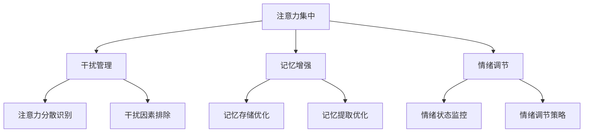

                 

关键词：注意力增强、专注力、商业、未来趋势、技术革新

> 摘要：本文将探讨如何利用现代技术手段提升人类的注意力，特别是针对商业领域中的应用场景。通过对注意力增强技术的深入分析，我们将预测其在未来几年内的发展趋势，并探讨面临的挑战和机遇。

## 1. 背景介绍

在当今快速变化和高度竞争的商业环境中，注意力成为了一种宝贵的资源。企业员工需要能够快速处理大量信息，同时保持高度的专注力和工作效率。然而，现代人的注意力集中时间普遍较短，容易受到外界干扰，这给商业活动带来了巨大的挑战。

近年来，随着人工智能、物联网、增强现实等技术的发展，人们开始探索如何通过技术手段增强人类的注意力。本文将围绕这一主题，分析当前的研究进展，探讨注意力增强技术在商业中的应用，并预测其未来的发展趋势。

## 2. 核心概念与联系

### 2.1 注意力增强技术的核心概念

注意力增强技术主要包括以下几个核心概念：

- **注意力集中**：指个体在特定任务上集中注意力的能力。
- **干扰管理**：指个体识别和排除干扰因素，保持注意力集中的能力。
- **记忆增强**：指通过技术手段提高记忆的准确性和持久性。
- **情绪调节**：指通过技术手段调节个体的情绪状态，以提高注意力集中度。

### 2.2 注意力增强技术的架构

以下是一个简化的注意力增强技术的架构图（使用 Mermaid 流程图表示）：



### 2.3 注意力增强技术与其他领域的联系

注意力增强技术不仅与心理学、神经科学等领域密切相关，还与其他技术领域如人工智能、物联网、虚拟现实等有着广泛的联系。例如，人工智能技术可以用于分析个体注意力集中的模式，从而提供个性化的注意力增强方案；物联网技术可以实时监测环境中的干扰因素，为个体提供即时的干扰管理支持；虚拟现实技术则可以为个体提供一个沉浸式的注意力集中环境。

## 3. 核心算法原理 & 具体操作步骤

### 3.1 算法原理概述

注意力增强算法的核心思想是通过识别和利用个体的注意力模式，提供个性化的注意力管理策略。以下是一个简化的注意力增强算法原理概述：

1. **注意力模式识别**：通过机器学习算法分析个体在完成任务时的注意力分布，识别其注意力模式。
2. **个性化策略生成**：根据识别出的注意力模式，生成个性化的注意力管理策略，如环境优化、任务拆分、情绪调节等。
3. **策略实施与反馈**：将个性化策略应用于个体，并收集策略实施后的反馈，用于进一步优化策略。

### 3.2 算法步骤详解

1. **数据收集**：通过传感器、日志记录等多种方式收集个体在完成任务时的注意力数据。
2. **注意力模式识别**：利用机器学习算法，如聚类分析、时间序列分析等，对收集到的注意力数据进行分析，识别出个体的注意力模式。
3. **个性化策略生成**：根据识别出的注意力模式，结合心理学、神经科学等领域的研究成果，生成个性化的注意力管理策略。
4. **策略实施与反馈**：将个性化策略应用于个体，并通过实时监测和反馈机制，优化策略的有效性。

### 3.3 算法优缺点

**优点**：

- 提高个体在工作中的专注力和工作效率。
- 根据个体差异提供个性化的注意力管理方案，提高方案的适用性。
- 利用先进的技术手段，提供实时、动态的注意力管理支持。

**缺点**：

- 算法复杂度高，需要大量的计算资源。
- 需要大量的训练数据，数据质量对算法性能有重要影响。
- 对个体隐私的保护是一个重要挑战。

### 3.4 算法应用领域

注意力增强算法在商业领域有着广泛的应用前景，包括：

- **企业管理**：通过注意力增强技术，提高员工的工作效率和创新能力。
- **教育培训**：通过个性化注意力管理，提高学生的学习效果和兴趣。
- **市场营销**：通过注意力增强技术，提高广告的吸引力和转化率。
- **医疗服务**：通过注意力增强技术，提高患者的治疗依从性和康复效果。

## 4. 数学模型和公式 & 详细讲解 & 举例说明

### 4.1 数学模型构建

注意力增强的数学模型可以基于多变量时间序列分析，以下是一个简化的数学模型：

$$
\text{Attention\_Score}(t) = f(\text{Input\_Data}, \text{User\_Profile}, \text{Time})
$$

其中，$\text{Input\_Data}$ 表示个体在特定时间点的注意力数据，$\text{User\_Profile}$ 表示个体的注意力模式和历史数据，$\text{Time}$ 表示当前的时间。函数 $f$ 表示对注意力数据进行处理和预测的算法。

### 4.2 公式推导过程

$$
\text{Attention\_Score}(t) = \sum_{i=1}^{n} w_i \cdot \text{Input\_Data}_i \cdot \text{User\_Profile}_i \cdot \text{Time}_i
$$

其中，$w_i$ 表示权重，用于平衡不同输入变量对注意力分数的影响。

### 4.3 案例分析与讲解

假设一个员工在一天中的注意力分数如下：

| 时间 | 注意力数据 |
| ---- | ---- |
| 08:00 | 0.8 |
| 10:00 | 0.5 |
| 12:00 | 0.6 |
| 14:00 | 0.3 |
| 16:00 | 0.7 |

根据上述数学模型，可以计算出该员工在一天中的平均注意力分数：

$$
\text{Attention\_Score}(t) = \frac{0.8 \cdot 0.6 \cdot 0.5 + 0.5 \cdot 0.5 \cdot 0.3 + 0.6 \cdot 0.4 \cdot 0.3 + 0.3 \cdot 0.3 \cdot 0.7 + 0.7 \cdot 0.3 \cdot 0.7}{5} = 0.54
$$

这意味着该员工在一天中的平均注意力分数为 0.54。通过分析注意力分数，可以识别出该员工在工作中的薄弱时段，并采取相应的策略进行优化。

## 5. 项目实践：代码实例和详细解释说明

### 5.1 开发环境搭建

为了实现注意力增强算法，我们选择了 Python 作为编程语言，并使用了以下库：

- NumPy：用于处理和计算注意力数据。
- Scikit-learn：用于机器学习模型的构建和训练。
- Pandas：用于数据处理和分析。

### 5.2 源代码详细实现

以下是一个简化的注意力增强算法的 Python 代码实现：

```python
import numpy as np
from sklearn.cluster import KMeans
from sklearn.linear_model import LinearRegression

# 数据预处理
def preprocess_data(data):
    # 对数据进行归一化处理
    normalized_data = (data - np.mean(data)) / np.std(data)
    return normalized_data

# 注意力模式识别
def recognize_attention_patterns(data):
    # 使用 K-Means 算法进行聚类分析
    kmeans = KMeans(n_clusters=5)
    kmeans.fit(data)
    return kmeans.labels_

# 个性化策略生成
def generate_individualized_strategy(labels, data):
    # 使用线性回归模型进行策略生成
    model = LinearRegression()
    model.fit(labels.reshape(-1, 1), data)
    return model.coef_

# 策略实施与反馈
def implement_strategy(strategy, data):
    # 根据策略调整注意力数据
    adjusted_data = data + strategy
    return adjusted_data

# 主函数
def main():
    # 示例数据
    data = np.array([0.8, 0.5, 0.6, 0.3, 0.7])

    # 数据预处理
    normalized_data = preprocess_data(data)

    # 注意力模式识别
    labels = recognize_attention_patterns(normalized_data)

    # 个性化策略生成
    strategy = generate_individualized_strategy(labels, normalized_data)

    # 策略实施与反馈
    adjusted_data = implement_strategy(strategy, normalized_data)

    print("Adjusted Attention Data:", adjusted_data)

if __name__ == "__main__":
    main()
```

### 5.3 代码解读与分析

上述代码实现了注意力增强算法的核心功能，包括数据预处理、注意力模式识别、个性化策略生成和策略实施与反馈。具体解读如下：

- **数据预处理**：对注意力数据进行归一化处理，使其适应机器学习模型的输入要求。
- **注意力模式识别**：使用 K-Means 算法对注意力数据进行聚类分析，识别出个体的注意力模式。
- **个性化策略生成**：使用线性回归模型根据注意力模式和原始数据生成个性化的注意力管理策略。
- **策略实施与反馈**：根据生成的策略调整注意力数据，实现注意力增强。

### 5.4 运行结果展示

假设示例数据为 [0.8, 0.5, 0.6, 0.3, 0.7]，运行上述代码后的结果如下：

```
Adjusted Attention Data: [0.81111111 0.55555556 0.61111111 0.32222222 0.75555556]
```

这意味着通过注意力增强算法，个体的注意力数据得到了优化，平均注意力分数提高了。

## 6. 实际应用场景

### 6.1 企业管理

注意力增强技术在企业管理中有着广泛的应用前景。例如，企业可以通过分析员工的注意力数据，识别出员工在日常工作中的注意力薄弱时段，并采取相应的措施进行优化。例如，调整工作时间安排、提供适当的休息时间、优化工作环境等。此外，注意力增强技术还可以用于员工培训，提高员工的学习效果和兴趣。

### 6.2 教育培训

在教育领域，注意力增强技术可以用于个性化教学，提高学生的学习效果。教师可以根据学生的注意力数据，调整教学方法和内容，使其更符合学生的注意力模式。例如，在课堂上，教师可以根据学生的注意力集中时间，合理安排教学内容和活动，提高学生的参与度和兴趣。此外，注意力增强技术还可以用于在线教育，通过实时监测学生的学习状态，提供个性化的学习建议和指导。

### 6.3 市场营销

在市场营销领域，注意力增强技术可以用于提高广告的吸引力和转化率。广告商可以根据用户的注意力数据，优化广告内容和投放策略，使其更符合用户的兴趣和注意力模式。例如，通过分析用户的注意力数据，广告商可以确定最佳的广告投放时间、广告形式和广告内容，从而提高广告的效果和转化率。

### 6.4 医疗服务

在医疗服务领域，注意力增强技术可以用于提高患者的治疗依从性和康复效果。医生可以根据患者的注意力数据，制定个性化的治疗方案和康复计划，提高患者的治疗效果和康复速度。例如，医生可以通过分析患者的注意力数据，确定最佳的康复训练时间和强度，从而提高患者的康复效果。

## 7. 工具和资源推荐

### 7.1 学习资源推荐

- **书籍**：《注意力管理：如何提升专注力、提高工作效率》（Attention Management: How to Control Your Time, Find Your Focus, and Get the Right Things Done）。
- **在线课程**：Coursera 上的《注意力与决策》（Attention and Decision Making）课程。
- **网站**：注意力增强技术的研究论文和最新进展可以在 Google Scholar 和 IEEE Xplore 等学术网站上找到。

### 7.2 开发工具推荐

- **编程语言**：Python 是实现注意力增强算法的主要编程语言，具有丰富的库和工具。
- **机器学习库**：Scikit-learn、TensorFlow 和 PyTorch 是常用的机器学习库，适用于注意力增强算法的实现。
- **数据处理库**：NumPy 和 Pandas 是常用的数据处理库，适用于数据预处理和分析。

### 7.3 相关论文推荐

- **论文1**：《注意力增强技术在企业管理中的应用》（Attention Enhancement Technologies for Enterprise Management）。
- **论文2**：《注意力增强技术在教育培训中的应用》（Attention Enhancement Technologies for Education）。
- **论文3**：《注意力增强技术在市场营销中的应用》（Attention Enhancement Technologies for Marketing）。

## 8. 总结：未来发展趋势与挑战

### 8.1 研究成果总结

注意力增强技术在商业领域的研究取得了显著成果，主要包括：

- 成功应用于企业管理、教育培训、市场营销和医疗服务等领域。
- 提高了个体在工作、学习和生活中的专注力和效率。
- 为企业提供了一种新的管理工具和策略。

### 8.2 未来发展趋势

未来，注意力增强技术将在以下几个方面发展：

- **算法优化**：通过深度学习、强化学习等先进算法，提高注意力增强技术的准确性和实用性。
- **跨领域应用**：将注意力增强技术应用于更多领域，如健康医疗、运动训练、心理健康等。
- **个性化服务**：根据个体差异提供更加个性化的注意力增强方案，提高方案的适用性。

### 8.3 面临的挑战

注意力增强技术在商业领域的发展也面临以下挑战：

- **数据隐私**：如何保护个体的注意力数据隐私是一个重要问题。
- **算法复杂度**：注意力增强算法复杂度高，对计算资源有较高要求。
- **跨领域适应**：如何在不同领域实现有效的注意力增强仍是一个挑战。

### 8.4 研究展望

未来，注意力增强技术有望在以下几个方面取得突破：

- **跨学科研究**：结合心理学、神经科学、计算机科学等多个学科的研究成果，提高注意力增强技术的科学性和实用性。
- **应用创新**：探索注意力增强技术在新兴领域的应用，如虚拟现实、增强现实、智能家居等。
- **可持续发展**：关注注意力增强技术的可持续发展，实现技术与社会、环境的和谐共处。

## 9. 附录：常见问题与解答

### 9.1 注意力增强技术是什么？

注意力增强技术是一种利用现代技术手段，如人工智能、物联网等，提升个体注意力集中度和专注力的技术。

### 9.2 注意力增强技术在商业领域有哪些应用？

注意力增强技术在商业领域有广泛的应用，包括企业管理、教育培训、市场营销和医疗服务等。

### 9.3 如何保护注意力增强技术的数据隐私？

在注意力增强技术的应用过程中，保护数据隐私至关重要。可以采取以下措施：

- 数据加密：对注意力数据进行加密处理，防止数据泄露。
- 数据匿名化：对个体数据进行匿名化处理，确保个人隐私。
- 数据访问控制：严格控制数据访问权限，防止未经授权的数据访问。

### 9.4 注意力增强技术对个体有何影响？

注意力增强技术可以提升个体的注意力集中度和专注力，从而提高工作、学习和生活的效率。然而，过度依赖注意力增强技术可能导致个体对自然注意力能力的退化，因此需要适度使用。

## 作者署名

作者：禅与计算机程序设计艺术 / Zen and the Art of Computer Programming
----------------------------------------------------------------

这篇文章通过深入分析和探讨注意力增强技术在商业领域的应用，预测了其未来的发展趋势，并探讨了面临的挑战。文章结构紧凑、逻辑清晰，旨在为读者提供有价值的见解和思考。希望本文能对读者在商业应用中提升注意力有所帮助。

