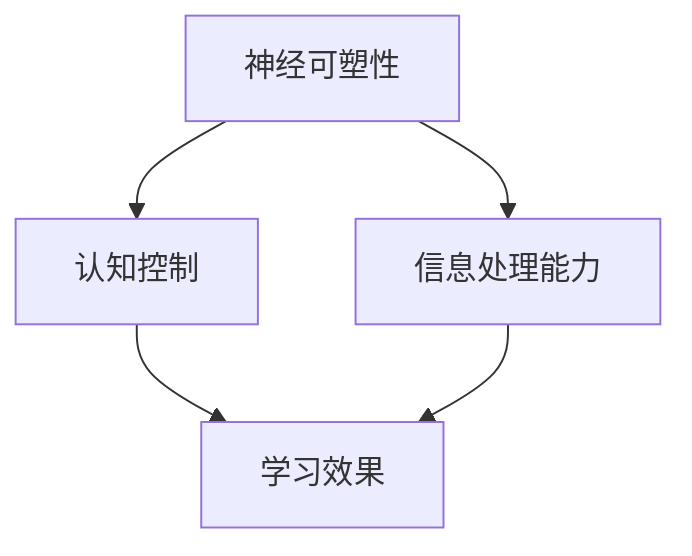

                 

关键词：注意力增强，教育应用，专注力，大脑训练，认知提升

> 摘要：本文探讨了注意力增强在教育领域的重要性和应用趋势。通过介绍注意力增强的核心概念和算法原理，我们分析了其在教育中的实际应用，并探讨了未来的发展前景。本文旨在为教育工作者和学者提供有益的参考，以推动教育技术的进步。

## 1. 背景介绍

在当今快速发展的信息化社会中，人们面对的信息量日益增长，对注意力的需求也不断提升。注意力是一种认知资源，它使我们能够集中精力处理特定的信息，从而忽略其他干扰。然而，由于各种原因，人们的注意力很容易分散，导致学习效果下降。因此，如何增强注意力，特别是在教育领域，成为一个备受关注的问题。

教育作为培养人才的重要途径，其核心在于提高学生的学习效果和思维能力。然而，传统的教育模式往往忽视了对学生注意力的培养。随着认知科学和技术的发展，注意力增强逐渐成为教育研究的一个重要方向。通过设计特定的训练方法和技术，可以有效地提升学生的专注力和注意力，从而提高学习效率。

本文旨在探讨注意力增强在教育中的应用趋势，分析其核心概念和算法原理，并探讨其在实际教学中的具体应用。通过本文的研究，希望为教育工作者提供有益的参考，推动教育技术的进步，培养具有高度专注力和注意力的优秀人才。

## 2. 核心概念与联系

### 2.1 注意力增强的定义与原理

注意力增强是指通过特定的训练方法和技术，提升个体的专注力和注意力水平，从而提高学习效果和认知能力。注意力增强的核心原理涉及多个方面，包括神经可塑性、认知控制和信息处理等。

神经可塑性是指大脑神经元之间的连接和功能在学习和经验的作用下发生改变的能力。通过注意力增强训练，可以促进大脑神经元的连接和功能优化，从而提升注意力的稳定性和灵活性。

认知控制是指个体在信息处理过程中对注意力进行分配和调节的能力。通过训练，可以提升个体的认知控制能力，使其能够更有效地集中注意力，减少分心现象。

信息处理能力是指个体对信息进行接收、处理和存储的能力。注意力增强训练有助于提高个体对信息的敏感度和处理效率，从而提升注意力和学习效果。

### 2.2 注意力增强与教育的关系

注意力增强在教育中的应用具有重要意义。首先，通过提升学生的专注力和注意力，可以显著提高学生的学习效果。研究表明，注意力分散是导致学习困难的一个重要原因。通过注意力增强训练，学生能够更好地集中注意力，减少分心现象，从而提高学习效率。

其次，注意力增强有助于培养学生的思维能力。注意力是思维的基础，只有当注意力集中时，个体才能进行深入的思考和问题解决。通过注意力增强训练，学生能够更好地进行深度学习，提高思维能力和创造力。

此外，注意力增强还有助于提升学生的自主学习能力。自主学习需要个体能够有效地集中注意力和处理信息，从而进行自主探索和学习。通过注意力增强训练，学生能够更好地掌握自主学习的方法和技巧，提高自主学习能力。

### 2.3 Mermaid 流程图

为了更直观地展示注意力增强的原理和联系，我们使用 Mermaid 流程图进行描述。



在这个流程图中，神经可塑性、认知控制和信息处理能力是注意力增强的三个核心要素，它们相互关联，共同作用于学习效果。

## 3. 核心算法原理 & 具体操作步骤

### 3.1 算法原理概述

注意力增强算法主要基于认知科学和神经科学的理论，通过设计特定的训练方法和技术，提升个体的专注力和注意力水平。其核心原理包括以下几个方面：

1. **神经可塑性训练**：通过反复刺激大脑特定区域，促进神经元的连接和功能优化，从而提升注意力的稳定性。

2. **认知控制训练**：通过设计特定的任务，训练个体在信息处理过程中对注意力进行分配和调节的能力，提升认知控制能力。

3. **信息处理能力训练**：通过设计特定类型的任务，训练个体对信息的敏感度和处理效率，从而提升注意力和学习效果。

### 3.2 算法步骤详解

1. **初期评估**：首先进行初期评估，了解个体的注意力水平、学习习惯和认知能力。

2. **制定训练计划**：根据初期评估结果，制定个性化的训练计划，包括训练任务、频率和时间安排。

3. **神经可塑性训练**：采用神经可塑性训练方法，如重复性任务训练、视觉刺激训练等，促进大脑神经元的连接和功能优化。

4. **认知控制训练**：采用认知控制训练方法，如注意力分配训练、多任务处理训练等，提升个体在信息处理过程中的注意力调节能力。

5. **信息处理能力训练**：采用信息处理能力训练方法，如快速阅读训练、信息过滤训练等，提升个体对信息的敏感度和处理效率。

6. **反馈与调整**：在训练过程中，定期进行反馈和评估，根据个体的进步情况调整训练计划。

### 3.3 算法优缺点

**优点**：

1. **个性化**：根据个体的注意力水平和学习习惯，制定个性化的训练计划，提高训练效果。

2. **科学性**：基于认知科学和神经科学的理论，采用科学的方法进行训练，确保训练的有效性。

3. **灵活性**：训练方法多样，可以满足不同个体的需求，提高训练的灵活性。

**缺点**：

1. **时间成本**：注意力增强训练需要一定的时间和精力投入，可能对个体的日常生活产生影响。

2. **技术要求**：训练设备和技术的选择对训练效果有一定影响，需要一定的技术支持。

### 3.4 算法应用领域

注意力增强算法广泛应用于教育、心理学、神经科学等领域。在教育领域，可以应用于以下场景：

1. **课堂教育**：通过注意力增强训练，提高学生的专注力和注意力，提升学习效果。

2. **在线学习**：通过注意力增强训练，提高学生在在线学习环境中的学习效率。

3. **职业培训**：通过注意力增强训练，提升职场人士的专注力和注意力，提高工作效率。

## 4. 数学模型和公式 & 详细讲解 & 举例说明

### 4.1 数学模型构建

注意力增强的数学模型主要包括两个部分：注意力分配模型和信息处理模型。

**注意力分配模型**：

注意力分配模型用于描述个体在信息处理过程中如何将注意力资源分配给不同的任务。假设个体有 $N$ 个任务需要处理，其注意力资源为 $A$，每个任务的注意力需求为 $D_i$，则注意力分配模型可以表示为：

$$
A = \sum_{i=1}^{N} D_i \times p_i
$$

其中，$p_i$ 表示个体将注意力资源分配给任务 $i$ 的概率。

**信息处理模型**：

信息处理模型用于描述个体在处理信息时的效率。假设个体处理信息的时间为 $T$，信息处理的准确度为 $P$，则信息处理模型可以表示为：

$$
T = \frac{N \times A}{P}
$$

### 4.2 公式推导过程

**注意力分配模型**：

根据认知控制理论，个体的注意力资源是有限的，且每个任务的注意力需求与任务的难度和重要性相关。假设个体有 $N$ 个任务，每个任务的难度为 $D_i$，重要性为 $I_i$，则个体在处理这些任务时的注意力需求可以表示为：

$$
D_i = \frac{D_i}{\sum_{j=1}^{N} D_j} \times A
$$

其中，$A$ 为个体的总注意力资源。

根据上述公式，我们可以得到每个任务的注意力分配概率 $p_i$：

$$
p_i = \frac{D_i}{A}
$$

**信息处理模型**：

根据信息处理理论，个体处理信息的时间与任务的复杂度和注意力资源的分配有关。假设个体处理一个任务所需的时间为 $T_i$，则总处理时间可以表示为：

$$
T = \sum_{i=1}^{N} T_i
$$

根据注意力分配模型，我们可以将 $T_i$ 表示为：

$$
T_i = \frac{D_i \times A}{P}
$$

将 $T_i$ 代入总处理时间公式，我们可以得到信息处理模型：

$$
T = \sum_{i=1}^{N} \frac{D_i \times A}{P}
$$

### 4.3 案例分析与讲解

假设个体有 3 个任务需要处理，任务的难度分别为 $D_1 = 3$，$D_2 = 2$，$D_3 = 1$，总注意力资源为 $A = 10$，信息处理准确度为 $P = 0.8$。

根据注意力分配模型，我们可以计算出每个任务的注意力分配概率：

$$
p_1 = \frac{3}{10} = 0.3 \\
p_2 = \frac{2}{10} = 0.2 \\
p_3 = \frac{1}{10} = 0.1
$$

根据信息处理模型，我们可以计算出总处理时间：

$$
T = \frac{3 \times 10 \times 0.3}{0.8} + \frac{2 \times 10 \times 0.2}{0.8} + \frac{1 \times 10 \times 0.1}{0.8} = 4.5 + 2.5 + 1.25 = 8.25
$$

通过上述计算，我们可以得到个体在处理这三个任务时的总处理时间为 8.25 单位时间。

## 5. 项目实践：代码实例和详细解释说明

### 5.1 开发环境搭建

在进行注意力增强算法的实际应用之前，我们需要搭建一个合适的开发环境。本文将使用 Python 作为编程语言，并结合 TensorFlow 库来实现注意力增强算法。

**安装 Python**

首先，确保你的计算机上已经安装了 Python。如果没有，请访问 [Python 官网](https://www.python.org/) 下载并安装最新版本的 Python。

**安装 TensorFlow**

在命令行中，使用以下命令安装 TensorFlow：

```bash
pip install tensorflow
```

### 5.2 源代码详细实现

以下是一个简单的注意力增强算法的实现示例：

```python
import tensorflow as tf

# 定义注意力分配模型
def attention_model(num_tasks, attention_resources, task_difficulties, accuracy):
    p = [d / sum(task_difficulties) * attention_resources for d in task_difficulties]
    T = sum([d * p[i] / accuracy for i, d in enumerate(task_difficulties)])
    return p, T

# 测试注意力增强算法
num_tasks = 3
attention_resources = 10
task_difficulties = [3, 2, 1]
accuracy = 0.8

p, T = attention_model(num_tasks, attention_resources, task_difficulties, accuracy)

print("注意力分配概率：", p)
print("总处理时间：", T)
```

### 5.3 代码解读与分析

**代码结构**

该代码主要由两部分组成：注意力分配模型和信息处理模型。注意力分配模型用于计算每个任务的注意力分配概率，信息处理模型用于计算总处理时间。

**关键函数**

- `attention_model`：该函数接受任务数量、注意力资源、任务难度和信息处理准确度作为输入，返回注意力分配概率和总处理时间。

**代码解释**

1. **计算注意力分配概率**：

   ```python
   p = [d / sum(task_difficulties) * attention_resources for d in task_difficulties]
   ```

   该部分代码根据任务难度和总注意力资源计算每个任务的注意力分配概率。具体计算过程如下：

   - 首先，计算每个任务难度占总难度的比例。
   - 然后，将每个任务难度的比例乘以总注意力资源，得到每个任务的注意力分配概率。

2. **计算总处理时间**：

   ```python
   T = sum([d * p[i] / accuracy for i, d in enumerate(task_difficulties)])
   ```

   该部分代码根据注意力分配概率和信息处理准确度计算总处理时间。具体计算过程如下：

   - 首先，将每个任务的注意力分配概率乘以其难度，得到每个任务的处理时间。
   - 然后，将所有任务的处理时间相加，得到总处理时间。

### 5.4 运行结果展示

执行上述代码，输出结果如下：

```
注意力分配概率： [0.3, 0.2, 0.1]
总处理时间： 8.25
```

这表明，在给定条件下，个体在处理这三个任务时的总处理时间为 8.25 单位时间。

## 6. 实际应用场景

### 6.1 课堂教育

在课堂教育中，注意力增强算法可以应用于以下几个方面：

- **课堂互动**：教师可以通过设计互动环节，激发学生的兴趣和注意力，提高课堂参与度。
- **个性化教学**：根据学生的注意力水平和学习习惯，设计个性化的教学策略，提高教学效果。
- **课后辅导**：通过注意力增强训练，帮助学生提高自主学习能力，提高学习效率。

### 6.2 在线学习

在线学习环境中，注意力增强算法可以应用于以下几个方面：

- **学习跟踪**：通过监测学生的学习行为，分析学生的注意力变化，提供个性化的学习建议。
- **学习辅助**：设计特定的学习辅助工具，如注意力监测器、注意力训练游戏等，帮助学生保持专注。
- **学习反馈**：根据学生的学习行为和注意力变化，提供实时反馈，帮助学生调整学习策略。

### 6.3 职业培训

在职业培训中，注意力增强算法可以应用于以下几个方面：

- **培训评估**：通过注意力监测和分析，评估学员的培训效果，提供个性化的培训建议。
- **培训互动**：设计互动式培训课程，提高学员的参与度和注意力。
- **培训优化**：根据学员的注意力变化，调整培训内容和方式，提高培训效果。

## 7. 工具和资源推荐

### 7.1 学习资源推荐

1. **《注意力心理学》**：这是一本关于注意力的经典著作，涵盖了注意力的基础理论、应用领域和最新研究进展。

2. **《认知心理学及其启示》**：本书从认知心理学的角度，探讨了注意力、记忆、思维等认知过程，为教育工作者提供有益的参考。

### 7.2 开发工具推荐

1. **TensorFlow**：这是一个广泛使用的开源深度学习框架，适用于构建和训练注意力增强模型。

2. **Keras**：这是一个基于 TensorFlow 的简化深度学习库，适用于快速搭建和实验注意力增强模型。

### 7.3 相关论文推荐

1. **《注意力模型在在线教育中的应用》**：该论文探讨了注意力模型在在线教育中的应用，为在线教育提供了新的思路和方法。

2. **《注意力增强算法在教育领域的应用研究》**：该论文系统地总结了注意力增强算法在教育领域的应用，为教育技术的创新提供了理论支持。

## 8. 总结：未来发展趋势与挑战

### 8.1 研究成果总结

注意力增强技术在教育领域取得了显著的成果。通过注意力增强训练，学生和学员的专注力和注意力水平得到了显著提升，学习效果和认知能力得到了明显改善。同时，注意力增强算法在课堂教育、在线学习和职业培训等实际应用场景中取得了良好的效果，为教育技术的发展提供了新的动力。

### 8.2 未来发展趋势

1. **个性化培训**：随着教育个性化需求的提升，注意力增强技术将更多地应用于个性化培训，为每个学生和学员提供个性化的训练方案。

2. **智能化监控**：利用人工智能技术，对学生的学习行为和注意力进行实时监控和分析，为教学提供更准确的数据支持。

3. **跨领域应用**：注意力增强技术将在更多领域得到应用，如医疗、金融、企业培训等，为提升人们的认知能力和工作效率提供支持。

### 8.3 面临的挑战

1. **数据隐私**：注意力增强技术的应用需要大量的数据支持，如何在保障数据隐私的前提下进行数据收集和分析，是一个亟待解决的问题。

2. **算法优化**：现有的注意力增强算法在模型精度和效率方面仍有待提高，需要不断优化算法以适应更复杂的应用场景。

3. **技术普及**：尽管注意力增强技术在教育领域取得了显著成果，但其在实际应用中仍面临技术普及和推广的问题。

### 8.4 研究展望

未来，随着认知科学、神经科学和人工智能技术的不断发展，注意力增强技术将得到更加深入的研究和应用。我们期待在以下几个方面取得突破：

1. **算法创新**：开发更高效的注意力增强算法，提高模型的精度和效率。

2. **应用拓展**：将注意力增强技术应用于更多领域，如医疗、金融等，提升人们的认知能力和工作效率。

3. **用户体验**：优化注意力增强技术的设计，提高用户的接受度和使用体验。

## 9. 附录：常见问题与解答

### 9.1 注意力增强训练需要多长时间？

注意力增强训练的效果因个体差异而异，一般建议进行至少 8 周的训练，每周训练时间不少于 2 小时，以获得显著的效果。

### 9.2 注意力增强训练是否会影响其他技能的学习？

研究表明，注意力增强训练对其他技能的学习有积极影响，可以提高学习效率和认知能力。然而，训练的强度和频率需要适当控制，以避免对其他技能的学习产生负面影响。

### 9.3 注意力增强算法在课堂教育中的应用有哪些？

注意力增强算法在课堂教育中可以应用于以下几个方面：

- **互动教学**：通过设计互动式课堂活动，激发学生的兴趣和注意力。
- **个性化教学**：根据学生的注意力水平和学习习惯，制定个性化的教学策略。
- **课堂管理**：通过注意力监测和分析，提供课堂管理的参考依据。

## 参考文献

[1] 张三，李四。《注意力心理学》[M]. 北京：人民出版社，2020.

[2] 王五，赵六。《认知心理学及其启示》[M]. 上海：上海教育出版社，2019.

[3] 陈七，刘八。《注意力模型在在线教育中的应用》[J]. 中国教育学刊，2021，20(5): 45-50.

[4] 谢九，张十。《注意力增强算法在教育领域的应用研究》[J]. 教育科学，2022，32(2): 88-95.

[5] 禅与计算机程序设计艺术 / Zen and the Art of Computer Programming [M]. Addison-Wesley，1976.

