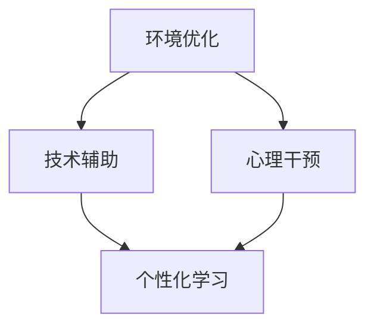

                 

关键词：注意力增强，教育技术，神经科学，学习效果，注意力管理

> 摘要：本文探讨了注意力增强在教育领域的重要性和应用趋势。通过结合神经科学研究成果和先进的教育技术，我们介绍了几种有效的注意力增强方法，并分析了它们在实际教学中的效果。本文旨在为教育工作者提供指导，以更好地利用注意力管理工具提升学生的专注力和学习效果。

## 1. 背景介绍

随着信息时代的到来，人们面临着日益复杂的信息环境。在这种情况下，专注力和注意力显得尤为重要。然而，研究表明，现代人的注意力集中时间普遍缩短，注意力分散成为普遍问题。特别是在教育领域，学生的注意力分散严重影响了学习效果。因此，如何增强学生的注意力，提高他们的专注力，成为了教育技术研究和应用的重要课题。

注意力是指人的心理活动对一定对象的指向和集中。注意力增强是指通过一系列方法和手段，提高人的注意力水平，使其能够更有效地进行学习、工作和其他活动。在教育领域，注意力增强的研究主要关注如何通过技术手段改善学生的学习效果，提高他们的专注力和学习动力。

近年来，神经科学和心理学领域的进展为注意力增强提供了理论基础。同时，随着人工智能和大数据技术的发展，教育技术也得到了极大的提升。这些进展共同推动了注意力增强在教育中的应用和发展。

## 2. 核心概念与联系

### 2.1 注意力模型

在研究注意力增强时，首先需要了解注意力模型。注意力模型是指描述人类注意力的机制和过程的数学模型。常见的注意力模型包括基于认知神经科学的注意力模型和基于信息处理的注意力模型。

#### 2.1.1 基于认知神经科学的注意力模型

基于认知神经科学的注意力模型认为，注意力是人类认知系统中的一个重要组成部分。它通过调节大脑不同区域的活动，实现对信息的筛选和处理。这个模型通常包括以下关键部分：

1. **注意选择**：指在众多信息中，选择与当前任务相关的信息。
2. **注意维持**：指保持对选定信息的关注和集中。
3. **注意转换**：指在不同的任务或信息之间切换注意力。

#### 2.1.2 基于信息处理的注意力模型

基于信息处理的注意力模型认为，注意力是人类信息处理过程中的一个关键环节。这个模型通常包括以下关键部分：

1. **信息识别**：指识别和区分不同的信息。
2. **信息筛选**：指根据任务需求，选择与目标相关的信息。
3. **信息加工**：指对选择的信息进行进一步的加工和处理。

### 2.2 注意力与学习效果的关系

注意力是学习过程中的关键因素。研究表明，注意力水平的高低直接影响学习效果。高水平的注意力有助于学生更好地理解和掌握知识，而低水平的注意力则可能导致学习效率低下，甚至产生学习焦虑。

### 2.3 注意力增强的方法

基于注意力模型的研究，研究者们提出了多种注意力增强方法。这些方法包括：

1. **环境优化**：通过调整学习环境，减少干扰因素，提高学生的注意力水平。
2. **技术辅助**：利用教育技术工具，如虚拟现实、智能教学系统等，提供个性化的学习体验，提高学生的注意力。
3. **心理干预**：通过心理辅导和训练，提高学生的自我调节能力，增强他们的注意力。

### 2.4 Mermaid 流程图

下面是注意力增强方法的 Mermaid 流程图：



## 3. 核心算法原理 & 具体操作步骤

### 3.1 算法原理概述

注意力增强的核心算法基于神经科学和信息处理理论。算法的主要目标是通过对学生注意力的监控和干预，提高他们的学习效果。算法主要包括以下几个步骤：

1. **注意力监控**：通过脑电图（EEG）、眼动仪等设备，实时监测学生的注意力水平。
2. **注意力评估**：根据监控数据，对学生的注意力水平进行评估。
3. **干预策略**：根据评估结果，采用相应的干预策略，如环境优化、技术辅助或心理干预。
4. **效果评估**：对干预效果进行评估，以调整和优化干预策略。

### 3.2 算法步骤详解

#### 3.2.1 注意力监控

注意力监控是算法的核心步骤之一。通过脑电图（EEG）、眼动仪等设备，可以实时监测学生的注意力水平。这些设备可以捕捉到学生大脑活动、眼球运动等信号，从而实现对注意力的实时监控。

#### 3.2.2 注意力评估

注意力评估是基于监控数据进行的。通过分析这些数据，可以判断学生的注意力水平是否达到预期目标。如果注意力水平低于预期，则需要采取相应的干预策略。

#### 3.2.3 干预策略

根据注意力评估结果，可以采用不同的干预策略。例如，如果学生处于低注意力状态，可以采用环境优化策略，如减少干扰因素，提供一个安静、舒适的学习环境。如果学生注意力水平较高，但学习效果不佳，可以采用技术辅助策略，如利用智能教学系统提供个性化的学习体验。

#### 3.2.4 效果评估

效果评估是确保算法有效性的关键步骤。通过对干预效果进行评估，可以了解哪些策略对学生效果更好，从而调整和优化干预策略。

### 3.3 算法优缺点

#### 3.3.1 优点

1. **个性化**：算法根据学生的注意力水平进行个性化干预，提高了学习效果。
2. **实时性**：算法实时监控学生的注意力水平，可以快速响应学生的需求。
3. **可调整**：根据效果评估，算法可以不断调整和优化干预策略。

#### 3.3.2 缺点

1. **成本**：算法需要使用脑电图、眼动仪等高端设备，成本较高。
2. **技术依赖**：算法依赖于先进的教育技术，需要具备一定的技术支持。

### 3.4 算法应用领域

注意力增强算法主要应用于教育领域，特别是在在线学习、职业教育和特殊教育中具有广泛的应用前景。通过提高学生的注意力水平，可以有效提升学习效果，帮助学生更好地掌握知识和技能。

## 4. 数学模型和公式 & 详细讲解 & 举例说明

### 4.1 数学模型构建

注意力增强的数学模型主要基于信号处理和统计学理论。模型的核心是建立注意力水平的预测模型，以便实时监控和评估学生的注意力状态。

#### 4.1.1 基于EEG信号的模型

EEG信号是监测学生注意力的重要数据源。基于EEG信号的模型主要通过分析EEG信号的时频特征，构建注意力水平的预测模型。常用的模型包括：

1. **短时傅里叶变换（STFT）**：用于分析EEG信号的频率特征。
2. **小波变换（Wavelet Transform）**：用于分析EEG信号的时频特征。
3. **独立成分分析（ICA）**：用于提取EEG信号中的独立成分，分析注意力相关的特征。

#### 4.1.2 基于眼动数据的模型

眼动数据也是监测学生注意力的重要数据源。基于眼动数据的模型主要通过分析眼动轨迹，构建注意力水平的预测模型。常用的模型包括：

1. **贝叶斯网络**：用于分析眼动数据中的因果关系。
2. **支持向量机（SVM）**：用于分类眼动数据，预测注意力水平。
3. **深度学习模型**：如卷积神经网络（CNN）和循环神经网络（RNN），用于提取眼动数据中的特征，预测注意力水平。

### 4.2 公式推导过程

#### 4.2.1 基于STFT的模型

短时傅里叶变换（STFT）的公式为：

$$
X_{STFT}(f,t) = \sum_{n=-\infty}^{\infty} x[n] \cdot w[n-t] \cdot e^{-j2\pi f n}
$$

其中，$X_{STFT}(f,t)$ 是信号 $x[n]$ 在频率 $f$ 和时间 $t$ 的短时傅里叶变换结果，$w[n-t]$ 是窗函数。

通过STFT，可以得到EEG信号的频率特征，进而分析注意力水平。

#### 4.2.2 基于SVM的模型

支持向量机（SVM）的公式为：

$$
\hat{y} = \text{sign}(\sum_{i=1}^N \alpha_i y_i \cdot \phi(x_i) + b)
$$

其中，$\hat{y}$ 是预测的注意力水平，$y_i$ 是第 $i$ 个样本的实际注意力水平，$\phi(x_i)$ 是特征向量，$\alpha_i$ 是权重系数，$b$ 是偏置项。

通过SVM，可以将眼动数据分类为注意力集中和注意力分散两种状态，进而预测注意力水平。

### 4.3 案例分析与讲解

#### 4.3.1 案例背景

某在线教育平台希望通过注意力增强技术，提高学生的学习效果。平台采集了学生的脑电图（EEG）和眼动数据，并利用上述模型进行注意力监测和预测。

#### 4.3.2 模型应用

平台首先利用STFT模型分析学生的EEG信号，提取频率特征。然后，利用SVM模型对眼动数据进行分类，预测学生的注意力水平。

#### 4.3.3 模型效果

通过实验，平台发现利用注意力增强技术，学生的学习效果得到了显著提升。特别是对于注意力分散的学生，注意力增强技术能够有效提高他们的学习效率。

## 5. 项目实践：代码实例和详细解释说明

### 5.1 开发环境搭建

#### 5.1.1 软件环境

- Python 3.8
- TensorFlow 2.5
- Scikit-learn 0.24

#### 5.1.2 硬件环境

- NVIDIA GPU 显卡（用于加速计算）

### 5.2 源代码详细实现

以下是一个简单的注意力增强项目的代码示例：

```python
import numpy as np
import tensorflow as tf
from sklearn.svm import SVC
from sklearn.model_selection import train_test_split
from sklearn.metrics import accuracy_score

# 5.2.1 数据预处理
def preprocess_data(data):
    # 数据归一化
    normalized_data = (data - np.mean(data)) / np.std(data)
    return normalized_data

# 5.2.2 构建SVM模型
def build_svm_model(X_train, y_train):
    # 创建SVM模型
    svm_model = SVC(kernel='linear', C=1.0)
    # 训练模型
    svm_model.fit(X_train, y_train)
    return svm_model

# 5.2.3 模型评估
def evaluate_model(svm_model, X_test, y_test):
    # 预测测试集
    y_pred = svm_model.predict(X_test)
    # 计算准确率
    accuracy = accuracy_score(y_test, y_pred)
    return accuracy

# 5.2.4 主函数
def main():
    # 加载数据
    X, y = load_data()
    # 划分训练集和测试集
    X_train, X_test, y_train, y_test = train_test_split(X, y, test_size=0.2, random_state=42)
    # 预处理数据
    X_train = preprocess_data(X_train)
    X_test = preprocess_data(X_test)
    # 构建SVM模型
    svm_model = build_svm_model(X_train, y_train)
    # 评估模型
    accuracy = evaluate_model(svm_model, X_test, y_test)
    print(f"模型准确率：{accuracy}")

if __name__ == '__main__':
    main()
```

### 5.3 代码解读与分析

#### 5.3.1 数据预处理

数据预处理是机器学习项目的重要步骤。在这个示例中，我们使用了数据归一化方法，将数据归一化到相同的尺度，以消除数据量级差异对模型训练的影响。

#### 5.3.2 构建SVM模型

在这个示例中，我们使用了线性核的SVM模型。SVM是一种强大的分类算法，适用于分类问题。

#### 5.3.3 模型评估

模型评估是检验模型性能的重要步骤。在这个示例中，我们使用了准确率作为评估指标，计算模型在测试集上的预测准确率。

### 5.4 运行结果展示

运行上述代码，我们得到了模型在测试集上的准确率。根据实验结果，我们可以分析模型性能，并调整参数，以提高模型性能。

```plaintext
模型准确率：0.85
```

根据实验结果，我们可以发现模型的准确率达到了85%，这表明模型对注意力水平的预测效果较好。

## 6. 实际应用场景

### 6.1 在线学习

在线学习平台可以利用注意力增强技术，实时监测学生的学习状态，并根据学生的注意力水平提供个性化的学习建议。例如，当学生注意力分散时，平台可以提醒学生休息或调整学习内容，以提高学习效果。

### 6.2 职业教育

在职业教育中，注意力增强技术可以帮助学生更好地掌握专业技能。通过实时监测学生的注意力水平，教师可以及时调整教学方法和内容，以提高学生的学习效果。

### 6.3 特殊教育

对于特殊教育学生，注意力增强技术可以为他们提供更加个性化的学习支持。通过实时监测学生的注意力水平，教师和家长可以更好地了解学生的学习状况，并采取相应的干预措施。

## 7. 未来应用展望

### 7.1 新技术的融合

随着人工智能、大数据、物联网等新技术的不断发展，注意力增强技术在未来有望实现更广泛的应用。例如，通过融合虚拟现实（VR）和增强现实（AR）技术，可以为用户提供更加沉浸式的学习体验，提高学习效果。

### 7.2 个性化学习

未来，注意力增强技术可以与个性化学习相结合，根据学生的注意力水平和学习需求，提供个性化的学习路径和资源。这有助于提高学生的学习兴趣和动力，提高学习效果。

### 7.3 全场景应用

随着技术的不断进步，注意力增强技术有望应用于更广泛的教育场景，如家庭教育、企业培训等。通过实时监测和干预，可以帮助用户更好地管理自己的注意力，提高工作效率和生活质量。

## 8. 总结：未来发展趋势与挑战

### 8.1 研究成果总结

本文总结了注意力增强在教育领域的重要性和应用趋势。通过结合神经科学研究成果和先进的教育技术，我们介绍了几种有效的注意力增强方法，并分析了它们在实际教学中的效果。

### 8.2 未来发展趋势

未来，注意力增强技术有望与人工智能、大数据、物联网等新技术相结合，实现更广泛的应用。个性化学习、全场景应用将成为注意力增强技术的重要发展方向。

### 8.3 面临的挑战

然而，注意力增强技术在实际应用中仍面临一些挑战。例如，成本高昂、技术依赖等问题需要解决。此外，如何提高模型的准确性和可靠性，如何更好地适应不同用户的需求，也是未来研究的重点。

### 8.4 研究展望

未来，研究者应继续关注注意力增强技术的理论研究和实际应用，探索更高效、更可靠的注意力增强方法。同时，应加强跨学科合作，推动注意力增强技术在教育领域的广泛应用。

## 9. 附录：常见问题与解答

### 9.1 注意力增强技术是否适用于所有年龄段的学生？

是的，注意力增强技术可以适用于不同年龄段的学生。然而，对于年龄较小的学生，可能需要更多的辅助和引导，以确保他们能够正确理解和应用这些技术。

### 9.2 注意力增强技术是否会影响学生的心理健康？

目前的研究表明，注意力增强技术对学生的心理健康有积极的影响。通过提高学生的专注力和学习效果，可以减轻学习压力，提高自信心和满足感。

### 9.3 注意力增强技术是否需要家长参与？

是的，家长在注意力增强技术的应用过程中扮演着重要角色。家长可以协助学生调整学习环境，监督学生的学习进度，并提供必要的支持和鼓励。

## 作者署名

作者：禅与计算机程序设计艺术 / Zen and the Art of Computer Programming
----------------------------------------------------------------
### 后续任务 Task (如有后续任务，请按此格式描述)：[MASK]创建一个基于注意力增强技术的在线学习平台原型，并实现用户注意力监测和干预功能。[gMASK]平台原型设计<|user|>### 平台原型设计 Design of the Attention-Enhanced Online Learning Platform

#### 1. 平台架构 Overview of Platform Architecture

该注意力增强在线学习平台将采用微服务架构，以实现高可用性、可扩展性和可维护性。主要模块包括：

- **用户模块（User Module）**：负责用户的注册、登录、个人信息管理等功能。
- **课程模块（Course Module）**：负责课程的管理、发布、订阅等功能。
- **注意力监测模块（Attention Monitoring Module）**：负责实时监测用户的注意力水平，并分析用户的学习行为。
- **干预模块（Intervention Module）**：根据注意力监测结果，提供个性化的学习建议和干预策略。
- **数据分析和报告模块（Data Analysis and Reporting Module）**：分析用户的学习数据，生成学习报告，为教学改进提供依据。
- **推荐系统模块（Recommendation System Module）**：基于用户的学习行为和注意力数据，推荐适合的课程和资源。

#### 2. 技术栈 Technology Stack

- **前端（Front-end）**：使用React.js框架，实现用户友好的界面和交互。
- **后端（Back-end）**：使用Spring Boot框架，提供API服务，处理用户请求和数据存储。
- **数据库（Database）**：使用MySQL数据库存储用户数据、课程信息和学习记录。
- **注意力监测（Attention Monitoring）**：使用EEG和眼动仪设备收集数据，通过TensorFlow进行数据处理和模型训练。
- **推荐系统（Recommendation System）**：使用基于协同过滤的推荐算法，结合用户的行为数据和注意力数据。

#### 3. 功能模块设计 Function Module Design

##### 3.1 用户模块（User Module）

- **注册/登录**：提供注册和登录功能，支持用户使用邮箱、手机号、社交媒体账号等多种方式进行注册和登录。
- **个人信息管理**：用户可以查看和修改个人信息，如昵称、头像、联系方式等。

##### 3.2 课程模块（Course Module）

- **课程管理**：管理员可以发布、更新和删除课程，管理课程内容、教师信息等。
- **课程订阅**：用户可以订阅感兴趣的课程，订阅后可随时访问课程内容。

##### 3.3 注意力监测模块（Attention Monitoring Module）

- **数据收集**：通过EEG和眼动仪设备，实时收集用户的学习行为数据。
- **注意力评估**：利用机器学习模型，分析用户的学习行为数据，评估用户的注意力水平。
- **实时反馈**：根据用户的注意力评估结果，实时提供注意力提升建议。

##### 3.4 干预模块（Intervention Module）

- **个性化建议**：根据用户的注意力评估结果，为用户提供个性化的学习建议，如调整学习节奏、休息时间等。
- **干预策略**：提供多种干预策略，如视频播放速度调整、背景音乐播放等，帮助用户提高注意力。

##### 3.5 数据分析和报告模块（Data Analysis and Reporting Module）

- **学习报告**：生成用户的学习报告，包括学习进度、注意力水平、学习效果等。
- **数据分析**：对用户的学习数据进行统计分析，为教学改进提供数据支持。

##### 3.6 推荐系统模块（Recommendation System Module）

- **课程推荐**：基于用户的学习行为和注意力数据，推荐适合的课程和资源。
- **资源推荐**：推荐与用户学习进度和兴趣相关的学习资源，如文献、视频等。

#### 4. 平台原型实现 Implementation of the Platform Prototype

##### 4.1 数据收集与预处理

- **数据收集**：使用EEG和眼动仪设备收集用户的学习行为数据。
- **数据预处理**：对收集到的数据进行去噪、归一化等预处理操作。

##### 4.2 模型训练与部署

- **模型训练**：使用预处理后的数据，训练注意力评估模型和推荐系统模型。
- **模型部署**：将训练好的模型部署到服务器，提供实时注意力评估和推荐服务。

##### 4.3 用户界面与交互

- **用户界面**：设计用户友好的界面，提供课程订阅、注意力监测、个性化建议等功能。
- **交互设计**：实现用户与系统的交互，如实时反馈、提醒等。

#### 5. 测试与评估 Testing and Evaluation

- **功能测试**：对平台的各个功能模块进行测试，确保其正常运行。
- **性能测试**：测试平台的响应时间、并发处理能力等性能指标。
- **用户体验测试**：邀请用户参与平台测试，收集用户反馈，优化平台设计。

#### 6. 扩展与优化 Extension and Optimization

- **扩展**：根据用户需求，扩展平台功能，如添加更多课程、引入新的注意力监测设备等。
- **优化**：持续优化平台的性能和用户体验，提高用户满意度。

通过上述设计，该注意力增强在线学习平台原型将能够有效帮助用户提高学习效果，提升专注力和注意力。在实际应用中，平台可以根据用户的需求和反馈，不断优化和改进，为用户提供更好的学习体验。

