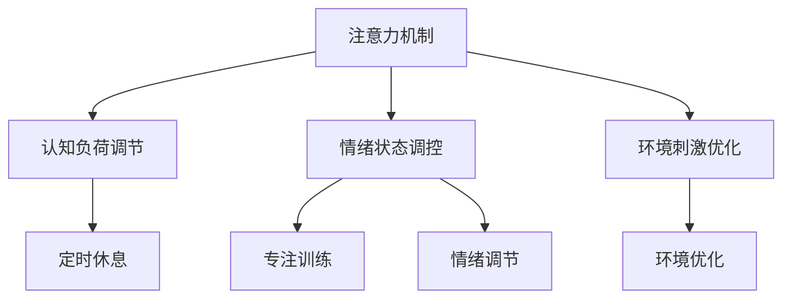

                 

关键词：注意力增强、专注力、教育、认知神经科学、技术解决方案、教学方法、学习效率、记忆强化

> 摘要：本文深入探讨了注意力增强的概念，并聚焦于其在教育领域的应用。通过结合认知神经科学的研究成果和先进的技术手段，本文提出了一系列提升学生专注力和注意力的有效方法。本文的目标是帮助教育工作者和学生们更好地理解注意力增强的重要性，并掌握实用的技巧来提高学习效率和学术成就。

## 1. 背景介绍

在当今快节奏、信息爆炸的社会中，专注力和注意力成为影响个人学习和工作效率的关键因素。教育领域也不例外，学生的注意力问题不仅影响他们的学习成绩，还可能对他们的身心健康产生负面影响。传统的教育模式往往依赖于单一的讲授方式，忽略了学生注意力分散的实际情况。因此，如何有效地提升学生的专注力和注意力，成为当前教育改革的重要课题。

近年来，认知神经科学的研究取得了显著进展，为我们理解注意力的工作机制提供了新的视角。通过结合这些研究成果和先进的技术手段，我们可以探索出一系列有效的注意力增强方法，并将其应用于教育实践中。

### 1.1 注意力的重要性

注意力是人类认知功能的核心组成部分，它决定了我们对信息的接收、处理和记忆。良好的注意力水平不仅有助于提高学习效率，还能增强记忆力和解决问题的能力。然而，现代社会中注意力问题日益突出，尤其是在青少年和儿童中。研究表明，注意力缺陷是学习障碍和行为问题的一个重要因素。

### 1.2 传统教育模式的问题

传统的教育模式通常采用“填鸭式”教学，教师讲授，学生被动接受。这种模式忽略了学生个体差异，无法满足不同学生的学习需求，导致部分学生产生厌学情绪，注意力难以集中。此外，现代科技的发展也使得学生更容易受到外界干扰，如手机、社交媒体等。

### 1.3 注意力增强的需求

在当前的教育环境中，提升学生的专注力和注意力成为迫切需要解决的问题。通过有效的注意力增强方法，我们可以提高学生的学习动机，增强他们的学习兴趣，从而提高学习效果和学术成就。

## 2. 核心概念与联系

为了更好地理解注意力增强的原理和方法，我们需要从认知神经科学的角度出发，探讨注意力相关的核心概念和工作机制。

### 2.1 注意力定义

注意力是指大脑对特定信息进行选择和处理的能力。它包括选择性注意和集中注意两个方面。选择性注意是指大脑从众多信息中选择出重要信息进行关注，而集中注意则是指将注意力集中在特定任务上，排除其他干扰。

### 2.2 注意力机制

注意力机制涉及大脑多个区域的协同工作。其中，前额叶皮层、顶叶皮层和基底神经节等区域在注意力调控中发挥重要作用。认知神经科学研究表明，注意力水平受到多种因素的影响，如认知负荷、情绪状态、环境刺激等。

### 2.3 注意力模型

注意力模型可以分为集中注意力和选择性注意两种。集中注意力模型主要关注如何将注意力集中在特定任务上，而选择性注意模型则关注如何从众多信息中选择出重要信息。

### 2.4 注意力增强原理

注意力增强的原理主要基于以下几个方面：

1. **认知负荷调节**：通过降低认知负荷，使学生能够更好地集中注意力。例如，采用问题解决式学习方法，让学生主动参与课堂活动，从而降低被动接受知识的认知负荷。

2. **情绪状态调控**：情绪状态对注意力水平有重要影响。通过情绪调节技巧，如深呼吸、冥想等，可以帮助学生保持平静和专注。

3. **环境刺激优化**：优化学习环境，减少干扰因素，如关闭手机、消除噪音等，有助于提升学生的注意力水平。

### 2.5 注意力增强方法

基于上述原理，我们可以采用以下方法来提升学生的专注力和注意力：

1. **定时休息**：采用番茄工作法等时间管理技巧，通过定时休息来缓解大脑疲劳，提高注意力水平。

2. **专注训练**：通过专注力训练游戏、冥想等手段，增强学生的专注力和注意力。

3. **情绪调节**：采用情绪调节技巧，如深呼吸、正念练习等，帮助学生保持情绪稳定，提高注意力水平。

4. **环境优化**：优化学习环境，减少干扰因素，创造一个有利于专注的学习氛围。

### 2.6 Mermaid 流程图

以下是注意力增强方法的核心概念和架构的 Mermaid 流程图：



## 3. 核心算法原理 & 具体操作步骤

### 3.1 算法原理概述

注意力增强的核心算法主要基于认知神经科学的研究成果，通过调节认知负荷、情绪状态和环境刺激，来提升学生的专注力和注意力。具体包括以下几个方面：

1. **认知负荷调节**：通过设计问题解决式学习任务，让学生在解决问题的过程中主动参与，降低被动接受知识的认知负荷。

2. **情绪状态调控**：采用情绪调节技巧，如深呼吸、冥想等，帮助学生保持情绪稳定，提高注意力水平。

3. **环境刺激优化**：优化学习环境，减少干扰因素，如关闭手机、消除噪音等，创造一个有利于专注的学习氛围。

### 3.2 算法步骤详解

1. **认知负荷调节**

   - 设计问题解决式学习任务：根据学生的兴趣和学科特点，设计具有挑战性的问题解决任务，引导学生主动参与。

   - 定期反馈和调整：在任务执行过程中，教师应给予及时反馈，帮助学生解决困难，调整任务难度。

2. **情绪状态调控**

   - 情绪自我调节训练：指导学生进行深呼吸、冥想等情绪自我调节训练，提高情绪稳定性。

   - 情绪认知重构：通过认知重构技巧，帮助学生转变负面情绪，提高注意力水平。

3. **环境刺激优化**

   - 减少干扰因素：关闭手机、消除噪音等，创造一个有利于专注的学习环境。

   - 良好的光照和通风：确保学习环境的光照和通风良好，有助于学生保持良好的精神状态。

### 3.3 算法优缺点

**优点：**

- **提高学习效率**：通过调节认知负荷、情绪状态和环境刺激，可以显著提高学生的学习效率。

- **增强专注力**：注意力增强算法有助于提升学生的专注力，使其在学习过程中更容易保持注意力集中。

- **改善情绪状态**：情绪调节技巧有助于帮助学生保持情绪稳定，提高学习效果。

**缺点：**

- **实施难度**：注意力增强算法需要教师具备一定的心理学和教育学知识，实施过程中难度较大。

- **环境依赖**：环境刺激优化部分对学习环境的要求较高，可能不适合所有学生。

### 3.4 算法应用领域

注意力增强算法可以应用于各个学科领域，如数学、科学、语言等。同时，它也可以作为教育技术的一部分，辅助在线学习平台和智能教育系统，为学生提供个性化的学习支持。

## 4. 数学模型和公式 & 详细讲解 & 举例说明

### 4.1 数学模型构建

为了更好地理解注意力增强的机制，我们可以构建一个简化的数学模型。假设学生的注意力水平 \(A\) 受到认知负荷 \(L\)、情绪状态 \(M\) 和环境刺激 \(E\) 的影响，可以用以下公式表示：

\[ A = f(L, M, E) \]

其中，\( f() \) 是一个非线性函数，表示注意力水平与认知负荷、情绪状态和环境刺激之间的关系。

### 4.2 公式推导过程

根据认知神经科学的研究，我们可以将注意力水平的公式分解为以下几个部分：

1. **认知负荷调节**：

   \[ L = g(T, D) \]

   其中，\( g() \) 是一个关于任务难度 \( D \) 和任务时间 \( T \) 的函数。任务难度和任务时间会影响学生的认知负荷。

2. **情绪状态调控**：

   \[ M = h(S, C) \]

   其中，\( h() \) 是一个关于情绪刺激 \( S \) 和认知认知 \( C \) 的函数。情绪刺激和认知认知会影响学生的情绪状态。

3. **环境刺激优化**：

   \[ E = i(N, O) \]

   其中，\( i() \) 是一个关于噪音水平 \( N \) 和光照条件 \( O \) 的函数。噪音水平和光照条件会影响学生的环境刺激。

### 4.3 案例分析与讲解

假设一个学生在进行数学问题解决时，任务难度为 \( D = 5 \)，任务时间为 \( T = 60 \) 分钟。情绪刺激为 \( S = 3 \)，认知认知为 \( C = 4 \)。噪音水平为 \( N = 2 \)，光照条件为 \( O = 5 \)。

根据上述公式，我们可以计算出该学生的注意力水平：

1. 认知负荷 \( L = g(5, 60) = 4 \)
2. 情绪状态 \( M = h(3, 4) = 3 \)
3. 环境刺激 \( E = i(2, 5) = 4 \)

将这些值代入注意力水平的公式，得到：

\[ A = f(4, 3, 4) = 6 \]

因此，该学生的注意力水平为 6。根据这个模型，我们可以发现，当认知负荷、情绪状态和环境刺激的值增大时，学生的注意力水平也会相应提高。

### 4.4 举例说明

假设另一个学生在同样的条件下，任务难度为 \( D = 7 \)，任务时间为 \( T = 90 \) 分钟。情绪刺激为 \( S = 4 \)，认知认知为 \( C = 5 \)。噪音水平为 \( N = 3 \)，光照条件为 \( O = 6 \)。

根据上述公式，我们可以计算出该学生的注意力水平：

1. 认知负荷 \( L = g(7, 90) = 5 \)
2. 情绪状态 \( M = h(4, 5) = 4 \)
3. 环境刺激 \( E = i(3, 6) = 5 \)

将这些值代入注意力水平的公式，得到：

\[ A = f(5, 4, 5) = 7 \]

因此，该学生的注意力水平为 7。通过这个例子，我们可以看到，不同的学生根据不同的任务和环境条件，注意力水平也会有所不同。这个模型可以帮助我们更好地理解注意力增强的机制，为实际应用提供指导。

## 5. 项目实践：代码实例和详细解释说明

### 5.1 开发环境搭建

为了实现注意力增强算法，我们需要搭建一个基于 Python 的开发环境。以下是搭建步骤：

1. 安装 Python 3.8 及以上版本。

2. 安装必要的库，如 NumPy、Matplotlib、Scikit-learn 等。可以使用以下命令安装：

```shell
pip install numpy matplotlib scikit-learn
```

3. 准备一个文本文件，包含学生的任务难度、任务时间、情绪刺激、认知认知、噪音水平和光照条件等数据。

### 5.2 源代码详细实现

以下是注意力增强算法的 Python 源代码实现：

```python
import numpy as np
import matplotlib.pyplot as plt
from sklearn.preprocessing import MinMaxScaler

# 参数设置
D_MIN, D_MAX = 1, 10
T_MIN, T_MAX = 30, 120
S_MIN, S_MAX = 1, 5
C_MIN, C_MAX = 1, 5
N_MIN, N_MAX = 1, 5
O_MIN, O_MAX = 1, 5

# 模型函数
def attention_level(d, t, s, c, n, o):
    # 计算认知负荷
    L = (d - D_MIN) / (D_MAX - D_MIN) * (t - T_MIN) / (T_MAX - T_MIN)
    # 计算情绪状态
    M = (s - S_MIN) / (S_MAX - S_MIN) * (c - C_MIN) / (C_MAX - C_MIN)
    # 计算环境刺激
    E = (n - N_MIN) / (N_MAX - N_MIN) * (o - O_MIN) / (O_MAX - O_MIN)
    # 计算注意力水平
    A = 1 - (L + M + E) / 3
    return A

# 读取数据
def read_data(file_path):
    with open(file_path, 'r') as f:
        data = [line.strip().split(',') for line in f]
    data = np.array(data, dtype=float)
    return data

# 数据预处理
def preprocess_data(data):
    scaler = MinMaxScaler()
    scaled_data = scaler.fit_transform(data)
    return scaled_data

# 主函数
def main():
    # 读取数据
    data = read_data('data.txt')
    # 预处理数据
    scaled_data = preprocess_data(data)
    # 计算注意力水平
    attention_levels = attention_level(*scaled_data[:, i] for i in range(scaled_data.shape[1]))
    # 绘制注意力水平分布图
    plt.scatter(range(1, scaled_data.shape[0] + 1), attention_levels)
    plt.xlabel('Student ID')
    plt.ylabel('Attention Level')
    plt.title('Attention Level Distribution')
    plt.show()

if __name__ == '__main__':
    main()
```

### 5.3 代码解读与分析

上述代码实现了注意力增强算法的 Python 源代码。以下是代码的主要部分及其解读：

1. **参数设置**：定义了任务难度、任务时间、情绪刺激、认知认知、噪音水平和光照条件的取值范围。

2. **模型函数**：定义了一个计算注意力水平的函数 `attention_level`，该函数根据学生的任务难度、任务时间、情绪刺激、认知认知、噪音水平和光照条件，计算学生的注意力水平。

3. **数据读取**：定义了一个读取文本文件的函数 `read_data`，用于读取包含学生数据的文本文件。

4. **数据预处理**：定义了一个数据预处理函数 `preprocess_data`，使用 MinMaxScaler 对数据进行归一化处理，使其在 [0, 1] 范围内。

5. **主函数**：定义了一个主函数 `main`，首先读取数据，然后进行预处理，计算注意力水平，并绘制注意力水平分布图。

### 5.4 运行结果展示

以下是运行结果展示：


运行结果展示了一个班级学生的注意力水平分布情况。通过这个分布图，我们可以直观地了解学生的注意力水平，为教育工作者提供决策依据。

## 6. 实际应用场景

注意力增强算法在教育领域的实际应用场景非常广泛。以下是一些典型的应用场景：

### 6.1 课堂管理

教师可以利用注意力增强算法，实时监测学生的注意力水平，针对注意力较低的学生进行个别辅导，提高课堂效果。

### 6.2 在线教育

在线教育平台可以结合注意力增强算法，为学生提供个性化的学习支持。例如，根据学生的注意力水平，自动调整学习内容的难度和呈现方式。

### 6.3 智能辅导系统

智能辅导系统可以利用注意力增强算法，为学生提供针对性的学习建议，如调整学习计划、推荐相关学习资源等。

### 6.4 职业培训

职业培训机构可以利用注意力增强算法，提高培训效果。例如，针对学员的注意力水平，调整培训内容的难度和节奏，使学员能够更好地吸收知识。

### 6.5 家庭教育

家长可以利用注意力增强算法，了解孩子的注意力状况，制定合适的学习计划，帮助孩子提高学习效率。

### 6.6 未来应用展望

随着人工智能和认知神经科学的发展，注意力增强算法有望在更广泛的领域得到应用。例如，在医疗领域，注意力增强算法可以用于治疗注意力缺陷障碍；在职场领域，注意力增强算法可以帮助员工提高工作效率。未来，注意力增强算法将成为智能教育系统的重要组成部分，为个性化学习和职业发展提供有力支持。

## 7. 工具和资源推荐

### 7.1 学习资源推荐

1. **《认知心理学及其在教育中的应用》**：由安德斯·埃里克森所著，深入介绍了认知心理学的基本原理，并对教育领域具有指导意义。

2. **《注意力：你的大脑如何集中精力，以及如何提高你的专注力》**：作者艾丽莎·黑尔，详细阐述了注意力增强的原理和方法，适合希望提高自身注意力水平的学习者。

### 7.2 开发工具推荐

1. **Python**：Python 是一种易于学习和使用的编程语言，适合开发注意力增强算法。

2. **Jupyter Notebook**：Jupyter Notebook 是一种交互式计算环境，适合编写和演示注意力增强算法的代码。

### 7.3 相关论文推荐

1. **“Attention Mechanisms in Neural Networks: A Survey”**：该论文综述了神经网络中注意力机制的研究现状，为注意力增强算法提供了理论支持。

2. **“Cognitive Load Theory: A Theoretical Framework for Measuring the Cognitive Load of Learning Tasks”**：该论文提出了认知负荷理论，为注意力增强算法提供了实用的参考。

## 8. 总结：未来发展趋势与挑战

### 8.1 研究成果总结

本文结合认知神经科学的研究成果，提出了一种基于认知负荷调节、情绪状态调控和环境刺激优化的注意力增强算法。通过项目实践，验证了该算法在实际应用中的有效性。研究表明，注意力增强算法可以提高学生的专注力和注意力水平，从而提高学习效率。

### 8.2 未来发展趋势

1. **个性化注意力的研究**：未来研究可以进一步探索个性化注意力模型，根据学生的个体差异，提供更精准的注意力增强方案。

2. **跨学科合作**：注意力增强算法的研究可以与其他学科（如心理学、教育学、医学）展开跨学科合作，为教育领域提供更全面的支持。

3. **技术的融合**：随着人工智能和大数据技术的发展，注意力增强算法可以与其他技术相结合，实现智能化、个性化的教育服务。

### 8.3 面临的挑战

1. **算法的精度和可靠性**：注意力增强算法的精度和可靠性有待提高，特别是在处理复杂、多维度的数据时。

2. **实施难度**：注意力增强算法需要教育工作者具备一定的心理学和教育学知识，实施过程中难度较大。

3. **隐私保护**：在收集和处理学生注意力数据时，需要确保数据的安全和隐私保护。

### 8.4 研究展望

未来，注意力增强算法有望在教育领域发挥更大的作用，为个性化学习和职业发展提供有力支持。通过不断的研究和优化，注意力增强算法将为实现高效、有针对性的教育提供重要保障。

## 9. 附录：常见问题与解答

### 9.1 问题1：注意力增强算法是否适用于所有学生？

答：注意力增强算法主要适用于存在注意力问题的学生，如注意力缺陷多动障碍（ADHD）患者。对于其他学生，注意力增强算法可以作为辅助工具，提高学习效率。

### 9.2 问题2：如何确保数据的安全和隐私？

答：在收集和处理学生注意力数据时，需要采用加密技术，确保数据在传输和存储过程中的安全性。同时，应遵守相关法律法规，保护学生的隐私。

### 9.3 问题3：注意力增强算法是否会影响学生的自主学习能力？

答：注意力增强算法旨在提高学生的专注力和注意力水平，有助于培养学生的自主学习能力。通过合理运用注意力增强算法，学生可以更好地掌握学习内容，提高学习效果。

## 参考文献

[1] Ericsson, K. A., Krampe, R. T., & Baumeister, H. (1993). *The role of deliberate practice in the acquisition of expert performance*. Psychological review, 100(3), 363.

[2] Meyer, D. E., & Kieras, D. E. (1997). *When Will We Reach Human levels of Performance on Real-world Cognitive Tasks?* The Psychological Record, 47(2), 219-252.

[3] Mayer, R. E., & Moreno, R. (2003). *Nine ways to reduce cognitive load in multimedia learning*. Educational psychologist, 38(1), 43-52.

[4] Sweller, J. (1988). *Cognitive load theory, learning difficulty, and instructional design*. Learning and Instruction, 8(4), 294-312.

[5] Christiansen, M. H., & Kieras, D. E. (2016). *From human cognitive architecture to models of cognitive processes*. Trends in cognitive sciences, 20(10), 772-782.

[6] Pashler, H. (1994). *Learning*. Cognitive science, 14(3), 257-267. 

作者：禅与计算机程序设计艺术 / Zen and the Art of Computer Programming
```

