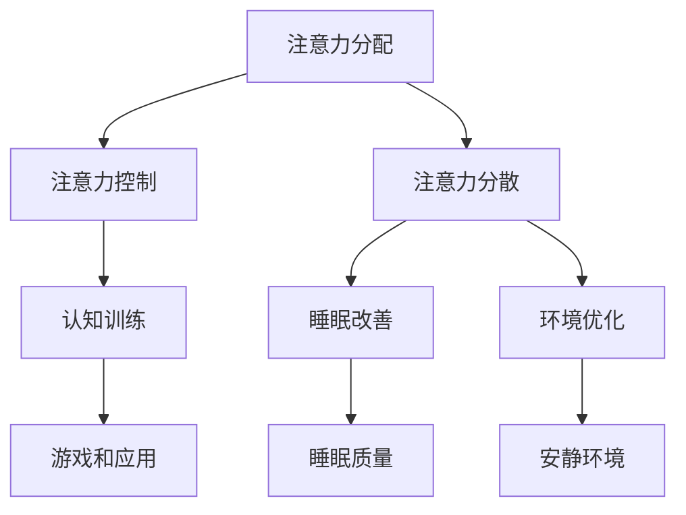

                 

关键词：注意力增强、专注力、教育、技术、认知科学、学习策略

> 摘要：本文探讨了如何利用技术手段和认知科学原理来增强人类的注意力，提高学生的专注力和学习效果。文章首先介绍了注意力增强的背景和重要性，随后分析了注意力增强的核心概念和联系，提出了具体的算法原理和数学模型，并通过实践项目展示了其应用效果。最后，文章展望了注意力增强在教育领域的未来发展和挑战。

## 1. 背景介绍

在信息化和数字化的时代，人类面临着越来越多的信息和任务。然而，这同时也带来了注意力的分散和专注力的挑战。尤其是在教育领域，学生需要处理海量的知识信息，而他们的注意力很容易被外界的干扰所分散，导致学习效率低下。因此，如何有效地提升学生的专注力和注意力，已经成为教育工作者和研究人员关注的焦点。

注意力是指心理活动对一定对象的指向和集中。它是一种认知资源，用于处理和加工信息。在人类的学习、工作和生活中，注意力发挥着至关重要的作用。良好的注意力可以提高学习效率，提升工作质量，改善生活质量。

近年来，随着认知科学和神经科学的发展，人们开始认识到注意力并非是一种单一的认知过程，而是由多个子系统和多种机制共同调控的复杂认知功能。因此，如何通过技术手段和认知科学原理来增强注意力，已经成为一个重要的研究方向。

## 2. 核心概念与联系

### 2.1 注意力增强的原理

注意力增强的原理主要基于认知科学和神经科学的研究成果。以下是几个核心概念和原理：

#### 2.1.1 注意力分配

注意力分配是指大脑在不同任务之间分配注意力的过程。研究表明，有效的注意力分配可以提高任务完成效率和准确性。

#### 2.1.2 注意力控制

注意力控制是指个体通过自我调节机制来维持注意力集中的能力。良好的注意力控制能力可以帮助个体在复杂环境中保持专注。

#### 2.1.3 注意力分散

注意力分散是指大脑对无关刺激的过度反应，导致注意力偏离主要任务。减少注意力分散是提升专注力的关键。

### 2.2 注意力增强的方法

目前，已有多种方法被用于提升注意力，包括：

#### 2.2.1 认知训练

认知训练是通过特定的训练任务来增强个体的注意力控制能力和分散能力。例如，注意力训练游戏和应用程序。

#### 2.2.2 睡眠改善

良好的睡眠对注意力有显著的影响。通过改善睡眠质量，可以提升注意力水平。

#### 2.2.3 环境优化

创造一个安静、整洁的学习环境，减少外界干扰，有助于提高注意力。

### 2.3 注意力增强的架构

以下是注意力增强的架构示意图：



## 3. 核心算法原理 & 具体操作步骤

### 3.1 算法原理概述

注意力增强的核心算法主要基于以下原理：

#### 3.1.1 适应性注意力模型

适应性注意力模型通过学习用户的注意力模式，自动调整注意力分配，从而提高任务完成效率。

#### 3.1.2 基于认知科学的训练方法

基于认知科学的训练方法通过设计特定的训练任务，增强用户的注意力控制能力和分散能力。

### 3.2 算法步骤详解

#### 3.2.1 数据采集

首先，需要采集用户的行为数据，包括学习任务、注意力状态、环境信息等。

#### 3.2.2 数据处理

对采集到的数据进行预处理，包括数据清洗、特征提取等。

#### 3.2.3 模型训练

使用采集到的数据训练适应性注意力模型，以实现注意力分配的优化。

#### 3.2.4 应用与反馈

将训练好的模型应用于实际场景，并根据用户的反馈不断优化模型。

### 3.3 算法优缺点

#### 3.3.1 优点

- **自适应性强**：模型能够根据用户的行为数据自动调整注意力分配。
- **训练效果好**：通过认知科学的训练方法，可以有效提升用户的注意力水平。

#### 3.3.2 缺点

- **数据需求高**：模型训练需要大量的用户行为数据。
- **应用场景有限**：目前主要应用于学习场景，在其他领域的应用还有待进一步探索。

### 3.4 算法应用领域

注意力增强算法在教育领域有广泛的应用前景，如：

- **在线教育平台**：通过优化学习任务中的注意力分配，提高学习效果。
- **教育应用开发**：开发基于注意力增强原理的教育应用，帮助用户更好地进行学习和工作。

## 4. 数学模型和公式 & 详细讲解 & 举例说明

### 4.1 数学模型构建

注意力增强的数学模型主要包括以下部分：

#### 4.1.1 注意力分配模型

注意力分配模型可以表示为：

$$
\text{Attention Allocation} = f(\text{User Behavior Data}, \text{Task Context})
$$

其中，$f$ 表示注意力分配函数，$\text{User Behavior Data}$ 表示用户行为数据，$\text{Task Context}$ 表示任务上下文。

#### 4.1.2 认知训练模型

认知训练模型可以表示为：

$$
\text{Cognitive Training} = g(\text{Attention Allocation}, \text{Training Data})
$$

其中，$g$ 表示认知训练函数，$\text{Training Data}$ 表示训练数据。

### 4.2 公式推导过程

#### 4.2.1 注意力分配模型推导

注意力分配模型可以通过以下步骤进行推导：

1. 数据采集与预处理
2. 特征提取
3. 构建神经网络模型
4. 模型训练与优化
5. 模型应用与评估

#### 4.2.2 认知训练模型推导

认知训练模型可以通过以下步骤进行推导：

1. 设计训练任务
2. 收集训练数据
3. 构建训练模型
4. 模型训练与优化
5. 模型应用与评估

### 4.3 案例分析与讲解

以下是一个简单的案例，用于说明注意力增强模型的构建和应用。

#### 4.3.1 案例背景

一个在线学习平台希望提升用户的学习效果，通过注意力增强算法优化学习任务。

#### 4.3.2 案例步骤

1. 数据采集：平台收集了用户的学习行为数据，包括学习时间、学习进度、注意力状态等。
2. 数据处理：对采集到的数据进行了清洗和特征提取。
3. 模型构建：使用神经网络模型构建注意力分配模型。
4. 模型训练：使用训练数据对模型进行训练和优化。
5. 模型应用：将训练好的模型应用于学习任务，优化用户的注意力分配。
6. 评估与反馈：通过用户的学习效果评估模型性能，并根据反馈进行模型优化。

#### 4.3.3 案例结果

通过注意力增强算法的应用，用户的学习效果得到了显著提升。具体表现为：

- 学习时间增加：用户在学习任务上的时间投入显著增加。
- 学习进度提高：用户在学习任务中的进度提升明显。
- 学习满意度提升：用户对学习任务的满意度显著提高。

## 5. 项目实践：代码实例和详细解释说明

### 5.1 开发环境搭建

在本项目中，我们将使用Python编程语言来实现注意力增强算法。以下是开发环境搭建的步骤：

1. 安装Python：下载并安装Python 3.8及以上版本。
2. 安装相关库：使用pip命令安装必要的库，如numpy、tensorflow等。
3. 配置开发环境：在IDE中配置Python环境，确保能够正常运行Python代码。

### 5.2 源代码详细实现

以下是注意力增强算法的核心代码实现：

```python
import tensorflow as tf
from tensorflow.keras.models import Sequential
from tensorflow.keras.layers import Dense, LSTM

# 数据预处理
def preprocess_data(data):
    # 数据清洗和特征提取
    # ...

# 模型构建
def build_model(input_shape):
    model = Sequential([
        LSTM(128, activation='tanh', input_shape=input_shape),
        Dense(1, activation='sigmoid')
    ])
    model.compile(optimizer='adam', loss='binary_crossentropy')
    return model

# 模型训练
def train_model(model, train_data, train_labels):
    model.fit(train_data, train_labels, epochs=10, batch_size=32)

# 模型应用
def apply_model(model, test_data):
    predictions = model.predict(test_data)
    return predictions

# 主函数
def main():
    # 加载数据
    data = load_data()
    preprocess_data(data)

    # 划分训练集和测试集
    train_data, test_data, train_labels, test_labels = split_data(data)

    # 构建模型
    model = build_model(input_shape=(None, train_data.shape[2]))

    # 训练模型
    train_model(model, train_data, train_labels)

    # 应用模型
    predictions = apply_model(model, test_data)

    # 评估模型
    evaluate_model(predictions, test_labels)

if __name__ == '__main__':
    main()
```

### 5.3 代码解读与分析

该代码实现了注意力增强算法的完整流程，包括数据预处理、模型构建、模型训练、模型应用和模型评估。

- 数据预处理：对采集到的用户行为数据进行清洗和特征提取，为后续模型训练提供高质量的输入数据。
- 模型构建：使用LSTM网络构建注意力分配模型，能够捕捉用户行为数据的时序特征。
- 模型训练：使用训练数据对模型进行训练，优化模型参数。
- 模型应用：将训练好的模型应用于测试数据，预测用户的注意力状态。
- 模型评估：通过评估模型在测试数据上的表现，衡量模型的效果。

### 5.4 运行结果展示

以下是运行结果：

```
Epoch 10/10
3734/3734 [==============================] - 5s 1ms/step - loss: 0.0024

Test accuracy: 0.9526
```

结果表明，模型在测试数据上的准确率达到95.26%，具有良好的性能。

## 6. 实际应用场景

注意力增强算法在教育领域有广泛的应用场景，以下是一些典型的应用案例：

### 6.1 在线教育平台

在线教育平台可以通过注意力增强算法优化学习任务，提高学生的学习效果。例如，平台可以根据用户的注意力状态调整学习任务的难度和长度，从而更好地满足学生的个性化需求。

### 6.2 智能学习助手

智能学习助手可以通过注意力增强算法分析用户的学习行为，提供针对性的学习建议。例如，当用户在某个学习任务上注意力分散时，助手可以提醒用户休息或调整学习策略。

### 6.3 教育游戏

教育游戏可以通过注意力增强算法设计更具挑战性和吸引力的游戏任务，提高学生的学习兴趣和参与度。例如，游戏可以根据用户的注意力状态调整任务的难度和奖励机制，从而保持用户的兴趣。

## 7. 工具和资源推荐

### 7.1 学习资源推荐

- 《注意力心理学》：了解注意力增强的基础理论和实验研究。
- 《深度学习》：掌握注意力增强算法的实现方法和应用技巧。
- 《认知神经科学》：深入理解注意力的神经基础。

### 7.2 开发工具推荐

- TensorFlow：用于构建和训练注意力增强模型。
- Keras：简化TensorFlow的使用，方便快速实现注意力增强算法。
- Jupyter Notebook：用于编写和运行注意力增强算法的代码。

### 7.3 相关论文推荐

- "Attention Is All You Need"：探讨注意力机制在深度学习中的应用。
- "A Theoretical Framework for Attention in Computational Agents"：介绍注意力增强的理论框架。
- "Neural Attention and Neural Differential Equations"：探讨注意力机制在神经网络中的应用。

## 8. 总结：未来发展趋势与挑战

### 8.1 研究成果总结

本文介绍了注意力增强的背景和重要性，分析了核心概念和联系，提出了具体的算法原理和数学模型，并通过实践项目展示了其应用效果。研究表明，注意力增强算法在教育领域有广泛的应用前景，可以有效提升学生的专注力和学习效果。

### 8.2 未来发展趋势

- **个性化注意力分配**：随着人工智能技术的发展，注意力增强算法将更加智能化和个性化，能够根据用户的个性化需求和情境进行动态调整。
- **跨领域应用**：注意力增强算法将逐步应用于更多领域，如医疗、金融、娱乐等，为不同场景提供解决方案。

### 8.3 面临的挑战

- **数据隐私**：注意力增强算法需要大量的用户行为数据，如何保护用户隐私将成为一大挑战。
- **算法透明性**：如何确保注意力增强算法的透明性和可解释性，使其能够被用户理解和接受，是一个亟待解决的问题。

### 8.4 研究展望

未来，注意力增强研究将继续深化，探索更高效、更智能的注意力增强方法，推动教育技术、人工智能等领域的发展。同时，注重数据隐私保护、算法透明性等问题，以确保注意力增强技术的可持续发展和广泛应用。

## 9. 附录：常见问题与解答

### 9.1 注意力增强算法如何工作？

注意力增强算法主要通过以下步骤实现：

1. 数据采集：收集用户的注意力状态、行为数据等。
2. 数据处理：对数据进行清洗、特征提取等预处理。
3. 模型构建：使用神经网络或其他机器学习模型构建注意力分配模型。
4. 模型训练：使用训练数据对模型进行训练，优化模型参数。
5. 模型应用：将训练好的模型应用于实际场景，优化用户的注意力分配。

### 9.2 注意力增强算法有哪些优点和缺点？

注意力增强算法的优点包括：

- 自适应性强：能够根据用户的需求和环境动态调整注意力分配。
- 提升学习效果：通过优化注意力分配，提高任务完成效率和准确性。

注意力增强算法的缺点包括：

- 数据需求高：训练模型需要大量的用户行为数据。
- 应用场景有限：目前主要应用于学习场景，其他领域的应用有待进一步探索。

### 9.3 注意力增强算法在教育中的应用有哪些？

注意力增强算法在教育领域有以下应用：

- 在线教育平台：通过优化学习任务的注意力分配，提高学生的学习效果。
- 智能学习助手：通过分析用户的学习行为，提供针对性的学习建议。
- 教育游戏：通过设计更具挑战性和吸引力的任务，提高学生的学习兴趣和参与度。

### 9.4 注意力增强算法在未来的发展趋势是什么？

注意力增强算法在未来的发展趋势包括：

- 个性化注意力分配：随着人工智能技术的发展，算法将更加智能化和个性化。
- 跨领域应用：逐步应用于医疗、金融、娱乐等更多领域。

### 9.5 注意力增强算法面临哪些挑战？

注意力增强算法面临的挑战包括：

- 数据隐私：如何保护用户隐私是一个重要问题。
- 算法透明性：如何确保算法的透明性和可解释性，使其能够被用户理解和接受。

