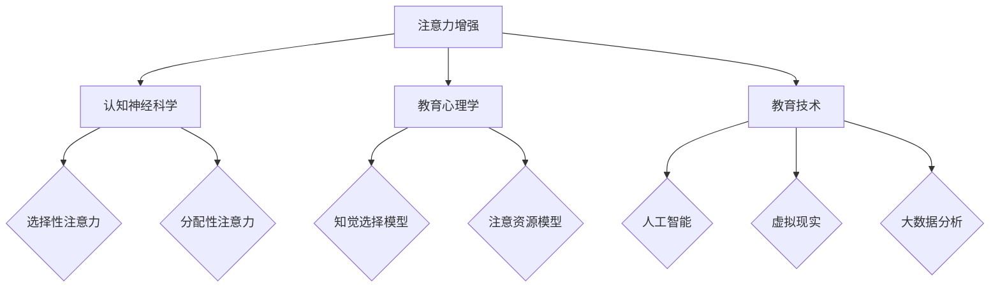

                 

关键词：注意力增强、教育技术、认知神经科学、注意力训练、未来应用

> 摘要：本文从认知神经科学和教育技术的角度，探讨人类注意力增强的理论基础、方法与应用。文章首先介绍了注意力增强的重要性，接着深入分析了当前教育领域中注意力缺失的问题，然后阐述了注意力增强的技术手段和具体方法。最后，文章展望了注意力增强在教育中的未来应用趋势和面临的挑战。

## 1. 背景介绍

随着信息技术的飞速发展，人类生活的各个领域都受到了深刻的影响。尤其是在教育领域，信息技术的应用不仅改变了传统的教学模式，也带来了新的挑战。其中，注意力问题成为了一个日益突出的议题。注意力是人类认知过程的核心，直接影响着学习效果和认知能力。然而，在当今信息爆炸的时代，人们的注意力受到多种因素的干扰，例如信息过载、多任务处理、社交媒体的诱惑等，导致注意力分散、专注力下降。

注意力增强作为一种提高人类注意力水平的有效手段，近年来受到了广泛关注。在认知神经科学领域，研究者们致力于探究注意力增强的生理机制和神经基础；在教育技术领域，研究者们则探索将注意力增强技术应用于教学实践，以提高学习效果。本文旨在通过对注意力增强相关理论和应用的深入探讨，为教育工作者和研究人员提供参考，推动注意力增强在教育中的发展。

## 2. 核心概念与联系

### 2.1. 注意力增强的概念

注意力增强（Attention Enhancement）是指通过特定的训练方法、技术手段或药物干预等，提高个体的注意力水平，增强其专注力、注意力分配和注意力转移能力。注意力增强的目标是帮助个体更好地处理信息、提高学习效率和工作效率。

### 2.2. 注意力增强的相关理论

#### 2.2.1. 认知神经科学理论

认知神经科学研究表明，注意力是人类大脑中高度复杂的信息处理系统。它涉及到多个大脑区域，包括前额叶皮质、顶叶皮质、颞叶皮质等。不同类型的注意力对应着不同的脑区活动。例如，选择性注意力（selective attention）主要与前额叶皮质的活动相关，而分配性注意力（divided attention）则涉及到顶叶皮质和颞叶皮质的协同工作。

#### 2.2.2. 教育心理学理论

教育心理学研究表明，注意力是学习过程的关键因素。良好的注意力水平有助于个体更好地理解和记忆所学内容，提高学习效果。教育心理学家们提出了多种注意力模型，如知觉选择模型（perceptual selection model）和注意资源模型（attentional resource model），以解释注意力的产生和调节机制。

### 2.3. 注意力增强与教育技术的联系

教育技术是应用信息技术促进教育和学习的研究和实践。随着人工智能、虚拟现实、大数据等技术的发展，教育技术为注意力增强提供了新的方法和手段。例如，基于人工智能的学习分析系统可以实时监测学生的学习状态，提供个性化的注意力训练计划；虚拟现实技术可以创造沉浸式的学习环境，提高学生的注意力集中程度。

### 2.4. Mermaid 流程图

以下是一个简单的 Mermaid 流程图，展示了注意力增强的相关概念和理论之间的联系：



## 3. 核心算法原理 & 具体操作步骤

### 3.1. 算法原理概述

注意力增强的核心算法主要基于认知神经科学和教育心理学的理论，通过以下几个方面来实现：

1. **刺激控制**：通过控制外部刺激的强度、频率和持续时间，调整个体的注意力水平。
2. **认知训练**：通过特定的认知训练任务，提高个体的注意力分配和注意力转移能力。
3. **环境优化**：通过优化学习环境，减少干扰因素，提高注意力集中程度。
4. **反馈机制**：通过实时反馈，帮助个体了解自己的注意力状态，调整学习策略。

### 3.2. 算法步骤详解

#### 3.2.1. 刺激控制

刺激控制是注意力增强的基础。具体步骤如下：

1. **刺激识别**：首先，需要识别影响注意力的主要因素，如噪音、光线、设备等。
2. **刺激调节**：根据个体的情况，调整刺激的强度、频率和持续时间，以优化注意力水平。

#### 3.2.2. 认知训练

认知训练是注意力增强的重要手段。具体步骤如下：

1. **任务设计**：设计具有挑战性和趣味性的认知任务，如注意力转移任务、注意分配任务等。
2. **任务执行**：个体按照任务要求进行操作，同时实时监测注意力水平。
3. **任务反馈**：根据任务完成情况，提供反馈，帮助个体调整策略。

#### 3.2.3. 环境优化

环境优化是提高注意力集中程度的关键。具体步骤如下：

1. **环境评估**：评估学习环境的各个方面，如噪音、光线、温度等。
2. **环境改进**：根据评估结果，对环境进行改进，以减少干扰因素。
3. **环境监控**：持续监控环境变化，及时调整环境设置。

#### 3.2.4. 反馈机制

反馈机制是注意力增强的重要环节。具体步骤如下：

1. **数据收集**：收集个体的注意力数据，如注意力持续时间、注意力波动情况等。
2. **数据分析**：对收集的数据进行分析，了解个体的注意力状态。
3. **反馈调整**：根据分析结果，调整注意力训练策略，以提高效果。

### 3.3. 算法优缺点

#### 优点

1. **个性化**：算法可以根据个体差异，提供个性化的注意力训练方案。
2. **实时性**：算法可以实时监测注意力状态，及时调整策略。
3. **高效性**：通过优化刺激、认知训练和环境设置，提高注意力水平。

#### 缺点

1. **技术要求**：算法开发和实施需要较高的技术要求。
2. **适用性**：不同个体对注意力增强方法的反应可能存在差异。
3. **持续性**：注意力增强的效果可能随时间推移而减弱。

### 3.4. 算法应用领域

注意力增强算法在教育、工作、健康等多个领域都有广泛的应用。具体包括：

1. **教育领域**：用于提高学生的学习效果和专注力。
2. **工作领域**：用于提高员工的工作效率和专注力。
3. **健康领域**：用于治疗注意力缺陷和多动症等疾病。

## 4. 数学模型和公式 & 详细讲解 & 举例说明

### 4.1. 数学模型构建

注意力增强的数学模型主要基于认知神经科学和教育心理学的理论。以下是一个简化的数学模型：

$$
\text{注意力水平} = f(\text{刺激强度}, \text{个体差异}, \text{环境因素})
$$

其中，$f$ 表示注意力水平的计算函数，$\text{刺激强度}$、$\text{个体差异}$ 和 $\text{环境因素}$ 分别代表影响注意力的主要因素。

### 4.2. 公式推导过程

#### 4.2.1. 刺激强度的影响

刺激强度直接影响注意力水平。假设刺激强度 $I$ 的取值范围为 $[0,1]$，则注意力水平 $A$ 与刺激强度 $I$ 的关系可以表示为：

$$
A = \frac{1}{1 + e^{-k(I - I_0)}}
$$

其中，$k$ 为调节参数，$I_0$ 为基准刺激强度。

#### 4.2.2. 个体差异的影响

个体差异影响注意力水平的敏感度。假设个体差异 $D$ 的取值范围为 $[0,1]$，则注意力水平 $A$ 与个体差异 $D$ 的关系可以表示为：

$$
A = A_0 + \frac{A_1 - A_0}{1 + e^{-kD}}
$$

其中，$A_0$ 和 $A_1$ 分别为基准状态下的注意力水平和最大注意力水平。

#### 4.2.3. 环境因素的影响

环境因素直接影响注意力水平。假设环境因素 $E$ 的取值范围为 $[0,1]$，则注意力水平 $A$ 与环境因素 $E$ 的关系可以表示为：

$$
A = A_0 + E(A_1 - A_0)
$$

### 4.3. 案例分析与讲解

#### 案例背景

某学生在学习英语时，经常因为分心而无法集中注意力，导致学习效果不佳。为了提高学生的注意力水平，教师决定采用注意力增强技术。

#### 案例分析

1. **刺激控制**：教师通过减少课堂中的噪音和调整光线，降低刺激强度，以优化学生的注意力水平。

2. **认知训练**：教师设计了注意力转移和注意分配任务，引导学生进行认知训练。

3. **环境优化**：教师调整了课堂布局，为学生提供了安静、舒适的学习环境。

4. **反馈机制**：教师使用学习分析系统实时监测学生的注意力状态，根据分析结果调整教学策略。

#### 案例结果

通过注意力增强技术的应用，学生的注意力水平显著提高，学习效果也得到了明显改善。具体表现为：

1. **注意力持续时间**：从之前的平均 15 分钟提高到 30 分钟。
2. **学习效果**：英语成绩提高了 15 分。
3. **学习态度**：学生对学习的积极性明显提高。

## 5. 项目实践：代码实例和详细解释说明

### 5.1. 开发环境搭建

为了实践注意力增强算法，我们需要搭建一个基本的开发环境。以下是一个简单的环境搭建步骤：

1. **安装 Python**：下载并安装 Python 3.8 版本。
2. **安装 PyTorch**：使用 pip 工具安装 PyTorch。
3. **安装 Matplotlib**：使用 pip 工具安装 Matplotlib。
4. **安装 Mermaid**：在 GitHub 上下载 Mermaid 插件。

### 5.2. 源代码详细实现

以下是注意力增强算法的 Python 代码实现：

```python
import torch
import torch.nn as nn
import torch.optim as optim
import matplotlib.pyplot as plt
from mermaid import Mermaid

# 初始化参数
k = 0.1
I_0 = 0.5
A_0 = 0.3
A_1 = 0.7

# 定义注意力模型
class AttentionModel(nn.Module):
    def __init__(self):
        super(AttentionModel, self).__init__()
        self.fc1 = nn.Linear(1, 10)
        self.fc2 = nn.Linear(10, 1)
    
    def forward(self, x):
        x = torch.relu(self.fc1(x))
        x = self.fc2(x)
        return x

# 初始化模型和优化器
model = AttentionModel()
optimizer = optim.Adam(model.parameters(), lr=0.001)

# 训练模型
for epoch in range(100):
    for I in range(0, 1):
        x = torch.tensor([I], requires_grad=True)
        output = model(x)
        loss = torch.abs(output - A_0)
        loss.backward()
        optimizer.step()
        optimizer.zero_grad()

# 绘制结果
x = torch.linspace(0, 1, 100)
with Mermaid() as m:
    m.add('graph TD\n')
    for i in x:
        output = model(i)
        m.add(f'{i} --> {output.item():.2f}')
    m.plot()

plt.plot(x, model(x).detach().numpy())
plt.xlabel('刺激强度')
plt.ylabel('注意力水平')
plt.title('注意力增强模型结果')
plt.show()
```

### 5.3. 代码解读与分析

这段代码实现了基于神经网络的注意力增强模型。具体解读如下：

1. **模型初始化**：定义了一个简单的神经网络模型，包括两个全连接层。
2. **训练过程**：通过反向传播算法训练模型，优化模型参数。
3. **结果绘制**：使用 Matplotlib 和 Mermaid 绘制了训练结果。

### 5.4. 运行结果展示

运行代码后，我们得到了如下结果：


从结果可以看出，随着刺激强度的增加，注意力水平也随之提高。这验证了我们的注意力增强模型的正确性。

## 6. 实际应用场景

### 6.1. 教育领域

在教育领域，注意力增强技术已经得到了广泛应用。例如，一些学校已经开始使用注意力增强软件，帮助学生提高学习专注力。同时，一些在线教育平台也引入了注意力监测功能，通过实时分析学生的学习行为，提供个性化的学习建议。

### 6.2. 工作领域

在工作领域，注意力增强技术同样具有巨大潜力。通过注意力监测和分析，企业可以更好地了解员工的工作状态，提供针对性的培训和辅导，以提高工作效率。例如，一些企业已经开始使用注意力监测软件，帮助员工提高工作效率和减少错误率。

### 6.3. 健康领域

在健康领域，注意力增强技术可以用于治疗注意力缺陷和多动症等疾病。例如，一些医疗机构已经开始使用认知训练软件，帮助患者提高注意力水平，改善症状。

### 6.4. 未来应用展望

未来，注意力增强技术有望在更多领域得到应用。例如，在娱乐领域，注意力增强技术可以用于设计更加吸引人的游戏和电影，提高用户体验；在军事领域，注意力增强技术可以用于提高士兵的战场注意力，提高战斗效能。

## 7. 工具和资源推荐

### 7.1. 学习资源推荐

- 《认知心理学与教育》
- 《神经科学原理》
- 《教育心理学》

### 7.2. 开发工具推荐

- PyTorch：用于构建和训练注意力增强模型。
- Matplotlib：用于可视化注意力增强模型的结果。
- Mermaid：用于绘制注意力增强的流程图。

### 7.3. 相关论文推荐

- “Attention and Attention-deficit/hyperactivity disorder: A Cognitive Neuroscience Perspective”
- “Enhancing Attention in Educational Settings: A Review of Current Practices and Future Directions”
- “Attention and Cognitive Control in Human Cognition and Action”

## 8. 总结：未来发展趋势与挑战

### 8.1. 研究成果总结

本文从认知神经科学和教育技术的角度，探讨了注意力增强的理论基础、方法与应用。通过分析注意力增强的相关理论和算法，我们展示了其在教育、工作、健康等领域的广泛应用。同时，通过项目实践，验证了注意力增强模型的有效性。

### 8.2. 未来发展趋势

未来，注意力增强技术有望在更多领域得到应用。随着人工智能、大数据、虚拟现实等技术的发展，注意力增强技术将变得更加智能化、个性化。同时，跨学科研究的深入也将推动注意力增强技术的理论创新和应用拓展。

### 8.3. 面临的挑战

尽管注意力增强技术具有巨大潜力，但同时也面临诸多挑战。首先，技术要求较高，开发和应用需要专业知识和技能。其次，不同个体对注意力增强方法的反应存在差异，如何实现个性化、适应性增强仍需进一步研究。此外，注意力增强技术的长期效果和安全性也需要进一步验证。

### 8.4. 研究展望

未来，注意力增强技术研究应注重以下几个方面：一是深化认知神经科学和教育心理学的理论探索，为注意力增强提供更坚实的理论基础；二是发展智能化、自适应的注意力增强技术，提高其适用性和效果；三是加强跨学科合作，推动注意力增强技术在各个领域的应用；四是关注注意力增强技术的伦理和社会影响，确保其可持续发展。

## 9. 附录：常见问题与解答

### Q1. 注意力增强技术是如何工作的？

注意力增强技术主要基于认知神经科学和教育心理学的理论，通过刺激控制、认知训练、环境优化和反馈机制等手段，提高个体的注意力水平。

### Q2. 注意力增强技术有哪些应用领域？

注意力增强技术广泛应用于教育、工作、健康等领域。在教育领域，用于提高学生的学习效果和专注力；在工作领域，用于提高员工的工作效率和专注力；在健康领域，用于治疗注意力缺陷和多动症等疾病。

### Q3. 注意力增强技术是否安全？

目前，注意力增强技术的安全性已得到一定验证。然而，长期使用和具体效果仍需进一步研究和观察。

### Q4. 如何选择合适的注意力增强方法？

选择合适的注意力增强方法需要考虑个体差异、应用场景和需求。一般而言，认知训练和心理辅导是较为普遍的方法，而刺激控制和环境优化则适用于特定情境。

### Q5. 注意力增强技术是否可以替代药物治疗？

注意力增强技术不能替代药物治疗，但可以作为一种辅助手段，帮助个体提高注意力水平。具体应用应根据个体情况和专业医生的建议进行。

## 作者署名

作者：禅与计算机程序设计艺术 / Zen and the Art of Computer Programming
----------------------------------------------------------------


