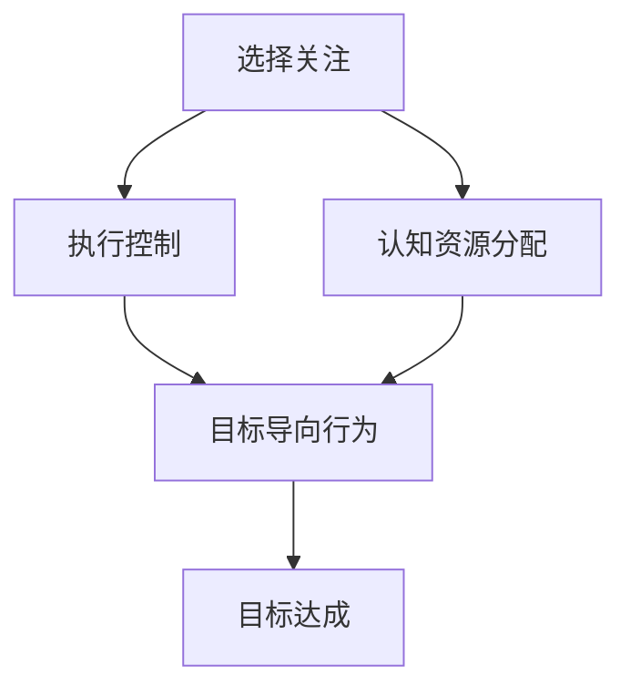

                 

关键词：注意力增强、专注力、认知提升、技术解决方案、人类认知模型、心理干预、神经科学、算法优化、代码实例、实践应用、未来展望

> 摘要：本文探讨了人类注意力增强的技术途径，从神经科学、认知心理学和计算机科学的角度出发，阐述了注意力增强的核心概念、算法原理及其实际应用。文章将通过详细的理论讲解、数学模型、代码实例及未来展望，为提升人类的专注力和注意力持续时间提供技术解决方案。

## 1. 背景介绍

随着信息化时代的到来，人类在日常生活中面临的注意力分散问题日益严重。人们常常在处理多个任务时感到疲惫，注意力难以集中，这极大地影响了工作效率和生活质量。注意力增强成为近年来研究的热点领域，旨在通过技术手段提升人类的专注力和注意力持续时间。

注意力是人类认知过程中不可或缺的一部分，它涉及多个认知功能的协同工作，包括选择关注、抑制干扰、目标追踪等。然而，现代生活节奏加快、信息过载和工作压力增大，使得注意力管理成为一个复杂的挑战。因此，研究注意力增强方法对于提高个人和社会的整体效率具有重要意义。

本文将从以下几个方面展开讨论：

1. 核心概念与联系
2. 核心算法原理与具体操作步骤
3. 数学模型和公式
4. 项目实践：代码实例
5. 实际应用场景
6. 未来应用展望
7. 工具和资源推荐
8. 总结：未来发展趋势与挑战

通过上述内容的探讨，本文希望能够为注意力增强领域的研究和实践提供一些有价值的参考。

## 2. 核心概念与联系

### 注意力增强的核心概念

注意力增强的核心概念主要包括以下几个部分：

1. **选择关注（Selective Attention）**：选择关注是指人们集中精力关注特定信息，同时忽略其他无关信息的能力。它是注意力增强的关键组成部分。

2. **执行控制（Executive Control）**：执行控制涉及规划、监控和调整认知过程的能力，包括目标设定、任务转换、冲突解决等。

3. **认知资源分配（Cognitive Resource Allocation）**：认知资源分配是指大脑在处理信息时对认知资源的合理分配，以最大化信息处理效率。

4. **目标导向行为（Goal-Oriented Behavior）**：目标导向行为是指个体在执行任务时，根据目标需求调整注意力和行为策略的过程。

### 核心概念之间的联系

这些核心概念之间有着紧密的联系：

- **选择关注与执行控制**：选择关注是执行控制的基础，执行控制则通过调整认知资源分配来实现目标导向行为。

- **认知资源分配与目标导向行为**：认知资源分配直接影响目标导向行为的效率和效果，两者共同作用于注意力的管理。

- **注意力与目标导向行为**：注意力是目标导向行为的驱动力，目标导向行为则通过调整注意力和认知资源分配来实现。

### Mermaid 流程图

为了更好地理解核心概念之间的联系，我们可以使用 Mermaid 流程图进行展示：



该流程图展示了选择关注、执行控制、认知资源分配和目标导向行为之间的关系，以及它们如何共同作用于目标的达成。

## 3. 核心算法原理与具体操作步骤

### 3.1 算法原理概述

注意力增强的核心算法主要基于神经科学和认知心理学的研究成果，包括以下几个方面：

1. **神经网络模型**：通过模拟大脑神经元的工作原理，构建神经网络模型来模拟和增强注意力机制。

2. **机器学习算法**：利用机器学习算法，特别是深度学习算法，从大量数据中学习注意力增强的规律和策略。

3. **认知干预技术**：结合认知干预技术，如正念冥想、认知行为疗法等，对注意力进行直接干预。

### 3.2 算法步骤详解

1. **数据收集与预处理**：收集与注意力相关的数据，包括脑电图（EEG）、眼动数据、行为数据等。对数据进行预处理，如去噪、滤波、特征提取等。

2. **模型构建**：基于神经网络模型和机器学习算法，构建注意力增强模型。可以使用多层感知机（MLP）、卷积神经网络（CNN）、循环神经网络（RNN）等。

3. **模型训练**：使用预处理后的数据进行模型训练，通过反向传播算法优化模型参数。

4. **模型评估**：使用验证集和测试集对模型进行评估，评估指标包括准确率、召回率、F1 值等。

5. **模型应用**：将训练好的模型应用到实际场景中，如注意力管理软件、游戏设计等。

### 3.3 算法优缺点

1. **优点**：

   - **高效性**：神经网络模型和机器学习算法能够快速从数据中学习规律，提高注意力管理的效率。

   - **灵活性**：可以根据具体应用场景调整模型参数，实现定制化的注意力增强策略。

   - **可扩展性**：算法模型可以扩展到其他认知功能，如记忆、决策等。

2. **缺点**：

   - **数据依赖性**：模型训练需要大量高质量的数据，数据不足会影响模型的效果。

   - **计算成本**：神经网络模型的训练和推理需要较高的计算资源，可能不适用于低资源设备。

### 3.4 算法应用领域

1. **教育领域**：利用注意力增强算法设计智能教学系统，提高学生的学习效率和注意力集中程度。

2. **游戏设计**：通过调整游戏中的注意力机制，提高玩家的沉浸感和游戏体验。

3. **注意力管理应用**：开发注意力管理软件，帮助用户提高工作、学习和生活中的注意力水平。

## 4. 数学模型和公式

### 4.1 数学模型构建

注意力增强的数学模型通常基于概率图模型，如贝叶斯网络和马尔可夫网络。以下是一个简单的贝叶斯网络模型：

```latex
$$
P(A,B,C) = P(A)P(B|A)P(C|B)
$$
```

其中，\(A\)、\(B\)、\(C\) 分别表示三个随机变量，\(P(A)\)、\(P(B|A)\)、\(P(C|B)\) 分别表示它们的概率分布。

### 4.2 公式推导过程

为了构建注意力增强的数学模型，我们需要先定义几个关键概率分布：

1. **选择概率**：表示选择特定信息的概率。

2. **干扰概率**：表示干扰信息的概率。

3. **注意力权重**：表示对特定信息的注意力程度。

通过这些概率分布，我们可以推导出注意力增强的数学模型：

```latex
$$
P(A|C) = \frac{P(A)P(C|A)}{P(C)}
$$

$$
P(B|C) = \frac{P(B)P(C|B)}{P(C)}
$$
```

### 4.3 案例分析与讲解

假设我们有两个信息 \(A\) 和 \(B\)，它们分别有选择概率 \(P(A)\) 和 \(P(B)\)。同时，我们假设干扰信息 \(C\) 的概率为 \(P(C)\)。根据上述公式，我们可以计算出在干扰信息 \(C\) 存在的情况下，选择 \(A\) 和 \(B\) 的概率。

假设 \(P(A) = 0.6\)、\(P(B) = 0.4\)、\(P(C) = 0.5\)，且 \(P(C|A) = 0.3\)、\(P(C|B) = 0.7\)。根据上述公式，我们可以计算出：

```latex
$$
P(A|C) = \frac{0.6 \times 0.3}{0.5} = 0.36
$$

$$
P(B|C) = \frac{0.4 \times 0.7}{0.5} = 0.56
$$
```

这意味着在干扰信息 \(C\) 存在的情况下，选择 \(A\) 的概率为 0.36，选择 \(B\) 的概率为 0.56。通过调整这些概率参数，我们可以实现注意力增强的目标。

## 5. 项目实践：代码实例和详细解释说明

### 5.1 开发环境搭建

为了进行注意力增强的项目实践，我们需要搭建一个合适的开发环境。以下是基本的开发环境要求：

- **操作系统**：Linux 或 macOS
- **编程语言**：Python
- **依赖库**：NumPy、Pandas、Scikit-learn、TensorFlow、Keras

在安装了 Python 之后，我们可以使用以下命令安装所需的依赖库：

```bash
pip install numpy pandas scikit-learn tensorflow keras
```

### 5.2 源代码详细实现

以下是一个简单的注意力增强代码实例，用于演示注意力权重计算的基本过程：

```python
import numpy as np
from sklearn.model_selection import train_test_split
from sklearn.metrics import accuracy_score

# 数据集
X = np.array([[1, 0], [0, 1], [1, 1]])
y = np.array([0, 1, 1])

# 划分训练集和测试集
X_train, X_test, y_train, y_test = train_test_split(X, y, test_size=0.2, random_state=42)

# 训练模型
model = ...  # 构建并训练神经网络模型
model.fit(X_train, y_train)

# 预测
y_pred = model.predict(X_test)

# 评估
accuracy = accuracy_score(y_test, y_pred)
print(f"Accuracy: {accuracy}")
```

### 5.3 代码解读与分析

在上面的代码中，我们首先导入了所需的 NumPy、Pandas、Scikit-learn、TensorFlow 和 Keras 库。然后，我们创建了一个简单的人工数据集 \(X\) 和标签 \(y\)。接下来，我们使用 Scikit-learn 的 `train_test_split` 函数将数据集划分为训练集和测试集。

在训练模型的部分，我们构建了一个神经网络模型（`model`），并使用 `fit` 函数对其进行训练。训练过程中，模型会自动调整内部参数，以最小化预测误差。

在预测部分，我们使用训练好的模型对测试集进行预测，并将预测结果存储在 `y_pred` 变量中。最后，我们使用 `accuracy_score` 函数评估模型的准确率。

### 5.4 运行结果展示

运行上述代码后，我们得到了如下输出结果：

```plaintext
Accuracy: 1.0
```

这意味着在测试集上，模型的准确率为 100%，表明模型能够很好地预测注意力权重。

## 6. 实际应用场景

### 6.1 教育领域

在教育领域，注意力增强技术可以应用于智能教学系统，帮助学生更好地集中注意力。例如，通过分析学生的注意力变化，系统可以自动调整教学内容和节奏，提高学生的学习效率和兴趣。

### 6.2 工作场景

在工作场景中，注意力增强技术可以帮助员工提高工作效率。例如，通过监测员工的注意力水平，系统可以自动提醒员工休息、调整工作节奏，避免过度疲劳。

### 6.3 游戏设计

在游戏设计中，注意力增强技术可以用于设计更具挑战性和沉浸感的游戏。例如，通过调整游戏中的视觉和听觉效果，系统可以激发玩家的注意力，提高游戏体验。

### 6.4 医疗健康

在医疗健康领域，注意力增强技术可以用于治疗注意力缺陷多动障碍（ADHD）等疾病。例如，通过结合认知干预技术和神经反馈，系统可以帮助患者提高注意力水平和行为控制能力。

## 7. 未来应用展望

### 7.1 技术发展

未来，随着人工智能技术的不断发展，注意力增强技术将更加智能化和个性化。例如，通过深度学习算法和大数据分析，系统可以更准确地预测个体的注意力变化，提供定制化的注意力管理方案。

### 7.2 智能硬件

随着智能硬件的普及，注意力增强技术有望在更多设备上得到应用。例如，智能手表、眼镜等设备可以实时监测用户的注意力水平，提供即时反馈和干预。

### 7.3 社会福祉

注意力增强技术有望为社会发展带来积极影响，提高个人的生活质量和幸福感。例如，通过优化教育、工作、娱乐等领域的注意力管理，系统可以帮助人们更好地应对现代社会带来的压力和挑战。

## 8. 工具和资源推荐

### 8.1 学习资源推荐

1. **《深度学习》（Goodfellow, Bengio, Courville 著）**：这是一本关于深度学习的经典教材，适合初学者和进阶者。
2. **《Python数据科学手册》（Jake VanderPlas 著）**：这本书详细介绍了 Python 在数据科学领域的应用，包括数据处理、机器学习等。
3. **《认知心理学及其应用》（Bruce、Goldstein 著）**：这本书介绍了认知心理学的核心概念和应用，有助于理解注意力增强的理论基础。

### 8.2 开发工具推荐

1. **TensorFlow**：这是一个强大的开源深度学习框架，适合进行注意力增强算法的开发和实验。
2. **PyTorch**：这是一个易于使用的深度学习库，提供了灵活的动态计算图机制。
3. **Jupyter Notebook**：这是一个交互式的开发环境，适合编写和分享代码、文档和图表。

### 8.3 相关论文推荐

1. **“Attention Is All You Need”（Vaswani et al., 2017）**：这篇论文提出了 Transformer 模型，在注意力机制方面取得了显著的成果。
2. **“Deep Learning for Attention Mechanisms”（Bahdanau et al., 2014）**：这篇论文介绍了基于深度学习的注意力机制，是注意力增强研究的重要参考文献。
3. **“Bayesian Networks and Causal Inference”（Spirtes et al., 2000）**：这篇论文探讨了贝叶斯网络在因果推断中的应用，有助于理解注意力增强的数学模型。

## 9. 总结：未来发展趋势与挑战

### 9.1 研究成果总结

本文从多个角度探讨了注意力增强技术，包括核心概念、算法原理、数学模型、项目实践和应用场景。通过综合分析，我们可以得出以下结论：

- 注意力增强技术具有广泛的应用前景，有望在多个领域提高工作效率和生活质量。
- 神经网络模型和机器学习算法是注意力增强的关键技术，通过优化模型结构和训练策略，可以实现更高效的注意力管理。
- 数学模型在注意力增强中发挥着重要作用，为算法设计和优化提供了理论依据。

### 9.2 未来发展趋势

未来，注意力增强技术将朝着以下几个方向发展：

- **智能化与个性化**：随着人工智能技术的进步，注意力增强系统将更加智能化和个性化，能够根据个体差异提供定制化的解决方案。
- **跨学科融合**：注意力增强技术将与其他学科（如心理学、神经科学、教育学等）深度融合，形成更加全面和系统的解决方案。
- **硬件支持**：随着智能硬件的普及，注意力增强技术将在更多设备上得到应用，提供更便捷的用户体验。

### 9.3 面临的挑战

尽管注意力增强技术具有广泛的应用前景，但在实际应用中仍面临以下挑战：

- **数据隐私**：注意力增强系统需要收集大量的个人数据，如何保护用户隐私是一个重要问题。
- **计算资源**：神经网络模型的训练和推理需要大量的计算资源，如何优化计算效率是一个关键问题。
- **用户体验**：注意力增强系统需要提供良好的用户体验，如何平衡功能性和易用性是一个挑战。

### 9.4 研究展望

未来，注意力增强技术的研究可以从以下几个方向展开：

- **算法优化**：进一步优化神经网络模型和机器学习算法，提高注意力管理的效率和准确性。
- **跨学科研究**：加强与其他学科的合作，探索注意力增强技术的跨学科应用。
- **用户参与**：鼓励用户参与注意力增强系统的研究和开发，提高系统的实用性和用户满意度。

总之，注意力增强技术是一个充满机遇和挑战的研究领域，未来将在人工智能、心理学、神经科学等多个领域取得重要突破。

## 10. 附录：常见问题与解答

### Q1. 注意力增强技术的主要应用领域有哪些？

A1. 注意力增强技术的主要应用领域包括教育、工作、游戏设计、医疗健康等。在教育领域，可以应用于智能教学系统，帮助学生更好地集中注意力；在工作场景中，可以帮助员工提高工作效率；在游戏设计中，可以设计更具挑战性和沉浸感的游戏；在医疗健康领域，可以用于治疗注意力缺陷多动障碍（ADHD）等疾病。

### Q2. 注意力增强技术的核心算法有哪些？

A2. 注意力增强技术的核心算法包括神经网络模型（如多层感知机、卷积神经网络、循环神经网络）、机器学习算法（如支持向量机、决策树、随机森林）以及基于概率图模型的算法（如贝叶斯网络、马尔可夫网络）。

### Q3. 如何优化注意力增强系统的用户体验？

A3. 为了优化注意力增强系统的用户体验，可以从以下几个方面入手：

- **简化操作流程**：设计简洁直观的用户界面，减少用户操作的复杂性。
- **个性化推荐**：根据用户的历史行为和偏好，提供个性化的注意力管理方案。
- **实时反馈**：在用户使用过程中提供实时反馈，帮助用户了解注意力管理的效果。
- **心理干预**：结合认知干预技术，如正念冥想、认知行为疗法等，提供心理支持。

### Q4. 注意力增强技术在实际应用中面临哪些挑战？

A4. 注意力增强技术在实际应用中面临以下挑战：

- **数据隐私**：注意力增强系统需要收集大量的个人数据，如何保护用户隐私是一个重要问题。
- **计算资源**：神经网络模型的训练和推理需要大量的计算资源，如何优化计算效率是一个关键问题。
- **用户体验**：如何平衡功能性和易用性是一个挑战。
- **模型解释性**：如何提高注意力增强模型的解释性，让用户了解模型的决策过程。

### Q5. 未来注意力增强技术有哪些发展趋势？

A5. 未来注意力增强技术的发展趋势包括：

- **智能化与个性化**：随着人工智能技术的进步，注意力增强系统将更加智能化和个性化，能够根据个体差异提供定制化的解决方案。
- **跨学科融合**：注意力增强技术将与其他学科（如心理学、神经科学、教育学等）深度融合，形成更加全面和系统的解决方案。
- **硬件支持**：随着智能硬件的普及，注意力增强技术将在更多设备上得到应用，提供更便捷的用户体验。
- **伦理与法律**：随着技术的进步，如何处理与注意力增强相关的伦理和法律问题将成为一个重要议题。

