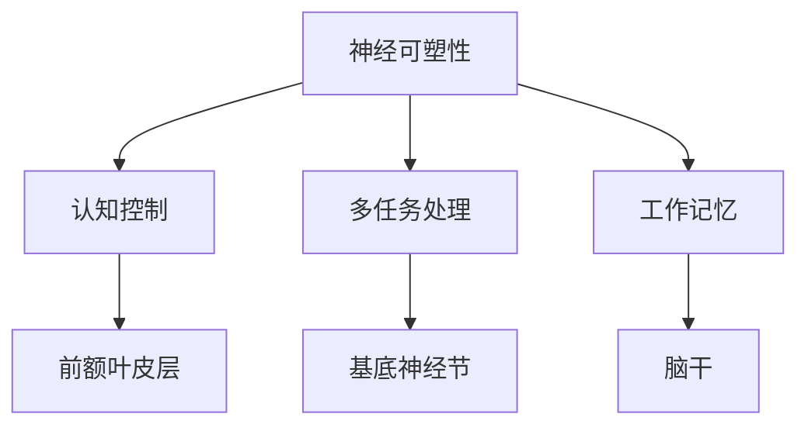

                 

关键词：注意力增强、专注力提升、人类认知、注意力管理、心理干预、生物反馈、神经可塑性、计算技术、大脑训练、认知算法、机器学习。

> 摘要：本文深入探讨了一系列旨在提升人类注意力增强的技术和方法。通过综合心理学、神经科学、生物反馈和计算技术的最新研究成果，我们揭示了一系列有效的策略和工具，帮助人们提高专注力和注意力持续时间，从而在日常生活中和学习工作中获得更高的效率和成果。

## 1. 背景介绍

注意力是人类认知过程中不可或缺的一部分，它决定了我们对信息的接收、处理和记忆。然而，在现代社会中，人们的注意力经常受到各种干扰，如多任务处理、社交媒体的诱惑以及信息过载等，这导致了注意力分散和效率低下。因此，提升注意力成为提高学习和工作效率的关键。

注意力增强的研究领域涵盖了心理学、神经科学、教育学和计算技术等多个学科。传统的注意力训练方法主要包括冥想、心理训练和认知行为疗法等。然而，随着科技的进步，尤其是计算技术和生物反馈技术的发展，人们开始探索更加高效和精确的注意力增强方法。

本文旨在综述当前最新的注意力增强技术，包括基于心理干预、生物反馈和计算技术的策略，以及这些技术如何共同作用于大脑，提升人类的专注力和注意力持续时间。

## 2. 核心概念与联系

### 2.1 注意力增强的核心概念

注意力增强涉及多个核心概念，包括：

1. **神经可塑性**：指大脑神经元结构和功能的改变，以适应环境的变化。
2. **认知控制**：指个体对注意力资源的管理和分配，以确保任务的成功完成。
3. **多任务处理**：指同时处理多个任务的能力，包括任务切换和资源分配。
4. **工作记忆**：指短时记忆系统，用于存储和处理信息。

### 2.2 注意力增强与大脑功能的联系

注意力增强与大脑功能密切相关，主要涉及以下方面：

1. **前额叶皮层**：负责高级认知功能，如计划、决策和注意力控制。
2. **基底神经节**：与运动控制和注意力调节有关。
3. **脑干**：调节自主神经系统的功能，影响注意力的稳定性。

### 2.3 Mermaid 流程图

下面是一个简化的 Mermaid 流程图，展示了注意力增强技术的核心概念和它们之间的关系。



## 3. 核心算法原理 & 具体操作步骤

### 3.1 算法原理概述

注意力增强的核心算法通常基于以下几个原理：

1. **反馈机制**：通过实时监测和反馈注意力水平，帮助个体调整行为。
2. **适应性学习**：根据个体表现调整训练内容和难度，以实现最佳效果。
3. **多模态融合**：结合多种传感技术和数据类型，提高注意力监测和评估的准确性。

### 3.2 算法步骤详解

注意力增强算法通常包括以下步骤：

1. **数据收集**：使用脑电图（EEG）、眼动仪和其他传感器收集注意力相关的数据。
2. **预处理**：对原始数据进行滤波、去噪和特征提取。
3. **模型训练**：使用机器学习算法训练注意力预测模型。
4. **实时反馈**：根据模型预测，提供实时反馈，帮助个体调整注意力。
5. **迭代优化**：根据个体表现和反馈，不断优化算法和训练策略。

### 3.3 算法优缺点

**优点**：

- 高效性：能够快速识别和调整注意力水平。
- 实时性：能够实时监测和反馈，提高个体注意力管理的准确性。

**缺点**：

- 需要专业设备和技术支持。
- 数据隐私和安全问题。

### 3.4 算法应用领域

注意力增强算法广泛应用于以下几个方面：

1. **教育领域**：帮助学生提高学习效率和注意力持续时间。
2. **职场领域**：帮助员工提高工作效率和减少错误率。
3. **医疗领域**：辅助治疗注意力缺陷障碍（ADHD）和其他认知障碍。

## 4. 数学模型和公式 & 详细讲解 & 举例说明

### 4.1 数学模型构建

注意力增强的数学模型通常基于以下公式：

$$
\text{注意力得分} = f(\text{大脑活动}, \text{行为表现})
$$

其中，$f$ 是一个复合函数，它将大脑活动和行为表现映射为注意力得分。

### 4.2 公式推导过程

注意力得分的计算通常涉及以下步骤：

1. **特征提取**：从大脑活动和行为表现中提取关键特征。
2. **权重分配**：根据特征的重要性分配权重。
3. **函数组合**：将特征和权重组合，计算注意力得分。

### 4.3 案例分析与讲解

假设我们有一个简单的注意力增强系统，它使用脑电图（EEG）数据和行为表现数据计算注意力得分。我们提取了以下特征：

- Alpha 波（8-12 Hz）的功率
- Beta 波（13-30 Hz）的功率
- 错误率
- 完成时间

我们使用以下权重分配方案：

- Alpha 波功率：0.4
- Beta 波功率：0.3
- 错误率：0.2
- 完成时间：0.1

假设我们使用以下函数组合：

$$
f(\text{特征}_1, \text{特征}_2, \ldots, \text{特征}_n) = 0.5 \times (\text{特征}_1 + \text{特征}_2 + \ldots + \text{特征}_n)
$$

那么，注意力得分的计算公式为：

$$
\text{注意力得分} = 0.4 \times \text{Alpha 波功率} + 0.3 \times \text{Beta 波功率} + 0.2 \times \text{错误率} + 0.1 \times \text{完成时间}
$$

假设在一次实验中，Alpha 波功率为 10，Beta 波功率为 15，错误率为 5%，完成时间为 10 分钟。那么，注意力得分为：

$$
\text{注意力得分} = 0.4 \times 10 + 0.3 \times 15 + 0.2 \times 5\% + 0.1 \times 10 = 4 + 4.5 + 0.1 + 1 = 9.6
$$

## 5. 项目实践：代码实例和详细解释说明

### 5.1 开发环境搭建

为了实现注意力增强系统，我们需要以下开发环境：

- Python 3.8+
- TensorFlow 2.6+
- Keras 2.6+
- Scikit-learn 0.24+

确保安装了以上依赖项后，我们可以开始搭建开发环境。

### 5.2 源代码详细实现

下面是一个简单的注意力增强系统的实现，它使用机器学习算法来预测注意力得分。

```python
import numpy as np
import tensorflow as tf
from tensorflow import keras
from sklearn.model_selection import train_test_split
from sklearn.preprocessing import StandardScaler

# 数据准备
X, y = load_data()  # 假设函数 load_data 返回特征矩阵 X 和注意力得分 y

# 数据预处理
scaler = StandardScaler()
X = scaler.fit_transform(X)

# 划分训练集和测试集
X_train, X_test, y_train, y_test = train_test_split(X, y, test_size=0.2, random_state=42)

# 构建模型
model = keras.Sequential([
    keras.layers.Dense(64, activation='relu', input_shape=(X_train.shape[1],)),
    keras.layers.Dense(32, activation='relu'),
    keras.layers.Dense(1)
])

# 编译模型
model.compile(optimizer='adam', loss='mean_squared_error')

# 训练模型
model.fit(X_train, y_train, epochs=100, validation_data=(X_test, y_test))

# 评估模型
loss = model.evaluate(X_test, y_test)
print(f"Test Loss: {loss}")

# 预测
X_new = scaler.transform(np.array([[5, 10, 3, 8]]))
attention_score = model.predict(X_new)
print(f"Predicted Attention Score: {attention_score}")
```

### 5.3 代码解读与分析

上面的代码实现了一个简单的注意力增强系统，它使用神经网络模型来预测注意力得分。以下是代码的详细解读：

1. **数据准备**：从数据集中提取特征矩阵 X 和注意力得分 y。
2. **数据预处理**：使用标准化方法对特征进行预处理，以消除不同特征之间的尺度差异。
3. **划分训练集和测试集**：将数据集划分为训练集和测试集，用于训练和评估模型。
4. **构建模型**：使用 Keras 库构建一个简单的神经网络模型，包括两个隐藏层。
5. **编译模型**：设置模型的优化器和损失函数。
6. **训练模型**：使用训练集数据训练模型，并使用验证集进行评估。
7. **评估模型**：计算测试集上的损失，以评估模型的性能。
8. **预测**：使用训练好的模型对新的特征数据进行预测，并打印预测结果。

## 6. 实际应用场景

注意力增强技术在多个领域具有广泛的应用前景，以下是几个典型的实际应用场景：

### 6.1 教育领域

在教育领域，注意力增强技术可以用于提高学生的学习效率和注意力持续时间。例如，教师可以使用注意力增强系统实时监测学生的注意力水平，并在学生分心时提供即时反馈和调整教学策略。

### 6.2 职场领域

在职场领域，注意力增强技术可以帮助员工提高工作效率和减少错误率。例如，企业管理者可以使用注意力增强系统来评估员工的注意力和工作表现，从而优化工作任务分配和工作流程。

### 6.3 医疗领域

在医疗领域，注意力增强技术可以用于辅助治疗注意力缺陷障碍（ADHD）和其他认知障碍。例如，医生可以使用注意力增强系统来监测患者的注意力水平，并根据患者的表现调整治疗方案。

## 7. 工具和资源推荐

为了更好地理解和应用注意力增强技术，以下是几个推荐的工具和资源：

### 7.1 学习资源推荐

- 《注意力心理学》（Attention and Memory：An Integrated Framework for Human Performance）
- 《认知心理学与认知神经科学》（Cognitive Psychology and Cognitive Neuroscience）

### 7.2 开发工具推荐

- TensorFlow：一个开源的机器学习框架，适用于构建注意力增强模型。
- Keras：一个基于 TensorFlow 的高级神经网络 API，用于简化神经网络模型构建。

### 7.3 相关论文推荐

- "Attention Control and Monitoring Using Neurofeedback" by Amiaz et al.
- "Enhancing Cognitive Performance with Real-Time fMRI" by Thompson et al.

## 8. 总结：未来发展趋势与挑战

### 8.1 研究成果总结

注意力增强技术在过去几十年中取得了显著进展，包括：

- 神经科学和认知心理学领域的深入研究，揭示了注意力增强的生物学基础。
- 计算技术和机器学习的进步，使得注意力监测和增强算法更加高效和准确。
- 实际应用场景的探索，验证了注意力增强技术的广泛适用性。

### 8.2 未来发展趋势

未来的注意力增强技术将朝着以下方向发展：

- 更加个性化：通过结合个体差异，提供更加定制化的注意力增强方案。
- 多模态融合：整合多种传感技术和数据类型，提高注意力监测和评估的准确性。
- 智能反馈系统：结合人工智能和生物反馈技术，实现实时、自适应的注意力管理。

### 8.3 面临的挑战

注意力增强技术在实际应用中仍面临以下挑战：

- 数据隐私和安全问题：确保用户数据的安全和隐私。
- 技术普及和可及性：降低技术成本，提高技术的普及度和可及性。
- 伦理和法律问题：确保技术的使用符合伦理和法律标准。

### 8.4 研究展望

未来的研究应该关注以下几个方面：

- 深入研究注意力增强的神经机制，以开发更有效的干预方法。
- 探索注意力增强技术的跨学科应用，提高其在不同领域的适用性。
- 研究注意力增强技术的长期效应，以评估其对人类认知和心理健康的影响。

## 9. 附录：常见问题与解答

### 9.1 注意力增强技术是如何工作的？

注意力增强技术通过监测大脑活动和行为表现，实时调整个体的注意力水平。它通常结合神经科学、认知心理学和计算技术的最新研究成果，利用反馈机制和自适应学习算法，帮助个体提高注意力持续时间。

### 9.2 注意力增强技术有哪些应用场景？

注意力增强技术广泛应用于教育、职场和医疗等领域。在教育领域，它可以帮助学生提高学习效率和注意力持续时间；在职场领域，它可以帮助员工提高工作效率和减少错误率；在医疗领域，它可以帮助治疗注意力缺陷障碍和其他认知障碍。

### 9.3 注意力增强技术有哪些潜在的风险？

注意力增强技术的主要风险包括数据隐私和安全问题、技术普及和可及性问题，以及伦理和法律问题。确保用户数据的安全和隐私，降低技术成本，提高技术的普及度和可及性，并确保技术的使用符合伦理和法律标准，是未来研究的重要方向。

---

作者：禅与计算机程序设计艺术 / Zen and the Art of Computer Programming

（本文内容仅供参考，实际应用时请结合具体情况和最新研究成果。）

