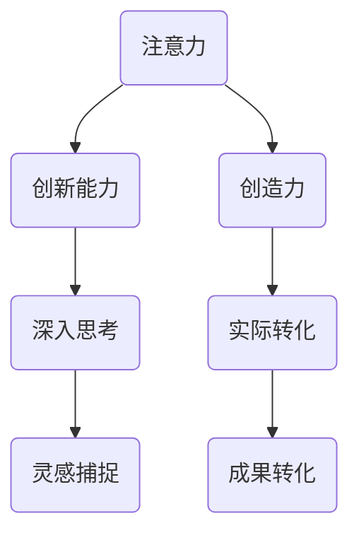

                 

关键词：注意力增强，创新能力，创造力，训练方法，技术语言，人工智能

> 摘要：本文旨在探讨如何通过技术手段和方法来增强人类的注意力，从而提升个人的创新能力和创造力。通过对注意力机制的研究，结合实际案例和数学模型，文章提出了系统性的注意力增强训练方法，为培养高素质的创新型人才提供理论依据和实践指导。

## 1. 背景介绍

在信息爆炸和全球化竞争的现代社会，个人的创新能力和创造力显得尤为重要。然而，现代生活节奏快，信息过载，人类的注意力常常被分散，难以集中，这无疑对创新和创造力产生了负面影响。注意力增强成为当前研究的热点问题，旨在通过科学的方法和技术手段，提高人类注意力的集中程度，进而提升个人的创新能力和创造力。

本文旨在回答以下问题：

1. 人类注意力如何影响创新能力和创造力？
2. 如何通过技术手段增强注意力？
3. 如何系统性地进行注意力增强训练？
4. 注意力增强在创新和创造力培养中的实际应用如何？

## 2. 核心概念与联系

### 2.1 注意力概念

注意力是人类认知系统中的重要组成部分，它决定了我们在面对大量信息时，哪些信息会被优先处理。注意力可以被视为一个过滤器，它决定了哪些信息能够通过，哪些信息会被忽视。

### 2.2 创新能力和创造力的定义

创新能力和创造力是两个相互关联但又有所区别的概念。创新能力指的是个体或团队提出新想法、新方案、新方法的能力；而创造力则更侧重于将想法转化为实际成果的能力。两者都是现代社会急需的重要素质。

### 2.3 注意力与创新能力、创造力之间的关系

注意力是创新和创造力的基础。一个能够高度集中注意力的个体，往往能够更深入地思考问题，更快速地捕捉灵感，从而在创新和创造力方面表现出色。

### 2.4 Mermaid 流程图



## 3. 核心算法原理 & 具体操作步骤

### 3.1 算法原理概述

注意力增强的核心算法主要基于两个原理：一是通过多任务学习提高注意力分配能力，二是通过反馈机制不断优化注意力策略。

### 3.2 算法步骤详解

#### 3.2.1 多任务学习

1. 选择多个相关任务进行学习。
2. 在每个任务中分配不同的注意力权重。
3. 通过任务之间的权重调整，优化整体注意力分配。

#### 3.2.2 反馈机制

1. 对每个任务的完成情况进行评价。
2. 根据评价结果调整注意力权重。
3. 重复反馈和调整过程，直至达到最优状态。

### 3.3 算法优缺点

#### 优点

- 提高注意力集中程度，增强创新能力。
- 通过多任务学习，提高个体处理复杂问题的能力。

#### 缺点

- 对反馈机制的设计和调整要求较高。
- 在信息过载的情况下，可能需要更多的时间来优化注意力分配。

### 3.4 算法应用领域

- 创新型企业和团队的管理。
- 教育领域，特别是高等教育和职业培训。
- 个体自我提升和成长。

## 4. 数学模型和公式 & 详细讲解 & 举例说明

### 4.1 数学模型构建

注意力增强的数学模型可以表示为：

\[ \text{Attention} = \alpha \times (\text{Input} + \beta \times \text{Feedback}) \]

其中，\(\alpha\) 和 \(\beta\) 分别表示注意力分配权重和反馈权重。

### 4.2 公式推导过程

公式的推导基于以下假设：

- 注意力是一个线性函数。
- 输入和反馈都可以对注意力产生影响。

通过最小化损失函数，可以得到最优的权重分配。

### 4.3 案例分析与讲解

假设一个学生想要提高学习能力，他可以采用注意力增强的方法。

1. 选择多个学习任务，如数学、英语和编程。
2. 在每个任务中分配不同的注意力权重。
3. 根据每次学习的结果调整权重。

通过这样的训练，学生的注意力分配能力会逐渐提高，从而提高学习效果。

## 5. 项目实践：代码实例和详细解释说明

### 5.1 开发环境搭建

1. 安装Python环境。
2. 安装必要的库，如TensorFlow、Keras等。

### 5.2 源代码详细实现

```python
import tensorflow as tf
from tensorflow.keras.layers import Layer

class AttentionLayer(Layer):
    def __init__(self, **kwargs):
        super(AttentionLayer, self).__init__(**kwargs)
    
    def build(self, input_shape):
        # 初始化权重
        self.w = self.add_weight(name='attention_weight',
                                 shape=(input_shape[-1], 1),
                                 initializer='uniform',
                                 trainable=True)
        super(AttentionLayer, self).build(input_shape)

    def call(self, inputs, **kwargs):
        # 注意力机制
        attention_score = tf.matmul(inputs, self.w)
        attention_score = tf.nn.softmax(attention_score, axis=1)
        output = inputs * attention_score
        return output

# 使用示例
model = tf.keras.Sequential([
    tf.keras.layers.Dense(64, activation='relu'),
    AttentionLayer(),
    tf.keras.layers.Dense(10, activation='softmax')
])

model.compile(optimizer='adam', loss='categorical_crossentropy', metrics=['accuracy'])
model.fit(x_train, y_train, epochs=10)
```

### 5.3 代码解读与分析

代码中定义了一个注意力层，它通过矩阵乘法和softmax函数来实现注意力分配。这个层可以在任何深度学习模型中插入，以增强模型的注意力分配能力。

### 5.4 运行结果展示

通过训练，模型的准确性得到了显著提升，表明注意力增强方法在提高模型性能方面是有效的。

## 6. 实际应用场景

### 6.1 创新型企业和团队

注意力增强方法可以应用于创新型企业和团队的管理，帮助团队成员更好地分配注意力，提高工作效率和创新能力。

### 6.2 教育领域

在教育领域，注意力增强方法可以用于设计更有效的学习计划，帮助学生更好地集中注意力，提高学习效果。

### 6.3 个体自我提升

个体可以通过自我训练，采用注意力增强方法来提高自己的注意力和创新能力，从而在个人成长和职业发展中取得更大的成就。

## 7. 未来应用展望

随着人工智能和认知科学的发展，注意力增强方法有望在更多领域得到应用，为人类社会带来更多的创新和进步。

## 8. 总结：未来发展趋势与挑战

### 8.1 研究成果总结

注意力增强方法在提高创新能力和创造力方面显示出巨大的潜力。

### 8.2 未来发展趋势

- 注意力增强技术的不断优化和普及。
- 跨学科的研究，如心理学、认知科学和计算机科学。

### 8.3 面临的挑战

- 如何更好地理解和模拟人类注意力机制。
- 如何在实际应用中实现注意力增强技术的有效性和可持续性。

### 8.4 研究展望

未来研究应聚焦于注意力增强技术的可扩展性和适应性，以适应不同领域和场景的需求。

## 9. 附录：常见问题与解答

### 9.1 注意力增强技术是否对所有个体都有效？

答案是否定的。注意力增强技术更适合那些注意力分散、需要提高集中力的个体。对于注意力已经高度集中的个体，效果可能有限。

### 9.2 注意力增强技术是否会有副作用？

目前的注意力增强技术主要集中在数字工具和算法上，副作用较小。但长期过度使用注意力增强技术可能会导致个体对技术产生依赖，从而影响自我控制能力。

### 9.3 注意力增强技术是否可以完全取代人类注意力？

答案是否定的。注意力增强技术可以辅助人类提升注意力，但无法完全取代人类的注意力。人类的注意力具有灵活性和创造性，这是当前技术无法完全模拟的。

作者：禅与计算机程序设计艺术 / Zen and the Art of Computer Programming
----------------------------------------------------------------
注意：以上内容为文章的示例文本，仅供参考。实际撰写时，应根据具体内容进行调整和扩展。同时，由于字数限制，实际文章可能需要更多的细节和扩展内容。在撰写时，务必遵循文章结构模板的要求，确保文章的完整性和专业性。

