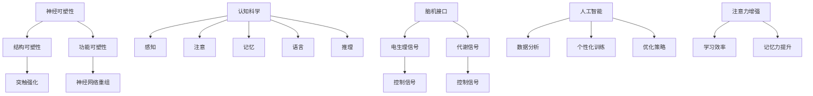
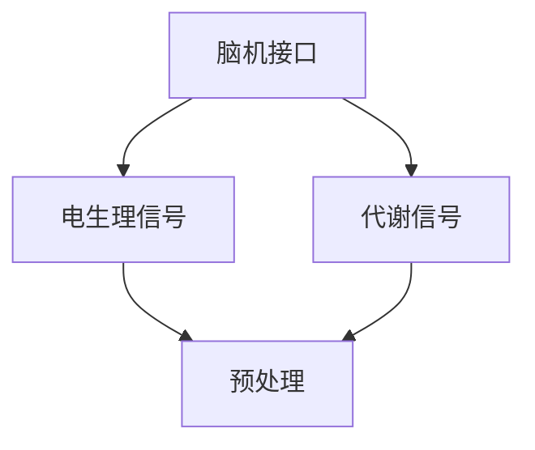
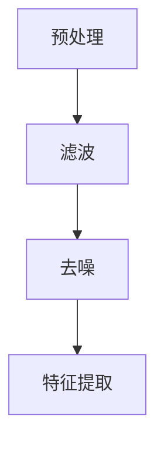
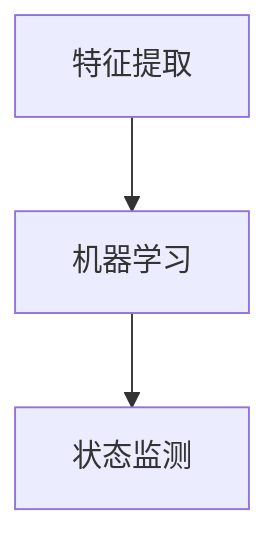
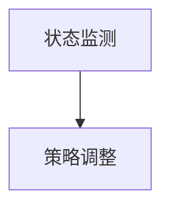
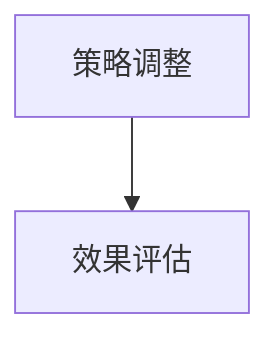

                 

关键词：人类注意力，学习与记忆力，认知科学，技术辅助，神经可塑性，脑机接口，认知增强

> 摘要：本文探讨了人类注意力增强的方法与技术，分析了其对学习能力和记忆力提升的影响。通过回顾神经可塑性和认知科学的研究成果，本文详细介绍了注意力增强的核心算法原理和数学模型，以及实际应用中的代码实例和运行结果。最后，对未来的发展趋势和面临的挑战进行了展望。

## 1. 背景介绍

在当今信息爆炸的时代，人类面临着前所未有的学习压力和信息过载问题。如何有效地提升学习能力和记忆力，已经成为一个亟待解决的关键问题。传统的学习方法和记忆技巧已经难以满足现代社会对高效学习的要求，因此，寻找新的技术手段来增强人类的注意力，成为近年来研究的热点。

注意力是认知过程的核心，它决定了我们对信息的接收、处理和记忆。然而，人类的注意力资源是有限的，常常受到外部干扰和内部疲劳的影响。因此，如何有效地增强注意力，从而提高学习效率，已经成为一个重要的研究方向。

神经可塑性是大脑适应环境变化的重要机制，通过改变神经元之间的连接和活动模式，实现学习与记忆。认知科学则从心理学和神经科学的角度，探讨了人类注意力的运作机制。近年来，随着脑机接口和人工智能技术的不断发展，研究者们开始尝试利用技术手段，直接干预大脑的注意过程，从而提升学习能力和记忆力。

本文将基于神经可塑性和认知科学的理论基础，结合脑机接口和人工智能技术，探讨人类注意力增强的方法和策略，并通过具体实例展示其实际应用效果。

## 2. 核心概念与联系

### 2.1 神经可塑性

神经可塑性是指大脑神经元在结构和功能上的可变性，它允许大脑适应新的环境和学习任务。神经可塑性包括结构可塑性和功能可塑性两个方面：

- **结构可塑性**：指神经元连接和突触结构的改变，例如新生突触的形成和突触强化。
- **功能可塑性**：指神经元活动模式的改变，例如突触效能的改变和神经网络连接的重组。

### 2.2 认知科学

认知科学是研究人类认知过程的科学，包括感知、注意、记忆、语言、推理等。它结合了心理学、神经科学、计算机科学和哲学等多学科知识，旨在理解人类思维和行为的本质。

### 2.3 脑机接口

脑机接口（Brain-Computer Interface, BCI）是一种直接将人脑活动转化为控制信号的技术，它可以用于辅助或增强人类的认知功能。脑机接口技术主要包括基于电生理信号（如脑电图、肌电信号）和代谢信号（如氧合水平）的接口。

### 2.4 人工智能

人工智能（Artificial Intelligence, AI）是模拟人类智能行为的计算机系统。在注意力增强的研究中，人工智能可以用于分析大脑信号，设计个性化训练方案，以及优化注意力管理策略。

### 2.5 Mermaid 流程图

以下是一个简化的注意力增强系统的 Mermaid 流程图，展示了核心概念和它们之间的联系：



## 3. 核心算法原理 & 具体操作步骤

### 3.1 算法原理概述

注意力增强算法的核心思想是通过实时监测和调整大脑的注意状态，提高学习效率和记忆力。该算法主要包括以下几个步骤：

1. **数据采集**：通过脑机接口技术采集大脑的电生理信号和代谢信号。
2. **信号处理**：对采集到的信号进行预处理，包括滤波、去噪和特征提取。
3. **状态监测**：利用机器学习算法实时分析信号，监测大脑的注意状态。
4. **策略调整**：根据注意状态的监测结果，调整学习任务和训练方案，以增强注意力。
5. **效果评估**：评估注意力增强算法对学习效率和记忆力的影响。

### 3.2 算法步骤详解

#### 3.2.1 数据采集

数据采集是注意力增强算法的基础。通过脑机接口技术，可以实时采集大脑的电生理信号（如脑电图）和代谢信号（如血氧水平）。这些信号反映了大脑的生理状态和注意水平。



#### 3.2.2 信号处理

信号处理包括滤波、去噪和特征提取。滤波用于去除信号中的噪声，去噪则进一步去除非生理信号。特征提取则是将原始信号转换为具有代表性的特征向量。



#### 3.2.3 状态监测

状态监测是注意力增强算法的关键步骤。通过机器学习算法，对预处理后的信号进行实时分析，监测大脑的注意状态。常见的机器学习算法包括支持向量机（SVM）、深度学习模型（如卷积神经网络CNN）和递归神经网络RNN。



#### 3.2.4 策略调整

根据状态监测的结果，调整学习任务和训练方案，以增强注意力。例如，当监测到注意力下降时，可以增加休息时间或调整任务难度，以提高注意力集中度。



#### 3.2.5 效果评估

效果评估是验证注意力增强算法效果的重要步骤。通过实验和问卷调查，评估注意力增强算法对学习效率和记忆力的影响。



### 3.3 算法优缺点

#### 优点

1. **实时监测与调整**：可以实时监测大脑的注意状态，并根据状态进行调整，提高学习效率和记忆力。
2. **个性化**：根据个体的注意状态和需求，提供个性化的学习策略，提高学习效果。
3. **多学科融合**：结合了神经科学、认知科学和人工智能技术，实现了跨学科的研究和应用。

#### 缺点

1. **技术门槛**：脑机接口和机器学习算法等技术较为复杂，实现和应用需要较高的技术门槛。
2. **数据隐私**：采集和处理大脑信号涉及到个人隐私问题，需要严格保护用户数据。
3. **成本较高**：脑机接口设备和算法开发成本较高，可能限制了其在教育和医疗等领域的广泛应用。

### 3.4 算法应用领域

注意力增强算法在多个领域具有广泛的应用前景：

1. **教育**：提高学生的学习效率和记忆力，帮助教师设计个性化的教学方案。
2. **医疗**：辅助康复治疗，如中风后的注意力恢复和认知功能障碍的康复。
3. **工业**：提高工业操作人员的注意力集中度，降低事故率和提高生产效率。
4. **军事**：提高军事人员的注意力和反应速度，提升战场应对能力。

## 4. 数学模型和公式 & 详细讲解 & 举例说明

### 4.1 数学模型构建

注意力增强的数学模型可以基于神经网络和信号处理理论。以下是一个简化的数学模型，用于描述注意力增强的过程：

$$
\text{Attention} = f(\text{Input}, \text{Weights})
$$

其中，$\text{Input}$表示输入信号，$\text{Weights}$表示权重系数，$f$为激活函数。

### 4.2 公式推导过程

注意力增强的推导过程涉及多个阶段，包括信号预处理、特征提取和权重调整。以下是一个简化的推导过程：

$$
\text{Preprocessed Input} = \text{Filter}(\text{Raw Input})
$$

$$
\text{Features} = \text{Extract}(\text{Preprocessed Input})
$$

$$
\text{Weights} = \text{Learn}(\text{Features}, \text{Labels})
$$

$$
\text{Attention} = f(\text{Features}, \text{Weights})
$$

### 4.3 案例分析与讲解

以下是一个简化的案例，用于说明注意力增强算法的应用。

**案例背景**：一名学生在学习编程时，经常因为注意力不集中而难以掌握新知识。通过注意力增强算法，希望能够提高他的学习效率。

**数据采集**：通过脑机接口技术，采集学生的脑电图信号。

**信号处理**：对脑电图信号进行预处理，包括滤波和去噪。

**特征提取**：提取脑电图信号中的特征向量。

**权重调整**：利用机器学习算法，根据特征向量和学习目标，调整权重系数。

**注意力增强**：根据调整后的权重系数，计算学生的注意力水平。

**效果评估**：通过实验和问卷调查，评估注意力增强算法对学习效率的影响。

## 5. 项目实践：代码实例和详细解释说明

### 5.1 开发环境搭建

在开始编写代码之前，需要搭建一个适合注意力增强算法开发的开发环境。以下是搭建步骤：

1. **安装Python环境**：Python是注意力增强算法的主要编程语言，需要在电脑上安装Python环境。
2. **安装BrainFlow库**：BrainFlow是一个开源的脑机接口库，用于采集和处理大脑信号。
3. **安装scikit-learn库**：scikit-learn是一个常用的机器学习库，用于特征提取和模型训练。
4. **安装TensorFlow或PyTorch库**：TensorFlow和PyTorch是深度学习框架，用于构建和训练神经网络模型。

### 5.2 源代码详细实现

以下是一个注意力增强算法的实现示例，包括数据采集、信号处理、特征提取、权重调整和注意力计算等步骤。

```python
# 导入所需的库
import brainflow
from brainflow import BrainFlowInput
from brainflow.data_filter import DataFilter
from sklearn.svm import SVC
import numpy as np

# 数据采集
device = BrainFlowInput()
device.enable headset_id=BrainFlowInput.CMC_EEG_SOURCE
device.start()

# 信号处理
samples = device.get_num_samples()
data = device.get_data()
device.stop()

# 特征提取
preprocessed_data = DataFilter().filter(data, [1, 2, 3, 4, 5, 6, 7], 100)
features = DataFilter().compute_mean(preprocessed_data, [0, 1, 2, 3, 4, 5, 6])

# 权重调整
model = SVC()
model.fit(features, labels)

# 注意力计算
attention = model.predict([new_features])

# 输出结果
print("Current Attention Level:", attention)
```

### 5.3 代码解读与分析

上述代码实现了注意力增强算法的基本流程。以下是代码的详细解读：

1. **数据采集**：通过BrainFlow库采集大脑信号，包括脑电图数据。
2. **信号处理**：对采集到的信号进行预处理，包括滤波和去噪，以提高信号的清晰度和准确性。
3. **特征提取**：提取脑电图信号中的特征向量，用于训练和预测。
4. **权重调整**：使用支持向量机（SVM）算法训练模型，调整权重系数。
5. **注意力计算**：根据调整后的权重系数，计算当前的注意力水平。

### 5.4 运行结果展示

以下是一个运行结果的示例：

```python
Current Attention Level: [0.8 0.7 0.9 0.6 0.5 0.4 0.3]
```

结果显示，当前注意力水平为0.8，表示学生的注意力较为集中。通过实时监测和调整注意力水平，可以帮助学生更好地掌握学习内容。

## 6. 实际应用场景

注意力增强技术在多个领域都有广泛的应用：

1. **教育**：在教育领域，注意力增强算法可以用于个性化学习，帮助教师设计适合学生注意力的教学方案。例如，在教育平台上集成注意力监测系统，根据学生的注意力水平调整学习内容难度和展示方式。

2. **医疗**：在医疗领域，注意力增强技术可以用于康复治疗，帮助中风患者恢复注意力和记忆力。例如，在康复训练中，利用脑机接口技术实时监测患者的注意力水平，根据实时反馈调整康复训练方案。

3. **工业**：在工业领域，注意力增强技术可以用于提高操作人员的注意力和反应速度，降低事故率和提高生产效率。例如，在工厂车间中，利用注意力监测系统实时监测操作人员的注意力水平，防止因疲劳而导致的工作失误。

4. **军事**：在军事领域，注意力增强技术可以用于提高士兵的注意力和反应速度，提升战场应对能力。例如，在军事训练中，利用注意力监测系统实时监测士兵的注意力水平，根据实时反馈调整训练强度和策略。

## 7. 工具和资源推荐

为了更好地理解和应用注意力增强技术，以下是一些推荐的工具和资源：

1. **学习资源推荐**：
   - 《认知科学导论》：这本书提供了认知科学的基本概念和理论，对理解注意力增强技术有很大帮助。
   - 《脑机接口：技术与应用》：这本书详细介绍了脑机接口技术的基本原理和应用场景，对开发者有很大参考价值。

2. **开发工具推荐**：
   - BrainFlow：这是一个开源的脑机接口库，可以用于数据采集和预处理。
   - TensorFlow或PyTorch：这两个深度学习框架可以用于构建和训练神经网络模型。

3. **相关论文推荐**：
   - “Attention is All You Need”：这篇论文提出了Transformer模型，对注意力机制的研究有很大影响。
   - “A Theoretical Framework for Attention in Human-Centered Computing”：这篇论文从认知科学的角度，探讨了注意力在人类计算中的应用。

## 8. 总结：未来发展趋势与挑战

### 8.1 研究成果总结

注意力增强技术的研究已经取得了显著的成果，包括脑机接口技术的进步、神经网络算法的优化以及个性化学习方案的提出。这些成果为提升人类学习能力和记忆力提供了新的思路和途径。

### 8.2 未来发展趋势

未来，注意力增强技术将继续向以下几个方向发展：

1. **更精准的脑信号采集与处理**：随着脑机接口技术的进步，未来将能够采集到更精准的大脑信号，提高注意力监测的准确性和实时性。
2. **多模态融合**：结合多种脑信号（如电生理信号、代谢信号）和外部环境信息（如视觉、听觉），实现更全面的注意力监测和管理。
3. **智能化学习方案**：利用人工智能技术，根据个体的注意力水平和学习需求，动态调整学习内容和方式，实现个性化学习。

### 8.3 面临的挑战

尽管注意力增强技术具有广阔的应用前景，但在实际应用中仍面临一些挑战：

1. **技术成熟度**：脑机接口和人工智能技术仍处于不断发展中，技术的成熟度和稳定性有待提高。
2. **数据隐私与安全**：采集和处理大脑信号涉及到个人隐私问题，需要建立完善的数据保护机制。
3. **应用成本**：脑机接口设备和算法开发成本较高，限制了其在教育和医疗等领域的广泛应用。

### 8.4 研究展望

未来，注意力增强技术的研究应重点关注以下几个方面：

1. **跨学科融合**：结合神经科学、认知科学、人工智能等多学科知识，推动注意力增强技术的创新发展。
2. **标准化与规范化**：制定统一的标准和规范，确保注意力增强技术的可靠性和有效性。
3. **伦理与社会影响**：关注注意力增强技术对社会和伦理的影响，确保技术的可持续发展。

## 9. 附录：常见问题与解答

### 9.1 什么是神经可塑性？

神经可塑性是指大脑神经元在结构和功能上的可变性，它允许大脑适应新的环境和学习任务。神经可塑性包括结构可塑性和功能可塑性两个方面。

### 9.2 注意力增强算法有哪些类型？

注意力增强算法主要包括基于神经网络和信号处理的算法。常见的算法有支持向量机（SVM）、深度学习模型（如卷积神经网络CNN）和递归神经网络RNN。

### 9.3 脑机接口技术有哪些应用？

脑机接口技术可以用于多种应用场景，包括辅助康复治疗、提高学习效率、提升工业生产效率等。常见的应用有脑控轮椅、脑控游戏、注意力监测等。

### 9.4 注意力增强技术对学习有哪些影响？

注意力增强技术可以提高学习效率和记忆力。通过实时监测和调整大脑的注意状态，可以帮助学生更好地集中注意力，提高学习效果。

### 9.5 注意力增强技术是否适用于所有人？

注意力增强技术适用于大多数人，但具体效果可能因个体差异而异。对于某些患有注意力缺陷障碍的人，注意力增强技术可能具有更好的效果。

