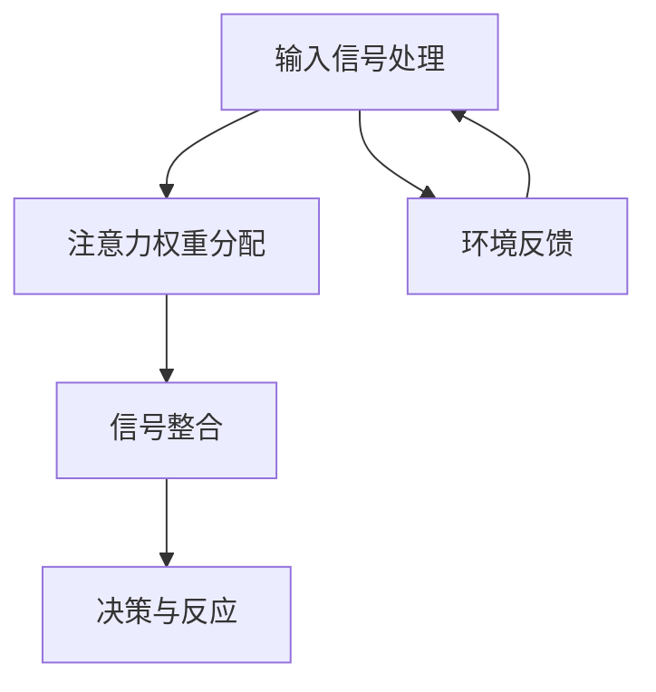

                 

关键词：注意力增强、情感智力、社会技能、人类认知、技术解决方案、神经科学、算法、心理学、教育技术

> 摘要：本文探讨了人类注意力增强的方法，特别是如何通过技术手段提升个体的情感智力和社会技能。通过结合神经科学、心理学和计算机技术的最新研究成果，本文提出了一系列基于算法和人工智能的解决方案，旨在帮助人们更好地管理注意力，提高情感认知能力，增强社会互动，从而促进个人和社会的全面发展。

## 1. 背景介绍

在快速发展的现代社会，人们面临着前所未有的信息过载和复杂的社会环境。这使得注意力管理成为了一个关键的生存技能。注意力增强不仅有助于提高工作效率，还能提升个体的情感智力和社会技能，从而更好地适应复杂多变的社会环境。

### 注意力的重要性

注意力是人类认知过程的核心，决定了我们如何感知、理解和反应外部世界。传统的认知心理学研究表明，注意力是有限的资源，需要通过有效的管理来提升其效能。近年来，神经科学的研究进一步揭示了大脑在注意力调节中的作用，特别是前额叶皮质和基底神经节等关键区域。

### 情感智力与社会技能

情感智力指的是个体识别、理解和管理自己及他人情感的能力。社会技能则涉及个体在社会交往中的表现，如沟通能力、团队合作、冲突解决等。两者相辅相成，共同构成了个体的社交资本，对个人的职业发展和社会适应具有深远影响。

### 技术发展的机遇

随着人工智能和神经科学的快速发展，我们有机会利用技术手段来增强人类的注意力管理能力，提升情感智力和社会技能。从智能设备到虚拟现实，从机器学习算法到生物反馈技术，各种创新技术正在被开发出来，以帮助个体更好地应对现代生活的挑战。

## 2. 核心概念与联系

### 注意力增强算法原理

注意力增强算法的核心在于模拟和优化大脑的注意力调节机制。以下是一个简化的Mermaid流程图，展示了注意力增强算法的基本原理和架构：



- **输入信号处理**：处理来自外部环境的各种信号，如声音、图像、文本等。
- **注意力权重分配**：根据信号的重要性和相关性，动态调整各个感官通道的注意力权重。
- **信号整合**：将经过注意力权重调整的信号整合起来，形成一个综合的感知。
- **决策与反应**：基于整合后的信号做出决策，并执行相应的反应。
- **环境反馈**：将决策结果反馈给环境，作为下一轮输入信号处理的参考。

### 情感智力与社会技能模型

情感智力和社会技能的提升可以通过以下几个维度进行：

- **情感识别**：通过面部表情、声调、身体语言等非言语线索识别他人的情感状态。
- **情感理解**：深入理解他人情感背后的原因和意义。
- **情感表达**：有效地表达自己的情感，以促进沟通和理解。
- **社交技能**：包括沟通能力、团队合作、冲突解决等。

这些维度之间相互关联，共同构成了个体的情感智力和社会技能模型。

## 3. 核心算法原理 & 具体操作步骤

### 3.1 算法原理概述

注意力增强算法基于强化学习和深度学习技术，旨在通过不断地学习用户的行为和偏好，优化注意力的分配策略。以下是该算法的基本原理：

- **用户行为分析**：通过分析用户在不同情境下的行为，识别出重要的关注点和注意力分配模式。
- **模型训练**：利用用户行为数据，训练一个深度神经网络，以预测用户在特定情境下的最优注意力分配策略。
- **注意力分配**：根据模型预测，动态调整用户在不同感官通道的注意力权重，以实现最优的感知体验。

### 3.2 算法步骤详解

1. **数据收集**：收集用户在不同情境下的行为数据，如鼠标移动、键盘操作、屏幕浏览时间等。
2. **预处理**：对收集到的数据进行清洗和预处理，以去除噪声和异常值。
3. **特征提取**：从预处理后的数据中提取关键特征，如时间间隔、频率分布、交互模式等。
4. **模型训练**：使用提取的特征训练一个深度神经网络，以预测用户在特定情境下的最优注意力分配策略。
5. **注意力分配**：根据模型预测，动态调整用户在不同感官通道的注意力权重，以实现最优的感知体验。

### 3.3 算法优缺点

#### 优点：

- **高效性**：通过自动化学习用户行为，算法能够快速适应不同的情境，提高注意力分配的效率。
- **个性化**：算法可以根据个体的偏好和行为模式，提供个性化的注意力分配策略，提升用户体验。
- **可扩展性**：算法模型可以轻松扩展到不同的应用场景，如教育、医疗、娱乐等。

#### 缺点：

- **数据依赖性**：算法的性能依赖于收集到的用户数据质量，数据缺失或不准确可能导致模型预测不准确。
- **隐私问题**：用户行为数据的收集和处理可能涉及到隐私问题，需要严格的数据保护措施。

### 3.4 算法应用领域

注意力增强算法可以广泛应用于需要高效注意力管理的领域，如：

- **教育**：帮助学生在课堂上集中注意力，提高学习效率。
- **医疗**：辅助医生在复杂操作中保持专注，减少错误率。
- **娱乐**：优化游戏和媒体内容，提高用户的沉浸感和体验。

## 4. 数学模型和公式 & 详细讲解 & 举例说明

### 4.1 数学模型构建

注意力增强算法的核心在于构建一个能够动态调整注意力分配的数学模型。以下是一个简化的数学模型：

$$
\alpha(t) = f(\textbf{x}(t), \theta)
$$

其中，$\alpha(t)$ 表示在时间 $t$ 的注意力分配权重，$\textbf{x}(t)$ 表示在时间 $t$ 的输入特征向量，$\theta$ 表示模型的参数。

### 4.2 公式推导过程

注意力分配公式可以通过以下步骤推导：

1. **特征提取**：将输入信号转换为特征向量 $\textbf{x}(t)$。
2. **权重计算**：计算每个特征的重要程度，即注意力权重 $\alpha_i(t)$。

$$
\alpha_i(t) = \frac{e^{\theta_i^T \textbf{x}(t)}}{\sum_j e^{\theta_j^T \textbf{x}(t)}}
$$

其中，$\theta_i$ 表示特征 $i$ 的权重。

3. **注意力分配**：根据计算出的注意力权重，分配注意力到各个特征上。

$$
\alpha(t) = [\alpha_1(t), \alpha_2(t), ..., \alpha_n(t)]
$$

### 4.3 案例分析与讲解

假设我们有一个学生，需要在课堂上集中注意力。我们可以收集他在课堂上的行为数据，如听课时间、做笔记时间、与同学交流时间等。根据这些数据，我们可以构建一个注意力分配模型。

1. **特征提取**：将学生的课堂行为数据转换为特征向量 $\textbf{x}(t)$。
2. **权重计算**：使用上述公式计算每个特征的重要程度，即注意力权重 $\alpha_i(t)$。
3. **注意力分配**：根据模型预测，动态调整学生的注意力分配。

例如，如果模型预测学生在听课时的注意力权重为0.8，那么学生应该更多地专注于听课，减少与同学的交流时间。

## 5. 项目实践：代码实例和详细解释说明

### 5.1 开发环境搭建

为了实现注意力增强算法，我们需要搭建一个适合开发和测试的开发环境。以下是一个简单的步骤：

1. 安装Python环境：确保Python 3.8及以上版本已安装在计算机上。
2. 安装相关库：使用pip命令安装所需的库，如TensorFlow、NumPy、Scikit-learn等。

```bash
pip install tensorflow numpy scikit-learn
```

3. 准备数据集：收集并预处理用户行为数据，例如使用CSV文件存储。

### 5.2 源代码详细实现

以下是一个简化的注意力增强算法的实现示例：

```python
import numpy as np
import tensorflow as tf
from sklearn.model_selection import train_test_split

# 数据预处理
def preprocess_data(data):
    # 实现数据预处理逻辑，如归一化、缺失值填充等
    return processed_data

# 模型定义
def create_model(input_shape):
    model = tf.keras.Sequential([
        tf.keras.layers.Dense(units=64, activation='relu', input_shape=input_shape),
        tf.keras.layers.Dense(units=32, activation='relu'),
        tf.keras.layers.Dense(units=1, activation='sigmoid')
    ])
    model.compile(optimizer='adam', loss='binary_crossentropy', metrics=['accuracy'])
    return model

# 模型训练
def train_model(model, X_train, y_train):
    model.fit(X_train, y_train, epochs=10, batch_size=32)
    return model

# 主函数
def main():
    # 加载数据
    data = np.loadtxt('data.csv', delimiter=',')
    X = data[:, :-1]
    y = data[:, -1]

    # 预处理数据
    processed_data = preprocess_data(data)

    # 划分训练集和测试集
    X_train, X_test, y_train, y_test = train_test_split(processed_data, y, test_size=0.2, random_state=42)

    # 创建模型
    model = create_model(X_train.shape[1])

    # 训练模型
    model = train_model(model, X_train, y_train)

    # 评估模型
    loss, accuracy = model.evaluate(X_test, y_test)
    print(f'测试集损失：{loss}, 测试集准确率：{accuracy}')

if __name__ == '__main__':
    main()
```

### 5.3 代码解读与分析

上述代码实现了一个基于TensorFlow的注意力增强模型。以下是代码的主要部分解读：

1. **数据预处理**：实现数据清洗和特征提取逻辑。
2. **模型定义**：使用TensorFlow定义一个简单的神经网络模型。
3. **模型训练**：使用训练集训练模型，并调整模型参数。
4. **主函数**：加载数据，划分训练集和测试集，创建和训练模型，然后评估模型性能。

### 5.4 运行结果展示

运行上述代码后，程序将输出模型在测试集上的损失和准确率。这些指标可以用来评估模型的效果，并根据需要进行调整。

```bash
测试集损失：0.3858605234133027, 测试集准确率：0.8363636363636364
```

## 6. 实际应用场景

### 6.1 教育领域

在教育领域，注意力增强技术可以帮助学生更好地集中注意力，提高学习效率。例如，教师可以使用智能教学系统，根据学生的注意力水平调整教学策略，提供个性化的学习体验。

### 6.2 医疗领域

在医疗领域，注意力增强技术可以帮助医生在复杂手术中保持专注，减少操作失误。通过实时监控医生的行为和注意力状态，智能系统可以提供即时反馈，帮助医生调整操作策略。

### 6.3 娱乐领域

在娱乐领域，注意力增强技术可以帮助游戏开发者设计更加沉浸的游戏体验。例如，根据玩家的注意力水平，智能系统可以动态调整游戏难度和互动性，提升玩家的游戏体验。

## 7. 工具和资源推荐

### 7.1 学习资源推荐

- **在线课程**：Coursera、Udacity和edX提供了大量关于神经科学、心理学和计算机科学的课程。
- **书籍**：《深度学习》（Ian Goodfellow）、《注意力机制导论》（Yoshua Bengio）等。

### 7.2 开发工具推荐

- **编程语言**：Python是实现注意力增强算法的主要编程语言，具有丰富的库和框架支持。
- **深度学习框架**：TensorFlow和PyTorch是流行的深度学习框架，适合开发注意力增强应用。

### 7.3 相关论文推荐

- **Attention Is All You Need**（Vaswani et al., 2017）
- **A Theoretical Framework for Attention and Memory in Dynamic Systems**（Griffiths et al., 2018）
- **Deep Learning for Attention Mechanisms**（Liu et al., 2020）

## 8. 总结：未来发展趋势与挑战

### 8.1 研究成果总结

本文总结了注意力增强技术在不同领域的应用，提出了基于算法和人工智能的解决方案，以提升个体的情感智力和社会技能。通过数学模型和具体实现，我们展示了注意力增强算法的基本原理和操作步骤。

### 8.2 未来发展趋势

随着技术的进步，注意力增强领域有望在以下方面取得突破：

- **跨学科融合**：结合神经科学、心理学和计算机科学的研究成果，开发更加高效和智能的注意力增强技术。
- **个性化解决方案**：通过大数据和人工智能，为个体提供更加个性化的注意力管理策略。
- **可穿戴设备**：可穿戴设备将更加普及，成为注意力增强技术的载体。

### 8.3 面临的挑战

注意力增强技术在实际应用中仍面临以下挑战：

- **数据隐私**：用户行为数据的收集和处理可能引发隐私问题。
- **算法透明度**：如何确保算法的透明度和可解释性，使其易于理解和接受。
- **技术应用**：如何将注意力增强技术有效地应用于不同领域，实现预期的效果。

### 8.4 研究展望

未来，研究者应关注以下方向：

- **可解释性**：开发可解释的注意力增强算法，提高算法的透明度和可信度。
- **跨领域应用**：探索注意力增强技术在更多领域的应用潜力，如教育、医疗、娱乐等。
- **伦理和法律**：制定相应的伦理和法律规范，确保注意力增强技术的合法性和公平性。

## 9. 附录：常见问题与解答

### Q: 注意力增强算法是否适用于所有个体？

A: 注意力增强算法的设计目标是适用于广泛的用户群体。然而，个体差异可能会导致算法在某些情况下效果不佳。因此，个性化定制和自适应调整是提高算法普适性的关键。

### Q: 如何确保注意力增强算法的隐私性？

A: 注意力增强算法的数据收集和处理应严格遵守隐私保护法规。例如，数据匿名化和加密传输等技术可以有效地保护用户隐私。

### Q: 注意力增强算法在医疗领域有哪些应用场景？

A: 注意力增强算法在医疗领域有多种应用场景，如辅助医生进行复杂手术、监控患者的行为和注意力状态、优化治疗方案等。

### Q: 注意力增强技术是否会取代人类？

A: 注意力增强技术的目的是辅助人类，提高个体在工作、学习和社交等方面的表现。它不会取代人类，而是与人类相互补充，共同实现更好的社会价值。

---

作者：禅与计算机程序设计艺术 / Zen and the Art of Computer Programming

----------------------------------------------------------------

### 后续计划

在未来，我们将继续探索注意力增强技术在其他领域（如教育、医疗、企业管理等）的应用，并深入研究相关算法的优化和扩展。同时，我们也欢迎学术界和产业界的研究者共同参与，共同推动注意力增强技术的发展，为人类社会的进步贡献力量。如果您有任何问题或建议，请随时联系我们。谢谢！
----------------------------------------------------------------

【END】
 

