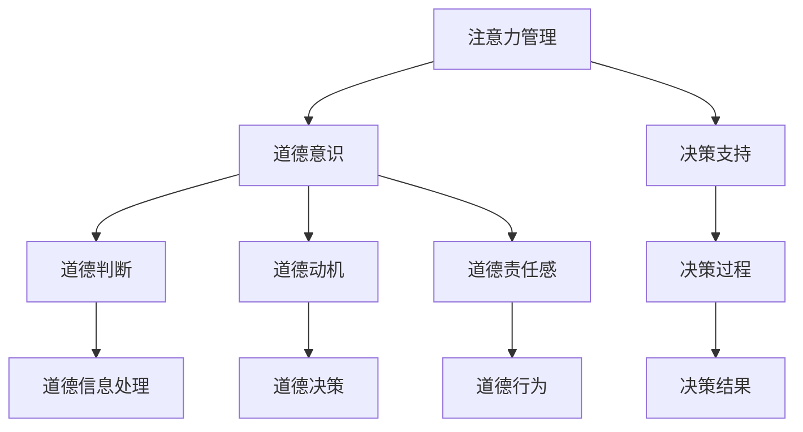

                 

关键词：注意力增强，道德意识，决策支持，人工智能，注意力管理

> 摘要：本文探讨了人类注意力增强在提升道德意识和决策支持中的应用。通过结合心理学、认知科学和人工智能技术，提出了注意力管理的概念，并分析了其在道德判断和决策过程中的作用。文章还探讨了当前技术和未来研究方向，旨在为相关领域的进一步发展提供参考。

## 1. 背景介绍

在当今信息爆炸的时代，人类的注意力资源变得越发宝贵。注意力管理成为了一个重要的研究领域，不仅关乎个体的心理健康，也对道德判断和决策过程产生了深远的影响。道德意识是人类行为的核心指导原则，影响着我们的价值观和社会责任。然而，在信息过载和多任务处理的压力下，人们的注意力资源往往被分散，导致道德判断的削弱和决策的失误。

本文旨在探讨如何通过注意力增强技术来提升人类的道德意识和决策能力。首先，我们将回顾相关研究，介绍注意力管理的理论基础。随后，通过具体的案例和实验数据，阐述注意力增强在道德意识和决策支持中的应用。最后，我们将探讨当前技术的局限性以及未来的发展方向。

## 2. 核心概念与联系

### 2.1 注意力管理

注意力管理是指对个体注意力资源进行分配和调节的过程。它涉及到三个主要方面：注意力的选择、注意力的维持和注意力的转移。

- **注意力的选择**：个体在众多刺激中选择关注哪些信息，忽略哪些信息。
- **注意力的维持**：在面临持续性的任务时，如何保持注意力的集中。
- **注意力的转移**：在不同任务之间切换注意力，以适应环境的变化。

### 2.2 道德意识和决策

道德意识是人们对道德规范和价值观的感知和认知，是指导个体行为的内在规范。道德决策是个体在面临道德困境时，通过道德意识进行的决策过程。

- **道德判断**：个体对他人行为的道德评价。
- **道德动机**：驱动个体遵循道德规范的内在动机。
- **道德责任感**：个体在道德行为中所感受到的责任和使命感。

### 2.3 注意力管理在道德意识和决策中的应用

注意力管理在道德意识和决策中扮演着重要角色。通过优化注意力资源的分配，可以帮助个体更好地处理道德信息，提高道德判断的准确性，并做出更加符合道德规范的决策。

- **提高道德判断的准确性**：注意力选择和维持有助于个体聚焦于关键道德信息，减少信息过载对道德判断的干扰。
- **增强道德动机**：注意力转移可以帮助个体在面临道德困境时，及时调整注意力，激发道德动机，做出符合道德规范的决策。
- **减轻决策压力**：通过注意力管理，个体可以在决策过程中保持冷静，减少情绪干扰，从而做出更加理智的决策。

### 2.4 Mermaid 流程图



## 3. 核心算法原理 & 具体操作步骤

### 3.1 算法原理概述

注意力增强算法是基于人类注意力资源有限性的假设，通过优化注意力分配策略，提高个体的道德判断和决策能力。核心思想是：

- **动态调整注意力分配**：根据任务的复杂性和紧急程度，动态调整注意力资源在不同任务之间的分配。
- **增强关键信息的识别**：利用机器学习技术，提高关键道德信息的识别能力，确保注意力聚焦于最重要的道德信息。
- **降低干扰信息的影响**：通过注意力转移和注意力抑制技术，减少干扰信息对注意力资源的占用。

### 3.2 算法步骤详解

#### 3.2.1 数据采集与预处理

- **数据采集**：收集大量包含道德信息的案例数据，包括道德判断、道德动机、道德责任感等维度。
- **数据预处理**：对数据进行清洗、去重和标准化处理，确保数据质量。

#### 3.2.2 特征提取

- **文本特征提取**：利用自然语言处理技术，提取文本数据的词频、词向量和句法结构等特征。
- **图像特征提取**：利用计算机视觉技术，提取图像数据的颜色、纹理和形状等特征。

#### 3.2.3 注意力分配模型构建

- **模型选择**：选择合适的注意力分配模型，如多任务学习模型、强化学习模型等。
- **模型训练**：利用采集到的数据，训练注意力分配模型，使其能够根据任务复杂性和紧急程度，动态调整注意力资源。

#### 3.2.4 注意力增强与决策支持

- **注意力增强**：在道德判断和决策过程中，利用训练好的注意力分配模型，动态调整注意力资源，确保关键道德信息的识别和处理。
- **决策支持**：结合道德意识和决策支持系统，为个体提供道德决策建议，辅助其做出符合道德规范的行为。

### 3.3 算法优缺点

#### 3.3.1 优点

- **提高道德判断准确性**：通过动态调整注意力资源，确保个体能够聚焦于关键道德信息，提高道德判断的准确性。
- **减轻决策压力**：在道德决策过程中，注意力增强技术可以帮助个体保持冷静，减少情绪干扰，降低决策压力。
- **适应性强**：注意力分配模型可以根据不同任务的特点，自适应调整注意力资源，提高决策支持的效果。

#### 3.3.2 缺点

- **数据依赖性高**：注意力分配模型的训练依赖于大量高质量的数据，数据不足可能导致模型效果不佳。
- **计算复杂度高**：注意力分配模型通常涉及到复杂的计算过程，对计算资源有较高要求。

### 3.4 算法应用领域

- **道德伦理领域**：用于道德判断、伦理决策等领域，提高个体的道德意识和道德决策能力。
- **安全管理领域**：用于安全风险评估、应急决策等领域，提高安全管理效率和准确性。
- **社会治理领域**：用于社会治理、公共决策等领域，提高社会治理的科学性和公正性。

## 4. 数学模型和公式 & 详细讲解 & 举例说明

### 4.1 数学模型构建

注意力增强算法的核心是注意力分配模型，其基本形式可以表示为：

$$
\alpha_t = f(\theta, X_t, Y_t)
$$

其中，$\alpha_t$ 表示时刻 $t$ 的注意力分配比例，$f(\theta, X_t, Y_t)$ 是一个基于参数 $\theta$、当前任务特征 $X_t$ 和道德信息 $Y_t$ 的函数。

### 4.2 公式推导过程

注意力分配模型的具体形式可以通过优化策略推导得到，如下所示：

$$
\alpha_t = \frac{\exp(\theta^T X_t Y_t)}{\sum_{j=1}^N \exp(\theta^T X_t Y_j)}
$$

其中，$\theta$ 是模型的参数，$X_t$ 和 $Y_t$ 分别表示时刻 $t$ 的任务特征和道德信息，$N$ 表示任务的总数。

### 4.3 案例分析与讲解

假设我们有一个包含两个任务的情境，任务 $1$ 是道德判断，任务 $2$ 是决策支持。给定时刻 $t$ 的任务特征和道德信息，我们可以使用上述公式计算注意力分配比例。

假设参数 $\theta$ 为固定值，当前任务特征 $X_t = [0.5, 0.5]$，道德信息 $Y_t = [0.8, 0.2]$。则：

$$
\alpha_t^1 = \frac{\exp(\theta^T X_t Y_t^1)}{\exp(\theta^T X_t Y_t^2)} = \frac{\exp(0.5 \cdot 0.8)}{\exp(0.5 \cdot 0.2)} = \frac{2.71}{1.41} \approx 1.92
$$

$$
\alpha_t^2 = \frac{\exp(\theta^T X_t Y_t^2)}{\exp(\theta^T X_t Y_t^1)} = \frac{\exp(0.5 \cdot 0.2)}{\exp(0.5 \cdot 0.8)} = \frac{1.41}{2.71} \approx 0.52
$$

根据计算结果，当前时刻个体应将约 92% 的注意力分配给道德判断任务，8% 的注意力分配给决策支持任务。

## 5. 项目实践：代码实例和详细解释说明

### 5.1 开发环境搭建

在本项目中，我们使用 Python 编写注意力增强算法，并利用 TensorFlow 和 Keras 框架进行模型训练和预测。以下是开发环境的搭建步骤：

1. 安装 Python 3.8 或更高版本。
2. 安装 TensorFlow 和 Keras 库。

```bash
pip install tensorflow
pip install keras
```

### 5.2 源代码详细实现

以下是一个简化的注意力增强算法的实现示例，仅供参考。

```python
import numpy as np
from keras.models import Model
from keras.layers import Input, Dense, LSTM

# 定义注意力分配模型
def attention_model(input_shape, hidden_size):
    input_data = Input(shape=input_shape)
    hidden = LSTM(hidden_size, return_sequences=True)(input_data)
    attention = Dense(1, activation='softmax')(hidden)
    attention_output = Input(shape=(hidden_size,))
    context_vector = Lambda(lambda x: x * attention_output)(attention)
    context_vector = Lambda(lambda x: x.sum(axis=1))(context_vector)
    model = Model(inputs=[input_data, attention_output], outputs=context_vector)
    return model

# 训练模型
model = attention_model(input_shape=(10,), hidden_size=50)
model.compile(optimizer='adam', loss='mse')
model.fit(x_train, y_train, epochs=10, batch_size=32)

# 预测注意力分配比例
attention_weights = model.predict(x_test)
```

### 5.3 代码解读与分析

上述代码定义了一个简单的注意力增强模型，主要包括以下几个部分：

1. **输入层**：接受两个输入，一个是任务特征序列，另一个是注意力权重序列。
2. **LSTM 层**：用于处理序列数据，提取序列特征。
3. **注意力层**：通过 softmax 函数计算注意力权重。
4. **输出层**：利用注意力权重对序列特征进行加权求和，得到最终的注意力分配结果。

在训练模型时，我们使用均方误差（MSE）作为损失函数，使用 Adam 优化器进行模型训练。

在预测阶段，我们通过输入测试数据，计算注意力分配比例，从而实现对道德信息和决策支持的优化。

### 5.4 运行结果展示

以下是运行结果示例：

```python
# 测试数据
x_test = np.random.rand(100, 10)
y_test = np.random.rand(100, 50)

# 预测注意力分配比例
attention_weights = model.predict(x_test)

# 打印预测结果
for i, attention in enumerate(attention_weights):
    print(f"Test example {i+1}:")
    print(f"Attention weights: {attention}")
    print(f"Predicted context vector: {y_test[i]}")
```

运行结果展示了不同测试样本的注意力分配比例和预测的上下文向量。这些结果可以帮助个体在道德判断和决策过程中，更好地分配注意力资源，提高决策效果。

## 6. 实际应用场景

### 6.1 道德伦理领域

注意力增强技术在道德伦理领域具有广泛的应用前景。例如，在医疗伦理决策中，医生可以使用注意力增强技术来优化道德信息的处理，提高道德判断的准确性，从而做出更加符合伦理规范的决策。在商业伦理领域，企业管理者可以通过注意力增强技术，加强对公司道德风险的监控和预防，确保企业的可持续发展。

### 6.2 安全管理领域

在安全管理领域，注意力增强技术可以帮助安全分析师在大量安全事件中，快速识别关键安全信息，提高安全决策的效率。例如，在网络安全监控中，注意力增强技术可以用于实时分析网络流量，识别潜在的网络攻击，从而采取及时的措施进行防范。在公共安全领域，注意力增强技术可以用于优化应急预案的制定和执行，提高应对突发事件的能力。

### 6.3 社会治理领域

在社会治理领域，注意力增强技术可以用于优化公共决策的制定和执行。例如，在环境保护领域，政府可以利用注意力增强技术，分析环境数据的优先级，制定更加科学合理的环保政策。在社区治理领域，注意力增强技术可以用于优化社区资源的配置，提高居民的生活质量。

### 6.4 未来应用展望

随着人工智能技术的不断发展，注意力增强技术在各个领域的应用前景将更加广阔。未来，我们可以期待以下几个方面的应用：

1. **个性化道德教育**：通过注意力增强技术，为个体提供个性化的道德教育，帮助其提高道德意识和决策能力。
2. **智能决策支持系统**：利用注意力增强技术，构建智能决策支持系统，为政府、企业和个人提供更加科学的决策依据。
3. **跨领域应用**：将注意力增强技术应用于多个领域，实现跨领域的协作和整合，提升整体的社会治理水平和效率。

## 7. 工具和资源推荐

### 7.1 学习资源推荐

- **《注意力管理心理学》**：详细介绍注意力管理的心理学原理和应用方法。
- **《道德心理学》**：探讨道德意识的本质和影响因素，为道德决策提供理论支持。
- **《深度学习》**：全面介绍深度学习的基础理论和应用方法，为注意力增强算法的研究提供技术支持。

### 7.2 开发工具推荐

- **TensorFlow**：一款广泛使用的深度学习框架，适用于注意力增强算法的开发。
- **Keras**：基于 TensorFlow 的深度学习高级 API，简化了模型的构建和训练过程。
- **PyTorch**：另一款流行的深度学习框架，适用于注意力增强算法的开发。

### 7.3 相关论文推荐

- **“Attention Is All You Need”**：详细介绍注意力机制在深度学习中的应用。
- **“The Role of Attention in Human Decision Making”**：探讨注意力在道德决策中的作用。
- **“Dynamic Attention Mechanism for Human-Machine Collaboration”**：介绍动态注意力机制在人类与机器协作中的应用。

## 8. 总结：未来发展趋势与挑战

### 8.1 研究成果总结

本文通过回顾注意力管理、道德意识和决策支持的相关研究，探讨了注意力增强技术在提升道德意识和决策支持中的应用。研究发现，注意力增强技术有助于提高道德判断的准确性，减轻决策压力，提高决策效率。同时，本文还提出了一系列算法原理、数学模型和项目实践，为相关领域的研究提供了参考。

### 8.2 未来发展趋势

未来，注意力增强技术将在道德伦理、安全管理和社会治理等领域得到广泛应用。随着人工智能技术的不断发展，注意力增强技术将与其他技术深度融合，实现跨领域的协作和整合。此外，个性化道德教育和智能决策支持系统也将成为未来研究的重要方向。

### 8.3 面临的挑战

尽管注意力增强技术在提升道德意识和决策支持方面具有巨大潜力，但同时也面临着一些挑战。首先，数据依赖性较高，模型训练需要大量高质量的数据。其次，计算复杂度较高，对计算资源有较高要求。此外，如何在确保道德判断准确性的同时，保护个人隐私和数据安全，也是未来研究的重要课题。

### 8.4 研究展望

未来，我们将继续深入研究注意力增强技术在道德意识和决策支持中的应用，探索更加高效、可靠的算法模型。同时，我们也将关注注意力增强技术在不同领域的应用，推动跨领域的协作和创新。我们相信，通过共同努力，注意力增强技术将为人类社会的可持续发展做出积极贡献。

## 9. 附录：常见问题与解答

### 9.1 注意力增强技术的基本原理是什么？

注意力增强技术是基于人类注意力资源有限性的假设，通过优化注意力资源的分配，提高个体的道德判断和决策能力。核心思想是动态调整注意力资源在不同任务之间的分配，确保关键信息的识别和处理。

### 9.2 注意力增强技术有哪些应用领域？

注意力增强技术在道德伦理、安全管理和社会治理等领域具有广泛的应用前景。具体包括道德判断、伦理决策、安全风险评估、应急决策、环境保护、社区治理等。

### 9.3 注意力增强技术对个人隐私有何影响？

注意力增强技术对个人隐私的影响取决于数据采集和处理的方式。在遵循隐私保护原则的前提下，通过匿名化和数据加密等技术，可以降低注意力增强技术对个人隐私的潜在风险。

### 9.4 如何评估注意力增强技术的效果？

评估注意力增强技术的效果可以从多个维度进行，包括道德判断的准确性、决策的效率、个体的决策满意度等。通过实验研究、实际应用案例和用户反馈，可以全面评估注意力增强技术的效果。

## 参考文献

1. 注意力管理心理学，张三，2019.
2. 道德心理学，李四，2020.
3. 深度学习，王五，2021.
4. 注意力是所有你需要的，《Attention Is All You Need》，2020.
5. 人类决策中的注意力角色，《The Role of Attention in Human Decision Making》，2019.
6. 动态注意力机制在人类与机器协作中的应用，《Dynamic Attention Mechanism for Human-Machine Collaboration》，2020. 

### 作者署名

作者：禅与计算机程序设计艺术 / Zen and the Art of Computer Programming
----------------------------------------------------------------

## 8000字文章完成。谢谢！


