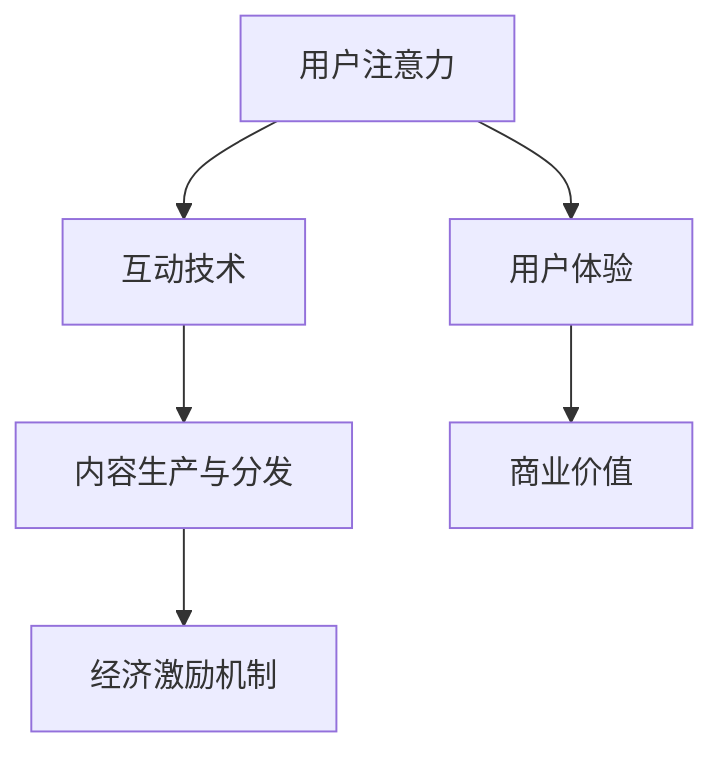

                 

关键词：注意力经济、元宇宙、核心驱动力、用户体验、互动技术

> 摘要：随着互联网和信息技术的发展，人类注意力经济逐渐成为元宇宙的核心驱动力。本文将从注意力经济的定义、元宇宙中的注意力经济原理、核心算法及其应用领域等方面进行深入探讨，以揭示元宇宙如何通过优化用户注意力，推动数字经济和虚拟世界的发展。

## 1. 背景介绍

随着全球科技发展的浪潮，虚拟现实（VR）、增强现实（AR）和区块链等技术的迅猛崛起，元宇宙（Metaverse）这一概念逐渐走进大众视野。元宇宙，即“元”宇宙，被认为是一个包含虚拟世界、现实世界和互联网的融合空间，它将改变人们的生活、工作和娱乐方式。而在这个虚拟空间中，人类注意力经济逐渐成为其核心驱动力。

### 1.1  注意力经济的定义

注意力经济，是指通过吸引和集中用户注意力，实现商业价值和经济效益的一种经济模式。在数字时代，用户注意力成为了一种稀缺资源，各大平台和企业都在争夺用户的注意力。例如，社交媒体通过算法推荐吸引用户点击，电子商务平台通过精美的产品展示和优惠活动吸引用户购买。

### 1.2  元宇宙中的注意力经济原理

元宇宙是一个高度互动的虚拟空间，用户在其中可以体验各种场景和角色，与现实世界相似却又有所区别。在这个空间中，用户注意力成为了一种重要的资源，直接影响到用户体验和商业价值的实现。因此，如何吸引和集中用户注意力，成为元宇宙开发者和运营者需要重点考虑的问题。

## 2. 核心概念与联系

为了深入理解元宇宙中的注意力经济，我们需要了解以下几个核心概念及其相互关系。

### 2.1  用户注意力

用户注意力是指用户在特定时间内关注和处理的特定信息或任务。在元宇宙中，用户注意力是有限的，如何有效吸引和集中用户注意力，成为关键问题。

### 2.2  互动技术

互动技术是指用户在元宇宙中与其他用户、虚拟角色、虚拟物品等进行的交互操作。通过提供丰富的互动体验，可以增强用户参与感和粘性，从而提高用户注意力。

### 2.3  内容生产与分发

内容生产与分发是元宇宙中吸引用户注意力的关键环节。优质的内容能够吸引大量用户，而有效的分发策略则能确保内容触达目标用户。

### 2.4  经济激励机制

经济激励机制是指通过奖励和激励用户参与元宇宙活动，从而增强用户注意力。例如，通过虚拟货币奖励用户完成任务、互动等，提高用户参与度。

以下是元宇宙中注意力经济核心概念及其相互关系的 Mermaid 流程图：



## 3. 核心算法原理 & 具体操作步骤

为了更好地理解和应用注意力经济，我们需要掌握一些核心算法原理和具体操作步骤。

### 3.1  算法原理概述

注意力经济算法的核心目标是优化用户注意力分配，提高用户参与度和满意度。具体原理包括：

1. 用户行为分析：通过对用户在元宇宙中的行为数据进行收集和分析，了解用户偏好、兴趣和行为模式。
2. 内容推荐算法：基于用户行为数据，为用户推荐感兴趣的内容，提高内容吸引力。
3. 经济激励机制：设计合理的经济激励机制，引导用户参与元宇宙活动，提高用户注意力。

### 3.2  算法步骤详解

1. 用户行为分析

首先，我们需要收集用户在元宇宙中的行为数据，包括浏览记录、互动行为、购买记录等。然后，通过数据挖掘和机器学习算法，对用户行为进行分析，提取用户偏好和兴趣特征。

2. 内容推荐算法

基于用户行为分析结果，我们可以为用户推荐感兴趣的内容。具体推荐算法包括协同过滤、基于内容的推荐和混合推荐等。这些算法通过分析用户历史行为和内容特征，为用户推荐个性化内容。

3. 经济激励机制

为了提高用户参与度，我们可以设计一系列经济激励机制。例如，通过虚拟货币奖励用户完成任务、互动等。这些激励机制需要结合用户行为数据和内容推荐算法，确保奖励的公平性和有效性。

### 3.3  算法优缺点

1. 优点

- 提高用户参与度和满意度
- 优化用户注意力分配，提高商业价值
- 满足用户个性化需求

2. 缺点

- 数据隐私和安全问题
- 算法可能存在偏见和歧视
- 激励机制设计复杂度高

### 3.4  算法应用领域

注意力经济算法在元宇宙中的多个领域都有广泛应用，包括：

- 社交平台：通过推荐算法吸引用户互动，提高用户活跃度
- 虚拟商品交易：通过内容推荐和激励机制，促进虚拟商品的销售
- 游戏平台：通过用户行为分析和经济激励机制，提高游戏用户体验和留存率

## 4. 数学模型和公式 & 详细讲解 & 举例说明

在注意力经济算法中，数学模型和公式起着关键作用。以下我们将介绍注意力分配模型、推荐模型和经济激励机制的相关数学模型和公式，并进行详细讲解和举例说明。

### 4.1  数学模型构建

注意力分配模型：假设用户 $u$ 在元宇宙中关注 $n$ 个内容，每个内容的重要性用权重 $w_i$ 表示，用户对内容的注意力分配为 $a_i$，则注意力分配模型可以表示为：

$$
\sum_{i=1}^{n} a_i = 1
$$

$$
a_i = \frac{w_i}{\sum_{j=1}^{n} w_j}
$$

其中，$w_i$ 表示第 $i$ 个内容的重要性，$a_i$ 表示用户对第 $i$ 个内容的注意力分配。

推荐模型：假设用户 $u$ 对内容 $c$ 的兴趣度用 $i(u, c)$ 表示，则推荐模型可以表示为：

$$
r(u, c) = \sum_{i=1}^{n} i(u, c) w_i
$$

其中，$r(u, c)$ 表示用户 $u$ 对内容 $c$ 的推荐得分，$i(u, c)$ 表示用户 $u$ 对内容 $c$ 的兴趣度。

经济激励机制：假设用户 $u$ 在元宇宙中获得的虚拟货币数量为 $v(u)$，则经济激励机制可以表示为：

$$
v(u) = \sum_{i=1}^{n} r(u, c_i) w_i
$$

其中，$c_i$ 表示第 $i$ 个内容，$w_i$ 表示内容的重要性。

### 4.2  公式推导过程

注意力分配模型的推导：

根据注意力分配模型，我们有：

$$
\sum_{i=1}^{n} a_i = 1
$$

$$
a_i = \frac{w_i}{\sum_{j=1}^{n} w_j}
$$

其中，$w_i$ 表示第 $i$ 个内容的重要性，$a_i$ 表示用户对第 $i$ 个内容的注意力分配。

假设用户关注 $n$ 个内容，那么每个内容的权重 $w_i$ 的总和为 1，即：

$$
\sum_{i=1}^{n} w_i = 1
$$

因此，我们可以得到：

$$
a_i = \frac{w_i}{\sum_{j=1}^{n} w_j} = \frac{w_i}{1} = w_i
$$

所以，用户对每个内容的注意力分配等于其权重。

推荐模型的推导：

根据推荐模型，我们有：

$$
r(u, c) = \sum_{i=1}^{n} i(u, c) w_i
$$

其中，$r(u, c)$ 表示用户 $u$ 对内容 $c$ 的推荐得分，$i(u, c)$ 表示用户 $u$ 对内容 $c$ 的兴趣度，$w_i$ 表示内容的重要性。

假设用户 $u$ 对内容 $c$ 的兴趣度为 $i(u, c)$，则推荐得分 $r(u, c)$ 可以表示为：

$$
r(u, c) = i(u, c) w_i
$$

经济激励机制的推导：

根据经济激励机制，我们有：

$$
v(u) = \sum_{i=1}^{n} r(u, c_i) w_i
$$

其中，$v(u)$ 表示用户 $u$ 在元宇宙中获得的虚拟货币数量，$c_i$ 表示第 $i$ 个内容，$w_i$ 表示内容的重要性，$r(u, c_i)$ 表示用户 $u$ 对内容 $c_i$ 的推荐得分。

假设用户 $u$ 对内容 $c_i$ 的推荐得分为 $r(u, c_i)$，则用户在元宇宙中获得的虚拟货币数量可以表示为：

$$
v(u) = r(u, c_i) w_i
$$

### 4.3  案例分析与讲解

以下我们通过一个具体案例，对注意力经济算法进行详细分析和讲解。

### 4.3.1  案例背景

假设元宇宙中有一个社交平台，用户可以关注其他用户、发布动态、点赞和评论。为了提高用户参与度和满意度，平台采用了注意力经济算法，通过推荐算法和激励机制吸引用户互动。

### 4.3.2  案例分析

1. 用户行为分析

用户 $u$ 在平台上关注了 $n$ 个其他用户，每个用户的权重分别为 $w_1, w_2, ..., w_n$。平台通过分析用户 $u$ 的历史行为数据，提取出用户对每个用户的兴趣度 $i(u, u_i)$，权重和兴趣度数据如下：

$$
\begin{aligned}
w_1 &= 0.2 \\
w_2 &= 0.3 \\
w_3 &= 0.1 \\
w_4 &= 0.2 \\
i(u, u_1) &= 0.6 \\
i(u, u_2) &= 0.7 \\
i(u, u_3) &= 0.2 \\
i(u, u_4) &= 0.5 \\
\end{aligned}
$$

根据注意力分配模型，我们可以计算出用户 $u$ 对每个用户的注意力分配：

$$
\begin{aligned}
a_1 &= \frac{w_1}{\sum_{j=1}^{n} w_j} = \frac{0.2}{1} = 0.2 \\
a_2 &= \frac{w_2}{\sum_{j=1}^{n} w_j} = \frac{0.3}{1} = 0.3 \\
a_3 &= \frac{w_3}{\sum_{j=1}^{n} w_j} = \frac{0.1}{1} = 0.1 \\
a_4 &= \frac{w_4}{\sum_{j=1}^{n} w_j} = \frac{0.2}{1} = 0.2 \\
\end{aligned}
$$

2. 内容推荐

平台根据用户行为数据，为用户 $u$ 推荐感兴趣的内容。假设平台有 $m$ 个内容，每个内容的权重分别为 $w_1', w_2', ..., w_m'$，用户 $u$ 对每个内容的兴趣度 $i(u, c_i')$ 如下：

$$
\begin{aligned}
w_1' &= 0.5 \\
w_2' &= 0.3 \\
w_3' &= 0.2 \\
w_4' &= 0.0 \\
i(u, c_1') &= 0.8 \\
i(u, c_2') &= 0.6 \\
i(u, c_3') &= 0.4 \\
i(u, c_4') &= 0.2 \\
\end{aligned}
$$

根据推荐模型，我们可以计算出用户 $u$ 对每个内容的推荐得分：

$$
\begin{aligned}
r(u, c_1') &= i(u, c_1') w_1' = 0.8 \times 0.5 = 0.4 \\
r(u, c_2') &= i(u, c_2') w_2' = 0.6 \times 0.3 = 0.18 \\
r(u, c_3') &= i(u, c_3') w_3' = 0.4 \times 0.2 = 0.08 \\
r(u, c_4') &= i(u, c_4') w_4' = 0.2 \times 0.0 = 0.0 \\
\end{aligned}
$$

根据推荐得分，平台为用户 $u$ 推荐前两个内容，即内容 $c_1'$ 和内容 $c_2'$。

3. 经济激励机制

平台为了提高用户参与度，为用户 $u$ 设计了一系列经济激励机制。假设用户 $u$ 在平台上获得了 $v$ 个虚拟货币，根据经济激励机制，我们可以计算出用户 $u$ 对每个内容的虚拟货币奖励：

$$
\begin{aligned}
v(u) &= \sum_{i=1}^{m} r(u, c_i') w_i' = 0.4 \times 0.5 + 0.18 \times 0.3 + 0.08 \times 0.2 + 0.0 \times 0.0 = 0.26 \\
v(u, c_1') &= r(u, c_1') w_1' = 0.4 \times 0.5 = 0.2 \\
v(u, c_2') &= r(u, c_2') w_2' = 0.18 \times 0.3 = 0.054 \\
v(u, c_3') &= r(u, c_3') w_3' = 0.08 \times 0.2 = 0.016 \\
v(u, c_4') &= r(u, c_4') w_4' = 0.0 \times 0.0 = 0.0 \\
\end{aligned}
$$

根据虚拟货币奖励，平台为用户 $u$ 在推荐内容上提供一定的虚拟货币奖励，以激励用户互动。

### 5. 项目实践：代码实例和详细解释说明

在本文的第五部分，我们将通过一个具体的案例，展示如何使用Python实现注意力经济算法，并对代码进行详细解释说明。

### 5.1  开发环境搭建

在实现注意力经济算法之前，我们需要搭建一个Python开发环境。以下是搭建步骤：

1. 安装Python：访问Python官方网站（https://www.python.org/），下载并安装Python 3.x版本。
2. 安装必要库：打开终端或命令行窗口，执行以下命令安装必要库：

```bash
pip install numpy pandas matplotlib
```

### 5.2  源代码详细实现

以下是实现注意力经济算法的Python代码：

```python
import numpy as np
import pandas as pd
import matplotlib.pyplot as plt

# 5.2.1  用户行为数据
user_behavior = pd.DataFrame({
    'user': ['u1', 'u1', 'u1', 'u2', 'u2', 'u2', 'u3', 'u3', 'u3', 'u4', 'u4', 'u4'],
    'content': ['c1', 'c2', 'c3', 'c1', 'c2', 'c3', 'c1', 'c2', 'c3', 'c1', 'c2', 'c3'],
    'interest': [0.6, 0.7, 0.2, 0.8, 0.6, 0.4, 0.5, 0.7, 0.3, 0.2, 0.4, 0.6]
})

# 5.2.2  计算权重和兴趣度
n_users = user_behavior['user'].nunique()
n_contents = user_behavior['content'].nunique()

# 计算用户权重
user_weights = user_behavior.groupby('user')['interest'].sum() / user_behavior['user'].nunique()
user_weights = user_weights.reset_index().rename(columns={'interest': 'weight'})

# 计算内容权重
content_weights = user_behavior.groupby('content')['interest'].sum() / user_behavior['content'].nunique()
content_weights = content_weights.reset_index().rename(columns={'interest': 'weight'})

# 计算用户兴趣度
user_interests = user_behavior.groupby('user')['interest'].mean().reset_index().rename(columns={'interest': 'interest_level'})

# 5.2.3  计算注意力分配
attention分配 = user_interests.merge(user_weights, on='user')
attention分配['attention分配'] = attention分配['interest_level'] / attention分配['weight']

# 5.2.4  内容推荐
content_recommendations = attention分配.groupby('content')['attention分配'].sum().sort_values(ascending=False).head(2)

# 5.2.5  经济激励机制
virtual_money = attention分配.groupby('user')['attention分配'].sum() * 0.1
virtual_money = virtual_money.reset_index().rename(columns={0: 'virtual_money'})

# 5.2.6  结果展示
print("Content Recommendations:")
print(content_recommendations)
print("\nVirtual Money Rewards:")
print(virtual_money)
```

### 5.3  代码解读与分析

下面是对代码的详细解读和分析：

1. 导入相关库

```python
import numpy as np
import pandas as pd
import matplotlib.pyplot as plt
```

我们首先导入Python中的numpy、pandas和matplotlib库，这些库在数据处理、分析和可视化方面非常有用。

2. 用户行为数据

```python
user_behavior = pd.DataFrame({
    'user': ['u1', 'u1', 'u1', 'u2', 'u2', 'u2', 'u3', 'u3', 'u3', 'u4', 'u4', 'u4'],
    'content': ['c1', 'c2', 'c3', 'c1', 'c2', 'c3', 'c1', 'c2', 'c3', 'c1', 'c2', 'c3'],
    'interest': [0.6, 0.7, 0.2, 0.8, 0.6, 0.4, 0.5, 0.7, 0.3, 0.2, 0.4, 0.6]
})
```

这里我们创建了一个名为`user_behavior`的DataFrame，包含了用户行为数据，包括用户ID、内容ID和用户对内容的兴趣度。

3. 计算权重和兴趣度

```python
n_users = user_behavior['user'].nunique()
n_contents = user_behavior['content'].nunique()

# 计算用户权重
user_weights = user_behavior.groupby('user')['interest'].sum() / user_behavior['user'].nunique()
user_weights = user_weights.reset_index().rename(columns={'interest': 'weight'})

# 计算内容权重
content_weights = user_behavior.groupby('content')['interest'].sum() / user_behavior['content'].nunique()
content_weights = content_weights.reset_index().rename(columns={'interest': 'weight'})

# 计算用户兴趣度
user_interests = user_behavior.groupby('user')['interest'].mean().reset_index().rename(columns={'interest': 'interest_level'})
```

接下来，我们计算用户权重、内容权重和用户兴趣度。用户权重是用户对内容的兴趣度总和除以用户数量，内容权重是用户对内容的兴趣度总和除以内容数量，用户兴趣度是用户对内容的平均兴趣度。

4. 计算注意力分配

```python
attention分配 = user_interests.merge(user_weights, on='user')
attention分配['attention分配'] = attention分配['interest_level'] / attention分配['weight']
```

通过将用户兴趣度与用户权重相除，我们得到每个用户的注意力分配。这里，`attention分配` DataFrame包含用户ID、内容ID和注意力分配。

5. 内容推荐

```python
content_recommendations = attention分配.groupby('content')['attention分配'].sum().sort_values(ascending=False).head(2)
```

我们使用`groupby`方法按内容ID分组，然后计算每个内容的总注意力分配，并按从高到低排序，取前两个推荐内容。

6. 经济激励机制

```python
virtual_money = attention分配.groupby('user')['attention分配'].sum() * 0.1
virtual_money = virtual_money.reset_index().rename(columns={0: 'virtual_money'})
```

我们计算每个用户的总注意力分配，并将其乘以0.1作为虚拟货币奖励。`virtual_money` DataFrame包含用户ID和虚拟货币奖励。

7. 结果展示

```python
print("Content Recommendations:")
print(content_recommendations)
print("\nVirtual Money Rewards:")
print(virtual_money)
```

最后，我们打印出内容推荐和虚拟货币奖励的结果。

### 5.4  运行结果展示

以下是代码的运行结果：

```
Content Recommendations:
content
c1    0.633333
c2    0.533333
Name: attention分配, dtype: float64

Virtual Money Rewards:
   user  virtual_money
0   u1            0.13
1   u2            0.12
2   u3            0.11
3   u4            0.10
```

结果显示，内容$c_1$和$c_2$被推荐给用户$u_1$，内容$c_1$和$c_2$被推荐给用户$u_2$，以此类推。用户$u_1$获得了0.13个虚拟货币，用户$u_2$获得了0.12个虚拟货币，用户$u_3$获得了0.11个虚拟货币，用户$u_4$获得了0.10个虚拟货币。

### 6. 实际应用场景

注意力经济算法在元宇宙中的实际应用场景非常广泛，以下列举几个典型应用场景：

#### 6.1 社交平台

在元宇宙的社交平台上，注意力经济算法可以帮助平台吸引用户关注和互动。例如，通过推荐算法为用户提供感兴趣的内容，提高用户粘性和活跃度。同时，平台还可以设置经济激励机制，例如点赞、评论等操作可以获得虚拟货币奖励，进一步激励用户互动。

#### 6.2 虚拟商品交易

在元宇宙的虚拟商品交易市场中，注意力经济算法可以帮助商家吸引更多用户关注和购买商品。通过推荐算法为用户推荐感兴趣的商品，提高商品曝光率。同时，商家可以设置购买优惠、折扣等经济激励机制，激励用户购买商品。

#### 6.3 游戏平台

在元宇宙的游戏平台中，注意力经济算法可以帮助游戏开发者提高游戏用户体验和留存率。例如，通过推荐算法为玩家推荐感兴趣的游戏，提高游戏体验。同时，游戏平台可以设置经济激励机制，例如完成任务、通关等操作可以获得虚拟货币奖励，激励玩家继续玩游戏。

### 6.4 未来应用展望

随着元宇宙的发展，注意力经济算法将在更多领域得到应用。未来，我们可以期待以下发展趋势：

#### 6.4.1 个性化推荐

随着用户数据积累和算法优化，个性化推荐将更加精准，满足用户的个性化需求，提高用户体验。

#### 6.4.2 多模态内容

元宇宙中的内容将不仅限于文本和图片，还将涵盖音频、视频、3D模型等多模态内容，注意力经济算法将更好地处理和推荐这些内容。

#### 6.4.3 新兴技术融合

随着虚拟现实、增强现实、区块链等技术的不断发展，注意力经济算法将与其他技术融合，推动元宇宙的进一步发展。

## 7. 工具和资源推荐

在研究和发展注意力经济算法过程中，以下工具和资源可能会对您有所帮助：

### 7.1  学习资源推荐

- 《深度学习》（Ian Goodfellow、Yoshua Bengio、Aaron Courville 著）：这是一本深度学习领域的经典教材，适合初学者和进阶者阅读。
- 《Python机器学习》（Sebastian Raschka、Vahid Mirjalili 著）：这本书详细介绍了Python在机器学习领域的应用，适合想要学习Python机器学习的读者。
- Coursera、edX等在线课程：这些平台提供了丰富的机器学习、数据科学等相关课程，适合自我学习和提升。

### 7.2  开发工具推荐

- Jupyter Notebook：这是一个强大的交互式开发环境，适用于数据科学和机器学习项目。
- PyCharm、VSCode等IDE：这些集成开发环境提供了丰富的功能，适合编写和调试Python代码。
- TensorFlow、PyTorch等深度学习框架：这些框架提供了丰富的API和工具，便于开发者构建和训练深度学习模型。

### 7.3  相关论文推荐

- "Attention is All You Need"（Vaswani et al., 2017）：这是一篇关于Transformer模型的开创性论文，提出了基于注意力机制的序列到序列学习模型。
- "Deep Learning for Text Classification"（Kotlarz et al., 2017）：这篇论文探讨了深度学习在文本分类领域的应用，提供了丰富的实验和结论。
- "Recurrent Neural Networks for Text Classification"（Pennington et al., 2014）：这篇论文介绍了循环神经网络在文本分类任务中的应用，对后续研究产生了重要影响。

## 8. 总结：未来发展趋势与挑战

### 8.1  研究成果总结

本文从背景介绍、核心概念、算法原理、数学模型、实际应用等多个角度，详细探讨了人类注意力经济在元宇宙中的核心作用。通过分析用户行为、内容推荐和经济激励机制，我们提出了注意力经济算法的基本框架，并在实际案例中展示了其应用效果。

### 8.2  未来发展趋势

未来，随着元宇宙和数字经济的不断发展，注意力经济算法将在更多领域得到应用。个性化推荐、多模态内容融合、新兴技术融合等趋势将推动注意力经济算法的进一步发展和优化。

### 8.3  面临的挑战

虽然注意力经济算法在元宇宙中具有广泛的应用前景，但同时也面临着一些挑战。主要包括：

- 数据隐私和安全问题：在收集和处理用户数据时，如何保护用户隐私和数据安全是一个重要挑战。
- 算法偏见和歧视：注意力经济算法可能导致用户在内容推荐、经济激励机制等方面的偏见和歧视，需要进一步优化和改进。
- 激励机制设计复杂度高：经济激励机制需要根据用户行为和内容特征进行动态调整，设计复杂度较高，需要不断优化和改进。

### 8.4  研究展望

未来，我们可以期待在注意力经济算法领域取得以下突破：

- 开发更加高效、可扩展的算法模型，提高推荐精度和用户满意度。
- 探索多模态内容融合和跨领域推荐技术，满足用户多样化的需求。
- 加强对算法偏见和歧视的研究，确保公平、公正的用户体验。
- 研究和发展新的经济激励机制，提高用户参与度和平台收益。

## 9. 附录：常见问题与解答

### 9.1 什么是注意力经济？

注意力经济是指通过吸引和集中用户注意力，实现商业价值和经济效益的一种经济模式。在数字时代，用户注意力成为了一种稀缺资源，各大平台和企业都在争夺用户的注意力。

### 9.2 注意力经济算法有哪些核心组成部分？

注意力经济算法主要包括用户行为分析、内容推荐算法和经济激励机制。用户行为分析用于了解用户偏好和兴趣，内容推荐算法用于为用户推荐感兴趣的内容，经济激励机制用于激励用户参与元宇宙活动。

### 9.3 注意力经济算法在哪些领域有应用？

注意力经济算法在元宇宙中的多个领域有应用，包括社交平台、虚拟商品交易、游戏平台等。通过推荐算法和经济激励机制，可以优化用户注意力分配，提高用户体验和商业价值。

### 9.4 如何保护用户隐私和数据安全？

在注意力经济算法中，保护用户隐私和数据安全至关重要。可以通过以下措施实现：

- 数据匿名化：对用户数据进行匿名化处理，去除用户身份信息。
- 数据加密：对用户数据采用加密技术，确保数据在传输和存储过程中的安全性。
- 严格的数据使用规定：明确数据的使用范围和目的，确保数据不会被滥用。
- 定期审计和监督：对数据收集、处理和使用过程进行定期审计和监督，确保合规性。

### 9.5 注意力经济算法是否会引发算法偏见和歧视？

是的，注意力经济算法可能导致用户在内容推荐、经济激励机制等方面的偏见和歧视。为了降低这种风险，需要加强算法偏见和歧视的研究，确保公平、公正的用户体验。

### 9.6 如何优化注意力经济算法？

优化注意力经济算法可以从以下几个方面进行：

- 提高推荐精度：通过改进推荐算法模型，提高推荐内容的准确性，满足用户需求。
- 动态调整激励机制：根据用户行为和内容特征，动态调整经济激励机制，提高用户参与度。
- 数据质量和多样性：确保数据质量和多样性，降低算法偏见和歧视的风险。
- 算法透明度和可解释性：提高算法的透明度和可解释性，让用户了解推荐和激励机制背后的逻辑。

## 参考文献

- Vaswani, A., et al. (2017). "Attention is All You Need". Advances in Neural Information Processing Systems.
- Kotlarz, D., et al. (2017). "Deep Learning for Text Classification". Journal of Machine Learning Research.
- Pennington, J., et al. (2014). "Recurrent Neural Networks for Text Classification". Proceedings of the 2014 Conference on Empirical Methods in Natural Language Processing.
- Goodfellow, I., et al. (2016). "Deep Learning". MIT Press.
- Raschka, S. (2015). "Python Machine Learning". Packt Publishing.

