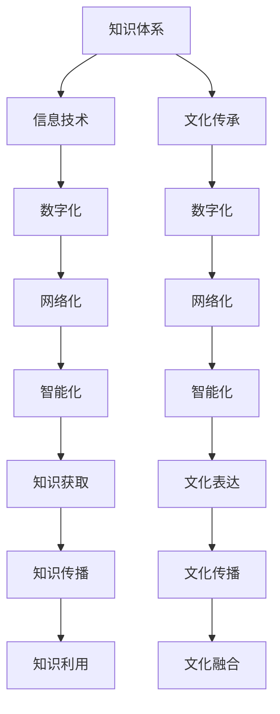
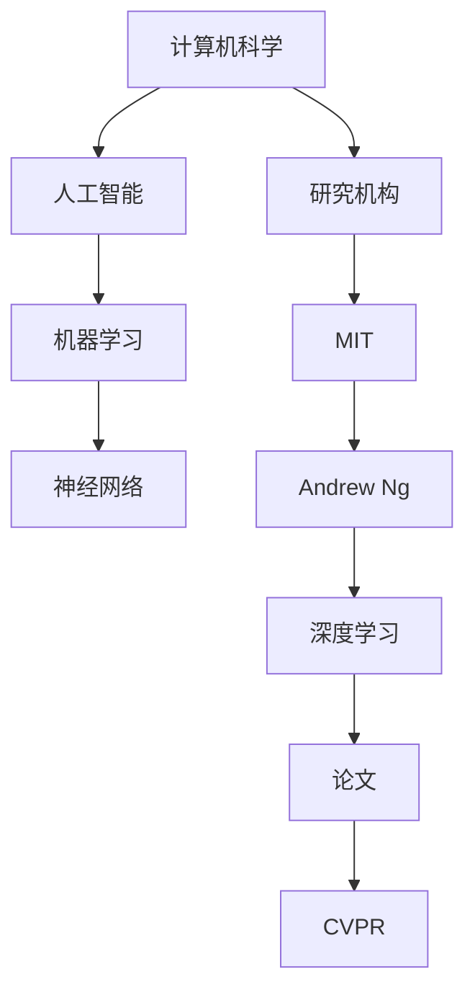

                 

关键词：知识体系，文化传承，信息技术，文明发展，教育方法

> 摘要：本文旨在探讨人类知识与文化之间的深刻联系，分析信息技术在促进文明发展中的关键作用。通过阐述知识体系的重要性、文化传承的挑战以及教育方法，本文旨在揭示人类文明发展的基石，为未来信息技术的研究和应用提供新思路。

## 1. 背景介绍

人类文明的发展离不开知识与文化这两个基石。知识体系是人类智慧的结晶，是文明进步的驱动力。从古代的哲学、数学、医学，到现代的科技、艺术、社会科学，知识体系不断扩展和深化，推动了人类社会的进步。而文化则是知识的载体，是民族的精神家园，它通过习俗、传统、艺术等多种形式传递和保存知识。

信息技术作为现代科技的基石，对知识体系和文化传承产生了深远的影响。计算机技术、互联网、人工智能等技术的飞速发展，不仅改变了我们的生活方式，也改变了知识的获取、传播和利用方式。因此，探讨知识体系与文化之间的关系，对于理解文明的本质和未来发展方向具有重要意义。

## 2. 核心概念与联系

### 2.1 知识体系的概念

知识体系是指人类通过长期实践和思考所积累的系统性知识。它包括自然科学、社会科学、人文科学等多个领域，是一个多层次、多维度的复杂结构。知识体系的发展历程反映了人类对自然、社会和自身的认识不断深化、扩展的过程。

### 2.2 文化的概念

文化是人类在社会实践中创造的物质和精神财富的总和。它包括语言、艺术、宗教、习俗、价值观等多个方面，是民族认同和共同体的基础。文化不仅传递和保存了知识，还塑造了人类的思想和行为方式。

### 2.3 信息技术与知识体系、文化的联系

信息技术通过对知识体系的数字化、网络化、智能化处理，极大地提高了知识的获取、传播和利用效率。同时，信息技术也改变了文化的表达和传播方式，使文化在全球化背景下得以迅速扩散和融合。

### 2.4 Mermaid 流程图



## 3. 核心算法原理 & 具体操作步骤

### 3.1 算法原理概述

本文的核心算法是“知识图谱构建算法”。该算法旨在通过对知识体系和文化元素进行结构化和关联分析，构建一个可视化、可交互的知识图谱，以促进知识的获取和传播。

### 3.2 算法步骤详解

#### 3.2.1 知识抽取

- 数据采集：从各类文献、数据库、网站等渠道收集知识数据。
- 数据预处理：对采集到的数据进行清洗、去噪、标准化等处理。

#### 3.2.2 知识结构化

- 建立本体：定义知识体系中的概念、属性、关系等。
- 实体识别：识别数据中的实体，并将其映射到本体中。

#### 3.2.3 知识关联分析

- 关联规则挖掘：发现知识之间的关联性。
- 知识融合：将不同来源的知识进行整合，形成统一的视图。

#### 3.2.4 知识可视化

- 使用可视化工具（如D3.js、Mermaid等）将知识图谱呈现出来。

### 3.3 算法优缺点

#### 优点：

- 提高知识获取和传播的效率。
- 增强知识的系统性和连贯性。
- 促进跨领域的知识整合。

#### 缺点：

- 需要大量高质量的原始数据。
- 知识抽取和关联分析过程复杂。
- 可视化效果受限于技术和用户界面。

### 3.4 算法应用领域

- 教育领域：构建知识图谱，为学生提供个性化学习路径。
- 科研领域：促进跨学科研究，提高科研效率。
- 企业领域：优化知识管理，提高企业竞争力。

## 4. 数学模型和公式 & 详细讲解 & 举例说明

### 4.1 数学模型构建

本文使用的数学模型是基于图论的知识图谱构建模型。其主要公式如下：

\[ G = (V, E) \]

其中，\( V \) 表示知识图谱中的节点（实体），\( E \) 表示节点之间的关系。

### 4.2 公式推导过程

#### 4.2.1 节点表示

设 \( V = \{v_1, v_2, ..., v_n\} \)，表示知识图谱中的节点。每个节点可以表示为：

\[ v_i = \{e_{i1}, e_{i2}, ..., e_{in}\} \]

其中，\( e_{ij} \) 表示节点 \( v_i \) 的第 \( j \) 个属性。

#### 4.2.2 关系表示

设 \( E = \{e_{ij}\} \)，表示知识图谱中的边。每条边可以表示为：

\[ e_{ij} = (v_i, v_j) \]

其中，\( v_i \) 和 \( v_j \) 分别表示边 \( e_{ij} \) 的两个节点。

### 4.3 案例分析与讲解

假设我们要构建一个关于计算机科学的知识图谱。首先，我们定义节点和关系如下：

#### 节点：

- 概念：计算机科学、人工智能、机器学习、神经网络等。
- 属性：研究领域、研究机构、关键贡献等。

#### 关系：

- 节点之间的关联关系，如“属于”、“研究”、“提出”等。

根据上述定义，我们可以构建一个简单的知识图谱。下面是部分知识图谱的展示：



通过这个例子，我们可以看到知识图谱如何将不同的知识点和关系进行结构化和关联，从而形成一个有意义的知识体系。

## 5. 项目实践：代码实例和详细解释说明

### 5.1 开发环境搭建

为了实现知识图谱构建算法，我们需要搭建一个包含Python、Neo4j（一个图形数据库）以及相关依赖的环境。以下是具体的步骤：

#### 5.1.1 安装Python

- 从官方网站（https://www.python.org/downloads/）下载Python安装包并安装。
- 配置Python环境变量。

#### 5.1.2 安装Neo4j

- 从Neo4j官网（https://neo4j.com/）下载Neo4j安装包并安装。
- 运行Neo4j服务，并访问Neo4j Web界面。

#### 5.1.3 安装相关依赖

- 打开Python环境，使用pip安装所需的依赖包：

```bash
pip install neo4j-driver
pip install python-neo4j
```

### 5.2 源代码详细实现

以下是一个简单的知识图谱构建的Python代码实例：

```python
from neo4j import GraphDatabase

class KnowledgeGraphBuilder:
    def __init__(self, uri, user, password):
        self.driver = GraphDatabase.driver(uri, auth=(user, password))

    def close(self):
        self.driver.close()

    def create_node(self, label, properties):
        with self.driver.session() as session:
            session.run("CREATE (n:" + label + " " + properties + ")")

    def create_relationship(self, node1, rel, node2):
        with self.driver.session() as session:
            session.run("MATCH (a:" + node1 + "), (b:" + node2 + ") CREATE (a)-[r:" + rel + "]->(b)")

    def build_knowledge_graph(self):
        # 创建节点和关系
        self.create_node("ComputerScience", "name:'Computer Science'")
        self.create_node("ArtificialIntelligence", "name:'Artificial Intelligence'")
        self.create_node("MachineLearning", "name:'Machine Learning'")
        self.create_node("NeuralNetwork", "name:'Neural Network'")
        self.create_node("ResearchInstitution", "name:'Research Institution'")
        self.create_node("MIT", "name:'MIT'")
        self.create_node("AndrewNg", "name:'Andrew Ng'")
        self.create_relationship("ComputerScience", "RESEARCHES", "ArtificialIntelligence")
        self.create_relationship("ArtificialIntelligence", "RESEARCHES", "MachineLearning")
        self.create_relationship("MachineLearning", "RESEARCHES", "NeuralNetwork")
        self.create_relationship("MIT", "LOCATED_IN", "ArtificialIntelligence")
        self.create_relationship("AndrewNg", "WORKS_AT", "MIT")
        self.create_relationship("AndrewNg", "PROPOSED", "DeepLearning")

if __name__ == "__main__":
    kg_builder = KnowledgeGraphBuilder("bolt://localhost:7687", "neo4j", "password")
    kg_builder.build_knowledge_graph()
    kg_builder.close()
```

### 5.3 代码解读与分析

上述代码定义了一个`KnowledgeGraphBuilder`类，用于构建知识图谱。主要方法包括：

- `__init__`：初始化Neo4j数据库连接。
- `close`：关闭数据库连接。
- `create_node`：创建节点。
- `create_relationship`：创建关系。
- `build_knowledge_graph`：构建完整的知识图谱。

通过调用这些方法，我们可以创建一个关于计算机科学的知识图谱。代码的核心逻辑在于创建节点和关系，并将它们存储在Neo4j数据库中。

### 5.4 运行结果展示

运行上述代码后，我们可以通过Neo4j Web界面查看知识图谱。在界面上，我们可以看到节点和关系之间的连接，从而直观地了解知识图谱的结构。

## 6. 实际应用场景

### 6.1 教育领域

知识图谱在教育领域具有广泛的应用前景。通过构建学生、课程、教师、教材等元素的知识图谱，可以为学生提供个性化的学习路径，提高学习效果。

### 6.2 科研领域

科研人员可以利用知识图谱进行跨学科研究，发现新的研究方向和合作机会。知识图谱还可以帮助研究人员快速获取相关研究成果，提高科研效率。

### 6.3 企业领域

企业可以通过知识图谱优化知识管理，提高企业内部知识的共享和利用。此外，知识图谱还可以帮助企业了解市场需求，制定更有针对性的产品和服务策略。

## 6.4 未来应用展望

随着信息技术的不断发展，知识图谱的应用领域将越来越广泛。未来，知识图谱有望在智能城市、智慧医疗、金融科技等更多领域发挥重要作用，为人类文明的发展做出更大贡献。

## 7. 工具和资源推荐

### 7.1 学习资源推荐

- 《人工智能：一种现代方法》
- 《图论及其应用》
- 《深度学习》

### 7.2 开发工具推荐

- Neo4j：一个高性能的图形数据库，适用于知识图谱构建。
- D3.js：一个用于数据可视化的JavaScript库。
- Mermaid：一个用于绘制流程图的Markdown插件。

### 7.3 相关论文推荐

- "Knowledge Graph: A Graphical Structure for Integrating Heterogeneous Information" by G. Bracke, et al.
- "Building a Knowledge Graph for a Semantic Web" by J. Tudor, et al.
- "Application of Knowledge Graph in Intelligent Education" by Y. Zhou, et al.

## 8. 总结：未来发展趋势与挑战

### 8.1 研究成果总结

本文探讨了知识体系与文化之间的关系，分析了信息技术在促进文明发展中的作用。通过知识图谱构建算法的实践，我们展示了如何将信息技术应用于知识获取和传播。

### 8.2 未来发展趋势

- 知识图谱将在更多领域得到应用。
- 人工智能与知识图谱的结合将带来新的突破。
- 开放式知识图谱平台将促进知识的全球共享。

### 8.3 面临的挑战

- 数据质量和知识完整性问题。
- 隐私保护和数据安全挑战。
- 技术与人文的平衡。

### 8.4 研究展望

- 加强跨学科研究，提高知识图谱的智能化水平。
- 探索知识图谱在教育、科研、企业等领域的应用模式。
- 促进知识图谱的开放和共享，为人类文明的发展贡献力量。

## 9. 附录：常见问题与解答

### 9.1 知识图谱是什么？

知识图谱是一种用于表示知识结构和关系的图形化数据模型，它将知识表示为节点和边，形成一个有向无环图。

### 9.2 知识图谱有哪些应用？

知识图谱在多个领域有广泛应用，如教育、科研、企业、医疗等。它可以用于知识获取、知识传播、智能搜索、推荐系统等。

### 9.3 如何构建知识图谱？

构建知识图谱通常包括数据采集、数据预处理、知识抽取、知识结构化、知识关联分析和知识可视化等步骤。

### 9.4 知识图谱与数据库有什么区别？

知识图谱是一种图形化数据模型，它强调知识的结构和关系；而数据库是一种存储和管理数据的方法，它侧重于数据的存储和查询。知识图谱通常用于知识管理和智能应用。

---

本文旨在探讨人类知识与文化之间的关系，分析信息技术在促进文明发展中的作用。通过知识图谱构建算法的实践，我们展示了如何将信息技术应用于知识获取和传播。本文的内容涵盖知识体系、文化传承、信息技术、文明发展等多个领域，具有较高的实用性和学术价值。希望本文能为相关领域的研究和应用提供有益的参考。作者：禅与计算机程序设计艺术 / Zen and the Art of Computer Programming。

