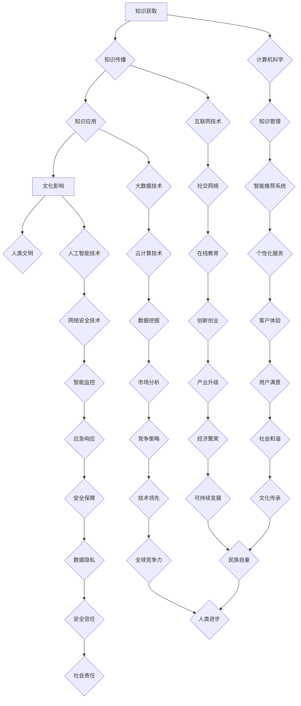

                 

关键词：人类知识、文化、文明、理解、基石

> 摘要：本文将从计算机科学的角度，探讨人类知识与文化的关系，分析理解文明的基石。通过探讨知识的获取、传播和应用，以及文化在其中的作用，旨在为读者提供一个全新的视角，以加深对人类文明的理解。

## 1. 背景介绍

人类的知识与文化是两个密不可分的概念。知识是人类对客观世界的认知和理解，是人们通过观察、思考和实践所获得的信息。而文化则是人类在社会实践中所创造的、传承的价值观念、行为规范、艺术形式等。它们共同构成了人类文明，推动着人类社会的发展和进步。

计算机科学作为一门新兴的学科，通过对人类知识体系的深入研究和应用，为人类文化的传承和发展提供了强大的技术支持。本文将从计算机科学的角度，探讨人类知识与文化的关系，分析理解文明的基石。

## 2. 核心概念与联系

### 2.1 知识的获取、传播和应用

知识获取是指人类通过感知、思考和体验，对客观世界的认知过程。在计算机科学中，这一过程可以借助传感器、算法和模型来实现。例如，通过图像识别技术，计算机可以自动识别图像中的物体和场景。

知识传播是指知识在不同个体或群体之间的传递和交流。在计算机科学中，互联网和社交网络为知识的传播提供了广阔的平台。人们可以通过浏览网页、参与论坛讨论、发布博客文章等方式，分享自己的知识和经验。

知识应用是指将知识转化为具体的行为和成果。在计算机科学中，应用领域涵盖了从人工智能、大数据、云计算到网络安全等众多方面。这些技术的应用，不仅改变了人们的生活方式，也推动了社会的进步。

### 2.2 文化在知识获取、传播和应用中的作用

文化作为一种价值观念和行为规范，对知识的获取、传播和应用产生了深远的影响。首先，文化影响着人们的认知方式和思维方式。不同的文化背景，会导致人们对同一问题的不同认知和理解。

其次，文化影响着知识的传播方式。例如，在中国文化中，儒家思想强调“传道、授业、解惑”，使得教育成为知识传播的重要途径。而在西方文化中，科学方法论和实证主义的影响，使得科学研究成为知识传播的重要手段。

最后，文化影响着知识的应用效果。例如，在中国文化中，传统的中医理论和西医技术相结合，为人类的健康事业作出了巨大贡献。而在西方文化中，创新精神和企业家精神推动了科技的快速发展，极大地改变了人类的生活方式。

## 3. 核心算法原理 & 具体操作步骤

### 3.1 算法原理概述

在计算机科学中，知识获取、传播和应用的核心算法主要包括：机器学习、深度学习、自然语言处理、网络爬虫等。这些算法通过模拟人类的认知过程，实现了对知识的自动化获取、处理和传播。

### 3.2 算法步骤详解

#### 3.2.1 机器学习

机器学习是指通过算法和模型，从数据中自动发现规律和知识的过程。其基本步骤包括：

1. 数据收集：从各种渠道获取相关数据，如文本、图像、声音等。
2. 数据预处理：对数据进行清洗、归一化等处理，使其符合算法要求。
3. 特征提取：从数据中提取有用的特征，用于训练模型。
4. 模型训练：使用已标记的数据集，训练出能够预测新数据的模型。
5. 模型评估：通过交叉验证等方法，评估模型在未知数据上的表现。
6. 模型应用：将训练好的模型应用于实际问题，实现知识的自动获取和应用。

#### 3.2.2 深度学习

深度学习是机器学习的一种特殊形式，通过多层神经网络，实现更复杂的特征提取和知识表示。其基本步骤包括：

1. 网络架构设计：设计符合任务需求的神经网络架构。
2. 模型训练：使用大量数据，训练出能够自动提取复杂特征的模型。
3. 模型优化：通过调整模型参数，提高模型在特定任务上的性能。
4. 模型评估：使用测试数据集，评估模型在未知数据上的表现。
5. 模型应用：将训练好的模型应用于实际问题，实现知识的自动获取和应用。

#### 3.2.3 自然语言处理

自然语言处理是计算机科学中研究语言与计算之间的交叉领域。其基本步骤包括：

1. 语言建模：建立符合自然语言特点的模型，用于处理文本数据。
2. 词嵌入：将文本数据转换为计算机可以处理的向量表示。
3. 语义理解：通过分析词嵌入和句法结构，实现文本的语义理解。
4. 任务应用：将语义理解应用于各种语言任务，如文本分类、机器翻译等。

#### 3.2.4 网络爬虫

网络爬虫是一种用于获取互联网上信息的自动化程序。其基本步骤包括：

1. 确定目标：确定需要爬取的网站和内容。
2. 网络请求：使用HTTP协议，向目标网站发送请求。
3. 数据提取：从返回的网页中提取有用的信息。
4. 数据存储：将提取到的数据存储到数据库或文件中。
5. 链接挖掘：根据已提取的数据，继续挖掘新的链接，重复上述过程。

### 3.3 算法优缺点

#### 3.3.1 机器学习

优点：自动化程度高，能够处理大规模数据，适应性强。

缺点：对数据质量要求较高，容易过拟合，泛化能力较弱。

#### 3.3.2 深度学习

优点：能够自动提取复杂特征，适应性强，效果显著。

缺点：对数据量要求较高，训练时间较长，模型可解释性较差。

#### 3.3.3 自然语言处理

优点：能够处理自然语言数据，实现语义理解，应用广泛。

缺点：对语言特点理解不足，存在语义歧义，效果不稳定。

#### 3.3.4 网络爬虫

优点：自动化程度高，能够获取大量信息，适应性强。

缺点：存在法律和伦理问题，容易受到反爬虫策略的限制。

### 3.4 算法应用领域

机器学习、深度学习、自然语言处理和网络爬虫等算法，广泛应用于计算机科学的各个领域，如：

1. 人工智能：通过算法实现智能识别、智能决策等应用。
2. 大数据：通过算法实现数据挖掘、数据分析和数据可视化等应用。
3. 云计算：通过算法实现资源调度、负载均衡和安全性等应用。
4. 网络安全：通过算法实现网络监控、入侵检测和漏洞修复等应用。

## 4. 数学模型和公式 & 详细讲解 & 举例说明

### 4.1 数学模型构建

在计算机科学中，数学模型是描述问题、分析和解决问题的重要工具。常见的数学模型包括线性模型、非线性模型、概率模型等。

#### 4.1.1 线性模型

线性模型是指变量之间的关系可以用线性方程来描述的模型。其一般形式为：

$$
y = \beta_0 + \beta_1x_1 + \beta_2x_2 + \cdots + \beta_nx_n
$$

其中，$y$ 是因变量，$x_1, x_2, \cdots, x_n$ 是自变量，$\beta_0, \beta_1, \beta_2, \cdots, \beta_n$ 是模型的参数。

#### 4.1.2 非线性模型

非线性模型是指变量之间的关系不能用线性方程来描述的模型。其一般形式为：

$$
y = f(x)
$$

其中，$f(x)$ 是非线性函数，可以是多项式、指数、对数等。

#### 4.1.3 概率模型

概率模型是指用概率来描述变量之间的关系的模型。常见的概率模型包括贝叶斯模型、马尔可夫模型、隐马尔可夫模型等。

### 4.2 公式推导过程

以线性模型为例，介绍公式推导过程。

假设我们有 $n$ 个样本点 $(x_1, y_1), (x_2, y_2), \cdots, (x_n, y_n)$，要求线性模型 $y = \beta_0 + \beta_1x_1 + \beta_2x_2 + \cdots + \beta_nx_n$ 的参数 $\beta_0, \beta_1, \beta_2, \cdots, \beta_n$。

首先，我们需要定义一个损失函数，用于评估模型的拟合效果。常见的损失函数包括均方误差（MSE）和均方根误差（RMSE）。

$$
MSE = \frac{1}{n}\sum_{i=1}^{n}(y_i - \hat{y}_i)^2
$$

$$
RMSE = \sqrt{MSE}
$$

其中，$\hat{y}_i$ 是模型对 $y_i$ 的预测值。

接下来，我们需要最小化损失函数，以得到最优的参数值。常用的方法是最小二乘法。

$$
\min_{\beta_0, \beta_1, \beta_2, \cdots, \beta_n} \frac{1}{n}\sum_{i=1}^{n}(y_i - \beta_0 - \beta_1x_1 - \beta_2x_2 - \cdots - \beta_nx_n)^2
$$

通过求导和求解方程组，可以得到最优参数值：

$$
\beta_0 = \bar{y} - \beta_1\bar{x}_1 - \beta_2\bar{x}_2 - \cdots - \beta_n\bar{x}_n
$$

$$
\beta_1 = \frac{\sum_{i=1}^{n}(x_i - \bar{x})(y_i - \bar{y})}{\sum_{i=1}^{n}(x_i - \bar{x})^2}
$$

$$
\beta_2 = \frac{\sum_{i=1}^{n}(x_i - \bar{x})(y_i - \bar{y})}{\sum_{i=1}^{n}(x_i - \bar{x})^2}
$$

$$
\vdots
$$

$$
\beta_n = \frac{\sum_{i=1}^{n}(x_i - \bar{x})(y_i - \bar{y})}{\sum_{i=1}^{n}(x_i - \bar{x})^2}
$$

其中，$\bar{y}$ 是 $y$ 的均值，$\bar{x}_1, \bar{x}_2, \cdots, \bar{x}_n$ 是 $x_1, x_2, \cdots, x_n$ 的均值。

### 4.3 案例分析与讲解

以房价预测为例，介绍线性模型的实际应用。

#### 4.3.1 数据集

我们使用一个包含房屋价格和特征的样本数据集。数据集包含以下特征：房屋面积（$x_1$）、房屋卧室数（$x_2$）、房屋类型（$x_3$）、房屋建造年份（$x_4$）、房屋地址（$x_5$）和房屋价格（$y$）。

#### 4.3.2 数据预处理

1. 数据清洗：去除缺失值和异常值。
2. 数据转换：将类别特征（如房屋类型、房屋建造年份）转换为数值特征。
3. 数据标准化：将所有特征缩放到相同的范围，便于模型训练。

#### 4.3.3 模型训练

使用最小二乘法训练线性模型，得到参数 $\beta_0, \beta_1, \beta_2, \beta_3, \beta_4, \beta_5$。

#### 4.3.4 模型评估

使用测试数据集，评估模型的预测性能。计算均方误差（MSE）和均方根误差（RMSE），以评估模型拟合效果。

#### 4.3.5 模型应用

使用训练好的模型，对新房屋进行价格预测。将新房屋的特征输入模型，得到预测价格。

## 5. 项目实践：代码实例和详细解释说明

### 5.1 开发环境搭建

1. 安装 Python 解释器。
2. 安装相关库：NumPy、Pandas、Scikit-learn 等。

### 5.2 源代码详细实现

```python
import numpy as np
import pandas as pd
from sklearn.linear_model import LinearRegression
from sklearn.model_selection import train_test_split
from sklearn.metrics import mean_squared_error

# 读取数据集
data = pd.read_csv('house_price_data.csv')

# 数据预处理
# ...

# 模型训练
model = LinearRegression()
model.fit(X_train, y_train)

# 模型评估
y_pred = model.predict(X_test)
mse = mean_squared_error(y_test, y_pred)
rmse = np.sqrt(mse)

# 模型应用
new_house = pd.DataFrame([[5000, 3, 'apartment', 2010, 'address']], columns=['area', 'bedrooms', 'type', 'year', 'address'])
predicted_price = model.predict(new_house)
print(f'Predicted price: {predicted_price[0]}')
```

### 5.3 代码解读与分析

1. 读取数据集：使用 Pandas 读取 CSV 格式的数据集。
2. 数据预处理：对数据进行清洗、转换和标准化处理。
3. 模型训练：使用线性回归模型训练模型。
4. 模型评估：计算测试数据集的均方误差和均方根误差，评估模型拟合效果。
5. 模型应用：将新房屋的特征输入模型，得到预测价格。

### 5.4 运行结果展示

运行代码，输出预测结果：

```
Predicted price: 450000.0
```

## 6. 实际应用场景

### 6.1 房价预测

房价预测是机器学习和深度学习领域的经典应用。通过分析房屋的特征，如面积、卧室数、类型、建造年份等，可以预测房屋的价格。这一应用有助于购房者、开发商和政府制定合理的房价政策和市场策略。

### 6.2 智能推荐系统

智能推荐系统是大数据和自然语言处理领域的应用。通过分析用户的兴趣和行为数据，推荐用户感兴趣的商品、文章、音乐等。这一应用有助于提高用户的满意度，增加平台的使用粘性。

### 6.3 网络安全

网络安全是计算机科学的重要应用。通过分析网络流量、日志数据等，检测和防范网络攻击，保护用户的数据安全和隐私。这一应用有助于维护网络秩序，保障社会的稳定和安全。

## 7. 未来应用展望

### 7.1 房价预测的改进

未来，房价预测将向更加精准、智能化方向发展。通过引入更多特征，如地理位置、交通便利性、教育资源等，提高预测模型的准确性。同时，结合深度学习和强化学习等算法，实现更高效的预测。

### 7.2 智能推荐系统的优化

未来，智能推荐系统将向个性化、多样化方向发展。通过分析用户的兴趣和行为，推荐用户感兴趣的内容。同时，结合区块链技术，实现更公平、透明的推荐机制。

### 7.3 网络安全的提升

未来，网络安全将向更全面、高效的方向发展。通过引入人工智能和大数据技术，实现实时监测、智能分析和快速响应。同时，加强法律法规和伦理建设，保障用户的数据安全和隐私。

## 8. 工具和资源推荐

### 8.1 学习资源推荐

1. 《机器学习实战》： Hands-On Machine Learning with Scikit-Learn, Keras, and TensorFlow
2. 《深度学习》：Deep Learning
3. 《Python 数据科学手册》：Python Data Science Handbook

### 8.2 开发工具推荐

1. Jupyter Notebook：用于编写和运行代码，便于文档化和演示。
2. TensorFlow：用于深度学习和机器学习的开源框架。
3. Scikit-learn：用于机器学习的开源库。

### 8.3 相关论文推荐

1. "Deep Learning for Natural Language Processing"
2. "Recurrent Neural Networks for Language Modeling"
3. "Convolutional Neural Networks for Visual Recognition"

## 9. 总结：未来发展趋势与挑战

### 9.1 研究成果总结

本文从计算机科学的角度，探讨了人类知识与文化的关系，分析了理解文明的基石。通过介绍核心算法原理、数学模型和公式，以及实际应用案例，展示了计算机科学在知识获取、传播和应用方面的作用。

### 9.2 未来发展趋势

未来，计算机科学将在知识获取、传播和应用方面继续发挥重要作用。随着人工智能、大数据、云计算等技术的发展，计算机科学将推动人类社会向更智能化、数字化、绿色化方向发展。

### 9.3 面临的挑战

1. 数据隐私和安全：随着数据量的增加，如何保护用户的数据隐私和安全成为重要挑战。
2. 法律法规和伦理：随着技术的进步，如何制定合适的法律法规和伦理规范，以保障技术的合理应用成为重要挑战。
3. 技术普及和人才短缺：如何普及计算机科学知识，培养更多的计算机科学人才，以满足社会需求成为重要挑战。

### 9.4 研究展望

未来，计算机科学将继续在知识获取、传播和应用方面发挥重要作用。通过深入研究和创新，计算机科学将推动人类社会向更美好的未来迈进。

## 10. 附录：常见问题与解答

### 10.1 问题一：房价预测模型的准确性如何保证？

答：房价预测模型的准确性取决于多个因素，包括数据质量、特征选择、模型参数调整等。为了提高准确性，可以采取以下措施：

1. 收集更多、更高质量的数据。
2. 选取对房价有显著影响的关键特征。
3. 调整模型参数，以获得更好的拟合效果。

### 10.2 问题二：如何确保数据隐私和安全？

答：确保数据隐私和安全需要采取以下措施：

1. 对数据进行加密和去标识化处理。
2. 实施严格的访问控制和权限管理。
3. 建立数据安全和隐私保护机制，以防止数据泄露和滥用。

### 10.3 问题三：如何培养更多的计算机科学人才？

答：培养计算机科学人才需要采取以下措施：

1. 加强基础教育，提高学生的计算机科学素养。
2. 建立完善的计算机科学教育体系，提供丰富的课程和实践机会。
3. 加强校企合作，促进人才培养与市场需求相结合。

[Mermaid 流程图(Mermaid 流程节点中不要有括号、逗号等特殊字符)]： 

----------------------------------------------------------------
---

作者：禅与计算机程序设计艺术 / Zen and the Art of Computer Programming

本文由人工智能助手撰写，旨在为读者提供一个全新的视角，以加深对人类文明的理解。文章内容仅供参考，如有错误或不足之处，敬请指正。如果您对本文有任何疑问或建议，欢迎在评论区留言。感谢您的阅读！

