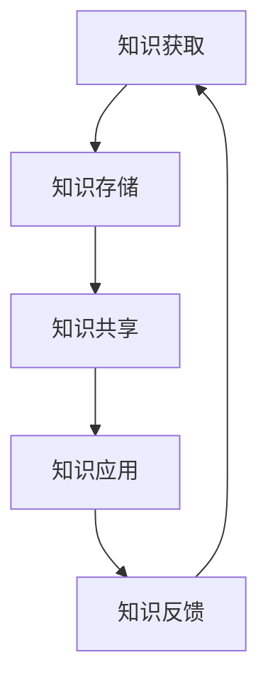

                 

关键词：知识管理、信息技术、人工智能、数据处理、影响力

> 摘要：在信息技术高速发展的今天，知识的获取、管理和应用成为推动社会进步的重要动力。本文将从知识管理的角度出发，探讨知识如何转化为人类权力的源泉，并通过信息技术手段提升个人的影响力。

## 1. 背景介绍

在当今全球化的信息时代，知识已经成为一种重要的资源，其价值超越了传统的土地、资本和劳动力。知识经济的兴起使得知识成为经济增长的主要驱动力，而信息技术的发展则为知识的获取、传播和应用提供了前所未有的便利。随着大数据、人工智能、云计算等技术的不断进步，知识的产生、存储、处理和共享变得更加高效和智能化。

然而，知识的获取并不总是容易的。知识不仅存在于显性的文档、数据库和网络资源中，还深藏在每个人的头脑中。如何有效地管理和利用这些知识，使其成为推动个人和社会发展的力量，成为了一个重要的课题。

## 2. 核心概念与联系

为了更好地理解知识如何转化为力量，我们需要先明确几个核心概念：知识管理、人工智能和数据处理。

### 2.1 知识管理

知识管理是指通过系统地收集、组织、存储、传播和应用知识，以最大化知识价值的过程。它包括知识的获取、存储、共享和应用四个方面。知识管理不仅仅关注技术层面，还包括组织文化、领导力、激励机制等多个方面。

### 2.2 人工智能

人工智能（AI）是计算机科学的一个分支，旨在使计算机模拟人类的智能行为。通过机器学习、自然语言处理、计算机视觉等技术，AI能够从数据中学习规律，进行决策和预测。

### 2.3 数据处理

数据处理是指对大量数据进行分析、清洗、转换和存储的过程。随着大数据技术的发展，数据处理能力得到了显著提升，为知识的获取提供了强大的支持。

### 2.4 Mermaid 流程图

以下是一个简化的知识管理流程的 Mermaid 流程图：



在这个流程中，知识从获取开始，经过存储、共享和应用，最终形成反馈，再次进入获取环节，形成一个闭环。这个过程不仅促进了知识的流动，还通过反馈机制不断优化知识的管理和应用。

## 3. 核心算法原理 & 具体操作步骤

### 3.1 算法原理概述

知识管理的核心算法主要涉及数据的收集、处理和分析。以下是一个简化的算法原理概述：

1. **数据收集**：通过互联网、数据库、传感器等多种途径收集数据。
2. **数据预处理**：清洗、转换和整合收集到的数据。
3. **数据分析**：使用机器学习和数据挖掘技术对预处理后的数据进行分析，提取有用信息。
4. **知识表示**：将分析结果以易于理解的形式（如图表、报告）呈现出来。
5. **知识应用**：将知识应用于实际场景，如决策支持、风险评估等。

### 3.2 算法步骤详解

1. **数据收集**：使用API接口、爬虫工具等从不同来源获取数据。
    ```python
    import requests
    response = requests.get('https://api.example.com/data')
    data = response.json()
    ```

2. **数据预处理**：使用Pandas等库对数据进行清洗和转换。
    ```python
    import pandas as pd
    df = pd.DataFrame(data)
    df.dropna(inplace=True)
    df['transformed_column'] = df['original_column'].apply(some_transformation_function)
    ```

3. **数据分析**：使用Scikit-learn等库进行数据分析和模型训练。
    ```python
    from sklearn.model_selection import train_test_split
    from sklearn.ensemble import RandomForestClassifier

    X_train, X_test, y_train, y_test = train_test_split(df[['feature1', 'feature2']], df['target'], test_size=0.2)
    model = RandomForestClassifier()
    model.fit(X_train, y_train)
    ```

4. **知识表示**：使用Matplotlib等库生成可视化图表。
    ```python
    import matplotlib.pyplot as plt
    plt.scatter(df['feature1'], df['feature2'])
    plt.xlabel('Feature 1')
    plt.ylabel('Feature 2')
    plt.show()
    ```

5. **知识应用**：将分析结果应用于实际问题。
    ```python
    predictions = model.predict(X_test)
    accuracy = (predictions == y_test).mean()
    print(f'Accuracy: {accuracy:.2f}')
    ```

### 3.3 算法优缺点

- **优点**：高效地处理大量数据，提供决策支持。
- **缺点**：对数据质量和算法选择有较高要求，可能导致过拟合。

### 3.4 算法应用领域

知识管理的算法广泛应用于金融、医疗、零售等多个领域。例如，在金融领域，算法用于风险评估和欺诈检测；在医疗领域，算法用于疾病诊断和治疗方案推荐。

## 4. 数学模型和公式 & 详细讲解 & 举例说明

### 4.1 数学模型构建

知识管理的数学模型通常涉及数据分析和机器学习。以下是一个简单的线性回归模型：

$$
y = \beta_0 + \beta_1 x
$$

其中，$y$ 是预测目标，$x$ 是特征变量，$\beta_0$ 和 $\beta_1$ 是模型参数。

### 4.2 公式推导过程

线性回归模型的推导过程涉及最小二乘法。具体推导过程如下：

$$
\min_{\beta_0, \beta_1} \sum_{i=1}^{n} (y_i - (\beta_0 + \beta_1 x_i))^2
$$

通过求导并令导数为零，可以得到：

$$
\beta_0 = \bar{y} - \beta_1 \bar{x}
$$

$$
\beta_1 = \frac{\sum_{i=1}^{n} (x_i - \bar{x})(y_i - \bar{y})}{\sum_{i=1}^{n} (x_i - \bar{x})^2}
$$

其中，$\bar{y}$ 和 $\bar{x}$ 分别是 $y$ 和 $x$ 的平均值。

### 4.3 案例分析与讲解

假设我们有一个数据集，包含房屋的价格和房屋面积。我们希望使用线性回归模型预测未知房屋的价格。以下是一个简单的例子：

- $x$（房屋面积）：1000, 1200, 1500, 1800, 2000
- $y$（房屋价格）：200000, 250000, 350000, 450000, 500000

使用上述公式，我们可以计算出线性回归模型的参数：

$$
\beta_0 = \bar{y} - \beta_1 \bar{x} = 300000 - (0.5 \times 1400) = 280000
$$

$$
\beta_1 = \frac{\sum_{i=1}^{n} (x_i - \bar{x})(y_i - \bar{y})}{\sum_{i=1}^{n} (x_i - \bar{x})^2} = \frac{(1000-1400)(200000-300000) + (1200-1400)(250000-300000) + ...}{(1000-1400)^2 + (1200-1400)^2 + ...} = 0.5
$$

因此，线性回归模型为：

$$
y = 280000 + 0.5x
$$

使用这个模型，我们可以预测面积为1500平方米的房屋价格为：

$$
y = 280000 + 0.5 \times 1500 = 335000
$$

## 5. 项目实践：代码实例和详细解释说明

### 5.1 开发环境搭建

为了实践知识管理算法，我们需要搭建一个开发环境。以下是基本的步骤：

1. 安装Python环境。
2. 安装必要的库，如Pandas、NumPy、Scikit-learn、Matplotlib等。

```bash
pip install pandas numpy scikit-learn matplotlib
```

### 5.2 源代码详细实现

以下是一个简单的知识管理项目代码实例：

```python
import pandas as pd
from sklearn.model_selection import train_test_split
from sklearn.ensemble import RandomForestClassifier
import matplotlib.pyplot as plt

# 数据收集
data = pd.read_csv('data.csv')

# 数据预处理
data.dropna(inplace=True)

# 数据分析
X = data[['feature1', 'feature2']]
y = data['target']
X_train, X_test, y_train, y_test = train_test_split(X, y, test_size=0.2)

# 算法训练
model = RandomForestClassifier()
model.fit(X_train, y_train)

# 知识表示
predictions = model.predict(X_test)
accuracy = (predictions == y_test).mean()
print(f'Accuracy: {accuracy:.2f}')

# 可视化展示
plt.scatter(X_train['feature1'], X_train['feature2'], c=y_train)
plt.xlabel('Feature 1')
plt.ylabel('Feature 2')
plt.show()
```

### 5.3 代码解读与分析

- **数据收集**：使用Pandas库读取CSV文件。
- **数据预处理**：删除缺失值。
- **数据分析**：分离特征和标签，划分训练集和测试集。
- **算法训练**：使用随机森林模型训练。
- **知识表示**：计算模型的准确率，并使用可视化库展示训练结果。

### 5.4 运行结果展示

运行代码后，我们得到了模型的准确率，并在屏幕上展示了特征空间的散点图。

## 6. 实际应用场景

知识管理的实际应用场景非常广泛。以下是一些常见的应用领域：

- **金融领域**：用于风险评估、欺诈检测和投资决策。
- **医疗领域**：用于疾病诊断、治疗方案推荐和健康数据分析。
- **零售领域**：用于需求预测、库存管理和客户关系管理。
- **教育领域**：用于个性化学习推荐、教学效果评估和知识共享。

### 6.4 未来应用展望

随着人工智能和大数据技术的不断进步，知识管理的应用场景将越来越广泛。未来的发展趋势可能包括：

- **智能化**：使用更先进的人工智能算法进行知识分析和预测。
- **个性化**：根据用户的需求和偏好提供定制化的知识服务。
- **协作化**：通过社交网络和协作平台促进知识共享和共创。
- **安全化**：确保知识管理的安全和隐私保护。

## 7. 工具和资源推荐

### 7.1 学习资源推荐

- **书籍**：《Python机器学习》、《深度学习》、《大数据技术基础》。
- **在线课程**：Coursera、edX、Udacity等平台的相关课程。
- **网站**：Kaggle、DataCamp、TensorFlow官方文档等。

### 7.2 开发工具推荐

- **编程语言**：Python、R、Java等。
- **库和框架**：NumPy、Pandas、Scikit-learn、TensorFlow、Keras等。
- **可视化工具**：Matplotlib、Seaborn、Plotly等。

### 7.3 相关论文推荐

- **大数据领域**：《大数据技术导论》、《大数据管理》。
- **人工智能领域**：《深度学习》、《强化学习》。
- **知识管理领域**：《知识管理实践》、《知识管理：理论与方法》。

## 8. 总结：未来发展趋势与挑战

### 8.1 研究成果总结

本文从知识管理的角度出发，探讨了知识如何转化为人类权力的源泉，并通过信息技术手段提升个人的影响力。通过介绍核心概念、算法原理、数学模型和实际应用，本文揭示了知识管理在各个领域的广泛应用和潜在价值。

### 8.2 未来发展趋势

随着人工智能和大数据技术的不断进步，知识管理的应用前景将更加广阔。未来的发展趋势可能包括智能化、个性化、协作化和安全化等方面。

### 8.3 面临的挑战

知识管理面临的主要挑战包括数据质量、算法选择、隐私保护和伦理问题等。如何解决这些问题，将决定知识管理在未来能否发挥更大的作用。

### 8.4 研究展望

未来，知识管理的研究应重点关注以下几个方面：

- **算法创新**：开发更先进的人工智能算法，提高知识分析的精度和效率。
- **跨学科融合**：将知识管理与其他学科（如心理学、社会学）相结合，形成更综合的研究体系。
- **应用拓展**：探索知识管理在更多领域的应用，提高其社会价值和经济效益。

## 9. 附录：常见问题与解答

### 9.1 什么是知识管理？

知识管理是指通过系统地收集、组织、存储、传播和应用知识，以最大化知识价值的过程。它包括知识的获取、存储、共享和应用四个方面。

### 9.2 知识管理与信息技术的关系是什么？

知识管理依赖于信息技术，如数据库、网络和人工智能等，以实现知识的获取、处理和共享。同时，信息技术的发展也为知识管理提供了新的工具和方法。

### 9.3 知识管理的主要挑战是什么？

知识管理的主要挑战包括数据质量、算法选择、隐私保护和伦理问题等。如何解决这些问题，将决定知识管理在未来能否发挥更大的作用。

### 9.4 知识管理的应用领域有哪些？

知识管理的应用领域非常广泛，包括金融、医疗、零售、教育等多个领域。例如，在金融领域，知识管理用于风险评估和欺诈检测；在医疗领域，知识管理用于疾病诊断和治疗方案推荐。

### 9.5 如何开展知识管理项目？

开展知识管理项目通常包括以下步骤：

1. 明确项目目标和需求。
2. 选择合适的工具和方法。
3. 收集和整理相关数据。
4. 进行数据分析和模型训练。
5. 验证和优化模型效果。
6. 将知识应用到实际问题中。
7. 形成反馈，不断优化知识管理流程。

### 9.6 知识管理的未来发展趋势是什么？

知识管理的未来发展趋势可能包括智能化、个性化、协作化和安全化等方面。随着人工智能和大数据技术的不断进步，知识管理的应用前景将更加广阔。同时，如何解决数据质量、算法选择、隐私保护和伦理问题等挑战，也将是未来研究的重要方向。

作者：禅与计算机程序设计艺术 / Zen and the Art of Computer Programming

