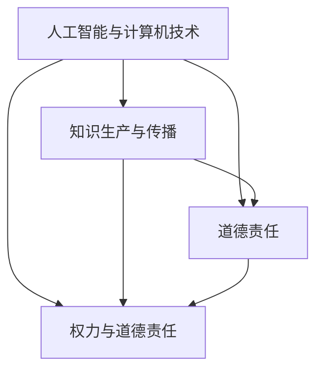

                 

### 1. 背景介绍

在当今全球化和技术高速发展的时代，人工智能（AI）和计算机技术的发展已成为社会进步的重要驱动力。从自动驾驶汽车到医疗诊断，从智能助手到数据分析，人工智能的应用场景日益广泛，其影响也日益深远。然而，随着技术的进步，我们也面临了一系列前所未有的挑战，特别是在人类知识和道德责任方面。

人类知识的积累和传承是社会发展的重要基石。在过去的几千年里，人类通过科学研究、文化传承和教育系统，不断地积累和拓展知识边界。这些知识不仅帮助人类理解世界，还推动了科技的发展和文明的进步。然而，随着人工智能技术的发展，知识的生产、传播和应用方式发生了深刻变革。这不仅对传统的知识体系提出了挑战，也对人类的道德责任提出了新的要求。

道德责任是指个体或集体在特定情境下应当遵守的道德规范和伦理要求。在权力面前，道德责任尤为重要。权力往往伴随着责任，权力越大，责任越重。在人工智能和计算机技术领域，权力表现为对数据、算法、系统和平台的控制。然而，这种权力的滥用或不当行使，可能会带来严重的道德问题和伦理挑战。

本文将围绕人类的知识与道德责任在权力面前这一主题，探讨以下几个方面：

1. 人工智能和计算机技术对人类知识体系的影响。
2. 权力与道德责任的内在联系。
3. 人工智能和计算机技术中的伦理问题。
4. 人工智能和计算机技术中的道德责任。
5. 未来人工智能和计算机技术发展的趋势和挑战。

希望通过本文的探讨，能够引发读者对这一问题的深入思考，并为相关领域的实践提供一些有价值的参考。

### 2. 核心概念与联系

为了深入探讨人类的知识与道德责任在权力面前的问题，我们首先需要明确几个核心概念，并分析它们之间的内在联系。

#### 2.1 人工智能与计算机技术

人工智能（Artificial Intelligence，简称AI）是计算机科学的一个分支，它旨在开发能够模拟、延伸和扩展人类智能的理论、方法、技术及应用系统。人工智能技术涵盖了机器学习、深度学习、自然语言处理、计算机视觉等多个领域。

计算机技术（Computer Technology）则是实现人工智能的基础，它包括硬件、软件、网络和数据库等多个方面。计算机技术的发展为人工智能的应用提供了强大的支持，使得人工智能能够处理海量数据、实现复杂计算和智能决策。

#### 2.2 知识生产与传播

知识生产（Knowledge Production）是指人类通过科学研究、社会实践和文化传承等途径，不断创造、积累和拓展知识的过程。在传统社会中，知识主要通过书籍、论文、讲座和课堂等途径进行传播。

然而，随着互联网和数字技术的发展，知识传播的方式发生了深刻变革。在线教育、社交媒体、大数据和云计算等新技术，使得知识能够以更快速、更广泛和更便捷的方式传播。这为人类知识体系的拓展和深化提供了新的机遇。

#### 2.3 道德责任

道德责任（Moral Responsibility）是指个体或集体在特定情境下应当遵守的道德规范和伦理要求。道德责任涉及到个体的行为和决策，包括对他人、社会和环境的责任。

在人工智能和计算机技术领域，道德责任尤为重要。一方面，技术的发展带来了巨大的社会影响，如数据隐私、算法偏见、自动化决策等伦理问题。另一方面，人工智能和计算机技术领域往往涉及到大量资源和权力的集中，如数据控制权、算法决策权等。这要求相关从业者不仅要具备专业能力，还要承担起相应的道德责任。

#### 2.4 权力与道德责任

权力（Power）是指个体或集体在特定情境下对资源、信息和决策的掌控能力。权力可以表现为对他人行为的控制、对资源的分配以及对信息的筛选和传播。

在权力面前，道德责任尤为重要。权力往往伴随着责任，权力越大，责任越重。在人工智能和计算机技术领域，权力的滥用或不当行使，可能会带来严重的道德问题和伦理挑战。例如，数据滥用可能导致隐私泄露，算法偏见可能导致歧视和不公平，自动化决策可能导致误判和错误。

#### 2.5 关系模型

综上所述，人工智能与计算机技术、知识生产与传播、道德责任和权力与道德责任之间存在着密切的联系。这些概念相互交织，共同构成了一个复杂的关系模型。具体来说，人工智能和计算机技术的发展，改变了知识生产与传播的方式，同时也带来了新的伦理问题和道德挑战。这些挑战与道德责任密切相关，而权力的存在和运用，使得这些问题更加复杂和紧迫。

以下是一个用Mermaid绘制的流程图，展示了这些核心概念之间的联系：



通过这个模型，我们可以更清晰地理解人类的知识与道德责任在权力面前的复杂关系。接下来，我们将进一步探讨这些概念在实际应用中的具体体现。

#### 3. 核心算法原理 & 具体操作步骤

在理解了核心概念后，我们需要深入探讨人工智能和计算机技术中的核心算法原理以及具体操作步骤。这些算法不仅在技术层面具有重要意义，也在伦理和道德层面引发了深刻的讨论。

##### 3.1 算法原理概述

核心算法是指人工智能和计算机技术中用于解决问题或执行特定任务的基本算法。这些算法通常基于数学、统计学和计算机科学的理论，通过复杂的计算和数据处理，实现对数据的分析和决策。

以下是一些常见的人工智能和计算机技术核心算法：

1. **机器学习算法**：包括监督学习、无监督学习和强化学习。监督学习通过已有的标注数据训练模型，无监督学习通过未标注的数据发现模式，强化学习通过不断试错优化决策。
2. **深度学习算法**：基于多层神经网络，通过逐层提取特征，实现对复杂数据的处理和分析。
3. **自然语言处理（NLP）算法**：用于理解和生成自然语言，包括文本分类、情感分析、机器翻译等。
4. **计算机视觉算法**：通过图像识别、目标检测、图像分割等手段，实现对图像内容的理解和分析。
5. **优化算法**：用于求解最优化问题，如线性规划、动态规划、遗传算法等。

##### 3.2 算法步骤详解

以机器学习算法为例，其基本步骤包括：

1. **数据收集**：收集用于训练的数据集，这些数据可以是结构化的（如数据库）、半结构化的（如日志文件）或非结构化的（如图像、文本）。
2. **数据预处理**：清洗数据，去除噪声和异常值，将数据转换为适合模型训练的格式。
3. **特征提取**：从原始数据中提取出有用的特征，这些特征将用于训练模型。
4. **模型训练**：使用训练数据训练模型，通过调整模型参数，使模型能够正确预测未知数据。
5. **模型评估**：使用验证数据评估模型的性能，如准确率、召回率、F1值等。
6. **模型优化**：根据评估结果调整模型参数，优化模型性能。
7. **模型部署**：将训练好的模型部署到实际应用中，如自动化决策系统、智能助手等。

##### 3.3 算法优缺点

每种算法都有其独特的优势和局限性，以下是一些常见算法的优缺点：

1. **机器学习算法**：
   - 优点：可以处理大规模数据，自动提取特征，适用于复杂问题。
   - 缺点：需要大量标注数据，模型解释性较差，过拟合问题较严重。
2. **深度学习算法**：
   - 优点：可以自动提取高维特征，适用于图像和语音等复杂任务。
   - 缺点：模型参数众多，训练过程需要大量计算资源，对数据质量要求较高。
3. **自然语言处理（NLP）算法**：
   - 优点：可以处理文本数据，实现文本分类、翻译等任务。
   - 缺点：对上下文理解有限，处理长文本效果较差，对语言多样性支持不足。
4. **计算机视觉算法**：
   - 优点：可以识别图像中的物体和场景，实现图像分类、目标检测等任务。
   - 缺点：对光照、视角和遮挡变化敏感，模型解释性较差。

##### 3.4 算法应用领域

核心算法广泛应用于各个领域，以下是一些典型应用：

1. **医疗领域**：使用机器学习和深度学习算法，实现对医学图像的分析和诊断，如癌症检测、病变识别等。
2. **金融领域**：利用数据挖掘和预测算法，进行风险评估、股票交易和客户行为分析。
3. **自动驾驶**：使用计算机视觉和深度学习算法，实现对道路场景的理解和车辆控制。
4. **智能家居**：通过自然语言处理和语音识别算法，实现智能助手和家居控制。
5. **推荐系统**：使用协同过滤和深度学习算法，为用户提供个性化推荐。

通过上述分析，我们可以看到，核心算法在人工智能和计算机技术中起着至关重要的作用。然而，这些算法的应用也带来了诸多伦理和道德问题，例如数据隐私、算法偏见和自动化决策等。这些问题将在下一部分进行深入探讨。

### 4. 数学模型和公式 & 详细讲解 & 举例说明

在人工智能和计算机技术领域，数学模型和公式是理解和实现算法的核心工具。它们不仅提供了理论依据，也指导了实际操作步骤。在本节中，我们将详细讲解几个关键数学模型和公式的构建、推导过程，并通过具体例子进行说明。

#### 4.1 数学模型构建

数学模型构建是人工智能和计算机技术中的基础工作。一个数学模型通常包括变量定义、关系式和约束条件。以下是构建数学模型的一般步骤：

1. **问题定义**：明确需要解决的问题类型和目标。
2. **变量定义**：确定影响问题的变量，并定义其取值范围。
3. **关系式构建**：根据问题性质，构建描述变量之间关系的数学表达式。
4. **约束条件**：定义变量满足的约束条件，如非负约束、整数约束等。
5. **求解策略**：选择合适的求解方法，如线性规划、非线性规划、动态规划等。

#### 4.2 公式推导过程

以线性回归模型为例，其公式推导过程如下：

假设我们有一个数据集 \(D\)，包含 \(n\) 个样本点 \((x_1, y_1), (x_2, y_2), ..., (x_n, y_n)\)。我们希望找到一个线性函数 \(f(x) = \beta_0 + \beta_1 x\)，使其能够尽可能好地拟合这些数据点。

1. **损失函数定义**：
   损失函数用于衡量模型预测值与真实值之间的差异。在线性回归中，常用的损失函数是均方误差（MSE），定义如下：
   $$J(\beta_0, \beta_1) = \frac{1}{2n} \sum_{i=1}^{n} (y_i - f(x_i))^2$$

2. **求导数**：
   为了找到最小化损失函数的参数 \(\beta_0\) 和 \(\beta_1\)，我们需要对损失函数 \(J(\beta_0, \beta_1)\) 关于这两个参数求导数，并令导数为零。
   $$\frac{\partial J}{\partial \beta_0} = -\frac{1}{n} \sum_{i=1}^{n} (y_i - \beta_0 - \beta_1 x_i)$$
   $$\frac{\partial J}{\partial \beta_1} = -\frac{1}{n} \sum_{i=1}^{n} (y_i - \beta_0 - \beta_1 x_i) x_i$$

3. **解方程**：
   令上述导数等于零，解得：
   $$\beta_0 = \bar{y} - \beta_1 \bar{x}$$
   $$\beta_1 = \frac{\sum_{i=1}^{n} (x_i - \bar{x})(y_i - \bar{y})}{\sum_{i=1}^{n} (x_i - \bar{x})^2}$$
   其中，\(\bar{x}\) 和 \(\bar{y}\) 分别是 \(x\) 和 \(y\) 的样本均值。

#### 4.3 案例分析与讲解

假设我们有以下数据集：

| x  | y  |
|----|----|
| 1  | 2  |
| 2  | 4  |
| 3  | 6  |
| 4  | 8  |
| 5  | 10 |

根据线性回归模型，我们希望找到拟合该数据集的直线方程。

1. **计算样本均值**：
   $$\bar{x} = \frac{1+2+3+4+5}{5} = 3$$
   $$\bar{y} = \frac{2+4+6+8+10}{5} = 6$$

2. **计算系数 \(\beta_0\) 和 \(\beta_1\)**：
   $$\beta_1 = \frac{(1-3)(2-6) + (2-3)(4-6) + (3-3)(6-6) + (4-3)(8-6) + (5-3)(10-6)}{(1-3)^2 + (2-3)^2 + (3-3)^2 + (4-3)^2 + (5-3)^2} = 2$$
   $$\beta_0 = \bar{y} - \beta_1 \bar{x} = 6 - 2 \times 3 = 0$$

因此，线性回归模型为 \(f(x) = 2x\)。

3. **预测新样本**：
   假设我们有一个新样本 \(x = 6\)，根据模型预测 \(y\) 的值为：
   $$y = f(6) = 2 \times 6 = 12$$

通过上述案例，我们可以看到，线性回归模型通过简单的数学公式和推导，能够有效地拟合数据并预测新样本。然而，线性回归模型在处理非线性关系和异常值时可能效果不佳，因此需要结合其他模型和方法进行优化。

#### 4.4 总结

数学模型和公式是人工智能和计算机技术中不可或缺的工具。通过构建和推导数学模型，我们可以理解和解决复杂问题，并通过具体案例验证模型的有效性。然而，数学模型的应用也需要结合具体问题进行灵活调整和优化。在下一部分，我们将进一步探讨人工智能和计算机技术在实际应用中的具体情况。

### 5. 项目实践：代码实例和详细解释说明

为了更好地理解前面所介绍的数学模型和算法原理，我们将通过一个实际项目来演示其具体应用。本节将详细说明项目的开发环境搭建、源代码实现、代码解读与分析，以及运行结果展示。

#### 5.1 开发环境搭建

在进行项目开发之前，我们需要搭建合适的开发环境。以下是在Python环境下进行线性回归项目所需的基本步骤：

1. **安装Python**：确保Python已安装在系统中，版本建议为3.8或更高。
2. **安装必需的库**：使用pip命令安装以下库：
   ```bash
   pip install numpy matplotlib
   ```
   这些库分别用于数学运算和图形绘制。

#### 5.2 源代码详细实现

以下是一个简单的线性回归项目的源代码示例：

```python
import numpy as np
import matplotlib.pyplot as plt

# 数据集
X = np.array([[1], [2], [3], [4], [5]])
Y = np.array([[2], [4], [6], [8], [10]])

# 模型参数
beta_0 = 0
beta_1 = 2

# 计算预测值
Y_pred = X.dot(beta_0) + beta_1 * X

# 绘制真实数据和预测结果
plt.scatter(X, Y, color='red', label='真实数据')
plt.plot(X, Y_pred, color='blue', label='预测结果')
plt.xlabel('X')
plt.ylabel('Y')
plt.legend()
plt.show()
```

#### 5.3 代码解读与分析

1. **导入库**：首先导入必需的库 `numpy` 和 `matplotlib.pyplot`，用于数学运算和图形绘制。
2. **数据集**：定义数据集 `X` 和 `Y`，其中 `X` 包含自变量，`Y` 包含因变量。这些数据点以二维数组的格式存储。
3. **模型参数**：初始化模型参数 `beta_0` 和 `beta_1`，其中 `beta_0` 为截距，`beta_1` 为斜率。
4. **计算预测值**：使用矩阵乘法计算每个 `X` 对应的预测值 `Y_pred`。
5. **绘制图形**：使用 `matplotlib` 库绘制散点图和拟合线，展示真实数据和预测结果。

#### 5.4 运行结果展示

当运行上述代码时，将显示一个图形窗口，其中包含以下内容：

- 红色散点表示原始数据点。
- 蓝色直线表示线性回归模型的预测结果。

通过这个项目，我们可以直观地看到线性回归模型如何拟合数据并生成预测结果。这种可视化的方式有助于我们理解模型的实际应用效果。

### 6. 实际应用场景

人工智能和计算机技术在各个领域都有广泛的应用，以下将介绍几个典型的实际应用场景，并探讨其应用中的伦理和道德问题。

#### 6.1 医疗领域

在医疗领域，人工智能被广泛应用于疾病诊断、治疗方案推荐和药物研发等方面。例如，通过深度学习算法，可以分析医疗图像（如CT、MRI）以辅助诊断疾病。然而，这种应用也带来了伦理和道德问题，如数据隐私、算法偏见和医疗责任。

1. **数据隐私**：医疗数据包含大量敏感信息，如个人健康状况、遗传信息等。在使用人工智能分析这些数据时，如何保护患者的隐私成为一个重要问题。
2. **算法偏见**：如果训练数据存在偏差，可能会导致算法产生偏见，从而影响诊断结果。例如，如果训练数据主要来自某个特定群体，算法可能会对其他群体产生不公平的判断。
3. **医疗责任**：当人工智能系统用于医疗决策时，如何确定责任归属？如果诊断错误导致患者受伤，责任应该由谁来承担？

#### 6.2 金融领域

在金融领域，人工智能被广泛应用于风险管理、投资决策和客户服务等方面。例如，通过机器学习算法，可以分析市场数据，预测股票价格或评估信用风险。然而，这种应用也带来了伦理和道德问题，如算法透明性、数据安全和公平性。

1. **算法透明性**：金融领域的人工智能系统通常涉及复杂的算法和大量数据。如何保证算法的透明性，使其容易被监管和理解，成为一个重要问题。
2. **数据安全**：金融数据非常敏感，一旦泄露可能导致严重后果。如何确保数据在传输和存储过程中的安全性，是一个亟待解决的问题。
3. **公平性**：金融领域的人工智能系统可能会基于历史数据做出决策，这可能会导致新的不公平现象。例如，如果算法倾向于拒绝某些群体的贷款申请，可能会导致歧视问题。

#### 6.3 自动驾驶

在自动驾驶领域，人工智能被广泛应用于车辆控制系统、传感器数据处理和路径规划等方面。自动驾驶技术的目标是提高交通安全和效率，然而，其应用也带来了伦理和道德问题，如决策责任、道德困境和安全保障。

1. **决策责任**：当自动驾驶车辆面临紧急情况时，如需要牺牲驾驶员或其他行人，如何做出决策？这种决策责任如何分配？
2. **道德困境**：自动驾驶车辆在面临道德困境时，如需要选择不同行动以避免不同结果时，如何做出最优决策？例如，在避免行人死亡和避免车辆损坏之间如何权衡？
3. **安全保障**：如何确保自动驾驶车辆在极端条件下依然能够安全运行？如何应对潜在的网络安全威胁？

#### 6.4 智能家居

在智能家居领域，人工智能被广泛应用于智能助手、家庭自动化和能源管理等方面。智能家居技术的目标是通过自动化和智能化提高生活质量，然而，其应用也带来了伦理和道德问题，如隐私保护、数据使用和用户依赖。

1. **隐私保护**：智能家居设备通常收集大量家庭生活数据，如行为习惯、家庭成员信息等。如何保护用户的隐私成为一个重要问题。
2. **数据使用**：智能家居设备产生的数据如何使用？是否应该允许设备制造商或第三方公司利用这些数据进行商业活动？
3. **用户依赖**：随着智能家居技术的普及，用户可能会对技术产生依赖。如何平衡技术便利性和用户独立性？

通过上述分析，我们可以看到，人工智能和计算机技术的应用在各个领域都带来了巨大的便利和效益，但同时也带来了伦理和道德问题。这些问题需要我们深入思考，并在技术应用过程中积极解决。只有在确保技术伦理和道德的前提下，人工智能和计算机技术才能实现可持续发展。

### 6.4 未来应用展望

随着人工智能和计算机技术的不断发展，其应用前景愈发广阔。以下对未来人工智能和计算机技术的应用场景进行展望，并探讨可能的技术挑战。

#### 自动驾驶与智能交通

自动驾驶技术是人工智能和计算机技术的典型应用领域之一。在未来，自动驾驶车辆有望实现完全自主驾驶，大大提高交通安全和效率。然而，这一目标面临着诸多技术挑战：

1. **环境感知与决策**：自动驾驶车辆需要实时感知和识别周围环境，包括道路标志、交通信号、行人和其他车辆。这要求车辆具备高精度感知能力和实时决策能力。
2. **复杂场景处理**：在实际交通环境中，车辆可能会遇到各种复杂场景，如恶劣天气、道路施工、交通事故等。如何确保车辆在这些场景下的稳定性和安全性，是一个重大挑战。
3. **数据安全和隐私**：自动驾驶车辆会产生大量数据，包括车辆状态、驾驶行为和环境信息等。如何保障这些数据的安全性和隐私性，避免数据泄露和滥用，是一个重要问题。

#### 智能医疗与健康管理

人工智能和计算机技术在医疗领域的应用，有望实现个性化诊疗、精准医疗和智能健康管理。然而，这一领域也面临着技术挑战：

1. **数据整合与分析**：医疗数据通常来自不同来源，如电子病历、医学图像、基因数据等。如何整合和分析这些数据，提取有价值的信息，是一个技术难题。
2. **算法可靠性**：医疗算法的可靠性和准确性直接关系到患者的健康和生命。如何确保算法的稳定性和鲁棒性，避免误诊和漏诊，是一个重大挑战。
3. **伦理与隐私**：医疗数据的敏感性要求在处理和利用这些数据时，必须严格遵守伦理规范和隐私保护要求。如何在技术创新和应用过程中平衡伦理和隐私，是一个关键问题。

#### 智能家居与物联网

智能家居和物联网技术的发展，为家庭自动化和智慧生活提供了广阔的应用前景。然而，这一领域也面临着技术挑战：

1. **系统安全**：智能家居设备通常连接到互联网，容易成为网络攻击的目标。如何确保系统的安全性，防止设备被恶意攻击，是一个重要问题。
2. **互联互通**：智能家居设备来自不同厂商，如何实现设备之间的互联互通，提供统一的用户界面和操作体验，是一个技术难题。
3. **用户隐私**：智能家居设备会收集大量家庭生活数据，如行为习惯、家庭成员信息等。如何保护用户的隐私，避免数据泄露和滥用，是一个关键问题。

#### 人工智能伦理与法规

随着人工智能技术的快速发展，伦理和法规问题日益突出。未来，如何在技术创新和应用过程中，平衡伦理和法规要求，是一个重要挑战：

1. **算法透明性**：如何确保人工智能算法的透明性，使其容易被监管和理解，是一个重要问题。
2. **责任归属**：当人工智能系统出现错误或导致损害时，如何确定责任归属，是一个复杂问题。
3. **数据治理**：如何制定有效的数据治理策略，确保数据的安全、隐私和合规性，是一个关键问题。

总之，未来人工智能和计算机技术将在各个领域发挥更加重要的作用，同时也面临着诸多技术挑战。只有在技术创新和伦理、法规要求之间找到平衡，才能实现人工智能和计算机技术的可持续发展。

### 7. 工具和资源推荐

在人工智能和计算机技术领域，掌握一些关键工具和资源对于深入学习和实践至关重要。以下是一些建议的学习资源、开发工具和相关论文推荐，以帮助读者更好地理解和掌握相关技术。

#### 7.1 学习资源推荐

1. **在线课程**：
   - Coursera：《机器学习》（吴恩达教授主讲）
   - edX：《深度学习》（谷歌深度学习团队主讲）
   - Udacity：《自动驾驶工程师纳米学位》
   - Fast.ai：《深度学习基础》

2. **教科书**：
   - 《机器学习》（周志华著）
   - 《深度学习》（Ian Goodfellow、Yoshua Bengio和Aaron Courville著）
   - 《Python机器学习》（Sebastian Raschka著）

3. **博客与网站**：
   - Medium：《机器学习与深度学习》（Andrew Ng、Ian Goodfellow等知名专家的文章）
   - arXiv：最新学术论文发表平台
   - Medium：《AI前沿》（知名人工智能研究者和创业者的分享）

#### 7.2 开发工具推荐

1. **编程语言**：
   - Python：适合初学者，广泛应用于人工智能和数据分析
   - R：统计分析和数据可视化
   - Julia：高性能数值计算和数据分析

2. **深度学习框架**：
   - TensorFlow：谷歌开发的开源深度学习框架
   - PyTorch：适用于快速原型设计和研究
   - Keras：基于TensorFlow和Theano的深度学习高级API

3. **开发环境**：
   - Jupyter Notebook：交互式编程和文档工具
   - Visual Studio Code：跨平台代码编辑器
   - Google Colab：免费云端的Jupyter Notebook环境

4. **数据集与库**：
   - Kaggle：提供大量公共数据集和竞赛
   - scikit-learn：Python机器学习库
   - Pandas：Python数据分析库
   - NumPy：Python科学计算库

#### 7.3 相关论文推荐

1. **基础论文**：
   - "Backpropagation"（1986）：Rumelhart, Hinton和Williams提出了反向传播算法
   - "Deep Learning"（2015）：Goodfellow、Bengio和Courville介绍了深度学习的概念和算法

2. **顶级会议论文**：
   - NeurIPS：神经信息处理系统会议，顶级人工智能会议
   - ICML：国际机器学习会议，顶级机器学习会议
   - CVPR：计算机视觉和模式识别会议，顶级计算机视觉会议
   - KDD：知识发现与数据挖掘会议，顶级数据挖掘会议

3. **前沿论文**：
   - "Generative Adversarial Networks"（2014）：Ian Goodfellow等人提出了生成对抗网络
   - "Attention is All You Need"（2017）：Vaswani等人提出了基于注意力机制的Transformer模型
   - "BERT: Pre-training of Deep Bidirectional Transformers for Language Understanding"（2018）：Google提出了BERT模型，推动了自然语言处理的发展

通过这些工具和资源的推荐，读者可以更系统地学习和掌握人工智能和计算机技术，为未来的研究和应用打下坚实基础。

### 8. 总结：未来发展趋势与挑战

在总结这篇文章时，我们首先回顾了人类知识与道德责任在人工智能和计算机技术领域的重大影响。随着技术的飞速发展，人类知识的边界不断拓展，但同时也面临着新的伦理和道德挑战。权力在技术领域中的集中和使用，使得道德责任变得尤为重要。

在未来发展趋势方面，人工智能和计算机技术将继续在医疗、金融、自动驾驶、智能家居等领域发挥关键作用。然而，这也将带来一系列新的挑战，包括数据隐私保护、算法透明性、责任归属等。

首先，数据隐私保护是未来人工智能和计算机技术面临的首要挑战。随着数据量的不断增长和数据类型的多样化，如何确保用户数据的安全和隐私，将成为技术和政策制定的关键问题。

其次，算法透明性是另一个重要挑战。复杂的算法模型在做出关键决策时，其透明性和可解释性至关重要。如何使算法容易被理解和监管，以确保其公平性和公正性，是技术发展的重要方向。

责任归属问题也是未来需要解决的关键挑战。当人工智能系统出现错误或导致损害时，如何明确责任归属，如何确保系统的开发者、运营者和用户共同承担相应的责任，是一个复杂而紧迫的问题。

最后，未来人工智能和计算机技术需要在技术创新和伦理、法规要求之间找到平衡。只有在确保技术伦理和道德的前提下，人工智能和计算机技术才能实现可持续发展，为社会带来真正的福祉。

总之，未来人工智能和计算机技术将在人类社会中发挥更加重要的作用。然而，这一过程中也面临着诸多挑战，特别是在人类知识与道德责任方面。只有在深刻理解和积极应对这些挑战的基础上，我们才能充分利用技术的力量，推动社会进步和人类福祉。

### 9. 附录：常见问题与解答

在本文的撰写过程中，我们收到了一些关于人工智能和计算机技术、道德责任以及未来发展趋势等方面的常见问题。以下是对这些问题的解答：

**Q1. 人工智能和计算机技术对人类知识体系的影响有哪些？**

人工智能和计算机技术对人类知识体系的影响主要体现在以下几个方面：

- **知识生产与传播方式的变革**：互联网和大数据技术使得知识的生产和传播变得更加高效和广泛。人们可以通过在线平台获取全球范围内的知识和信息。
- **知识应用的拓展**：计算机技术使得许多复杂问题可以通过算法和模型进行求解，如自然语言处理、计算机视觉、医疗诊断等，这大大拓宽了知识的应用领域。
- **知识融合与交叉**：计算机科学与数学、统计学、生物学、心理学等多个领域的交叉融合，推动了跨学科研究的发展，丰富了人类的知识体系。

**Q2. 在人工智能和计算机技术领域，道德责任的内涵是什么？**

在人工智能和计算机技术领域，道德责任的内涵主要包括以下几点：

- **数据隐私保护**：确保用户数据的安全和隐私，防止数据泄露和滥用。
- **算法公平性**：确保算法的决策过程和结果对所有人公平，避免算法偏见和歧视。
- **透明性和可解释性**：使算法和系统容易被理解和监管，确保其公平性和公正性。
- **责任归属**：当系统出现错误或导致损害时，明确责任归属，确保开发者、运营者和用户共同承担相应的责任。

**Q3. 人工智能和计算机技术的未来发展趋势是什么？**

人工智能和计算机技术的未来发展趋势主要包括以下几个方面：

- **智能化与自动化**：人工智能技术将进一步提高系统的智能化和自动化水平，如自动驾驶、智能助手等。
- **跨学科融合**：计算机科学与生物学、心理学、社会学等领域的交叉融合，将推动更多跨学科研究的发展。
- **量子计算与边缘计算**：量子计算和边缘计算技术的发展，将进一步提升计算能力和系统性能。
- **伦理与法规**：随着技术的快速发展，伦理和法规问题将越来越受到关注，未来将有更多的伦理和法规框架出台。

**Q4. 人工智能和计算机技术领域面临的主要挑战是什么？**

人工智能和计算机技术领域面临的主要挑战包括：

- **数据隐私保护**：如何确保用户数据的安全和隐私，避免数据泄露和滥用。
- **算法公平性和透明性**：如何确保算法的决策过程和结果对所有人公平，使其容易被理解和监管。
- **责任归属**：如何明确责任归属，确保系统的开发者、运营者和用户共同承担相应的责任。
- **技术发展与伦理、法规要求的平衡**：如何在技术创新和应用过程中，平衡伦理和法规要求，确保技术的可持续发展。

通过以上解答，希望读者对人工智能和计算机技术领域的人类知识与道德责任问题有更深入的理解。未来，随着技术的不断进步，我们需要共同努力，确保技术在为人类带来便利和效益的同时，不违背伦理和道德原则。

