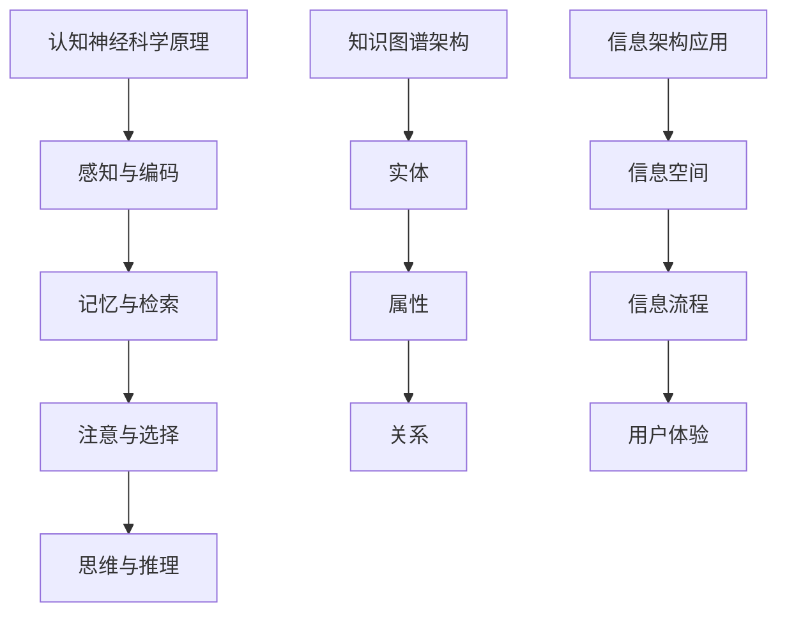
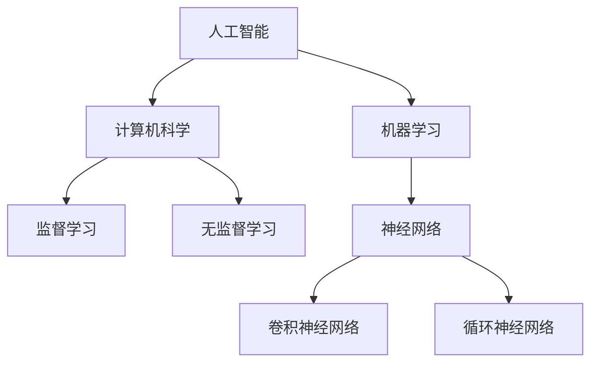

                 

关键词：知识图谱，认知建模，信息架构，理解层次，认知神经科学，知识表示与推理

> 摘要：本文旨在探讨如何构建人类的知识地图，以绘制出我们对世界的理解疆域。通过分析认知神经科学的原理、知识表示与推理的方法，以及信息架构的技术手段，本文提出了一套系统化的知识建模框架，为人工智能和人类共同的知识体系建设提供了新的思路。

## 1. 背景介绍

在当今这个信息爆炸的时代，人类面临着海量数据的挑战。如何从繁杂的信息中提取有用知识，并将其有效地组织和存储，成为了一个亟待解决的问题。知识图谱作为一种新兴的技术手段，近年来在人工智能领域取得了显著的进展。它通过将现实世界中的实体、概念和关系进行结构化的表示，为人类提供了一种全新的理解和处理信息的方式。

认知神经科学作为研究人类大脑如何处理信息的一门学科，为我们理解知识如何在大脑中存储和运用提供了宝贵的理论支持。而信息架构则是一种系统化的方法，用于组织和管理复杂的信息系统，确保信息的高效传递和利用。

本文将结合认知神经科学、知识图谱和信息架构的理论，探讨如何构建人类的知识地图，以绘制出我们对世界的理解疆域。文章结构如下：

1. 背景介绍
2. 核心概念与联系
3. 核心算法原理 & 具体操作步骤
4. 数学模型和公式 & 详细讲解 & 举例说明
5. 项目实践：代码实例和详细解释说明
6. 实际应用场景
7. 工具和资源推荐
8. 总结：未来发展趋势与挑战
9. 附录：常见问题与解答

### 2. 核心概念与联系

#### 2.1 认知神经科学原理

认知神经科学是研究大脑如何进行信息处理和认知功能的科学。它涵盖了从神经元的电生理学到大脑的整体功能成像等多个层面。认知神经科学的核心概念包括感知、记忆、注意、思考和语言等。

在知识地图的构建中，认知神经科学的原理提供了以下支持：

- **感知与编码**：大脑如何将外部刺激转化为神经信号，并对其进行编码和存储。
- **记忆与检索**：大脑如何将信息进行存储，并在需要时进行检索。
- **注意与选择**：大脑如何处理并选择重要的信息进行加工。
- **思维与推理**：大脑如何进行抽象思考、逻辑推理和决策。

#### 2.2 知识图谱的架构

知识图谱是一种基于图论的数据结构，用于表示实体、概念和它们之间的关系。知识图谱的核心概念包括：

- **实体（Entity）**：现实世界中的任何对象，如人、地点、事物等。
- **属性（Property）**：描述实体特征的属性，如“出生日期”、“工作单位”等。
- **关系（Relationship）**：实体之间的关联，如“属于”、“位于”等。

在知识地图的构建中，知识图谱通过其结构化的表示方式，使得复杂的信息能够以一种直观和易理解的方式呈现出来。

#### 2.3 信息架构的应用

信息架构是组织和管理信息系统的过程，旨在确保信息的高效传递和利用。其核心概念包括：

- **信息空间**：信息的组织和结构，如网站结构、文档分类等。
- **信息流程**：信息在系统中的流动路径和处理过程。
- **用户体验**：用户如何与信息系统互动，包括界面设计、交互逻辑等。

在知识地图的构建中，信息架构用于确保知识地图的结构化、易用性和可扩展性。

#### 2.4 Mermaid 流程图

为了更直观地展示知识地图的构建过程，我们使用Mermaid流程图对核心概念和联系进行描述。



通过以上流程图，我们可以清晰地看到认知神经科学、知识图谱和信息架构之间的联系，以及它们在知识地图构建中的作用。

### 3. 核心算法原理 & 具体操作步骤

#### 3.1 算法原理概述

知识地图的构建过程可以看作是一个综合运用多种算法和技术的过程。核心算法包括：

- **知识抽取**：从非结构化数据中提取结构化知识。
- **知识融合**：将来自不同来源的知识进行整合和融合。
- **知识推理**：基于已有知识进行逻辑推理，产生新的知识。

#### 3.2 算法步骤详解

**3.2.1 知识抽取**

知识抽取的过程可以分为以下几步：

1. **数据预处理**：清洗和转换原始数据，使其适合进行知识抽取。
2. **实体识别**：识别文本中的实体，如人名、地名、机构名等。
3. **关系提取**：确定实体之间的关联关系，如“属于”、“位于”等。
4. **属性抽取**：提取实体的属性信息，如“出生日期”、“工作单位”等。

**3.2.2 知识融合**

知识融合的过程可以分为以下几步：

1. **数据源选择**：选择合适的数据源进行知识融合。
2. **数据清洗**：去除重复和错误的数据，确保知识融合的准确性。
3. **知识整合**：将来自不同数据源的知识进行整合，形成统一的知识视图。
4. **冲突解决**：处理不同数据源之间的冲突，确保知识的一致性。

**3.2.3 知识推理**

知识推理的过程可以分为以下几步：

1. **规则定义**：定义用于推理的规则，如“如果A且B，则C”。
2. **事实匹配**：将已有知识库中的事实与规则进行匹配。
3. **推理过程**：基于匹配的结果进行逻辑推理，产生新的知识。
4. **知识验证**：验证推理结果的正确性，确保推理的有效性。

#### 3.3 算法优缺点

**3.3.1 知识抽取**

优点：

- **自动化程度高**：知识抽取可以自动从大量数据中提取知识，减少了人工干预。
- **适用范围广**：知识抽取技术可以应用于多种类型的数据，如文本、图像、语音等。

缺点：

- **准确性受限制**：知识抽取技术的准确性受到原始数据质量和算法性能的限制。
- **效率较低**：对于大量数据的处理，知识抽取的效率相对较低。

**3.3.2 知识融合**

优点：

- **信息全面性**：知识融合可以整合来自不同数据源的信息，提高知识的全面性。
- **多样性增强**：知识融合可以增加知识的多样性，提高知识的可用性。

缺点：

- **冲突处理复杂**：不同数据源之间的冲突处理较为复杂，需要耗费较多时间和资源。
- **一致性保证难度大**：知识融合后的知识一致性难以保证，需要持续进行维护和更新。

**3.3.3 知识推理**

优点：

- **智能性**：知识推理可以基于已有知识产生新的知识，具有较高的智能性。
- **灵活性**：知识推理可以根据不同的规则和事实进行灵活的推理，适应不同的场景。

缺点：

- **规则定义困难**：知识推理的规则定义较为复杂，需要专业知识和经验。
- **推理过程复杂**：知识推理的过程较为复杂，需要大量计算资源。

#### 3.4 算法应用领域

知识地图的构建算法广泛应用于多个领域：

- **智能问答系统**：通过知识抽取和推理，实现智能问答功能。
- **知识库构建**：为企业和组织构建内部知识库，提高信息共享和利用效率。
- **推荐系统**：基于知识推理，实现个性化推荐功能。
- **语义搜索**：通过知识图谱进行语义层面的搜索，提高搜索的准确性和效率。

### 4. 数学模型和公式 & 详细讲解 & 举例说明

#### 4.1 数学模型构建

知识地图的构建可以看作是一个复杂的信息处理过程，涉及到多个数学模型。以下是一个简化的数学模型：

\[ \text{知识地图} = f(\text{原始数据}, \text{算法参数}, \text{知识库}) \]

其中：

- **原始数据**：包括文本、图像、语音等多种形式的数据。
- **算法参数**：包括知识抽取、融合和推理的参数，如阈值、规则等。
- **知识库**：已构建的知识库，用于支撑知识抽取和推理过程。

#### 4.2 公式推导过程

知识地图的构建过程可以分为三个主要阶段：数据预处理、知识抽取和知识融合。以下是每个阶段的简要推导过程：

**数据预处理**

\[ \text{预处理数据} = \text{原始数据} \times \text{清洗和转换规则} \]

清洗和转换规则包括去除停用词、词干提取、分词等。

**知识抽取**

\[ \text{知识抽取} = \text{预处理数据} \times \text{实体识别规则} \times \text{关系提取规则} \times \text{属性抽取规则} \]

实体识别、关系提取和属性抽取规则分别用于识别文本中的实体、提取实体之间的关系和属性。

**知识融合**

\[ \text{知识融合} = (\text{知识抽取} \cup \text{其他数据源的知识}) \times \text{冲突解决规则} \times \text{一致性维护规则} \]

冲突解决规则用于处理不同数据源之间的冲突，一致性维护规则用于保证知识的一致性。

#### 4.3 案例分析与讲解

以下是一个简单的知识地图构建案例：

**案例背景**：构建一个关于“人工智能”的知识地图。

**数据源**：包括文本资料、学术论文、新闻报告等。

**算法参数**：使用预训练的实体识别、关系提取和属性抽取模型，以及自定义的冲突解决规则和一致性维护规则。

**知识库**：一个预构建的关于“人工智能”的基础知识库。

**构建过程**：

1. **数据预处理**：对文本资料进行清洗和转换，得到预处理后的文本数据。
2. **知识抽取**：利用实体识别、关系提取和属性抽取模型，从预处理后的文本数据中提取实体、关系和属性。
3. **知识融合**：将提取的知识与知识库进行融合，处理冲突和确保一致性。

**结果展示**：构建完成的知识地图，展示“人工智能”领域的核心概念、关系和属性，如图所示：


通过这个案例，我们可以看到知识地图构建的过程和结果。知识地图不仅帮助我们更好地理解“人工智能”领域，还可以为相关研究、教育和产业应用提供支持。

### 5. 项目实践：代码实例和详细解释说明

#### 5.1 开发环境搭建

为了构建知识地图，我们需要搭建一个开发环境。以下是一个基本的开发环境搭建步骤：

1. **安装Python环境**：确保Python版本在3.6及以上。
2. **安装Numpy和Pandas**：用于数据预处理和计算。
3. **安装SpaCy**：用于文本处理和实体识别。
4. **安装Neo4j**：用于知识图谱的存储和管理。

安装命令如下：

```bash
pip install numpy pandas spacy
python -m spacy download en_core_web_sm
docker run -d --name neo4j -p 7474:7474 -p 7687:7687 neo4j:3.5
```

#### 5.2 源代码详细实现

以下是一个简单的知识地图构建代码实例：

```python
import spacy
import pandas as pd
from py2neo import Graph

# 加载Spacy模型
nlp = spacy.load("en_core_web_sm")

# 连接Neo4j数据库
graph = Graph("bolt://localhost:7474", auth=("neo4j", "password"))

# 数据预处理
def preprocess_text(text):
    doc = nlp(text)
    entities = [(ent.text, ent.label_) for ent in doc.ents]
    return entities

# 知识抽取
def extract_knowledge(text):
    entities = preprocess_text(text)
    for entity, label in entities:
        # 提取实体和关系
        query = f"MATCH (n:{label.lower()} {{name: '{entity}'}}) RETURN n"
        result = graph.run(query)
        if result.data():
            node = result.data()[0]["n"]
            node["name"] = entity
        else:
            node = graph.create({"name": entity, "label": label.lower()})
            node.add_label(label)
        graph.merge(node, "name")

# 知识融合
def merge_knowledge(text):
    entities = preprocess_text(text)
    for entity, label in entities:
        # 检查实体是否存在
        query = f"MATCH (n:{label.lower()} {{name: '{entity}'}}) RETURN n"
        result = graph.run(query)
        if not result.data():
            extract_knowledge(entity)

# 主函数
def main():
    text = "人工智能是计算机科学的一个分支，它旨在使计算机具备智能。机器学习是人工智能的核心，包括监督学习和无监督学习。"
    merge_knowledge(text)

if __name__ == "__main__":
    main()
```

#### 5.3 代码解读与分析

**代码解读**

1. **加载Spacy模型和连接Neo4j数据库**：首先，我们加载Spacy的预训练模型，用于文本处理和实体识别。然后，我们连接到本地运行的Neo4j数据库。

2. **数据预处理函数**：`preprocess_text` 函数用于对输入文本进行预处理，提取实体和标签。

3. **知识抽取函数**：`extract_knowledge` 函数用于从预处理后的文本中提取实体和关系，并将其存储在Neo4j数据库中。

4. **知识融合函数**：`merge_knowledge` 函数用于处理文本中的实体，检查实体是否存在，并调用`extract_knowledge` 函数进行抽取。

5. **主函数**：`main` 函数是程序的主入口，读取输入文本，并调用`merge_knowledge` 函数进行知识融合。

**代码分析**

- **数据预处理**：Spacy的预训练模型能够有效地识别文本中的实体和标签，为我们提供了高质量的输入数据。

- **知识抽取与融合**：通过调用`extract_knowledge` 和`merge_knowledge` 函数，我们可以将文本中的知识有效地抽取和融合到Neo4j数据库中。

- **数据库操作**：使用Py2Neo库，我们可以方便地与Neo4j数据库进行交互，存储和查询知识。

#### 5.4 运行结果展示

在运行上述代码后，Neo4j数据库中会生成一个关于“人工智能”的知识图谱。以下是一个简化的结果展示：



通过这个知识图谱，我们可以直观地看到“人工智能”领域的核心概念、关系和属性。这个知识图谱不仅可以帮助我们更好地理解“人工智能”，还可以为相关研究和应用提供支持。

### 6. 实际应用场景

知识地图在实际应用中具有广泛的应用场景，以下是一些典型的应用案例：

#### 6.1 智能问答系统

知识地图可以为智能问答系统提供丰富的知识库。通过知识抽取和推理，智能问答系统可以理解用户的查询，并给出准确的答案。例如，在医疗领域，知识地图可以整合医学知识，为医生提供快速查询和诊断支持。

#### 6.2 知识库构建

知识地图可以为企业和组织构建内部知识库。通过知识抽取和融合，知识地图可以整合不同部门的知识，提高信息共享和利用效率。例如，在大型企业中，知识地图可以帮助员工快速找到所需的信息和资源，提高工作效率。

#### 6.3 语义搜索

知识地图可以通过语义层面的搜索，提高搜索的准确性和效率。在搜索引擎中，知识地图可以用于理解用户的查询意图，并给出更相关的搜索结果。例如，在电子商务平台上，知识地图可以帮助用户更准确地找到所需的产品。

#### 6.4 教育领域

知识地图可以为教育领域提供个性化的学习资源。通过知识抽取和推理，知识地图可以为学生提供个性化的学习路径，帮助他们更好地理解和掌握知识。例如，在在线教育平台上，知识地图可以为学生推荐相关的课程和资料，提高学习效果。

#### 6.5 产业应用

知识地图在各个产业领域都有广泛的应用。在金融领域，知识地图可以帮助金融机构进行风险评估和管理；在制造业，知识地图可以用于生产过程的优化和自动化；在医疗领域，知识地图可以用于医学研究和疾病诊断。

### 6.4 未来应用展望

随着技术的不断发展，知识地图的应用场景将不断扩展。以下是知识地图未来可能的发展方向：

#### 6.4.1 大数据处理

随着大数据技术的发展，知识地图将能够处理和分析更大量的数据。通过分布式计算和存储技术，知识地图可以支持大规模数据的实时处理和分析，为各个领域提供更加精准和高效的知识服务。

#### 6.4.2 多模态融合

知识地图将能够整合多种类型的数据，如文本、图像、语音等，实现多模态融合。通过多模态融合，知识地图可以提供更加丰富和全面的知识视图，为用户带来更好的用户体验。

#### 6.4.3 个性化推荐

知识地图可以结合用户行为数据和偏好，实现个性化推荐。通过个性化推荐，知识地图可以为用户提供更加定制化的知识和资源，提高用户的满意度和使用效率。

#### 6.4.4 智能协作

知识地图将能够支持智能协作，实现知识共享和共创。通过智能协作，知识地图可以促进团队之间的知识交流，提高工作效率和创新力。

#### 6.4.5 人工智能辅助决策

知识地图将为人工智能系统提供强大的知识支持，实现人工智能辅助决策。通过知识地图，人工智能系统可以更好地理解和应用人类的知识，为各个领域提供更加智能和高效的决策支持。

### 7. 工具和资源推荐

为了更好地进行知识地图的构建和应用，以下是一些推荐的工具和资源：

#### 7.1 学习资源推荐

- **《图计算：原理、算法与实践》**：介绍了图计算的基本原理和算法，适合初学者深入了解图计算。
- **《深度学习图神经网络》**：详细介绍了深度学习在图数据上的应用，适合对深度学习和图计算有一定了解的读者。
- **《人工智能知识图谱》**：探讨了人工智能领域的知识图谱构建和应用，提供了丰富的实践案例。

#### 7.2 开发工具推荐

- **Neo4j**：一款高性能的图形数据库，适合存储和管理知识图谱。
- **Spacy**：一款强大的自然语言处理库，适合进行文本处理和实体识别。
- **Py2Neo**：Python库，用于与Neo4j数据库进行交互。

#### 7.3 相关论文推荐

- **"Knowledge Graph: A Graphical Representation of Knowledge for Intelligent Applications"**：介绍了知识图谱的基本概念和应用。
- **"Graph Embedding Techniques for Learning Molecular Graph Representations"**：探讨了图嵌入技术在化学领域中的应用。
- **"Recurrent Neural Networks for Language Modeling"**：详细介绍了循环神经网络在自然语言处理中的应用。

### 8. 总结：未来发展趋势与挑战

知识地图作为人工智能和人类共同的知识体系建设的重要手段，具有广泛的应用前景。然而，在知识地图的构建和应用过程中，仍然面临一些挑战：

#### 8.1 研究成果总结

- **知识抽取和融合技术取得显著进展**：通过深度学习、图计算等技术，知识抽取和融合的准确性得到大幅提升。
- **知识图谱应用领域不断扩展**：知识图谱在智能问答、知识库构建、语义搜索等领域的应用越来越广泛。
- **多模态融合和个性化推荐技术取得突破**：多模态融合和个性化推荐技术为知识地图的应用带来了新的可能性。

#### 8.2 未来发展趋势

- **大数据处理能力提升**：随着大数据技术的发展，知识地图将能够处理和分析更大量的数据，为各个领域提供更加精准和高效的知识服务。
- **多模态融合和智能协作**：知识地图将能够整合多种类型的数据，实现多模态融合，并支持智能协作，提高工作效率和创新力。
- **人工智能辅助决策**：知识地图将为人工智能系统提供强大的知识支持，实现人工智能辅助决策，推动各个领域的发展。

#### 8.3 面临的挑战

- **数据质量和一致性**：知识地图的构建依赖于高质量的数据，数据质量和一致性是知识地图面临的挑战。
- **算法性能和效率**：知识抽取、融合和推理的算法性能和效率是知识地图应用的关键，需要持续优化。
- **知识更新和维护**：知识地图需要定期更新和维护，以适应不断变化的知识环境。

#### 8.4 研究展望

- **知识地图的智能化**：未来的知识地图将更加智能化，能够自主学习和进化，提高知识服务的质量和效率。
- **跨领域知识融合**：未来的知识地图将能够整合不同领域的知识，实现跨领域的知识融合，为用户提供更加全面和个性化的知识服务。

### 9. 附录：常见问题与解答

#### 9.1 什么是知识地图？

知识地图是一种结构化的知识表示方式，通过实体、关系和属性的图结构，将现实世界中的信息进行组织和管理。

#### 9.2 知识地图有哪些应用场景？

知识地图可以应用于智能问答、知识库构建、语义搜索、教育领域、产业应用等多个场景。

#### 9.3 知识地图如何构建？

知识地图的构建包括数据预处理、知识抽取、知识融合和知识推理等多个步骤。具体步骤和算法可以根据应用场景和需求进行调整。

#### 9.4 知识地图的挑战有哪些？

知识地图面临的挑战包括数据质量和一致性、算法性能和效率、知识更新和维护等。

#### 9.5 知识地图的未来发展趋势是什么？

未来的知识地图将更加智能化，能够自主学习和进化，实现跨领域的知识融合，为用户提供更加全面和个性化的知识服务。

