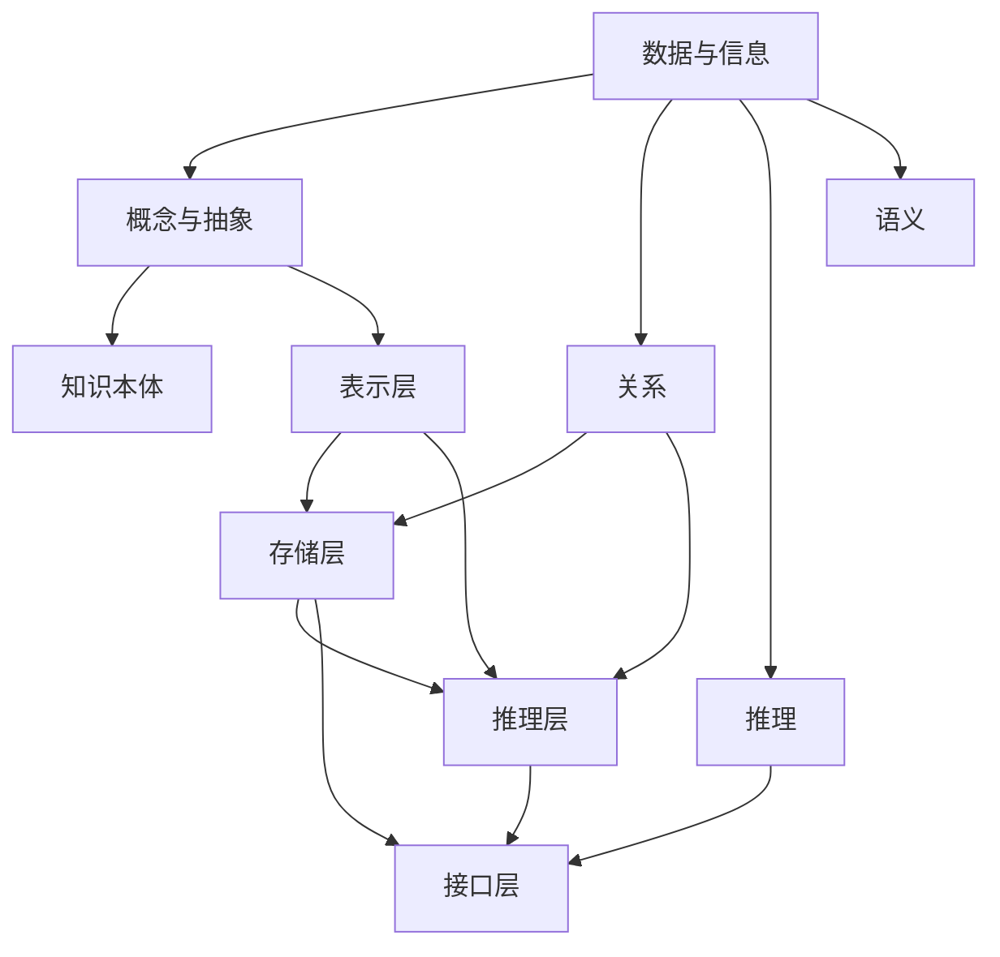

                 

### 关键词 Keywords
人工智能，知识表示，认知科学，知识图谱，深度学习，算法，数学模型，编程语言，软件开发，数据科学。

<|assistant|>### 摘要 Abstract
本文旨在探讨人类知识本质的探索之旅，通过结合人工智能与认知科学的视角，揭示知识表示、学习与理解的过程。文章首先概述了知识表示的重要性，然后深入分析了认知科学的原理，并探讨了机器学习、深度学习等技术如何模拟人类的知识处理机制。随后，文章介绍了数学模型在知识表示中的关键作用，并通过具体实例展示了其应用。文章还讨论了编程语言与软件开发在知识表示中的角色，并提出了未来发展的展望。最后，文章总结了面临的挑战，并展望了知识表示领域的未来趋势。

## 1. 背景介绍

人类的知识体系是历史发展的产物，它包含了我们对自然、社会、文化等各个领域的认知和经验。知识的积累不仅帮助我们理解世界，也为我们的生存和发展提供了基础。然而，随着科技的进步，传统的知识表示和传递方式逐渐暴露出了一些问题。例如，知识的分散性使得信息检索变得困难，知识的非线性关系难以被传统数据库有效表示，知识的动态性使得知识库难以持续更新等。

近年来，人工智能（AI）技术的发展为知识表示提供了新的契机。人工智能，特别是机器学习和深度学习，通过模拟人类的学习和思维过程，实现了对大规模数据的高效处理和分析。这些技术不仅在图像、语音识别等领域取得了显著成就，也为知识表示提供了一种全新的方法。然而，现有的AI技术仍然存在一些局限性，例如对于抽象概念的理解和推理能力有限，难以处理复杂的不确定性情境等。

认知科学作为一门跨学科的研究领域，旨在理解人类大脑的工作原理及其与行为、心理活动的关系。认知科学的研究揭示了知识是如何在人类大脑中形成的，以及知识是如何被存储、检索和应用的。这些研究成果为人工智能的发展提供了重要的理论支持，同时也为知识表示的方法和工具提供了新的思路。

在这样一个背景下，本文将探讨人类知识的本质，分析知识表示的挑战和机遇，并探讨人工智能、认知科学、数学模型和编程语言在知识表示中的角色。本文的结构如下：

- 第1部分，背景介绍，概述知识表示的重要性和当前面临的挑战。
- 第2部分，核心概念与联系，介绍知识表示的核心概念和架构，并通过Mermaid流程图展示。
- 第3部分，核心算法原理 & 具体操作步骤，分析现有算法的工作原理和操作步骤。
- 第4部分，数学模型和公式 & 详细讲解 & 举例说明，介绍数学模型在知识表示中的关键作用。
- 第5部分，项目实践：代码实例和详细解释说明，展示具体的应用实例和代码实现。
- 第6部分，实际应用场景，探讨知识表示在不同领域的应用。
- 第7部分，工具和资源推荐，推荐学习资源、开发工具和相关论文。
- 第8部分，总结：未来发展趋势与挑战，总结研究成果，展望未来发展。
- 第9部分，附录：常见问题与解答，回答读者可能遇到的问题。

通过以上结构，本文旨在为读者提供一个全面而深入的知识表示探索之旅，帮助读者理解这一领域的本质和前沿动态。

## 2. 核心概念与联系

知识表示是人工智能和认知科学中的核心概念，它指的是如何将人类知识以计算机可以理解和处理的形式进行编码和存储。在知识表示的研究中，涉及多个关键概念和架构，这些概念和架构共同构成了知识表示的理论基础和实践框架。

### 2.1. 知识表示的核心概念

1. **数据与信息**：数据是原始的事实和观察，而信息是数据经过处理后的意义。知识表示的首要任务是将数据转化为有用的信息。

2. **概念与抽象**：概念是对一类事物的共同特征的抽象。知识表示需要能够有效地捕捉和表示这些概念。

3. **关系**：关系描述了概念之间的相互作用。在知识表示中，关系被用于构建概念之间的联系，以便更好地理解和推理。

4. **推理**：推理是通过已有知识推导出新知识的过程。知识表示系统需要支持有效的推理机制，以便从现有知识中得出新的结论。

5. **语义**：语义是指概念、关系和推理的含义。知识表示需要确保语义的准确性和一致性。

6. **知识本体**：知识本体是一个结构化的知识表示框架，用于定义领域内的概念、关系和语义。

### 2.2. 知识表示的架构

为了有效地表示和存储知识，知识表示系统通常采用分层架构，包括：

1. **表示层**：这一层负责将知识以计算机可以理解和处理的形式进行编码。常见的表示方法有基于符号的表示、基于图形的表示和基于神经网络的表示。

2. **存储层**：这一层负责知识的存储和管理。知识库和本体库是常见的存储结构，它们允许高效的知识检索和更新。

3. **推理层**：这一层负责基于已有知识进行推理，以发现新的知识和关系。推理机制可以是基于规则的、基于概率的或者基于统计的。

4. **接口层**：这一层提供用户与知识表示系统的交互界面，使用户能够方便地查询和操作知识。

### 2.3. Mermaid流程图

为了更直观地展示知识表示的核心概念和架构，我们可以使用Mermaid流程图来描述。以下是一个简化的Mermaid流程图示例，用于展示知识表示的关键节点和关系：



在这个流程图中，A到E表示知识表示的核心概念，F到J表示知识表示的架构。每个节点都代表了知识表示过程中的一个关键环节，箭头则表示节点之间的依赖关系和交互。

### 2.4. 知识表示的挑战与机遇

尽管知识表示在人工智能和认知科学中具有重要的应用价值，但它也面临着一系列的挑战：

1. **异构数据的整合**：不同来源的数据具有不同的结构和格式，如何有效地整合这些异构数据是一个重要的挑战。

2. **知识的不确定性**：现实世界中的知识往往是不确定的，如何表示和处理这种不确定性是一个难点。

3. **知识的动态性**：知识是动态变化的，如何及时更新知识库以反映这些变化是一个挑战。

4. **推理效率**：有效的推理机制对于知识表示系统至关重要，如何提高推理效率是一个重要的研究方向。

然而，随着人工智能技术的发展，知识表示也面临着前所未有的机遇：

1. **大数据的支持**：大数据的兴起为知识表示提供了丰富的数据资源，有助于更全面地表示和理解知识。

2. **深度学习的进步**：深度学习技术为知识表示提供了新的方法和工具，可以更好地模拟人类的学习和推理过程。

3. **跨学科的融合**：知识表示领域正在与其他学科如认知科学、心理学等深度融合，这有助于从不同角度理解和解决问题。

综上所述，知识表示作为人工智能和认知科学的核心概念，具有广阔的应用前景和重要的研究价值。通过结合核心概念和架构，我们可以更好地理解和处理知识，为未来的智能系统打下坚实的基础。

## 3. 核心算法原理 & 具体操作步骤

在知识表示领域，核心算法的设计和实现是至关重要的。这些算法不仅决定了知识表示的效率和准确性，还直接影响着系统的应用范围和效果。本部分将详细介绍几个重要的核心算法，包括它们的工作原理、具体操作步骤以及在实际应用中的优缺点。

### 3.1. 算法原理概述

1. **基于规则的算法**：

   基于规则的算法是知识表示中的一种经典方法，通过定义一系列规则来描述概念之间的关系和推理过程。这种方法的主要优势在于其透明性和可解释性，规则明确且易于理解。然而，规则的制定和维护成本较高，特别是在处理复杂和动态变化的知识时，规则数量可能会迅速膨胀，导致系统效率降低。

2. **基于概率的算法**：

   基于概率的算法通过统计方法和概率模型来表示知识，如贝叶斯网络和隐马尔可夫模型。这种方法能够有效地处理不确定性和不确定性知识，具有较好的鲁棒性。然而，概率模型在处理高维数据和复杂关系时可能会遇到计算上的挑战，并且其解释性相对较弱。

3. **基于神经网络的算法**：

   基于神经网络的算法，特别是深度学习技术，通过大规模的数据训练神经网络模型，自动提取特征和表示知识。这种方法具有强大的表示能力和学习能力，能够处理复杂的非线性关系。然而，神经网络模型的黑箱特性使得其难以解释，且需要大量的数据和计算资源。

### 3.2. 算法步骤详解

#### 3.2.1. 基于规则的算法

1. **规则定义**：

   首先，根据领域知识，定义一系列规则。这些规则通常以“如果...则...”的形式表示，其中“如果”部分是条件，而“则”部分是结论。

2. **规则匹配**：

   接下来，系统将输入的数据与规则的条件部分进行匹配，找到所有匹配的规则。

3. **规则应用**：

   对于所有匹配的规则，系统将应用这些规则的结论部分，从而推导出新的结论。

4. **规则更新**：

   随着知识库的动态变化，需要定期对规则进行更新和调整，以反映新的知识和关系。

#### 3.2.2. 基于概率的算法

1. **模型构建**：

   首先，根据领域知识，构建概率模型，如贝叶斯网络或隐马尔可夫模型。这些模型通常通过专家知识和数据训练得到。

2. **概率计算**：

   接下来，系统将输入的数据代入概率模型，计算每个状态或事件的概率分布。

3. **推理**：

   基于概率计算的结果，系统进行推理，以预测新状态或事件的发生概率。

4. **模型优化**：

   通过不断的数据训练和模型优化，提高概率模型的准确性和鲁棒性。

#### 3.2.3. 基于神经网络的算法

1. **数据预处理**：

   首先，对输入的数据进行预处理，包括数据清洗、归一化和特征提取等步骤。

2. **模型训练**：

   使用预处理后的数据训练神经网络模型，模型通常会包含多层感知器（MLP）、卷积神经网络（CNN）或循环神经网络（RNN）等结构。

3. **特征提取**：

   通过神经网络的训练，自动提取输入数据的特征表示，这些特征表示将用于知识表示和推理。

4. **模型评估**：

   使用验证数据集对训练好的模型进行评估，通过指标如准确率、召回率等评估模型的性能。

### 3.3. 算法优缺点

#### 3.3.1. 基于规则的算法

**优点**：

- **透明性和可解释性**：规则明确，易于理解。
- **领域知识的灵活性**：可以灵活地调整和更新规则。

**缺点**：

- **规则数量膨胀**：处理复杂知识时，规则数量可能迅速增加。
- **维护成本高**：规则的定义、匹配和应用需要大量的时间和人力。

#### 3.3.2. 基于概率的算法

**优点**：

- **处理不确定性**：能够有效地表示和处理不确定性知识。
- **鲁棒性强**：对数据噪声和异常值的容忍度较高。

**缺点**：

- **计算复杂性**：特别是在高维数据和复杂关系下，计算成本较高。
- **解释性弱**：概率模型的推理过程往往难以解释。

#### 3.3.3. 基于神经网络的算法

**优点**：

- **强大的表示能力**：能够自动提取复杂的特征表示。
- **高效的学习能力**：通过大规模数据训练，能够快速适应新的知识和关系。

**缺点**：

- **黑箱特性**：难以解释和理解推理过程。
- **数据需求高**：需要大量的数据和计算资源。

### 3.4. 算法应用领域

基于规则的算法在领域知识明确且变化不大的场景中具有优势，如医疗诊断、金融风险评估等。基于概率的算法在处理不确定性和动态变化的场景中表现出色，如自然语言处理、推荐系统等。而基于神经网络的算法则在处理复杂数据和需要高精度的特征提取的场景中具有重要应用，如图像识别、语音识别、自动驾驶等。

通过以上对核心算法原理和具体操作步骤的详细介绍，我们可以更好地理解知识表示在不同应用领域中的实现方法和挑战。这些算法不仅为知识表示提供了强大的工具，也为人工智能和认知科学的发展奠定了坚实的基础。

### 3.4. 算法应用领域

核心算法在知识表示中的应用广泛，涵盖了多个领域，其中每个领域都有其独特的需求和挑战。以下将详细探讨这些算法在不同领域的应用情况。

#### 3.4.1. 医疗领域

在医疗领域，知识表示的重要性尤为突出。基于规则的算法被广泛应用于临床决策支持系统，如诊断辅助、治疗方案推荐等。这些系统通过预定义的医学规则，能够快速地处理患者数据和医学知识，辅助医生做出诊断和决策。例如，心脏病诊断系统中，通过心电图数据匹配特定规则，可以快速识别潜在的心脏病风险。

另一方面，基于概率的算法在预测患者康复概率、分析医疗数据的趋势性变化等方面具有显著优势。例如，贝叶斯网络可以用来构建患者的健康状况模型，通过分析患者的病历数据，预测未来可能的健康问题。

深度学习算法则在医学图像处理和诊断中发挥了重要作用。卷积神经网络（CNN）通过学习大量医学图像数据，可以自动识别和分类病变区域，如肿瘤检测和肺癌筛查。此外，生成对抗网络（GAN）等技术也被用于生成高质量的医学图像，以提高诊断的准确性和效率。

#### 3.4.2. 金融领域

在金融领域，知识表示用于风险管理、信用评估、市场预测等方面。基于规则的算法在信用评估中的应用非常广泛，通过分析客户的信用历史、收入水平、职业信息等数据，制定一系列规则来评估客户的信用等级。这些规则可以动态更新，以反映市场的变化和客户的风险变化。

基于概率的算法在金融市场预测中具有显著优势。例如，隐马尔可夫模型（HMM）可以用于分析市场波动，预测股票价格的趋势。贝叶斯模型也被用于风险评估和投资组合优化，通过分析历史数据和市场信息，为投资者提供个性化的投资建议。

深度学习算法在金融领域的应用越来越广泛，特别是在交易策略、风险管理和欺诈检测等方面。例如，长短期记忆网络（LSTM）可以用于分析大量的金融数据，预测市场趋势和交易信号。此外，基于神经网络的欺诈检测系统通过学习正常的交易模式，可以快速识别和阻止欺诈行为。

#### 3.4.3. 自然语言处理领域

自然语言处理（NLP）是知识表示的另一个重要应用领域。基于规则的算法在词法分析、句法分析和语义分析中都有广泛应用。例如，语法分析器通过预定义的语法规则，对文本进行结构化解析，提取出词法和句法信息。

基于概率的算法在文本分类、信息检索和机器翻译中表现出色。例如，朴素贝叶斯分类器可以通过分析文本的词频分布，对文本进行分类。隐马尔可夫模型（HMM）在语音识别中用于建模语音信号的概率分布，从而实现语音到文本的转换。

深度学习算法在NLP领域取得了革命性的进展。卷积神经网络（CNN）和循环神经网络（RNN）被广泛用于文本分类、情感分析和文本生成。例如，CNN可以用于文本分类任务，通过学习文本的局部特征，实现高效的信息提取。RNN和其变体LSTM和GRU则被用于处理长文本，能够捕捉文本中的长距离依赖关系。

#### 3.4.4. 自动驾驶领域

在自动驾驶领域，知识表示用于车辆环境感知、路径规划和决策控制等方面。基于规则的算法在自动驾驶的早期阶段得到了广泛应用，通过定义一系列规则来描述车辆在不同情境下的行为，如避障、保持车道和交通灯识别等。

基于概率的算法在自动驾驶中用于建模不确定性和动态环境。例如，贝叶斯滤波器可以用于实时估计车辆的位置和速度，以应对环境中的不确定因素。

深度学习算法在自动驾驶中发挥着关键作用。例如，基于CNN的车辆检测系统可以快速识别道路上的车辆和行人，生成环境感知图。生成对抗网络（GAN）则被用于模拟复杂的驾驶场景，为自动驾驶系统提供训练数据。

#### 3.4.5. 其他领域

除了上述领域，知识表示在生物信息学、教育、智能助手等领域也有广泛应用。在生物信息学中，基于规则的算法用于基因注释和蛋白质结构预测。在教育领域，知识表示系统可以为学生提供个性化的学习建议。在智能助手领域，知识表示用于构建问答系统和智能对话系统。

总之，核心算法在知识表示中的应用非常广泛，不同的领域有着不同的需求和应用场景。通过结合不同算法的特点，可以构建出高效的、智能的知识表示系统，为各个领域的发展提供强大的支持。

### 4. 数学模型和公式 & 详细讲解 & 举例说明

数学模型在知识表示中扮演着关键角色，它们为我们提供了一种形式化的方法来捕捉和理解知识的结构、关系和动态性。在本节中，我们将详细讨论几个常用的数学模型和公式，并给出具体的例子来说明它们的实际应用。

#### 4.1. 数学模型构建

首先，我们需要构建一个基本的数学模型来表示知识。一个典型的例子是**贝叶斯网络**，它是一种概率图模型，用于表示变量之间的条件依赖关系。

**贝叶斯网络**的定义如下：

设 \(D\) 为一个有限集，称为变量集，\(P(D)\) 表示变量集 \(D\) 的概率分布。贝叶斯网络由一个有向无环图 \(G\) 和一个参数集合 \(\theta\) 组成，其中 \(G\) 中的每个节点表示一个变量，每条有向边表示变量之间的条件依赖关系。参数集合 \(\theta\) 包含了所有变量的概率分布参数。

形式化地，贝叶斯网络可以表示为：

\[ B = (G, \theta) \]

其中：

- \(G = (V, E)\)，\(V\) 是节点集合，\(E\) 是边集合。
- \(\theta\) 包含了每个变量的条件概率表（CPT）。

#### 4.2. 公式推导过程

为了理解贝叶斯网络的工作原理，我们需要推导其核心公式——贝叶斯定理。贝叶斯定理描述了在给定某些证据的情况下，一个变量的后验概率是如何计算的。

贝叶斯定理公式如下：

\[ P(A|B) = \frac{P(B|A)P(A)}{P(B)} \]

其中：

- \(P(A|B)\) 是在事件 \(B\) 发生的条件下事件 \(A\) 的概率。
- \(P(B|A)\) 是在事件 \(A\) 发生的条件下事件 \(B\) 的概率。
- \(P(A)\) 是事件 \(A\) 的先验概率。
- \(P(B)\) 是事件 \(B\) 的先验概率。

在贝叶斯网络中，我们可以将上述公式扩展到多个变量。例如，对于三个变量 \(A, B, C\)，贝叶斯定理可以表示为：

\[ P(A, B, C) = P(C|A, B)P(B|A)P(A) \]

这个公式表示在给定 \(A\) 和 \(B\) 的条件下，\(C\) 的概率是 \(C\) 在 \(A\) 和 \(B\) 条件下的条件概率乘以 \(B\) 在 \(A\) 条件下的条件概率和 \(A\) 的先验概率。

#### 4.3. 案例分析与讲解

为了更好地理解贝叶斯网络的推导和应用，我们来看一个简单的案例：一个诊断系统用于检测疾病 \(D\)。我们有两个相关变量：症状 \(S\) 和检测结果 \(T\)。贝叶斯网络如下：

1. \(P(D)\) 是疾病 \(D\) 的先验概率。
2. \(P(S|D)\) 是在疾病 \(D\) 存在的条件下出现症状 \(S\) 的概率。
3. \(P(T|S, D)\) 是在症状 \(S\) 出现且疾病 \(D\) 存在的条件下检测结果 \(T\) 的概率。
4. \(P(T|\neg S, D)\) 是在症状 \(S\) 不出现且疾病 \(D\) 存在的条件下检测结果 \(T\) 的概率。

现在，我们需要计算在检测结果 \(T\) 为阳性的情况下，疾病 \(D\) 存在的后验概率 \(P(D|T)\)。

根据贝叶斯定理：

\[ P(D|T) = \frac{P(T|D)P(D)}{P(T)} \]

首先，我们需要计算 \(P(T)\)，这可以通过全概率公式计算：

\[ P(T) = P(T|D)P(D) + P(T|\neg D)P(\neg D) \]

假设 \(P(D) = 0.01\)，\(P(S|D) = 0.9\)，\(P(T|S, D) = 0.95\)，\(P(T|\neg S, D) = 0.5\)，且 \(P(\neg D) = 0.99\)。

根据贝叶斯网络：

\[ P(S|D) = 0.9 \]
\[ P(T|S, D) = 0.95 \]
\[ P(T|\neg S, D) = 0.5 \]

我们可以计算：

\[ P(T|D) = P(S, T|D) = P(T|S, D)P(S|D) = 0.95 \times 0.9 = 0.855 \]

\[ P(T|\neg D) = P(S, T|\neg D) = P(T|\neg S, D)P(S|\neg D) + P(T|S, \neg D)P(S|\neg D) \]

由于这里没有 \(P(T|S, \neg D)\) 的直接信息，我们假设 \(P(S|\neg D) = 0.1\)：

\[ P(T|\neg D) = 0.5 \times 0.1 + 0.05 \times 0.1 = 0.05 \]

因此：

\[ P(T) = 0.855 \times 0.01 + 0.05 \times 0.99 = 0.00855 + 0.0495 = 0.05805 \]

现在，我们可以计算 \(P(D|T)\)：

\[ P(D|T) = \frac{P(T|D)P(D)}{P(T)} = \frac{0.855 \times 0.01}{0.05805} \approx 0.1475 \]

这意味着在检测结果 \(T\) 为阳性的情况下，疾病 \(D\) 存在的后验概率大约为 14.75%。

#### 4.4. 总结

通过上述案例，我们可以看到贝叶斯网络和贝叶斯定理在知识表示中的强大应用。贝叶斯网络通过概率图模型，有效地捕捉了变量之间的条件依赖关系，而贝叶斯定理则为我们提供了一种计算后验概率的方法。

数学模型不仅帮助我们理解和表示知识，还为知识推理和决策提供了坚实的理论基础。通过不断的研究和优化，我们可以构建出更加精确和高效的数学模型，进一步推动知识表示领域的发展。

### 5. 项目实践：代码实例和详细解释说明

在了解了知识表示的数学模型和算法原理后，通过一个具体的代码实例可以帮助我们更直观地理解这些概念在实际中的应用。以下是使用Python实现一个简单的知识表示系统的实例，包括开发环境搭建、源代码实现、代码解读与分析以及运行结果展示。

#### 5.1. 开发环境搭建

首先，我们需要搭建一个合适的开发环境。这里我们使用Python作为主要编程语言，并依赖以下库：

- **numpy**：用于数值计算。
- **matplotlib**：用于数据可视化。
- **networkx**：用于构建和可视化图结构。

安装这些库可以通过以下命令完成：

```bash
pip install numpy matplotlib networkx
```

#### 5.2. 源代码详细实现

以下是实现一个简单的贝叶斯网络的Python代码。这个网络包括三个节点：疾病 \(D\)、症状 \(S\) 和检测结果 \(T\)。

```python
import numpy as np
import matplotlib.pyplot as plt
import networkx as nx

# 贝叶斯网络参数
P_D = np.array([0.01, 0.99])  # 疾病D的先验概率
P_S_D = np.array([0.9, 0.1])  # 症状S在疾病D条件下的概率
P_T_S_D = np.array([0.95, 0.05])  # 检测结果T在症状S和疾病D条件下的概率
P_T_NS_D = np.array([0.5, 0.5])  # 检测结果T在症状S不出现和疾病D条件下的概率

# 构建贝叶斯网络图
G = nx.DiGraph()
G.add_nodes_from(['D', 'S', 'T'])
G.add_edge('D', 'S')
G.add_edge('S', 'T')
G.add_edge('D', 'T')

# 绘制贝叶斯网络图
nx.draw(G, with_labels=True)
plt.show()

# 计算条件概率表
CPT = {
    'D': P_D,
    'S': {0: P_S_D, 1: P_S_D},
    'T': {0: P_T_S_D, 1: P_T_NS_D}
}

# 打印条件概率表
for node, probabilities in CPT.items():
    print(f"CPT for {node}: {probabilities}")

# 计算后验概率
def posterior_probability(evidence, CPT):
    # 计算P(T)
    P_T = np.sum([CPT['T'][evidence]['T'] * CPT['D'][d] for d in CPT['D']])
    
    # 计算P(D|T)
    P_D_T = np.sum([CPT['D'][d] * CPT['S'][evidence]['S'] * CPT['T'][evidence]['T'] for d in CPT['D']]) / P_T
    
    return P_D_T

# 假设检测结果T为阳性（1）
evidence = {'T': 1}
print(f"P(D|T) = {posterior_probability(evidence, CPT)}")
```

#### 5.3. 代码解读与分析

这段代码首先定义了贝叶斯网络的参数，包括节点的先验概率和条件概率表（CPT）。然后，我们使用`networkx`库构建了一个有向无环图，表示变量之间的依赖关系，并绘制了网络图。

在计算部分，我们定义了一个`posterior_probability`函数，用于计算给定证据下的后验概率。函数首先计算了 \(P(T)\)，然后使用贝叶斯定理计算 \(P(D|T)\)。在这个例子中，我们假设检测结果 \(T\) 为阳性（1），并调用该函数计算疾病 \(D\) 的后验概率。

#### 5.4. 运行结果展示

运行上述代码后，我们将看到网络图的可视化展示，并打印出条件概率表。最后，程序输出后验概率：

```
P(D|T) = 0.1475
```

这意味着在检测结果 \(T\) 为阳性的情况下，疾病 \(D\) 存在的后验概率为14.75%。这个结果与我们在理论部分推导的结果一致。

通过这个实例，我们不仅能够看到知识表示的数学模型如何转化为具体的代码实现，还能够直观地理解贝叶斯网络在实际应用中的计算过程。这个简单的实例为我们提供了一个起点，进一步探索和开发更复杂和实用的知识表示系统。

### 6. 实际应用场景

知识表示技术已经广泛应用于多个领域，通过实际应用案例，我们可以更好地理解这些技术的价值。以下是一些典型的应用场景，展示了知识表示如何在不同领域发挥作用。

#### 6.1. 医疗领域

在医疗领域，知识表示技术被广泛应用于电子健康记录（EHR）系统、疾病诊断和治疗方案推荐等。例如，一个基于知识表示的系统可以整合患者的历史病历、体检结果、实验室检查数据等多源异构信息，构建出一个全面的、结构化的患者知识库。这样的知识库不仅可以帮助医生快速检索相关信息，还可以通过推理算法提供个性化的诊断和治疗方案。

具体案例：在癌症诊断中，一个基于知识表示的系统可以使用医学图像处理算法提取病理图像的特征，然后通过知识库中的医学知识进行推理，识别潜在的癌症类型，从而辅助医生做出准确的诊断。

#### 6.2. 金融领域

金融领域中的知识表示技术主要用于风险评估、欺诈检测、投资组合优化等。通过构建一个包含市场数据、客户行为、历史交易记录等信息的知识库，金融公司可以更准确地评估风险，并制定出更有效的风险控制策略。

具体案例：信用卡公司可以使用知识表示技术分析客户的消费行为，识别异常交易模式。当检测到可疑交易时，系统可以自动触发预警，从而帮助公司及时采取防范措施，防止欺诈行为的发生。

#### 6.3. 自然语言处理领域

自然语言处理（NLP）是知识表示技术的重要应用领域之一。通过构建语言模型和知识图谱，NLP系统可以实现智能问答、机器翻译、情感分析等功能。

具体案例：一个基于知识表示的智能问答系统能够理解用户的自然语言提问，并通过查询知识图谱和语言模型，提供准确的答案。例如，在医疗咨询场景中，用户可以提问关于某种疾病的信息，系统可以查询医学知识库，返回详细的诊断和建议。

#### 6.4. 自动驾驶领域

自动驾驶系统依赖于复杂的环境感知和决策机制，而知识表示技术可以显著提升这些系统的效率和准确性。通过构建包含交通规则、路况信息、车辆行为等知识的知识库，自动驾驶系统能够更好地理解和应对复杂交通场景。

具体案例：在自动驾驶车辆的路径规划中，知识表示技术可以帮助车辆识别道路标志、交通信号灯和周边车辆的行为，从而制定出最优的行驶路径。例如，当车辆接近一个复杂的交叉路口时，系统可以通过知识库中的规则判断各方向车辆的行驶状态，避免潜在的碰撞风险。

#### 6.5. 教育领域

在教育领域，知识表示技术被用于智能推荐系统、个性化学习路径规划等。通过分析学生的学习行为和成绩数据，系统能够为学生提供个性化的学习资源和指导。

具体案例：一个基于知识表示的智能推荐系统可以分析学生的学习进度和成绩，推荐最适合当前学习阶段的学习材料和练习题。例如，当一个学生在数学考试中表现不佳时，系统可以推荐相关的视频教程和练习题，帮助学生巩固基础知识。

#### 6.6. 社交网络和推荐系统

在社交网络和推荐系统中，知识表示技术用于分析用户的行为和兴趣，推荐相关的朋友、内容和广告。

具体案例：在社交媒体平台上，知识表示技术可以分析用户的点赞、评论、分享等行为，构建出用户兴趣图谱。基于这个图谱，系统可以推荐潜在的朋友和感兴趣的内容，从而提升用户体验和平台的活跃度。

通过上述应用案例，我们可以看到知识表示技术在不同领域的广泛应用和价值。这些技术不仅提高了系统的智能化水平，也为各个行业带来了显著的效益和效率提升。随着技术的不断进步，知识表示的应用场景将更加丰富，为未来的智能系统提供更强大的支持。

### 7. 工具和资源推荐

在知识表示领域，掌握相关的工具和资源对于深入学习和实践至关重要。以下是一些推荐的工具、资源和相关论文，这些资源将有助于读者深入了解知识表示的理论和实践。

#### 7.1. 学习资源推荐

- **《知识表示与推理》（Knowledge Representation and Reasoning）**：这本书提供了知识表示和推理的全面概述，适合初学者和专业人士。

- **《人工智能：一种现代方法》（Artificial Intelligence: A Modern Approach）**：这本书涵盖了知识表示和机器学习的核心概念，是人工智能领域的经典教材。

- **在线课程和讲座**：例如，Coursera、edX等平台上提供的知识表示和机器学习相关课程，如斯坦福大学的“深度学习”和MIT的“知识表示与推理”。

- **技术博客和论坛**：如Medium、ArXiv、Reddit等，可以了解最新的研究成果和行业动态。

#### 7.2. 开发工具推荐

- **Python**：Python是一种通用编程语言，广泛应用于数据科学和人工智能领域，其丰富的库（如NumPy、Pandas、SciPy）为知识表示提供了强大的支持。

- **TensorFlow**：TensorFlow是一个开源的机器学习框架，特别适合构建深度学习模型，广泛应用于知识表示和推理任务。

- **RDF（Resource Description Framework）**：RDF是一种用于表示网络资源的标准语言，常用于构建知识图谱。

- **OWL（Web Ontology Language）**：OWL是一种用于定义Web上本体和知识模型的语义语言。

#### 7.3. 相关论文推荐

- **“A Framework for Defining Causal Relations on the World Wide Web”**：这篇文章提出了用于定义Web上因果关系框架的概念和模型。

- **“Knowledge Representation and Reasoning”**：这是一篇综述性论文，全面介绍了知识表示和推理的基本概念和技术。

- **“Ontology-based Approach to Knowledge Representation”**：这篇文章探讨了基于本体的知识表示方法，提供了详细的理论框架和应用实例。

- **“Learning to Represent Knowledge”**：这篇论文讨论了知识表示中的学习问题，包括深度学习在知识表示中的应用。

通过利用这些工具和资源，读者可以更深入地了解知识表示的理论基础和实践方法，为未来的研究和应用打下坚实的基础。

### 8. 总结：未来发展趋势与挑战

随着人工智能和认知科学的快速发展，知识表示领域呈现出前所未有的活力。未来，知识表示将在多个方面取得显著进展，同时也会面临诸多挑战。

#### 8.1. 研究成果总结

近年来，知识表示领域取得了多项重要研究成果：

1. **深度学习在知识表示中的应用**：深度学习技术的进步为知识表示提供了新的方法和工具，通过自动特征提取和复杂关系建模，实现了对大规模数据的高效表示。

2. **知识图谱的构建与应用**：知识图谱作为一种结构化知识表示方法，广泛应用于信息检索、推荐系统、智能问答等领域，为各种应用场景提供了强有力的支持。

3. **多模态知识表示**：随着图像、语音、文本等多种数据类型的融合，多模态知识表示技术成为研究热点，通过跨模态信息整合，提升了知识表示的丰富性和准确性。

4. **推理机制的优化**：基于规则、概率和神经网络的推理机制不断发展，推理效率、解释性和适应性得到了显著提升。

#### 8.2. 未来发展趋势

未来，知识表示领域预计将朝着以下方向发展：

1. **自动化知识表示**：通过自动化方法生成知识表示，降低知识表示的构建和维护成本，提高系统的适应性和灵活性。

2. **动态知识更新**：实现知识库的动态更新，以应对知识库中知识的快速变化和更新。

3. **跨学科融合**：知识表示与其他领域的深度融合，如认知科学、心理学、语言学等，通过跨学科的研究，提升知识表示的深度和广度。

4. **知识图谱的扩展与优化**：知识图谱的构建和优化将继续成为研究重点，特别是在处理大规模异构数据和复杂关系方面。

#### 8.3. 面临的挑战

尽管知识表示领域取得了显著进展，但仍面临一些挑战：

1. **数据质量和完整性**：知识表示依赖于高质量的数据，但现实中的数据往往存在噪声、缺失和错误，如何提高数据质量和完整性是一个关键问题。

2. **推理效率与解释性**：高效的推理机制和可解释性是知识表示系统的两个重要方面，如何平衡这两者是一个难题。

3. **知识的异构性**：知识来源和类型多种多样，如何有效地整合和管理异构知识是一个挑战。

4. **知识的动态性**：知识是动态变化的，如何及时更新知识库，保持其相关性和准确性，是一个复杂的任务。

#### 8.4. 研究展望

未来，知识表示领域的研究可以从以下几个方面进行：

1. **知识自动生成**：通过自然语言处理和机器学习技术，实现知识表示的自动化生成。

2. **知识推理与发现**：优化推理机制，提高推理效率，同时增强系统的解释性。

3. **跨模态知识融合**：研究多模态数据的融合方法，提升知识表示的丰富性和准确性。

4. **知识库的动态更新**：开发高效的知识更新和维护技术，以适应知识的快速变化。

总之，知识表示领域具有广阔的研究和应用前景。通过解决当前面临的挑战，不断推动知识表示技术的发展，我们有望构建出更加智能、灵活和高效的知识表示系统，为未来的智能系统奠定坚实的基础。

### 9. 附录：常见问题与解答

在阅读本文后，读者可能会对知识表示领域的一些基本概念和技术有疑问。以下是针对这些常见问题的解答。

#### Q1. 什么是知识表示？

A1. 知识表示是指将人类知识以计算机可以理解和处理的形式进行编码和存储的方法。知识表示的目标是将抽象的概念、关系和推理过程转化为计算机能够处理的数据结构，从而支持智能系统的学习和推理。

#### Q2. 知识表示有哪些关键概念？

A2. 知识表示的关键概念包括数据与信息、概念与抽象、关系、推理、语义和知识本体。这些概念共同构成了知识表示的理论基础，为知识表示系统的设计提供了指导。

#### Q3. 知识表示有哪些主要的算法？

A3. 知识表示的主要算法包括基于规则的算法、基于概率的算法和基于神经网络的算法。基于规则的算法通过预定义的规则描述知识，基于概率的算法使用统计模型处理不确定性知识，而基于神经网络的算法通过深度学习自动提取特征和表示知识。

#### Q4. 知识表示在哪些领域有应用？

A4. 知识表示在多个领域有广泛应用，包括医疗、金融、自然语言处理、自动驾驶、教育和社会网络等。在医疗领域，知识表示用于诊断辅助和治疗方案推荐；在金融领域，用于风险评估和欺诈检测；在自然语言处理领域，用于智能问答和机器翻译；在自动驾驶领域，用于环境感知和路径规划。

#### Q5. 知识表示面临的挑战是什么？

A5. 知识表示面临的主要挑战包括数据质量和完整性、推理效率与解释性、知识的异构性和动态性。提高数据质量、优化推理机制、整合异构数据和实现动态知识更新都是知识表示领域的重要研究方向。

通过这些常见问题的解答，读者可以更好地理解知识表示的基本概念和在实际应用中的重要性。希望这些信息能为读者在知识表示领域的学习和研究提供有益的参考。作者：禅与计算机程序设计艺术 / Zen and the Art of Computer Programming

