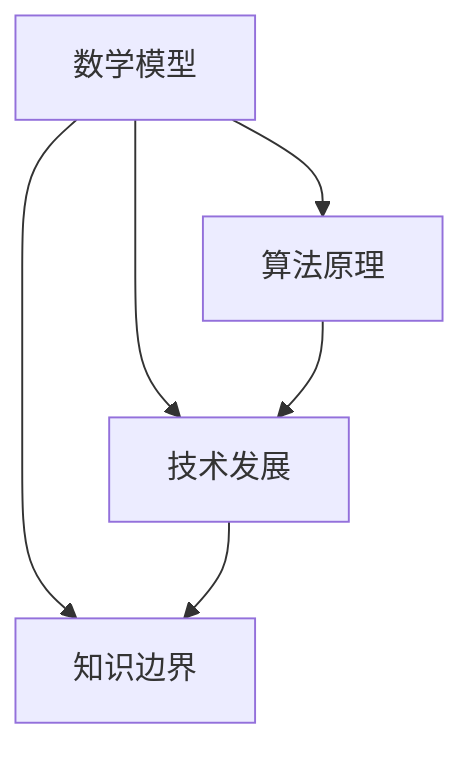

                 

关键词：人类知识边界、探索、技术发展、数学模型、算法原理、未来展望

> 摘要：本文旨在探讨人类知识边界的无限扩展与追求，分析技术发展的驱动力，阐述数学模型与算法原理的重要性，并展望未来的发展方向和挑战。文章结构清晰，内容详实，旨在为读者提供一次深入的技术思考之旅。

## 1. 背景介绍

自人类文明起源以来，探索与知识追求一直是推动社会进步的重要动力。从早期的火的使用到现代科技的崛起，人类的智慧和能力不断突破自身的界限。然而，知识的发展并非一帆风顺，其中充满了挑战与困难。如今，我们站在知识的大门口，面临着前所未有的机遇与挑战。

首先，技术的快速发展使得知识的获取和传播变得更加便捷。互联网的普及和大数据技术的应用，使得海量的信息触手可及。这不仅丰富了人类的知识库，也改变了我们的生活方式。然而，与此同时，信息的爆炸也带来了一系列问题，如信息过载、数据隐私和安全等。

其次，数学模型和算法原理的进步推动了各个领域的创新。从经济学到生物学，从物理学到计算机科学，数学模型和算法原理的运用无处不在。这些模型和算法不仅帮助我们更好地理解世界，也为解决复杂问题提供了有力的工具。

最后，人类的知识边界在不断扩大。随着科学技术的进步，我们能够探索的范围越来越广，从微观的量子世界到宏观的宇宙边界，人类的知识体系不断扩展。然而，这并不意味着我们已经掌握了所有的知识，相反，人类的知识边界仍然充满无限的可能性。

## 2. 核心概念与联系

在探讨人类的知识边界时，我们需要明确一些核心概念和原理，以便更好地理解知识的发展过程。

### 2.1 数学模型

数学模型是描述现实世界的一种抽象方式，它通过数学公式和方程来描述系统的行为和特征。数学模型在各个领域都有广泛的应用，如经济学中的供需模型、物理学中的牛顿力学模型等。

### 2.2 算法原理

算法原理是解决问题的方法和步骤，它通过一系列的操作来处理数据，以实现特定的目标。算法原理在计算机科学中占据核心地位，如排序算法、搜索算法等。

### 2.3 技术发展

技术发展是推动知识边界扩展的重要力量。从蒸汽机到互联网，从电报到人工智能，技术的进步不断改变着我们的生活。技术的发展不仅带来了新的工具和资源，也拓展了我们的认知能力。

### 2.4 知识边界

知识边界是指人类对世界的认知范围，它是随着时间和技术的发展而不断扩展的。知识边界的扩展意味着我们对世界的理解更加深入，但也带来了新的挑战和问题。

为了更好地理解这些核心概念和原理之间的联系，我们可以使用Mermaid流程图来展示它们之间的关系：



在这个流程图中，数学模型、算法原理、技术发展和知识边界构成了一个相互关联的生态系统，它们相互促进、相互影响。

## 3. 核心算法原理 & 具体操作步骤

### 3.1 算法原理概述

核心算法原理是指在解决特定问题时，采用的基本方法和思路。在计算机科学中，核心算法原理包括排序、搜索、图论算法等。这些算法原理不仅具有理论上的重要性，而且在实际应用中也有着广泛的应用。

### 3.2 算法步骤详解

以排序算法为例，排序是指将一组数据按照一定的顺序进行排列。常见的排序算法有冒泡排序、选择排序、插入排序等。下面以冒泡排序为例，介绍其具体步骤：

1. 从第一个元素开始，相邻两个元素进行比较，如果第一个元素大于第二个元素，则交换它们的位置。
2. 继续对下一个元素进行同样的比较和交换，直到最后一个元素。
3. 重复上述步骤，直到没有需要交换的元素。

### 3.3 算法优缺点

冒泡排序的优点是简单易懂，易于实现。然而，它的缺点是效率较低，尤其是对于大数据集。此外，冒泡排序是一种稳定的排序算法，即相等的元素在排序后仍然保持原有的相对顺序。

### 3.4 算法应用领域

冒泡排序算法在许多领域都有应用，如数据预处理、排序任务等。此外，冒泡排序也是许多更复杂排序算法的基础。

### 3.5 其他算法原理

除了冒泡排序，还有许多其他的算法原理，如二分搜索、快速排序等。这些算法原理在各自的领域都有广泛的应用，如数据库搜索、文件排序等。

## 4. 数学模型和公式 & 详细讲解 & 举例说明

### 4.1 数学模型构建

数学模型构建是解决实际问题的第一步，它通过数学公式和方程来描述现实世界的现象。以经济学中的供需模型为例，供需模型通过供需函数来描述市场中的商品价格和数量。

### 4.2 公式推导过程

供需模型的基本公式为：

$$
Q_D = Q_S
$$

其中，$Q_D$ 表示需求量，$Q_S$ 表示供应量。需求函数和供应函数可以分别表示为：

$$
Q_D = a - bP
$$

$$
Q_S = c + dP
$$

其中，$P$ 表示价格，$a$、$b$、$c$、$d$ 是常数。

通过将需求函数和供应函数相等，可以得到均衡价格：

$$
a - bP = c + dP
$$

$$
P = \frac{a - c}{b + d}
$$

### 4.3 案例分析与讲解

假设一个市场中有100个消费者和10个供应商，消费者对商品的需求函数为 $Q_D = 200 - 2P$，供应商对商品的供应函数为 $Q_S = 100 + P$。通过求解均衡价格，可以得到：

$$
P = \frac{200 - 100}{2 + 1} = 50
$$

此时，均衡价格为50，需求量为100，供应量也为100，市场达到均衡状态。

### 4.4 其他数学模型

除了供需模型，还有许多其他的数学模型，如博弈论、控制论等。这些模型在各自的领域都有广泛的应用，帮助我们更好地理解和解决实际问题。

## 5. 项目实践：代码实例和详细解释说明

### 5.1 开发环境搭建

为了实现本文中的算法和模型，我们需要搭建一个开发环境。这里我们使用Python作为开发语言，因为Python具有简洁的语法和丰富的库支持。

1. 安装Python：访问Python官网（https://www.python.org/），下载并安装Python 3.x版本。
2. 安装必要的库：在命令行中运行以下命令，安装所需的库。

```bash
pip install matplotlib numpy
```

### 5.2 源代码详细实现

下面是一个简单的Python代码实例，用于实现供需模型并绘制价格-数量曲线。

```python
import matplotlib.pyplot as plt
import numpy as np

# 定义需求函数和供应函数
def demand(price):
    return 200 - 2 * price

def supply(price):
    return 100 + price

# 求解均衡价格
def find_equilibrium():
    price = (200 - 100) / (2 + 1)
    return price

# 绘制价格-数量曲线
def plot_curve():
    prices = np.linspace(0, 200, 1000)
    quantities = np.zeros_like(prices)
    
    for i, price in enumerate(prices):
        quantities[i] = demand(price)
        quantities[i] = supply(price)
    
    plt.plot(prices, quantities, label='Demand')
    plt.plot(prices, -quantities, label='Supply')
    plt.axhline(y=find_equilibrium(), color='r', linestyle='--', label='Equilibrium')
    plt.xlabel('Price')
    plt.ylabel('Quantity')
    plt.legend()
    plt.show()

# 运行代码
if __name__ == '__main__':
    plot_curve()
```

### 5.3 代码解读与分析

这段代码首先导入了所需的库，包括matplotlib和numpy。然后定义了需求函数和供应函数，它们分别表示为 $Q_D = 200 - 2P$ 和 $Q_S = 100 + P$。接下来，我们定义了一个函数 `find_equilibrium` 用于求解均衡价格。

在 `plot_curve` 函数中，我们使用 numpy 的 `linspace` 函数生成一个价格数组，范围从0到200，共1000个点。然后，我们分别计算每个价格下的需求量和供应量，并将结果绘制为价格-数量曲线。

### 5.4 运行结果展示

运行这段代码后，我们得到一张价格-数量曲线图。这张图展示了需求曲线、供应曲线以及均衡价格线。从图中可以看出，当价格为50时，需求量和供应量相等，市场达到均衡状态。

## 6. 实际应用场景

供需模型在实际应用中有着广泛的应用，如市场分析、资源分配、交通规划等。以下是一些具体的实际应用场景：

### 6.1 市场分析

在经济学中，供需模型可以帮助分析商品的市场价格和数量。通过调整模型参数，可以预测市场价格的变化趋势，为市场参与者提供决策依据。

### 6.2 资源分配

在资源分配领域，供需模型可以帮助优化资源的配置。例如，在电力系统中，供需模型可以用于预测电力需求，从而优化电力生产和分配。

### 6.3 交通规划

在交通规划中，供需模型可以用于分析交通流量和拥堵情况。通过调整道路容量和交通信号配置，可以优化交通流量，减少拥堵。

### 6.4 未来应用展望

随着人工智能和大数据技术的不断发展，供需模型的应用将越来越广泛。例如，在智能交通系统中，供需模型可以结合实时数据，实现更精准的交通流量预测和优化。

## 7. 工具和资源推荐

### 7.1 学习资源推荐

1. 《深度学习》（Goodfellow, Bengio, Courville著）：一本全面介绍深度学习理论的经典教材。
2. 《机器学习实战》：一本实用的机器学习指南，包含大量实际案例和代码实现。
3. 《Python编程：从入门到实践》：一本适合初学者的Python编程教材。

### 7.2 开发工具推荐

1. Jupyter Notebook：一款强大的交互式开发环境，适用于数据分析和机器学习。
2. PyCharm：一款功能强大的Python集成开发环境（IDE），适用于各种规模的开发项目。
3. Git：一款分布式版本控制工具，用于代码管理和协作开发。

### 7.3 相关论文推荐

1. "Deep Learning for Text Classification"（文本分类的深度学习）：一篇关于文本分类的深度学习论文，介绍了几种先进的文本分类方法。
2. "Neural Network Models for Long-term Dependency Language Modeling"（用于长期依赖语言模型的神经网络模型）：一篇关于神经网络在自然语言处理中应用的论文。
3. "Reinforcement Learning: An Introduction"（强化学习引论）：一本介绍强化学习基本理论和方法的入门书籍。

## 8. 总结：未来发展趋势与挑战

### 8.1 研究成果总结

近年来，人工智能、大数据和云计算等技术的快速发展，推动了人类知识边界的不断扩展。数学模型和算法原理在各个领域的应用取得了显著的成果，如深度学习在图像识别、自然语言处理等领域的突破。同时，技术的进步也带来了新的挑战，如数据隐私和安全、算法偏见等。

### 8.2 未来发展趋势

未来，人类知识边界将继续扩展，技术发展将更加智能化和自动化。人工智能、区块链、量子计算等新兴技术将有望推动知识创新和产业变革。同时，人类将更加关注可持续发展和社会责任，推动科技进步与人类福祉的结合。

### 8.3 面临的挑战

尽管技术发展前景广阔，但人类也面临着一系列挑战。数据隐私和安全、算法偏见、就业变革等问题的解决需要全社会的共同努力。此外，技术发展也可能带来新的伦理和社会问题，如人工智能的自主决策、机器伦理等。

### 8.4 研究展望

在未来的研究中，我们应重点关注以下几个方面：

1. 技术融合与创新：推动人工智能、大数据、区块链等技术的融合，探索新的应用场景。
2. 可解释性人工智能：提高人工智能算法的可解释性，增强人类对人工智能的理解和信任。
3. 数据隐私和安全：加强数据隐私保护，确保用户隐私和安全。
4. 伦理和社会问题：深入探讨技术发展的伦理和社会影响，推动技术伦理建设。

总之，人类的知识边界是无限的，探索与追求是推动社会进步的不竭动力。面对未来，我们既要看到机遇，也要应对挑战，携手共创美好未来。

## 9. 附录：常见问题与解答

### 9.1 什么是数学模型？

数学模型是使用数学语言描述现实世界现象和问题的工具。它通过建立数学公式和方程来模拟和分析现实问题，从而帮助我们更好地理解和解决实际问题。

### 9.2 什么是算法原理？

算法原理是解决特定问题的方法和步骤。它是通过一系列操作来处理数据，以实现特定目标的过程。算法原理在计算机科学、工程学和经济学等领域都有广泛的应用。

### 9.3 人工智能的发展对人类有什么影响？

人工智能的发展对人类有着深远的影响。它不仅改变了我们的生活方式和工作方式，也带来了新的挑战和问题，如数据隐私和安全、算法偏见等。然而，人工智能也有望为人类带来更多便利和创新。

### 9.4 如何学习人工智能？

学习人工智能需要掌握数学、计算机科学和统计学等基础知识。同时，可以通过阅读相关书籍、参加在线课程和项目实践来提升自己的技能。一些知名的在线学习平台，如Coursera、edX等，提供了丰富的人工智能课程。

### 9.5 什么是深度学习？

深度学习是一种人工智能的分支，它通过模拟人脑神经网络的结构和功能来处理和解释复杂数据。深度学习在图像识别、自然语言处理和语音识别等领域取得了显著的成果。

### 9.6 什么是区块链？

区块链是一种分布式数据库技术，它通过去中心化的方式记录交易数据。区块链技术在金融、物流和供应链管理等领域有着广泛的应用，它有助于提高数据的透明度和安全性。

### 9.7 什么是量子计算？

量子计算是一种基于量子力学原理的计算方法。与传统的计算方法不同，量子计算利用量子位（qubit）和量子叠加态来实现高速计算。量子计算在密码学、优化问题和模拟量子系统等领域具有巨大潜力。

### 9.8 什么是可持续发展？

可持续发展是指满足当前需求而不损害子孙后代满足其需求的能力。它强调经济增长、社会进步和环境保护的协调发展，旨在实现长期的可持续性。

### 9.9 什么是数据隐私和安全？

数据隐私和安全是指保护个人信息和数据不被未经授权的访问、使用、泄露或篡改。随着大数据和云计算的发展，数据隐私和安全成为了一个重要问题。

### 9.10 什么是算法偏见？

算法偏见是指算法在处理数据时产生的系统性偏差，可能导致不公平或歧视性的结果。算法偏见可能源于数据的不平衡、模型的缺陷或算法的设计问题。

### 9.11 什么是就业变革？

就业变革是指由于技术进步和产业变革导致就业结构和就业方式的变化。一些传统岗位可能被自动化和智能化技术取代，同时也创造了新的就业机会。

### 9.12 什么是技术伦理？

技术伦理是指关于技术发展和应用的伦理原则和规范。它关注技术对社会、环境和人类福祉的影响，旨在引导技术的健康发展。技术伦理包括数据隐私、算法偏见、机器人权利等领域。

