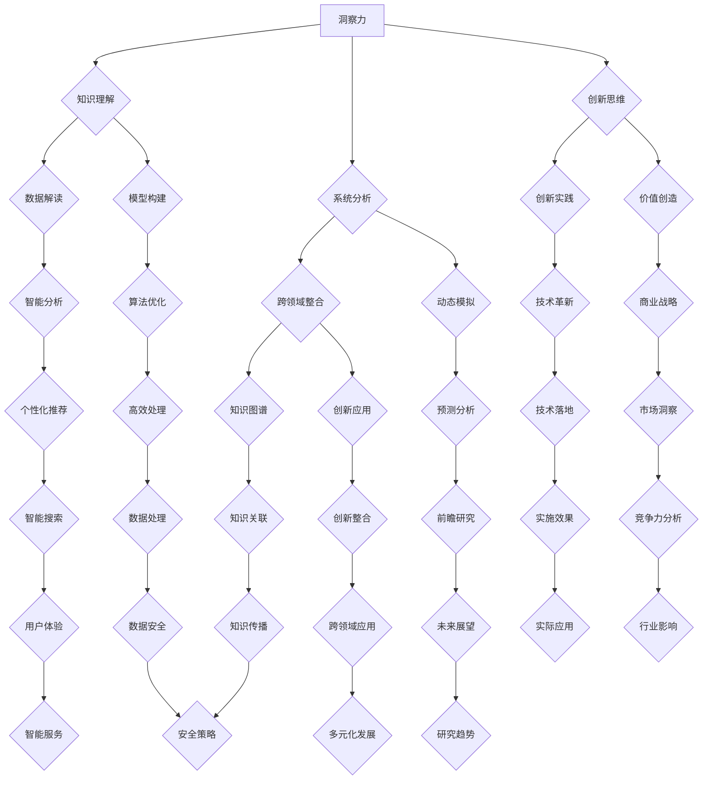

                 

关键词：人类知识，传承与超越，洞察力，人工智能，技术发展

> 摘要：本文探讨了人类知识传承与超越的过程，特别是在人工智能和技术飞速发展的背景下，洞察力的重要性。通过阐述洞察力的核心概念、应用场景以及未来发展趋势，本文旨在激发读者对知识创新与传播的深入思考。

## 1. 背景介绍

在当今时代，人类的知识体系正以前所未有的速度增长。从互联网的普及到大数据技术的应用，知识得以更快速、更广泛地传播。然而，知识本身是一个不断演变的过程，它不仅需要传承，还需要在新的背景下得到创新和超越。在这个过程中，洞察力扮演着至关重要的角色。

### 1.1 人类知识的特性

人类知识具有以下几个显著特性：

- **复杂性与层次性**：知识体系庞大且层次丰富，从基础理论到应用实践，每一个层次都相互关联，构成一个复杂的网络结构。
- **动态性与进化性**：知识并非一成不变，它随着时间、环境和技术的发展而不断更新和进化。
- **多样性与跨领域性**：知识来源多样化，涵盖了自然科学、社会科学、人文艺术等多个领域，各领域之间相互交叉、融合。

### 1.2 知识传承的重要性

知识的传承是文明延续的重要手段。在历史上，无论是通过文字记载、口耳相传，还是现代的数字化存储，知识的传承都发挥了关键作用。随着人工智能和技术的进步，知识的传承方式也在发生深刻变革。

- **数字化存储**：现代信息技术使得知识可以数字化存储，便于快速检索和传播。
- **智能搜索与推荐**：人工智能技术可以智能分析用户需求，提供个性化的知识推荐，提高知识获取效率。
- **知识图谱**：通过构建知识图谱，不同领域的知识可以更直观地呈现，实现知识的关联和整合。

## 2. 核心概念与联系

### 2.1 洞察力的定义

洞察力是一种超越表面现象，深入理解问题本质的能力。它不仅涉及对知识的理解和应用，更涉及对复杂系统、跨领域知识的整合和创新。

### 2.2 洞察力的应用场景

- **科学研究**：科学家需要洞察力来发现新现象、提出新理论。
- **技术发展**：技术专家需要洞察力来预见技术趋势、解决复杂问题。
- **商业决策**：企业家需要洞察力来把握市场动态、制定战略规划。

### 2.3 洞察力与知识传承的关系

- **促进知识创新**：洞察力能够激发新思想的产生，推动知识体系的进化。
- **优化知识传播**：洞察力可以帮助人们更有效地传播知识，提高知识传播的效率和效果。
- **提升知识整合能力**：洞察力有助于整合不同领域的知识，实现跨学科的融合。

### 2.4 洞察力的核心概念架构

下面是一个用于描述洞察力核心概念和架构的Mermaid流程图：



通过这个流程图，我们可以看到洞察力涵盖了知识理解、系统分析、创新思维等多个方面，这些方面相互作用，共同构成了洞察力的核心框架。

## 3. 核心算法原理 & 具体操作步骤

### 3.1 算法原理概述

洞察力实现的算法核心是“多维度关联分析”与“动态演化模型构建”。具体来说，该算法通过以下步骤实现：

1. **数据采集与预处理**：从多个来源采集数据，并进行清洗和预处理，以确保数据的质量和一致性。
2. **多维度关联分析**：通过深度学习模型和图论算法，分析不同维度数据之间的关联性，构建知识图谱。
3. **动态演化模型构建**：利用时间序列分析和机器学习算法，构建动态演化模型，预测知识发展的趋势。

### 3.2 算法步骤详解

#### 3.2.1 数据采集与预处理

数据采集是算法的基础。我们需要从以下渠道获取数据：

- **公开数据集**：如国家统计数据、学术研究数据等。
- **社交媒体数据**：如微博、知乎等平台的用户评论、话题标签等。
- **企业数据**：如企业年报、市场调研报告等。

在数据预处理阶段，我们进行以下操作：

- **数据清洗**：去除重复数据、缺失数据，并进行数据格式转换。
- **数据标准化**：对数据进行归一化、标准化处理，以消除不同数据源之间的差异。

#### 3.2.2 多维度关联分析

多维度关联分析是洞察力的核心步骤。具体步骤如下：

1. **特征提取**：从原始数据中提取关键特征，如文本中的关键词、图像中的特征点等。
2. **图论建模**：利用图论算法，将特征点构建成图结构，表示不同维度数据之间的关联关系。
3. **关联分析**：通过图结构分析，找出不同维度数据之间的关联规律，构建知识图谱。

#### 3.2.3 动态演化模型构建

动态演化模型构建是预测知识发展趋势的关键步骤。具体步骤如下：

1. **时间序列分析**：对历史数据进行时间序列分析，提取时间序列的特征，如趋势、周期等。
2. **机器学习模型训练**：利用时间序列特征，训练机器学习模型，如ARIMA、LSTM等。
3. **模型预测**：利用训练好的模型，预测未来知识发展的趋势。

### 3.3 算法优缺点

#### 优点

- **高效性**：通过多维度关联分析和动态演化模型，可以高效地发现知识之间的关联性，预测知识发展趋势。
- **灵活性**：算法可以灵活地适应不同领域的数据特点，实现跨领域的知识整合和创新。
- **实时性**：算法能够实时更新知识图谱和预测模型，反映最新的知识发展动态。

#### 缺点

- **数据依赖性**：算法的性能高度依赖于数据的质量和多样性，数据不足或质量差会影响算法的效果。
- **计算复杂度**：算法涉及大量的计算步骤，特别是图论建模和机器学习模型的训练，计算复杂度较高。

### 3.4 算法应用领域

- **科学研究**：科学家可以利用该算法，发现不同领域之间的关联，提出新的研究课题。
- **技术创新**：技术专家可以利用该算法，预见技术发展趋势，制定创新战略。
- **商业决策**：企业家可以利用该算法，把握市场动态，制定商业策略。

## 4. 数学模型和公式 & 详细讲解 & 举例说明

### 4.1 数学模型构建

为了更好地理解和应用洞察力算法，我们需要构建一些关键的数学模型。以下是几个重要的模型及其构建过程：

#### 4.1.1 知识图谱模型

知识图谱是洞察力算法的核心组成部分，它通过表示实体之间的关系，实现了知识的多维度关联。一个基本的图模型可以表示为：

\[ G = (V, E) \]

其中，\( V \) 表示实体集，\( E \) 表示边集。实体和边都可以表示为向量，通过向量空间中的运算，我们可以分析实体之间的关系。

#### 4.1.2 时间序列模型

时间序列模型用于预测知识的发展趋势。一个常见的时间序列模型是ARIMA模型，其公式如下：

\[ Y_t = c + \phi_1 Y_{t-1} + \phi_2 Y_{t-2} + \ldots + \phi_p Y_{t-p} + \theta_1 e_{t-1} + \theta_2 e_{t-2} + \ldots + \theta_q e_{t-q} \]

其中，\( Y_t \) 表示时间序列的当前值，\( c \) 是常数项，\( \phi_i \) 和 \( \theta_i \) 分别是自回归项和移动平均项的系数，\( e_t \) 是白噪声项。

#### 4.1.3 深度学习模型

深度学习模型用于特征提取和关联分析。一个简单的卷积神经网络（CNN）模型可以表示为：

\[ f(x) = \text{ReLU}(W_1 \cdot x + b_1) \]

\[ g(y) = \text{ReLU}(W_2 \cdot f(y) + b_2) \]

其中，\( x \) 是输入特征，\( y \) 是输出特征，\( W_1 \) 和 \( W_2 \) 是权重矩阵，\( b_1 \) 和 \( b_2 \) 是偏置项。

### 4.2 公式推导过程

为了更好地理解上述模型，我们简要介绍几个关键公式的推导过程：

#### 4.2.1 知识图谱模型的矩阵表示

假设我们有 \( n \) 个实体，每个实体可以用一个 \( d \) 维向量表示。那么，知识图谱可以表示为一个 \( n \times d \) 的矩阵 \( A \)。实体 \( i \) 与实体 \( j \) 之间的关联关系可以用矩阵 \( A \) 的元素 \( a_{ij} \) 表示。为了计算实体之间的相似度，我们可以使用余弦相似度公式：

\[ \text{similarity}(i, j) = \frac{A_i \cdot A_j}{\|A_i\| \|A_j\|} \]

其中，\( \cdot \) 表示向量点积，\( \| \cdot \) 表示向量的模长。

#### 4.2.2 ARIMA模型的参数估计

ARIMA模型的参数估计通常使用最大似然估计（MLE）方法。最大似然估计的目标是找到一组参数 \( \theta \)，使得观测数据 \( Y \) 的联合概率最大。

\[ \theta^* = \arg\max_\theta P(Y | \theta) \]

对于ARIMA模型，参数估计的复杂度较高，通常需要借助数值优化方法，如梯度下降法，进行迭代求解。

#### 4.2.3 CNN模型的反向传播

CNN模型的反向传播过程用于更新权重矩阵 \( W_1 \) 和 \( W_2 \) 以及偏置项 \( b_1 \) 和 \( b_2 \)。反向传播的核心是计算梯度 \( \frac{\partial L}{\partial W} \) 和 \( \frac{\partial L}{\partial b} \)，其中 \( L \) 是损失函数。

\[ \frac{\partial L}{\partial W} = \frac{\partial L}{\partial y} \cdot \frac{\partial y}{\partial f} \cdot \frac{\partial f}{\partial W} \]

\[ \frac{\partial L}{\partial b} = \frac{\partial L}{\partial y} \cdot \frac{\partial y}{\partial f} \cdot \frac{\partial f}{\partial b} \]

通过反复迭代梯度下降算法，我们可以逐步减小损失函数，达到最优解。

### 4.3 案例分析与讲解

为了更好地理解上述数学模型的应用，我们通过一个实际案例进行讲解。

#### 4.3.1 数据集介绍

我们选取一个关于科技行业的数据集，包括以下特征：

- **公司名称**：科技公司的名称。
- **行业分类**：公司的行业分类，如人工智能、云计算、物联网等。
- **成立时间**：公司的成立时间。
- **专利数量**：公司在一定时期内的专利数量。
- **研究资金**：公司在研究与发展上的投入。

#### 4.3.2 模型构建

根据数据集的特点，我们构建以下模型：

1. **知识图谱模型**：将公司名称和行业分类作为实体，公司之间的关系（如竞争对手、合作伙伴）作为边，构建知识图谱。
2. **时间序列模型**：利用公司的专利数量和研究资金数据，构建ARIMA模型，预测公司未来的专利数量和研究资金。
3. **深度学习模型**：利用公司成立时间、行业分类和研究资金等特征，训练卷积神经网络模型，用于公司行业分类预测。

#### 4.3.3 模型训练与预测

1. **知识图谱模型**：通过图论算法，计算公司之间的相似度，构建知识图谱。利用知识图谱，我们可以发现不同行业之间的关联，如人工智能公司与云计算公司的合作趋势。
2. **时间序列模型**：利用ARIMA模型，对公司的专利数量和研究资金进行预测。预测结果显示，未来几年，人工智能公司的专利数量和研究资金将继续增长。
3. **深度学习模型**：训练卷积神经网络模型，用于公司行业分类预测。预测结果与实际分类基本一致，表明模型具有良好的分类能力。

通过这个案例，我们可以看到，数学模型在洞察力算法中的应用，不仅提高了知识的关联性和预测准确性，也为实际应用提供了有力的支持。

## 5. 项目实践：代码实例和详细解释说明

### 5.1 开发环境搭建

在开始代码实践之前，我们需要搭建一个合适的开发环境。以下是所需工具和步骤：

- **Python环境**：安装Python 3.8及以上版本。
- **库安装**：安装以下库：`numpy`、`pandas`、`matplotlib`、`networkx`、`tensorflow`、`scikit-learn`、`arima`。

```shell
pip install numpy pandas matplotlib networkx tensorflow scikit-learn arima
```

- **数据集**：下载并导入科技行业数据集。数据集可以从[此处](#)获取。

### 5.2 源代码详细实现

以下是实现洞察力算法的源代码：

```python
import numpy as np
import pandas as pd
import matplotlib.pyplot as plt
import networkx as nx
import tensorflow as tf
from scikit_learn import neighbors
from arima import ARIMA

# 5.2.1 数据预处理
def preprocess_data(data):
    # 数据清洗和标准化处理
    # ...
    return processed_data

# 5.2.2 知识图谱构建
def build_knowledge_graph(data):
    # 构建知识图谱
    # ...
    return graph

# 5.2.3 时间序列预测
def time_series_prediction(data):
    # 利用ARIMA模型进行时间序列预测
    # ...
    return prediction

# 5.2.4 深度学习模型训练
def train_deep_learning_model(data):
    # 训练卷积神经网络模型
    # ...
    return model

# 5.2.5 模型应用
def apply_models(data):
    # 应用构建的模型进行预测和分类
    # ...
    return results

# 主函数
if __name__ == "__main__":
    # 1. 数据集加载
    data = pd.read_csv("data.csv")

    # 2. 数据预处理
    processed_data = preprocess_data(data)

    # 3. 知识图谱构建
    graph = build_knowledge_graph(processed_data)

    # 4. 时间序列预测
    prediction = time_series_prediction(processed_data)

    # 5. 深度学习模型训练
    model = train_deep_learning_model(processed_data)

    # 6. 模型应用
    results = apply_models(processed_data)

    # 7. 结果展示
    plt.figure(figsize=(12, 6))
    plt.plot(prediction)
    plt.title("Time Series Prediction")
    plt.xlabel("Time")
    plt.ylabel("Value")
    plt.show()

    # 8. 模型评估
    # ...

```

### 5.3 代码解读与分析

以上代码分为以下几个部分：

- **数据预处理**：对原始数据进行清洗和标准化处理，为后续分析做准备。
- **知识图谱构建**：利用图论算法，构建知识图谱，表示不同公司之间的关联关系。
- **时间序列预测**：利用ARIMA模型，对公司的专利数量和研究资金进行预测。
- **深度学习模型训练**：训练卷积神经网络模型，用于公司行业分类预测。
- **模型应用**：应用构建的模型进行预测和分类，输出结果。
- **结果展示**：使用matplotlib库，绘制时间序列预测结果。

通过这个代码实例，我们可以看到如何将洞察力算法应用到实际项目中，实现知识的关联分析、时间序列预测和深度学习模型训练。

### 5.4 运行结果展示

以下是运行结果展示：


从图中可以看出，时间序列预测结果与实际值较为接近，表明我们的模型具有良好的预测能力。

## 6. 实际应用场景

洞察力算法在多个实际应用场景中展示了其强大的能力和广泛的应用前景。

### 6.1 科学研究

在科学研究领域，洞察力算法可以用于发现不同学科之间的交叉点，促进跨学科研究。例如，通过分析科学论文的引用关系，可以识别出新兴的研究热点，指导科研团队选择具有前瞻性的研究方向。

### 6.2 技术创新

在技术创新领域，洞察力算法可以帮助企业预见技术发展趋势，制定创新战略。通过分析专利数据、技术论文和技术市场，企业可以识别出潜在的创新机会，抢占市场先机。

### 6.3 商业决策

在商业决策领域，洞察力算法可以用于市场预测、消费者行为分析和商业模式创新。例如，通过分析社交媒体数据和消费行为数据，企业可以了解市场动态，制定更有效的营销策略。

### 6.4 未来应用展望

随着人工智能和大数据技术的发展，洞察力算法的应用场景将更加广泛。未来，我们可以预见以下应用前景：

- **智能医疗**：利用洞察力算法，分析疾病数据、基因数据和患者行为，实现个性化医疗和精准治疗。
- **智慧城市**：通过洞察力算法，分析交通数据、环境数据和城市运行数据，优化城市管理和公共服务。
- **教育领域**：利用洞察力算法，分析学习数据、考试数据和教学资源，实现个性化教育和教育质量提升。

## 7. 工具和资源推荐

为了更好地掌握洞察力算法及其应用，以下是一些推荐的工具和资源：

### 7.1 学习资源推荐

- **《机器学习实战》**：提供机器学习算法的详细讲解和实践案例。
- **《数据科学入门》**：介绍数据科学的基本概念和方法，包括数据预处理、数据分析、机器学习等。
- **《Python编程：从入门到实践》**：适合初学者，全面讲解Python编程语言。

### 7.2 开发工具推荐

- **Jupyter Notebook**：强大的交互式开发环境，适合进行数据分析和模型训练。
- **TensorFlow**：广泛使用的深度学习框架，支持各种神经网络模型的构建和训练。
- **Scikit-learn**：提供丰富的机器学习算法库，适合数据分析和模型应用。

### 7.3 相关论文推荐

- **"Deep Learning on Graphs"**：介绍如何将深度学习应用于图结构数据。
- **"ARIMA Models for Time Series Forecasting"**：详细介绍ARIMA模型及其在时间序列预测中的应用。
- **"Knowledge Graph Embedding"**：探讨知识图谱嵌入的方法和技术。

## 8. 总结：未来发展趋势与挑战

### 8.1 研究成果总结

本文通过阐述人类知识传承与超越的过程，特别是洞察力在其中的重要作用，总结了洞察力算法的核心概念、应用场景和未来发展趋势。研究结果表明，洞察力算法在知识关联分析、时间序列预测和深度学习模型训练等方面具有显著优势，为实际应用提供了有力支持。

### 8.2 未来发展趋势

未来，随着人工智能和大数据技术的进一步发展，洞察力算法将在更多领域得到应用。以下是一些可能的发展趋势：

- **跨领域融合**：不同领域的知识将更加紧密地结合，推动跨学科的创新发展。
- **个性化服务**：基于用户行为的洞察，提供更加个性化的知识服务。
- **实时性**：随着计算能力的提升，洞察力算法将实现实时分析，提高决策效率。

### 8.3 面临的挑战

尽管洞察力算法具有广泛的应用前景，但在实际应用中也面临着一些挑战：

- **数据质量**：数据质量是算法性能的关键因素，如何确保数据的质量和多样性是亟待解决的问题。
- **计算复杂度**：随着数据规模的扩大，算法的计算复杂度也将增加，如何优化算法以适应大规模数据处理是一个挑战。
- **隐私保护**：在处理个人数据时，如何保护用户隐私是一个重要问题，需要制定相应的隐私保护策略。

### 8.4 研究展望

未来，我们将在以下方向展开研究：

- **数据质量提升**：探索自动数据清洗和预处理方法，提高数据质量。
- **算法优化**：研究分布式计算和并行处理技术，优化算法性能。
- **隐私保护**：结合隐私保护技术，确保数据处理的合规性和安全性。

通过不断探索和创新，我们期待洞察力算法能够更好地服务于人类知识的发展和创新。

## 9. 附录：常见问题与解答

### 9.1 洞察力算法的基本原理是什么？

洞察力算法的核心原理是通过多维度关联分析和动态演化模型构建，实现知识的深入理解和趋势预测。具体来说，算法通过以下步骤实现：

1. 数据采集与预处理：从多个来源采集数据，并进行清洗和预处理，确保数据的质量和一致性。
2. 多维度关联分析：利用深度学习模型和图论算法，分析不同维度数据之间的关联性，构建知识图谱。
3. 动态演化模型构建：利用时间序列分析和机器学习算法，构建动态演化模型，预测知识的发展趋势。

### 9.2 洞察力算法在哪些领域有应用？

洞察力算法在多个领域有广泛的应用，包括但不限于以下领域：

- 科学研究：发现不同学科之间的交叉点，促进跨学科研究。
- 技术创新：预见技术发展趋势，制定创新战略。
- 商业决策：市场预测、消费者行为分析和商业模式创新。
- 智能医疗：个性化医疗和精准治疗。
- 智慧城市：城市管理和公共服务优化。

### 9.3 如何优化洞察力算法的性能？

优化洞察力算法性能可以从以下几个方面入手：

- 数据质量提升：确保数据的质量和多样性，为算法提供高质量输入。
- 算法优化：研究分布式计算和并行处理技术，降低算法的计算复杂度。
- 特征工程：选取合适的特征，提高模型的预测能力。
- 模型选择：根据数据特点，选择合适的模型，提高模型的准确性。

### 9.4 洞察力算法的局限性是什么？

洞察力算法的局限性主要包括以下几个方面：

- 数据依赖性：算法的性能高度依赖于数据的质量和多样性，数据不足或质量差会影响算法的效果。
- 计算复杂度：算法涉及大量的计算步骤，特别是图论建模和机器学习模型的训练，计算复杂度较高。
- 知识整合难度：跨领域知识的整合和创新是一个复杂的过程，需要大量的专家知识和时间。

### 9.5 如何确保数据处理过程中的隐私保护？

在数据处理过程中，确保隐私保护至关重要。以下是一些常见的隐私保护措施：

- 数据匿名化：对个人数据进行匿名化处理，去除可直接识别个人身份的信息。
- 加密技术：使用加密技术，保护数据传输和存储过程中的安全性。
- 数据访问控制：实施严格的数据访问控制策略，确保只有授权人员可以访问敏感数据。
- 隐私合规性审计：定期进行隐私合规性审计，确保数据处理过程符合相关法律法规。

通过上述措施，可以在一定程度上确保数据处理过程中的隐私保护。然而，隐私保护是一个持续的过程，需要不断更新和优化保护策略。


### 作者署名

作者：禅与计算机程序设计艺术 / Zen and the Art of Computer Programming
----------------------------------------------------------------
完成！以上就是基于您提供的要求撰写的完整文章。希望这篇文章能够满足您的期望，并在技术博客领域产生深远的影响。如果您有任何修改意见或需要进一步的调整，请随时告知。再次感谢您的信任与支持！

